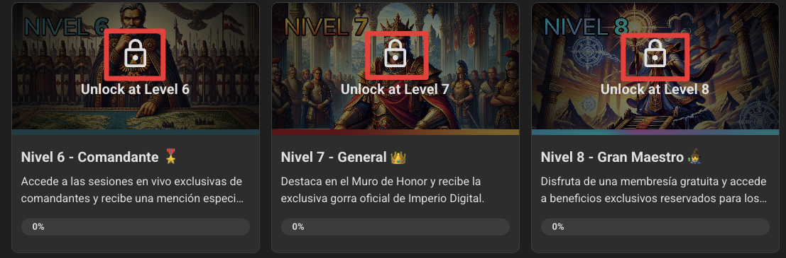
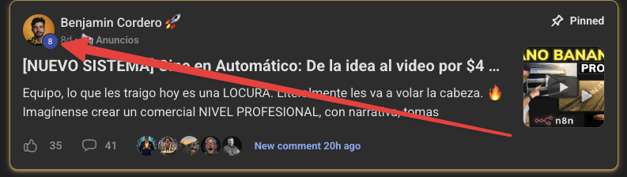

# 🏆 Niveles

> Ruta: ➡️ Empieza Aquí › 🏆 Niveles

**🎬 Vídeo (2.8 min):** https://www.loom.com/share/2ac1ea52638f4e0aab4e03b1abe58754

---

Si ya estuviste vitrineando, habrás notado dos cosas: Módulos con candado en el [Classroom](https://www.skool.com/imperio-digital/classroom) 

y miembros con un nivel numérico junto a su foto.

No es casualidad. En Imperio Digital no premiamos la asistencia, **premiamos la acción y la colaboración.**

Este sistema existe para asegurarnos de que aquí nos "apañemos" entre todos. Mientras más valor aportas (likes, comentarios, posts), más puntos ganas y mejores recompensas desbloqueas.

**🏆 EL MAPA DE RECOMPENSAS (LOOT)**

- **🔹 Nivel 2:** Fácil! Solo con presentarte desbloqueas el **Roadmap Personalizado** y el Glosario.
- **🔹 Nivel 3:** Acceso al **Portal de Ventas**. Aquí te enseño a monetizar estas habilidades y vender automatizaciones.
- **🔹 Nivel 4:** Mención en nuestro Instagram para destacar tu progreso.
- **🔹 Nivel 5:** Te mandamos la **Polera Oficial (Camiseta)** de Imperio Digital a tu casa. 👕
- **🔹 Nivel 6:** Entras a la élite. Acceso a las **Sesiones de Comandantes** (mensuales y privadas) + Mención en YouTube.
- **🔹 Nivel 7:** Te ganaste la **Gorra** exclusiva (tienes que usarla en las sesiones). 🧢
- **🔹 Nivel 8:** El Santo Grial. **Membresía GRATUITA de por vida.**
- **🔹 Nivel 9:** [CLASIFICADO] Solo pocos han llegado. Es secreto. 🤫

> **🚫  LA REGLA DE ORO** Somos una comunidad que habla de IA, **no una IA que habla en la comunidad.** 

No uses IA para escribir comentarios genéricos. Queremos leerte a TI. Si compartes contenido real y humano, subirás rápido. Si spameas con bots, no llegarás a ningún lado.

**🚀 HACKS PARA SUBIR RÁPIDO**

1. **Bienvenidas:** Ve a la categoría "[Presentación](https://www.skool.com/imperio-digital)" y saluda a los nuevos.
2. **Blueprints:** Si compartes una automatización con su plano (blueprint), podemos fijar tu post y te lloverán los likes.
3. **Pregunta y Responde:** No tengas miedo de aportar lo que sabes.

Si aún no te presentas, hazlo AHORA. Es la forma más rápida de subir al Nivel 2.

## 🎙️ Transcripción

Si ya exploraste el clasrum habrá notado que hay unos módulos que están con un candao y en las fotos de perfil de los integrantes hay un numerito que refleja su nivel. Bueno, esto no es casualidad, porque en imperio digital premiamos la acción y la colaboración. Mientras más valoraportas, es decir, más publicaciones hace, más likes te van dejando, más comentarios va dejando, más puntos ganas y mejores recursos pases, bloqueando. Esto es como juego, y la verdad es que es bastante entretenido. Te cuento alguno de los hitos más importantes. En el nivel 3 débloqueas un curso de cómo vender automatizaciones y soluciones de inteligencia artificial. O sea, no solamente aprendes automatizar y a construir con inteligencia artificial, sino que también aprendes a vender lo construido a terceros si es que esa es una área que te interesa. Ahí te entrego contratos, cuestionarios, propuestas, métodos y cómo comenzar a vender soluciones a otras empresas. En el nivel 6 desbloqueadas algo muy especial que es la reunión o la sesión de comandantes. Esto es básicamente el directorio de Imperio Digital. Una vez al menos nos juntamos un grupo selector con los imperiales más activos, es decir, con lo que tenía el 6 o superior, para evaluar las nuevas herramientas deía que van saliendo, las dinámicas dentro de la comunidad, qué es lo que se viene, qué vamos construyendo, qué podemos cambiar y básicamente tomar decisiones estratégicas de hacia dónde para la comunidad. es decir, cuando llegas a ese rango, pasas a ser parte de la toma de decisiones de la comunidad. Para que te haga una idea, la decisión de pasar de Make-A-N8N se tomó en una de estas reuniones. La decisión de profundizar en Cloud Code viajantes autónomos también se tomó ahí. Cada giro importante que ha dado esta comunidad nació en una sesión de comandantes. Y cuando llegas a nivel 6, tú puedes ser parte de esas decisiones. Además, ocasionalmente, también sorteamos el acceso a una de estas sesiones en las inducciones o bienvenidas. pero ya te voy a contar un poco más de eso en el próximo vídeo. Pero lo importante es que cuando llegue a nivel 6, va a poder ser parte de esta toma de decisiones. Y el nivel 8 sigue siendo el santo real, es decir, cuando llegue a nivel 8, conseguirás una membresía gratuita de por vida, y a más de 40 imperiales han llegado a este nivel. Pero tienes que llegar de manera real, aportando valor real, es decir, sin spam. Recordemos la regla de oro. Somos una comunidad que habla de día, no unaía que habla en la comunidad. Aporta valor real, comparte lo que construiste. ayuda a otros, al final el sistema está primando la autenticida y este es un muy buen momento para decirte que si es que aún no te has presentado áslo ahora, prácticamente cuando te presentas subes directamente a el nivel 2, es literalmente la forma más rápida de subir al nivel 2, así que lanzate, con 5 me gustas que consigas en tu publicación vas a conseguir 5 puntos y hacía en este nivel, así que anda, presentate y después vamos al siguiente video para ver tu inducción personalizada.
