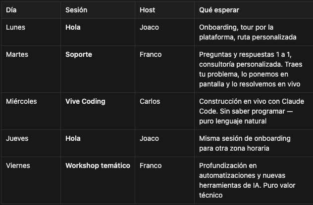

# 📅 Calendario

> Ruta: ➡️ Empieza Aquí › 📅 Calendario

**🎬 Vídeo (1.7 min):** https://www.loom.com/share/504ecfb94a8b44a094e2b8e4bb5c0bb1

---

Imperio Digital no es Netflix. Aquí venimos a interactuar y construir en tiempo real, con gente real.

En la pestaña [**Calendar**](https://www.skool.com/imperio-digital/calendar) encontrarás nuestra agenda semanal. El calendario se ajusta automáticamente a tu zona horaria.

### Entre 4 y 5 sesiones semanales (incluso a veces 6)

### Tu prioridad AHORA: Sesión Hola

Si recién te uniste, esta es TU sesión. Te recibimos, te damos un tour y te ayudamos a elegir tu ruta según lo que necesitas. No te quedes en la teoría — hay que lanzarse a la piscina.

### Tip: Sincroniza con tu calendario personal

Cada evento se puede agregar a tu Google Calendar, Outlook o el que uses. Así recibes el recordatorio y la URL de Zoom directo en tu calendario. Solo haz click en el evento y busca la opción de agregar.

**TU MISIÓN:** Agenda tu primera [**Sesión Hola**](https://www.skool.com/imperio-digital/calendar)..

RESUMEN sesiones (y puedes entrar a todas **SIN LÍMITE**):

- 👋 **Sesiones HOLA (Tu Prioridad AHORA):** Son inducciones en vivo. Joaco te recibe y te guía personalmente para que sepas qué ruta tomar según tu negocio. Si tienes dudas de cómo funciona la comunidad, este es el lugar.
- ⚡ **Soporte:** ¿Trabado? Entras, levantas la mano y lo destrabamos en vivo. Pura resolución de problemas técnicos.
- 💻 **Vibe Coding:** Construimos en vivo con Claude Code y las últimas herramientas de IA. Sin conocimiento previo de código requerido.
- 🛠️ **Sesiones Específicas:** Aquí enseñamos sistemas nuevos, estrategias de funnels o automatizaciones complejas. Es puro valor técnico y estratégico.
- 🎖️ **Sesiones de Comandantes:** Solo para la élite (Nivel 6+). Es donde el directorio se junta a tomar decisiones y compartir estrategias de alto nivel.

**TE PERDISTE UNA SESIÓN?** Tranquilo, todo queda grabado en el [**Classroom**](https://www.skool.com/imperio-digital/classroom):

- Las "Sesiones de Soporte" van al módulo de [**Soporte**](https://www.skool.com/imperio-digital/classroom/13648a8b?md=53cf5122c0894b2aa9c9740014ef40e2).
- Las "Sesiones Específicas" van al módulo de [**Grabaciones**](https://www.skool.com/imperio-digital/classroom/bd45b8a3?md=f9a2cfde95974ecc8e101c86d3672471).

**TU MISIÓN:** Agenda tu primera [**Sesión HOLA**](https://www.skool.com/imperio-digital/calendar) para que te demos la bienvenida oficial y te ayudemos a trazar tu plan.

## 🎙️ Transcripción

¿En perro digital no es Netflix? No queremos que solamente te quedes viendo contenido y consumiendo videos pasivamente sin tomar acción. Aquí venimos a construir en tiempo real con gente real. Tenemos entre 4 y 5 sesiones en vivo cada semana e incluso 6. Y esto es una brutalidad de contenido. Los lunes y jueves tenemos sesiones, hola con Juaco. Y esa es tu prioridad en este mismo momento. Aquí es donde te recibimos, te guiamos, te mostramos una ruta del contenido personalizada, así que si te acaba de unir a agenda esta sesión de manera inmediata. Los martes tenemos sesiones de soporte con Fran. Aquí es donde tenemos sesiones de pregunta 1 a 1, consulturía personalizada, aquí tú traes tu problema, lo ponemos en pantalla y lo resolvemos en vivo. Los dias miércoles tenemos las sesiones de ViveCoding con Carlos. Aquí construimos aplicaciones y herramientas en vivo con Cloud Code, todo, sin saber programar y en lenguaje natural. Los viernes tenemos las sesiones de workshops temáticos con Fran. Aquí profundizamos en herramientas y automatizaciones con inteligencia artificial y es puro, puro valor para conocer nuevas herramientas, conocer nuevos sistemas que te pueden empezar a abrir un poco la cabeza de cosas que se pueden hacer. Y lo mejor de todo es que todo esto queda grabado. Entonces si te perdiste una sesión, puedes ir a Classroom a ver la sección de grabaciones y recuperarlas. Te voy a dar otro tip. Cada evento se puede agregar a tu calendario personal, es decir tu Google Calendar, tu Outlook, tu Apple, lo que uses y así te llega el recordatorio y el URL de la reunión de Zoom constantemente. Además el calendario es dinámico por lo que se ajusta a tu zona horaria de manera automática, así que tu próxima tarea es agendar la reunión, hola ahora mismo.
