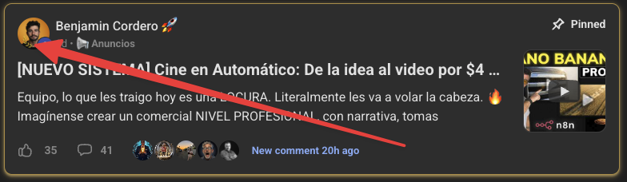
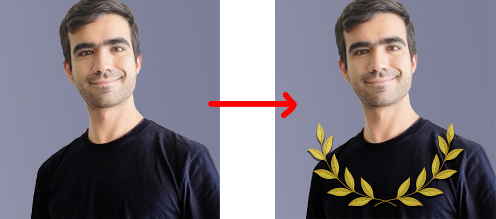
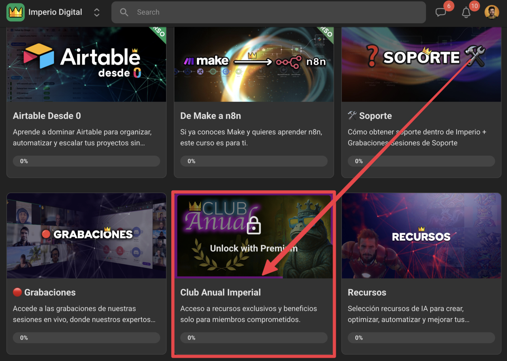
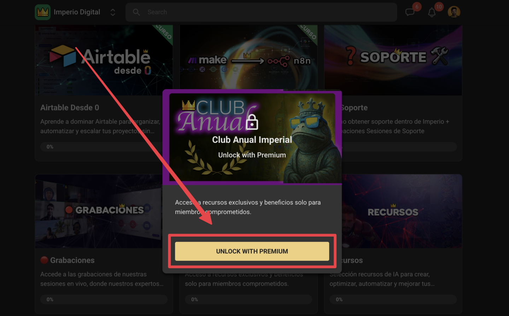
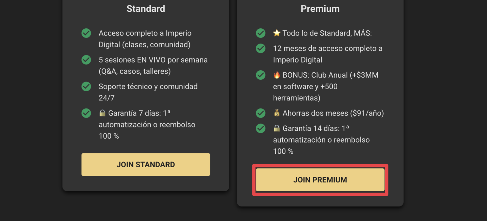

# ⭐️ Club Anual

> Ruta: ➡️ Empieza Aquí › ⭐️ Club Anual

**🎬 Vídeo (4.2 min):** https://www.loom.com/share/0ec78a54ffbf49e59bdda8e4ceea91c5

---

## **¿Qué es el Club Anual Imperial?**

El Club Anual es el **modo serio** dentro de Imperio Agéntico.

Es para quienes dicen:

> *“Voy en serio, mínimo 12 meses, con automatización, IA y sistemas.”*

Al entrar desbloqueas dos cosas al mismo tiempo:

- **12 meses completos** dentro de Imperio (comunidad, cursos, agentes, plantillas, soporte, sesiones en vivo).
- Acceso al **módulo privado del Club Anual**, con decenas de convenios y beneficios exclusivos.

**Acceso anual a Imperio + más de $3MM en software y +1000 herramientas exclusivas, todo dentro del **[**Club Anual Imperial**](https://www.skool.com/imperio/classroom/8676c3fc?md=9ab1b785ddd74a1780e75a1a592d381c)**.**  
  
**Q**uizás notaste algunos anillos de laureles en las fotos de perfil de algunos imperiales... 

Esto no es casualidad. Esto significa que son parte de algo más grande: **el Club Anual Imperial**.

El Club Anual es un módulo privado exclusivo para quienes tienen el **plan anual activo**.

## **Qué incluye el Club Anual**

Dentro del módulo encontrarás más de **1000 herramientas** y **millones de dólares en beneficios** negociados para la comunidad, con deals en:

- Automatización: n8n, Make, etc.
- Bases de datos y organización: Notion, Airtable.
- Email y prospección: Instantly, Mailchimp, Apollo.
- Formularios: Typeform.
- IA y agentes: Anthropic, Gemini API, OpenAI, Anthropic, LLM API, Chatbase, Veo…
- CRM y ventas: GoHighLevel, y más.
- Infraestructura y productividad: Google Workspace, DigitalOcean, AWS, Slack, etc.

Cada semana se añaden nuevas herramientas y condiciones especiales.

Hasta ahora, solo usando estos convenios, los miembros de Imperio en el último año ya han ahorrado:

> ***$435.114 USD en software.***

Los más usados hasta hoy: **Hostinger, ElevenLabs, OpenClaw, Monday y Google Workspace.**

Con **una o dos herramientas bien aprovechadas** puedes recuperar lo que inviertes en el anual y quedarte con 12 meses de Imperio por delante.

> 📌 **Nota: **Se siguen sumando nuevas herramientas y convenios. Lo que ves hoy es solo el inicio; todo lo nuevo que vayamos cerrando también queda dentro de tu acceso anual.

---

## **Cómo aplico al club**

1. Entra al [**Classroom**](https://www.skool.com/imperio-digital/classroom).
2. Entra al módulo **Club Anual Imperial** 
3. Haz clic en "UNLOCK WITH PREMIUM

1. Haz clic en **“JOIN PREMIUM”**.

Skool **descuenta automáticamente lo que ya pagaste este mes**, así que no pierdes nada por haber entrado antes.

Una vez dentro del Club:

- Se te desbloquea el módulo privado con todos los convenios.
- Puedes usar tu **Anillo Imperial** en tu perfil como distintivo del círculo anual.
- Y muy importante: baja a la publicación de abajo de este módulo y comenta algo como: > **“Ya soy parte del Club Anual”**  
> Así nos llega la notificación y terminamos de activar tu acceso completo y tu anillo.

---

## **¿Para quién es?**

El Club Anual **no es obligatorio**.

Es para quien siente que:

- Se va a quedar en Imperio **al menos un año**.
- Quiere sacarle **TODO el jugo** a la comunidad y al Club Anual.
- No quiere ver desde la ventana cómo el resto se adelanta con IA y sistemas.

Si eso resuena contigo, haz el upgrade y nos vemos dentro del Club Anual.  
Si todavía no, está perfecto seguir en mensual hasta que tenga sentido para ti.

## 🎙️ Transcripción

Si viste un anillo de laureles alrededor de las fotos de los miembros de algunos imperiales, no es decoración, significa que son parte del club anual imperial. Y si estás viendo este video, quiero que entiendas bien que es para ver si es que tiene sentido para ti, como tu modo serio dentro de imperio o no. El club anual es para la gente que dice, voy en serio, mínimo, 12 meses con automatización sistemas eía. Veamos que es lo que es lo que es al entrar, porque no son solamente 12 meses de imperio a el precio de 10, es decir, 2 meses de ahorro para literalmente todo lo que publicamos, comunidad, agentes, sistemas, plantillas, soporte, ecosistema, todo sin pensar en el pago mensual, sino que también se te abre el módulo privado de el club anual, que lo tenemos justamente acá en el classroom y es este mismo que estás viendo acá. Cuando acces vas a entrar a este enlace de acá y se te va a desbloquear el acceso a más de 1000 herramientas y más de 3 millones de dólares en software y convenios negociados exclusivamente para los imperiales. Literalmente encuentras deals que se ven para todas las personas. Aquí tenemos 6 meses gratis de noción con el plan business con y a ilimitada, súper simple. Instantly tenemos y levenlabs con un sogratuito de vos. Tenemos en ocho en la mitad de presión el plan business. Creditos en Gemina Yapi, créditos en Google Ads, créditos también en OpenEI. Si tienes una empresa también con página web y este está brutal porque se acaba de agregar mil dólares en créditos para los modelos de Antrópica, través de la API de OpenRouter. Entonces son mil dólares en créditos de API, lo que es realmente una brutalidad. Este sí tiene un par de condiciones que es que tienes que estar construyendo algún producto nativo de día y tener un sitio web y una empresa activa, también tiene que estar autofinanciada, que es para la mayoría de los casos, periódos de prueba en school, bueno, sapier, opening up, que lo usamos para los tip links, air tables, type, make, Shopify, Slack, HubSpot y así tenemos 17 páginas literalmente de puros descuentos, o sea, todos estos son puros descuentos que fueron negociados exclusivamente para la gente de imperio de el club anual. Cada semana también vamos a ir agregando nuevos descuentos, vamos a siempre intentar de estar negociando más y más descuentos para la gente que está metida dentro del club. Y hasta ahora solo usando estos convenios en los últimos 7 días, los miembros han ahorrado más de 33 mil dólares en software en ápigen con venios. Si es que nos vamos a el último año este número y esta cifra haciendo a los 493 mil dólares y si es que hemos los convenios que más han usado son los 6 meses gratis de noshon en el e-lapse hosting gemina y api open-clock y para mí esto es una decisión lógica si es que estás comprometido a largo plazo a construir conía porque simplemente con una o con dos de estas herramientas bien aprovechadas puedes recuperar lo que invertiste en el club anual y no le demos lo más importante de quedarte 12 meses en imperio. Y si quieres pasar al clube anual y hacer un upgrade desde el mensual, es bastante simple. Simplemente te vas a ir a tu perfil de school, vas a irte a el classroom, vas a buscar abajo el club anual, que aparece acá, clube anual imperial, le vas a dar clic, te floquear con Premium, elige el plan y confirma. Lo bueno es que el school va a descontar automáticamente también lo que y ya pagaste por el mes, así que no pierdes absolutamente nada por haber entrado antes. Una vez este es dentro del club, vas a poder aplicar a tu anillo imperial como distintivo y es muy importante que vajes hasta abajo de esta publicación y comente algo como ya soy parte del club anual para que nos llegue la notificación y te podamos habilitar el acceso a los convenios. Y de nuevo, obviamente, esto no es obligatorio, es solamente para la persona que está diciendo me voy a quedar mínimo un año aquí, quiero sacarle todo el jugo y no verdes de la ventana como el resto se adelanta. Si sientes que ese estu caso quieres quedarte 12 meses en imperio, quieres aprovechar las más de 1000 herramientas y más de 3 millones de dólares en convenios, y tener un pequeño distintivo en la comunidad por pertenecer al club imperial, haz clic en el upgrade y nos vemos en el club anual. Si ese no es tu caso perfecto puede seguir en el plan mensual, si nos para ti, nos vemos en una próxima.
