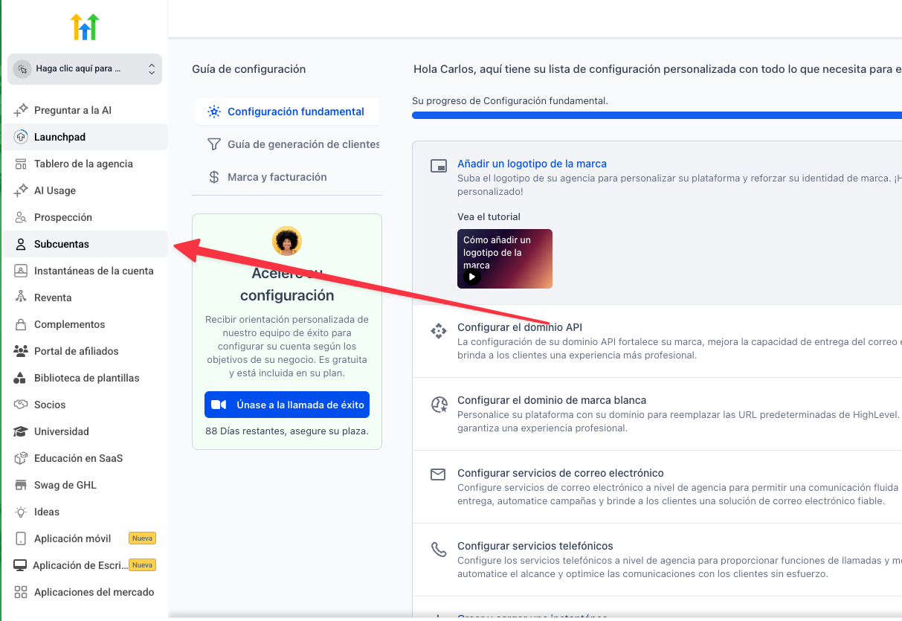
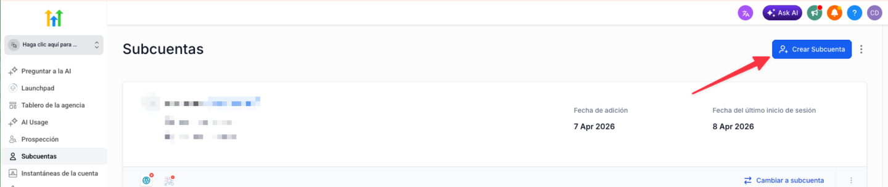
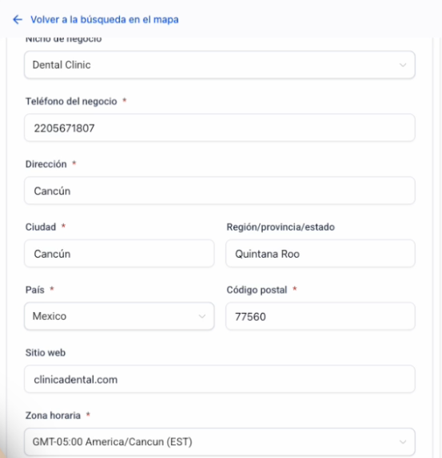
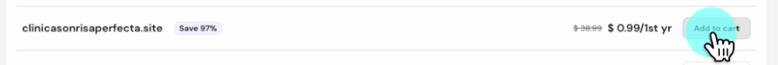
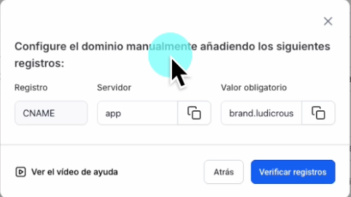
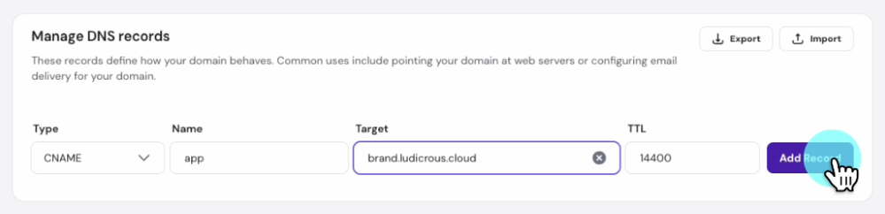

# 🧱 2. Setup & Branding desde Cero

> Ruta: GHL desde Cero › 🧱 2. Setup & Branding desde Cero

**🎬 Vídeo (14.3 min):** https://www.loom.com/share/cf5a279af21c43c692c8115580898234

---

**Curso: Go High Level Desde Cero · Sección 2 de 12**

> *La primera impresión cuenta — incluso antes de que te conozcan.*

En esta sección creamos la subcuenta de la clínica desde cero, le conectamos un dominio real y le damos identidad visual: logo, colores y todos los datos del negocio. Cuando terminemos, la clínica va a tener su propia casa dentro de Go High Level, lista para recibir todo lo que construiremos en las siguientes secciones.

## **📚 Qué vas a aprender**

- La diferencia entre **cuenta de agencia** y **subcuenta** (y por qué importa)
- Crear la subcuenta **"Clínica Dental Sonrisa Perfecta"** desde cero
- Comprar un dominio y conectarlo a GHL vía DNS
- Subir el logo y configurar branding (colores, moneda, idioma, zona horaria)

## **🛠️ Paso a paso**

### **1. Entender la estructura: agencia vs. subcuenta**

En GHL existen **dos niveles**:

- **Cuenta de agencia:** tu cuenta maestra, desde donde gestionas a todos tus clientes.
- **Subcuenta:** cada cliente vive aquí, con sus propios datos, llaves y configuración.

> Analogía: la agencia es un edificio, cada subcuenta es un departamento independiente. Un cliente nunca ve los datos de otro.



### **2. Crear la subcuenta**

Desde la agencia, ir a **Sub-Accounts → Create Sub-Account**.



> Importante: aunque existe un *snapshot* predefinido para clínicas dentales, la recomendación es **empezar de cero**. Quitar lo que no te sirve toma más tiempo que crear desde limpio.

Llenar los datos básicos del negocio:

- Nombre del negocio: `Clínica Dental Sonrisa Perfecta`
- Ciudad, dirección, código postal
- Nicho: dental
- Correo del responsable
- Zona horaria: la de tu clínica



**Desactivar** la opción de "añadir datos de muestra" — queremos el sistema limpio.

### **3. Comprar y conectar el dominio**

Ir a un proveedor (en el video usamos **Hostinger**, pero sirve Namecheap, Cloudflare o el que ya uses).

1. Buscar el dominio — en el caso: `clinicasonrisaperfecta.site` (99 MXN el primer año).
2. Completar la compra.



Ya en GHL, dentro de la subcuenta:

- Ir a **Settings → Domains → Add Domain**
- Pegar el dominio y elegir **subdominio** tipo: `app.clinicasonrisaperfecta.site`
- GHL te muestra los registros DNS que tienes que crear



### **4. Configurar DNS en tu proveedor**

En Hostinger (o tu proveedor): **Advanced → DNS / Nameservers → Manage DNS Records**.

Agregar este CNAME:

```
Tipo:   CNAME
Nombre: app
Valor:  brand.ludicrous.cloud
TTL:    Automático

```

> ⚠️ El DNS puede tardar hasta 24 horas en propagarse. Normalmente son minutos. Si te marca error al verificar, no entres en pánico — refresca y prueba de nuevo.



Volver a GHL y darle **Verify Records**. Cuando aparezca en verde, ya tienes el dominio conectado.

### **5. Configuración del negocio y branding**

Dentro de la subcuenta, ir a **Settings → Business Profile**:

- **Nombre legal:** `Clínica Dental Sonrisa Perfecta S.A. de C.V.`
- **Correo del negocio:** `contacto@lc.clinicasonrisaperfecta.site` (lo configuraremos en la Sección 3)
- **Teléfono del negocio**
- **Moneda:** MXN (o la que corresponda)
- **Idioma:** Español
- **Tipo de empresa:** Incorporation / Corporation
- **Sector:** Sanidad

### **6. Crear y subir el logo**

Abrir Canva con dimensiones **350 × 180 px** (las que pide GHL):

1. Nuevo diseño → tamaño personalizado
2. Elemento: buscar "sonrisa" o un ícono dental
3. Texto: "Sonrisa Perfecta"
4. Ajustar tipografía y color
5. Exportar con **fondo transparente** (PNG)

En GHL, subir el logo en **Business Profile → Logo**.

> 💡 No te obsesiones con el logo en esta etapa. El objetivo es tener algo funcional en 10 minutos. Siempre puedes mejorarlo después.

---

## **📎 Recursos**

### **🎨 Paleta sugerida para Sonrisa Perfecta**

```
Primario:   #1E88E5  (azul dental)
Secundario: #FFFFFF  (blanco)
Acento:     #F5F5F5  (gris claro)
```

### **📐 Dimensiones del logo**

- **Ancho:** 350 px
- **Alto:** 180 px
- **Formato:** PNG con fondo transparente

### **🔗 Proveedores de dominio recomendados**

- **Hostinger** (el del video)
- **Namecheap**
- **Cloudflare**
- O el que ya uses para tu VPS/hosting

### **📋 Plantilla — Registro CNAME**

```
Tipo:   CNAME
Nombre: app
Valor:  brand.ludicrous.cloud
TTL:    Automático
```

---

## **✅ Checklist antes de avanzar a la Sección 3**

- [ ] Subcuenta creada con todos los datos del negocio
- [ ] Dominio comprado
- [ ] Subdominio (`app.tudominio.com`) con CNAME apuntando a GHL y verificado
- [ ] Logo de 350×180 subido
- [ ] Moneda, idioma y zona horaria configurados

---

## **➡️ Siguiente sección**

**Sección 3 — Canales de Comunicación:** conectamos email (con SPF/DKIM/DMARC), compramos un número para SMS y configuramos WhatsApp Business. Porque un sistema bonito no sirve si no puede comunicar con los pacientes.

## 🎙️ Transcripción

Ok, ahora si vamos a empezar a construir en esa sección creamos la sub cuenta de la clínica desde cero Le conectamos un domino real, le damos identidad visual, logotipo, colores, todo Cuando terminemos la clínica va a tener su propia casita, digamos, dentro de Goja Level, lista para recibir todo lo que vamos a construir después. Primero, lo primero, en J.H.L. Gohan Level hay dos niveles, la cuenta de agencia que es tu cuenta maestra y desde aquí gestionas lo que son todos tus clientes y cada cliente vive en su propia subcuenta, piensen la agencia como un edificio de departamento, cada subcuenta es un departamento independiente con su propia llave, su propia decoración, sus propios datos, un cliente nunca ve los datos de otro. Hoy vamos a crear el departamento de nuestra clínica dental. Ahora, ya que estamos aquí en nuestra cuenta de agencia, vamos a ir a donde dice Subqueta. Vamos a darle clic ahí y vamos a darle clic en crear Subqueta. Perfecto. Aquí cabe aclarar que probablemente si nosotros buscamos, ya exista un snapshot que se llama a esta sección que es de kilónicas dentales. Un snapshot es una cuenta precargada ya con frujos, templates, etiquetas, campos relacionados a una kilónica dental. Mi recomendación es que pieces de cero porque si hay algunas las cosas que no te gusten en lo sirva, te va a tomar más tiempo eliminar esas cosas que no necesitas, que empezaramos de cero y dar de alta o creer de alto a las cosas que en realidad se inestemos. Así que vamos a darle aquí y empecemos de cero. Nos va a decir que si le queremos ver aquí a dar permises en la megador y vamos a poner la dirección. En este caso yo lo voy a crear en cancún, así que vamos a decir que está en cancún y vamos vamos a ver aquí abajo list, luego aquí nos va a pedir el nombre que nombre apellidos correo, esto va a ser como que de la persona a cargo, tal cual voy a poner ahorita mi nombre por el electrónico, voy a utilizar este correo, ya dijimos que la ciudad, nicho de negocio, delicadental, el teléfono del negocio no tenemos, pero voy a poner, ahorita éste, todos eso puede cambiar más adelante, código postal, sitio web tenemos ya un sitio web como lo vimos en el intro, que está bastante anticuado como cientos de negocios que existen todavía al día de hoy, en pleno de dos mil veintiséis, entonces nuestro sitio web digamos que se va a llamar, vamos a crear nuevo, finica, sentar el punto y la sonora area en este caso yo estoy en América Cancún y añadir datos de muestras de su cuenta, la vamos a pagar, no lo queremos, qué pasa si le dejamos todo prendido, nos va a añadir unos contactos, nos va a añadir cosas como de muestra para que sepamos como funcione, en este caso lo vamos a pagar, lo vamos a añadir, a añadir sub cuenta. Ok, ya que estamos adentro, entonces vamos a meternos en los, lo que son los datos de el negocio, entonces vamos darle a cambiar a sub cuenta y vamos a empezar con la configuración. Nos vamos a ir aquí abajo de esa configuración, perfil de empresa y tenemos que subir un logo tipo, cómo se va a llamar nuestro negocio y al negocio vamos a ponerle línica, dental, con risa, perfect. El nombre legal, esto es lo que va a venir en tu invoices y la de cometes en que mandes, vamos a decirle que es lo mismo y en México seríamos en una SEA de SEV, por ejemplo, no es como un tipo de empresa, un correo del negocio, vamos a llamar a quizás como un contacto, la roba clínica, dental, un intocon y ahorita los ajustamos, el número de teléfono le importa y tu dominio aquí si es importante conectar y tener un dominio ok en este caso vamos a comprar un dominio en verdad para hacer toda la configuración bien entonces me voy a ir a hosting her ya estoy haciendo una búsqueda y voy a comprar el dominio que dice clínica son risa perfecta y probablemente yo buscar un punto comam, punto CLS y estás en Chile, punto medicistas en México, ahorita vamos a agarrar el más barato este punto site, a 99 es entonces el primer año, vamos a darle agrega al carrito y lo compramos por un año, vamos a darle contenido checkout, esto no tiene que ser el hostinger, puede ser literal en cualquier plataforma en la que quieran comprar un dominio en la que ya tengan su BPS, muy probablemente pueden comprar dominios también y vamos a darle completar la compra. Perfecto, ya comprobemos el dominio, nos pide que agregamos información de quién es el dominio, vas a lo registrar, formación, registrar y está haciendo la configuración, y entonces quedamos que compramos el dominio que dice, no queremos hacer nada, clínicas en risa perfecta, clínicas en risa perfecta, punto 6. Lo copiamos, lo vamos para acá y vamos a darle, pegar y vamos a darle añadir dominio. Y sé que es solamente subdomain, claro, subdomain es lo que podemos conectar, así que vamos a llamarle a suponerle app.clinica.sonlisaperfecta.se y le damos a añadir y nos dice que tengamos que añadir los registros manualmente, o le podemos dar a continuar, y le damos continuar nos va a salir como una va a buscar en nuestro proveedor o que con quien tenemos este dominio comprado y nos va a decir que no lo encontró entonces no sé que funcionarlo manualmente no pasa nada nos pica agreguemos el app como un tipo sin name pone este valor obligatorio entonces vamos a este valor obligatorio, nos vamos de nuevo a hosting her, vamos a darle a la parte de editar los ns, perfecto ya que configuramos o verificamos que el dominio de nosotros, perdón, vamos ya podemos cambiarle, vamos a darle aquí en editar, nos vamos a ir aquí en la parte de banach tienes records, vamos a coger un sin name como nos pedía, en name es app y el target es lo que copiamos, brand.ludi.cloud.tml lo dejamos por defecto y le damos a añadir records y eso es todo, nos regresamos a nuestra cuenta de goge level y vamos a darle verificar registro, esto esto puede tardar unos segundos, pero inclusive puede tardar hasta 24 horas. Así que si te marca error no entres en pánico, el DNS puede tardar hasta 24 horas en propagarse y es normal. Normalmente son minutos, pero puede tardar horas así que se da el de su time. Y se ha habido un problema con esta acción y sí que no pueden contarlo, con app, ludicrrus y así, entonces vamos a regresar acá y vamos a verificar que sí se ha llevado a cine app para en punto ludicrous.cloud y entonces como dijimos, puede tardar unos segundos, minutos, así que vamos a darle a verificar registros otra vez, listo, después de un par de minutos ya no lo aceptó, aquí no necesito tomar el teléfono, nos falta el código del país, en que damos que nuestro sitio web ya cambió, porque compramos el dominio, finica dental, vamos a decir que nos manejamos en pesos mexicanos porque en este caso, hoy en México de este lado derecho vamos a verificar más información, nos pide la dirección, vamos a llamarle uno, dos, tres, hay feliz, obviamente todos estos datos peticios en la ciudad de Cancún, en la roda, en el horario y quiero que mi plataforma esté en español, la comunicación va a ser en español, vamos a darle actualizar, vamos a darle aquí también actualizar, ya cambio español los pide un logotipo, así que vamos a crear algo, dice que sean 350 por 180, vamos rápido a Canva, con 350 por 180, lo que nos pedía, un nuevo diseño, y vamos a hacer algo muy tencil, vamos aquí a elementos, vamos a buscar son Risa, vamos a ver qué son Risa tenemos aquí, vamos a agarrar esta, vamos a cambiar el color, que les parece esto, vamos a centrarlo aquí, vamos a agarrar el texto y tulo y la vamos a llamar el tamaño, que cambiamos el tipo de letra, cambiamos el color y buscamos otro elemento, muy sencillo, no sé, es que no me gusta, van a dejarle sin nada más sencillo. Entonces, es el mejor lo tipo del mundo, no, la verdad es que no. Funciona para arrancar ese de profesional, sí, entonces lo que importa ahora, vamos a exportarlo, para decirle que con fondo transparente lo descargamos y lo guardamos en nuestras descargas, no regresamos para aquí y vamos a darle subir, que onda esa perfecta y por último, vamos a dar la actualizar información y listo. Muy bien, vamos a poner el tipo de empresa, vas a decirle que ésta es tu, Corporation, así que es Incorporation, sector de la empresa, vamos a buscar aquí, hacer las opciones, petrólegas, viene de consumo, financiero, limitas y bebidas, gobiernos, sanidad, fería, sanidad, vamos a decirle que otro en este caso y por registro de la empresa. Debe oente esto va a depender de cada país y no me registro de la empresa, va a poner que mi empresa no está registrada y o pero en Latinoamérica, dar la actualiza de información. De este lado, no nos preocupamos ahorita por nada de esto, nos necesitamos tocarlo y listo. Entonces, en este punto ya tenemos un dominio conectado, ya tenemos un logotipo y ya tenemos toda la información de la empresa, pero esto le hicimos en 10 minutos y ya estamos listos para arrancar, ya tenemos la base sub cuenta creada, dominio, brand configurado, la clínica ya tiene su departamento y en la siguiente sección vamos a conectar lo que son todos los canales de Comunicación, email, correo, sms, whatsapp, todo para que puedas hablar con tus pacientes. Así que nos vemos en el siguiente video.
