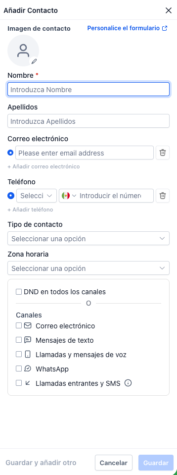
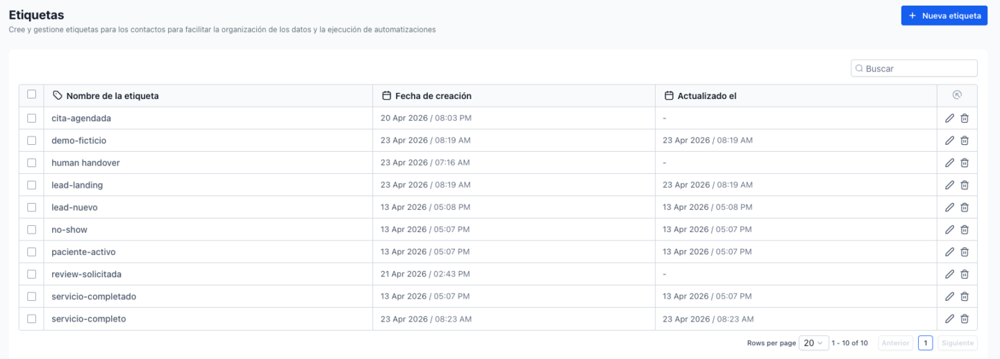

# 👥 4. CRM: Contactos & Campos Personalizados

> Ruta: GHL desde Cero › 👥 4. CRM: Contactos & Campos Personalizados

**🎬 Vídeo (11.4 min):** https://www.loom.com/share/65750331426541d1a9cecf5a3a007819

---

**Curso: Go High Level Desde Cero · Sección 4 de 12**

> *Conoce a tus pacientes mejor que ellos mismos.*

Hasta ahora hemos construido la infraestructura. Ahora vamos con **lo más importante de cualquier negocio: los clientes**. En esta sección creamos los pacientes que usaremos durante todo el curso, agregamos campos específicos para una clínica dental y construimos listas que se actualizan solas.

## **📚 Qué vas a aprender**

- Crear contactos manualmente con datos ficticios (pacientes que nos acompañarán todo el curso)
- Entender **DND** (Do Not Disturb) por canal
- Crear **campos personalizados** específicos para clínica dental
- Diferencia clave entre **campos personalizados** y **etiquetas (tags)**
- Construir **Smart Lists** que se filtran y actualizan automáticamente

## **🛠️ Paso a paso**

### **1. Crear el primer contacto**

Ir a **Contacts → Add Contact**.

Para Roberto Martínez:

- **Nombre:** Roberto
- **Apellido:** Martínez
- **Email:** (usa un correo real tuyo o variaciones — útil para pruebas)
- **Teléfono:** el tuyo (para pruebas de SMS/WhatsApp)
- **Ciudad:** Ciudad de México
- **Fecha de nacimiento:** 13/02/2005 (se usa después para el workflow de cumpleaños)
- **Fuente:** Google



### **💡 DND — Do Not Disturb**

Junto al formulario aparece una sección **DND** con íconos por canal (email, SMS, llamadas, WhatsApp).

- Sirve para marcar que un contacto **no quiere ser contactado** por un canal específico.
- Respeta consentimiento — GHL no le enviará nada por ese canal aunque corras workflows.
- Úsalo cuando el paciente explícitamente pida no recibir X tipo de comunicación.

### **2. Crear los otros 5 contactos**

Repetir el proceso para los otros 5 pacientes (pueden ser ficticios, pero con correos y teléfonos reales/tuyos para poder probar los flujos más adelante).

> 💡 **Estos 6 pacientes nos van a acompañar durante TODO el curso.** Cada uno representa un escenario distinto: lead nuevo, paciente activo, no-show, cliente ganado, etc. Invierte los 5 minutos en crearlos bien ahora.

### **3. Crear campos personalizados específicos para dental**

Ir a **Settings → Custom Fields → Add Field**.

GHL ofrece muchos tipos de campo:

- Texto (línea única / múltiple)
- Número, teléfono, monetario
- Dropdown (único / múltiple)
- Radio, checkbox
- Fecha
- Archivo (útil para estudios clínicos)

**Campo 1 — Tipo de tratamiento (Dropdown múltiple)**

- **Tipo:** Single Options (dropdown único)
- **Nombre:** `Tipo de tratamiento`
- **Objeto:** Oportunidad (no Contacto — ahora explicamos por qué)
- **Opciones:** Limpieza, Blanqueamiento, Ortodoncia, Cirugía, Revisión

> 💡 **¿Por qué va en Oportunidad y no en Contacto?** Un paciente puede tener *múltiples* tratamientos a lo largo del tiempo. Si el campo vive en el contacto, sobrescribes el dato cada vez. Si vive en la oportunidad, cada tratamiento es una oportunidad distinta con su propio tipo. Lo verás claro en la Sección 5.

**Campo 2 — Fecha de última visita (Fecha)**

- **Tipo:** Date Picker
- **Nombre:** `Fecha de última visita`
- **Objeto:** Contacto
- **Grupo:** Additional Info

Este campo dispara el workflow de limpieza semestral (Sección 9).

**Campo 3 — Notas clínicas (Texto multilínea)**

- **Tipo:** Multi Line
- **Nombre:** `Notas clínicas`
- **Objeto:** Contacto
- **Grupo:** Additional Info

Útil para anotar historial, alergias, sensibilidades.

### **4. Llenar los campos en Roberto**

Volver al contacto Roberto Martínez → **Additional Info**:

- **Fecha de última visita:** ayer
- **Notas clínicas:** "Roberto se realizó un blanqueamiento. Pagó por tres servicios, tiene dos pendientes."

### **5. Campos personalizados vs. Etiquetas (tags)**

Campo personalizadoEtiqueta (tag)**Qué es**Un dato/valor único por contactoMarcador que se repite y se filtra**Ejemplos**Fecha cumpleaños, notas clínicas, tipo sangrePaciente activo, No-show, Lead nuevo**Uso**Guardar información específicaSegmentar y filtrar grupos

### **6. Crear las etiquetas del curso**

Ir a **Settings → Tags → Add Tag** y crear estas:

- `paciente-activo`
- `no-show`
- `servicio-completo`
- `lead`



Asignar `paciente-activo` a Roberto.

> 💡 **Convención:** usa guión medio `-` para las tags, todo en minúsculas. Consistencia = fácil de filtrar después.

### **7. Crear Smart Lists (Listas Inteligentes)**

Las Smart Lists son **filtros guardados que se actualizan solos**. Un contacto aparece automáticamente cuando cumple la condición y desaparece cuando deja de cumplirla.

**Crear Smart List "Pacientes activos":**

1. Contacts → **Advanced Filter**
2. Filtrar por: **Tag = paciente-activo**
3. **Apply → Create**
4. Nombre: `Pacientes activos`

> 💡 Cuando agregas la tag a un nuevo contacto, aparece instantáneamente en la Smart List. Cuando quitas la tag, desaparece. No tienes que mantenerla manualmente.

### **8. Crear el resto de Smart Lists**

Repetir el proceso para:

- `Leads nuevos` → filtro: tag `lead`
- `No-shows` → filtro: tag `no-show`
- `Clientes ganados` → filtro: tag `servicio-completo`

## **📎 Recursos**

### **📋 Plantilla — Tags iniciales**

```
paciente-activo
no-show
servicio-completo
lead
```

### **💡 Regla de oro**

- **Para crear un contacto NO es obligatorio tener nombre y apellido**, pero **SÍ es obligatorio** tener al menos email o teléfono.
- Sin esos dos, GHL no puede identificarlo como único.

## **✅ Checklist antes de avanzar a la Sección 5**

- [ ] 6 contactos ficticios creados (con datos reales tuyos para pruebas)
- [ ] 3 campos personalizados creados (tipo de tratamiento, fecha última visita, notas clínicas)
- [ ] 4 tags creadas
- [ ] 4 Smart Lists filtrando por cada tag
- [ ] Roberto Martínez con campos personalizados llenos y tag `paciente-activo`

## **➡️ Siguiente sección**

**Sección 5 — Pipelines & Oportunidades.** Ya tenemos el CRM, ahora vamos a visualizar el recorrido que hace cada paciente desde que es lead hasta que se vuelve cliente ganado. Y lo más importante: vas a entender la diferencia entre **contacto** y **oportunidad**, que es una de las cosas que la mayoría de gente no entiende en GHL.

## 🎙️ Transcripción

Muy bien. Hasta ahora hemos construido la infraestructura, vamos con lo más importante de cualquier negocio, los clientes. regresamos a los contactos, vimos el video pasado como crear un contacto, así que te voy a enseñar uno nuevo, vamos a darle a agregar contactos y en este caso voy a poner obviamente información ficticia, voy a ponerle Roberto Martínez y su correo va a ser que si va a ser un correo real para que yo pudiera seguir información, no ocurre lo que su teléfono va a ser igual lo pueden ver, lo pueden recibir, igual WhatsApp, un link, no solo la área, lo voy a poner igual México, pero tú puedes, solo voy a poner aquí el Ciudad de México y ya, si se preguntan que es esto, DND significa do not disturb, básicamente tú puedes decir, ok, este cliente solamente lo va a dar alta, pero no quiere que sea contactado por ningún medio, o aquí es canales en específico, por relitrónico mensaje de texto llamadas WhatsApp, entonces yo hago esto, no voy a poder la van a dar mensajes de whatsapp, no lo va a poder marcar ni nada, no, no se lo va a dar guardar y voy a repetir el proceso con 5 contactos más y ahorita regreso, listo entonces estos 6 pacientes, 6 contactos nos van a acompañar durante todo el curso, cada uno representa un escenario diferente que una clínica dental enfrenta a todos los días y los campos que por default son genéricos y para una clínica dental ni estamos información más específico, por ejemplo ahorita vamos a ver lo que es el contacto Roberto Martínez, tenemos su nombre, su apellido, su correo, su teléfono, podemos agregar una fecha en acimiento, recomiendo que tenga una fecha en acimiento por si quieren ustedes no sé que cuando sea el día del cumpleaños de una persona le envíen una felicitación como para que los tengan presentes, etcétera, entonces vamos a poner que Roberto es de él, 3, 2, 2005, que fuente de contacto, aquí podemos decir que Roberto vino de Google, digamos que nos vio en Google y vamos a darle guardar, ok. Ahora les voy a enseñar cómo agregar campos customizados, campos personalizados, entonces nos fuimos a settings, le damos clic en campos personalizados y aquí tenemos todos los campos que vienen por defector en Goge Level, nos fundamos agregado nada. Vamos a darle a añadir, vamos a darle primero a añadir campos y aquí tenemos diferentes estilos de campos que podemos agregar. Una sola línea, línea múltiple, cuando tienes poner mucha información, lista de cuadros de texto, pueden ser números, pueden ser teléfonos, puede ser un campo monetario, un menudo desplegable con una sol opción, un menú desplegable múltiple, seleccionar con botón de opción, cacia de verificación, fecha, pueden subir archivos si quieren tener como que suele al clínico, etcétera. Entonces en caso vamos a escoger lo que es menú desplegable múltiple y vamos a darle siguiente, vamos a darle un nombre al campo y vamos a llamarle tipo de tratamiento, aquí lo disobjeto es donde va aparecer si va a salir como contacto, como oportunidad o como empresa, vamos a darle como contacto con la diferencia, como oportunidad, que es decir que después de caro oportunidad, lo vamos a ver más adelante en el curso, pero estos campos van a estar asignados, digamos, a esa oportunidad. ¿Cuál es la diferencia que solamente puede tener, digamos, un contacto de Roberto Martínez? Pero lo mejor Roberto Martínez puede tener múltiples oportunidades y piensen como oportunidad, como cada tratamiento, es decir, en el tratamiento uno te hizo una limpieza mental, el tratamiento dos, te hizo un blancamiento, tratamiento tres, fue simplemente una revisión de rutina, etcétera. Creo que ahorita que lo explico para el caso de uso en específico, queda mejor que el tipo de tratamiento sea para oportunidades, porque evidentemente, así como roberto de muchos otros clientes, pueden ser recurrentes, entonces vamos a poner a nivel de ok sería aquí y la opción aquí es básicamente que nombre la vamos a poner ¿no? cómo va a salir en el en el fondo, despleguemos esto, vamos a dar la limpieza, añadimos opción, la otra va a ser blanqueamiento y la otra va a ser ortodoncia, irugía, más que que hay un detallor que me va a quedar cuenta, ni no sé si me permita cambiarlo yo lo puse de menudo explicable múltiple pensando en que iba a ser para un contacto entonces digo que Roberto viera una vez y son limpieza vuelve a venir y se suma camiendo, entonces puedo ir agregando más cosas, lo cual en la práctica me parece que no es lo mejor y a la metable entre vamos a terminar para atrás con el duro menudo explicable único y perdimos todo, no pasa nada, entonces vamos a llamarle tipo de servicio, no ahora dijimos que a tipo de tratamiento, pero tratamiento ya saben cómo crearlo voy a darle pausa para no ser vídeo maldago y regreso aquí tengo a los campos listo aquí abajo no tenemos que dejar nada lo podemos dejar así como viene por defecto y vamos a darle guardar ahora vamos a crear otro campo en casa va a ser un campo de fecha y vamos a llamarle fecha de última visita simplemente va a tener el registro de cuando fueron tenia vez que nos visitó y en esta ocasión si va a ir enlazado al contacto y aquí donde se fijan de ese grupo contacto llena el info o adicional info vámonos acá para que lo vean rápido si nos vamos a lo que somos contactos, vamos a abrir contactos, tenemos lo que es contacto tal cual aquí información general y información adicional, es donde vamos a ver ese campo que estamos creando, tiene ese caso creo que queda mejor como información adicional perfecto vamos a darle guardar vamos a agregar otro campo que sea no ya llenamos fecha de cumpleaños y vamos a darle un campo que se alinea múltiple y que se llame vamos a llamarle y les parece notas clínicas en contacto y en información adicional damos guardar muy bien entonces vamos a regresar en de caso a Roberto Martínez, el contacto que hacemos que es Google, tipo contactos con clientes, suponiendo que ya tiene algún servicio con nosotros, esto lo puede llenar si quieren en ese caso no lo vamos a llenar, pero en información adicional vemos que ya tenemos la fecha de última visita, en caso sería, vamos a decirle que vino ayer domingo y en Notas clínicas que sea como Roberto se realizó un blan de amiento, pagó por tres serricios, tiene dos pendientes, vamos a darle guardar. Perfecto, ahora el contacto Roberto ya no se lo su nombre y un teléfono, sabemos cuando fue su último tratamiento, sabemos que vino día a día y que no se encontró directamente por Google y ya también tenemos su fecha de cumpleaños. Ahora, muchas personas también preguntan oye, pero cada la diferencia entre un campo personalizado y un etiqueta, porque aquí dice etiquetas, que ahorita no hemos creado de etiqueta. Entonces, la diferencia es que un campo personalizado es un dato o un valor que ustedes como como dicen nombre, ¿no? Van a personalizar o que saen diferente para cada uno y una etiqueta es algo que se va a repetir y que van a utilizar para estar filtrando, por ejemplo, pacienta activo, no shows, un lit nuevo, que también nos convierte en un paciente, requiere el seguimiento, etcétera. Entonces vamos a crear las etiquetas, nos vamos a configuración, vamos aquí abajo, 17 etiquetas y por defecto, se caso no viene ninguna etiqueta, si vamos vamos a crear una y la primera etiqueta que creemos de paciente guión activo, por ejemplo, vamos a crear otra etiqueta que sea no guión show, ahorita en la verdad que nos va a servir, vamos a crear otra etiqueta que sea el visión completo y vamos a crear otra etiqueta que sea lit perfecto, entonces nos regresamos al contacto Roberto, nos vamos a la parte de etiquetas, ya las van a seguir todas y vamos a ponerle que Roberto es un paciente activo, no le tenemos que aguardar automáticamente se agrega la etiqueta. Ahora, vamos a darle para atrás y se fijan estamos en listas inteligentes y vemos aquí todos los contactos, pero vamos a darle en añadirles inteligente y digamos que queremos decir que solamente queremos ver a los pacientes factivos. Vamos a darle filtro avanzado y vamos a darle que es un filtro por etiqueta, buscamos aquí etiqueta y decimos que la etiqueta es pacientes activos y vamos a darle a apply y luego le damos crear. De esta forma aquí tenemos a todos nuestros contactos, pero aquí en pacientes activos vamos a ver únicamente a quien tenga la etiqueta de pacientes activos. Recuerden que esto es dinámicos actualiza solo, al que si yo voy con venja y la agregó la etiqueta de pacienta activo en cuanto yo regrese a mi smart list de pacients activos. Ya voy a ver aquí tal cual a dos pacientes a venja y a robert. Entonces las de smart list son filtros guardados que se actualizan solos y si un contacto cumple esa condición aparece ahí. que deja cumplir las condiciones, desaparece caso, que ya no tuviera la etiqueta, que desaparecería. Esto es poderoso porque no tienes que actualizar las listas manualmente, el sistema lo hace por ti y en base a esto podemos hacer otras cosas más adelante, que vamos a ver en el siguiente vídeo. Antes de terminar, me gustaría enseñarles algo, para que ustedes crean un contacto, no es obligatero tener nombre de apellido, inclusive podrán crear un contacto sin nombre sin apellido, y lo que sí es que en instan o un correo electrónico o un teléfono. Algunos de estos dos van a necesitar para poder agregar los contactos. Muy bien, ya tenemos el CRN armado, tenemos seis pacientes campos personalizados. Te he dicho del nicho dental, perdón, tenemos las etiquetas y las smart list que se actualizan sols. Ahora que siguen, estamos visualizando el recorrido de estos pacientes desde que son un lit hasta que se convierten en clientes, eso lo hacemos en los piblay, en los embulos, entonces es exactamente lo que vamos a construir en la siguiente sección, te veo en el próximo vídeo.
