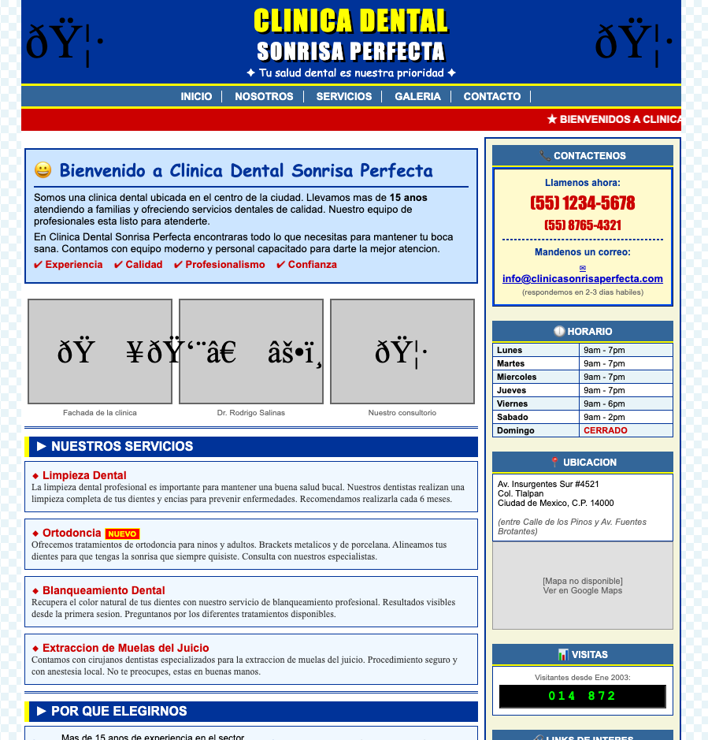

# 🎯 6. Funnel: Landing Page + Calendario

> Ruta: GHL desde Cero › 🎯 6. Funnel: Landing Page + Calendario

**🎬 Vídeo (30.4 min):** https://www.loom.com/share/e4dc7d4bb40a4764a73f3d30553d8cdf

---

**Curso: Go High Level Desde Cero · Sección 6 de 12**

> *Cada minuto que un paciente gasta intentando agendar es un paciente que quizás no regresa.*

Tenemos CRM y pipeline — ahora vamos a **llenarlos de pacientes**. Para eso construimos un **funnel**: una página diseñada específicamente para convertir visitantes en citas agendadas, con el calendario integrado. Este video es un poco más largo que los otros porque te voy a enseñar las **4 maneras distintas** de crear landings en GHL, con recomendaciones de cuándo usar cada una.

## **📚 Qué vas a aprender**

- La diferencia entre **website** y **funnel** (y por qué importa)
- Las **4 formas** de crear landing pages en GHL
- Crear un funnel con 3 pasos: Landing → Appointment → Thank You
- Conectar un subdominio específico para el funnel
- Integrar el calendario de citas en la landing
- Probar el flujo completo como si fueras el paciente

## **🛠️ Paso a paso**

### **1. Website vs. Funnel — La diferencia clave**

WebsiteFunnelInformativo ("quiénes somos, qué hacemos")Orientado a **una sola acción** (agendar)Varias páginas navegablesPocas páginas, secuencialesVisitante paseaVisitante se **convierte**

**Ejemplo del "antes" del curso:** esa página HTML de los 2000s que mostramos en la Sección 1 es un website arcaico. No tiene formulario, no agenda, no convierte.



### **2. Estructura típica de un funnel (3 páginas)**

```
Landing Page → Appointment (calendario) → Thank You Page

```

- **Landing:** atrae la atención, muestra el valor, invita a agendar
- **Appointment:** calendario integrado para reservar fecha/hora
- **Thank You:** confirmación + promoción extra / upsell

GHL crea esta estructura automáticamente cuando partes de plantilla.

### **3. Las 4 formas de crear una landing**

Ir a **Sites → Funnels → + New Funnel**.

#### **Forma 1: Plantilla predefinida (la más rápida)**

- Darle **Continue** → se abre el buscador de plantillas
- Buscar por industria: `dental`, `dental appointments`, `medical`, etc.
- Elegir la más parecida a lo que necesitas

GHL carga la plantilla con Hero, servicios, testimonios, equipo, mapa, footer. **Todas las plantillas son mobile responsive** — puedes previsualizar en tablet y celular arriba a la derecha.

✅ **Cuándo usarla:** cuando necesitas algo funcional rápido y no quieres partir de cero.

#### **Forma 2: Desde cero (control total)**

- **+ New Funnel → From Scratch**
- Te da un canvas en blanco. Tú creas cada sección, columna, elemento.

Elementos disponibles: menú, botones, formularios, sliders, imágenes, videos, testimonios, código custom (HTML/JS/CSS), mapas, SVGs, reviews, pricing tables, countdowns, etc.

✅ **Cuándo usarla:** cuando tienes un diseño específico en mente y tiempo para construirlo.

#### **Forma 3: AI Funnel (beta)**

- **+ New Funnel → Funnel AI**
- Te pregunta: nombre del negocio, industria, objetivo (leads / appointments), tono
- 5 generaciones gratis, después ~$1.40 USD por generación

Limitación: a veces lo genera en inglés, testimonios son falsos (hay que cambiarlos). Como punto de partida funciona, no para publicar directo.

✅ **Cuándo usarla:** para arrancar rápido y después editar.

#### **Forma 4: AI Studio (beta) — la más potente**

- **Sites → AI Studio**
- Le describes en lenguaje natural qué quieres y él construye todo el funnel, no solo la landing

**Prompt ejemplo usado en el video:**

> 📋 Prompt — AI Studio
> 
> "Crear una página de aterrizaje (landing page) para mi clínica dental que se llama Clínica Sonrisa Perfecta. La idea es que la gente que venga de Facebook e Instagram aterrice aquí, vea la promoción del mes (limpieza dental por $499 pesos) y haya un calendario para agendar en nuestra sucursal. Tono profesional. Agrega una sección de reviews / social proof y al final un espacio para contactar por WhatsApp."

También puedes **adjuntar tu logo** para que lo use y saque la paleta de colores automáticamente.

Después de ~3 minutos genera una landing mucho mejor que Funnel AI, con el logo integrado y los colores correctos.

✅ **Cuándo usarla:** es la forma más rápida y potente para arrancar con algo profesional.

⚠️ **Limitaciones de AI Studio:**

- No lo ves en la lista de tus embudos (tiene su propia sección)
- No puedes editarlo con el editor drag-and-drop tradicional — solo con la IA

### **4. Conectar el subdominio del funnel**

En el editor: **Settings → Domain → Connect Domain**.

⚠️ **Importante:** no uses tu dominio raíz (`clinicasonrisaperfecta.site`) para el funnel — déjalo para el website principal. Usa un subdominio:

```
landing.clinicasonrisaperfecta.site
```

GHL te da el CNAME a agregar en Hostinger:

```
Tipo:   CNAME
Nombre: landing
Valor:  byte.ludicrous.cloud
TTL:    Automático
```

> ⚠️ **Ojo:** el valor cambia según el tipo de recurso. Para **sitios/funnels** es `byte.ludicrous.cloud`, para **email** es otro, para **sub-cuenta** es `brand.ludicrous.cloud`. Revisa bien el que te da GHL en cada caso.

### **5. Entender el editor de GHL**

Estructura jerárquica del editor:

```
Sección (row morado)
 └─ Column Row (azul)
     └─ Column (morado)
         └─ Elementos (headline, image, button...)
```

Herramientas útiles en el menú superior:

- **Cookies consent** — popup de cookies
- **Custom code** — meter HTML/JS/CSS
- **SEO & AI Search Optimization** — metadata, keywords, schema markup (importante para que los LLMs indexen tu página)
- **Pop-up settings** — ventanas emergentes
- **Background** — color o imagen de fondo global
- **Tipografía** — fuentes globales
- **Tracking code** — pixel de Facebook, Google Analytics, etc.

### **6. Crear el calendario**

Ir a **Calendars → + Create Calendar → Personal Booking**.

Configuración:

- **Nombre:** `Limpieza Dental`
- **Duración:** 30 min
- **Disponibilidad:** Lunes a Viernes, 8am-5pm
- **Aviso mínimo:** 4 horas
- **Intervalo a futuro:** 14 días

Guardar y volver al funnel. El AI Studio te preguntará "¿qué calendario conecto?" — seleccionas **Limpieza Dental**.

### **7. Crear el Thank You Page**

Desde el AI Studio, pedirle:

> 📋 Prompt — Thank You Page
> 
> "Crea el thank you page con un mensaje de agradecimiento por agendar y un cupón de 5% de descuento si presentan el código GRACIAS5 al momento de visitar la clínica."

### **8. Publicar**

- **Publish** en la landing → conectar dominio → generar metadata automáticamente (title, description, favicon, social OG image)
- **Publish** en el appointment → ya conecta el calendario
- **Publish** en el thank you


### **9. Test completo — simular paciente**

Abrir `landing.clinicasonrisaperfecta.site` en pestaña nueva:

1. Ver la landing → clic en "Agendar cita"
2. Se abre el calendario → elegir fecha y hora
3. Formulario pide: nombre, apellido, teléfono, email
4. **Submit** → aparece el Thank You Page con el cupón

Volver a GHL → **Contacts** → aparece el nuevo contacto con el appointment registrado.

## **📎 Recursos**

### **📋 Plantilla — Estructura del funnel**

```
Funnel: Limpieza Dental $499
├── Step 1 (Home/Landing)     → landing.clinicasonrisaperfecta.site
├── Step 2 (Appointment)       → /appointment
└── Step 3 (Thank You)         → /thank-you
```

### **📋 Plantilla — CNAME para funnel**

```
Tipo:   CNAME
Nombre: landing         # o el subdominio que elijas
Valor:  byte.ludicrous.cloud
TTL:    Automático
```

### **📋 Prompt para AI Studio (copy-paste)**

```
Crear una página de aterrizaje (landing page) para mi clínica dental
llamada [NOMBRE DE LA CLÍNICA]. La idea es que la gente que venga de
Facebook e Instagram aterrice aquí, vea la promoción del mes
([SERVICIO] por [PRECIO]) y haya un calendario para agendar en
[UBICACIÓN].

Tono: profesional y amigable.

Incluir:
- Hero con la promoción
- Sección "Por qué elegirnos"
- Social proof / reviews
- Calendario integrado
- Contacto por WhatsApp al final
- Mapa con ubicación
```

### **💡 Tips visuales**

- **Logo:** si queda pequeño, entra a `Image → Width/Height` y ajusta (ej: 275 × 75 px).
- **Sección ancho completo:** activa `Allow rows to take the entire width` en el row.
- **Menú sin borde:** ponle el mismo color de fondo de la sección.

## **⚠️ Troubleshooting común**

- **El dominio no aparece en el dropdown después de agregarlo:** guarda, refresca la página y vuelve a entrar.
- **AI Studio no aparece en tu lista de embudos:** es correcto — AI Studio vive aparte, no se lista con los funnels tradicionales.
- **El calendario no carga en la landing:** verifica que elegiste el calendario correcto y que está **publicado**.

## **✅ Checklist antes de avanzar a la Sección 7**

- [ ] Funnel creado (usa el método que prefieras — AI Studio recomendado)
- [ ] Subdominio del funnel conectado con CNAME verificado
- [ ] Calendario de citas creado y configurado
- [ ] Thank You Page con mensaje + cupón
- [ ] Test real: entraste como paciente, agendaste, apareciste en el CRM

## **➡️ Siguiente sección**

**Sección 7 — Checkout, Pagos & Thank You.** El funnel ya captura y agenda — ahora le agregamos la parte que todo dueño de negocio quiere ver: **cobrar**. Conectamos Stripe (y probamos Mercado Pago, que acaba de salir), creamos productos, configuramos el checkout y hacemos un test de pago completo.

## 🎙️ Transcripción

Muy bien, tenemos el CRM y el Paipla. Ahora no estamos llenarlos de pacientes, si para eso vamos a construir un fúnel. E un fúnel es una página de diseñada específicamente para convertir visitantes en citas agendadas. En esa sección, construimos la Llandin Page y le integramos un calendario para que el paciente pueda agendar su cita directamente sin llamar, sin mandar WhatsApp y sin esperar que alguien le conteste. es un auto servicio total. Ahora, hay que entender la diferencia entre una landing page y un sitio web. Un sitio web es algo más informativo, es como para decir a la gente quién eres, que ofreces y das información acerca de tío de tu producto. Sin embargo, un funer tiene un objetivo que el visitante tome una acción, en nuestro caso va a hacer agendar una cita. No ni estas 10 páginas ni estas 1, que convierte. Gachel nos crea la estructura con 3 páginas. Hoy nos vamos a enfocar en la landing page y en el calendario. Por lo general tienes una landing page, un calendario, y luego tienes un thank you page o una página de gracias donde confirmas que ya agendaaron y ahí puedes aprovechar si quieres poner promociones o alguna información extra. Si vídeo va a ser un poquito más largo a los otros porque te voy a enseñar las diferentes opciones que tenemos al momento de crear landing page. Vamos a recordar que venimos de esto, es como tal un sitio web que está muy arcaico, muy a la vieja escuela y podrás creer que quien emplen en el 2020 se diste tiene sitios web así, y aunque no lo creas muchas empresas si en concitios web de estilo. Yo aquí no puedo agendar nada, no tengo un información de contacto, es una página que se ve muy de los 90's, pero creme muchas empresas siguen utilizando todavía esta página. Así que para esto, vámonos directamente de vuelta a DHL y nos vamos a ir en esta parte que hice sitio. Aquí te voy a enseñar cómo crear un embudo o un funer y tenemos aquí la opción de sitios web, entonces es importante identificar que vamos a trabajar en embudos. otros vamos a darle un nuevo humbudo y aquí nos va a decir por nadar a preguntar cómo lo queremos crear desde cero una hía de humbudo o de plantillas, en este caso vamos a construir lo de cuatro o cinco formas de dependencia ahora está disponible simplemente para que veas cómo se pueda hacer no vamos a llevar a cabo de principio de fin todas únicamente es para que entiendas las posibilidades que tienes te voy a dar pequeñas recomendaciones de cuando usar una o cuando usar route. Muy bien. Primero vamos a empezar con plantillas. Obviamente como luce en nombre son embudos predefinidos, muchas veces ya por nicho, que ya tiene ciertos colores, estructura del embudo, las diferentes secciones, que tú puedes escoger y nada más editas la información que tú necesitas. Vamos para este ejemplo, hacer esta prueba, vamos a darle a continuar y aquí podemos buscar plantillas. Aquí tenemos como Beauty and Fashion, Financial, El Tanguilness, etcétera. Ocaso vamos a coger satan wellness e inclusive aquí podríamos buscar como dental care. No tenemos nada así que vamos a poner a más dental clínic. Vamos a ver, ok. Dice que no hay nada. Veo que tenemos más bien un médical así que se aquí es ronío. Aquí vamos a ponerle dental, ok. Tenemos dental, dental especialis, dental check ups, dental profesionales, dental bookings, dental appointments, etcétera. como estamos hablando que vamos a crear un imbudo para poder tener la poiment, agendar citas, vamos a coger ese que hice dentro de la poiment, nosotros vamos a previsualizar, y aquí vamos a ver cómo se verían budo, esto aquí va a tu logo, este es nuestro menú, el hero, poquito de quiénes somos, cómo te podemos ayudar aquí puedes agendar nuestros servicios, aquí ya tienes como más información con tu sitio de agendar, conoce al equipo, la gente que dice la gente de nosotros, la información de la clínica, la ubicación en el mapa y en caso el fútbol. Entonces fijan hasta aquí arriba podemos ver cómo se vería en tableta y cómo se vería en celular. Todas las plantillas son mobile responsive que sí que se adapta en el tamaño de la pantalla. Creo que para caso práctico podemos seleccionar esta plantilla y debá decir añadiendo plantillas, va a agregar todo que vamos a darle un par de segundos, 30 segundos, tomará y el listo dice de finalizando el diseño. Una vez que terminó, automáticamente me va a cargar y nos va a abrir la landing page o el humbudo construido. Si se fijan, aquí tenemos las tres páginas que les comentaba. El appointment que es donde va a vivir el calendario y el thank you page. Ahora, muchas veces podrán decirlo y pero por qué no tenemos todo en una sola landing page que la gente esté el calendario en bebido y simplemente cuando agente diga como que ok gracias si se puede pelear de un embudo como tal ese imagínense que la landing page toda la gente llega es la parte de arriba del embudo la gente que esté interesante su servicio va a agendar nos va a llegar a esta parte más abajo de el embudo y este caso no aplica pero por último los maderas al tnq page que casi es al mismo nivel. Podrás tener como que más niveles y más cosas. Imagínate que después de que agendan los mandas un thank you page que diga, si no quieres esperar a tu agenda marca nos ahorita directamente el número. Entonces ya estás una capa más abajo del enbudo para que sirve eso tú vas como que precalificando y calificando a tus liches. El lit que llega a la parte de la llamada es un lit más caliente que el lit que se quedona más arriba y únicamente vio un landing page y no tomo ninguna acción. El hecho de tener todos estos steps o todas estas fases, te permite a través de libros o códigos que puedas tener o inclusive un pixel de Facebook saber en qué partes está quedando cada gente, qué presentaje de gente está quedando en cada paso, y se te sirve muchas veces a la hora de querer optimizar, que sepas que tienes que trabajar, lo que tienes que modificar de tu humbudo, para que evidentemente puedas convertir más, que se caso de la conversión sería agendar sitas. Entonces, como vemos tenemos aquí, vamos a regresar el phone, ya estando aquí que es lo primero que nos va a pedir que conectemos nuestro dominio. Si la vamos a conectar dominio, nos va a pedir que seleccionemos el dominio. En el caso no tenemos que tener ningún dominio conectado. Ojo, si conectamos un dominio, al momento que hicimos la configuración, pero es más que nada para un tema de poder configurar nuestros correos y los en laces, pero no hemos conectado un dominio como tal a sitios web. Recordemos que nuestros dominios que lo conectemos los se van a utilizar para emails, lo podemos utilizar para calendarios, para cosas que portamos o en ese caso para sitios web o en budos. Vamos a darle en conectar el dominio y nos va a abrir en otra pestaña la configuración. En el caso vamos a escoger el dominio, aquí es algo muy importante. Tu dominio principal, en caso clín, que hace una risa perfecta, no lo recomiendo que lo ponguen aquí tal cual para embudos. Eso dejen lo para lo que son los sitios web, en caso que te hacen aquí tu sitio web. Para embudos, mi recomendación siempre utilizar subdominios, ¿ok? Ahora, ¿por qué hacemos esto? Porque es más fácil con el subdominio poder diftener diferentes subdominios y poder ir estraqueando. Por ejemplo, en el caso podemos decirle que nuestro subdominio para o que queremos conectar para nuestro hmbudo va a ser clínica con risa perfecta junto y no me acuerdo en nombre así que vamos a chicarlo directamente en costinger donde le compramos. Ok, entonces es y única perfecta, creo que hace unirse perfecta a punto site. Y, ¿sabe si te copió un espacio, o qué pasó? Y vas a poner un subdomínio que sea, no sé, site, tiene que perfecta a punto site, no va. Vas a ponerle app, punto clínica, hace unirse perfecta a punto site, la vamos a continuar. Nos dice que, conectemos, de caso ya sabemos, vamos a ver ni ahí, registro manualmente, copiamos esto, sabemos que es un cine y necesitamos el app, así que nos vamos de vuelta a hostinger, nos vamos a hacerla en dominios, le damos clic a nuestro dominio o le damos en manage, nos damos para aquí abajo, donde está la parte de de neces, de neces, aquí editar, vamos a verificar que no tenemos app, ok, ya tenemos app conectada, app.branthlux que básicamente te va a mandar allá, email, lslc y para no generar conflictos, cuando si le damos verificar registros si va a funcionar porque ya lo tenemos agregado. Si un yo no le da de generar ningún conflicto pero vamos a verificar. Listo, al final decidí cambiar, no le llame la app, le llame landin.clincasamoriceperfecta.site y lo vemos, ya saben cómo añadir los registros, los DNS, lo vimos en los videos anteriores y vamos a decir que es para un tipo de embudo y lo vamos a enlazar con le decimos que aquí no está diciendo que si el primer paso página perfecto va a ser el fom le vamos que si y el recordo 64 en caso que tengan en caso no vamos a crear un específico vamos a darle continuar para finalizar muy bien, ya lo tenemos registrado, aquí le podemos festionar y regresamos, vamos a seleccionar el dominio, obviamente no nos aparece así que antes de conectarlo vamos a darle guardar, no perder nada, refrescamos y ya sale landing.clinica son de ese perfecta site, esto homepage no le hagan caso, fíjense yo copio de lo de clic enlace, me mando para acá, pero yo puedo borrar esto, digo apenas esta formosación de la conexión y afinal va a ser lo mismo, apenas está haciendo la conexión porque lo acabo de hacer, tenemos que darle unos segundos acá al despliegue, muy bien, que más podemos aquí tocar lo que es el logotipos, se fijan aquí dice el logotipo antes de meterme en esta modificación les quiero platicar, voy a enseñar un poco como se ve el constructor de boge y la vez en otro lado arriba a la izquierda tenemos minú aquí tenemos para ver el modo como vamos a ver, definirse en modo 2 colubnas o modo automático se fijan en modo 2 colubnas, nos abre el minú a la derecha moda automático que es decir que con llores de clic en algo se me va a abrir el minuque aquí tenemos cookies ustedes pueden poner su cookie consent que tengan puesto lo prende en la paga para poderlo ver aquí será preview custom code en caso que ustedes pongan código ahorita la vamos a ver aquí es ceo and AI search optimización aquí es importante antes de AI search optimizaciones relativamente de nuevo. Aquí tienes tu contenido, tus keywords, autor, images como que la metadata, links y tienes un esquema markup que esto es nuevo. Esto te ayuda a la idea a crearlo y eso es lo que va. Básicamente lo que te permite que los diferentes LLMS index en tu página. Así que todo esto es muy importante tomes el tiempo de llenarlo. En este caso tenemos los pop-up settings, por si queremos que haya algún pop-up que se abra algo con las ventanas emergentes. Aquí tenemos el background en el fondo, podemos poner una imagen en un color, por ejemplo, yo cambio aquí a rojo, fijan todo lo que no tenga un fondo va a cambiar a color, aparte nosotros podemos tener colores por secciones. Aquí tenemos la tipografía para que no estemos cambiando una por una, aquí simplemente vamos a decir que todo el headline sea estilo, o sea, vamos a poner algo diferente para que veamos como cambie. Aquí tenemos el custom css donde nosotros podemos meter código, tal cual código css si queremos modificar el botón o que vamos a tocar los headlines, el menu, etc. Aquí tenemos tracking code, esto lo puedo usar para meter pixel, para meter cierto código, JavaScript, para tener un chat, por ejemplo algo externo a goja level que quieras meter en tu página y aquí puedes ver tal cual todas las páginas y puedes cambiar entre ellas o inclusive ordenarlas y aquí es donde tenemos los layers, dentro del layer le das clic y lo abres, luego tenemos las secciones, la fica a primer minús una sección, luego otra sección, otra sección y dentro de cada sección tienes columnas, un column row que es esto azul, dentro del column row tienes columns que es esto que está morado, dentro del column tienes los elementos, headline, headline, un divider, headline, etc. Y aquí dando en el más nos nos podemos agregar elementos, vamos a agregar secciones que cubran toda la pantalla, que sean anchas pero que no cubran todo, medianas, pequeñas, etcétera, también podemos agregar rows, tenemos todos los elementos, botones, formularios y tenemos también sliders, imágenes, videos, galerías, testimonios, código directamente, podemos meter un bloque de código donde podemos meter html llave script y ccs únicamente tenemos mapas tenemos para crear sbgs meter sbgs podemos tener reviews un pricing table puntadores countdown rogues bar menu orden instins algún producto etc. hay secciones ya pre construidas auto actions fq es muy completo la verdad assets que tú hayas guardado es en nivel agencia y tiene templates. También hay en Marketplace por si tú quieres comprar cosas que la gente ya puso la venta como pueden ver hay muchas gratis y hay otras de pago y hay ciertos estilos ya generados como de botones y a tu puedes agregar por mulares y sorbes y con los de redes sociales, sonadores, imágenes y progress bar que alguien ya estos son creados directamente por goja también aquí otra cosa es que podemos ver cómo se venia en mobile y cómo se vería en esto aquí vamos a darle guardar vamos a darle publicar y guardas y no publicas se van a guardar los cambios de aquí pero se va a actualizar digamos a la versión que esté en vivo ya queríamos publicar vamos a darle clic aquí y de nuevo como veis ya está en la página en vivo y es visible si yo borrón page va a seguir funcionando de la misma manera ok entonces esto es una manera de hacer una landing. Otra manera de hacer una landing va unos para atrás, va unos de nuevo para atrás, voy a crear un nuevo funer y esta vez vamos a hacerlo con From Black. Vamos a llamarle, digamos que funer va a ser exclusivo para limpieza de entad. Suponiendo que ustedes quieren correr una campaña de meta hay quieren que la gente, o más bien que vea sus anuncios de meta en Facebook, en Instagram, lo que sea, aterrisa aquí por a Manlandin page página de terrizaje a terrizse en esta página iban a que corro una campaña exclusiva porque tiene una promoción de la empieza mental por 499 pesos, 69 dólares, lo que vamos a poner es supuesto, pues hacemos una desde cero y se fijan aquí no están los steps lo que estamos creando desde cero, así que vamos a darle a agregar uno y va a ser nuestro homo, esto no se preocupen por esta información, le damos create, pone el step, listo, aquí ya tenemos el primer step, podemos usar un existente, lo traemos de funil, digamos que nos queremos traer el home y si ningún problema lo podemos hacer o creamos uno desde cero. Al crear uno del cero, lo aparece todo canvas en blanco, se fijan no hay absolutamente nada, no hay ningún domínio que conectar, le vamos a conectar domínio, seleccionamos y leamos save y si le damos aquí ads, podemos añadir, por ejemplo, esta ya es una sección completas y fijan este en verde, vamos a ir a una columna y dentro de esto vamos a añadir un menú, entonces yo le doy click y ya tengo un menú, este menú se fijan no abarca toda la sección y a mi sección le pongo un color de fondo, inclusive lo pongo en ustedes un video si quieren, ni más, perdón, ni más en un video y esta sección le pongo un color de fondo, o sea no sé, este azul, si se fijan el menú no abarca toda la sección ¿Por qué? Porque column row está, perdón, esta sección está aquí configurado para que no abarque todo, ok? Ustedes lo pueden configurar para que tome todo el ancho. Se fíjate aquí, si allow rows to take the entire width, lo habilitan y ya toma absolutamente todo. Eidentemente espásico hay aquí, es por estos márgenes que tenemos, aquí tenemos cinco pixeles, aquí tenemos cinco pixeles y aquí tenemos nada, esto es interno, entonces evidentemente son los 10 pixeles de diferencia, nosotros quisieramos que nuestro minuto en el mismo color del fondo, pues entonces simplemente aquí vamos a darle run styles, run color y list, como si fuera uno solo, aquí obviamente pueden cambiar su logo tipo, vamos a general, brand logo, vamos a darle Oblode y si se acuerdan creamos un logo la vez pasada, es una vez donde lo guarde, que era una sonrisa que muy sencilla que hicimos con Camba. Aquí está, y una sonrisa perfecta, lo subo, aquí lo eso subiendo, el storage de G-H-L, double click y listo, aquí está mi logotipo, obviamente se fijan, está muy reducido, porque mi logotipo es un poco más grande, entonces aquí lo puedo dar que el ancho, y en hogar es 55, no sé, x200 y el height a lo mejor si quedó un poco corto si vamos a darle el 75 y ya se ve un poquito mejor la imagen, si así pueden ir ajustando, a esa otra forma de crear directamente una landing, evidentemente les va a llegar mucho más tiempo pero lo ajusten ustedes a la medida que quieren, vamos a darle que no queremos guardar, vamos a darle para atrás, vamos a crear uno nuevo y en caso vamos a usarla y hacerle funel AI, vamos a darle continuar, como queremos cómo se llama el negocio nos pregunta se llama clínica con risa perfecta y la industria es clínica y se fijan tienen cinco creaciones gratis que nos quedan después de eso nos van a cobrar un dólar con cuatro centavos lo cual también está bastante bien. Ok, estoy buscando un funer para clínica dental esto está en beta por lo salen en inglés para mi negocio que de negocio para generar more leads, no, para tener más appointments y el continuo se tiene que sentir, aquí tú puedes decir Friendly, profesional, etcétera, vamos a coger profesional, lo vamos a darle, generar, la idea va a empezar a analizar todo esto y nos va a generar el embudo que nosotros después vamos a poder editar también dentro del mismo editor que tiene esto, listo, después de un minuto más o menos, diame a genero esto, aquí tenemos el holó mismo, para cambiar el logo, nuestro CTA y si te fijan esto no los puso en inglés o en nosotros tendríamos que hacer los cambios, operar laía que nos pongan en español, pero estuvo bastante bien en general lo que nos dio testimonios falsos o en nosotros lo tenemos que cambiar a reales, el contacto y nos genero en el caso nada más uno, ok? entonces otra forma de crear, vamos a darle OK y nos alimps. Muy bien, ya les enseñé tres maneras de cómo podemos crear y por último vamos a crear la que para mí hasta el momento es la más potente de todas, este es algo que aquí se exta en beta, se llama AI Studio, no tiene mucho que los sacaron, básicamente es un lobo vol dentro de Goge Level, así que vamos a darle clic a AI Studio y de ahí aquí básicamente quiero lo que quieres construir, entonces vamos a decirle nosotros tal cual, esto crear una página de tarisaje, una landing page para mi clínica dental, que se llama clínica son risa perfecta. La idea de esta página es que la gente que venga de Facebook e Instagram al perrisa aquí, vean la promoción que tenemos del mes que es una limpieza dental por 499 pesos y haya un calendario para que puedan agendar en nuestro su cursal, tool y empieza dental, le dimos enter y empieza a trabajar, como pueden ver esto es muy parecido a lo que es global y mientras está trabajando en esto puedo continuar aquí, voy a darle attach y voy a buscar la imagen que habíamos generado del logotipo y lo voy a decir mientras lo que sigue trabajando, es mi logotipo usalo para la página y ajusta para estos colores, somos líodos mencionar también que quiero tener una parte donde pueda ver como mi social proof los reviews que me van dejando y también hacen la parte de el final un espacio para que puedan contactarnos por whatsapp. No va a poner pausa en lo que carga y en lo que trabaja esto para no servirlo tan largo. Muy bien, aproximadamente después de unos 3 minutos lo tenemos listo evidentemente es muchísimo mejor de lo que nos dio lo otro y dice agenda tucita hoy son risa perfecta tras promando tu sonrisa con la mejor tecnología atención profesional y aquí va el calendario etcétera vamos a darle esto ok que nos dice que creemos un calendario porque no hay pero antes de eso vamos a mandarle esto nos va a pedir que conectemos con un calendario, pero no lo voy a dejar que lo creemos, mejor regresemos y conectemos nosotros el calendario manualmente para que les enseñe cómo hacer, nos vamos a calendarios y lo dejamos mientras trabajando, y aquí podemos tener diferentes grupos de calendarios o directamente ponerle aquí crear calendario, esto puede ser una reserva personal, protección, reserva de de servicios. En caso obviamente lo que necesitamos pero si se fijan aquí también tenemos un menú de servicios, tenemos salas y tenemos equipamiento. En el caso como el servicio que agendemos vamos a suponer que solamente hay una persona que haga el empresa de tal, sólo podemos tener un servicio por cada bloque en el calendario. Entonces nos da igual si nosotros hacemos un calendario regular o en el caso el de servicios. Vamos a ir a calendarios normales, vamos a darle cada calendario y aquí vamos a darle un dice reserva personal. Vamos a decirle que va a ser, no sé, empieza dental, mi nombre, de empieza dental, va a durar 30 minutos y podemos decir la cofinación avanzada, así que vamos a poner un logotipo y queremos poner una descripción del calendario, el título y tenemos aquí también cómo va a ser lugar de la reunión personalizado, tiene que hacer la dirección completa, es la dirección que nosotros pusimos en nuestra configuración de la cuenta. Vamos a darle en disponibilidad, que sea de lunes a viernes de 8 a 5, reglas de de ser, de reserva, intervalo reunión, duración de la reunión, avísimo mínimo de programación que sea 4 horas, intervalo de pechas que están tan tantos días en el futuro queremos que puedan agendar vamos a decirle 14 días y vamos a darle guardar cambios, uno dice que esta pieza de dental 499, vamos a darle guardar y regresamos para acá, ya fijan no os puso el logotipo los colores ya estaban bastante cerca y aquí nos dice que se actualizó todo esto, agregar aquí nos da como logabol sugerencias agregar calidad de fotos antes después, incluir sección de preguntas frecuentes, añadir más interactivo con la ubicación. Vamos a ver qué dice aquí, promociones, mira, contactar por WhatsApp porque le pedí que la agregara, vamos a decirse, agrega el más interactivo y mientras otros le podemos dar aquí en el calendario, no nos va a pedir primero que lo conectemos, vamos a esperar que termine con esto y ahorita conectamos el calendario. Perfecto, ya terminó, vamos vamos a ver qué lo que hizo, aquí está la ubicación en el mapa, le está poniendo en lo que es México porque el tonque cambia la dirección y se agro la sección, aquí dice regar preguntas frecuentes, fotos del equipo, incluir video promocional de la clínica y simplemente vamos a ver si me dejo, lo voy a decir, vamos a conectar el calendario, por lo menos es muy parecido a trabajar en lo abuel, como les mencionaba, aquí tenemos un detalle que hay que tomar en cuenta, esto duro no puedes editarlo tal cual como en la otra forma y no lo ves dentro de tus embudos. Ahora le vamos a publicar, pero no lo vamos a ver como tal dentro de nuestros embudos. Que dice perfecto, el único que detectó, así que lo conectamos. Ok, por último tenemos que crear la siguiente página una vez que agende en su calendario, los vamos a mandar la siguiente página que va a ser el típico thank you page y pone ahí algún coupon de descuento o que se mencionan esto al momento de que fague en una recepción les van a dar un 5% de descuento y que pregunte por su tarjeta de fidelidad vamos a crear el thank you page recaso como nos logró todo directamente la ia con ella y estudio no seguimos la estructura de los las tres peches a los tres niveles que es la landing page el esquedul page que es donde va a estar al calendario y el thank you page, si quisieramos lo podríamos pedir que la haga de esta manera pero para fines prácticos nos vamos a quedar con esta estructura listo entonces le pedí que me sea el thank you page como podemos ver le damos aquí a dices gracias y de aquí los van a mandar la siguiente página con un coupon de 5% de descuento tarjeta de frilidad por ver al inicio, muy bien, vamos a darle publicar, por mí se perfecta lm.byt o podemos añadir más a darle publish y se fijan que está pasando aquí, no está generando la metadata, está generando el título, la descripción, nuestro icono, el que es nuestro fábicon y el social dmg que esto es cuando tú compartes laces, lo que la gente debe como ese preview y vamos a dar la aplicar camis, las está buenísimo, perfecto dice que ya se conectó ese en el enlace, le pusimos VWap, pero vamos a darle aquí Publish otra vez, que va a darle Add Custom Domain, y se decía, oye, pero yo ya tenía mi dominio, porque no me sale aquí como tal, no sale porque, como les comenté, esto no está conectado, por lo menos todavía no sé si lo vainas hacer, poner el embudo con el site original, entonces vamos a hacer la conexión, no pasa nada, hace ponernos el promo, junto, clínica con risa perfecta.site, vamos a darle continuar, nos dice que van a encontrar los proveedores, caso vamos a Spromo, cine, byte, ludicrous, entonces vamos a hosting it, es un cine, aquí se vea promo, el target ese, se fijan, aquí es byte.ludicrous y el otro era brand.ludicrous, todos, ojo con eso porque cambia, regresamos y la vamos a verificar para que revísica efectivamente ya se propagó esto y se que listo entonces se veamos verificar sitio vamos a dar a promo clica son dice perfecta punto site también hace la conexión vamos a darle un publish update vamos a darle unos minutos aquí con écter pero se abrimos esta otra ya se ve ya de ver la que más que todavía no está haciendo la conexión vamos a darle entonces unos minutitos más o menos después de unos 3 minutos ya está funcionando déjenme cerrar todo esto que no tenemos nuestra landing a 22 lo podemos ajustar tal cual hablando con la ir y vamos a ver cómo se ve esto en vivo vamos a darle aquí mañana para donde lunes a las 12 30 va a poner Juan para mí yo mi correo electrónico es Juan me tiene que poner un correo real dejen de ver otro correo que no haya apuesto, vamos a usar, por que si no lo tengo, vamos a verificar para no duplicar correos, vamos a ver a contactos y vemos que el contacto roba Carlos Dominguez y ya lo tengo, debo desayalotengo, ok, importa, tengo muchos correos, así que probemos otro, vamos a utilizar el de contacto, un ínci.com, mi teléfono de whatsapp, en el caso no tenemos ninguna plantilla, así que no importa el número que ponga, es darle confirmar sito. Y perfecto, nos mandó la página de que ya estamos confirmado la cita, nos dice que el 5% es cuando mencionando y que preguntemos por la tarjeta de habilidad, vamos a volver al inicio, y por último vamos a regresar acá, actualizamos y debemos que tenemos el nuevo contacto de Juan Jaramillo, con correo, con el número de teléfono y listo. Entonces en el momento ya tenemos la máquina de citas ya funciona, tenemos un enlace en pitch que convierte visitantes en citas agendas automáticamente, pero nos hace falta un paso importante, es obrar. La siguiente sección vamos a conectar Stripe o mercado pago, no lo sé, vamos a ver qué es lo que nos deja, voy a intentar hacerlo con mercado pago, qué es lo que más funciona para latan, pero como nunca lo he hecho, vamos a ver si lo podemos conectar, sino conectamos Stripe que ya lo he conectado varias veces, vamos a armar el checkout page y completamos el funer con un thank you page más robusto del que ya tenemos, así que nos vemos ahí.
