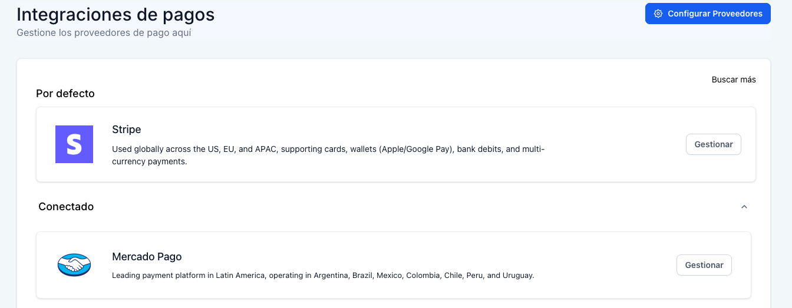
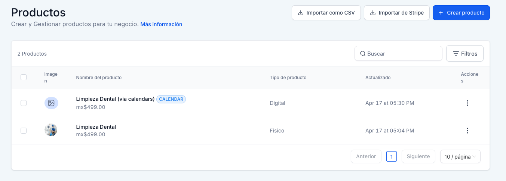

# 💳 7. Checkout, Pagos & Thank You Page

> Ruta: GHL desde Cero › 💳 7. Checkout, Pagos & Thank You Page

**🎬 Vídeo (20.4 min):** https://www.loom.com/share/c73f1a5837da4b08b9f0e8a3241ed8e5

---

**Curso: Go High Level Desde Cero · Sección 7 de 12**

> *Dinero en la cuenta antes de que lleguen al consultorio.*

El funnel ya captura y agenda — ahora la parte que todo dueño quiere ver: **cobrar**. Conectamos Stripe, probamos Mercado Pago (que acaba de salir para GHL), creamos nuestro primer producto, configuramos el checkout y hacemos un test completo de pago. Al final tienes un sistema que captura, agenda *y* cobra de forma automática.

## **📚 Qué vas a aprender**

- Conectar **Stripe** (test mode + live mode) a GHL
- Conectar **Mercado Pago** (integración nueva, muy útil para LATAM)
- Crear un **producto** con precio, descuento, imagen y categoría de impuestos
- Configurar la **checkout page** y el **thank you page** con variables dinámicas
- Test de pago completo con tarjetas de prueba

## **🛠️ Paso a paso**

### **1. Disclaimers importantes**

- **Mercado Pago** es una integración muy reciente — puede fallar intermitentemente. En el video intentamos primero con MP y al final usamos Stripe como respaldo. **Recomendación:** prueba ambos y usa el que te funcione más estable.
- **La mejor forma de integrar productos** es a través del funnel tradicional (desde plantilla o desde cero), no con AI Studio. AI Studio aún no conecta bien con el flujo de productos.

### **2. Conectar Stripe**

Ir a **Settings → Integrations → Payments → Stripe → Connect**.

- Inicias sesión con la cuenta de Stripe existente (debes tener una creada).
- Autorizar la conexión → listo.



Opcional:

- **Register Domain** → habilita **Apple Pay** y **Link** (autollenado de datos de pago).

### **3. Conectar Mercado Pago**

Ir a **Settings → Integrations → Payments → Mercado Pago → Connect**.

GHL abre una **documentación paso a paso** con capturas. Los pasos clave:

1. Crear cuenta en Mercado Pago (si no la tienes).
2. Tener una **cuenta de negocio** configurada.
3. Ir a MP → **Tus integraciones → Crear aplicación**.
4. Copiar las **credenciales de Test** y las de **Producción**.
5. Pegarlas en GHL (modo test primero).

### **4. Crear el primer producto**

Ir a **Payments → Products → + Create Product**.

- **Nombre:** `Limpieza Dental`
- **Descripción:** `Promoción del mes de abril — Limpieza dental completa`
- **Etiqueta:** `Promoción` (opcional)
- **Colección:** vacío (o crea una si agrupas productos por sucursal/promo)
- **Categoría de impuestos:** `Dental Hygiene Products` (o la que aplique en tu país)
- **Imagen:** ver siguiente paso



#### **Generar imagen del producto con IA**

Abrir Gemini (o ChatGPT, Midjourney, etc.) y usar este prompt:

> 📋 Prompt — Imagen de producto
> 
> "Dame una imagen realista para usar en el producto de mi limpieza dental en Go High Level. Tiene que ser una foto clara de una limpieza dental en un consultorio clínico moderno, estilo foto profesional, fondo neutro."

> ⚠️ Gemini incluye su logo watermark — para producción, usa otra herramienta sin marca de agua o remueve el watermark con Photoshop/Canva.

Descargar la imagen y subirla al producto.

#### **Precio con descuento**

- **Precio actual:** `499` (MXN)
- **Compare-at price:** `999` — esto muestra el descuento visualmente (999 tachado, 499 en grande).

Guardar. **Felicidades, tienes tu primer producto creado.** Los productos se sincronizan automáticamente con Stripe y/o Mercado Pago según la conexión activa.

### **5. Agregar el producto al calendario (cobro con la cita)**

Ir al calendario `Limpieza Dental` → **Edit → Advanced Settings → Payments**.

- Activar **Accept Payments** ✅
- **Proveedor por defecto:** Stripe (en el video empezamos con MP pero dio error, cambiamos a Stripe)
- **Tipo:** Sell Products — buscar y agregar `Limpieza Dental $499`
- **Modo:** Test (mientras pruebas) → Live cuando esté todo ok

> 💡 **Truco importante:** los formularios del calendario NO aceptan el producto en el campo "Accept Amount" simple — el producto se agrega al **formulario del calendario**. Ver siguiente paso.

### **6. Crear formulario personalizado con producto**

Ir a **Sites → Forms → Builder → + Create New Form**.

- **Nombre:** `Limpieza Dental $499`
- Campos: nombre, apellido, teléfono (opcional por políticas de GHL), email
- Sección **Products** → Add Product → elegir `Limpieza Dental`

Guardar y volver al **Calendario → Advanced Settings → Forms** → elegir el formulario recién creado.

### **7. Thank You Page dinámico con variables**

Editar la Thank You Page del funnel y usar **variables de GHL**:

Panel de variables → buscar **Appointment**:

```
{{appointment.date}}          — fecha completa
{{appointment.start_time}}    — fecha + hora
{{appointment.start_time_only}} — solo la hora
{{contact.first_name}}
{{contact.email}}
```

> ⚠️ **Pegar sin formato** (`Cmd+Shift+V`) para que no se rompa el estilo.

Ejemplo del texto:

> 📋 Plantilla — Thank You Page
> 
> **Reserva confirmada, {{contact.first_name}} 🎉**
> 
> ✅ Pago exitoso.
> 
> 📅 Fecha: {{appointment.date}} 🕐 Hora: {{appointment.start_time_only}} 📍 Ubicación: [Dirección de la clínica]
> 
> Te esperamos. Si necesitas reagendar, puedes hacerlo aquí: [LINK AL CALENDARIO]
> 
> **Preséntate con el código **`GRACIAS5` para obtener un 5% de descuento adicional.

### **8. Test completo de pago**

Abrir el funnel como si fueras un paciente:

1. Landing → **Agendar**
2. Calendario → elegir fecha/hora
3. Formulario → llenar datos
4. Checkout aparece con el producto ($499) y el campo de tarjeta

#### **Tarjetas de prueba**

**Stripe (test mode):**

```
Tarjeta:      4242 4242 4242 4242
Fecha:        cualquier fecha futura (ej: 12/30)
CVV:          cualquier 3 dígitos
```

**Mercado Pago (test mode):**

```
Tarjeta:      5031 4332 1540 6351  (MasterCard test)
Fecha:        11/25
CVV:          123
Nombre:       APRO
```

Click en **Pay**. Si todo salió bien:

- Te redirige al Thank You Page
- El contacto aparece en el CRM con la cita + pago registrado

### **9. Verificar el pago en el CRM**

Ir a **Contacts → [nuevo contacto] → Payments**.

También en **Payments → Transactions** aparece la transacción.

### **10. Cuándo cobrar online vs. en persona**

Cobra online cuando...Cobra en persona cuando...Quieres **reducir no-shows** (el paciente que paga viene)Es un servicio largo/variable y el precio puede cambiarEl servicio tiene precio fijoTrabajas con seguros o financiamientoPromos con deadline (crea urgencia)Es el primer contacto y no quieres fricción

## **📎 Recursos**

### **📋 Variables de GHL para el Thank You**

```
{{contact.first_name}}
{{contact.last_name}}
{{contact.email}}
{{contact.phone}}
{{appointment.date}}
{{appointment.start_time}}
{{appointment.start_time_only}}
{{appointment.reschedule_link}}
{{company.name}}
{{company.address}}
```

### **💳 Tarjetas de prueba**

**Stripe:**

```
4242 4242 4242 4242 · cualquier fecha futura · cualquier CVV
```

**Mercado Pago:**

```
5031 4332 1540 6351 · 11/25 · 123 · Titular: APRO
```

### **💡 Dos formas de cobrar en GHL**

FormaCuándo usar**Producto en formulario del calendario**Servicios que requieren agendar cita**One-Step Order (producto en landing)**Productos físicos o servicios sin agendar

## **⚠️ Troubleshooting común**

- **Mercado Pago rechaza el pago:** el token de prueba puede expirar. Vuelve a generar las credenciales en MP o cambia a Stripe.
- **El producto no aparece en el checkout:** verifica que asignaste el formulario correcto al calendario (Advanced Settings → Forms).
- **La fecha no se muestra en el Thank You:** estás usando la variable incorrecta. Prueba `{{appointment.start_time}}` en vez de `{{opportunity.date}}`.

## **✅ Checklist antes de avanzar a la Sección 8**

- [ ] Stripe conectado (test mode funcionando)
- [ ] Mercado Pago conectado (opcional, pero útil para LATAM)
- [ ] Al menos 1 producto creado con precio, descuento e imagen
- [ ] Calendario con el producto asignado vía formulario
- [ ] Thank You Page con variables dinámicas
- [ ] Test de pago completo exitoso (apareció en CRM y en Payments → Transactions)

## **➡️ Siguiente sección**

**Sección 8 — Workflows: Confirmaciones & Recordatorios.** El funnel está completo: captura, agenda y cobra. Pero hasta aquí depende del paciente. En la siguiente sección arrancamos con **lo más potente de GHL: las automatizaciones**. Construimos los 2 primeros workflows — confirmación automática de cita y recordatorio 24h/2h antes — para eliminar horas manuales de trabajo por semana.

## 🎙️ Transcripción

Muy bien, el fúnel ya captura y agenda, ahora lo que vamos a hacer es agregar la parte que todo duño de negocio quiere ver el cobra. En esta sección conectamos Stripe, configuramos lo que es el checkout page y cerramos con un TENQ page para consumar la cita y dejar el paciente con buena impresión. Afinante video hacemos un test de pago completo de principio a fin, aquí que hace un disclaimer, mercado pago como les comenté el video pasado es algo que acaba de salir apenas las semanas pasada. Vamos a intentar hacer la integración a ver si funciona y no nos quedaremos solo con Stripe. Segundo Disclimer, la mejor manera de integrar pagos y productos es creando tu landing page a través del embudo tradicional que les enseñé al principio del video pasado, donde escogamos una plantilla o de manera manual, pero tenemos las tres diferentes etapas del embudo, esto quisimos de la manera con el AI Studio, que es algo que está en beta, no es la mejor manera de integrarlo, perse video, vamos a intentar los dos, primero vamos a intentar con AI Studio y si no se deja, nos cambiamos de la forma habitual desde el creador de Enbubus, así que vamos a darle, lo primero es irnos aquí a la parte que dice settings, integrations, payments a checkout y a Stripe, vamos a darle conectar, con el Strape es muy sencillo, que es lo que hacemos, con el Google Stripe nos va a abrir una nueva pestaña que nos va a pedir la adicción de correo electrónico de la cuenta de Stripe, para esto ya tienen que tener evidentemente una cuenta de Stripe creada, vamos a iniciar sesión con el correo y pongo la contraseña y regresa, listo entonces ya el TikTok estoy intentado conectar la cuenta está mi nombre le voy a dar conectar y literal eso es absolutamente todo yo le puedo dar aquí a registrar dominio si quiero poder permitir que la gente pague con Apple Pay y link que link es un método en el que tú puedes guardar tus pagos y simplemente con correo con número de leofono de rellena automáticamente la información de tus métodos de pago que tenés aquí ha salgo importante que tanto Stripe como mercado pago te lo permiten que es tener el life mode y el test es muy importante por qué te recomiendo de su giro y siempre hagas pruebas a nivel test y adesirctivas como test constugas en un sandbox y puede ser pruebas de tu flujo al momento de pagar ya conectamos Stripe, ahora vamos a intentar conectar mercado pago, vamos a darlas y atrás, vamos a darlas y abajo mercado pago y la vamos conectar, ok, si se fijan aquí tenemos live y tenemos test, vamos a hacer test primero, aquí si le vamos aquí en View Documentation nos van a enviar esta documentación que es bastante nueva, y aquí te hice en paso por paso primero, evidentemente tienes que tener una cuenta en mercado pago y a configurada, dos nichos tienen una cuenta de negocio en mercado pago y a configurada, y tenemos que irnos a la parte de integraciones, your integrations, y aquí dice que crees una aplicación, test credentials, producción, producción credentials, etcétera, entonces yo en mi otra pantalla voy a seguir esto pero aquí está en modo toda la guía paso a paso, como voy a meter credenciales voy a poner pausa y regreso, listo ya tenemos mercado pago y Stripe conectados, aquí que sigue para poder vender ni estamos primero crear los productos, aquí estamos aquí en payments, aquí arriba podemos ver una opción que dice productos y productos, vamos a darle crear un producto y en ese caso vamos a llamarle la empresa dental, que es como el ejemplo que estiguamos haciendo, vamos a hacer como promoción de la empresa dental del mes de abril a sólo 499 pesos, muy bien, vamos a ponerle aquí en el más el símbolo y queremos que tengo una etiqueta, gracias a como que promoción y que se ha valido, dijimos que todo abril, que es parte de alguna una colección, puede ser una colección de promoción, es una colección de una sucursal, etcétera, en el caso no necesitamos, que tipo de categoría aplica para lo que son los impuestos, en este caso no sé qué tengamos aquí de servicios, o sea buscar médico, bed, paint, blankets, food, press, supplies, cosmetic, denta, hygiene, products, no en Medicaid, que no seleccionar. Esto tú puedes configurar si quieres que los impuestos cobres o no y no o de acuerdo a lo que tengas configurado en nivel global, entonces puedes subir aquí una foto del producto, así que vamos a hacer algo no vas para que va como se ve, vamos a Gemini y vamos a darle un prompt muy básico, vamos a decirles, la prensa que lo sé con nuestra cuenta activamos Create Image, dame una imagen para poder utilizar en mi producto que estoy creando en Goge Level es para una limpieza dental, tiene que ser una imagen muy clara que sea sobre una limpieza dental en un consultorio clínico, fue muy mal new prom honestamente, vamos a enviarlo y vamos para que se genera el imagen. Perfecto, unos generos de imagen, evidentemente tenemos el logotipo de Gemini para producción no lo usaría, el generario de otra forma lo ditaría, pero vamos a descargarlo y vamos a ver si no los acepta tal cual por el tamaño, lo la que se escargue, listo, la seleccionamos, podemos subir lado, los seleccionadores de ahí, es esta, la subimos, la vamos a double click y aquí está, la red dimensión no porque es cuadrado, decimos que es 499, que es la promoción, es aquí ¿Qué dice? Dice enter a have value higher than your price to display a markdown, this price show with extractor. ¿Qué quiere decir? Vamos a decir que el precio regular eso son 999, que no está promoción de donde 499. Podemos agregar un margen. O sea, hay un markup que es calcular. Digamos, es más que una con productos. Puede estar aquí alimentario. Puedes poner descripciones, membresías. No enistamos, variantes. No enistamos. Y aquí es un CEO engine listing, porque para que aparezca el producto indexado lo cual no requerimos en momento vamos a darle save perfecto entonces felicidades ya tienes tu primer producto que es una limpieza de total los productos al momento que los queremos aquí se sincronizan con los partners o con lo que tengamos conectados de caso Stripe y mercado para ok que es lo que siguen tenemos que dar el funer y tenemos que agregar el producto recién creado como les comenté es la primero es que voy a hacer esto utilizando leía y estudio, entonces vamos a preguntar la leía si lo puede hacer, acabo de crear un producto del limpieza dental por 499 pesos, puedes agregarlo en budo y agregar un decaut page dentro de la confirmación del calendario, cómo se vería, la gente llega a la landing page la página de tu resaje, de ahí ven la promoción que tenemos de 499 pesos, le dan clic para agendarlos también interesados y el mismo formulario del calendario les va a pedir la confirmación de los datos, más les va a dar el checkout page para que paguen, una vez que paguen los llevamos al thank you page, que en este caso va a decir que es confirmado de que se realizó el pago de manera satisfactoria y evidentemente tenemos que quitarlo el 5% de escuento porque ya pagaron y todo esto lo vamos a hacer en modo de prueba vamos a darle perfecto y a lo mandamos vamos a ver que nos dice la guía como os comentaba en un calave hecho de de esta manera pero mientras está trabajando que les parece si regresamos nos vamos aquí a nuestro embudo en sites funeles vamos a ver el primero que creamos que fue creo que parece que ese clínica son risa perfecta, no, no fue, vamos a darle back, frente a la poiment, ok, home, a poiment, en qué perfecto, fue muy bien, pues, entonces, ¿qué es lo que tenemos que hacer aquí? vamos a conectar en caso el calendario, y así que no hemos conectado ningún calendario, y vamos en caso de seleccionar aquí nuestro calendario, que sea limpieza dental, y muy bien como pueden verse en bebe aquí el calendario, así que vamos a darle guardar y publicar. Aquí quiero mencionar algo, tenemos dos formas de agregar productos a mudos. Una es agregándolo directamente en el formulario, en la configuración del calendario, y la otra es, yéndonos aquí en settings, verificar que el caso PEMIN mode se atest, porque queremos hacer pruebas, así que vamos a darle guardar, después de damos en el que es appointment, aquí le damos en configuración en productos, añadir producto, y aquí buscamos nuestro producto que queramos que se empresa la empieza aentar, el precio que tenemos para esto, el nombre de producto, y hay un price overwrite que no es, y en este caso vamos a darle save. Aquí el producto ya está, entonces nosotros vamos en appointments, por si nos vamos para acá, y la vamos a necesitar, ya me permite yo si lo de aquí en nuevo elemento, ya me va a permitir yo el más trabajo y hacer por ejemplo un one step order, yo lo puedo arrastrar donde quiera aquí y esto automáticamente me va a cargar ya el producto que yo agregué, por ejemplo, lo voy a dar guardar porque lo vean, va a ser una previsualización de la página y tengo mi calendario evidentemente esta no es la forma correcta hacerlo porque estamos agendando en el calendario mismo tiempo, porque es que enseñar como pueden agregar productos, y aquí automáticamente me sale el limpieza dental a 49 pesos, dice test mode y aquí está toda la información de pado y es de forma segura está siendo procesada por goja y leve. Ok, no es la forma que lo que necesitamos ahorita, pero les quiero comentar cómo hacerlo. Entonces regresamos para acá, eliminamos esto que no lo necesitamos, de hecho toda esta sección se puede ir que agregamos ahorita, Vamos a agravar, regresamos, los vamos a productos y lo eliminamos porque tampoco lo necesitamos. Vamos a regresar tanto con el A y Estudio a ver qué nos dicen. Dice contactan externo en su paquena tan workflows o que conectemos, añadimos una página de checkout, muy bien, Poyo está confirmado, gracias, checkout, vamos a check-out a ver qué lo quiso laía. Y era mi limpieza, no estemos en checkout. Vamos para que termine ver que hizo. Arate serum tracking. Vamos a darle tiempo en la ira a que termine de procesar y ahorita vemos que es lo que hizo. De todas formas yo les voy a enseñar como hacerlo de manera regular a través de el embole. No dice que ya terminó, dice simplemente la integración de CRM en el familiar de la página principal para que se automática entre los contactos que inician el proceso reserva. Y vemos que hizo todo esto. Así que vamos a darle publish para ver qué fue lo que pasó y vamos a darle update listo. dice que está conectado, vamos nos devuelto para acá actualizamos y dice agendar cita o quiero mi limpieza, porque elegí, etcétera, vamos a darle aquí en quiero mi limpieza nos manda para acá, después vemos otra vez esto, después vemos esto vamos a poner, reclarlo, rodo de gris, no sé si me manda el pago, no sé si lo detectó la ira y vamos a darle correo el electrónico, y vemos que ni estamos perdiendo nuevo, en el caso porca que vamos a hacer el correcto, darlos, un torro de gris, un guayme, voy a poner sin a él porque lo mejor si existe, y el teléfono me parece que es opcional, me dice ir a pago, en falta de largo, ir al pago, ok, de aquí me está mandando el pago como tal, Detecto que son los 499, el empecé a entrar con otro asoñido, aquí no buscimos otro asoñido, entonces quizá vemos que completamente la IA está alucinando, porque no existe esto y no sé cuál es el pago que tenemos conectado. No importa, por un escribes buen señor cómo hacerlo de la manera correcta, nos vamos entonces de vuelta a settings, nos vamos a calendarios, aquí en calendarios, el empecé a le damos en editar y vamos a dar en advanced settings payments vamos a decir que hace payments si se fijan aquí no está diciendo strike default manage payment providers y mercado pago gestionar lo tengo como prueba pero lo voy a decir establecer como predeterminado regreso para acá tualizo edito el calendario configuración avanzada payment si se nos admite el pago por defecto de el proveedor carpagos, que empeva, modo pro-denemico, no se procesan ventas, reales, esto es en pesos, y aquí nosotros estamos aceptando el pago, pero estamos poniendo el importe, que no es como tal, lo que es el pago de este producto en específico. Muy bien, ahora, como hacemos el pago de producto en específico, nos vamos en popular y confirmación y se fijan aquí si por defecto, solo tenemos el formulario, entonces lo que tenemos que hacer es darle volver atrás, nos vamos a sitios, aquí arriba en que se formulario, vamos a darle en creador, crear nuevo formulario, y digamos que este formulario se va a llamar de empieza, mental, 49, y necesitamos el nombre ha pedido y a vente todo eso también lo podemos cambiar, ingres, cesu, no, ingres, cesu, apelido y el teléfono y aquí vas con el nubile, y en teoría siguiendo las prácticas y las políticas correctas de goja y leve, los números de teléfono no pueden ser obligatorios, ok, tengan en cuenta eso, el correo que lo pones a saber como correo, el correo que no creo, arroba y miel está bien, y aquí obviamente esto que dice business name, just que esto es lo que tiene que cambiar a español, esto ustedes lo ditan desde aquí, tiene que poner esta cual el nombre real para que se usara esta campaña, porque son dos, uno es para que dan el consentimiento de que les pueden mandar mensajes de texto o correo por su servicio o lo que sea y el otro es que están dando un consentimiento que es el abajo de van a recibir mensajes o emails de marketing y de promoción. Ok, que nos hace falta del producto, lo seleccionamos aquí y lo restramos y aquí nos va a salir modo en tiempo real, estamos en prueba, que es lo que queremos vender productos, añadir producto, el único producto que tenemos que es limpieza mental, descripción, imagen y cantidad, vamos a dar la añadir producto y list. de 999 a 499, vamos a darle a guardar, no necesitamos ahorita más, nos regresamos para acá, nos vamos a lo que es configuración, calendarios, editamos el calendario, configuración avanzada, formulario, aquí ya sale el formular y empieza aentar, ok, primero selecciono la fichora y después el formular, vamos a le guardar cambios y si nos regresamos ahora si le embudo y esto ya le guardamos la vamos para atrás nos vamos de vuelta a embudos, senta la appointment, appointment, editar y aquí ya tenemos el calendario ya con el formular nuevo y le decimos que vaya al siguiente paso, así que le vamos a publicar y probemos, ok, evidentemente no quiero llegar aquí, tenemos que empezar el zoom y aquí este sería el flujo, obviamente hay que cambiar el logotipo y todo y para sutenemos la otra para que además se menos como funcionaría, la gente te risa aquí, ve la promoción, le puede dar aquí buca poemente, aquí arriba buca poem en lo que sea, que os lleva la siguiente página donde está el appointment, selecciona el caso 27, el horario que sea no sé 10 de la mañana y perfecto, me piden entonces mi nombre y veo que no me está saliendo de lo que es el pago, así que vamos a checar qué fue lo que pasó. Muy bien, mientras estaba grabando el vídeo me di cuenta de algo, ustedes saben que me siempre gusta hacer honesto y en los videos incluye los errores y cómo lo voy solucionando. Algo que me di cuenta es que hay dos formas de hacerlo. El calendario, como te hay los formularios de calendario, no aceptan los pagos en bebidos como estamos comprando aquí el formulario. Ok, es por eso que si nos vamos al calendario para acá vamos a darle configuración, calendarios, editar, cómo le estábamos haciendo payments, aceptar pagos, este caso será 499, tendré que ser una forma como un poco manual, que es decir que no podríamos vender un producto como tal, pero sí aceptamos un pado, no queremos pagos parciales, no queremos supones y descripción del pago sería promoción del mes de abril de limpieza mental de 999 a 499 pesos que vamos a poner el símbolo de pesos y como les comentaba aquí tenemos lo que dice prueba y en tiempo real queremos dejarla como prem, ok, cuando se sirve a hacer lo otro que está haciendo agregando el producto en el formulario o como les enseñé con el checkout directamente agregando el producto cuando tienes un producto que no requiere una agenda o que no vas a agendar algo en el calendario, ahí es cuando le apenas hacerlo de otra forma. Ok, entonces ya quisimos eso, si yo actualizo, escogó la fecha aquí en el calendario, como pueden ver, ya me sale aquí nombre, apellido, teléfono, email, con el checkout y me sale el Tesmode, esto es de mercado pago. Ok, entonces vamos a hacer una simulación y vamos a ver qué es lo que pasa, Carlos, Rodrigues, Carlos, Rodrigues, vamos a ver el número de teléfono X, correo, digitarla el y habíamos dicho, vamos a darle una tarjeta, que será 422, 422, 422, un tarjeto se prueba, 422, 422, 422, 422, 422. La fecha expresión tienes una fecha futura, pues en, por ejemplo, el 10 del 27 y esto puede ser cualquier cosa, Carlos Rodríguez, y vamos a darle, si si, rejected, or there reason, vamos a ver entonces en buscar aquí, déjame ver si hay algo que diga tarjetas de prueba de mercado pado, cuáles son los números de una tarjeta para hacer pruebas de compras con mercado o pago, se probar con el número entonces de tarjeta, porque el que puse 4, 2, 4, 2, me parece que es exclusivo de Striking List, vamos a darle listo, entonces si a esa dice thank you, y obviamente esto lo cambiaremos a Español, gracias a este pago reconfirmado, un poco como hicimos en la otra, y si nos vamos de vuelta al CRM, nos vamos a contactos, aquí podemos ver carros rodríguez, nuevos correos, nuevos teléfono y si nos vamos acá y abrimos el contacto, aquí vemos todo. Ok, página visitada, página visitada, formulario, cita reservada, contacto creado, aquí tiene un appointment y si sobre todo nos vamos a ir arriba, pagos, aquí podemos ver que se pagó fallo y luego pagó 499. Muy bien, por último, si nos vamos a pagos, producto transacciones, aquí vemos 299 que recuerden que esto puede en modo de prueba. Entonces, el funer está completo ahora, captura, henda y cobra, todo automático hasta ahora, pero depende de que el paciente haga las cosas. Ya haga después, quien le confirma, aquí en la recuerda, aquí en la SSGMX no viene, obviamente nadie todavía. A partir de la siguiente sección, nos arrancamos con lo más potente de Goge Level que son las automatizaciones y los flupos de trabajo. Nos vemos ahí.
