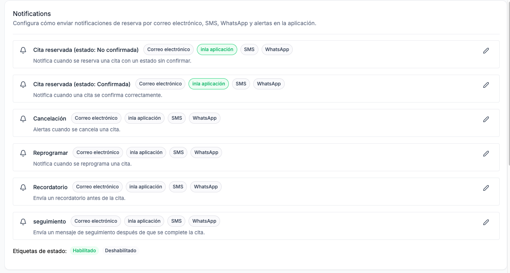
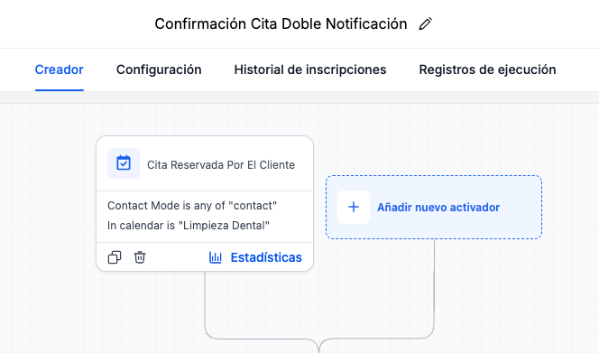
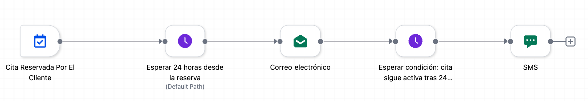

# 🤖 8. Workflows: Confirmaciones & Recordatorios

> Ruta: GHL desde Cero › 🤖 8. Workflows: Confirmaciones & Recordatorios

**🎬 Vídeo (27.2 min):** https://www.loom.com/share/59628a7f89464e1384397ef422ec1581

---

**Curso: Go High Level Desde Cero · Sección 8 de 12**

> *Tu primer robot trabajando para ti.*

Bienvenido a la parte del curso que cambia todo: **las automatizaciones**. Esto es por lo que GHL es realmente poderoso. En esta sección construimos los 2 primeros workflows — confirmación automática de cita + recordatorio 24h/2h antes — y dejamos a la clínica confirmando y recordando citas **24/7 sin intervención manual**.

## **📚 Qué vas a aprender**

- Qué es un **workflow** (comparado con N8N / Make)
- Anatomía: **Trigger → Acciones → Esperas (Wait) → Condiciones**
- Construir el workflow **"Confirmación de Cita"**
- Construir el workflow **"Recordatorio 24h + 2h antes"**
- Usar **variables dinámicas** (`{{contact.first_name}}`, `{{appointment.start_time}}`)
- Crear **plantillas de email** y **plantillas de WhatsApp** aprobadas por Meta
- Probar workflows con un contacto real (Jorge Rodríguez)

## **🎯 Nota previa: afinación de la landing**

Entre la Sección 6 y esta, ajustamos la landing para que se vea más profesional (CTAs mejor posicionados, sección "Por qué elegirnos", mapa, contacto por WhatsApp). Si tu landing necesita un pulido, es buen momento.

## **🛠️ Paso a paso**

### **1. Entender qué es un workflow**

Un **workflow** = instrucción automatizada. "Si pasa X → haz Y".

Muy similar a N8N o Make, pero integrado nativamente con el CRM, calendario, pagos y canales de GHL.

**Componentes:**

- **Trigger (disparador):** el evento que lo activa (cita creada, contacto creado, opportunity cambió de etapa, etc.)
- **Acciones:** enviar email/SMS/WhatsApp, agregar tag, crear tarea, mover opportunity, etc.
- **Esperas (Wait):** pausar X tiempo antes de la siguiente acción
- **Condiciones (If/Else):** ramificar el flujo

### **2. Desactivar las notificaciones nativas del calendario**

**Antes** de crear el workflow, ir a **Settings → Calendars → [tu calendario] → Edit → Notifications**.

Apagar todas las notificaciones de email, SMS, in-app (los checkboxes deben estar en gris, no verde).



> 💡 **¿Por qué apagarlas?** Para que las notificaciones vengan únicamente del workflow que vamos a construir. Si las dejas activas, el paciente recibe notificaciones duplicadas.

### **3. Crear el primer workflow — "Confirmación de Cita"**

Ir a **Automation → + Create Workflow → Start from Scratch**.

**Renombrar:** `Confirmación Cita - Limpieza Dental $499`

### **4. Configurar el trigger**

**+ Add Trigger → Appointment → Customer Booked Appointment**

Configuración:

- **Name:** `Cita reservada - Limpieza Dental`
- **Filters:** Calendar = `Limpieza Dental`
- **Invitee:** Contact only (no invitados)



> 💡 **Best practice:** siempre agrega el filtro de calendario. Si más adelante creas más calendarios, el workflow no se disparará accidentalmente para todos.

### **5. Cambiar a vista horizontal (opcional)**

Arriba del canvas tienes un toggle **Standard** / **Advanced**.

- **Standard:** flujo vertical (clásico)
- **Advanced:** flujo horizontal, izquierda a derecha, tipo N8N

Recomiendo Advanced si vienes de N8N — es más cómodo para workflows complejos.



### **6. Acción 1 — Email de confirmación**

**+ Add Action → Send Email**

- **From name:** dejar vacío (usa el default de Email Services)
- **From email:** dejar vacío
- **Subject:** `Tu cita en Sonrisa Perfecta está confirmada, {{contact.first_name}}`
- **Preview text:** `Detalles de tu cita y link para reagendar`
- **Body:** elegir **Select Template** → crear una nueva plantilla (ver paso 7)

### **7. Crear plantilla de email**

Ir (en otra pestaña) a **Marketing → Email → Templates → + Create Template → Plain Text Editor**.

> ⚠️ **Regla de oro:** para emails transaccionales (confirmaciones, recordatorios) usa **texto plano**, NO diseño visual con imágenes. Los correos transaccionales con muchas imágenes tienden a caer en SPAM.

**Nombre de la plantilla:** `Confirmación cita dental`

#### **📋 Plantilla — Email de confirmación**

```
Hola {{contact.first_name}},

Tu cita en Clínica Dental Sonrisa Perfecta está confirmada:

📅 Fecha: {{appointment.start_time}}
📍 Dirección: {{company.address}}

Te pedimos llegar 10 minutos antes para tu registro.

Si necesitas reagendar, puedes hacerlo aquí:
{{appointment.reschedule_link}}

¡Te esperamos!
— Equipo Sonrisa Perfecta

```

Guardar. Volver al workflow y seleccionarla.

### **8. Acción 2 — Plantilla de WhatsApp (utilidad)**

WhatsApp **solo permite iniciar conversación con plantillas aprobadas por Meta**. Hay que crearla primero.

Ir a **Settings → WhatsApp → Templates → + Create Template → Blank Template**.

Configuración:

- **Nombre:** `confirmacion_cita`
- **Tipo:** Utility (transaccional)
- **Idioma:** Español (México)
- **Encabezado:** Texto → `Sonrisa Perfecta - Cita confirmada`

#### **📋 Plantilla — WhatsApp de confirmación**

```
Hola {{1}}, tu cita en Sonrisa Perfecta está confirmada para {{2}}.

Te esperamos. Para reagendar: {{3}}

```

Variables (al crear la plantilla GHL te pide ejemplos):

- `{{1}}` → nombre del contacto (ej: Jorge)
- `{{2}}` → fecha/hora de la cita (ej: martes 21 de abril a las 11 AM)
- `{{3}}` → link de reagendamiento (ej: [https://clinicasonrisaperfecta.site/reschedule](https://clinicasonrisaperfecta.site/reschedule))

Submit a Meta → aprobación tarda **entre minutos y 24-72 horas**.

### **9. Acción 3 — Agregar tag**

**+ Add Action → Add Contact Tag → **`cita-agendada`

> 💡 Si la tag no existe, el campo te deja crearla al escribirla.

Esta tag servirá para filtros y reportes más adelante.

### **10. Publicar y probar**

Guardar → **Publish**.

Para probar:

- Agendar una cita desde el funnel (como hicimos en la Sección 6/7) con un contacto de prueba, ej. **Jorge Rodríguez**.
- Ir a **Automation → [workflow] → Execution Logs**
- Ver que el trigger se disparó, el email se envió, la tag se agregó.

### **11. Workflow 2 — "Recordatorio de Cita"**

Volver a **Automation → + Create Workflow → Start from Scratch**.

Aquí vamos a usar **AI** para acelerar: **Create with AI** y escribir el prompt:

> 📋 Prompt — Create Workflow AI
> 
> "Quiero crear una automatización cuando haya una nueva cita confirmada. Definir la fecha de la cita, esperar 24 horas y enviar un correo de confirmación si la cita sigue activa (opportunity status = confirm). Luego esperar 2 horas antes de la cita y enviar un segundo correo Y una plantilla de WhatsApp."

La IA genera el esqueleto del workflow automáticamente. Después lo revisamos y ajustamos manualmente.

#### **Ajustes manuales al workflow generado por IA**

**Trigger:** `Customer Booked Appointment` con filtro calendario = Limpieza Dental.

**Nodo 1 — Set Appointment Date:** usa el campo `{{appointment.start_date}}`. Sirve de referencia para los waits siguientes.

**Nodo 2 — Wait 24h antes de la cita:**

- **Wait Type:** Wait until specific date/time
- **Base:** Appointment start date (del contacto)
- **Offset:** -24 horas
- **Si ya pasó esa fecha:** Next Step (skip)

**Nodo 3 — Send Email (24h antes):**

#### **📋 Plantilla — Email recordatorio 24h**

```
Asunto: Mañana es tu cita, {{contact.first_name}} 🦷

Hola {{contact.first_name}},

Te recordamos que mañana tienes cita en Sonrisa Perfecta:

📅 {{appointment.start_time}}
📍 {{company.address}}

Tips para tu visita:
• Llega 10 minutos antes
• Trae tu identificación
• Si tomaste algún medicamento, avísanos

¿Necesitas reagendar? {{appointment.reschedule_link}}

¡Nos vemos mañana!
— Equipo Sonrisa Perfecta

```

**Nodo 4 — Wait 2h antes de la cita:** mismo esquema, offset `-2 horas`.

**Nodo 5 — Send SMS/WhatsApp (2h antes):**

#### **📋 Plantilla — SMS/WhatsApp recordatorio 2h**

```
{{contact.first_name}}, te recordamos tu cita HOY a las {{appointment.start_time_only}} en Sonrisa Perfecta. Te esperamos 📍 {{company.address}}

```

> 💡 **Copy-paste de nodos:** click derecho sobre un nodo → **Copy Action** → pegar. Útil para replicar estructura similar.

### **12. Test en vivo con Jorge Rodríguez**

- Agendar una cita mañana a las 10 AM
- **Execution Logs** → ver el primer workflow disparado (confirmación)
- Esperar el wait del segundo workflow o **forzar manualmente** (click en el contacto en el wait → Push to next step)
- Verificar que llegaron: email de confirmación, email 24h antes, SMS/WhatsApp 2h antes

## **📎 Recursos**

### **📋 Variables más usadas en workflows**

```
{{contact.first_name}}
{{contact.last_name}}
{{contact.email}}
{{contact.phone}}

{{appointment.start_time}}         — fecha + hora completa
{{appointment.start_time_only}}    — solo la hora
{{appointment.start_date}}         — solo la fecha (para condiciones/waits)
{{appointment.reschedule_link}}
{{appointment.cancel_link}}

{{company.name}}
{{company.address}}
{{company.phone}}
```

### **🎯 Regla de oro de workflows**

**SIEMPRE haz un test antes de activar en producción.**

- Crea un contacto "Test Jorge"
- Dispara el trigger manualmente o con una cita real
- Verifica que lleguen todos los mensajes en los tiempos correctos
- Revisa el **Execution Log** para confirmar que no haya errores

### **⚡ Upgrade avanzado (opcional)**

En vez del SMS 2 horas antes, conecta un **agente de voz** de GHL que marque al paciente:

> "Hola {{contact.first_name}}, soy el asistente de Sonrisa Perfecta. Te marco para recordarte que tu cita es en una hora. ¿Ya vienes en camino? Presiona 1 para confirmar, 2 para reagendar."

Esto reduce aún más los no-shows.

## **⚠️ Troubleshooting común**

- **Plantilla de WhatsApp no se aprueba:** revisa que el tono sea transaccional (no marketing). Una plantilla que diga "Aprovecha 10% de descuento" no se aprueba como utility — tiene que ir como **marketing** (más caras).
- **El email no se envía:** verifica que el dominio de email esté verificado (Sección 3) y que el template esté seleccionado en el nodo.
- **Wait se dispara inmediatamente:** el offset está mal configurado. Revisa que `start_date` venga del contacto, no de la fecha actual.

## **✅ Checklist antes de avanzar a la Sección 9**

- [ ] Workflow "Confirmación Cita" activo y probado
- [ ] Workflow "Recordatorio 24h + 2h" activo y probado
- [ ] Plantilla de email de confirmación creada
- [ ] Plantilla de email de recordatorio 24h creada
- [ ] Plantilla de WhatsApp `confirmacion_cita` enviada a aprobación
- [ ] Tag `cita-agendada` creada
- [ ] Al menos un test real con Jorge Rodríguez (o contacto de prueba)

## **➡️ Siguiente sección**

**Sección 9 — Workflows: Reseñas, Cumpleaños & Fidelización.** Acabamos de automatizar el **antes** de la cita. Ahora vamos con el **después**: pedir reseñas de Google automáticamente, felicitar cumpleaños con cupón y recordar limpiezas semestrales. Estas son las automatizaciones que convierten un paciente de una visita en un cliente de por vida.

## 🎙️ Transcripción

Muy bien, bienvenido a la parte del curso que lo cambia a todas las automatizaciones. Este es algo por lo cual, goja el level es muy poderoso, pero recuerdo lo que hicimos en la sesión pasada. Construimos nuestro página de terrizaje, nuestra landing page, hicimos el checkout page y hicimos el thank you page, todo esto son las tres steps, los tres stages de enbudo. Disacúrren en la clase pasada, les enseñé hasta cuatro maneras diferentes de poder hacer sus páginas de aterrizaje. Después de que terminé el video y se nos ajuste desmínimos en cuanto a diseño de la página para que se vea un poco más profesional. Pidentemente por cuestiones de tiempo no me metí muy a fondo, ya que si quisieramos podremos meter CSS, muchas más animaciones y en realidad crear páginas a un nivel muy dentro de la misma plataforma. Les voy a enseñar un poco de cómo quedó la página, entonces tenemos un nuestro hero. Esa es para la promo que vamos a hacer de la empieza de tal por 499. Aquí tenemos nuestro cta y nuestro botón de llamada la acción. Casos de éxito y reseñas de clientes. ¿Por qué elegir la clínica? Quiero mencionar que esos imágenes fueron queradas directamente por jchel cuando yo le pedí lo que quería hacer. Y aquí para contactar si yo le estoy en mi script por whatsapp me horno una nueva pestaña para mandar un mensaje directamente y esto me abriere mi whatsapp. un mensaje ya ha predefinido como que hola, vengo de tu página de terresaje y me interesa la promoción del epicentan, darle cancelar y hasta aquí abajo un mapa de donde estamos ubicados. Entonces vamos a darle clic en el sitio en llamada la acción y nos va a enviar a la página del check out donde nos pide que agendemos, aquí tenemos el calendario, que inclui tu limpieza, etcétera, vamos a cofer una fecha, vamos a agendar un evento real, voy a poner aquí aquí a vivir mañana las 10 de la mañana y va a pedir mi nombre en el caso vamos a ponerle Jorge Rodríguez igual lo vimos la clase pasada pero para que tengamos ahorita un evento total cual Rodríguez y vamos a poner un teléfono y vamos a poner un correo, vamos a ponerle que sea aquí y vamos a poner el card number, recuerden que estamos en test mode, estamos utilizando mercado pago, entonces vamos a poner aquí la información de la tarjeta de prueba de mercado pago, listo y vamos a darle agenda, perfecto aquí en digital bien, está procesando el fundamento más que nada procesando el pago, porque aunque sea un pago con información falsa, que lo tiene que validar y se promoción del mes de limpieza en tal de nuevo 4999 y nos da un error pricing, vamos a ver si algo estaba en la tarjeta de créditos que es el 54, de 4, 1, 2, 5, 4, 3, 2, 6, 7, sobre 3, 6, 6 y tiene que ser una fecha futura, vamos a meter un año más por cualquier cosa y el código de seguridad si es 1, 2, 3, vamos a dar internet errors, esto puede ser un problema de mercado pago directamente, así que como ya saben, si en video les enseñé como ilusión a los problemas. Vamos a regresar acá, vamos a irnos a configuración, integraciones, algo así, procesos de compra y mercado pagó está por defecto, vamos a cambiar strike, establecido como proyecto terminado, no regresamos aquí, actualizamos la página, volvamos a coger mañana el caso 12 p.m. para que no piena remanente y se fijan cambio la estructura, ya esto cambie un poquito, esto es de strike. Entonces vamos a poner de nuevo el hombre que teníamos, porque prodríguez, teléfonos, más un botón, tiene un chile 5.4, el email. Recuerden que no se aceptan campos duplicados por cuánto inventan la información, en Strafe 4.2.4.2.4.2.4.2.4.2.4.2.4.2, una fecha futuras y el cvb no importa, en el tracento vamos a ver la agenda, yo creo que hace por qué falló mercado pago, ahorita que me acuerdo cuando generé el toquian de pruebas le puse que expirara en un día, por lo cual falló, aquí nos dice reserva confirmada, pago exitoso, detalle tu cita fecha, hora de inicio, ubicación, fecha y hora de inicio no sale nada, ahorita lo corregimos, ahorita vamos a ver por qué, y nos vamos aquí de nuevo a nuestra en sitios, que empieza a entrar el 499, no es perfecta, tampoco hay aquí, es para darle editar, aquí tenemos una appointment date, lo correcto vamos a ver cuáles, ahora una pestaña va a poner variables, de go high level, fecha de appointment, dice que es Apoyment, Dark Date, es un oportunidad, pero es una poem en como tal, entonces vamos a regresar aquí, la poem en Star Time, la poem en Star Time, vamos a pegarlo de esta manera y va a ser el Apoyment Star Date, están mal los valores que me puso laía, y de haber uno para apoyment Star Date, vamos a ver si lo podemos mapar, control de feo hasta poner Star, aquí regresamos, no lo voy a cortar, porque quiero que vean todo, así si aquí lo teníamos, no tengo la variable, me voy a poner un listar y no se popiar esto, esto tuvemos aquí, con control shift B, pero no cambiar el formato, vamos a darle guardar, pública, vamos a refrescar aquí y list, que ya nos sale la fecha 20 de abril, hora inicio 20 de abril 2016, esto lo podríamos cambiar, la que el hora de inicio, sea únicamente la hora y se está tan only. Entonces sería copiar, regresamos, pegamos, pegamos sin formato, público, actualizo, ese tabelo, se apuemen only start time, only start, por alguna razón no me lo está actualizando todavía, pero eso es el correcto. Fecha miércoles, hora de inicio, miércoles 20 de abril, 2016, las dos. Y esa es mi formación que yo le pide más, contactan vamos por WhatsApp lo mismo, como pueden ver ahí es un listo de regener misita y aquí para botón de regener muy bien, y nos regresamos, ok, vamos entonces a contactos, verificamos Forge Rodriguez, porque es el nuevo que creé y vamos a calendarios y vamos a ver vista de calendario, y aquí tenemos Forge Rodriguez para mañana calendario de limpieza mental de donde vino del booking widget, etcétera, inclusive aquí podemos ver lo que se envía en el formulario y que se pagó 49% perfecto. Muy bien, entonces que sigue, ya que vimos que tenemos el calendario de enseñar la creación rapera en la página, vamos entonces a construir un sistema que en verdad funciona, que vamos a hacer lo que es confirmar las citas, mandar recordatorios, hacer seguimientos, en esa sección entonces vamos a construir los dos primeros workflow, uno, confirmación automática de citas y recordatorios para reducir los new shows y cuando terminemos la clínica va a poder confirmar citas y recordar citas de manera autónoma 24 horas a día, siete días de la semana. Para eso vamos a aquí donde dice automatización, ya que estamos aquí vamos a dar dice que crear flujo de trabajo lo pueden hacer es una plantilla lo pueden hacer utilizando plantillas de la empresa o lo pueden empezar desde cero y empezando desde cero van a poder hacerlo manualmente o utilizando el AI en el caso yo les voy a enseñar cómo hacer lo manual primero que es un workflow o que es un flujo de trabajo un por flow es básicamente una instrucción automatizada y quiere decir como más o menos lo que hacíamos con en hn o make y pasa esto entonces a esto en ye che lo puedes encadenar con condiciones esperas, múltiples acciones, filtros etcétera es muy parecido a la forma en que trabajamos con una forma de cambiar cómo vemos el flujo de trabajo. Podemos ver creadores standard, que es la forma standard, como lo ha manejado y he hecho por muchos años, o el avanzado que es un poco más bien o muy parecido a lo que hemos visto con N8N. ¿Ok? Que vamos a hacer en el primer flujo, vamos a poner un trigger que es un disparador, se concepto ya muchos lo manejan y ese disparador va a hacer cuando tengamos una nueva cita, ok? entonces vamos a añadir primer paso, añadir activador, telado lo buscamos y tenemos activador disparador recientes que es de un webcook, tenemos recordador de cumpleaños, contacto modificado, contacto creado, dn del contacto, etiqueta contacto, recorratores, fecha personalizada, nota añadida, etcétera. Tenemos aquí todos los eventos, formular enviado en cuesta enviada, el cliente respondió llamada, dictó, exigimiento de video, validación de números, estado de la cita y aquí tenemos cita reservada por el cliente, vamos a escogerlo, aquí donde dicen lombres algo que nos podemos poner, no sé si tarcela por el cliente, vamos a ponerle la empieza a entrar, por ejemplo, ¿qué? quién va a entrar aquí, solamente el contacto, el contacto invitado, solamente invitados, ¿por qué? porque en algunos calendarios se te permite poner invitados, este caso como es una limpieza dental no aplica, pero imagínate que tú tienes un formulario en tu web para que agente una sesión entre tenéis contigo para platicar sobre un servicio que le quieras vender y la gente pueda agregar invitados a los cuales también ellos se les van a enviar el correo de invitación junto con el lace y los recoratorios. Entonces tú cuando trabajas en un flujo en los flujos y pones como disparador cuando se cree una nueva reunión o una nueva cita, en este caso tú puedes seguir si solamente quieres incluir el invitado en el flujo, todo lo que continúa aquí para abajo o al contacto o almos, en ese caso solamente queremos el contacto y recomendaciones siempre añaden a filtros y que el filtro sea el calendario que tenemos, en ese caso solo es uno, pero ¿qué pasa si más adelante ustedes empiezan a crear más calendarios y no poner filtro, esto se va a empezar a disparar para todos los calendarios que ustedes empiezan a agregar en el futuro, entonces eso es una muy buena práctica desde un principio poner los filtros, vamos a darle guardar y antes de continuar que les parece si renombramos el flujo de trabajo, se va a llamar como a fila y empieza dental de 499, se fijan se guarda automáticamente, antes de continuar quieren enseñarles algo porque seguro mucho lo vieron cuando estábamos carando el calendario, así que voy a quedarle duplicar para una nueva pestaña, me voy a ir para atrás, me voy a ir a configuración calendarios, editar notificaciones, Seguro muchos vieron esto cuando yo estaba creando, este es algo que ya trae incluido el calendario, pero digamos que en otros formas que lo trae incluido vamos a usarlo, esto tú puedes poner si es correo electrónico en la aplicación sms o whatsapp, si ven siglas un poco raras es honestamente la traducción del sistema no es muy buena, percaso correo electrónico lo tenemos apagado, tal no le vamos a avisar en ninguno de los usuarios, lo mismo por si te reserva en la aplicación y todo lo más está pagado, si no está en verde es que está pagado, ok, entonces eso quiere decir que a la gente no le va a llegar nada, más que el evento como tal, entonces regresamos acá y se fijan flujo y va a disquear a derecha que es un poco más como trajando en hn, inclusive bueno, podemos mover alrededor y también tenemos la opción de dejar notas adecidas por ejemplo aquí empieza el clube y esto lo pongo el machiquito y lo muevo para acá, un poco más grande, etcétera, muy parecido de NHN, entonces continuamos, que sigue después, queremos que cuando la cita se agenda, todo bien, cuál es la primera acción que queremos hacer enviar un correo electrón, por lo electrónico, nombre el remitente, en caso, que siempre es ponerlo que vemos que se envieses de clínica, donde risa perfecta. Pero veamos que dice aquí, y los campos nombres remitentes, correo electrónico remitentes están vacíos, el correo electrónico se libera utilizando los valores por defecto. ¿Cuáles son los valores por defecto? Los valores configuramos en email services, configuración, domínio dedicado, nombre de clínica son risa perfecta. Estos son los valores por defecto. Así que si esto lo dejamos vacío se va a enviar estos valores por defecto, esto se lo pueden ajustar a nivel que es decir cada correo o en configuración aquí abajo de todos los correos que tengan de flujo van a llevar en el mismo nombre y desde que correos están bien, así que tienen esas tres opciones diferentes, en este caso yo voy a dejar todo vacío porque lo que tengo ya en los valores por defecto es más que suficienta. Perfecto. Entonces vamos a agregar el del correo, nombre el limitemente que lo voy a dejar así y donde irá correo electrónico voy a que manda, voy a cambiar a correo electrónico confirmación de cita. Asunto voy a ponerle cita está confirmada y aquí le doy clic en este tiqueta y voy a escoger el nombre de el contacto para que salga en el asunto del correo y vamos a cambiar esto. Encavesado texto de previsualización para que nos sirve, esto es lo que sale en, digamos, hasta sin Gmail, tal de lado izquierda abajo del asunto como texto de previsualización. Esto lo puedes dejar vacío, es opcional, yo lo recomiendo que lo ponga. Ahora, aquí tenemos diferentes formas. Podemos hacer redacción rápida, que nosotros escribimos a que el cuerpo el correo, lo podemos escribir conía, o podemos seleccionar plantillas y ya tenemos las plantillas creadas. En este caso todavía no tenemos plantillas, pero que les parece si ahora tendrá más con un texto para poderlo guardar y vamos a generar una plantilla, ¿les enseño dónde? Vamos atrás, vamos donde dice marketing, por los electrónicos, plantillas, crear plantillas, te pueden darle editor de diseño, que es un editor visual y arrastrar y soltar, editor de código o editor de texto sin formatos. Mi recomendación siempre es cuando manden este tipo de correos transaccionales que no utilicen código ni diseño, porque puede llegar a hacer que esos correos lleguen a la bandeja de no deseado. No hay nada como el texto plan, vamos a darle seleccionar. Perfecto, te vamos a caminar el nombre de la plantilla y va a ser confirmación cita dental o aquí, también las plantillas, vamos a poner aquí. Pueden dar el asunto y la provisualización de el texto. Si lo dejan vacío, también lo van a poder configurar directamente desde el workflow. En el caso, el asunto, si lo voy a poner aquí, ya tengo obviamente todo esto preparado, voy a darle guardar. El texto, o esto, vamos a ponerle, dice, hola, el nombre, usted tiene clínica en tal sonrisa perfecta, está confirmada. más estatal código raro fecha ahora dirección y dirección de la clínica en el caso yo puedo borrar esto y creo que clica aquí arriba puedo meter lo que son los valores personalizados en este caso sí lo pongo business que es el negocio o en este caso pote tener valores personalizados que yo agregue, envío de reseña, complemento de pedidos, pago, comercio electrónico, documentos, etcétera, muchísimos formación, Shopify y todo. Entonces el caso va a poner Business y Dirección, y la dirección de el negocio. Que podemos llegar a 10.000 centros para tu registro, cineistos, regendar, link del calendario, en el caso vamos a borrar esto, vamos insertar esta variable que sea, no sabéis, pero entre pedidos, factor de estimación, recibe, comercio, enlace pago, cumplimiento de pedidos, vamos a verle contacto, un tipo de contacto fecha en crecimiento, no, por tanto de cliente pago, cumplimiento de pedidos, engojoseño, nuestro acostumbrado, sí, perdón, nuestro acostumbrado a verlo enlace de reprogramación. esperamos y equipos son risa perfecta y le damos guardar plantilla ahora también podemos mandar mensajes por whatsapp ok de caso las plantillas de whatsapp funcionan diferente para eso nos vamos a ir en configuración whatsapp plantillas y aquí podemos darle unice crear plantilla vamos a darle plantilla en blanco nombre de la plantilla vamos a darle confirmación chita tipo de plantilla utilidad que tiene el caso es de utilidad y dioma es importante escoger el idioma correcto vamos a ponerle español méxico mostrar encabezado es va a salir un título que va a salir arriba y va a ser el caso clínica con risa perfecta va a ser el encabezado de tipo texto vamos a agregar nuestro lo tipo o algo así y el cuerpo podemos decirle hola, aquí vamos a añadir variables, va a ser nombre, va a ser aquí user contacto personal, los vamos a poner el ejemplo hola perfecto, es como se vería hola jorto, tu cita, tu cita en con risa perfecta, está confirmada para él, aquí añadimos otra variable y sería, aquí se ven esta en ingles, start day time, vamos a ponerle, vamos para el a las y agregamos variable, podemos en start time, vamos a probar esta conferida para el martes 21 de abril a las 11 de la mañana, este es simplemente como prueba de cómo se vería, y luego le ponemos que esperamos, que antes de ponerle la agenda, agregamos variable y aquí va a ser appointment through schedule link, y aquí va a poner una chptp 2.debona link que viene y graz con risa perfecta punto, y bueno los sketches, nada más como para que vamos a nos conoce a ver, pide página no, no queremos botones, es decir que vamos a esto lo mandamos a aprobación, metas, se toma su tiempo en aprobarlo, dejamos si me da algún error o algo, daba la Jorge Tucita, nos esperamos, todo el error no me marco ningún error, le dedico a crear pero no vi que me saliran nada así que me voy a arriesgar y le voy a dar para atrás de estas ramas no lo vamos a por ser, sí me vuelvo. Estas ramas le estoy enseñando más o menos como vean, pero me he tarde de mi experiencia de 24 a 72 horas en aprobar las plantillas. Entonces, si yo quisiera mandar aquí también, le puedo dar WhatsApp, en ese caso sería WhatsApp, puso mi service window check, WhatsApp sent flows, y aquí me dice conversación por number, de esa vez de cual voy a enviar aquí, nombre la secursada open, puso mi service window is open, nombre la secursada clavos y listo y obviamente aquí la whatsapp user sensegme message you have 24 hours when you open en caso no es correcto es una plantilla whatsapp que aquí es selección de la plantilla lo cual no tengo todavía y aquí yo pondré a mi plantilla donc seleccionó en la plantilla pero aquí dice preform message pero no va a permitir enviarlo no pero aquí ustedes escogerían la plantilla para enviar ok que sigue y por último lo que que podríamos hacer sería agargar una etiqueta, agargar una etiqueta de contacto y que la etiqueta sea el lit nuevo, no show pacientactivo, servicio completo, es un lit nuevo hasta que no se agende algo, vamos a crear una nueva etiqueta, si yo aquí pongo cita, agendada, aunque no existe, me va a permitir darle a añadir una etiqueta y lo voy a aguardar y luego lo voy a aprender, muy bien, vamos a darle para atrás, vamos a generar un plufo de trabajo, empezar desde cero y vamos a ponerle aquí, recordatorio, crecita y empieza 499, y aquí vamos a hacerlo conía para que vean más o menos cómo funcionaría, el mismo trigger, pues yo le puedo decir, quiero crear una automatización cuando haya una nueva cita confirmada, definir la fecha de la cita, esperarme 24 horas y enviar un correo de confirmación y la cita sigue activa que la poemene estatus es igual a confirm, entonces esperarme 2 horas antes de la cita y enviar un segundo correo y una plantilla de whatsapp, inclusive no lo vamos a ser ahorita, pero si lo llevamos al siguiente nivel, ustedes podrían hacer que una hora antes configurar una odbancol, una llamada saliente y que tengan una ia marcando y simplemente parecielo o la Jorge, estoy marcando porque tus sitas en una hora, probablemente que nos confirmar que ya vienes en camino, porcusiones el tráfico, etcétera. Entonces aquí vamos que la ia me dice, cuando te gustará iniciar esa tomación para estas confirmadas, cuando la sita es creada con está confirmado cuando el cliente reciente cambia de estado confirmado cuando el cliente reserva una cita se casas y la cuando la cita es creada cuando está confirmado o cuando el cliente reserva una cita diría cuando el cliente reserva una cita vamos a ver qué más nos pregunta ok está trabajando voy a ponerle pausa para cortar un poco el vídeo perfecto ya terminó la verdad no lo hice también porque perfecto cita confirmada contact only event site normal apúem un esatocis confirm create by costumer pero que pasa si nosotros lo creamos manualmente porque estamos en llamada no va a funcionar etcétera entonces donde esta no me gustó vamos a borrar de aquí vamos a borrar esto si está bien vamos a crear nosotros el disparador va a ser una quita reserva por el cliente el contacto y edimos el filtro que es en el calendario y empieza dentro, igual que anterior, vamos a cambiar la vista para que funcione como el otro. Perfecto, establecer fecha de la cita, establecer fecha de la cita campo por un utilizado, a pomo star date, o podemos también seleccionar día específico o fecha llora específico, pero establecer fecha de la cita con el a pomo star date que es en base a esto, está muy bien, vamos a darles espera 24 horas desde la reserva, espera 24 horas de la reserva y ven service booking time o también lo que vamos a hacer es quitar esto, que no lo necesitamos en realidad, unimos aquí y le hicimos que aquí va a ser en base al appointment, al appointment que tenga contact. Vamos a darle este caso sería 24 horas y si el momento de pasos esperaría pasado como proceder al contacto, pasar al siguiente paso. Esto quiere decir, si cuando entró el contacto hay flujo, la fecha de su appointment o de su cita, ese menos de 24 horas va a brincar esto. Vamos a darle guardar acción y en el caso que tenemos que hacer aquí faltó el enviado correlectrónico y entonces vamos a grabar vacío, en esta ocasión si lo vamos a hacer manual para que vean, luego por el mañana, es tu cita y lo voy a poner el nombre. Eventemente en práctica y nos recomiendo que hagan esto con correo, porque quien va a estar en su correo si el día siguiente tiene una cita, lo mejor es hacerlo todo por WhatsApp por lo menos para Latinoamérica. Vamos a poner el mensaje manual, a mí copiar de la plantilla que ya tengo lista, por la decoramos que mañana tiene citen sonido perfecta, vamos a borrar esto, dirección, vamos a poner aquí como les dije, company, adres, para tu visita, estas regendar, ponemos en el lance de regendar, me quedé el appointment, rescale el link, nos vemos mañana y le damos por verdad. Luego dice esperar, dice last appointment, es confirm, hasta que el último appointment está como confirmado, entonces vamos a volver a mandar, que se fiquen, podemos dar clic aquí, opiar acción y en el momento que le damos acá vamos a funcionar diferente dice acciones copiezas por despegue las en cualquier flujo trabajo, vamos pegar simplemente un ínice, chame un poquito en ese tipo de flujo, cual tenemos esto como como da algo, es como la escovita de noche y en caso el correo no sea la mañana estucita que recordamos ustedes hoy a las vamos a hacer una cosa, casi en ahí lo usa en la TN, pero vamos a agregar un mensaje de texto, suponiendo que es un whatsapp, parece más fácil, entonces lo voy a vamos a poner, contacto, first name, te recordamos que tu cita es 4 en 2, 4 en risa perfecto, te esperamos, vamos a darle guardar, publicamos y listo. Muy bien. Entonces, sus recomendaciones. Quiempre has pruebas, has un flujo donde rejiche es una persona, veas que pasa por todo el himbudo, que si le le llega en los mensajes, el WhatsApp, el email, lo que necesites. Siempre verifica, antes de mandar a producción, asegúrate que todo esté funcionando, que los tiempos de espera funcionen, etcétera. perfecto, que tenemos dos borcos corriendo, la clínica confirma así hasta el instante y manda recorteos automáticos, acá vamos a eliminar horas de trabajo manual por semana, pero esto apenas es el comienzo, en la siguiente sección automatizamos algo que la mayoría de negocios ni siquiera piensa hacer, que es pedir reseñas de Google, felicitar en cumpleaños y recordar limpiezas semestrales, son automatizaciones que fidelizan y que generan dinero a largo plazo, así que nos vemos en la siguiente lección
