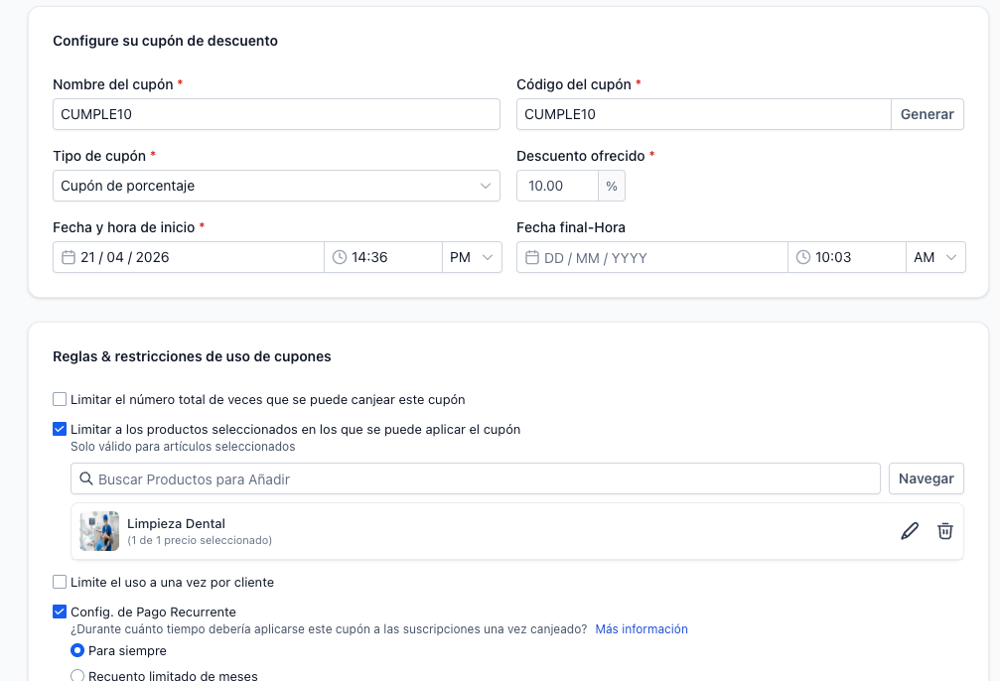
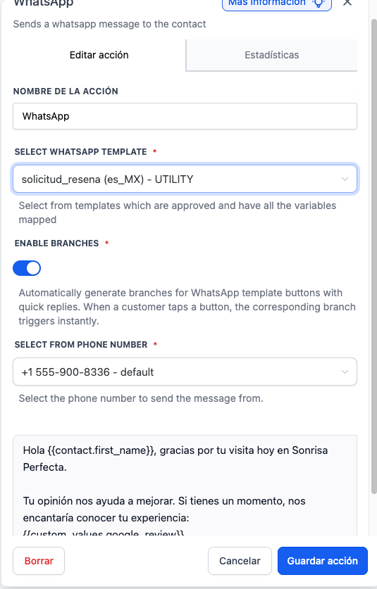

# 💚 9. Workflows: Reseñas, Cumples & Fidelización

> Ruta: GHL desde Cero › 💚 9. Workflows: Reseñas, Cumples & Fidelización

**🎬 Vídeo (16.5 min):** https://www.loom.com/share/7b58410f311f40669526758b17ab645e

---

# **Workflows: Reseñas, Cumpleaños & Fidelización**

**Curso: Go High Level Desde Cero · Sección 9 de 12**

> *El paciente que regresa vale 10 veces más que el nuevo.*

Los workflows de la sección anterior resuelven el **antes** de la cita. Ahora vamos con el **después** — donde la mayoría de los negocios pierden dinero sin saberlo. Construimos 3 automatizaciones que convierten un paciente de una sola visita en un cliente de por vida: reseña post-cita, felicitación de cumpleaños con cupón y recordatorio semestral.

## **📚 Qué vas a aprender**

- Crear un **cupón** de descuento dentro de GHL (`CUMPLE10`)
- Diferenciar plantillas de WhatsApp **utility** vs. **marketing**
- Workflow 3 — Solicitar **reseña de Google** 2h después del servicio
- Workflow 4 — **Felicitación de cumpleaños** con cupón
- Workflow 5 — **Recordatorio de limpieza semestral** (genera revenue pasivo)

## **🛠️ Paso a paso**

### **1. Crear el cupón CUMPLE10**

Ir a **Payments → Coupons → + Create Coupon**.

- **Nombre:** `CUMPLE10`
- **Código:** `CUMPLE10` (mayúsculas)
- **Tipo:** Porcentaje
- **Descuento:** 10%
- **Inicio:** hoy
- **Caducidad:** sin expiración
- **Aplica a:** producto `Limpieza Dental`
- **Uso por cliente:** ilimitado



### **2. Utility vs. Marketing templates en WhatsApp**

Antes de los workflows, entender la diferencia:

UtilityMarketingMensaje transaccionalMensaje promocionalConfirmar/recordar/actualizarOfertas, descuentos, promos**Más barato**Substancialmente más caroRequiere interacción previa del clientePermite iniciar conversación

> ⚠️ **Cuidado:** si Meta detecta que estás enviando plantillas de marketing como utility, **te penaliza** y cambia TODAS tus plantillas a marketing (precios más altos).

**Regla práctica:**

- "Tu cita está confirmada" → **utility** ✅
- "Agenda tu limpieza esta semana con 10% de descuento" → **marketing** ✅
- "Gracias por tu visita, déjanos una reseña" → **utility** ✅ (no mencionas promo)
- "Reseñanos y te damos 10% de descuento" → **marketing** ❌ (y va contra políticas de Google)

> 💡 **Nunca ofrezcas descuentos a cambio de reseñas en Google.** Viola las políticas de Google y te pueden bajar todas las reseñas.

### **3. Crear las plantillas de WhatsApp (ahora o mientras esperas aprobaciones)**

Ir a **Settings → WhatsApp → Templates → + Create Template**.

#### **📋 Plantilla WhatsApp — Solicitud de reseña (UTILITY)**

```
Hola {{1}}, gracias por tu visita hoy en Sonrisa Perfecta.

Si tu experiencia fue buena, nos ayudaría mucho una reseña en Google 
(toma 30 segundos): {{2}}

¡Gracias!

```

- `{{1}}` → first_name
- `{{2}}` → link de Google Reviews

#### **📋 Plantilla WhatsApp — Cumpleaños (MARKETING)**

```
¡Feliz cumpleaños, {{1}}! 🎂

En Sonrisa Perfecta queremos celebrar contigo. Agenda tu próxima visita 
esta semana y obtén 10% de descuento con el código CUMPLE10.

Agenda aquí: {{2}}
```

- `{{1}}` → first_name
- `{{2}}` → link del calendario

#### **📋 Plantilla WhatsApp — Limpieza semestral (MARKETING)**

```
Hola {{1}}, ha pasado medio año desde tu última limpieza en Sonrisa Perfecta.

Es momento de agendar tu revisión preventiva. Una limpieza cada 6 meses 
previene caries y problemas mayores.

Agenda aquí: {{2}}
```

### **4. Workflow 3 — Solicitud de reseña de Google**

**Automation → + Create Workflow → Start from Scratch → **`Reseña de Google`

#### **Trigger**

**+ Add Trigger → Opportunity → Opportunity Status Change**

- **Pipeline:** Nuevos Pacientes
- **Stage:** Cliente Ganado

> 💡 Cuando mueves manualmente (o automáticamente) una oportunidad a "Cliente Ganado", se dispara.

#### **Acción 1 — Wait 2 horas**

**+ Add → Wait → 2 hours**

> 💡 **Por qué 2 horas:** que el paciente ya salió de la clínica, tuvo tiempo de llegar a casa, procesar la visita. No pidas reseña mientras aún está en la sala de espera.

#### **Acción 2 — Send WhatsApp**

**+ Add → Send WhatsApp → Template → **`solicitud_resena`

Llenar variables:

- `{{1}}` → `{{contact.first_name}}`
- `{{2}}` → `{{custom_value.google_review_link}}` (crear este custom value con el link real del Business Profile)

#### **Acción 3 — Tag + Retry opcional**

**+ Add → If/Else → Delivered?**

- **Si sí:** add tag `review-solicitada`
- **Si no:** wait 1 día, intentar 1 vez más, luego terminar



**Publish.**

### **5. Workflow 4 — Felicitación de cumpleaños**

**Automation → + Create Workflow → Start from Scratch → **`Cumpleaños`

#### **Trigger**

**+ Add Trigger → Contact → Birthday Reminder**

- **Día:** 0 (el día del cumpleaños)

#### **Acción — Send WhatsApp (o SMS como fallback)**

**Send WhatsApp → Template → **`felicitacion_cumpleanos`

Llenar variables:

- `{{1}}` → `{{contact.first_name}}`
- `{{2}}` → link del calendario (custom value o hard-coded)

**Publish.**

> 💡 **¿Tiempo de envío?** Puedes agregar un delay inicial para que se envíe a las 10am (no a medianoche). Usa **Wait until specific time of day**.

### **6. Workflow 5 — Recordatorio de limpieza semestral**

**Automation → + Create Workflow → Start from Scratch → **`Limpieza Semestral`

#### **Trigger**

**+ Add Trigger → Opportunity Status Change → Pipeline "Nuevos Pacientes" → Stage "Cliente Ganado"**

Igual que el de reseñas, pero con distinta acción.

#### **Acción 1 — Wait 6 meses**

**+ Add → Wait → 180 días** (o "6 months")

> 💡 Este es el wait más largo del curso. El sistema literalmente espera 6 meses.

#### **Acción 2 — Send WhatsApp (plantilla limpieza semestral)**

Ver plantilla arriba.

#### **Acción 3 — If/Else — ¿El contacto respondió?**

- **Si **`contact_reply = true`: terminar (ya está en conversación, escalar a humano)
- **Si **`contact_reply = false`: enviar un segundo mensaje de follow-up 3 días después

#### **📋 Plantilla — Follow-up limpieza**

```
Hola {{contact.first_name}}, sabemos que es fácil que el tiempo se pase.

Si quieres agendar tu revisión preventiva (y evitar problemas mayores 
a futuro), aquí te dejamos el link directo: [LINK CALENDARIO]

Te esperamos 😊
```

**Publish.**

### **7. Probar los 3 workflows**

#### **Probar reseña de Google**

1. Crear oportunidad para "Carlos Domínguez" (o tú)
2. Moverla manualmente a **Cliente Ganado**
3. Automation → [workflow Reseña] → **Execution Logs** → verificar que entró
4. Manualmente empujar desde el nodo Wait → siguiente paso
5. Verificar que llegó el WhatsApp

#### **Probar cumpleaños**

1. Cambiar la fecha de cumpleaños de tu contacto a **hoy**
2. El trigger se dispara una vez al día — para test manual, ir a **[workflow] → Run For Selected Contact** → seleccionar tu contacto

#### **Probar limpieza semestral**

1. Crear oportunidad nueva para el contacto
2. Moverla a "Cliente Ganado"
3. Empujar manualmente desde el wait de 6 meses al siguiente nodo

> 💡 **Truco:** GHL te permite **seleccionar el contacto en el wait y empujarlo manualmente** para probar sin esperar el tiempo real. Es la mejor herramienta de debugging para workflows.

### **8. Recordatorio — Un contacto puede tener múltiples oportunidades**

Como vimos en la Sección 5, un mismo contacto puede tener varias oportunidades activas simultáneamente:

Al crear la segunda oportunidad, GHL te preguntará **"¿Enable duplicate?"** — responde **sí**. Esto permite que el workflow de reseña/limpieza semestral se dispare por cada tratamiento, no solo una vez por paciente.

## **📎 Recursos**

### **🎯 Los 3 workflows de esta sección (resumen)**

#NombreTriggerWaitAcción3Reseña GoogleOpp. Status = Cliente Ganado2hWhatsApp con link review4CumpleañosBirthday Reminder—WhatsApp con cupón CUMPLE105Limpieza SemestralOpp. Status = Cliente Ganado6 mesesWhatsApp con link calendario + follow-up

### **📋 Plantilla — SMS equivalente (por si WhatsApp no está aprobado)**

**SMS Reseña:**

```
Hola {{contact.first_name}}, gracias por visitarnos. ¿Te gustó la experiencia? Déjanos una reseña (30 seg): [LINK] ⭐
```

**SMS Cumpleaños:**

```
¡Feliz cumpleaños {{contact.first_name}}! 🎂 En Sonrisa Perfecta te regalamos 10% con código CUMPLE10. Agenda: [LINK]
```

**SMS Limpieza semestral:**

```
{{contact.first_name}}, hace 6 meses que no te vemos. Tu sonrisa necesita una revisión. Agenda aquí: [LINK] 😊

```

### **💰 ¿Por qué estos workflows generan revenue pasivo?**

- **Reseñas:** cada reseña nueva mejora el ranking local en Google → más leads orgánicos. **Cero costo marginal.**
- **Cumpleaños:** el cupón trae de vuelta a clientes dormidos — al menos 15-20% convierte.
- **Limpieza semestral:** es el más potente. Cada paciente que atendiste hoy tiene un recordatorio automático en 6 meses. **Multiplica eso por cientos de pacientes al año**.

## **⚠️ Troubleshooting común**

- **No puedo seleccionar la plantilla de WhatsApp:** aún no está aprobada por Meta. Espera 24-72h y vuelve a intentar.
- **Workflow de cumpleaños no se dispara:** el campo `Date of Birth` del contacto debe estar lleno. Si usas una fecha sin año, GHL puede tener problemas — usa año completo (ej: 1990-04-22).
- **Reseña llega vacía:** el custom value `google_review_link` no está configurado. Créalo en Settings → Custom Values → agrega la URL completa del link de reseña de tu Google Business Profile.

## **✅ Checklist antes de avanzar a la Sección 10**

- [ ] Cupón `CUMPLE10` creado
- [ ] 3 plantillas de WhatsApp enviadas a aprobación (reseña / cumpleaños / limpieza)
- [ ] Workflow "Reseña de Google" activo
- [ ] Workflow "Cumpleaños" activo
- [ ] Workflow "Limpieza Semestral" activo
- [ ] Al menos 1 test manual de cada workflow

## **➡️ Siguiente sección**

**Sección 10 — Workflows: Rescate de No-Shows & Nurturing.** Ya tenemos 5 workflows corriendo 24/7, pero hay un escenario que todavía no resolvimos: el paciente que **agendó y no vino**. En la siguiente sección construimos el workflow más complejo del curso — una secuencia de rescate en 3 pasos con tono empático que intenta recuperar ese paciente antes de que se pierda.

## 🎙️ Transcripción

Muy bien, continuamos. Entonces los workflows de la sección anterior, resuelven lo que es antes de la cita. Ok, ahorita vamos a trabajar en él después, que es donde la María y los negocios pieren dinero sin saberlo. otro que recuerda a los pacientes que es hora de su limpieza cada seis meses. Estas son las automatizaciones y convierten un paciente de una sola visita a un cliente de por vida. Primero, ¿qué lo que vamos a hacer? Vamos a crear un cupón para las personas que estén de compliance. Vamos a hacer, vamos aquí a la parte de cupones, esto lo van a poder encontrar dentro de payments, cupones, y vamos a crear un cupón. En el caso, el coupon que vamos a crear, vamos a llamarle por aquí lo tenía, cumple 10, entonces vamos a llamarlo en miúsculas, cumple 10, vamos a decir que me lo genera, vamos a decirle que es algo, cumple 10, que tipo de descuento, porcentaje, que porcentaje 10 por ciento, como lo dice el nombre, a partir de cuando empieza, hoy, y vamos a decirle que no caduc. aquí nos pregunta, limita el total de vez que se puede cambiar, limita la selección a que producto aplica, vamos a decirle que producto aplica al producto de limpieza dental, y limita usarlo una vez por cliente, no, perfecto, vamos a darle creer, ya tenemos nuestro coupon, ok, nos regresamos a la parte de Automation que nos dan los workflows y aquí tenemos las dos automaciones que hicimos ahí, antes de irnos aquí les quiero enseñar algo, tuve trabajando en estos settings whatsapp creer las plantillas que vamos a utilizar para los recordatorios recuerden que hacemos recordatorios viaco electrónico y recordatorios via whatsapp que al final para la tionamérica funciona muchísimo más el whatsapp que viaco el electrón. Las plantillas las generé hoy en la mañana así que como vamos a ver aquí en templates siguen compendiendo las como usar todavía porque falta que meta las actualizas. Tenemos plantillas de utilidad y tenemos plantillas de marketing. ¿Cuál es la diferencia entre plantillas utilidad y plantillas de marketing? Es sencillo. Las plantillas de utilidad y plantillas de utilidad son mensajes transaccionales. Se entiende que con todos mandando una plantilla de utilidad, el cliente interactó antes contigo. Por eso nuestras plantillas de utilidad son como confirmar cita, recordó de interactúo ya agenda una cita ya nos visitó etcétera y después aquí está puede ser un poco engañosa por el instituto reseña es utilidad porque no estamos mencionando nada de promos no estamos diciendo por favor danos en costrillas no le estamos diciendo obteno un descuento ni nada de hecho ofrecer descuentos a cambio de recientes de google va en contra de las políticas de google directamente y nosotros en esta plantilla de solicitar reseñal y le diremos la grasa por tu visita hoy son dice perfecta, nos puedes ayudar a dar unos cinco estrellas, automática, mierte, le da tendremos que convertir en el marketing, no es que se haga demanda automática, sino una buena práctica es que la conviertas en plantilla de marketing, porque si meta detecta que estás metiendo plantillas de marketing como plantillas de utilidad, te puede penalizar y te puede hacer un cambio en tu cuenta para que todas sus plantillas pasan como marketing, cual la diferencia, que las de marketing son substancialmente mucho más caras que las plantillas de utilidad, pues una vez que tenemos las plantillas vamos a regresar a automatizaciones y vamos a generar una nueva automatización, vamos a darle StarFront Scratch, vamos a empezar con reseña de Google, vamos a ponerle reseña de Google, las reseñas de Google son oro puro para negocios locales, un paciente satisfecho que dejo una reseña de cinco estrellas más de cualquier campaña en publicidad que puedas correr, entonces primero nuestro trigger, es la primera vez que vamos a ver el poder trigger que son oportunidades, ya vimos lo que son las oportunidades, entonces escribir, ¿por qué crean que es la oportunidad? Nosotros necesitamos mandar obviamente en la recién de Google cuando sepamos que nuestro cliente ya realizó su servicio, ¿ok? Entonces va a ser cuando el Opportunity Change, ahí dos, Opportunity Status Change es que si nosotros manejamos Close and One, ¿ok? Y está el Opportunity, Opportunity otra vez, Opportunity Change que nosotros aquí escogemos por ejemplo por poner el pipeline de nuevos pacientes queremos que el stage sea y en caso podemos poner cliente ganado, eso quiere decir que cuando ya completó tu tratamiento en caso vamos a poner que sea una limpieza, nosotros tenemos que mover a cliente ganado, entonces en ese momento vamos a disparar el automatismo, aquí lo vamos a poder poner, cliente ganado, aquí podemos poner lo que queramos para que sea más fácil para nosotros mismos y interfacar. Una vez que hagamos esto, no lo queremos pedir probablemente de manera directa, entonces podemos poner un weight y que se espere 2 horas. Se quise. Ten en momento que nosotros lo movamos aquí en te ganado, se va a esperar 2 horas. Después de eso, vamos a enviar tu whatsapp, no sé si me permitis coger la plantilla porque que todavía no están aprobados las plantillas, por eso no me va a dejar escogerla, pero aquí yo escogería mi plantilla que cree de solicitud de reseñed, que más o menos se vería algo así. Hola, el contacto, primer nombre, gras por tu visita, hoy no está perfecta, te pido en un sitio de mejorar, si tienes un momento nos encanta ver con su experiencia y yo agrego un custom value con el link ya del Google Review, esto lo sacan del Business, evidentemente no tenemos un business profile para esta empresa, que es una empresa de Domi, pero tome otro de un empresa que sí es real, vamos a darle say punch. Aquí de hecho nos vamos a configurar y fue deliver, asesto si no fue deliver, por ejemplo puedo mandar que si fue deliver, agregue una etiqueta y que la etiqueta la voy a crear que sea, no sé, review, solicitada. Y si fue deliver, entonces puedo hacer que lo provee un loindo, hago una vez más, pero va a ser más fácil si yo copio la acción, la pego list, lo intento una vez más, y si no, ahí termina el flujo, vamos a darle entonces publish y flujo estaría listo. Ahora vamos a hacer una prueba para que vean y vamos a darle para atrás, vamos a crear un nuevo workflow, empezar desde cero y vamos a ponerle un plan perfecto, nuestro trigger va a ser Verder Reminder, que de hecho aquí lo tenemos y vamos a ponerle el día es digamos que lo queremos hacer el mismo día 1 o y lo puedo poner aquí el justo si si era aquí verdad esto va a correr automáticamente que dice en el cumpleaños de esta persona y nosotros podemos poner un filtro y queremos ir corradías después días antes o solamente se el día o el el mes es el caso no vas a poner filtros, creemos que corre el día, la vamos trigger y vamos a poner un mensaje de whatsapp en el caso es cogeríamos la plantilla pero no la tenemos todavía aprobada por eso no nos salen y vamos a poner aquí el mensaje, será como que feliz cumpleaños el nombre, esto lo dice perfecta que vamos a librar contigo a generar tu próxima visita esta semana y obtuvan desprecientes cuentos, usan el código cumple 10, vale de basta, aquí tenemos un campo con la fecha, agenda aquí el link del calendario vamos a darle save action y en el caso no vamos a agregar ninguna otra acción dependiendo se envió o no vamos a darle publish y vamos a darle save y por último vamos a darle para atrás y vamos a regular agregar perdón el último workflow de esta sesión de hoy que va a ser el recordatorio empieza seis meses vamos a darle aquí cuando el Opportunity change del pipeline nuevos pacientes otra vez cuando el stage de cliente ganado vamos a poner aquí un weight vamos a ponerle que se espere el weight seis meses, a día supone los 180 días que es lo mismo vamos a mandar un mensaje de whatsapp cuando tenemos template de que seleccionamos esto y vamos a poner aquí el mensaje, dice hola y aquí mapeamos el nombre contact first name Apasas de irme desde el ultimo aviso, es un video perfecto, me empieza a apropionar acá, si no es pediendo problemas, mayores y más cosas en el futuro, a gente en tu aproximada le empieza aquí, vamos a ponerle aquí user, para mandar link, tu churrisa de la agradecera, save action, aquí podemos ponerlo que si fue el lever, entonces la damos, esperamos que si el contact reply, después de aquí agregamos un id else y se decimos que contact reply es true, aquí le puedo poner un true, aquí le puedo poner un patch, el contacto no respondió, entonces yo puedo mandarle un segundo mensaje, le WhatsApp y vamos a ponerle algo como esto. Contact first name, esas mismas que tenemos, son sus riks en esta revisión, la gente aquí y esto lo cambiamos por el link real, user, calendar link, save patch, y vamos a darle, ok, entonces workflow es un generador de revenue pasivo, cada paciente que llega hoy tiene un recoratorio automático en seis meses para volver, vamos a ver, vamos a hacer una prueba en vivo para que vean, vamos a nuestro calendario, voy a agendarlo para que ustedes me puedan ver, vamos a la landing, tengo abierta, chis perfect, vamos a hacer vamos a hacer la agenda ahora voy a generar algo nuevo para hoy y ahorita normalmente voy a editar los valores, voy a poner hoy digo mañana desde la tarde voy a usar los mismos a los que ya tengo, vamos a ver que sí y nada más para cuestiones de probar, no estoy en tesmo, vamos a ver cuál es el coupon, un coupon de tarjeta te prueba, quedamos clavos también a la verdad, 4x422, 4x422, 2x422, 2x27, 1x2, vamos a agendar, nos deberían mandar el TENCLEPage, que entiendas abril a las 3 perem en esta dirección, reserva confirmada, pago ex, muy bien, entonces aquí nos regresamos a los contactos y vamos a ver todos los first confirmación del Empieza Dental, si le dan aquí la obra en una pestaña y vamos a ver que si nos vamos en el rolmen history, ustedes van a poder ver. Carlos Dominguesita reservada, 21 de abril, a las 25 pita horas estoy grabando, en execution logs como pueden ver entró, envió el correo de confirmación de cita, se agregó una etiqueta y me sacó de el workflow. Entonces, si yo busco mi contacto, o sea, le refrescar para los domingues, recuerden que no aceptamos contratos duplicados, entonces, si es, ya que puedo ver el correo. Este es el correo de la confirmación de la compra, me dice, tú si te está confirmada, le puse f, no puse nada y tenemos aquí la cita confirmada y si nos vamos de lado en las etiquetas, tenemos fita agendada, ok, perfect. Entonces, el siguiente flujo sería confirmación cita, vamos a vernos la execution logs, vemos que es el ejecuto hoy y dice que está esperando 24 horas. Aquí ustedes ponen a hacer esto, que se van a builder, ven, si le dan aquí ustedes van a ver la persona que está esperando, entonces la pueden seleccionar y manualmente dar la clí y empujarla para el siguiente nodo digamos esto es que le sirve como para probar su flujo y ahorita refresco ya estoy acá que sí que el correo electrónico ya se envió si no voy a registro de ejecución veo que ya se envió el correo electrónico que ahorita estoy esperando me regresa a creador otra vez estoy esperando voy a volver a moverme para forzar todo el flujo y que veamos que se se actualizo, deberá desaparecer, se simbolito y ya salí del fluke, me voy a execution logs y veo que he envió el sms, me voy a atacar a vibrarme el celular, aquí sí que me llegó, me regreso el contacto, me refrescamos y vemos que aquí dice, te recordamos que el mañana es la cita y Carlos te reconoces este soy a las dos, son risa perfectas, espero, ok, para el siguiente fluke, voy a mandar un un mensaje de whatsapp y responder para que active la ventana porque no tenemos ahorita y lo que son las plantillas, entonces no voy a formar un mensaje, tengo que activar esa ventana. Estar estos, un servicio, vamos a mandar un hola, vamos a activar la ventana y listo, ya me llegó el hola. Entonces, nos regresamos acá y tenemos la de cumpleaños, vamos a desentacto, estábamos acá contacto y opuse que mi cumpleaños es el 13 por el 2005 vamos a cambiarlo aquí mi cumpleaños sea hoy no hoy literal verdad pero un 21 de abril vamos entonces a los flujos y buscamos el de cumpleaños la descripción es no estoy registro no estoy porque porque si se fijan aquí como tengo el cumpleaños después de que se creó pero pero podemos hacer una prueba se damos aquí en lujo de trabajo para seleccionar el contacto de carros domingues que es el de ahí correo y le deje puertar prueba y yo actualizo y nos vamos a rejitos de ejecución veo que se envío el whatsapp y si yo muestro desado vemos que es feliz cumpleaños carros tú son risa perfecte queremos ver ahora contigo agenda topo en el visita esta semana obtener por descuento se podido cumplir 10 valea hasta agenda aquí esto viene vacío porque son campos que no confibiré para el contacto, como tal, pero vemos que se ejecutó y por último recorratorio de la empresa seis meses, vamos a ver, sabemos que esto se ejecuta cuando el pipeline es el cliente ganado, espera seis meses y también lo de la recién Google es cuando el cliente está ganado, y que vamos al contacto, vamos a lo que son oportunidades, vamos a crear la oportunidad porque no tenemos la oportunidad mía de alcanzar la niña de oportunidad para los domingues muy bien muy bien vamos a generar aquí 499 y por el tratamiento empieza a darle crear ok tenemos que cambiar el nombre de carlos domingues que empieza por 499 al creer a 10 10 contaderajadas de los contenidos y de continuidad y de chins de contact por el nuevo duplicate oportunidad Y vamos darle otra vez para darle anyable duplicate, que es algo que no habíamos hecho, como yo les comenté, podemos tener múltiples oportunidades del mismo contacto. Vamos a darle save changes, regresamos y le vamos a crear y ahora si nos deja, voy a darle refrescar. Aquí estoy yo, me voy a mover hasta linte ganado y listo, regresamos a los flujos, por todo de Google y veamos que aquí estoy yo en el wait que hay por en que usamos que es 3 o 2 horas así que me voy a empujar automáticamente para salir de aquí y lo mismo con el DAK recordó el invés a 6 meses vamos a suponer que ya pasaron los 6 meses, me voy a empujar al siguiente parte y el asesión y WhatsApp o la Carlos es fortucita y ahora Carlos son pasados 6 meses y me llegaron los mensajes de whatsapp perfecto. Entonces, se atenemos 5 automatizaciones corriendo 24-7, pero hay un escenario que todavía no resolvimos que es el paciente que agendó y que no vino, básicamente el no-show. Así que en la siguiente sección construeremos un Warflow más avanzado del curso, que es una secuencia de rescate que intenta recuperar ese paciente antes de que se pierda, si nos vemos en la próxima lección.
