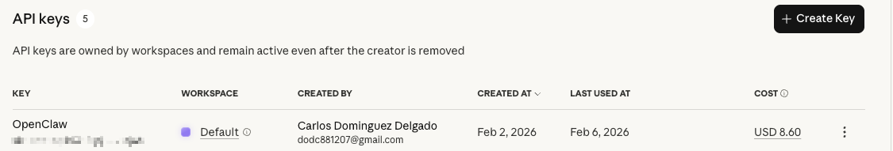
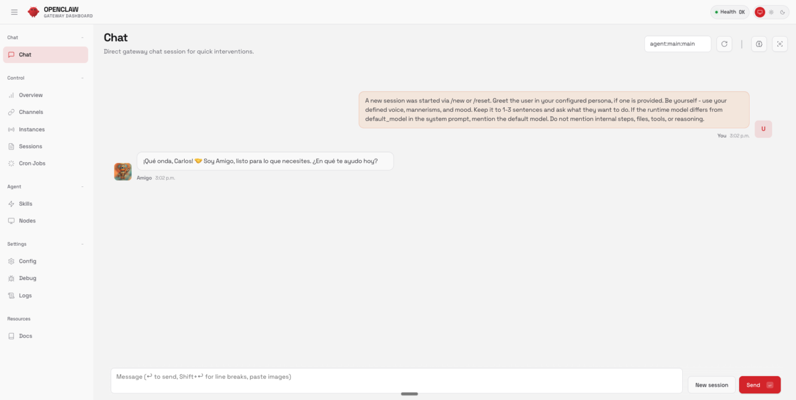

# [Curso] 💬 Configuración y uso en Telegram

> Ruta: 🦞 Reto Imperial OpenClaw › [Curso] 💬 Configuración y uso en Telegram

**🎬 Vídeo (26.5 min):** https://www.loom.com/share/7cd649403fc2458299c18aab073be308

---

## 🎯 Objetivo

Dejar OpenClaw **operativo**, **conectado a un modelo**, **con Telegram funcionando**, y **configurado como servicio persistente**, no como algo que muere cuando cierras la terminal.

## 🧭 Paso 1. Quick Start y navegación inicial

En el asistente inicial de OpenClaw:

- Navega usando **flechas**
- Confirma con **Enter**
- Selecciona **Quick Start**

## 🧠 Paso 2. Selección del modelo

OpenClaw soporta múltiples proveedores:

- Anthropic
- Gemini
- OpenRouter
- Minimax
- Moonshot (Kimi)
- OpenAI
- Otros

### Recomendación del curso

👉 **Anthropic + Opus 4.5**

Motivos:

- Calidad de razonamiento
- Estabilidad
- Ideal para agentes
- Control fino de costos vía API Key

### 📌 IMPORTANTE

❌ No uses sesión directa de tu plan personal  
✔️ Usa **API Key dedicada**

Evitas:

- Consumir tu plan personal
- Bucles que quemen tokens
- Accidentes caros

```
Seleccionar proveedor: Anthropic
Seleccionar modelo: Opus 4.5

```

## 🔑 Paso 3. Configurar Anthropic API Key

Selecciona:

- **API Key** (NO token de sesión)

```
ANTHROPIC_API_KEY=PEGAR_AQUI_TU_API_KEY

```

📌 Recomendación:

- Crea una key **solo para OpenClaw**
- Presupuesto bajo ($5–$10 para pruebas)



## 🗨️ Paso 4. Seleccionar canal de comunicación

Selecciona:

- **Telegram**

Motivos:

- Fácil
- Estable
- Ideal para bots
- Excelente UX en Mac / Windows

## 🤖 Paso 5. Crear bot en Telegram (BotFather)

En Telegram:

1. Busca `@BotFather`
2. Ejecuta `/newbot`
3. Asigna: - Nombre visible
- Username único (DEBE terminar en `bot`)

Ejemplo:

- Nombre: `OpenClaw`
- Username: `openclaw_amigo_bot`

```
TELEGRAM_BOT_TOKEN=PEGAR_AQUI_TOKEN_DE_BOTFATHER

```

---

## 🧩 Paso 6. Selección inicial de skills

📌 Regla clave:

> **No instales todo. Instala solo lo necesario.**

Los skills pueden:

- Ejecutar código
- Acceder a servicios externos
- Introducir riesgos si no los revisas

### Skills recomendados en esta etapa

Seleccionar:

- ✅ CloudHub CLI
- ✅ Gemini CLI
- ✅ OpenAI Whisper

No seleccionar todavía:

- Password managers
- Mail servers
- Twitter / X
- Bases de datos externas

## 🔑 Paso 7. Configurar Gemini API Key (opcional pero recomendado)

Si seleccionas Gemini:

```
GEMINI_API_KEY=PEGAR_AQUI_TU_API_KEY

```

📌 Recomendación:

- Proyecto dedicado en Google Cloud
- Billing activo
- Límites bajos al inicio

## 🎙️ Paso 8. Configurar OpenAI Whisper (audio en Telegram)

Permite:

- Enviar audios
- Transcripción automática
- Respuestas inteligentes

```
OPENAI_API_KEY=PEGAR_AQUI_API_KEY_WHISPER
```

## 🚦 Paso 9. Finalizar setup inicial

- Saltar hooks avanzados
- Omitir configuraciones complejas
- Continuar

Resultado:

- Dashboard inicial activo
- Puerto local asignado (ej. 1627)

## 🌐 Paso 10. Crear túnel (Gateway) para acceder al dashboard

OpenClaw corre en el VPS.  
Necesitamos un **túnel** para acceder desde nuestra máquina.

### ⬇️ PLACEHOLDER COMANDO GATEWAY

```
openclaw gateway --port 18789 --verbose

```

⚠️ Usa el nombre correcto del binario (`openclaw`, no cloudbot).

## 🔁 Paso 11. Conexión SSH adicional (túnel local)

En una **nueva pestaña de terminal**:

```
ssh openclaw@IP_DE_TU_VPS

```

📌 Password:

- **Usuario OpenClaw**
- NO root

## 💬 Paso 12. Primera prueba de chat (web)

- Abre el dashboard
- Envía un mensaje de prueba
- Verifica respuesta



## 📲 Paso 13. Conectar Telegram desde el chat

Desde el dashboard, dile al agente:

> “Quiero usar Telegram como canal principal”

Sigue instrucciones:

- Código de pairing
- Confirmación en Telegram

## 🎧 Paso 14. Prueba de audio (Whisper)

Envía:

- Un mensaje de voz por Telegram

Verifica:

- Transcripción correcta
- Respuesta coherente
- Auto-reparación si falla

## ⚙️ Paso 15. Configurar OpenClaw como servicio persistente

Esto evita que OpenClaw muera al cerrar la terminal.

```
sudo nano /etc/systemd/system/openclaw-gateway.service

```

```
[Unit]
Description=Openclaw Gateway (always-on)
After=network-online.target
Wants=network-online.target

[Service]
User=openclaw
WorkingDirectory=/home/openclaw
Environment=PATH=/home/openclaw/.npm-global/bin:/usr/local/sbin:/usr/local/bin:/usr/sbin:/usr/bin:/sbin:/bin
ExecStart=/home/openclaw/.npm-global/bin/openclaw gateway --bind loopback --port 18789 --verbose
Restart=always
RestartSec=5

[Install]
WantedBy=multi-user.target


```

```
sudo systemctl daemon-reload
sudo systemctl enable openclaw-gateway
sudo systemctl start openclaw-gateway
sudo systemctl status openclaw-gateway

```

## ✅ Resultado final de esta página

- Modelo configurado
- API Keys separadas
- Telegram operativo
- Audio funcionando
- Gateway activo
- Servicio persistente

## 🎙️ Transcripción

de si ven con las flechas yo puedo navegar, vamos a darle quick start y todo es con enter. Ahora nos pide que cuál va a ser el modelo que te queremos utilizar. Como les comentaba, esta minimax, esta munchot, que está el quimicados, con quimicodin que lo vimos costaba $20 al mes. Y tambien tenemos sobre un ciclo de utilizar Gemini, OpenRouter, si ustedes utilizan OpenRouter para sus automaciones en el hecho en lo pueden hacer. Cuenjlm4.7 que también estaba muy demodultimamente, casi muchos de aquí son modelos chinos, Copilot no sé quién lo utilice con Copilot, pero bueno, Percel y Aguedeway, OpenCodeSense, Xiaomi, Synthetic, Venny, hay muchos. Yo en la particular emigo gusta mucho Cloud, últimamente estoy diciendo mucho CloudCode y con el modelo Opus, pues voy a escoger Anthropic, lo doy Enter y aquí pide como quieres hacerlo con una piqui o con el toque básicamente esto lo que hace es que detecta la sesión que tengas de antrópica y va a utilizar lo que tienes con tu plan. Yo tengo el plan del plan max 100 dólares al mes que te da muchísimo más puta pero hasta donde yo me quedé en los términos y condiciones no te permite que utilices además tampoco quiero que si y llego a hacer algo mal o si llevo a exponer o si llegad esa otra vez en un bucle, me consuma todo lo que yo tengo en mi plan max de cloud porque lo utilizo para desarrollar en anti-gravity y otras cosas. Entonces yo en este caso lo voy a hacer con Appiky y los recomiendo que lo dan con Appiky me dan el 5, 10 dólares, 5 dólares en lo mínimo, 5 días para probar Y cualquier cosa, si se consumen todo y pueden ver lo que fallo, puede mejorar un poquito y ya no consumieron todo lo que tenían en su plan directamente. Vamos a darle un tropic apiky y le damos Center, nos va a pedir la llave. Así que vamos a nuestro panel de Cloud Developers, vamos a crear una llave, como les habéis comentado, creen llaves directamente para esto, todo así que es para Open Cloud. vamos a arlañadir y copiamos la llave, obviamente ustedes van a ver todo esto gloriado, nos regresamos para acá y le damos a pegar y le damos antes, ok, nos dice que si queremos trabajar con un cloud opus 4.5 vamos a darle que sí, aunque después vamos a configurar cuando va a utilizar cada uno y vamos a dar entre, perfecto. Luego nos pide que uscajamos dos canales de comunicación. Telegram tiene muchísimas facilidades, obviamente en la dynamic utilizamos mucho WhatsApp y es con un escanillar un QR, a veces es configura. Yo no particular utilizo mucho WhatsApp, pero en este caso vamos a enfocarnos con Telegram, que me parece que es de lo más fácil y si no utilizado, no sé si se ha por lo menos así en Windows, pero la app de Telegram de Mac es muy buena y de hecho las opciones para usar botfadde y otras cosas, le hicieron como un reward y se ve bastante bien, entonces vamos a darle Telegram, vamos a darle Enter y nos va a pedir nuestro bottoquen, si no han creado bots utilizando botfadde, aquí les dice tal cual que lo tiene que hacer, aquí si les dice el paso a paso, pero está lo vamos a ver entonces voy a abrir mi telegram en mi Mac listo, si lo da aquí en buscar, sale botfader que es lo último que he usé y en tal cual le voy a dar Power Slash, new bot me va a pedir como quiero que se llame, así que le voy a llamar OpenClaw ok entonces me pide un número ten, un nombre perdón tiene en cuenta que este o un nombre tiene que ser un nombre que no se puede repetir, entonces yo le voy a llamar como open, cló, le voy a decir amigo y tiene que terminar con bot, ahorita les digo por qué amigo porque yo le voy a llamar a mi open-cloth amigo, ustedes pueden llamarlo como ustedes quieren, lo van a ver más adelante cuando hablamos un poco del alma, entonces voy a campeonur mi API o mi botón que es más bien, me voy para acá y le doy pegar y le doy enter, ok, después de eso me pide que si quiero configurar algunas skills, entonces tengan en cuenta que los skills, ustedes pueden agregar más adelante, no tienen que agregar todo ahorita, vamos a darle Enter y nos va a decidir que Home Bristol Command, vamos a ver que sí, en nuestro modo que preferimos en este caso es NPM y aquí nos va a decir todo lo que podemos ensalar, como les decía, tenemos el OnePassword, es una amicada de contraseñas de los más famosos del mundo. Yo les recomiendo que lo utilicen, no que sigo tan quizá la ahorita, pero que lo utilicen y que creo una cuenta exclusivo para su bot, donde lo van a dar acceso donde va a tener acceso a eso para administrar las contraseñas, que si necesitan que entra algún calendario o que si necesitan que entra alguna plataforma, va a tener ahí las contraseñas de suceso, no exponen las contraseñas también a través del chat, pero tienen en cuenta que mi recomendación es que las contraseñas que tengan aquí sean para plataformas que únicamente sepan que voy a utilizar el bot. Por ahora no lo vamos a dar, lo podemos hacer más adelante. Apple Notes tampoco, no me interesa. Vertes para Twitter, X. De todo esto en la más, el vamos a darle a Cloudhop, que es Cloud Hub, básicamente es un, dice CLI que es con por comandos, que puedes descargar, instalar, actualizar skills que publican Cloud Hub que es como una comunidad. Lean lo por favor bien, investiguen porque volvamos a lo mismo. Gente está publicando skills con código maliciosa para que cuando la gente no instale, injecten código en sus servidores o en sus mayores. Entonces, lean muy bien, investiguen un poquito antes de que instale en skills de terceros porque no saben lo que opone esta instalando en su computadora. Como los seleccionamos, me estoy moviendo con las flechas y dándole con la barra espaciadora, ven que se pone en amarillo el checkbox que si lo tenemos seleccionado, esto es, no sé si uno no sé si han visto de 8 sleeps, es una cama que se conecta con agua, de hecho la CEO es mexicana, se conecta con agua y supone que te mejora el sueño y puedes tener tu app y baja la temperatura en la noche o sobre la temperatura, dependiendo que estapa del sueño este, etcétera. Bueno, tenemos el Gemini, que es el Gemini y el Celi, que es como el que fue el Clubellental Cloud Code, digamos, con Github, con los servicios de Google, vamos a darlo en que alguna vez es daerror, Google Play si no necesitamos, y Malaya es como para servidores y mapes y meterp para tus correos, hay message, no necesitamos, MC Porter, todos vamos a ver después, no va a anar a prosí, ¿por qué? Porque, de hecho, vamos a ver cómo le vamos a pedir a nuestro agente y antelegaron ya que lo tengamos, que crea un logotipo para el mismo, pdf lo hacemos más adelante, obsidian, si no saben, obsidian es como un poquito como el open source de notion, open a yeah whisper, open a yeah whisper que nos va a permitir, que nosotros le mandamos a audios de mensajes de audio a través de telegram, los pueda entender tal cual nos trajenta entonces vamos a darle que sí, OpenView básicamente PhilistView para poder controlar si tienen ustedes focos y luminación cualquier cosa, Oracle pues sabemos que es para bases de datos y creo que de aquí ya no ni estamos nada más por ahora entonces simplemente si hace hecho no los que quieren, le pueden dar Enter y les va a pedir a lo mejor algunas configuraciones, algunas apiquís, algunas cosas que no estén para esto, no me interesa otra place así que lo igual que no, bueno saben mismo no me interesa a places, si me interesa el Gemini Apeki para una nueva nena pro, así que vamos a darle enter y nos va a pedir nuestro Apeki como lo obtienen, vamos a vuelta al navegador, Google y a estudio, si ya vieron mi video de antigravity ya vieron como generar esto, así que vamos aquí a nuestro estudio, vamos a crear una nueva Apeki vamos a decirle que es para OpenClore y yo lo recomiendo que creen un proyecto especial y se los va a llevar a Google Cloud, van a tener que crear un billing, etcétera, en ese caso yo lo voy a dejar en Antigravity porque lo utilizo para cosas muy similares, esos son los proyectos yo creo desde mi console, entonces voy a dar clic aquí, y vamos a darle, copiar, vamos de vuelta aquí, pegamos entre, lo vente, muchas cosas lo hago, glúrriar, no quiero no quiero no una piqui ahorita OpenAI for Image Gen, no, con una nueva nana pro estoy bien. Bring aquí for Whisper, si, si quiero Whisper, así que vamos a nuestra la plataforma de OpenAI API y vamos a crear un API. Ya creamos nuestro PX, lo probamos, y Black Labs, no. Y hooks te permite hacer automaciones comandos, o antes lo podemos instalar también más adelante. Esto ahorita no lo vamos a configurar porque mi recomendación sería usar todos, pero bueno, es a lo mismo. Vamos a darle Skype for now, es un poquito más avanzado, lo veremos probablemente en otro video, así que vamos a darle Enter y nos dice que está inicializando que algunos servicios que no están disponibles, los va a saltar y ahorita nos va a mandar ya a nuestra dirección para puede entrar ahora así como a la parte del chat para que puedan ya chatear con su con su agente. Muy bien, ya que terminó nos va a salir aquí un DC Dashboard ready y nos va a dar una dirección para la cual podemos entrar. Si saben un poquito de esto van a ver que la dirección que le está dando es 1627 que básicamente es un local host por lo evidentemente no lo van a por correr, por qué no instalamos en OpenClop en nuestra computadora, está en un VPS, entonces que tenemos que hacer, tenemos que crear un túnel, una conexión entre el VPS y nuestra computadora para poder acceder y es lo que vamos a hacer ahorita, ok ya que estamos aquí vamos a correr este comando que se os voy a dejar aquí abajo, esto es para ver el Gateway y básicamente que es el Gateway es la forma en la que nos vamos a entonces van a pegar este comando que se los deja aquí abajo y le van a dar entre ok no está dando error dice que no ok aquí tengo un problema y si ustedes lo van a tener que cambiar al nombre que hayan puesto ustedes en este caso no es clad yo le puse Open Cloud. Le dan enter y igual dicen que sudo even Cloudbot Gateway, entonces tengo que cambiar ese también. Con tantos cambios de nombres que entre Cloudbot, Molbot, Open Cloud y en uno sabe, entonces me dice que Open Cloud command known found y lo que no está fallendo es el segundo comando, entonces le damos juego a mai, vemos que si somos entonces estamos en Open Cloud, entonces vamos a ejecutar de nuevo este otro comando que va a ser Open cló, gateway, guion, guion, port, 1, 8, 7, 8, 9, espacio, guion, guion, verbos, y vamos a esperar que se ejecute, perfecto, ya funcionó y ya que estamos aquí, está haciendo la conexión con el túnel y todo eso, vamos a esperar lo que termine. Ok, ya que es esto corriendo aquí, que vamos a hacer, dependiendo de repente el sistema que está utilizando, pues yo voy a abrir un nuevo tab y ya que estoy en este tab, vamos a pegar este comando que les voy a dejar aquí también abajo y te van a en cuenta que aquí donde dice cloud a roba, que en ese caso no sea la cloud, ser el nombre que le puse que es cloudbot, a roba y aquí la roba que es la ip de mi servidor, perdón, si quieres es Cloudbot, digo con esto, los cambios de nombre, OpenFlow, vamos los de nuevo a Hostinger, copiamos nuestra IP, regresamos a terminal, le pegamos y le damos entre, nos va a abrir la contraseña es la contraseña que pusimos para nuestro OpenClaw no es la contraseña route del BPS otra vez es la contraseña que pusieron la pegan igualmente no la van a poder ver así que de enlenter y vamos a esperar a que cargue ok entonces nos regresamos para acá vemos que si EventHealth vamos nos de vuelta a nuestro navegador por aquí de gesto vamos a darle refrescar y se ve ya carga y health dice ok por qué puedo entrar a esto que es un local host que es en el bps aunque esté en yo mi computadora porque configuramos el gateway el tunnel y ya podemos tener acceso entonces vamos a hacer la prueba vamos a mandarle el primer mensaje a nuestra gente le pones decir como que hola apenas iniciando, se lo mandamos y ahora tendo de responder hola acabo a exportar literalmente este workspace a esta vacío si me muerias y no me lo sintía todavía un oj en blanco así que quién eres tú y quién deberá ser yo obviamente como ya habido en el vídeo de venja quién eres tú quién eres yo todos se definen los margadons de Soul, User y aquí está básicamente todo, ¿no? Pues cae una batalla, un emoji, Bive, como quieres que se comunique contigo, ese es su identidad. El User es quién soy yo y tú puedes chatear y decirle mira, me gusta hacer esto, obé, investiga, entonces, entonces el alma más o menos el Soul, entonces ahorita no vamos a tocar eso, vamos a hacer la prueba de conexión con telegram, ¿sabes? muy bien entonces en la hora que nosotros vayamos, busquemos de comentación, configuramos, simplemente le voy a decir como que, ay, ayúdame a configurar telegram, telegram, prefiero hablarte por allá, vamos a entres. Y ahorita nos va a responder, un dice ok, lo que tienes que hacer es hablar, lo que hicimos, a hacer con el bot, unas que tengas el toque, me lo paso el configuros, se ve algo así, etcétera, después si confiarla más de un mensaje de poda telegram, cuando es la primera vez, tener un código de peirio, un peir en toque y en el listo. Entonces vamos a Telegram, aquí está Telegram, si le damos clic aquí, nos va a mandar a nuestro bot, le damos iniciar y nos justo aquí nos dan pelin token, creo que nos decía en este caso nuestro amigo, y le voy a decir, aquí está el código y le damos enter. Vamos a esperar a que corra esto y se listo, conectado, está aprobado, ahora pues escribimos por allá, vamos a ver si es cierto, hola, es más, vamos a ver una prueba, como ya le pusimos el whisper, vamos a ver si es cierto, Ok, perfecto, estoy probando, te tomando un mensaje desde Telegram, dime si lo recibes. Vamos para cá, bueno, vemos que he escribiendo y si nos vamos para cá, vemos que la venta la respuesta, así que puedo poner esto aquí junto con esto también, vamos a dejar, pero bueno, hice escribiendo y vamos a ver si puedo entender mi audio y digo en esto que a defonde podemos ver todo lo que está corriendo y lo que está pasando, etcétera y como le pusimos la piki de whisper en teoría el tener que poder escuchar mis audios y responderme. Entonces vamos a ver que lo que pasa normalmente no está tanto es mucho más, mucho más rápido pero no sé si porque le manda el audio en la primera vez está haciendo configuraciones por su parte, así que vamos a ver. Ok, como podemos ver, efectivamente, focus inus del audio, aquí dice que falló el opening y ahí. Y el solito lo arregló. Ojo, pueden ver, el solito lo arregló y dice perfecto, tu mensaje de bollego perfectamente, dijiste que perfecto tu probando, tomándome el mensaje de Telegram, dime si vos recibes, todo funciona, etcétera, vamos a sacar y aquí podemos ver el mensaje que los está responiendo desde telegram y como podemos ver el solito se reparó entendió que estaba algo mal, entendió que no había podido recibir el audio, se corrigió y ya está funcionando, entonces esto es una locura, ¿qué más? Ahora, aquí tenemos configurado esto antes de hacer otras pruebas, decirle que quién somos, confersua, alma, etcétera, vamos a abrir una nueva pestaña, seguimos aquí estoy un y computado local, obviamente me quiere conectar por el servidor, por SSH, aquí tenemos el SSH abierto, así que vamos a darle un enter y se queda aquí abierto con el y la si corte lo vamos a reiniciar le pueden dar control c control c me saca bueno ahí me seco completamente el servidor así que vamos a por le dar otra vez ssh si lo de para arriba se queda guardado entonces no pasa nada vamos a conectarnos directamente ssh en route a roba y vamos a ver la ip de nuestro servidor no me lo prendo, pegamos enter, nos va a pedir nuestro password, ese sí es el password, root de tu vps que sí que configuramos hostinger, lo pegamos y aquí estamos aquí adentro para este comando que vamos a dificultar si vamos a utilizar los algo root, y me está dando error en abrir la terminal, pero creo que se haya este tema de mi ghosty como tal, no tema de la Mac, así que voy a poner pausa y me cambia la terminal, ok, me cambia el terminar de la Mac y ya me funcionó, voy a darle control X para salir mi y que vean, voy a volver a copiar el comando, su donano, es, etcétera, sistema, md, system, open-clog y on gateway, open-clog va a ser nombre que van a tener que utilizar a la fecha 2 pero que no cambia nombre porque originalmente era, era clobot, pero ya como hemos hablado cambió open-clog los doy enter, me voy a abrir esto, saber un poco raro, pero eso es como un editor, na no es un estilo de editor terminal y aquí estamos aquí, vamos a tener que copiar esto que los va a dejar igual aquí abajo y vamos a tener que hacer algunos cambios aquí van a pegar esto con el teclado se mueven y aquí no sería cloud sería open cloud open cloud porque el nombre que yo le puse ok pero aquí abajo en lugar de cloud bot si sería OpenClaw porque es como se llama ahorita esto, si quieren por recomendación no utilicen OpenClaw porque puede ser un poco confuso, porque a veces OpenClaw si ya lo tenemos aquí, entonces vamos a cambiarlo, aquí arriba también, dijimos que no es Cloud, es OpenClaw y aquí arriba lo mismo, OpenClaw y déjame ver lo que haría el Windows, no tengo nada más, OpenClop, OpenClop, OpenClop y perfecto, entonces el tonque da guardar y salir, aquí abajo tiene todo esto, si está en el Mac, eso significa control, entonces vamos a buscar el comando para guardar y el comando para salir, normalmente es, si ya me salgo con 4X como tengo algún cambio me pediría guardar, así que vamos a darle ese cierto control X, me dice que si quiero guardar le doy igrega de yes y que se va a llamar así, que tuve service y muy bien, perfecto, sintoria, ese tuvo que haber guardado ese archivonano, vamos a correr este otro comando para poder habilitar, reiniciar y correr el servicio, después vamos a correr este otro comando, aquí sería Cloudbot, lo vamos a hacer lo mismo, y ya OpenClaw y vamos a correrlo tal cual con ese otro comando, que ese los dejo todos aquí abajo, y tenemos OpenClaw y le damos entre, muy bien, que sigue ya que corrimos esto, vamos a verificar que esté funcionando, ok, para para probar que se esté corriendo, vamos a correr este que es el status, recorden OpenClore le damos Enter y vemos que aquí dice Active, Activating Autoristar Resolve Exit Code Sints, Process Exit Home, OpenClore, Gateway, Bing, loopbox, or Exit Red User y me ven PID, es como que el número de proceso, ok, entonces ya que reiniciamos, vamos a darle el status una vez más tardó un poquito pero ya está, dice Actif y dice que está corriendo. Ahora, como configuramos que efectivamente esté corriendo, vámonos tal cual acá no es tropan el de aquí y vemos que hice Health Online Disconnect for no reason, pero si nos vamos a nuestro telegram, le vamos a decir hola, estás online, le vamos a enter y vemos que sí que está escribiendo, vamos a esperar un segundo, y si sea que estoy, entonces que decir que nuestro túnel está conectado y estamos de manera correcta, el listo vemos que está funcionando hecho para comprobar, vamos a salirnos de aquí, vamos a cerrar toda la terminal, quiero terminar si cerramos, si, si, y vamos a carna más con esto, lo va a seguir, ok, gracias, y y lo que sigue diciendo escribiendo y de nada, entonces con esto terminamos el vídeo después veremos cuestiones de recomendaciones y todo, a lo mejor pongo una segunda parte les quedo de ver los dos bonus lo voy a poner abajo como vídeo extra y díganme que les pareció los voy en el siguiente vídeo
