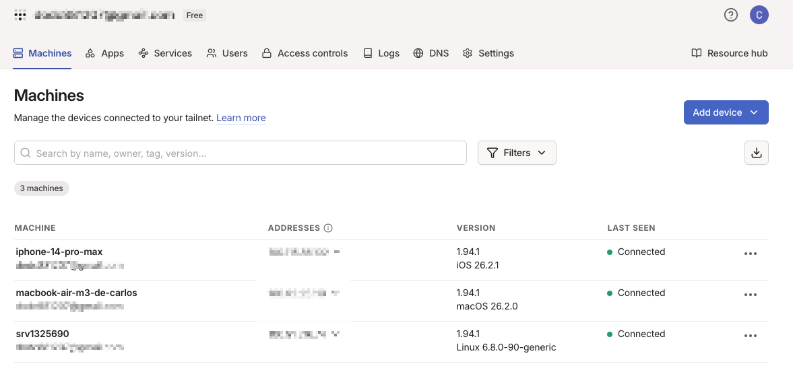

# [Curso] Seguridad y Túnel Privado - Tailscale

> Ruta: Vibe-Coding › [Curso] Seguridad y Túnel Privado - Tailscale

**🎬 Vídeo (23.9 min):** https://www.loom.com/share/7f64fa4debe444898693eb3dc886bd8b

---

## 🎯 Objetivo

Cerrar **completamente** el acceso público a OpenClaw y permitir acceso **solo desde tus dispositivos**, usando:

- Tailscale (VPN privada)
- Firewall del servidor
- Validaciones reales de funcionamiento

Si no haces esto, tu OpenClaw **queda expuesto a Internet**.

## 🚨 El problema real (por qué esto es obligatorio)

Si OpenClaw queda accesible por IP pública:

- Bots escanean puertos automáticamente
- Servicios como Shodan indexan tu servidor
- Ataques de fuerza bruta
- Robo de API Keys
- Acceso a memoria del agente
- Ejecución de comandos en tu VPS

Esto **pasa todo el tiempo**, no es teoría.

## ✅ La solución

**Tailscale**:

- VPN privada
- Red cerrada solo a tus dispositivos
- Hasta **100 dispositivos gratis**
- Sin exponer puertos públicos
- Compatible con VPS, laptop, celular

## 📚 Recurso base

Te dejo el enlace (placeholder) a la guía completa usada como referencia:

👉 **ENLACE GITHUB GIST – Guía de seguridad OpenClaw / CloudBot / MoltBot**

```
https://gist.github.com/benjacord/848a8bcc62d0483e41063609e947ec36
```

## 🧭 Paso 1. Estado actual (inseguro)

Hasta ahora:

- Accedemos vía `127.0.0.1` o túnel manual
- El panel **puede quedar expuesto**
- No hay aislamiento real

Vamos a corregir esto.

## 🔐 Paso 2. Instalar Tailscale en el VPS

### Instalación (manual y segura)

Ejecutar **como root** en el VPS:

```
curl -fsSL https://tailscale.com/install.sh | sh

```

## 🔑 Paso 3. Autenticar Tailscale en el servidor

Después de instalar:

```
sudo tailscale up

```

Esto te dará:

- Un link de autenticación
- Login con Google, GitHub u otro proveedor

## 🧠 Paso 4. Iniciar sesión en Tailscale

En el navegador:

- Inicia sesión con tu cuenta
- Autoriza el dispositivo (VPS)

Resultado esperado:

- VPS conectado a la red privada Tailscale



## 💻 Paso 5. Instalar Tailscale en tu computadora

Instala Tailscale en:

- Mac / Windows
- Celular (opcional pero recomendado)

Proceso:

- Descargar app
- Iniciar sesión con la **misma cuenta**
- Autorizar el dispositivo

## 🔎 Paso 6. Verificar conexión privada

En el VPS:

```
tailscale status

```

Debes ver:

- VPS
- Tu computadora
- Otros dispositivos autorizados

## 🌐 Paso 7. Acceder al panel de OpenClaw vía IP privada

Tailscale asigna una IP privada, por ejemplo:

```
100.x.x.x

```

Accede a OpenClaw usando:

```
http://IP_TAILSCALE:PUERTO

```

⚠️ Importante:

- OpenClaw escucha en loopback por defecto
- **No todas las IPs funcionarán**
- Esto es normal y más seguro

## 🧯 Paso 8. Configurar Firewall (UFW)

Ahora vamos a **cerrar todo** excepto:

- SSH (por seguridad)
- Red Tailscale

### Ver estado del firewall

```
sudo ufw status

```

### Configuración recomendada

```
sudo ufw default deny incoming
sudo ufw default allow outgoing

```

### Permitir SSH (emergencia)

```
sudo ufw allow ssh

```

### Permitir tráfico desde Tailscale

```
sudo ufw allow in on tailscale0

```

### Activar firewall

```
sudo ufw enable

```

## ✅ Paso 9. Validaciones obligatorias

### 1. Probar acceso público (DEBE FALLAR)

- Intenta acceder por IP pública
- Resultado esperado: ❌ NO CARGA

### 2. Probar Telegram

Desde Telegram:

```
Hola, ¿sigues online?

```

Resultado esperado:

- ✅ Responde correctamente

### 3. Probar panel web vía Tailscale

- Accede desde IP privada
- Chat funcional

## 🧠 Qué logramos con esto

- OpenClaw **no es visible en Internet**
- No aparece en Shodan
- No responde a escaneos
- Solo tus dispositivos acceden
- Telegram sigue funcionando
- Panel web sigue funcionando

## ⚠️ Notas importantes

- El firewall puede bloquearte si configuras mal
- Mantén siempre acceso SSH
- No instales skills sin revisar código
- No guardes API Keys sensibles sin rotación

## ✅ Resultado final

- VPN privada activa
- Firewall configurado
- Panel protegido
- OpenClaw operativo
- Seguridad de nivel profesional

## 🎙️ Transcripción

Muy bien, listo. Ya que tenemos nuestro OpenClaw, funcionando, configurado, vamos a trabajar en la parte de seguridad. Les voy a dejar igual aquí abajo en el enlace, ehm, a este archivo de GitHubGist, donde se explica ya es una guía, como proteger tu Cloudbot, Moltbot, ahora OpenClaw en tu PPS. vamos a utilizar un servidor usado Telskale, que es un estilo VPN para poder acceder y crear un túnel entre esa conexión. Sertabamos acá, estoy en una sesión nueva, lo llamé en este caso de amigo, a mi OpenClub, y vamos ahora como protegerlo, porque si fijan estoy trabajando desde las 127 y tuve que en mi terminal de Mac, correr, conectándome a través de un tuner. Ahora vamos a hacerlo ya de manera bien con Tillscale, que me pueda conectarlo. Entonces, si seguimos la guía, acá nos dice cuál se problema, que estás con tu IP pública, en ese caso yo estoy trabajando a través del tuner, pero para efectos es exactamente lo mismo. y obviamente existen servicios como shodansensis y otras que escanean a todas las IPs internet y como el puerto por defecto es ese pues entonces lo atacan y vamos están escaneando y están buscando que quien dejo abierto, quien no puso su seguridad y vamos a atacar y vamos a obtener por fuerza bruta a piquís contra las señes de tus correos, información de usuario, etcétera, ¿no? Entonces comoéis aquí que pueden hacer, si lo conectas a telegaran pues pueden acceder a todos los mensajes de telegracer por lo que te has de aguazar lo mismo y así sucesivamente. De acceso a tus archivos, memoria de agente, pueden ejecutar comandos en tu servidor por eso, nos tus cuando lo instalamos no lo instalamos es de route, lo instalamos con su propio usuario. Como habíamos dicho, pueden robar a Piquiz, cadencial y guardadas, instalar esquirmaliciosas, etcétera. Entonces, cuál es la solución? Tayskill, que creo una red privada virtual, una VPN y básicamente cómo funciona, instala en tu web.es y en tu computadora y me aparece que te he el skill, te das si aquí está hasta sin dispositivos, lo puede estar en tu celular, en tu tableta, en una computadora portátil que tengas, etcétera, tiene sin dispositivos de manera gratuita. Entonces cuáles son los beneficios, en misibles canes, respervada más toque, sólo tus dispositivos y sigue funcionando igual. Puedo seguir la misma guía, dice que podemos copiar las instrucciones a la gente y decirle que el lo configure o la opción manual vamos por lo fácil así que me voy a ir a mi panel de acá voy a pegar este mensaje y lo voy a dar entre, vamos a ver qué nos dice mi amigo y vamos a elementos de instrucción y son isto que asegúrese ese sirvió con tel skill para que el control panel no quede expuesto internet, pasos, vamos arriba, instala tel skill y aquí le damos el comando, ejecuta su tsklop, da mi link para autenticar, espera que yo instale tskl en mi computadora y me conecte, cuando te confirme si erró el puerto que es que estamos ocupando, permite no ser la acceso desde la red tskl, manté en el puerto de ssh 22, por si acaso no si eres el puerto aquí yo confirme que puedo acceder a la ptskl, perfecto acá los vamos a asegurar el servidor con tskl, empecé con instalación, ejecuto el comando, dice error, el portal, exit, error, instalar y tenskey, foro un tu nuevo, luce en metod, absudo, me canazó un escape, criminal, justo recordo, read the password, either use the option to read. OK, entonces el extravaron está sudo y me pide contraseña. Tengo las opciones. Tú lo ejercú te detecta a tu terminal o me das permiso levado. OK, como no lo instalamos en root, lo instalamos en nuestro propio usuario, por eso me está diciendo esto, do sir. OK, no te preocupes, déjalo intento yo manual, si me trago te digo, así es leo, gracias amigo, ok, entonces vamos a manual, voy a voy a ir a mi terminal, aquí estoy en route en mi servidor y voy a pegar y ejecutar esto. Vamos para que termine de cargar. Ok, entonces vamos a darles sudo, Ok, nos estamos dando este link. Dice que abrirlo ya te con Google, GitHub, etcétera. Bricica que quedo conectado. TisgeleStats. Yo voy a abrir aquí en mi navegador. Perfecto y yo lo en este caso lo voy a hacer con Google. Que es lo más sencillo para mí. Dari, continue. En este caso es con Tils, que no hay problema, no es como que estemos conectando directamente OpenClore y si estamos a punto conectarnos, vamos a darle Connect y dice que he listo. Ok, dice que deberías de ver algo como desde tu servidor Trimail Linux. Vamos a ir a configurar esto, vamos a ver si nos dice algo acá. Ok, vamos a terminar con esta configuración. Cuál es nuestro uso principal, vamos a decirle que es entrar en un environment, cuál es el rol, esto, which pinprice y con el using, y de aquí en nosotros utilizamos esto, son doble pp, y en realidad esto no sirve, como volamos a lo mismo es por las cuestiones de marketing. Ok, dice que añade mi segundo dispositivo, en este caso yo estoy en MAC, así que me voy para acá, una nueva y yo voy a ver esto, me manda la app store de MAC y voy a tener que hacer este mismo proceso en mi celular y en cualquier otro dispositivo que yo que quiera utilizar mi y conexionado pinclo, ok, y voy a tener que poner pausa en segundo de esta regresa porque toma que acceder a mi celular y es con el que estoy grabando. Listo, entonces tengo que ser un corte porque no me ha dejado usar mi celular en el mismo no tiempo configurar esto, se vamos de por cuestión de seguridad, pero bueno, ya tenemos Tails que he instalado, vamos a abrirlo, aquí en la computadora, la hemos tabulador para abrirlo, y vamos a David get started, vamos a dar el que sí, nos va a pedir permisos para que se comunique o creer el puente directamente en las configuraciones, el túnel, en las nuestras configuraciones, está iniciando y ahorita las va a pedir que lo guiemos con la cuenta que acabamos de crear, si ya lo necesitamos, no lo van a poder ver, para el mismo tiempo va a hacer el mismo proceso en mi celular para poder tener la conexión en los dos, quiero notificaciones si, lo doy a dar a instalar, lo voy a dar a permitir y vamos a dar la inicia sesión de celular, me voy a ir a una cuenta y vamos a iniciar sesión con mi correo de Inchimio, va a dar conectar, que en el celular estoy conectado, lo voy para atrás, lo doy Don, y a mi dice el servidor, el iPhone, y en la computadora a uno, sigue cargando todavía, se que está inicializando, esto un poquito de momento, así que lo puedo pausar y regreso de vuelta que inicio dice. OK, ya que es instalado nuestra app para la máquina, en este caso, la usarataccount, nos va a mandar aquí, nos va a pedir que loguimos, en este caso tenemos que iniciar suición con nuestro Gmail. Obviamente, la misma cuenta que utilizaron para carar la conexión. Vamos a darle conexión, conectar y seguir en Macbook de Rm3 está conectada satisfactoriamente. Así que vamos a cerrar esto, vamos a cerrar esto, y vemos que están aquí, mi celular, mi Mac y el servidor, ok perfecto, entonces ya que tenemos todo, dice que podemos verificar, así que si me voy aquí a mi terminal, la agrega una lo no lo instale por consola, pero vamos a chicarlo en aquí, tail, scale, status, ok, me voy a las tres computadoras y ahí se derroten las pruebas de pin y funcionó y el siguiente sería hacer la prueba y conectarme directamente a el servidor. Entonces vamos para acá, dice de tu mente, su ti os quiero decir ok, ya está funcionando, esta es la IP del server, ahora como lo real, y donde le digo esto es la IP del server, voy a decirle que es esta Es para acá, espaciotá y que hermosir. Y estar en tu Mac, veréis cómo ya lo tengo, y él lo tengo prueba abrindo esto, ok, Ok, ok, ok, ok, no es cargo, entonces lo voy a decir, no carga en panel de open flow, pero pero si puedo ver mis tres equipos vamos a ver cópedo, si se esté en el servidor Sí. Ah, ese problema. El panel es escuchando solo si no se no se. No es la interfaz de TelSq. Estamos caballando la conversión para que escuche en todas las interfaces. No solo en TelSq. Déjame ver la configuración. Ok. Lo bueno que él te va guiéndo. Dice que entre 18 y 19, con mi token, pero no te moltóquen. Está corriendo todos, está a tus openerpados en lo que termina de correos. Ok, muy bien. Vamos a hacer, entonces la parte de cerrar ya que podemos entrar. entonces me creo el túnel estoy haciendo las configuraciones y ya pueden entrar directamente aquí con esto que es lo que tengo acá, que es esta dirección, realmente vamos a probar esta directamente con el chat un asesión, no sé que siguió pongo esto, no va a abrir realmente nada, pero si yo copio, como dice aquí, con mi sesión del chat session aquí, vamos a probar a ver si me entra, y me dice que no, si vamos a ver cuál la diferencia pone esto, Entonces, con esta IP no me funcionó, me funcionó con esta de aquí, que es la que viendo acá, pero ya pueden atrás, entonces déjame decirme, me agente hasta el cual. Esta dirección sí me funcionó para entrar, pero esta otra no, y se me copiaré esto. ¿Por qué se oda? Vamos a ver qué nos dice. Una pregunta, ¿Le Vrensach y PSH? Pero la qué funciona? Usach y PSH con los juegos nudesque, el Maiden y PSH que me ha certificado. La que no funciona es HP con la primera catación, no puede ser certificados, pero el momento en que lo está confundado por VHS TTP, o en la verdad, lo que está funcionando es solucionar el pedazo. OK, será cierto, entonces si conoces aquí HHS TTP es 2.0. No, es que lo haré por favor. si, rir, y sala, esta confirmabila al confite gateway vain loop back el juego y solo escucha esta, no otras interfaces sin grande loop e etsc de SQL mode serve, del SQL ser factor como reverse proxy, recibe las conexiones https en el fastin mallet ns, porque le pino funcione, intenta conectar al un poco. Ah, esta. Me dice tampoco funcionaria porque vain dupa, ignores, interfaz, conclusiones. Escoberte antes, pero hay de hecho es más seguro. Ok. todo claro ahora como cerramos los otros puertos para asegurarnos de que nadie pueda entrar si no está en la red del scale, ve que la documentación dice lo siguiente, vamos a dar la documentación que tenemos aquí, vamos a decirle esta parte que dice yo qué, vamos a cerrar el puerto, vamos a pegarle todo esto, Bueno, es exactamente lo que case, primero déjame ver esta actual de Firewall, ok. Y si no tengo acceso a sudos sin contraseña, ok. En este caso es a propósito, yo no le idea acceso al sudo, como lo platicamos hace rato. Yo quiero ejecutar todo manualmente para esa parte, porque una no lista en un route, porque nunca leí la contraseña de sudos. Entonces, por eso, ya va a depender de cómo lo quieran construir directamente a ustedes. Ok, nos dice no tomo acceso a sus encontraseñas, como habíamos dicho. Antes, después yo lo puedo ejecutar todo, manualmente. Y, antes de asegurar de tirar la forma de acceso, que el paso 13 de chelo se hizo tu correctamente. ¿Qué se explique que hace cada regla o tabientas? Entonces, sí, explí, came, sale, aquí te va, sólo vamos a les actuar, el carlas existe en el firewall, luego, vamos para que cargue, para que se muestre todo, listo, esto, o vamos a hacerla por acá y lo vamos haciendo a mismo tiempo, los parece, este de aquí, así que vamos a hacer primero, pero está aquí, si no viven tenos 10 estatus inactive, no cambia nada, entonces esto le pegamos y fue el comienzo de la en el vishuto de rosa corredí, ok, después polídica perfecto para ráfico saliente, permitir, tú sigo, puede correntarse cualquier cosa, vamos pegar, y dice que es actualista correctamente, después la damos lo del SSH22 que es como un van dor por si a lo falla, listo, después nos va a pedir esto, lo transmite todo traffico de la red details que él, y sin embargo, ok, y con esto cerramos el puerto público, con una delit no existe un rule, con una delit no existe un rule, entonces vamos a pasar pesto ok, yo voy a así para, me lo quede en el paso 6, mirar lo que me he salido, y se lo pegamos perfecto está bien, eso significa que nunca existió una regla para el puerto, y ya estaba cerrado continuo con el paso 7, vamos a hacerle caso, faigual es activar enable y dijimos que paso 8 los reglas activos, así ok ya hice toda, ahora como pruebo de que todo ok y que ya Vamos a verificar, primero vamos a ver cómo quedan tus reglas, así y abres Estas son tus navegador Tiene muy abre, me dice a Sheldt OK, muy bien Pruebas que verán de fallar No me parece si no me carga Y punto IP Pública Y me dice que provee el puerto este de circles, y el 22, ope, pero a lo tanto, los datos y esto le pasamos listas acá no exactamente como deben vamos a cerrar todas las conexiones que tengo aquí y también vamos a decirle acabo de configurar Quiero probar que todo le enviamos y escribiendo. Y me conté aquí primero, pero ahí se llegó tu mensaje a porterlo. Y así que el bot sigue funcionando a probar con el web chat que la acabo de hacer para confirmar que a Firewall Listo, hicimos todo esto, funcionó todo y a le puedo responder aquí y sí. funcionó todo gracias me ayudaste a terminar el video a la comunidad. Bueno pues es todo ya tenemos tail skill ya hicimos las pruebas nos dieron algunos errores pero todos nos ayudó a configurarlo y perfecto nos vemos a la próxima
