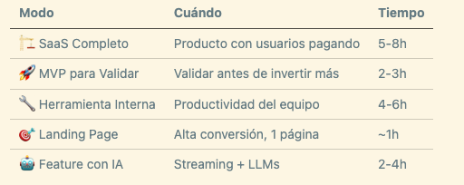
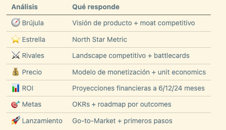
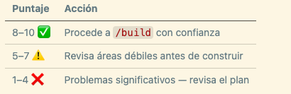
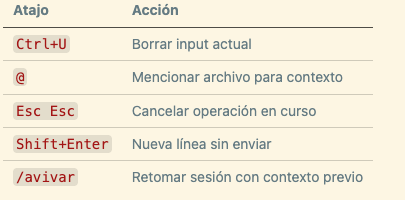

# 🔨 Bienvenida - Qué es Forge

> Ruta: Vibe-Coding › 🔨 Bienvenida - Qué es Forge

---

> ℹ️ Disclaimer: Forge es un proyecto 100% de Carlos Dominguez (YO) — mi idea, mi desarrollo, mi emprendimiento. No es un producto de Imperio Digital ni está afiliado a la comunidad. Benja me dio autorización de subir este folder al Classroom y ofrecer un precio especial a los miembros como cortesía, pero la empresa detrás de Forge es independiente (getforja.com/imperio). Si tienes dudas técnicas o de compra, son conmigo directo.

## **📚 Qué vas a aprender**

- Qué es Forge y por qué no es "otro wrapper de Claude Code"
- Setup completo en menos de 5 minutos
- `/plan` — La Herrería: 10 skills → Blueprint ejecutable
- `/crisol` — validación estratégica con 7 análisis + Puntaje de Confianza
- `/build` — Modo Yunque (manual) y Modo Forja (agentes en paralelo)

## **🛠️ El Problema que Forge Resuelve**

Vibe coding con Claude Code a secas tiene un patrón:

1. Le pides una app → empieza a construir sin plan.
2. A los 30 minutos el código creció sin arquitectura.
3. A la hora: errores de tipos, tablas sin RLS, secrets expuestos.
4. Al día siguiente: quieres agregar algo y **todo se rompe**.

Claude Code es brillante, pero sin disciplina. Forge le da la disciplina.

## **🛠️ Setup en 3 comandos**

```bash
# 1. Clonar Forge (una sola vez)
git clone https://github.com/getforja/forge.git ~/forge

# 2. Crear alias en tu shell
echo 'alias forge="cp -r ~/forge/.claude . && cp -r ~/forge/src . && cp ~/forge/CLAUDE.md . && cp ~/forge/package.json . && cp ~/forge/example.mcp.json ."' >> ~/.zshrc && source ~/.zshrc

# 3. En cualquier proyecto nuevo
mkdir mi-app && cd mi-app
forge && npm install
claude && /forge-check
```

## **🛠️ **`/plan` — La Herrería

```
/plan

```

La Herrería abre con un **MODE SELECTOR** — 5 build modes según lo que construyes:



Antes de cualquier skill corre el **Viability Check** — 7 preguntas que detectan si la idea vale el tiempo. Si reprobas, Forge te dice que no construyas todavía.

Los 10 skills generan 10 documentos:

```
BMC-[nombre].md          ← Modelo de negocio
PDR-[nombre].md          ← Product Definition
TECH-SPEC-[nombre].md    ← Stack y arquitectura
UX-RESEARCH-[nombre].md  ← Hallazgos de usuarios
USER-STORIES-[nombre].md ← Stories priorizadas
UX-DESIGN-[nombre].md    ← Flujos y experiencia
UI-WF-[nombre].md        ← Wireframes
DESIGN.md + UI real      ← Design system implementado
SECURITY-AUDIT-[nombre].md ← Auditoría OWASP
BLUEPRINT-[nombre].md    ← El contrato final

```

> **Regla de oro:** nunca passes a `/build` sin Blueprint aprobado. El código sin Blueprint es deuda técnica desde el día 1.

## **🛠️ **`/crisol` — Validación Estratégica (opcional)

```
/crisol

```

Lee tu Blueprint y corre 7 análisis en una sola sesión:



Output: un **Puntaje de Confianza** del 1 al 10 y un dashboard HTML interactivo (Bento Grid + Chart.js) que puedes compartir con inversores o clientes.



## **🛠️ **`/build` — Yunque y Forja

```
/build
```

Lee el Blueprint, genera `.claude/PRPs/PIEZA-[nombre].md` y te pregunta:

```
¿Cómo quieres ejecutar?
🔧 Build Manual (El Yunque)   — fase por fase, tú apruebas cada paso
🔨 Modo Forja                 — N agentes autónomos en sandboxes paralelos
```

**El Yunque** — 5 pasos por fase: Delimitar → Mapear → Ejecutar → Blindar → Transicionar. Cada subtarea genera un atomic commit:

```bash
feat(F1-T1): create auth service
feat(F1-T2): add login form
```

Si algo falla: `git revert` de exactamente esa pieza.

**La Forja** — eliges cuántos agentes (1-5). Cada uno trabaja en su Git worktree con personalidad distinta (Literal, Pragmático, Creativo, Disruptivo, Obsesivo de calidad). Al final cherry-pickeas lo mejor de cada sandbox.

## **📎 Recursos**

### **📋 Quick start completo**

```bash
# Setup
git clone https://github.com/getforja/forge.git ~/forge
echo 'alias forge="..."' >> ~/.zshrc && source ~/.zshrc

# Nuevo proyecto
mkdir mi-app && cd mi-app && forge
npm install && claude
/onboarding          # Ruta personalizada para empezar

# Flujo core
/plan                # 10 skills → Blueprint
/crisol              # Opcional: validación estratégica
/build               # Elige Yunque o Forja

```

### **⌨️ Atajos Claude Code imprescindibles**



## **🎁 Descuento para miembros**

Forge Pro cuesta $149 USD (pago único). Benja autorizó 50% off para la comunidad:

👉 [https://lafragua.dev/imperio](https://lafragua.dev/imperio)** — $75 USD**

*Link noindex — exclusivo para miembros. Te agradezco no compartirlo fuera.*
