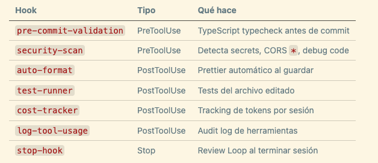
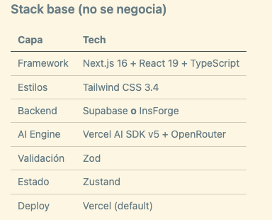
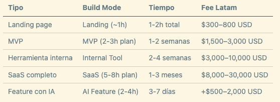

# ⚡ Forge — El Arsenal Completo

> Ruta: Vibe-Coding › ⚡ Forge — El Arsenal Completo

---

## **📚 Qué vas a aprender**

- Los **4 principios Karpathy** que disciplinan a Claude durante el build
- Los **7 hooks fail-open** que protegen cada commit
- Las **4 reglas de seguridad** que no se negocian nunca
- Los dashboards `/roi`, `/kanban` y `/metas` para clientes
- Las 4 opciones de deploy y cuándo usar cada una
- Los **5 casos de uso** con benchmarks de fees de Latam

## **🛡️ Seguridad — No es opcional**

### **Los 4 principios Karpathy**

Forge instala el skill `karpathy-principles` que hace que Claude siga estas reglas durante cada build:

1. **Piensa antes de codear** — surfea supuestos, presenta tradeoffs, pide clarificaciones antes de escribir una línea.
2. **Simplicidad primero** — código mínimo para el problema de HOY. Sin abstracciones prematuras.
3. **Cambios quirúrgicos** — toca solo lo necesario. Sin refactoring drive-by.
4. **Ejecución orientada a objetivos** — define criterios de éxito antes. Sabe cuándo terminaste.

### **Los 7 hooks fail-open**

```bash
# Activar todos
claude config set hookMode auto
```

"Fail-open" = si el hook se rompe inesperadamente, aprueba la acción. Nunca bloquea al usuario por un bug del hook.



El hook crítico es `security-scan` — detecta antes del commit: AWS keys, JWT tokens, passwords en texto claro, `dangerouslySetInnerHTML`, CORS `*` en producción.

### **Las 4 reglas que nunca se rompen**

**1. RLS obligatorio desde el día 1**

```sql
alter table contacts enable row level security;
create policy "owner only"
  on contacts for all
  using (auth.uid() = user_id);
```

Sin RLS, la anon key de Supabase expone todos los datos al público.

**2. NEXT_PUBLIC_ solo para datos públicos**

```env
NEXT_PUBLIC_SUPABASE_ANON_KEY=eyJ...   ✅
NEXT_PUBLIC_STRIPE_SECRET_KEY=sk_...   ❌ nunca
```

**3. Secrets fuera del chat de IA**

- ❌ "Mi Stripe key es sk_live_abc123…"
- ✅ "Usa la variable de entorno `STRIPE_SECRET_KEY`"

**4. Ghost packages — verifica antes de instalar** Todo package sugerido por IA debe tener **+1,000 descargas semanales en npmjs.com** y mantenimiento activo. Los LLMs alucinan nombres que no existen — atacantes los publican con malware.

## **📊 Dashboards para Clientes**

Los tres comandos que justifican tu fee mensual:

### `/roi` — Reporte financiero

```
/roi
```

Output: `roi-dashboard.html` con MRR proyectado, CAC, LTV, LTV:CAC ratio, payback period y runway. Gráficas Chart.js interactivas. Lo mandas en el reporte mensual y el cliente entiende el valor de lo que construiste.

### `/kanban` — Progreso visual

```
/kanban
```

Output: `kanban.html` con todas las User Stories del Blueprint en 4 columnas (Backlog · In Progress · Review · Done). Se regenera cada vez que actualizas el Blueprint.

### `/metas` — OKRs con tracking

```
/metas
```

Output: `metas-dashboard.html` con progress bars por Key Result, timeline de milestones y distinción Outcomes vs Outputs.

### **Los otros 2 comandos BI**

```bash
/graduate    # MVP actual → plan para graduarlo a SaaS production-ready
/lanzamiento # Go-to-Market completo + estrategia de primer cliente
```

## **🚀 Deploy — 4 Opciones**

### **Stack base (no se negocia)**



**Supabase vs InsForge** en una línea: Supabase si trabajas con humanos + agentes. InsForge si el proyecto es agent-first y quieres 30% menos tokens en el MCP.

### **Opción A — Vercel (default, cero config)**

```bash
git push origin main   # Vercel despliega automático
```

$0 en Hobby. $20/mes en Pro. Ideal para primeros proyectos y MVPs.

### **Opción B — Self-hosted con **`docker-deploy`

```
/docker-deploy
```

Genera `Dockerfile` multi-stage optimizado + `docker-compose.yml` + `DEPLOY.md` específico para la plataforma que elijas:

- **Dokploy** — open source, deploy a VPS en 5 minutos
- **Easypanel** — UI visual, ideal para no técnicos
- **Coolify** — open source, lo que uso yo. 1 VPS hostea múltiples apps.

**Costo self-hosted:** $7–15/mes total en VPS vs $20+/mes en Vercel Pro.

### `/despachar` — Ship automático

```
/despachar
```

Corre en orden: typecheck → lint → build → review loop → commit → push → PR. Úsalo al final de cada sesión. Es el cinturón antes de subir código.

## **🎯 Qué Puedes Construir (y Cobrar)**



> 💡 El primer video que generas con `/plan` ya es un entregable de $500. El Blueprint vale lo que cobras por el proyecto entero — úsalo como argumento de cierre.

**Pitch para clientes no técnicos:**

> *"El primer día te entrego un documento de 50 páginas con modelo de negocio, diseño, arquitectura y auditoría de seguridad. Si te gusta, seguimos. Si no, cancelas sin perder más."*

Baja el riesgo percibido. Conversión típica: 60%+.

## **📋 Cheat Sheet — Los Comandos que Más Vas a Usar**

```bash
# Orientación
/onboarding       # Primera vez con Forge
/forge-check      # Diagnóstico del entorno
/avivar           # Retomar sesión

# Core flow
/plan             # 10 skills → Blueprint
/crisol           # Validación estratégica (opcional)
/build            # Yunque o Forja

# Add-ons durante /build
/add-login        # Supabase Auth completo
/add-payments     # Stripe o Polar
/add-emails       # Resend + React Email
/add-insforge     # Backend agents-first
/landing          # Landing de alta conversión standalone

# Calidad de diseño
/critique         # UX/UI en 10 dimensiones
/polish           # Final pass visual
/web-audit        # 150+ checks Lighthouse

# Para clientes
/roi              # Dashboard financiero HTML
/kanban           # Tablero por User Story HTML
/metas            # OKRs con tracking

# Ship
/despachar        # Typecheck + lint + commit + PR automático

# Mantenimiento
/update-forge     # Actualizar Forge
/eject-forge      # Remover Forge (dejar solo tu código)

```

## **📎 Recursos**

### **🔗 Links**

- Guía completa v3.0: [getforja.com/guide](https://getforja.com/guide)
- Soporte: [forge@getforja.com](mailto:forge@getforja.com)

### **📋 Checklist de seguridad por commit**

```
- [ ] RLS activado en todas las tablas nuevas
- [ ] Las tablas tienen policies select/insert/update
- [ ] Secrets en .env.local (no en código, no en .env)
- [ ] NEXT_PUBLIC_ solo con datos públicos
- [ ] Packages verificados en npmjs.com (>1k downloads/semana)
- [ ] Hook security-scan activado
```

### **📐 Convenciones Git**

```bash
feat:      # Nueva feature
fix:       # Bug fix
chore:     # Mantenimiento
docs:      # Solo docs
refactor:  # Sin cambio de comportamiento

# Atomic commits durante /build
feat(F1-T1): create auth service
feat(F1-T2): add login form
```

## **🎁 Descuento para miembros**

Forge Pro cuesta $149 USD (pago único). Benja autorizó 50% off para la comunidad:

👉 [https://lafragua.dev/imperio](https://lafragua.dev/imperio)** — $75 USD**

*Link noindex — exclusivo para miembros. Por favor no lo compartas fuera.*
