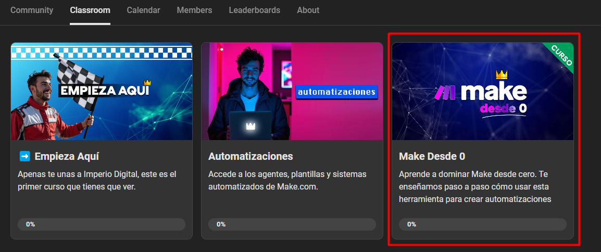

# Webhooks y HTTPs

> Ruta: 🔴 Grabaciones › Webhooks y HTTPs

**🎬 Vídeo (60.9 min):** https://youtu.be/pxoqRQd4V8Y

---

En esta sesión de automatiza con Fran exploramos cómo llevar nuestras automatizaciones al siguiente nivel:

- **Introducción a Webhooks y HTTP Post en Make**: Aprendimos qué son, cómo funcionan y su utilidad para conectar aplicaciones y transferir datos de forma eficiente. Fran también nos mostró cómo configurarlos, incluyendo detalles clave como el uso de llaves y valores.
- **Implementación práctica**: Desde crear un webhook en Make hasta enviar información mediante HTTP Post desde plataformas como Hotmart. Ejemplos reales como mover datos desde un chatbot a un CRM y devolver información al chatbot marcaron la diferencia.
- **Documentación API**: Fran explicó las diferencias clave entre webhooks y APIs, cómo leer documentación técnica y hasta nos llevó por un ejemplo práctico con una API de inteligencia artificial.
- **Casos reales y resolución de dudas**: Compartimos experiencias sobre automatizaciones en plataformas como Go High Level y Make, mientras se resolvieron preguntas avanzadas sobre integración con Vapi y otros sistemas.

Una sesión intensa, técnica (pero no imposible!) y 100% práctica para quienes quieren dominar automatizaciones avanzadas. 🚀

Recomendación: Vean los módulos de [HTTP](https://www.skool.com/imperio-digital/classroom/798d337a?md=d95aeda000aa4c42a0c611a5a9a37928) y [Webhooks](https://www.skool.com/imperio-digital/classroom/798d337a?md=fbaa496b7f27437da7c446863395f16e) del curso [Make Desde 0](https://www.skool.com/imperio-digital/classroom/798d337a?md=32341ea834ff484b8d39d69f96199f2c) para mayor detalle de cada una de estas funciones. 

## 🎙️ Transcripción

buenísimo bueno Bienvenidos a todos los de de esta sesión que están acá hoy es 14 15 de noviembre estamos creo que en la tercera o cuarta sesión lo que vamos a tomar ahora es webhooks y https son interacciones en URL que una vez que uno puede aprender a usarlas terminas ya viendo un mundo nuevo porque no estás limitado a lo que te pide make o sapier o la aplicación que usen para usar sino que ya aprendiendo a leer y Aprendiendo a a conocer un poco la documentación Api podemos empezar a interactuar y entender Cómo interactúan entre aplicaciones es algo que es de los temas que muchas veces termina siendo un poco más complejo o de los primeros temas que no son fáciles de entender en un principio pero si se explica de cierta manera creo que es bastante más más simple de poder entenderlo Así que nada voy a arrancar compartiendo pantalla díganme bueno necesito cuando puedas Max que me me habilites a ver Ahí vamos bien anes se ve la pantalla bien excelente perfecto bien primero vamos a ver un poco Qué es un webhook ahora voy a explicar un poco este diagrama que va a ayudar justamente eso acá tenemos un que es una URL si vieron alguno de los videos van a comprender un un poco cómo funciona o hay varios puntos donde se habla de un webhook y es un rl un espacio que puede recibir información como recibe esa información y la recibimos en m podemos empezar a interactuar con esa información podemos empezar a usarla en nuestros escenarios esto por ejemplo que Qué significa Yo tengo un webhook armado y otra aplicación me manda una señal que yo cuando recibo puede ser el nombre el apellido el valor de una compra la confirmación de que una fue realizada lo que sea puedo empezar a tener diferentes escenarios o puedo empezar a tener diferentes acciones y módulos en make donde puedo usar esa información El ejemplo más fácil es con hotmart que hotmart puede mandar por ejemplo vamos a ponerlo acá htt post de hotmart hotmart puede mandar información directamente a un webhop que nosotros tengamos armado y nosotros con este webhook una vez que recibimos información podemos por decir algo mandar un mail al cliente Entonces esto ahora lo vamos a ver bien en make Pero antes de verlo en make quiero que se se vea un poco acá nosotros un webhook es tiene la figura o tiene se ve como un URL es una dirección directamente es una dirección http por eso acá todo lo que interactuamos es todo con http no importa bien meternos específicamente en Qué es http y todo esto pero sí saber que make nos da a nosotros un URL a disposición para que le mandemos Data Cómo se hace esto acá vamos a ir ahí borramos un un webhook ustedes tienen que que tener muy en cuenta que es si o s el primer módulo de un escenario Entonces nosotros creamos un webm de esta manera ponemos en agregar voy a poner prueba imperio digital y más allá de esto guardar y acá ven esto Esta dirección que aparece acá nosotros la podemos escribir esto es un webhook es un espacio que le podemos mandar información ahora qué información le mandamos que es lo importante entender esto Nosotros con un post o de varias maneras que vamos a ver también en profundidad le podemos mandar información al web el webhook va a servir de esta manera vamos a poner se le pone el webhook y luego al final de La dirección se le agrega las var no lo que le vamos a mandar lo mismo si tienen ya un poco de experiencia van a saber bien que es una variable y una llave pero vamos a explicarlo un poco acá por las dudas Nosotros le tenemos que mandar información al webhook y el webhook tiene que saber qué es lo que le vamos a mandar o tiene que tener una manera de interpretarlo yo no puedo mandarle al webhook simplemente escribiéndole y diciéndole no sé todo un prompt sin que tenga sentido o un texto enorme sin que el webhook sepa que es entonces por eso se maneja de esta estructura llave valor es una estructura muy clásica donde básicamente en la práctica o sea esto es algo más etéreo pero en la práctica se ve de esta manera nombre que es la llave lo que le enviamos y el nombre específicamente la variable Entonces tenemos apellido Richi teléfono mi número de teléfono email Tac Entonces nosotros con diferentes iteraciones y volviendo a hacer una y otra vez o manejando muchos clientes siempre el webhook sabe y nosotros lo estructuramos para que le envíe estos valores ahora el valor Franco puede cambiar y le puede mandar Max y le puede mandar Diego pero la llave nombre siempre queda fija porque lo tenemos que estructurar de esa manera para poder justamente usarlo y que después en el en otra parte del escenario de make nosotros podamos mandarle podamos mandar darle información y que sepa qué hacer hasta ahora quiero saber por favor que me digan cómo cómo venimos bien perfecto hasta acá alguna duda de esto que hablamos bien bueno sig acá compartiendo WhatsApp vamos acá bien Entonces qué es lo que tenemos hasta ahora un webhook es un URL que se ve de esta manera en make y las llaves las llaves son el nombre del valor que le vamos a dar y la variable o el valor es específicamente el valor de lo que le damos ahora cómo enviamos algo a un webhook depende siempre de la plataforma que usemos yo uso mucho o estoy trabajando mucho con Bots y con chatbots con agentes de Inteligencia artificial y demás y es clave por usar esto porque yo puedo iniciar una automatización cuando pasa algo en el Bot por ejemplo una vez que algo que tengo armado es que una vez que pasan un link de compra a a un chat a un cliente un posible cliente Envía una señal a un webbook qué es lo que Envía un http post Esto es lo que envía entonces va a haber muchas herramientas que pueden hacer este esta acción esta función y que pueden enviarle la info al webhook vamos a poner algo en práctica desde make mismo los nosotros lo podemos hacer vamos a voy a duplicar esto y voy a hacer vamos a hacer dos cosas vamos a hacer el escenario donde envía información y el escenario donde recibe la información que enviamos Entonces vamos acá vamos a crear un nuevo escenario y lo único que vamos a poner acá va a ser http esto es como lo vamos a enviar y enviar un request tenemos que poner Si queremos esto también es super importante que se entienda nosotros para usar webhooks podemos usar todo esto pero los más importantes entender son el post y el get que son métodos vamos a ver hoy el post no me quiero meter mucho en el get que es otra cosa pero nada Lo importante es casi siempre se usa post vamos a post y acá empezamos a tener que configurarlo no Primero lo primero a dónde lo vamos a enviar y acá seleccionamos directamente el webbook es la URL directamente ahora cuál es la manera más fácil de hacer esto en make es ir a query Stream tenemos que ir hay dos cosas que hacemos yo hago siempre por prevención hay veces que me lo requiere y veces que no pero es ir a headers y le creamos un header Qué es un header es una especificación es muy técnico realmente no vale tanto la pena entenderlo en este momento Eh sí que Generalmente tienen que poner dos headers dos encabezados por decir así uno lo le estamos de especificando el contenido que tiene que tener que esto si quieren guárdelo casi siempre es lo mismo le explicamos el tipo de contenido es Java es jas y lo otro que a veces te lo pide y a veces no es una autorización Eso depende de cada aplicación y eso lo vamos a ver ahora en un ratito sí pero lo importante de la info que le mandamos va acá abajo Lo que se llama la query String o el body type también se puede meter acá tranquilamente pero bueno vamos a verlo en este momento vamos a verlo en la query String y lo que hacemos acá es justamente ponerle nombre y valor vamos a poner nombre y en el valor le ponemos Franco le ponemos apellido y en el valor lo ponemos por ejemplo Entonces qué es lo que va a hacer esto Una vez que está configurado le va a mandar a este URL a este web que tenemos armado le va a mandar la información de que hay que llega la información separada de nombre Franco apellido Richi y vamos a ver cómo llega al web directamente primero lo tenemos que configurar acá ahí se configuró el we siempre el primer que es uno tieneuna duda no escuché bien okay tranqui Bueno vemos acá y ahora vamos a poner para correr para ver cómo funciona y vamos a hacer el mismo llamado y acá debería recibir Esto es lo que ven ahí entonces acá directamente para iniciar una variable para iniciar un escenario ya tenemos una manera de que le env el nombre de Franco y el apellido de Rich ahora vamos de nuevo Qué pasa siora agarro y le pongo de nombre Jai Perdón acá el nombre tiene que quedar ahí el nombre queda fijo de nombre Javi y apellido Sánchez vamos a mandar ok esto tiene que quedar recibiendo vamos a correr y llega la misma llave llega el mismo tipo de variable que es nombre y cambia el valor Javi Sanchez bien ahora por qué no sirve esto porque yo en un escenario puedo empezar es lo más común también de esto vinculado con agentes y con chat Inteligencia artificial Es que yo puedo empezar a interactuar en el chatbot y e ir actualizando un crm ir actualizando algún software externo vamos a hacer por ejemplo algo muy simple no pero vamos a Google sheets agregar una fila voy a seleccionar algo que tenga acá armado acá bien Perfecto entonces qué pasa una vez que recibimos algo al webhook como les dije lo que podemos hacer es directamente agregar no importa tanto que es que hay acá pero agregar nombre y apellido agregarle esas variables agregar eso que llega al webhook a otras cosas Entonces vamos a verlo desde acá vamos a ir imperio digital o imperio digital Ahora yo termino con esto y quiero conversar con ustedes a ver que me que me dicen Pero bueno vamos a ver esto queda corriendo que esto se tiene que quedar permanentemente y vamos a hacer un llamado nuevamente y le ponemos ahora Max corderos esto yo ahora lo estoy escribiendo manualmente Pero esto se puede poner al final de un escenario que esto es lo más importante me olvidaba justamente decirlo no que esto se puede poner y generalmente se pone al final de un escenario o en alguna parte para enviar info a un webhook que esto se hace con variables yo no le pongo Max sino que elijo el nombre que tenga de algún lugar anterior en el escenario y lo mando acá Entonces esto lo pongo en variable no es que lo tengo que modificar constantemente ahora porque estamos probando nada más Pero bueno vamos a ver acá y yo lo que voy a hacer es mandarlo mandé la información perfecto acá Recibió la información el webhook recibió Max y recibió Cordero y la puso acá vamos a ver y acá efectivamente está Max Cordero entonces en síntesis para hac medio un punto y aparte lo que nos permite Aprender a usar estos Aprender a usar el http y Aprender a usar los web hooks es poder mandar la información entre diferentes aplicaciones no solamente de un escenario de make a otro eso en un principio pero yo generalmente se la mando de hotmart se la mando de go High Level se la mando de aplicaciones de de chatbots de un montón de sistemas y un montón de aplicaciones te dan la opción de hacer un http post o bien también te dan la opción de poner un webhook para recibir la información en un principio entienden Cómo funciona esto acá y después empiezan a configurarlo ya con otras aplicaciones sí quiero que me cuenten su opinión quiero que me digan si creen que es super complejo o no A ver una pregunta corta Entonces siempre los web van a estar en un dashboard vamos a tener el webh donde va a serc el post y en otro el http donde vamos a estar al final Te escuché un poquito de nuevo ahí sí o no ahí va perfecto buenísimo lo que te estaba diciendo era Entonces vamos a tener siempre dos dashboard vamos a tener un dashboard donde el H de post va a estar en uno como iniciando la automatización para hacer los siguientes pasos en este caso el Google sheets y después otro dashboard siempre con el http que va a ser el que nos va a estar entregando los los value para el el Hook de del otro dashboard se entiende la pregunta son siempre dos dashboard uno de http y uno de web bien siempre va a depender entonces vos lo que preguntas es que si siempre tenemos que armar dos escenarios en en make no bien No necesariamente porque yo lo puedo mandar de otro lugar yo lo puedo mandar desde afuera de m Esto no es algo que es solamente para make Esto es algo que funciona a nivel Universal de un montón de aplicaciones entonces vos tenemos dos tenemos el post y el webhook el post envía el webhook recibe el post lo puedo hacer de hotmart y que lo reciba en webhook and make y empiece a interactuar con esa información y también lo podemos hacer al revés puedo hacer el post desde mail y que lo reciba hotmart o que lo reciba eh Pasa mucho con las aplic iones de cursos o con Sí con los programas de Educación que cuando me llega un pago yo lo proceso con make y lo mando a hotmart para que le de acceso al curso entonces hotmart actúa como receptor Ah hotman recibe Entonces siempre están esas dos posibilidades nosotros usamos m porque es superfácil pero en make podes hacer las dos en make puedes hacer una sola No necesariamente tiene que ser solo con tenés que hacer las dos en m respondí tu pregunta perfecto alguien más con alguna duda algún comentario comentario tenía era ese mismo que que hizo Diego este que se había que tener el el módulo separado bien bien bien bien bien también pasa mucho que se inicia un Ahora les voy a mostrar un caso práctico pero que se inicia un módulo un escenario con un webhook al final de ese escenario yo termino con un http entonces me activa un segundo escenario que ya ya empieza con otras cosas justo la semana pasada no miento a principio de esta semana hice un escenario que tiene muchas cosas de estas Así que ahora cuando terminemos con las preguntas les voy a mostrar para ver algo super práctico Vicente estás con el micrófono prendido entonces detecta A ver quiero saber como ubicarme detecta que hay una actividad en determinado lugar y a partir de detectar eso manda Ah lo vincula es así lo que lo que estamos hablando eso básicamente ahí sí sí sí sí sí o sea es vos lo tenés que enviar intencionalmente no es que por ejemplo que siempre que un escenario entero va a estar vinculado a un webhook a un un post sino que nosotros intencionalmente le tenemos que decir envía nombre apellido mail acá y una vez que hace eso se inicia otro escenario el webhook recibe y acciona pero es eso o sea es una URL que recibe información y vos se la puedes mandar claro entonces lo que vos diseñas es eso que todo lo que pase en esa URL como va a ser de una sola función o sea como que no tenés tantas no es así O sea Cuanto más sea una en realidad tiene que ser una función No puede haber dos cosas que pasen en esa URL o no sería así Claro porque si ahí no va a poder siempre hay grises siempre hay grises o sea yo puedo recibir un webhook eh puedo mandar mandar información a un webhook y que el webhook según la información que reciba actúe para un lado o actúe para otro como un filtro ahí pon Exacto pongo un filtro después el router y después le pones filtro y quedas con eso que decís claro o sea ahí ya le le das la gama Por decirlo así de de reacciones Así es exa es así es así bueno la cazaste bien el qué que la cazaste bien digo o sea está excelente mientras que te escuchaba Yo decía me Encanto me Encanto así empezas a usar yo tengo todo o sea lo el de solamente escuchar y decir No sé Bueno o sea esta tecnología es lo que te permite actualizar en tiempo real el estado de las conversaciones por ejemplo no Entonces yo tengo vinculado a un agente de ia que lo vamos a estrenar en un lanzamiento esta tarde en un par de horas Ahí está vinculado Go High Level por un lado y table para armar los dashboards entonces a medida que va pasando gente por la conversación van subiendo los números van moviendo de un lado a otro y es como que tenés registro de actividad real directo de qué pasa con cada cosa tro Sí me encantan gracias no buenísimo Fran Aquí también para el tema de aprender más subimos creo que yaer hoy día tenemos un módulo en el curso make desde cero con wefood personalizado y avanzado aquí tamb un videito quean explicándolo en detalle aquí lo pueden le pueden ir poniendo pausa y también Fran Creo que este les va a servir cierto el de http donde están los métodos post get así estos dos videítos si quieren más información revíselo y bueno el curso completo ya está Pronto pronto estar listo Así que muchas gracias Fran por eso y el que vaya necesitando se meten al curso me desde cero y pueden ir paso a paso también por cada una de las funciones y ahí Fran explica muy bien Cómo se conecta una cosa con la otra y Qué son y para qué sirven así que Muchas gracias es super importante o sea yo hace un par de días terminamos grabando ese módulo pero dije esto es super importante que se entienda bien y y dije por ahí bueno por ahí con con con un módulo No se ve bien en práctica o quedan dudas y demás y Esto para mí es de las dos o tres cosas más importantes que entender de que entender de make con el funcionamiento de We porque después se aprende la de una aplicación y podes hacer una cosa u otra Así que nada No sé si alguno tiene otra duda respecto a esto algún comentario bien puedo preguntar algo más sobre esto es parecido a como lo que pasa conis o sea me refiero se puede llegar decir que es como que estás haciendo una sea una Api es tuya pero así O sea estoy en esa estamos ahí o es como que lai tiene algo más que que la pone Por decirlo así como por encima de bien las apis que creo cre en uno de los cursos en uno de los módulos se habla tienen end points Entonces eso es a lo voy a eso esimportante y enci se muchísimo con esto así que voy a tomar un ratito para contarlo quiero que me confirmen que se ve la pantalla a ver se ve bien perfecto acá que tiene una una Api no es un protocolo muy similar porque es una URL eh la Api pero la y que recibe variables Entonces esto a nivel estructural y a nivel más más técnico se ve así no se ve como una URL que después tiene un signo de pregunta sería nombre y luego acá Franco y apellido igual ig Esto no es super necesario que se entienda para poder hacerlo funcionar yo Yo lo entendí mucho luego mucho despés hacerlo funcionar pero la diferencia de esto que esto es un web puro y duro no que recibe variable recibe información nosotros con una con una Api lo que tiene acá es que antes de las variables hay un endp un endpoint es la acción esto puede ser por ejemplo Entonces qué pasa con esto esto ya lo que hace es decirle a la aplicación qué es lo que queremos hacer No en el web mandamos la información le decimos te envío nombre apellido email teléfono en cambio en en una Api Generalmente antes de las variables le decimos qué parte de la Api queremos usar entonces acá puede ser por ejemplo no activar Y esto es para dar de alta a alguien en un curso y también puede ser podemos mandarle lo mismo pero con otra acción con otro endp Entonces esto como ya está configurado en en make Perdón en las apis ya está hecha la acción que queremos hacer en cambio en make Si queremos gestionar lo mismo por ejemplo pero con un curso que hacemos nosotros manualmente y lo que sea tenemos que que jugar con esta secuencia y empezar a poner filtros y empezar a poner diferentes acciones y demás lo mismo diferentes webhooks lo que sea lo que tienen las apis es eso es que ya tenés la acción determinada en cada Vamos a entrar acá un segundo vamos a ir a Más allá de la aplicación Esta es una aplicación que sirve para poder para ver Perdón para crear agentes de voz de Inteligencia artificial que te llaman no entonces Acá está muy claro como se ve que es que tenemos la URL acá esto que dice http Api se romí estamos apii punto a esto es el URL que sería como el webhook lo que tienen específicamente las apis es que al final está el endpoint este Entonces cuando se hace el post nosotros podemos llamar a una Api con la misma del mismo método que es haciendo un http post ven que acá está post post y demás Cuando hacemos eso tiene que ser un llamado muy similar pero tenemos que saber qué es lo que queremos que la Api haga porque yo acá puede ser para crear una llamada No acá para obtener y acá ven que va cambiando y acá para ver un asistente específico Entonces ven que esta parte queda permanente pero luego el endp queda va cambiando dependiendo de la acción que queremos usar esto ya es un nivel más complejo entender esto pero también lo mismo si entienden Cómo leer una documentación Api van a poder hacer cualquier cosa porque ustedes ven en make Por ejemplo yo voy a ir acá voy a ir a Go High Level Esta es una aplicación y acá ven todas las las acciones que que se pueden hacer o que se hacen directamente sin tener que hacer la parte compleja sin tener que que entrar a un http o sin tener que que entrar muy profundo una Api Acá está esto que son es lo mismo que vimos recién llama a la misma Api lo único que esto Acá está armado Esto sí ya es un poquito más complejo de entender pero qué pasa acá Nosotros también tenemos la opción de ir abajo de todo y te dice hacer una llamada a la Api entonces acá ya nos ya nos da todo prearmado de qué es lo que tenemos que hacer y qué es lo que tenemos que poner pero es muy parecido a esto Entonces está muy relacionado a la web fux y la Api llevaría mucho tiempo por ahí arrancar a a ver todo todo todo todo todo de cómo funciona las apis y Y hasta qué punto sirven o hasta qué punto podemos manipularlas y demás eso lleva mucho trabajo y es ver la documentación de cada aplicación para poder entender cómo funciona pero está muy relacionado Entonces ahora por ahí están haciendo muchas las primeras automatizaciones que usan algunos webhooks de esta manera que explicamos hace un rato pero después cuando quieran ir más allá de los límites que les pone m por vayan a tener que aprender un poco de documentación apli y de cómo funciona creo que fue igual mucho acá pero cuéntenme que si si fui claro con esto si se entendió Okay buenísimo no tengan vergüenza igual Edu buenas qué tal Mira yo llegado un poquillo tarda la explicación vale Pero tengo algunas dudas con la Api en el sentido de tú no puedes hacer nada en la plataforma que la Api no te permita la Api de la propia plataforma Exacto nada no la plataforma no te permita vale es de porque por ejemplo si yo quisiera información de los contactos de un perfil de de Instagram no de Los Seguidores los que tengan teléfono el el correo público yo no puedo recopilar de ninguna manera Eso depende de la Api de Instagram que te permita hacer y que no te permita hacer creo que eso no te lo permite hacer yo no no he jugado mucho con lpi de Instagram pero sí que pasa muchísimo Es muy normal que uno dice Che me gustaría poder agarrar esta información o tomar esta acción hacer esto hacer aquello con x app y vas a la documentación y no está esa acción que queres entonces ahí dir no se puede hacer vale entonces siempre está digamos encadenado a lo que el creador de la plataforma quiera que haga o no hagas exactamente un ejemplo fácil creo que muchos de acá conocen apliación de creación de citas agendas y calend es buenísima pero no te permite crear un evento o agendar con por Api Entonces qué pasa por ejemplo si yo que fue un problema que tuve hace unas semanas que yo quería hacer un chatbot de Inteligencia artificial que agende directamente desde con la Api de cenly que agende viendo y usando toda la información de para agendar a una persona que estaba hablando con el chat ahora voy a la documentación apid de cal y había un cartel así grande que decía no podes crear eventos por Api esto Qué significa que para crear un evento Yo tengo que entrar a la aplicación y hacerlo manualmente Esa es la diferencia o sea por Api es externo a la app entonces por ahí hay acciones que yo dentro de la app lo pueda hacer como como esto que decía Edu de ir y por ahí si alguien tiene el mail público yo puedo manualmente ir uno por uno y obtenerlo pero se ponen esas barreras para que la gente no lo haga en masa se dice programáticamente para que la gente no agarre y empiece a obtener muchísimos emails en 2s segundos lo mismo pasa con cenly yo no puedo crear un montón de eventos o mismo no puedo crear ni un evento de manera programática O sea no puedo crear un evento eh ponele si yo que yo lo que quería hacer era vincular un chatbot preguntarte el horario que querías y agendarlo por calend no lo podía hacer entonces tuve que ir Google calendar y hacer un escenario de 250 módulos literalmente para poder hacerlo entonces tuve que básicamente crear un calend aparte que cumplía todas esas funciones pero yo le di una función más que tenía Google calendar directamente Google calendar si te deja c vale Es que yo vi el otro día un vídeo de una plataforma que te permite hacer eso pero claro digo qué raro es decir la plataforma que yo digo después si quieres paso por el grupo el vídeo lo que hacía era conseguir los emails de de Instagram para tú después o o poder mandar correos que si eres de Europa no es lo suyo pero sí que lo puedes utilizar como un compañero en para hacer publicidad Entonces si tú coges a los seguidores de tu competencia consigues sus emails y lo metes Para publicidad Claro está genial y vi un programa que lo hacía Pero entonces claro digo te deja o no te deja porque entonces que ha hecho ese programa para poder entrar ahí sin que esté permitido siempre hay de atrás vale la puerta de atrás en la mayoría de los casos es simular la acción de un humano por ejemplo Un ejemplo muy claro que a mí hace un año un año y pico me abrió mucho la cabeza fue un compañero un amigo que él trabaja para el papá y el papá tiene una empresa y él era el encargado de hacer las facturas en afip en el lo que es el el el IRS de Estados Unidos la la el ente recaudador de impuestos de de Argentina Entonces él vio que era una tarea extremadamente repetitiva y lo que hizo fue un programa que simulaba la acción del mouse Entonces él una vez que lo ponía ese programa arrancaba a facturar o sea se ve en la computadora como el programa mueve el mouse cliquea acá clique allá entonces tiene que tener una computadora prendida un servidor o lo que sea haciendo exactamente de eso Entonces en teoría no es programáticamente O sea no se hace por Api porque no estás accediendo externamente O te estás entrando a la aplicación lo único que la acción que harías vos la hace un Bot la hace un programa Eso depende a quién le preguntes Es legal o no Es legal depende a quién le preguntes es ético o no es ético eso es un gris Depende qué es lo que quieras hacer mi amigo realmente lo que quería era ahorrarse trabajo entonces no no no está haciendo nada grave nada malo solo que por ahí no estaba la tecnología para hacer eso no no si hay algún perjudicado de última es él o el padre por facturar de manera errónea pero no es que haga algo mal ahora qué pasa si a esta aplicación que comentas lo descubren lo agarra en instagram dudo mucho que a meta le guste la idea ya entonces eh Nada ahí sí podría haber un problema con la aplicación no con el usuario Pero bueno eso es un poco la imagen que te podría dar Okay gracias placer alguna otra pregunta comentario mi pregunta Franco es este yo uso High Level este yo puedo hacer casi todo de High Level automatizaciones y calendario y y este redes sociales y toda esa cuestión cuál sería el uso factible de make en Go High Level bien Go High Level permite un montón de cosas realmente permite muchísimo eh yo aprendí primero make y después Go High Level a mí me es más cómodo make porque puedes hacer un montón de cosas porque con make puedes conectar cualquier cosa creo que vos podés tranquilamente hacer esta estas dos acciones que es webhook y http post en en Go High Level creo que se pueden hacer sin embargo yo a mí me es mucho más cómodo make también de que Go High Level es una es un crm inicialmente o sea es un es un olinguan realmente son muchísimas cosas las que se pueden hacer make está preparado para automatizaciones está preparado para debugar información está preparado para ver la información manipular la información y está preparado específicamente para automatizar entonces las cualidades que tiene make van mucho más allá que lo que va Go High Level sin que signifique que Go High Level no pueda cumplir el trabajo o sea depende mucho qué es lo que quieres hacer pero se podría este implementar make en Go High Level y trabajar de la Sí yo lo hago siempre yo lo hago siem lo que haces con Go con make es mandar por ejemplo yo creo los contactos en Go High Level los creo con los creo desde m para High Level Y a partir de Ahí voy manipulando toda la información desde make pero adentro de vamos a hacer también un un ejemplo un poquito corto de esto quiero que de nuevo se ve bien sí bien yoora Estoy trabajando con un cliente que tiene un lanzamiento y lo que lo que pasa Yo tengo un Bot no un chatbot un agente de Inteligencia artificial que a partir de ciertos puntos o en ciertas situaciones manda una señal manda un http post a make no Entonces ustedes ven que acá lo primero que hace es recibir contacto una vez que entra el contacto a la conversación con mi chatbot mi chatbot manda una señal acá esta señal contiene información del l voy a voy a mostrar es una a ver acá una un ejemplo que pasó no entonces llegó solamente con el número que es todo lo que tenía con el número Yo lo que hice en Go High Level fue agarrar ese número y buscar si ya había un contacto con ese número de teléfono qué me dijo Go High Level me dijo que no se encontró un contacto como no se encontró un contacto yo desde m creé el contacto qué le puse Solamente le puse un nombre sin definir y el número de teléfono a partir de ahí lo otro que hice fue bueno Esto es una función incremental para darle un número no importa tanto pero sí que acá lo metí en una pipeline una pipeline para los que no conozcan es la parte de un crm donde se ve En qué estado está el cliente si está si acaba de entrar en contacto Si pidió un link de compra si ya compró si está muy interesado y demás entonces meto este contao que Acabo de crear en este momento a una pipeline a partir de ahí también lo bajo a otro sistema que es arable que a mí me sirve para armar un dashboard para armar un una visual bien grande de En qué situación está todo el contingente de clientes o de leads o de prospectos si entraron 20 personas a la conversación si cinco personas pidieron el link si dos compraron todo eso me lo muestra esta otra aplicación Entonces yo conecto ahí y después lo que hago para poder trackear y poder seguir con los otros escenarios es devolverle al software donde yo uso el chatbot le devuelvo la información que se creó le devuelvo el ID de contacto le devuelvo el ID de la oportunidad y el ID del registro en síntesis de manera muy sintetizada con este escenario cada vez que entra alguien a conversar con mi chatbot manda la información acá acá creo el contacto en creo el contacto en un crm y empiezo a man a manipular que este es go High Level y después al final le devuelvo la información que se creó al chatp entonces después a medida que va avanzando Yo acá Tengo otras cosas Yo acá qué tengo tengo un sistema que en cuando le pide el link al chatbot el chatbot manda otra señal después con make muevo el contacto de un estado a otro actualizo y listo y lo mismo pasa en esta situación en esta situación y demás Entonces esto a mí lo que me permite como uso mucho webhook me permite mantener una visión en tiempo real de que está pasando conectando los webhooks y https a Go High Level mediante make sí Esto es lo que te permite make Al fin y al cabo que puede ser que te lo permita High Level pero en la realidad a m me es mucho más cómodo manejar con make mencionaste que estabas haciendo un proyecto para un cliente lo estás haciendo con con High Level y y y make y cuál es la función exactamente al final lo que hace esto O sea yo lo que estoy sobre lo que estoy trabajando con este cliente específicamente es un chatbot de Inteligencia artificial un agente de ía que atiende a los clientes que están queriendo comprar y les les aclara dudas les pasa links de compra les pasa eh Nada cuentas para transferencia y demás y todo esto a medida que va pasando Lo va registrando en Go High Level entonces en Go High Level vas a poder tranquilamente poder ver en qué estado está cada cliente ver dónde se quedan más clientes por ejemplo en otro proyecto aparte que ya está activo y ya está lanzado yo le pongo estas estos stage estos webhooks se los pongo cada vez que hacen una pregunta entonces podemos ver en qué pregunta se quedan más los clientes o Por qué no estamos agendando por qué no están eh calificando o esto o aquello Entonces eso te permite Go High Level te permite muy bien trackear Qué va pasando y trackear bien y verlo en una en un overview bastante bueno de qué es lo que puedes hacer y mismo entrar en contacto con esa gente Excelente muy bueno Gracias no por favor Pues acá haby una pregunta qué plataforma de chav usa para generar tantos webhooks eh para generar para que que quede por un poco más claro los webhooks se generan de manera gratuita en make en make yo creo un webhook cuando le pongo un módulo de webhook ya se crea solo básicamente pongo agregar y listo ahora para mandar nosotros que tenemos que buscar en cualquier plataforma o cualquier Api cualquier todo tenemos que buscar algo que se llama http post con eso yo lo que uso es voy a dejarles esta aplicación uso voiceflow que lo uso para construir el chatbot y puedo crear un bloque del flujo de conversación que sea solamente mandar la información a make al web Entonces yo lo mando mando el http post le mando la información desde voiceflow con un http post y lo recibe make con un webhook claro eso puede ser un poco enrevesado sí Claudia un gusto Hola Hola a todos Mira eh Lo que pasa que yo estaba revisando un escenario precisamente con un eh con bapi Okay entonces este ah mi duda es eh Por lo que vi del escenario en bapi creaban Tools que eran como como unas funciones no que se ejecutaban entonces pues mandaban esa esas llamados con parámetros entonces este yo lo que bueno lo que pasa que en el escenario pues lo estoy como que descifrando no no tengo así la explicación de cómo se construyó pero mi duda es este tiene un webhop como es que nos estás enseñando no Entonces yo lo que entendí Es que ahí se crea un parámetro http que dice https diagonal diagonal web este Hook etcétera etcétera y ese lo pegas en en en bapi en Tools Ajá Claro claro Sí ajá Entonces cómo recibo los parámetros de es de esa de esa de ese Tools o sea Esa esa función Esa llamada pues a esa función los parámetros que me están mandando este Por decirlo se ocupa luego para hacer una consulta en en chat gpt esos esos parámetros entonces este Esa es mi duda y luego aparte al final de ese escenario ocupan otro web Hub pero es de otro nombre no es custom webhop sino response no sé qué clo me podrías ayudar en ese sentido Gracias queda buenísimo porque ahora queda un ejemplo muy práctico para poder armarlo en vivo y que se vea có funciona vamos a ver acá se ve la pantalla de nuevo estimo que sí siempre se ve Vamos ahí bien voy ir acá voy Ai directamente y mientras voy a ver por [Música] acá confirmer confirmación muy bien acá tenemos dos cosas no tenemos lo que es enviar información y recibir información yo puedo y yo a día de hoy hago que con un webhook y con un http post hago que vapi específicamente llame yo activo llamadas desde mail con este webhook y lo que termina haciendo al final es decirle a bapi que llame yo lo puedo activar a vapi programáticamente vapi es una es un software que permite que hagas como les comenté hace un rato agentes de llamada con ahora lo que está hablando Claudia Es que yo le puedo dar Tools le puedo dar herramientas a ese a este agente de vapi yo voy acá y se las puedo equipar directamente de esta forma ahora en estas Tools cuando yo la creo vamos a crear una nueva tool vamos a poner make específicamente y acá lo que me pide es que le mande el server URL esto dónde lo consigo yo yo lo consigo en make si voy acá creo un nuevo escenario y webhook y acá escribo esto no Cook agrego test copio esta esta dirección y se la pego acá Entonces yo cada vez que mande algo lo va a recibir directamente este webbook entonces Yo después puedo hacer otro módulo y puedo empezar a jugar con esa información no importa bien lo que haga sino que acá recibimos la información que le tenemos que enseñar a la gente de vapi a que lo lo arme No ahora vamos a ir un poquito más más profundo acá nos deja decir nos deja darle la lo que veíamos recién no de property name y describir lo lo que hace property name puede ser y acá le ponemos nombre de la persona con la que estamos hablando esto lo va leer laa en este caso específico ent lo ponemos ahí puedo crear otras no importa y ahí acá le damos más no no Quiero meterme tanto en esto pero si vamos a no importa nombre entonces Acá está todo toda la información no toda la información que que necesitamos de esto ahora después acá lo que tenemos es algo para recibirle la información también del webhook esto Qué significa específicamente que lo mismo no Quiero meterme super profundo porque es muy complejo y esto que vamos a hablar ahora solamente sirve para vapi no pero acá lo que podemos hacer es prepararlo para que reciba la información vamos a ir a un escenario donde lo hace no O vamos a ver por ejemplo vamos a agarrar vamos a hacer que este escenario reciba la información ahora lo empiece a procesar no importa bien Con qué no lo vamos a poner acá y al final le ponemos esto Esto es lo que está hablando Claudia es una respuesta de webhook esto yo lo uso muchísimo por qué porque quiero que por ahí Quiero mandar una información y al mismo tiempo recibir no Entonces yo lo que puedo hacer es mandar información de nombre y Compañía lo le pido con make a gpt que haga una investigación y después que devuelva un valor a la aplicación que estemos usando sea vapi sea voiceflow sea cualquiera entonces hay que configurar esto no que esto para configurarlo es también muy fácil guárdelo siempre porque esto es super importante que se haga siempre por las dudas hay veces que no te lo pide pero sí pero muchas veces sí y Acá empieza un poco más complejo porque acá s Hay que hacerlo y no no tenemos el espacio Acá hay que seguir lo que vimos antes que es la estructura de nombre y por ahí acá le ponemos resultado o por ejemplo no resumen resumen empresa y le ponemos lo que armó chat gpt de esta forma nosotros podemos al mismo tiempo no solamente enviar la información sino que recibirla en la misma aplicación que estamos enviando puede ser complejo más para haberlo explicado en 10 minutos pero nada Claudia Contame si contesté tu pregunta si te quedó un poco más claro el funcionamiento Eh sí sí me sí me queda más claro más que nada el flujo No porque si me queda así como pero por decir ahí en la parte no sé si eso no corresponde al tema ya me dirás en la parte del del chat gpt este o sea cómo se recibe el dato o sea porque yo estoy pensando que me voy Ahí le doy click al al a la bolita del chat gpt al objeto pues y me va a aparecer como como siempre lo he visto no una lista No sé a lo mejor encuentro en color rojo una lista de etiquetas y voy a encontrar una que diga resultado eh este no sé algo así pero sí pero hacen como un llamado o sea entonces ahí es donde qué es lo que tengo que estudiar para entender cómo cómo están recibiendo la información Oye Claudia Perdona que te interrumpa Fran eh est escuchando pero est un poquito ocupad no sé si se escucha bien estoy en un lugar con señal más o menos Oye Claudia te comento que la próxima semana vamos a hacer una integración con bapi donde justamente explicamos Cómo mandamos cómo creamos estas funciones Cómo entran las funciones Cómo interpretamos estos webhooks y después Cómo metemos por ejemplo no sé todas estas variables a un Google sheet por ejemplo y después les mandamos un mail de confirmación ese es un video en el que estamos trabajando eh pero claro ahí como Fran Lo explicó s super bien dentro de vapi tenemos la opción de tener funciones y estas funciones se Ejecutan cuando la Inteligencia artificial interpreta que hay una intención de algo entonces si hay una intención por ejemplo de eh No sé pu de agendar una reunión eh lo que va a serer vapi Sí o sí es que tiene ti que conseguir la hora en tiempo real Entonces nosotros necesitamos crear algo en make para decirle Cuál es la hora y después tiene que devolver la hora porque te van a decir Necesito una reunión para mañana pero no saben necesariamente Cuándo es mañana porque es atemporal en este caso verdad Entonces el webhook response es hubo una solicitud de hora voy a procesar en make qué hora es y después le voy a devolver la hora ya Ese es como uno de los ejemplos y también no sé si es que queremos conseguir el nombre por ejemplo de la persona vos conseguir todos los datos también vamos a hacer los mismos y vamos a ir creando distintas variables eh que son las que les vamos a solicitar que son las variables requeridas pero todo eso Claudia lo vamos a ver en un videíto que estoy preparando he estado preparando justamente un un un videito de de vapi integrado con make es básico digamos para recopilar información pero todo eso lo vamos a ver un poquito más adelante pero ahí espero que te que te haya quedado un poco más claro Quizás El cómo funciona bastante bastante claro Muchas gracias pero nada más así una pregunts ima Cómo puedo yo o sea en lo que veo el video y eso este investigar cómo se pueden este eh recibir esos datos o sea en qué A dónde lo O sea qué son funciones este qué Qué son variables no sé O sea no tengo idea mi recomendación sobre eso es que puedas ver el que por ahí ya lo hayas visto de última poner algunas preguntas específicas en el en el School Pero hay un curso en School que es eh m desde cero que venimos grabando Ah okay Sí ya Ajá Ahí está Armando específicamente para vos Claudia es para las variables entender cómo se selecciona cómo la vamos manipulando y cómo funciona make en un principio si ahí Max justo le está mostrando vas all el cl lo empecé pero me quedé cuando subieron el primer bloque y ya de ahí ya no lo no lo vuelto a ver pero si ya ahí lo si ya está Pues ahorita que termine el curso y este nada más nada más rapidísimo eh Para hacer la comunicación con bapi nada más es eso o o bueno puse una Api y bueno este esta estas Este herramientas pero nada más es eso Api es espectacular para la conexión bppi está armado para que sea fácil conectar entre aplicaciones entonces es mucho probar pero tenés que ponerle mucho trabajo cuando armas la tool de de describir bien la tool de para qu funciona en qué momento se usa y demás a partir de eso ya medio que está armado Si tenés el web de dónde recibir la info y todo eso anda bien no hay una configuración super compleja conii lo tiene armado Muchas gracias muchas gracias Un placer haer Bueno creo que ya estamos en tiempo sí espero que les haya servido cualquier consulta estamos disponibles por por el School Les recomiendo mucho que lo vean que vean el curso de make y vean todo el contenido que se va subiendo porque cada vez se sube más mismo oveja que está nada siendo una locura realmente Así que nada eso por por hoy Espero que les haya servido y que lo puedan aplicar tanto para sus negocios o automatizaciones que quieran que quieran vender no s si Max o Benja tiene algún otro saludo algún otro comentario no todo buenísimo Muchas gracias a todos por estar acá curso ya est pronto disponible y Fran como siempre Muchas gracias Nos veremos el próximo viernes tenemos una semana para recuperarnos y hacer cosas para que nos vuele la cabeza de nuevo el próximo viernes Así que buenísimo Benja quieres decir algo eso no bueno Muchas gracias a todos también Fran Estuve escuchando todo solamente que estado con una señal un poquito intermitente estado un poquito ocupado pero agradecerle a todos también a todos los que han sido parte de la comunidad la comunidad ha estado con más vida que nunca eh todos se han estado ayudando todos han estado creciendo todos han estado eh comentando victorias problemas y y y se ha empezado a armar algo tan tan lindo que bueno con con el equipo estamos s super contentos super emocionados Así que nada nada se vienen cositas muy interesantes muy interesantes justamente lo que le mencionábamos a Claudia eh esta parte digamos que se va a abrir como toda una puerta de todo lo que es el voice que es todas las automatizaciones de voz de llamados todo eso es algo que vamos a empezar a atacar eh Porque también es super interesante es una oportunidad super fuerte en el mercado hispano se está empezando a ver el mercado anglo viene superfuerte acá porque está funcionando bien Así que nada nada darles las gracias a todos porque están haciendo esta comunidad un lugar realmente lindo Así que gracias Fran Gracias Max Gracias a todos los que se me dieron hoy día un placer que tengan un buen día cho chao mucho éxito
