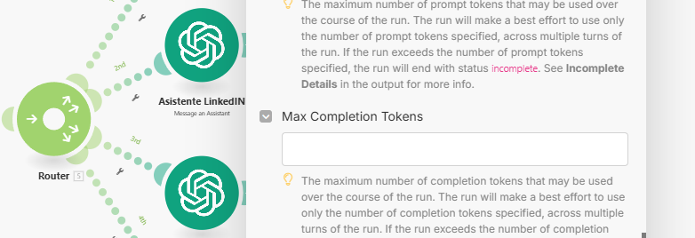

# Q&A 25 Septiembre 2024

> Ruta: 🔴 Grabaciones › Q&A 25 Septiembre 2024

**🎬 Vídeo (59.5 min):** https://youtu.be/kvWduKW8zhc

---

Acá hay un breve resumen de lo que cubrimo en esta llamada.  
  
En la reunión, discutimos la creación y uso de asistentes o agentes personalizados que automatizan procesos en plataformas como Instagram, Facebook, LinkedIn y X. Estos agentes, similares a los GPTs personalizados, permiten mayor control y personalización en las publicaciones, adaptándose al estilo y tono deseado. Además, hablamos de cómo integrar estos asistentes en herramientas de automatización como Make, aprovechando su capacidad de ser editables y actualizables en tiempo real. También se exploró el desarrollo de una IA que pueda identificar el estilo de comunicación de los usuarios para adaptar textos automáticamente. Se destacó la importancia de crear contenido práctico, como un curso sobre Make, para ayudar a la comunidad a optimizar el uso de estas herramientas, y se mencionó el potencial de nuevas funcionalidades para la creación y análisis de imágenes a través de IA, como Runway y DALL-E.

Actualizacion al 28/09/24: Ya encontré donde actualizarle los parametros de los tokens en los asistentes: 

Lo puedes encontrar bajo "additional settings" en los modulos de make.

## 🎙️ Transcripción

bueno bienvenidos y bienvenidas lo que vamos a ver hoy día vamos a ver brevemente lo que son los asistentes y el proceso de creación de los asistentes que son también son conocidos Como los agentes y vamos a ver cómo lo podemos empezar a usar en las automatizaciones ya dentro de de la comunidad si nos vamos al classroom podemos eso cuenta un poquito lo que he estado trabajando últimamente Bueno sí con todo el tema de automatizaciones y asistentes Esto está dentro de automatizaciones cierto Sí sí si es que entramos acá al classroom vamos a encontrar la sección de automatizaciones donde tenemos muchas bueno tenemos las herramientas la biblioteca de proms y dentro del módulo de automatizaciones estamos trabajando en un recurso que no ha sido publicado todavía Pero quizás si estáis viendo la repetición ya va a estar publicado pero son distintos agentes un agente vendría siendo no sé si te acordáis que vimos el tema de los gpt personalizados Sí sí ya vendría siendo Exactamente lo mismo pero eh en el fondo los podemos personalizar aún mucho más con un rol específico y lo podemos crear una vez y puede funcionar para siempre entonces O sea ya Sí aquí tenemos cuatro agente creamos una agente de Facebook uno de Instagram otro de X y otro de linkedin y y la gracia es que si es que tú bajas hasta el fondo va a encontrar acá el prompt de la gente como en la parte de resources de recursos Claro en la parte más abajo y si te das cuenta esto Esto es la misma estructura que un promt o sea cada vez que entramos a char gbt y le decimos como Oye quiero que hagas esto esto aquí está todo tenemos todo lo que es el contexto las instrucciones eh después unos ejemplos de referencia porque este por ejemplo te crea todo lo que es la parte de linkedin Entonces te automatiza te automatiza y te crea posts de linkedin y lo que te voy a mostrar es justamente cómo los podemos incorporar eh y crear estos agentes para que solamente les enseñemos una vez cuál es el rol y la instrucción que tienen que cumplir y los podamos usar para nuestras automatizaciones en make o en cualquier otro lugar perfecto y pregunta antiguamente Cuando tú cre los gpt se iba construyendo de instrucciones cierto Sí instrucciones y una conversación más que nada es una conversación hoy en día como se amplió la cantidad de palabras y caracteres que le pueden meter una instrucción de per lo que básicamente Hi es como crear esta especie de solución para tener los agentes con más instrucciones más disponibles y más rápido Claro claro o sea partiendo que la ventana de contexto es super grande pero el custom gpt y los gbts personalizados que amos creando son mucho más como de asistencia O sea si es que yo quiero No sé pues por ejemplo eh redactar digamos o quiero entrenarlo con cierta información y quiero que solamente me empiece a hablar con esa información probablemente voy a usar un gpt pero si es que quiero integrarlo en alguna automatización de make por ejemplo Quiero crear una serie de publicaciones para publicar en mis redes sociales pero después quiero que pase por un agente que específicamente le enseñe Cómo escribo yo ese agente lo podemos crear una vez y lo podemos seguir usando en todas las automatizaciones Y esa es la magia cach Entonces ya bueno si es que entramos al classroom y entramos a automatizaciones aquí abajito van a aparecer los distintos agentes por ejemplo el de Instagram si es que bajamos acá y apretamos el agente de Instagram vamos a encontrar el prompt este promt es eres un experto en crear descripciones para Instagram con muchos años de experiencia proporciona la respuesta y les damos las instrucciones Integra de manera natural una dos palabras clave Usa los esta cantidad de hashtags y después le damos los ejemplos de salida ya ya y en eso ejemplo de salida Por ejemplo si es que yo Ha posteado en instagram igual le puedo poner como cosas que ya usado antes claro Esto es lo lindo esto es una Pauta Tú la puedes como perfecto cambiar como quieras y la puedes personalizar como quieras pero si queremos sacar algo rápido simplemente lo vamos a copiar ahí sí lo vamos a copiar y después voy a hacer esta parte de cero Vamos a entrar a playground Open a una vez que entramos acá vamos a buscar la opción que sale asistente Y esto es lo entrenido aquí los asistentes los creamos una vez y van a quedar guardados para siempre comoos ver yengo un asistente de linkedin otro de Instagram otro de Facebook ot que cre para otro y aquí ese los entrenamos y los capacit Tenemos muchos muchos parámetros que podemos ir cambiando como el modelo que queremos usar Tenemos también la temperatura eh que es qué tan piel tú quieres que sea la información de que está entrenada con eh que es un parámetro super bueno por ejemplo cuando estamos si necesitamos un asistente digamos que le estamos creando a una página web o a una empresa de servicio no queremos que tenga realmente alucinaciones entonces lo que hacemos ahí es jugamos con el parámetro de la temperatura para que ahí se baja claro ahí se baja para que sea más fiel a la información con la que está entrenada entonces para ir vamos a crear el asistente acá y le vamos a poner como queremos que sea va a poner asistente de Instagram y le vamos a poner dos para poder identificarlo Y acá es donde le ponemos las instrucciones que es básicamente el prom que acabamos de pegar que está justo acá verdad O sea yo le puedo hacer dos asistent tengo dos cuentas de Instagram por ejemplo eh Claro claro si es que tengo una comunicación en un estilo de una lo voy a hacer así y si es que quiero de otra lo voy a hacer de esta otra manera efectivamente Eh bueno Y eventualmente también vamos a ver toda esta parte de Cómo entrenar una Inteligencia artificial o un asistente con tu estilo de comunicación per eso lo vamos a ver más adelante y vamos a crear el asistente acá entonces después yo puedo probar por eso se llama playground porque es un área de juego eh yo puedo probar y puedo buscar no sé cualquier noticia CNN news por ejemplo y voy a entrar a no sé esta da igual y lo que voy a hacer acá es voy a copiarle todo esto super rápido y voy a pegarlo acá simplemente se lo voy a mandar lo que está haciendo acá ahora ya sabe cuál es la eh lo que tiene que crear directamente acá entonces bueno Ah descripción corta descripción larga no esto no queremos que lo entregue no queremos que lo entregue queremos que nos haa directamente unoo ahí lo podemos modificar directamente qué tal Diego Cómo estáis buena Cómo están cabros Todo bien bien tú bien bien bueno estábamos justo jugando acá creando asistentes eh Para después poder integrar en nuestras automatizaciones de make bueno es asistente de qué los asistentes son como pequeños eh No sé os te acordáis que creamos los gpt personalizados Ah no no si me refiero a el asistente de Qué es de Instagram Ah buena buena buena eh mira que pronto vamos a lanzar esto que son cuatro agentes o cuatro asistente que los acá uno de Facebook otro de Instagram otro de x y otro de linkedin entonces la gracia es como que no por ejemplo me gustó este de linkedin tú bajas bajas bajas y aquí tenemos el agente que ya está creado cach entonces después cuando llegamos y lo copiamos acá podemos crearlo directamente en el playground aprovechemos de crear Ah ya te entiendo más como un chatbot podría decirse Claro claro estamos creando Digamos como este esta especialización o estamos creando este agente especializado en lo que queremos para este caso es para reacción de post de link buena justo lo voy a necesitar buen y Ah est entonces aquí nos creó el asistente de link en el caso del ministro no sé qu no s qué pum pum pum nos creó el post y ya está listo Ah ya ya buena buen entonces aquí tenemos el PR Bueno antes vimos que podemos elegir el modelo acá podemos activarle distintas funciones como el Buscar archivos el interpretador de código subirlo bajarle la temperatura está el nuevo modelo no que no no me todavía no aparece Acá no está para jugar con ese pero en verdad ese modelo es más como para si necesitáis como un razonamiento lógico matemático ahí es super bueno eh pero para este caso que es reacción generativa creativa no es realmente algo como que que sea muy útil cach Ah bueno está buenísimo Sí entonces lo que estamos viendo Y por qué estamos creando esto es porque nos ayuda a ahorrar mucho tiempo y no sé si te hais dado cuenta cuando entramos a make que tenemos dos opciones acá que tenemos eh si buscamos el open aiem escribirle un asistente o crear prom directamente acá Ah es mucho mejor el asistente Sí pues mucho mejor porque le podemos dar mucho más contexto podemos modificar más la temperatura podemos jugar mucho más entonces claro lo que hacemos Generalmente los asistentes son editables O sea si es que si es que yo lo voy actualizando todo lo que pasa en tiempo real también se actualizando Sí sí todo se actualiza en tiempo real entonces Claro si es que tengo tres automatizaciones con el mismo asistente basta con que yo lo cambie acá para que se cambie ya en todas las cuestiones cach Y eso es super interesante buen o sea también es lindo Porque eh en el futuro si es que sale un nuevo modelo basta con cambiarle el modelo acá para que eh Para que se cambien todas las automatizaciones que siguen eh dentro de esto ya lo que hacíamos siempre era create completion verdad Donde entrábamos acá elegíamos el modelo que queríamos le agregamos el mensaje elegíamos usuario y después le poníamos el prom acá verdad ahora lo que podemos hacer que es mucho más rápido mucho más simple y nos permite una ventana de contexto mucho más grande es ponerle message assistant Ah bueno Y como ya está conectado con mi cuenta ya tenemos hicimos el proceso de conexión con el Api con todas las cosas eh basta con poder seleccionar el asistente que queremos ahora que estamos creando era asistente de linkedin 2 y eso ha estado siempre en mic o lo agregaron hace poco que no estado siempre sí Ah nunca lo hab no había cachado yo siempre usaba el otro el como el el crat completion Sí sí Esta es una manera mucho más simple y mucho más más buena porque en verdad el espacio de personalización que tenemos acá es bacán estábamos viendo el parámetro no sé de temperatura que podemos jugar acá eh o sea la respuesta al máximo de tokens eso dónde lo lo veí eh Un poquito más arriba no a la derecha Perdón no el te aparece acá Mira el Ah ahí cuando lo estáis creando la primera vez te salían los tokens a la derecha Ah en serio sí a ver Buen punto tampoco me acuerdo yo lo vi yo lo vi sí dónde lo viste meterme yo espérate l que no sé la verdad no s dónde no sé dónde encontrarlo también aparec claro los que estamos usando de los que estamos usando de out pero no no sé bueno por lo menos si sabemos que el otro a ver Ah espérate cuando ponían chat en dónde chat arriba la izquierda ya no tiene nada que ver con lo de la derecha que te dice maximum tokens claro es es ese chat no se pasa el asistente en sí no no Estos son una parte este es para jugar directamente con con el chat pero no tenemos ya per tiene que haber alguna forma sí tiene que aparecer por acá la verdad nunca nunca lo había hecho functions put La verdad la verdad me pillaste me pillaste no sé Cómo ajustar ese parámetro tampoco me acuerdo s ahí me pillaste pero lo voy a averiguar lo voy aigual pero yo creo que se puede de que se puede se puede pero si no sería por acá Bueno lo voy pillar y después te lo te lo puedo ver lo podemos pero Ah ya entonces la gracia es que digamos unificamos todos estos asistentes y unificamos todas estas cosas para las automatizaciones en directamente cach Entonces es super interesante estamos trabajando estos cuatro modelos y otro que estamos empezando a trabajar Es uno que detecta tu tono de voz cach porque yo lo que puedo hacer es ya tengo este asistente de link que me va a crear eh directamente el post cach me lo va a dejar listo verdad me va a generar un output que vendría siendo el que creamos antes y después lo que podemos hacer cach un asistente que va a ser super Útil es crear otro que diga como perfecto te va a pasar un texto pero ahora necesito que lo escribas con mi tono sería como un sistema de multiagent más menos exactamente con todav lo lanzamos pero aquí esto es una pone cach con este mega lo que vamos a hacer es empezamos a subirle Caleta de textos nuestro y descompone como es tu estilo de comunicación eso interesante Entonces te crea una Pauta Y esa Pauta es la que tú vas a subir a la gente y a la qué a la gente a la gente que es como una reescritura tuya cach Ah ya entonces esa Pauta es la que le subimos y le decimos Oye te va a pasar un texto input y eh Necesito que el output sea escrito en estilo corde o cach está buenísimo hermano sí Entonces es super Interesante como para darle como una naturalidad a la cuestión y bueno y bueno Y eso es lo que estábamos haciendo eventualmente también voy a grabar un videito como de los asistentes lo voy a dejar publicado ahí el Cómo funcionan y pero en verdad son unas herramientas s super útiles porque te va a ayudar mucho tiempo en futuras automatizaciones cach la ventana de contexto que tenéis dentro de los agentes es mucho mucho más grande que la ventana de contexto que tenemos en el creom no está brutal her s super cho brutal y bueno y ahí también vamos a jugar también en futuros videos porque estamos preparando el cursito de make entero con todas estas funciones hay muchas funciones que son super útiles Que no usamos en el día a día de Open y como ya tenemos los créditos como el analizar las imágenes as que creo el post por ejemplo creo una imagen puedo pedirle que analice la imagen para que después me cree una descripción y automatizamos la subida de eso generar las imágenes con Dali eh hacer una transcripción directamente de un audio a texto eh o podemos directamente crear el audio cach Ah buen y ya tenemos todo eso super e cómo se llama tenemos todas estas herramientas que básicamente nos ayudan a crear lo que queramos lo que queramos o sea en verdad yo siento que este es de los módulos más más potentes que hay los de Open y de hecho es de los po crédit Así que respecto al curso de make [ __ ] y esto Esta semana Igual me he visto varios cursos de pero encuentro que son muy Enredados como como que te explican pero como no sé como con escenarios que nunca en tu [ __ ] vida vay a ocupar ent como que al final es más útil que te enseñen con cosas como esta pues así chat gpt Claro perento que es muy enredado la información que hay de me ahí fuera en YouTube sobre todo no hay como Incluso si buscáis hay muy pocos cursos de en YouTube ha como que sí no hay o sea hay pero no hay un curso as que este curso en la raja buena buena Oye que buena porque yo sacar un curso as para YouTube fijo la va a tener muchas visitas Está interesante Bueno ahora por lo menos lo que tenemos en mente es sacarlo como un gran plus para la comunidad que va a ser un curso porque bueno cách justamente diciendo eso mismo Hace media hora acord diendo Qué cosa Oye me di un curso de estaba viendo unos videos curso de make un hón muy latero me decía así desagradar el callo en verdad era super pesado como cuando explicaba y no te dan ganas de aprender cachái sí Entonces yo creo que un buen approach para Esto va a ser como hacer un curso base cach o está es la interfaz est la lógica cuando creamos una automatización estos son los módulos así son las secuencias así no sé qué eh y después crear una automatización al tiro el conjunto cach una cuón a mí lo que me ha costado igual como interiorizar en la cuestión de los webhook y los http como que todavía no no le Pillo mucho la mano no sí Bueno ahí La idea también porque estamos planeando como toda esta estructura y ver como Ah Y también eso íbamos a armar el glosario que esa también está super buena armar como esta especie como de glosario donde vamos como descomponiendo todo el como todos todos estos conceptos cach como lo esencial digamos porque muchas veces claro llegamos importamos no sé la la automatización en Sí tú esto de Cha la cuestión es terrorífica terrorífica Pero si te das cuenta Aquí hay una cuestión que te explica los flujos es como Mira el ordenes así cach pasáis de acá es un router te la cuestión entonces La idea es explicarlo un nivel mucho más básico todo mucho más básico y después siento que la mejor manera en verdad no sé si te ha pasado Diego pero la mejor manera de como yo he estaba aprendiendo es directamente creando H como estáis creando cosas y después decir Claro en un par de problemas y como Ah s Quizás lo puedo resolver así yar pero de todas maneras es es creá sí totalmente s sí Y al final se termina confundiendo harto entre los eh Como distintas opciones y cosas que hay pero de poquito hay cachando por ejemplo el tema del webhook es una cosa que se usa cuando queréis como algo más inmediato como que por ejemplo cosas que pasan en tiempo real como hay una compra en stripe y necesit mandar una factura por tu cosa externa eh en Api todavía tenéis la cuestión de que ellos Sí o sí controlan el tiempo Dear la conexión la controlan ellos el webhook le dec ap ponle en ojo acá apenas hay un cambio o hay un evento en esto genera algo cachái y sí como Sí sí tengo igual claro eso pero como que todavía no le Pillo algo un uso que yo pueda darle Ah claro y por eso es verdad pu lo que dice el Benja Mientras más tiempo estáis probando jugando integrando aunque no s la automatización la hay quando igual ahí se famiz los conceptos Claro sí bienvenido Alexis Cómo estáis Qué tal Hola acá estamos en el taller gracias Cómo están bu Cómo la producción Ahí vamos Ahí vamos buen Ahí vamos vamos qué bien Pues qué bien bienvenido bienvenido estábamos conversando un poquito acerca de de automatizaciones cubrimos antes un poquito hablamos de los asistentes no sé cómo cómo te haido en el tema de las automatizaciones si hais podido jugar un poco no como Mira yo estuve viendo el tema del del de este curso de crea convierte y conecta crea conecta convierte ya y y yo creo que o sea eso es lo que es lo que me sirve a mí por el momento porque no no me metido más buena buena y de ahí estado Ya sacando alguna idea para poder generar contenido y todo y y estoy ahí porque tengo que estar entre el taller y las redes sociales y todo pero yo más o menos ya tengo Clara la película Por dónde tengo que ir y qué insight hais tenido qué se te ocurre Mira la dejé anotada a ver voy aquí tengo anotada acá eh ese curso es super interesante o sea es literalmente Ese es el mecanismo que que hemos estado haciendo para crecer toda la audiencia si bien ahora Estamos como alejándonos un poco del tema de los re directamente mandándole un foco mucho más grande YouTube Mediante los fue la cuestión de cómo se logró crecer esa audiencia y más importante logramos como capturar información capturar leads cach Porque mira acá por ejemplo tengo anotado eh Por ejemplo lo lo lo dividí por producto Entonces por ejemplo para la billetera ya dice como un listado de cuá de cuáles son los dolores principales del cliente en relación al uso de de su actual billetera o o algo por ahí Entonces anoté como todos los dolores que puede el cliente por ejemplo su billetera es abultada incómoda su billetera es muy grande su billetera le rompe el bolsillo trasero del pantalón su billetera le daña la espalda eh está rota porque tiene mucho tiempo usándola es de material sintético se se pela se rompe e no le ayuda a potenciar su outfit Eh no cuenta conit eh Y así entonces en base a eso Por ejemplo no sé su billetera es abultada y cómoda yo puedo hacer un video de donde puedo mostrar el tema de que la billetera de nosotros es delgada es pequeña ahen puedes sciar ese tema Oye pregunta alexi eh Quién compra las billeteras porque en general Es más yo me compro una billetera para mí o yo compro una billetera para regalar porque en lo personal yo nunca me comprado una billetera para mí siempre me la ha sido un regalo lo regalan Mira es como es como fify fy compran para regalar y compran para para para ellos claro entonces imagínate esa audiencia de que es cuando cuando yo te regalo una billetera estoy regalando algo que vo a usar todos los días verdad Entonces imagínate también poder atacar esos problemas porque claro todos esos problemas o la mayoría de los que me comentaste son problemas míos Pero qué pasa si yo le quiero regalar algo a no sé una una mina le quiere regalar algo a su pololo cachái qué le está regalando cuando le da la guera cachái quier ser una cuestión así de cuál es ese sentimiento que podemos producir a las personas también es una cuestión O sea me acuerdo que una vez estaba viendo un caso de una persona que hacía dropshipping eh que vendía otros productos de de otros proveedores y y él se dedicaba a vender uno unos pendientes unos pendientes así como de florcitas como de doradas y todo y y se dedicaba a vendérselo a hombres que le querían regalar el pendiente a la mujer cachái entonces decía como yo te estoy vendiendo esto para que hagas un regalo por qué Porque cuando haces este regalo te va a ver como esto o va a sentir esto Entonces lo encontré una estrategia super interesante que también se le puede dar una vuelta o sea Quizás sí sí adás que sí pues también también la voy a anotar acá porque encuentro que que Es bien interesante Sí se puede hacer algo cono eso que de hecho de hecho hay clientes que que están con ese inside Ah mira obviamente pues si allá por ejemplo el punto de venta compran para regalar eh lo piden grabado cachái con láser Ah Qué buena y así eh o sea el inside se da dentro de la de la compra Qué buena Así que es es una buena es un buen tip para anotarlo igual no y es un buen mercado para entrar a regalar Porque por ejemplo hay una empresa que me encanta el marketing que tienen que se llama my Cocos que es laa que es para de las máquinas para afectarse abajo loo y y uno dice es algo tan personal que cómo lo van a hacer y tú hasta Pía del padre eh Navidad las campañas que sacan regala esto que es lo más complicado yo creo que regalar es como qué me quieres decir aj hac muy buen marketing con los packs y también lo que tú decí los grabados igual se puede hacer algo porque al final tú le puedes decir a un regalo que le va a gustar al quien le Regal por porque no es adada por qué Porque es de buena calidad cachis como que tenía harto harto potenciar ahí como los Por qué claro hacer algo por los porqué Claro claro y respecto a los reels de viralidad que que quizás viste esa parte en el módulo de crea que no lo mencioné mucho pero yo lo que hago muchas veces es Entrar a tiktok y buscáis no sé billetera y arriba y los tres puntitos y tenéis los filtros y en los filtros Buscamos por eh Cuáles son los más los con más me gusta y después le vamos a aplicar y después te van a aparecer todos este tiene no sé 200,000 me gustas cachái y te aparece ahí o este tiene 220,000 me gusta no sé cachái mira este copiar el el trayecto que tiene esta persona cachái que hizo dos años de que lleva haciendo detrás 2s años cach 12000 me gustas entonces también es una buena decir como Oh qué es lo que hizo que a esta publicación le vaya bien y cómo lo puedo hacer Exacto Por ejemplo yo lo que planifiqué es como una línea editorial en donde eh voy a dar a conocer como como el video tú viste el video de ayer Di lo vi estaba buenísimo estaba buenísimo entonces por ahí como que voy a empezar con con esa línea cachái de de empezar a mostrar porque en el fondo el yo yo te puedo decir a ti Oye estas billeteras las hago yo cachái pero tú vas a mi a mi Instagram y y tú me puedes decir de dónde sale que la hací tú cach no en ningún lado veo que que tú la la estés haciendo Exacto Entonces yo creo que por ahí es una buena estrategia para que para que el cliente también eh de cierta manera valore que el producto está hecho a mano pero que él también lo está viendo cómo lo hacen anoche conversaba con un amigo y me decía Oye pero estáis mostrando como la hací no importa si si poner billetera cliente quiere ver cómo lo hacen pero o sea puede que por ahí salga alguno que empiece ahas lo hacen y todo porque de más que me sigue la competencia pero pero yo dije pero no importa si aquí Lo importante es que el cliente tenga esa conexión en donde diga Oye mira como fabrican mira aquí como como Cómo aplican las técnicas por eso que el producto es de calidad cach trabajan con estos materiales y en el fondo ir mostrando todo el proceso y y darle a conocer a los clientes que que las cosas que vendemos son diseñadas y fabricadas por nosotros cach no no las compramos en China para venderlas de nuevo acá o sea es un producto que está hecho a mano que lo hacemos en chile y todo eso lo quiero validar a través de esa de ese contenido cach que yo creo que va a funcionar bien eso yo yo creo yo creo que es excelente también o sea hacer los parte parte del proceso lo que conversábamos la otra vez eris parte del proceso parte del resultado y muchas veces te Abre muchas puertas en el sentido de que Oye quién quién puede trabajar bien el cuero Oh el otro día haba un gallo que que subía unos RS unas billeteras cach Ah ya y te acordáis cómo se llamaba Ah s Ya mi Ah ya Perfecto entonces como que también te Abre como puerta muchas veces el tener como esta presencia digital oportunidades que no son directamente relacionados con con lo que haces pero te AB así ese nombre y eso también es s super importante Así que exa no muy bien lo encuentro buenísimo ese esa perspectiva cómo está acercándote al problema Sí sí y después bueno eh al finalizar Como por ejemplo esta billetera que empecé a mostrar ayer ya no sé cuando ya ya el producto est terminado y todo cach como cuando el cliente diga Oh hón quedó bacán ahí quiero utilizar este tema del del meni chat con el con el email marketing cachái decirle Oye no sé hón las primeras 50 las vamos a tirar a tal precio cachái pone la palabra tanto y y ahí empezar a agarrar Mail para construir lista y todo eso buen buenísimo Sí también claro parte del proceso y también después metete a tiktok y ve ve el tema de los post de viralidad cuáles son los que son los más p cach Exacto Cuáles son los que son los más impactantes Por qué les fue tamban bien esa parte también es bueno para llegar al alcance al alcance te metía al buscador colocá la palabra TR puntos y y ahí colocáis como lo más s buscáis acá buscador los tres puntitos y ahí los filtrándose parando jugando y Y esa es s super buen método ya buena vamos hablando de creación de contenido Perdona Diego tú cómo V con eso o estado más en modo aprendizaje últimamente Oh Sorry me había perdido sí como te dije tomé el curso de ud y [ __ ] estoy así todavía ni lo termino si llevo como el 40% y Recién ahora me voy a meter a todo lo que es llm chatbot y todo lo que estoy Tú sabes cach que que me llama la atención y nada estoy bueno aprendiendo anotando ideas de contenido y no tranquilo todavía no no me voy alanzar con todo ya perfecto Así que estoy como aprendiendo todavía full aprendizaje de todo programación ya perfecto Qué buena Qué buena s el otro día estaba viendo también una oportunidad de negocio que y Bueno creo que creo que te la mandé Alexis de este gallo que entrenaba un modelo de Inteligencia artificial para sacar fotos de productos Eh bueno no sé si vieron ahí hace unos tres cu días subimos un video de cómo entrenar la Inteligencia artificial modelo flux con tu cara para sacar las imágenes el otro día Vi una persona que usaba Exactamente lo mismo pero para sacar imágenes de productos eso justo justo te quería quería comentar eso porque por ejemplo eh yo como que dentro del de todo el tema del de la porque la eh Como que de repente pensaba como crear un personaje cachay como el artesano de de de mi arque que sea como bien parecido a alguien real y que ese ese artesano también cuente como como historia así como mostrarlo la portada Eh no sé y contar una historia de algo cach y los productos también tratar de de ver cómo quedan con este tema de la de la Inteligencia artificial porque ahí como como que podía ser como un un tema de de crear como historia eh contar historias cachái que No necesariamente tenéis que contarlas detrás de un video Sino que algo entretenido poda hacer como que por ahí va Sí o sea en ese caso claro entren el mismo sistema o sea le subí las 15 imágenes de distintos ángulos de de la de las billeteras y podía hacer campaña super entretenida o sea se viene Halloween y tú sac unas imágenes como en un lugar medio terrorífico cach se va a notar o sea las imágenes son super realistas pero también muchas veces se puede notar que hay como una pero pero lo mismo que decís tú podéis contar una historia de la cuestión cach se acerca el 14 de febrero y decís como en vez de hacer un Setup con no sé fotos de de algo en San Valentín podéis crear un imagen con Inteligencia artificial y así es una cuestión como eh Como te mandaste un cagazo te aseguro que con esto tu poolo te perdona y ponéis la imagen cach como con las flores buen entonces como que te permite esta versatilidad de sacarle cosas super rápido y también tenemos el lado opuesto O sea si es que yo Digamos como freelancer eh le hablo una marca y le muestro los resultados que yo estoy teniendo le digo Oye [ __ ] quizás no necesitáis volver a tener un fotógrafo si es que pasáis buenas fotos te puedo sacar cosas s super realistas y te puedo ahorrar esto toma eh te cobro 150 Lucas mensuales y estamos eh No sé te estoy sacando ocho fotos cachái de esto de los estilos que no sé como que ahí te Abre una opción super grande de como de te abre un abanico de opciones básicamente sobre todo cuando queréis Mostrar fotos por ejemplo de de tus productos porque yo yo a veces he intentado sacar fotos así como de estas que tienen poca luz y todo cachái como de estas típicas fotos de no sé de donde tú mostr el producto y así como que se ve un poco de luz de la cuestión pero a la finales terminé editando en un en un en un software no sé en App No tengo idea pero de repente con esta con esta con la con la Inteligencia artificial a mí se me ocurre que podéis crear cosas así donde queden bacanes las fotos cachái donde tú empecé a mostrar tu producto ya de otra manera exactamente Sí sí O sea pues de todas maneras le decí todo está en Cómo formulamos el promto básicamente está quea una cuestión media Premium con la luz baja que se note el reflejo que llegue por acá usemos esta cámara Entonces ahí los podemos sacar como distintos ángulos y después incluso podemos entrar a aplicaciones como runway y le podemos dar movimiento un movimiento s sutil donde tenemos una especie de movimiento y ahí tenéis un un nsel o como una manera de venderle algo a alguien y hacerlo un poquito más caro tú le vendí el paquete original a cierto precio pero después le vendí y le decí Oye mira por este precio también te puedo hacer este estilo de movimiento lo hacemos cach Exacto bueno bueno quedan super bueno tenéis para para imaginar estas cosas sobre todo uno que le gusta el tema de la creatividad y todo sí que meterse n más sí Y lo bueno es que el modelo lo entrenamos una vez y nos demoramos 20 minutos cachái Tú ya tenéis la foto entonces es ese podría ser un videito choro que podos sacar más adelante Sí está muy bueno sí buena Sí sí porque poco poco he visto poco de eso pero es una oportunidad de negocio super buena super bucalo con una billetera mía claro podríamos probarlo eso ahí me podis mandar te mando una billetera te mando una billetera mando las fotos ahí me mandáis claro 15 20 fotos podríamos hacer la prueba pues ya ya te voy a escribir como ya están las fotos lista y aparte podemos contar el caso en el video de YouTube pues tenemos un comunidad imperio digital estamos viendo cómo podí esto ya me rinca me rinca eh pero pero sí eso yo voy a sacar las fotos y te las mando ahí tú ve si si lo podía hacer o no Sí pues sí no yo feliz feliz o sea sacáis las fotos incluso mándame las que ya tenéis cachái Pero lo importante es que sean de el mismo producto cachái Exacto que sea como tien que ser distintas vistas como distintos planos es como que está haciendo un un una fotogram claro esa cuestión tiene un nombre e se me olvidó es eh St stop motion Claro claro distintos ángulos armar como una fotogrametría Sí sí exacto el eso es hagamos la prueba suena suena choro como Para probarlo y comentarlo Sí aparte saldrían todas tus bas en el video YouTube entonces Está bueno s Disculpa que mand una página que creo que te puede servir que tú ponés como la foto de no sé en este caso una billetera y te lo pone como en distinto ambiente no sé como Ah profesionales la tengo Photo room no s Bueno hay varias Ahí está Ah Está buena cacha que yo también he probado este tipo de aplicaciones y en general También dan buenos resultados pero está por el papeo está super interesante Sí también lo podemos probar también lo podemos probar Gracias ahí por el por el dato tú lo has usado alg la de fondo no el Diego que mandó ahora el Ah no no no no la usado o sea he usado la Magic Studio que es la la aplicación pero no he usado esta herramienta buena buena buenísimo tú tení una marca Ten una marca de productos que tení no yo marca personal pero Ah ya Sí de también como el Benja Inteligencia artificial Pero ahora estoy como más o menos en una pausa que darle no más sí que aprovechar el tiempo que pasa rápido el también est subiendo subiendo también se YouTube Oye aquí estoy Bueno les voy a mostrar un poco acá para que a ver queos ahí acá tenemos una máquina una máquina de poste esta sirve para fabricar mochilas bolsas y todo eso Wow acá tenemos una una recta plana esta de Tri arrastre estas son para hacer costura fina y toda la cuestión Ah acá donde se crean las las billeteras menos el taller est acá en el taller esta de acá esta es una máquina descarnadora y tú V el cuerro por aquí y te adg y con eso darle las terminaciones fin al producto lo dobl y te queda como dobladito y todo le da otra terminación al producto la raja que tenido Está bueno Buen metido hace tiempo en ese tipo de trabajo yo empecé el 2018 sio antes trabajaba en empresa era jefe comercial en dominó de los completos ya perfecto y el 20188 después vino el tema del estallo social y todo eso entonces como que no no había pega cachay y dije Bueno tengo que hacer algo con mis talentos con mi con lo que sea hacer y ahí salió yo no tenía idea de esto buena idea buen cambio sab lo que empecé haciendo empecé haciendo bolsos con con los pendones cach los reciclaba estos pendones de de publicidad de publicidad y empecé fabricando bolsos con eso porque en ese tiempo como que andaba toda la cuestión del del Go Green y toda la cuestión del reciclaje y todo pero lo malo es que después los bolsos como es esos bolsos estaban expuestos al sol con el uso se empezaban a romper y ahí me empezaron como a devolver los bols y todo y ya tenía las máquinas pues cach entonces no no podía dejar de O sea no podía vender las máquinas o sea era como fracasar y en el curso que yo tomé de de este tema de diseño de marinería ahí me enseña a fabricar cuero Ah buena y un día me lancé cach me lancé con una billetera que yo tenía una billetera de bestias cachan esa marca bestias sí buena marca son como cuo muy bien es conocida tiene cinturones Sí y la billetera me molestaba como que era muy vultosa de hecho por aquí la tengo porque aquí en este cajón tengo todos los como los prototipos Acá está Mira esta billetera la tengo hace como 10 años Ya esta cachái est de bestias y yo encontraba que esta billetera era muy muy gorda cach como que molestaba atrás como que cuando me sentaba era incómodo y todo y y dije Oye podría crear algo que que venga a darle solución esto cach que sea delgadito que sea buen solucionando tu propio problema exacto y ahí y ahí salieron estas las billeteras y está super de moda esa cuestión de cada vez ir usando las billeteras más delgaditas yo por ejemplo también tengo un bulto así gigante cach una billetera tradicional y cada vez que saco la billetera me agarran para el H Ah los millones me la cuón es como lo tengo lleno de h y a la final es puro papel nos es puro papel y claro pues después ve todo a to sobre todo cuando estaba all en cuando estuve en Estados Unidos veía toda la gente tenía unas billeteras así del gitas del gitas que con cueda usan para guardar una dos tarjetas no más y decía [ __ ] porque la billetera para nosotros es como las carteras para las mujeres uno mete todo o sea te pasan el papelito del ticket te lo metí adentro todo para dentro no sacáis nada y que con un bulto gigante Sí porque Mira por ejemplo acá les voy a mostrar el la comparación Mira no sé Cómo dar vuelta esta cámara pero ahí cach mira Acá está la la billetera de la bestia y acá está la de nosotros no sé pero esta es la de nosotros Entonces si la si la miráis así como Mira fíjate la diferencia cach Sí en el grosor en el bulto y todo y esta villetera tú te la podes meter acá adelante adelante no no molesta efectivamente con una de estas que fueron como las últimas que sacamos ahora esta que tiene el botón ahí abajo le sale la tarjeta así automática buena y también es chica Pues mira comparada con la otra con la negra más chica ydo más delgada y todo y podis colocar los billetes tirados y todo Entonces más o menos por ahí yo me fui como por la funcionabilidad dije yaa que sea funcional y todo y por ahí entr qué bien haciendo cosas como muy la raj est revisando este eso este también un mensajero Está muy bonito es un mensajero í tenemos banano no Y la página también está está super bien hecha la hiciste tú sí yo la hice usaste shopify shopify perfecto el curso del o sea aprendí a hacer shopify hace rato cach pero después le compré el curso al ya al de gre s perfecto y ahí la hice con él buenísimo plantill bien buena no está buenísimo integrada con con mercado pago con Flow y Y sab viste que que para el tema de la integrarla con los Delivery con los no s con to cuestión ten que tener que vale como 70 Lucas el de la O pagar anid yo yo lo había hecho así cach ya per después cach hay como un atajo tener plan básico Ah les voy a dar un tips Entonces porque el gran problema es que no las tarifas de envío claro Entonces los gallos cuando integrar de manera ya más Pro ten que integrar con el plan que vale como 70 Blue Express laón de c os Ellos tienen un cotizador en línea y no tienen no tienen tarificación por comuna la tienen por ciudad entonces crear las tarifas de envío en tu shopify por ciudad y no tené que estar pagando el plan de 70 Lucas pagá el básico no más Oye pero cacha que también les puis mandar un mensaje yo me acuerdo Yo tuve un ecommerce que les mandab la cuestión para que te la activen s pues había que subir un poco el plan pero yo trabajaba con chipit no sé si lo conocí sí trabajé con chipit también tuve vendía los gorros lo estuve vendiendo como por dos años ao pura publicidad en Facebook y y era la raj Era lo más cómodo que había lo pasaban a buscar no tuve ningún problema todas todos los corros que se perdieron que fueron tres pedidos los dos años te los reembolsan y te reembolsan el precio costo o sea el precio venta cach ya buena y no en verdad tuve una s super buena experiencia con con chivit directamente y tien el tarificador en línea cach que que eso también era super bueno porque me enfrentaba muchos clientes por ejemplo que vivían en [ __ ] te invento en en cocin en cocin cachái y en cocin el envío en sí te salía como 18 Lucas mandarlo para allá y habían huas que habían e courriers que no llegaban entonces ahí lo lindo de chipit es que tú podes decirles como ya puedes elegir entre starken entre chile Express o entre Blue Express y te sale cada uno porque ellos saben Cuáles llegan y cuáles no Entonces como y les poné los precios de cada uno en tiempo real y y cacha que los carabos del chip no te cobran síes no sé si cach tienen un plan que claro tien un plan que no que no te cobran por el como por hacer esa pega s no te cobran estos gallos ganan en base a en base a tu envío cuánto le cobraría a un usuario cach en general por enviarlo acá y a ti te cobro el mismo precio Pero ellos tien un diferencial porque tienen precio preferencial exactamente pero creo que hay que hacer 20 o 25 envíos al al mes Sí si yo bueno en conversaciones con ella y todo porque como que vien todos los los operadores de en y después de dar todas estas vueltas eh Me quedé trabajando con Blue Express y también trabajo con una empresa que es como particular que se llama packet tienen aplicación número de seguimiento y todo y en Santiago Te entregan el mismo día Ah buena pasan a buscar antes las 12 y Te entregan el mismo día cach y cobran tres Lucas está buenísimo as que y bueno y bl lo otro bueno que tiene es que si por ejemplo si la dirección del cliente es muy compleja tú lo pod llamar y decirle Oy te la puedo mandar a un punto cc se la mand un servicentro un negocio y lo otro bueno es que está lleno de puntos Bless por todos lados por ejemplo Yo voy acá al almacén que está un poco más allá y ahí dejo los pedidos es y de p Lo pasan a buscar taller eso super práctico bueno funcionando bien ahí Entonces el sistema logístico si lo que lo que yo estoy medio estancado en el tema de del contenido eso es lo que porque no sabía cómo mostrarlo no sabía cómo a pesar de que yo soy publ y todo bloqueado entonces como que después de ver el curso tuyo Ah dije por aquí va la cosa cach buenísimo por aquí va la cosa porque eh De repente era como no sé si habis pasado por ese tema que es como ya Pero cómo voy a apcer yo cómo voy a aparecer hablando cach No ya bu queer que salga yo pues cachái y la primera experiencia que tuve que tuve que salir en la en la en la pantalla yo no quería yo yo quería pasar piola porque mi tema fue siempre volver a trabajar pues cachay volver a y me quedé me quedé nos entonces como que no quería que salir cachái y el año pasado me llamó un un productor de de CNN y él me invitó a participar en un programa que se llama rompe paradigmas ya y ahí estuvimos grabando y ahí tuve que aparecer pues cach contando la historia y todo y como que rompí un poco el hielo bien ahí aparecimos en un programa y y de ahí yo dije ya ahora me voy a lanzar y después como que me quedé y en el fondo es más que nada porque no quería salir cach No pero yo encuentro que la la manera como lo estoy haciendo como lo hice ayer eso está bien para empezar y después eso me ir dando la como la la chance para después salir cach Cómo están Yo soy el de los videos Exacto el primer video que sub me acuerdo terminé de grabar Y ya dije ya publicar y tiré el celular a la cama me fui a la concha y hón no no lo vi más no lo vi más después vuelvo como TR horas TR horas después y y ya Ya está ya está Entonces sí a veces lo mejor que voa hacer es es directamente lanzar y superar y ahí supera de todas maneras se va superando a poco Oye ya estamos Sí dale Ya estamos en la hora no no les digo que van quedando como ya estamos casi por llegar a la hora les quería preguntar un poquito acerca de de Cuál ha sido su su impresión con la con la comunidad con la interfaz qué les gustaría ver cach eh feliz de si me cuentan un poquito así para tener como un feedback y saber que podemos ir mejorando que podemos ir planeando hemos estado preparando hartos recursos y haras cosas que se vienen s super chor eh pero también me gustaría como saber por su parte qué es lo que qué es lo que les gusta qué es lo que les ha gustado qué les interesa ver cómo creen que podemos mejorar esto cachái eh feliz feliz de escucharlo Diego Alexis Mira a mí me encanta la me encanta la la la aplicación como tal porque la encuentro que es bien amigable y todo y bueno y el contenido me me me gusta porque es como que siento que siento que está en línea con lo que viene ahora porque ya lo lo demás ya pasó ya cachái el tema de no sé de los Carruseles la cuestión y todo ya como que entonces uno tiene Siento que estoy parado donde tengo que estar ahora cach y tengo que aprovecharlo ahora respecto a lo que me gustaría ver eh más que nada estoy como a la expectativa de lo que hagan ustedes cach porque encuentro que todo lo que lo que van a mostrar Ah Es como Útil para mí o sea el tema lo que yo quiero hacer a lo mejor más adelante voy a poder decir o sab pod hacer darte una idea como la de ahora el billetera pero pero no que está la raja todo aquí estoy aprendiendo más que nada bien bien bueno ahir las fotos de las billeteras entrenar modelo hacer la prueba eso mismo que qué bueno que igual se pueden ir integrando y aplicando las cosas en tiempo real y en negocio cosas así queos ver los resultados así como pum y también de repente cuando empecemos a valar automatizaciones son más útiles Cuál programamos cuál ponemos cuál hacemos también ver como [ __ ] pued servir cach sirve acá cachamos Bueno bien Oye Diego tú qué opin yo [ __ ] pienso que trabaja la comunidad y la verdad que no no tendría mucho que decir creo que están super bien los contenidos eh No sé quizás podría como ese módulo de crea ya nunca me acuerdo el nombre crea convierte y no sé el otro como otra versión de ese quizás con otro enfoque porque igual no sé igual las cosas como que van evolucionando Entonces como ahí podría haer algo como Cómo partir en verdad Cómo vender pero con con otro enfoque perfecto ya buena no muy interesante oye bien bien bueno encuentro la raja la raja o sea esto también es una cuestión que es un proyecto que está como on o sea estamos en la marcha La idea es siempre ir mejorando distintas cositas cach donde podamos todo sacar el más valor cach empezar a hacer esto mismo donde empezamos a conectar con personas porque muchas veces claro nos rodeamos de gente nos rodeamos de gente y es gente con la que uno comparte su via a día Pero pero eso ir alimentándose con gente que que tiene hambre que tiene hambre cach que quiere hacer cosas que quiere tirarlo adelante siento que es lo más nutritivo que podemos hacer y eso es dentro de la uno de los objetivos que que hemos estado apuntando con la comunidad cach conectar con toda esta gente que es como que quiero más quiero más cach ese saciar esa hambre esa sed y y lar para arriba y tirar para arriba eso ha sido siempre lo uno de los focos principales y y y tengo fe que cada vez va a ir siendo mejor cachái mejor y vamos a ir complementándolo dig encontré super bueno también esos de esos esos tips que subiste a la comunidad de Oye esta es la la como la inversa de Cómo sacar la información a un gpt que fue personalizado con algo bacán cachay eso lo encontré muy bueno y Y bueno pues esperar ahí que todos podamos ir ayudándonos y y podamos crear una comunidad así muy linda muy linda Así que bien Muchas gracias ahí por por todo son lo máximo Ah vale gracias Sí bien ya pu mucho éxito escríbeme escríbeme o yo te escribo y feliz de de de hacer el tema del video ya ahí estamos conversando por abajo Ya yaito les vay que una buena semana Igualmente gracias aos
