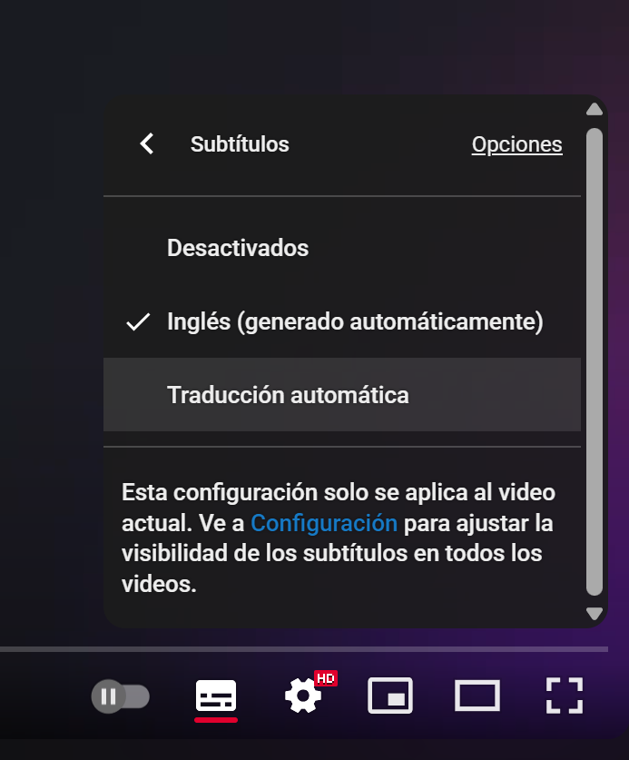

# Apify + Make (Webinar)

> Ruta: 🔴 Grabaciones › Apify + Make (Webinar)

**🎬 Vídeo (70.3 min):** https://www.youtube.com/watch?v=gf5WXeqydUU

---

En este webinar conjunto entre **Apify **y [**Make.com**](http://Make.com), se presenta cómo utilizar **MCP (Multimodal Communication Protocol)** para conectar agentes de IA con herramientas y flujos de trabajo reales, sin complicaciones técnicas. Aprenderás cómo ejecutar scrapers, lanzar flujos automatizados en Make y combinar múltiples actores de Ampify para casos de uso como generación de leads, análisis SEO y más. ¡Incluso verás cómo Claude (Anthropic) controla herramientas directamente con lenguaje natural!

**🔥 25% descuento **por los primeros 2 meses de Apify con el promo code [MAKE_APIFY](https://d2hrhh04.na1.hubspotlinks.com/Ctc/GF+113/d2hRhH04/VWBQKQ7k3WMDN23yWLshTZJGW6J3_6X5w2yNsN6Q02s63m2ndW7lCdLW6lZ3lwW7nS8PL1ytlN6W4C563Z6LLPFfMmyM_Bnkyk8VRDsKw8nct5JW8BZf958t4L7FW2xSRw145S6pRVmjLyz18VYQLW6kHb3Y3Jh-z2V5zkhd25QlYFW7JD4cP12r13SW8-GtyW7hfwN6W8l4t7X25RtrCW5Fs2Xr98cqPZW1NZp5Y57wY93W7zSgNf47sSQrW8zvWMQ3FYbpZW4y4JgN5dwRFJVfSYPs1sjhTLW2gsX9t8GMrV8W40gdrK4zbdTCW8xS2BF1xQbjPW2Mv6b47gb_pBW5DJ41F5KPSSvW8GFKYz1-9fjwf69NxRC04)

📌 **Prefieres seguirlo en castellano?**  
Activa los **subtítulos** y selecciona la opción **Traducción Automática **para ver la sesión en tu idioma.

