# Nodo 3: Execute Workflow (Sub-workflows)

> Ruta: n8n Desde 0 › Nodo 3: Execute Workflow (Sub-workflows)

**🎬 Vídeo (10.5 min):** https://www.loom.com/share/cd73f83e85964a41a90e384d938d3e09

**📎 Recursos:**
- 3.a Execute Workflow (JEFE)
- 3.b Sub-flujo (HIJO)

---

**El Concepto:** "Delegar tareas repetitivas". En lugar de que tu flujo principal haga todo el trabajo sucio (y se vuelva gigante), le pasa la tarea final a un flujo especializado. Aquí separaremos al **"Cerebro"** (quien piensa qué decir) del **"Brazo"** (quien envía el mensaje).

### **1. La Situación (El Escenario)**

Estás armando una automatización para **Imperio Digital**.

1. **El Jefe (Main Workflow):** Detecta un correo entrante de un cliente, lo lee y usa Inteligencia Artificial para redactar una respuesta personalizada.
2. **El Mensajero (Sub-workflow):** Es un flujo tonto pero eficiente. Solo sabe recibir un texto y enviarlo por correo (o WhatsApp).

**¿Por qué separarlos?** Porque si mañana quieres dejar de enviar correos y empezar a enviar WhatsApps, **solo modificas al "Mensajero"**. El "Jefe" (la IA y la lógica) sigue funcionando igual sin que tengas que tocarlo.

---

### **2. Paso a Paso: Cómo construirlo**

*Nota: Siempre construye primero al "Empleado" (Sub-workflow) para que el "Jefe" tenga a quién llamar.*

#### **Paso A: Crear el Sub-flujo ("El Mensajero")**

Este flujo recibe la carta y la pone en el buzón.

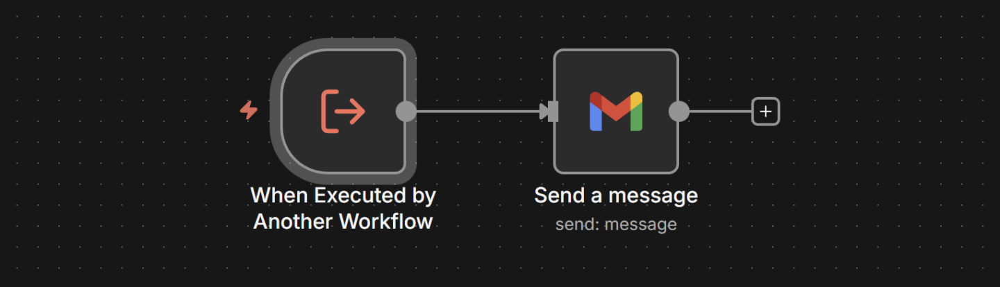

1. **Nuevo Workflow:** Crea uno nuevo y llámalo 3.b Sub-flujo "El Mensajero".
2. **El Trigger:** - Busca el nodo **Execute Workflow Trigger**. 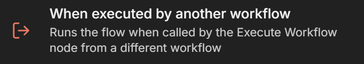
- **Configuración:** En "Input Data Mode" elige Define using fields below. 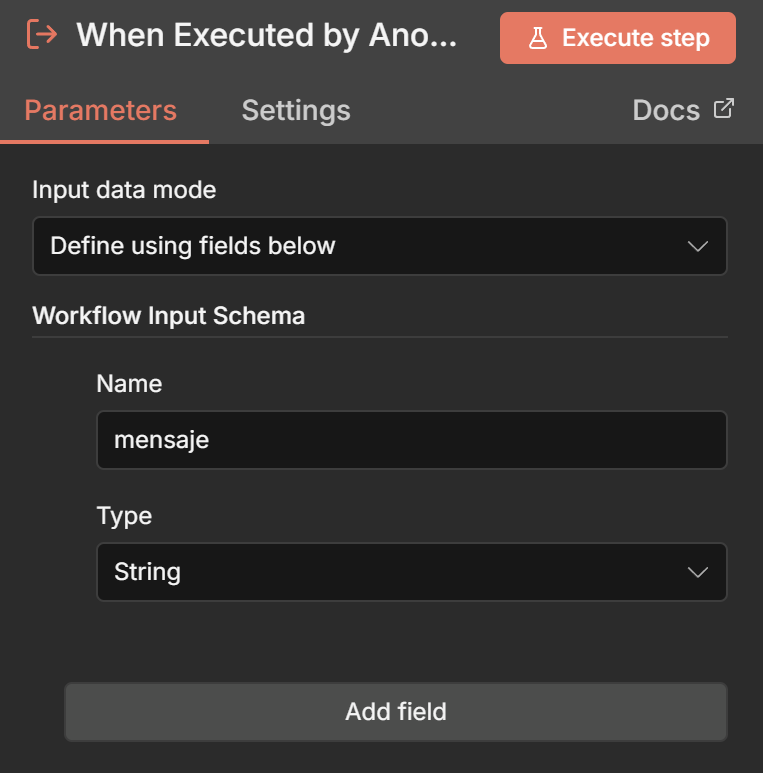
- **Campos:** Agrega un campo nuevo, nombre mensaje, tipo String.
- *(Esto crea la "puerta de entrada" para recibir el texto).*
3. **La Acción (Gmail Send):** - Agrega un nodo **Gmail** (o Send Email). 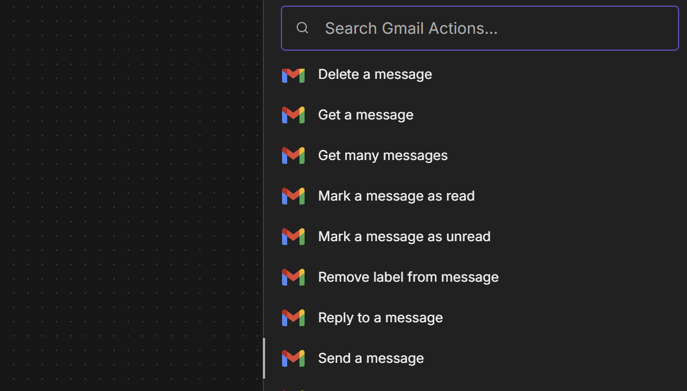
- **Acción:** Send.
- **Message:** Aquí no escribas texto fijo. Arrastra la variable mensaje desde el input del trigger (se verá algo como {{ $json.mensaje }}). 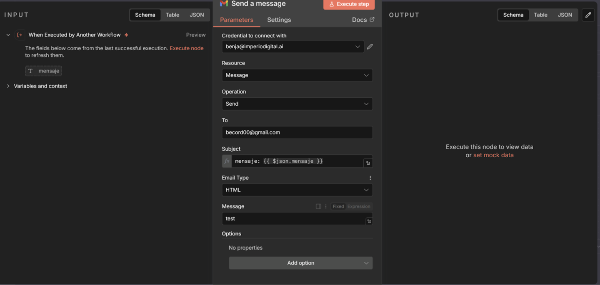
4. **Guardar:** Dale a Save y **actívalo** (switch arriba a la derecha).

#### **Paso B: Crear el Flujo Principal ("El Jefe")**

Este flujo escucha, piensa y da la orden.

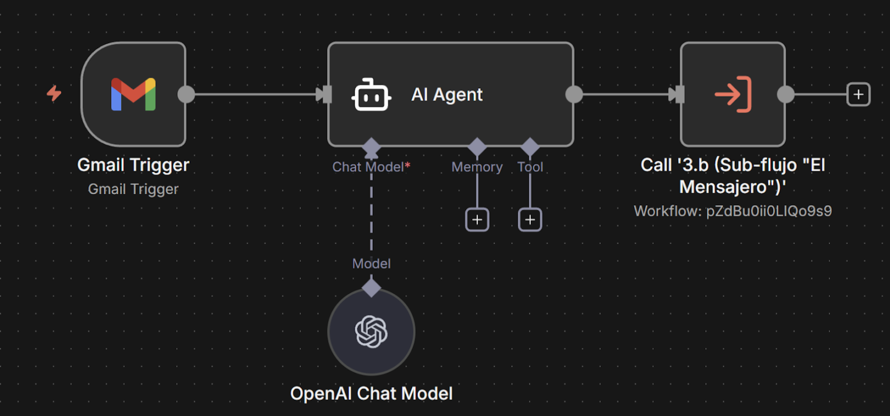

1. **Nuevo Workflow:** Crea uno nuevo y llámalo 3.a Execute Workflow ("El Jefe").
2. **El Trigger (Oído):** - Nodo **Gmail Trigger**. 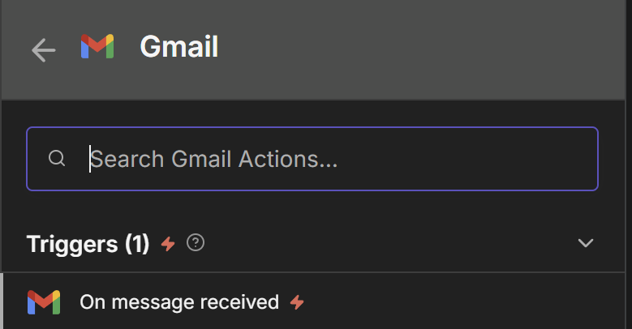
- Filtra para que detecte correos específicos (ej. from:[becord00@gmail.com](mailto:becord00@gmail.com)). 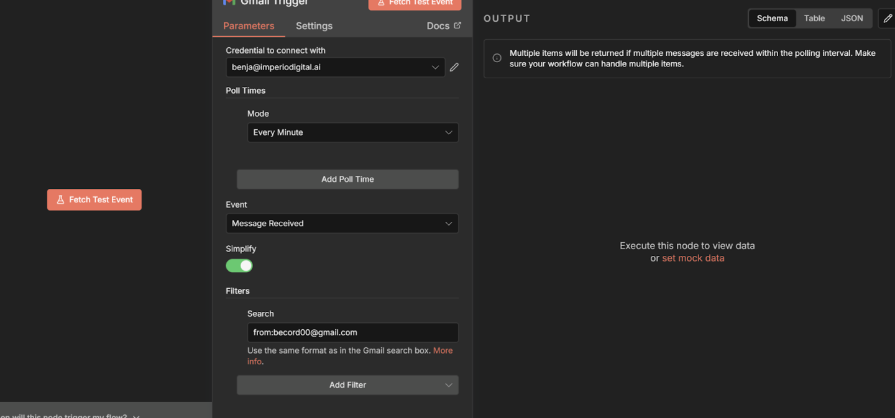
3. **El Cerebro (AI Agent):** - Conecta tu nodo de **AI Agent** + **OpenAI Model**. 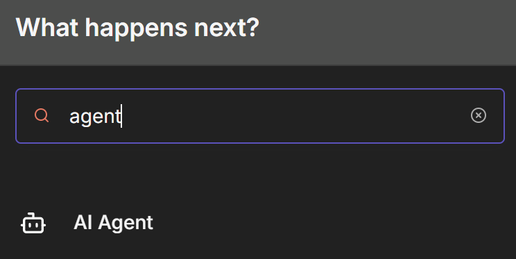
- **Prompt:** "Redacta una respuesta amable y breve para este correo: {{ $json.snippet }}". 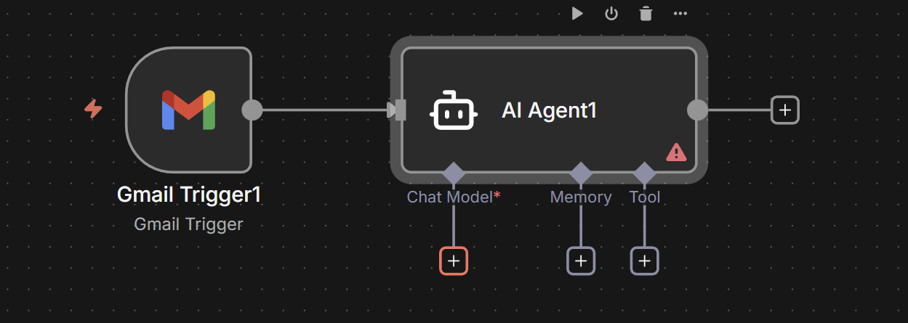 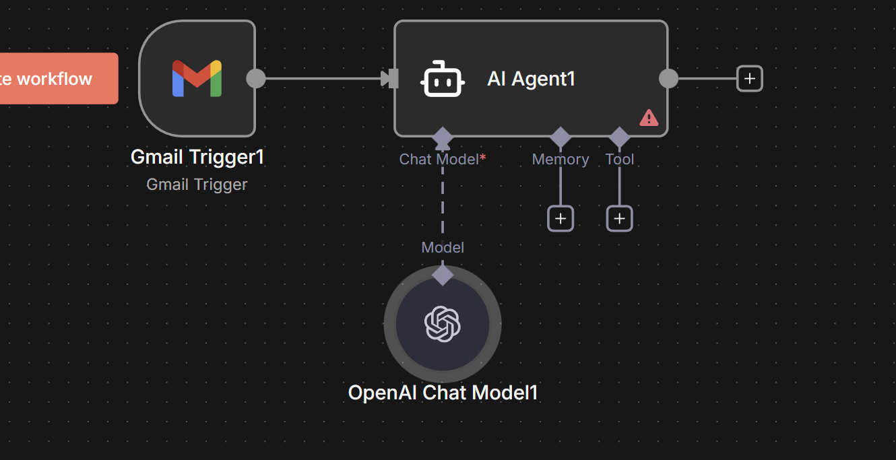
4. **La Orden (Execute Workflow):** - Agrega el nodo **Execute Sub Workflow**. 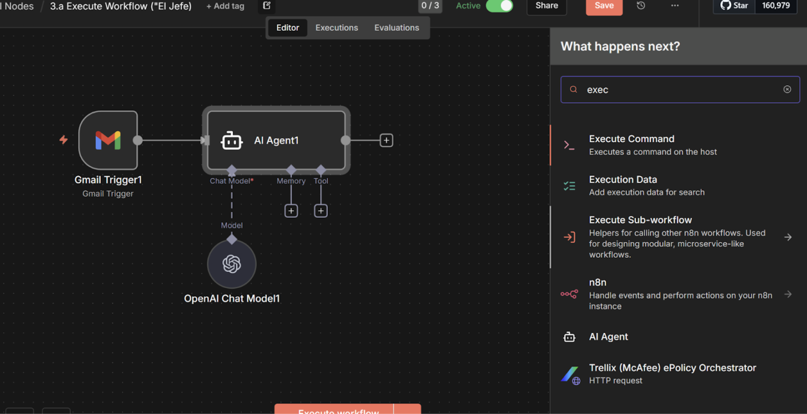
- **Source:** Database.
- **Workflow:** Selecciona de la lista a 3.b Sub-flujo "El Mensajero". 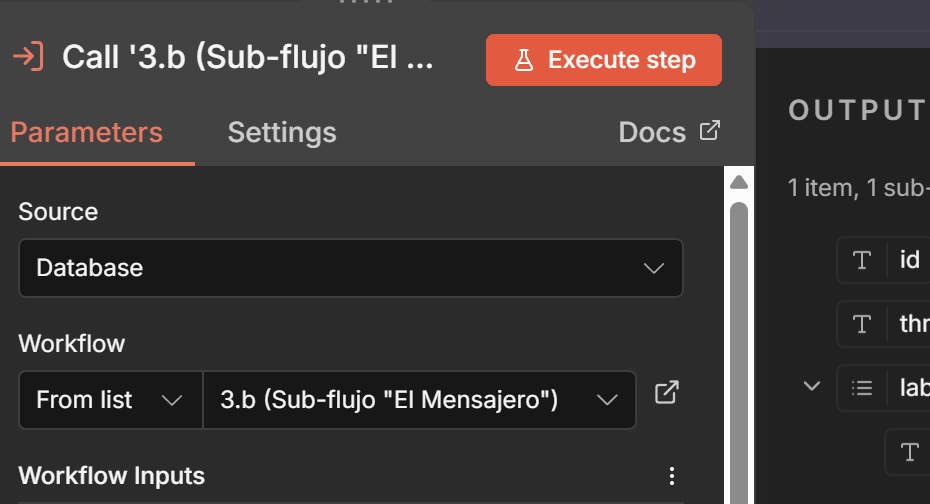
- **Workflow Input:** Selecciona Mensaje. (si no te aparece el mensaje tienes que darle a “Execute Workflow” una vez) 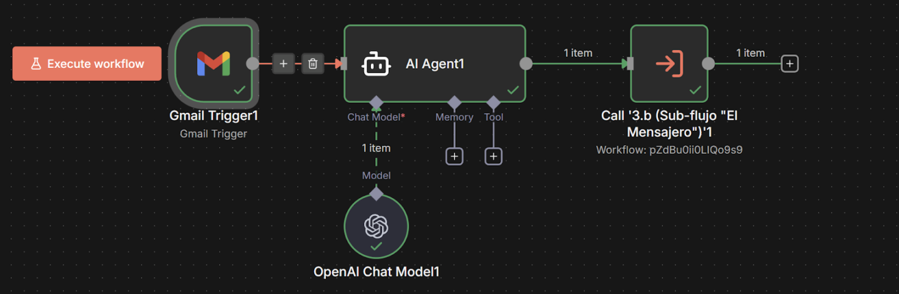
- **Mapeo:** Verás que aparece el campo mensaje que creaste en el otro flujo. 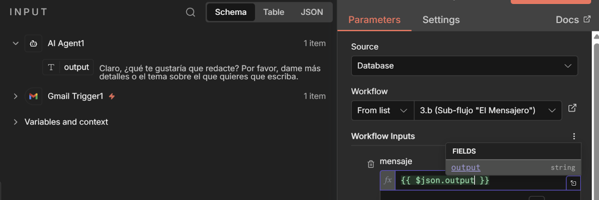
- **Valor:** Arrastra aquí el **Output** (la respuesta generada) del nodo de IA Agent (ej. {{ $json.output }}).

---

### **3. Resultado Final**

Cuando llegue un correo:

1. **El Jefe** lo lee y la IA escribe el borrador. 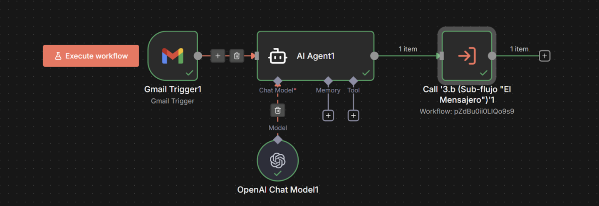
2. El nodo **Execute Workflow** toma ese borrador y se lo pasa "en mano" al otro flujo. 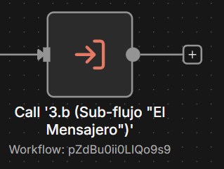

1. **El Mensajero** despierta, recibe el texto y lo envía al destinatario final. 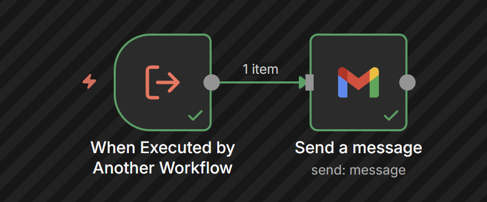

### **4. Criterio (Por qué usarlo)**

Esta estructura es profesional porque **desacopla** la lógica.

- Si falla el envío de correos, no pierdes la lógica de la IA.
- Puedes reutilizar al "Mensajero" en 10 automatizaciones distintas (Ventas, Soporte, Reclamos) sin configurar Gmail 10 veces.

## 🎙️ Transcripción

Ok. Otra automatización que haja de respecto a los disparadores super, super potente y quería servir bastante en tu 80, es esta que está viendo acá. Esto se conoce como los super workflows o los disparadores de super workflows. En español y bastante sencillo es que yo puedo ejecutar un escenario de N8N o un flujo de trabajo desde otro escenario. Esto es muy potente porque si de esta manera evitamos tener automatizaciones extremadamente largas y pasamos a tener pequeñas acciones o pequeños trabajadores que pueden hacer la tarea por nosotros. Para este sencillo ejemplo, te voy a mostrar esta que está, acá tenemos la automatización padre que es el jefe que le gusta aquí arriba y tenemos la automatización hija que tendría siendo el mensajero por ponerlo en términos bastante generales. El padre puede llamar a ejecutar ciertas automatizaciones así como se llaman ejecutan herramientas nosotros podemos hacer lo mismo con este que está acá con este módulo o novo que está acá y va a ejecutar esta automatización de acá. ¿Por qué es importante esto? Porque yo puedo crear, por ejemplo, no sé, solamente una automatización que sea como el creador de imágenes definitivo o el enviador de correos definitivo y así no tengo que replicar después todos estos pasos en las otras automatizaciones. Supongamos que a mí me gusta enviar correos con mezcilo entonces necesito usar un prompt siempre y evito así ejecutar y tener que hacer todo esto en el escenario cada vez que arme un flujo y lo puedo hacer de esta manera. Dos cosas entonces, primero el escenario Padre y segundo el escenario Hijo. El escenario Padre va a ejecutar el sub wordflow que es el Hijo. Para este caso, este es solamente enviar el correo en específico. Supongamos que tenemos el trigger del Gmail, justamente acá, este recibe y envía una redacta, una respuesta usando esto y lo manda la información de un escenario a otro. Supongamos que le doy a correr, ya te va a mostrar paso a paso, le doy a correr, aquí recibimos el trigger, aquí le dimos, creamos un mensaje breve explicando que hay que contestar urgente a paq y tu output será solamente el output, es decir, el barrafo que vamos a enviar y en este caso el enviar el correo que se ejecutó, si es que vemos acá, ahora sí voy a volver al mensajero, si es que vemos acá las ejecuciónes vamos a ver que esto acaba de hacerse recién, se ejecutó y se envió el correo, aquí voy a modificar, creamos un break explicando que hay que contestar la urgente A, lo voy a decir porque me creo también el asunto, lo voy a decir, Dotwood será solamente el output de el texto, es decir, del cuerpo, el mensaje de texto, nada más, listo para enviar, crea un parrofo, aquí lo va a poner, solo el cuerpo en texto, nada más, ok, y ahora si es que lo que votamos una vez más, ahora sí, con el total sum, ahora estás ultratar de guadón, ya perfecto, ahora sí, le voy a aguardar esto. Entonces ahora si es que le doy ejecutar una vez, podemos ver que va a ejecutarse este otro escenario que aparece acá, ahí está, se ejecuto y recibimos el mensaje, recibimos el mensaje, vamos a hacerlo de cero, para este caso, nos vamos a ir al editor, recordemos, este es el hijo, primero crearemos el hijo, cuando lo ejecute otro workflow este es el trigger, ya que perdemos que ahora estamos viendo los triggers, cuando lo ejecute este trigger en específico, vamos a recibir, no sé por qué tipo de data vamos a recibir, para este caso vamos a recibir cuerpo mensaje, y vamos a ejecutar y vamos a ver que el cuerpo mensaje está acá, y que es lo que le vamos a mandar después a la persona, el cuerpo del mensaje vamos acá vamos a enviar un correo aquí y vamos a mandar el cuerpo del mensaje aquí se lo vamos a mandar bueno se lo vamos a mandar a uno de estos correos ok que le vamos a mandar aquí iría el asunto simplemente lo hago entonces ahora vamos a darle a guardar y esto es importante tiene que estar publicado, el escenario hijo tiene que estar publicado en este caso, después nos vamos a ir al padre y aquí tenemos un Gmail de Trigger que voy a hacer cualquier tipo de trigger en específico porque recordemos que ahora lo que estamos viendo es este trigger que está acá, que es cuando se ejecuta otro escenario y vamos a enviar un correo, vamos a hacer un trigger manual simplemente o mejor vamos a hacerlo con esto, vamos a hacer un trigger del decorreo, cuando recibamos un correo específico de quién, de plom vc00, uno de mis correos gmail.com, ahora sí, cuando recibamos uno, perdón, ahora sí, cuando recibamos uno de estos correos, vamos a tener que responderlo, pero que vamos a responder, bueno vamos a notificar le alguien que tiene que responderlo, supongamos, entonces para eso vamos a usar lea etn, que ya vamos a profundizar un poco más en lea etn, dentro de estos moulos, vamos a elegir acá, define below y le vamos a decir, redactame un output de texto para el siguiente correo. el correo que recibimos es conectate al zoom, ¿verdad? y el cuerpo que recibimos es este, estás ultratarte. Quiero que sea solo el output de texto del cuerpo, nada más listo para Ok, ahí podríamos pedirle si quisieramos un formato HTML, en fin, no es el punto del video. Si la vamos a ejecutar, vamos a ver que no sea poder porque no tenemos ningún modelo conectado, pero previamente ya vimos que podíamos conectar el modelo de OpenRouter, que nos permite conectar los distintos modelos que queramos, GPT4, podemos alama, podemos usar mistral, podemos usar cool, los de Gemini, a mí me gusta en lo personal los modelos Flash, Gemini para este respuesta el 4.1 también funciona bastante bien pero creo que funciona ok y qué es lo que vamos a hacer y esta es la parte importante bueno recortemos para testearse funciona vamos a darle ejecutar oops en esta cuenta no tengo conectado lo esto ahí sí en esta otra cuenta así vamos a darle ejecutar ok y una vez que lo ejecutemos debería darnos la respuesta perfecto y esta es la importante. Una vez que llegamos acá vamos a tener que hacer el ejecutar un sub workflow, esta parte es muy importante, ejecutar sub workflow. ¿Cuál vamos a ejecutar? Bueno, vamos a ejecutar el subflujo, el mensajero, es decir, el que acá vamos de crear acá. ¿Cuál es el cuerpo? Porque recuerda que aquí cuando ejecutamos, esto de acá, vamos a entrar al editor, tenemos un cuerpo en específico que es el cuerpo del mensaje acá, que ya podemos ver, si es que la abrimos acá tenemos el cuerpo del mensaje, si es que la agregásemos algo más como el suponte du el asunto del mensaje y le damos a guardar y le damos a publicar acá cuando abramos esto y lo volvamos a conectar, es decir, su workflow nos va a pedir estas dos cosas, nos va a pedir directamente en el workflow mensajero, nos va a pedir el cuerpo y el asunto, esta es la información simplemente que queremos enviar, para este caso solo queremos mandar el cuerpo, el cuerpo va a ser este que está acá, simplemente y vamos a darle a guardar y ejecutar una vez. Ahora sí, si es que vemos esto, vamos a irnos a las ejecuciones en específico, porque nos dio un error, veamos el error problema de nuevo la cuenta que tenía conectada, como conecté la cuenta antes para el tutorial, se me olvida que esta cuenta no queda conectada, ahora sí, guardad y publicar. Si es que le doy ahora a ejecutar, ahora sí, debería funcionar, está ejecutando, va a mandar solamente el cuerpo, no el mensaje, esta parte es importante, no va a mandar el mensaje porque el mensaje o el asunto mejor dicho, no se lo mandamos pero sí el cuerpo del mensaje, aquí vamos a ver la ejecución en la especifica y podemos ver que no llevo asunto pero si el cuerpo conecte del sumo ahora estás ultra tarde. Supongamos que ahora también queremos mandar uno de estos mensajes en específico podríamos generar más de un output con él y hay agent, pero en fin creo que queda bastante claro la información en este sentido que queremos mandar. Supongamos que queremos contestarle a la persona, ¿verdad? Podemos mandar el cuerpo del email. En ejecuta este otro escenario. Esto es super, super útil. Yo tengo escenario, por ejemplo, hechos especialmente para sacar imágenes de mí mismo. Entonces, si no tengo que volver a conectar todos, sino que ejecuto ese escenario en especifico. También podemos ejecutar, ya vamos a entrar un poco más a detalle en esto, pero podemos ejecutar los distintos escenarios con el call in hidden work flow de acá. Entonces, aquí es llama este escenario cuando quieras mandar un correo, esto ya estamos usando inteligencia artificial, pero no vamos a entrar todavía, a inteligencia artificial, porque primero me interesa que aprendamos y entendamos la lógica, ok, esto es muy importante porque si con inteligencia artificial podemos resolver gran parte de los casos, pero no de la mejor manera, ni entender cómo funciona todo esto, así que bueno, espero que te haya ahí has entendido este nuevo y esos son los triggers, los tipos de triggers que vamos teniendo. Recordemos, tenemos los de evento, tenemos los de schedule, tenemos los que ejecutan otros workflows y también tenemos los webcooks.
