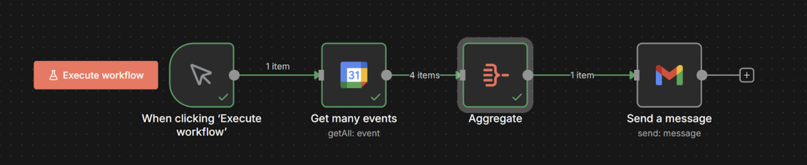
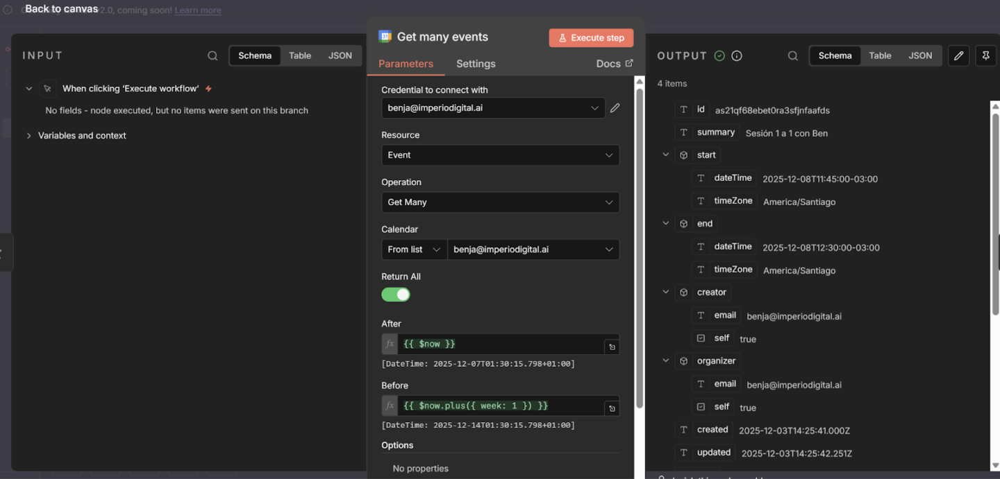
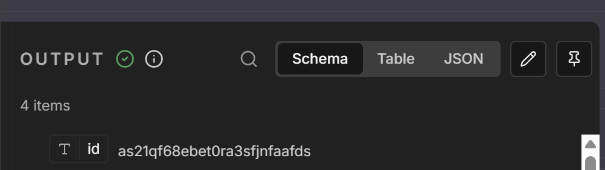
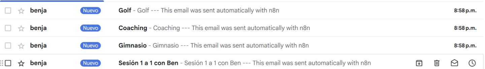
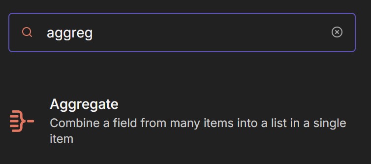
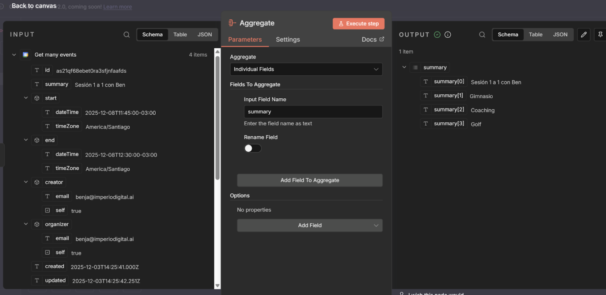
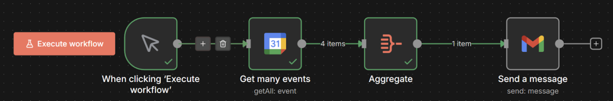
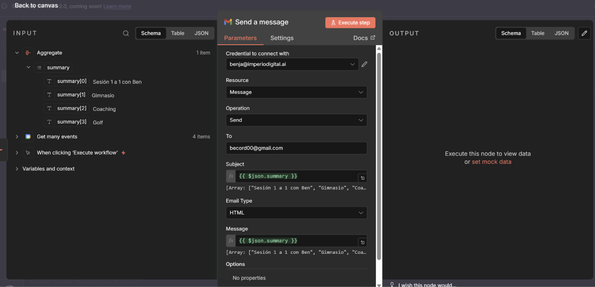
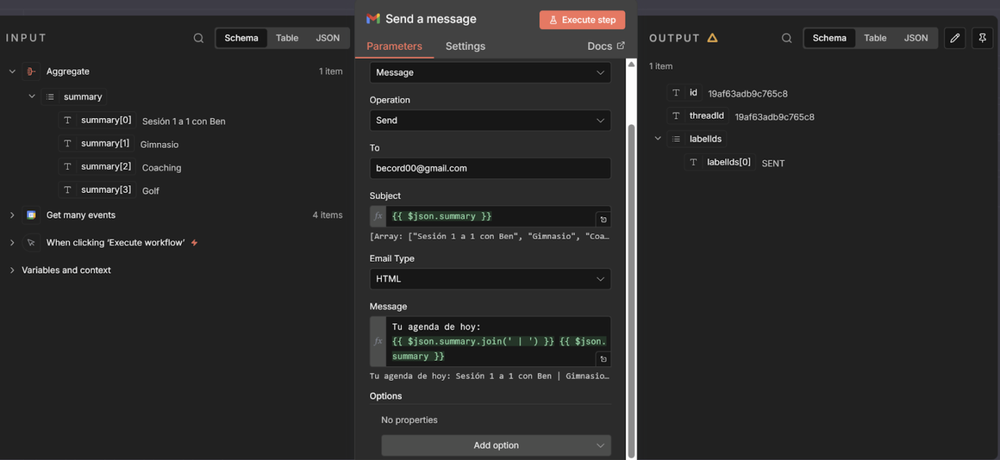

# Nodo 5: Aggregate (Agrupar/Empaquetar)

> Ruta: n8n Desde 0 › Nodo 5: Aggregate (Agrupar/Empaquetar)

**🎬 Vídeo (7.2 min):** https://www.loom.com/share/318ce960557e470e9a9f5b350d4acd7d

**📎 Recursos:**
- 5. Aggregate - Lista Eventos

---

**El Concepto:** "De muchos a uno". Es exactamente lo contrario al anterior. Es el equivalente al **Array Aggregator** o **Text Aggregator** de Make. Tomas varios ítems sueltos (filas, productos, correos, eventos) y los fusionas en un solo paquete para procesarlos juntos.

### **1. La Situación (Tu Caso Real)**

- **Get Eventos:** Buscas en tu Google Calendar los eventos del día. 
- **El Dato:** Encuentras 4 cosas: *"Sesión 1 a 1", "Gimnasio", "Coaching", "Golf"*. 
- **El Problema:** Para n8n, estos son **4 ítems separados**. Si conectas el Gmail directo, recibirás 4 correos distintos. Eso es spam para ti mismo. 
- **La Solución:** Usas **Aggregate** para meter esas 4 reuniones en una sola lista y enviar **UN solo correo** que diga: *"Aquí está tu agenda completa: Sesión, Gimnasio, Coaching, Golf"*.

---

### **2. Paso a Paso: Cómo construirlo**

#### **Paso A: Obtener los datos (Google Calendar)**

1. Usas el nodo **Google Calendar**. 
2. Operación: Get Many.
3. **Resultado:** Al probarlo, ves que salen **4 Items** (globos verdes). 

#### **Paso B: Agrupar (El Embudo)**

Aquí es donde ocurre la magia.

1. Agrega el nodo **Aggregate** después del calendario. 
2. **Aggregate:** Selecciona Individual Fields (o Specific Fields). - *Por qué:* Porque no quieres toda la basura técnica de Google (IDs, links, zonas horarias), solo quieres los nombres de los eventos.
3. **Fields to Aggregate:** - **Input Field Name:** Escribe summary (que es como Google llama al título del evento).
- *(Opcional)* Puedes cambiarle el nombre de salida, pero dejémoslo en summary. 
4. Dale a **"Execute Step"**.

#### **Paso C: El Resultado**

Mira tu Output (como en tu foto):

- **Antes:** 4 ítems sueltos.
- **Ahora:** **1 solo ítem**.
- **El contenido:** Una lista (Array) que se ve así: summary: ["Sesión 1 a 1 con Ben", "Gimnasio", "Coaching", "Golf"] 

#### **Paso D: Enviar el Resumen (Gmail)**

Conecta el nodo **Gmail**.

En el **Body** (cuerpo del mensaje), selecciona el campo summary.

**Truco Pro (Formato):** Como summary ahora es una lista, n8n la escribirá separada por comas. Si quieres que se vea mejor, activa el modo expresión y usa .join:  
JavaScript

- Tu agenda de hoy:
- {{ $json.summary.join(' | ') }}  
  
    
*Resultado visual:* "Sesión 1 a 1 | Gimnasio | Coaching | Golf".

---

### **3. Criterio (Por qué usarlo)**

- **Anti-Spam:** Fundamental para notificaciones. Nadie quiere 10 mensajes si puede leer 1 resumen.
- **Eficiencia:** Si usas APIs que cobran por llamada (como OpenAI o Twilio), procesar en lote (batch) te ahorra dinero.
- **Orden:** Transformas datos brutos en información digerida lista para tomar decisiones.

## 🎙️ Transcripción

me acabo de dar cuenta que no se grabo el video así que vamos a grabarlo de nuevo. Supongamos que ahora vamos a verificar la disponibilidad de uno de nuestros calendarios. Lo que vamos a hacer es, en este caso, queremos ver todo lo que se nos viene el día de mañana en específico y queremos que nos notifique de manera diaria todas las mañanas. Probablemente vimos el módulo de Splittout. Ahora vamos a ver, el opuesto que es el Aggregate. Si es que fuesemos a ejecutar solamente este y le vamos a ejecutar el workflow, vamos a ver los eventos que nos va a dar esta función extrae los eventos de un calendario específico y podemos ver que tenemos el primer evento que empieza en esta fecha y es el evento en específico de excepción de comandantes, pero tenemos tres items distintos. Si es que fuesemos y voy a eliminar esto acá, si es que fuesemos a enviar un correo electrónico y dijésemos algo por el estilo de esta es tu agenda y después nos vamos acá y en la expresión ponemos el nombre de la agenda, vamos a darnos cuenta de que nos va a mandar tres correos acá porque tenemos el primero que extrae tres eventos y nos manda tres correos. Si le doy ejecutar, vamos a ver correo 1, correo 2 y correo 3, se escarguimos acá, vamos a tener el spam en específico esta agenda sesión de comandantes, esta agenda reunión con clientes y en fin. No queremos que va a ser eso porque no queremos trabajarlos así, queremos trabajarlos todos como un grupo y ahí es donde entra el módulo o el nodo de aggregate, aggregate lo que hace es estos items que están acá que nos acaban de entregar, que son estos visualizados aquí en tabla, se son de guandantes, gimnasio y reunión de clientes, que son los mismos eventos que tengo aquí en el calendario para mañana, no los va a agregar y nos los va a juntar todo en un mismo correo esto lo vamos a hacer así vamos a ver cómo funcionaría todos vamos a ver rápidamente no más cómo se vería esta agenda y voy a pegarle ahora lo mismo antes voy a ejecutar acá y vamos a ver qué esta si es la agenda es específica y aquí si es que nos vamos a recibir, esta es la agenda con cada uno de los puntos realmente genial general, así que ahora vamos a ver cómo lo crearíamos porque antes vimos el módulo de split out donde separábamos uno de estos en varios y ahora vamos a ver el que los directamente juntan, ok, vamos a crearlo desde cero, lo primero que vamos a hacer es quiero que me notifique cada día a las ocho y cuarto cuando me estoy tomando mi café, para ello nos vamos a ir aquí donde sale el tipo de trigger que ya lo vimos previamente, que es el skill trigger, he dado el disparador de alarma y quiero que me diga a las, no sé, seis, no, aquí en el caño, no me levanto tan temprano, seis, pongamos le ocho, ocho y cuarto, ok, a las ocho y cuarto quiero que se ejecute esta acción. Vamos a tirarla acá y que es lo que quiero que haga, quiero que extraiga los eventos de un periodo de tiempo en específico, para esto vamos a al calendar cuya conexión tenemos que hacer previamente con Google y vamos a conseguir la disponibilidad en un calendario en específico. De cuando? Bueno, quiero conseguir hoy día a mañana, supongamos. Ya, entonces quiero hacerlo así. Vamos a ejecutar el step y me da a decir, no sé lección del calendario. Ahora sí, vamos a ejecutar el step y aquí vamos a ver que no a perdón, no es el módulo de get availability, esto es si es que estás disponible en este tiempo, lo que queremos hacer es extraer, mala mía, extraer los eventos de un día en específico y para eso es get many events. Ahora sí, mi error. Vamos a elegir el calendario y quiero buscar los eventos de acá. Ahora sí, vamos a hacerlo con un día y vamos a ver que me va a extraer los eventos que hay mañana, quiero saber cuáles son los eventos de mañana, ok? Ahora sí que sí, aquí podemos poner el límite de cuántos eventos quiero extraer, etcétera y podemos ver que son tres items porque me trajo tres eventos que voy a tener el día martes vamos a irnos acá vamos a irnos a aggregate y ahora sí vamos a poner un fil individual como le vamos a poner bueno partamos acá ejecutando esta anterior lo voy a correr una vez más y como le vamos a poner le vamos a poner el summary ok y ahora si es que los ejecutamos y vamos acá vamos a tener sesión de comandantes gimnasio y reunión con clientes Ok, ahora sí podemos irnos acá y podemos irnos al mail, vamos a agregar un nuevo mail, vamos a enviar un correo, aquí se lo vamos a mandar, a una de mis cuentas, y le vamos a decir, aquí tienes tu agenda, casi de vuelta el café, vamos a ir al mensaje, le vamos a mandar la agenda en específico, y ahora sí, si es que ejecutamos esta automatización, vamos a ver que, oops, tengo que conectar la otra cuenta y lo voy a poner aquí, tu agenda, ahora sí, en donde conecté la cuenta todavía me sigue basando eso, que una cuenta que ya eliminé, pero en fin, nos vamos a ir acá recibimos y vamos a ver qué recibimos el correo de tu agenda, está aquí, vamos a abrir el correo, no me ha llegado, ah me digo que era el correo, de corte cero, cero ahora sí. Vamos a ver qué deberíamos recibir este correo ahora sí. Aquí tienes tu agenda. Se siendo comandantes, gimnasio, reunión, concliente. Les voy a dar un pequeño tip también, si es que no quieren verlo separado con coma, puedes apretar acá, puedes irte a punto, pues join esto a ver los cortetes, que son, como lo hago en este teclado, ahí sí. Ahora es estas comillas y poner lo que quieres que se vare. para este caso quiero hacer espacio, esto espacio. Entonces ahora es cada vez que te Junte en vez de las comillas, o perdón en vez de la coma te va a juntar con esto, ni si ejecutas este paso, vas a ver que te recibirlo así, gimnasio coma reunión coma clientes sin ningún espacio, vas a recibirlo así, gimnasio espacio reunión clientes, espacio sesión de comandantes, ok? Si es que no quieres hacerlo así, puedes pedir la gmt como cómo puedo arreglar esta expresión para que no me la Junte con una coma sino con esto pero es un pequeño tip que a mí me gusta porque se visualiza mejor ok ahora sí ya sabes cómo juntar distintos eventos en un mismo lugar con la función de el agreguita es realmente útil recordemos que es el opuesto de el split out el split out estamos separando aquí estamos juntando entonces esencial que lo conozcamos para el manejo de datos sobre todo si es que fuese tenemos a tener una inteligencia artificial, por ejemplo acá, no queremos ejecutarlo tres veces para cada uno de los eventos, queremos que se ejecute una vez para los tres eventos. Ahora sí, también recuerden que le voy a subir estas plantillas en cada uno de los no, voy a eliminar esta, no vamos a quedar con la nueva y vamos al siguiente, no.
