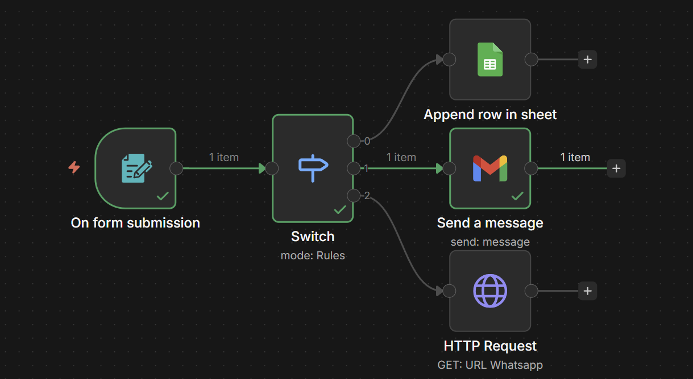
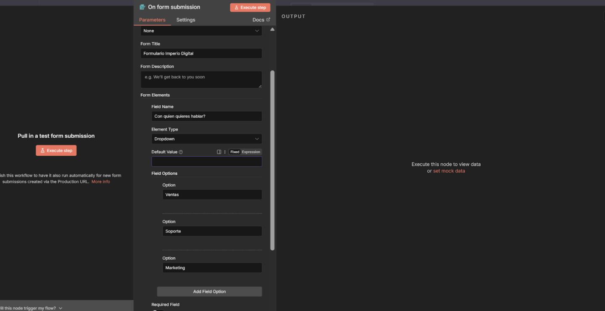
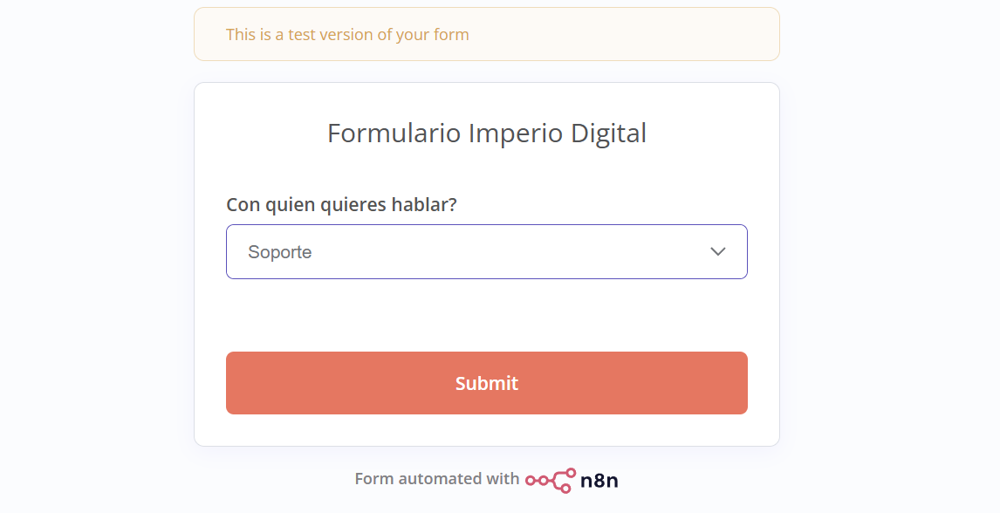
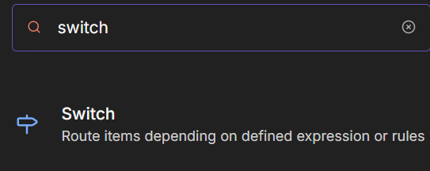
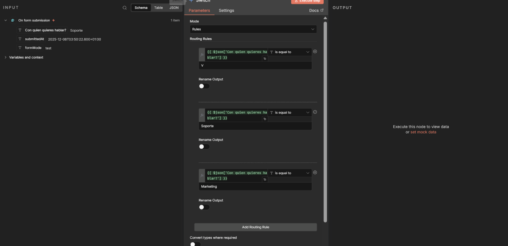
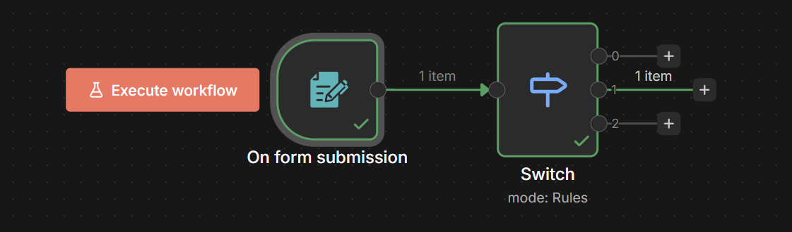
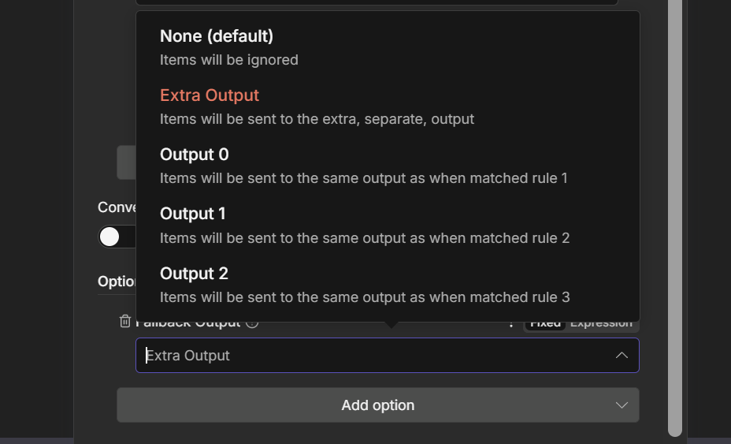

# Nodo 8: Switch (El Distribuidor)

> Ruta: n8n Desde 0 › Nodo 8: Switch (El Distribuidor)

**📎 Recursos:**
- 8. Switch - Redirección a área

---

**El Concepto:** "La Recepcionista". El cliente llega al mesón y dice qué necesita. La recepcionista no le dice "Sí" o "No" a diferencia del nodo “if”; le dice: *"Para Ventas piso 1, Soporte piso 2, Reclamos piso 3"*. Este nodo toma un dato y lo envía por **múltiples caminos distintos** dependiendo de qué dice ese dato.

**1. La Situación (Escenario Real)**

- **La Entrada:** Tienes el mismo formulario de contacto en n8n anterior, pero ahora agregaste una pregunta clave: *"¿Con qué departamento quieres hablar?"*.
- **Las Opciones (Dropdown):** 1. Ventas
2. Soporte
3. Marketing
- **La Misión:** Quieres que el mensaje llegue al canal de Slack correcto automáticamente, sin que tú tengas que leerlo y reenviarlo.

---

### **2. Paso a Paso: Cómo construirlo**

#### **Paso A: El Formulario (El Menú)**

1. Abre tu nodo **n8n Form Trigger**.
2. Agrega un campo nuevo tipo **Dropdown** (Selección múltiple). - **Label:** Departamento.
- **Options:** Agrega tres opciones: Ventas, Soporte, Marketing. 
3. **Testear:** - Dale a "Test Step".
- Abre el link del formulario, selecciona **"Soporte"** y envíalo. 
- Verifica que n8n recibió el dato.

#### **Paso B: Configurar el Switch (Las Reglas)**

Aquí es donde le enseñas al robot a dirigir el tráfico.

1. Conecta el nodo **Switch** al Formulario. 
2. **Mode:** Rules.
3. **Data Type:** String (Texto).
4. **Value 1 (¿Qué evaluamos?):** Arrastra el campo Departamento desde el nodo anterior. 
5. **Routing Rules (Creando los caminos):** - **Regla 0 (Ventas):** - Operator: Equal (Igual a).
- Value 2: Ventas.
- *(Esto crea la Salida 0)*.
- **Regla 1 (Soporte):** - Dale a "Add Routing Rule".
- Operator: Equal.
- Value 2: Soporte.
- *(Esto crea la Salida 1)*.
- **Regla 2 (Marketing):** - Dale a "Add Routing Rule".
- Operator: Equal.
- Value 2: Marketing.
- *(Esto crea la Salida 2)*.

Dale a **"Test Step"**. *Como seleccionamos "Soporte" en la prueba, verás que el dato sale iluminado por la ****Salida 1**** (la del medio).*

#### **Paso C: Los Destinos**

Ahora verás 4 puntitos a la derecha del nodo (0, 1, 2 y Fallback).

1. **Salida 0 (Ventas):** registralo en sheets
2. **Salida 1 (Soporte):** Conecta un nodo (ej. Gmail) que cree un ticket técnico.
3. **Salida 2 (Marketing):** Conecta un http para mandar un Whatsapp. 
4. **Fallback:** (Opcional) Si alguien logra mandar una opción que no existe, saldrá por aquí. Úsalo para errores. 

---

### **3. Resultado Final**

Tienes un sistema de "Mesa de Ayuda" automatizado.

- El cliente elige su camino en el formulario.
- n8n lee la elección.
- El mensaje aterriza en el escritorio de la persona correcta al instante.

### **4. Criterio (Por qué usarlo)**

- **Orden Visual:** Si usaras el nodo *If* para esto, tendrías que preguntar: *"¿Es ventas? No. -> ¿Entonces es Soporte? No. -> ¿Entonces es..."*. Eso se ve horrible. El Switch te deja ver todas las opciones en una columna vertical limpia.
- **Escalabilidad:** Si mañana abres el departamento de "Finanzas", solo agregas una regla más al Switch y listo. Es modular.
