# Nodo 11: Loop Over Items (El Procesador de Listas)

> Ruta: n8n Desde 0 › Nodo 11: Loop Over Items (El Procesador de Listas)

**🎬 Vídeo (9.5 min):** https://www.loom.com/share/dfc3caab29c24a6f9e7c147b854f560c

**📎 Recursos:**
- 11. Loop Over Items - Mails únicos

---

El Concepto: "La Fila India". Si tienes una planilla de Google Sheets con 50 clientes y quieres mandarles un correo a todos, no puedes hacerlo todo junto en un segundo (Gmail te bloquearía por spam).

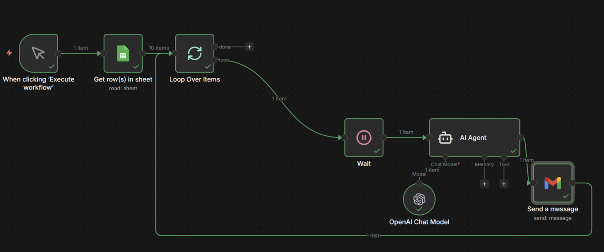

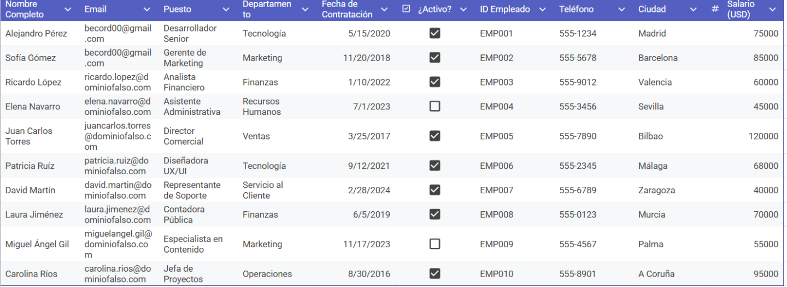

El nodo Loop toma esa lista de 50 filas y dice: "Vamos a atenderlos de a uno. Primero la fila 1, terminamos, y luego la fila 2...".

Ya no solo tienes una fila india de clientes. Ahora, antes de que salgan por la puerta (enviar el mail), los pasas por una oficina donde hay un **Escritor Experto (Tu Agente IA)** que lee sus datos y escribe una carta a mano dedicada solo para ellos.

### **1. La Situación (Escenario Real de Agencia)**

- **El Origen:** Tienes un Google Sheet llamado "Nuevos Prospectos" con dos columnas: Nombre y Email.
- **La Misión:** Quieres enviarles un correo de bienvenida personalizado a cada uno.
- **El Riesgo:** Si envías 50 correos en el mismo segundo, Google detecta comportamiento de robot y te manda a la carpeta de Spam.
- **La Solución:** Usar el Loop para enviar $\rightarrow$ esperar 5 segundos $\rightarrow$ enviar el siguiente.

---

### **2. Paso a Paso: Cómo construirlo**

#### **Paso A: Obtener la Lista (Google Sheets)**

Usemos el google Sheets de antes

1. Agrega el nodo **Google Sheets**.
2. **Operation:** Get Rows (Traer muchas filas). 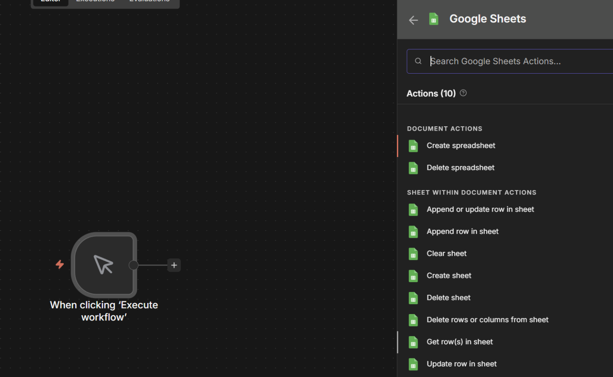
3. Selecciona tu hoja ("Nuevos Prospectos").
4. Dale a **"Test Step"**. - *Resultado:* Verás, por ejemplo, **50 globos verdes** (items). Cada uno es una fila de tu Excel. 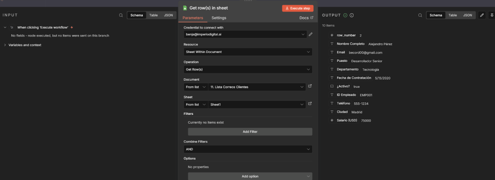

#### 

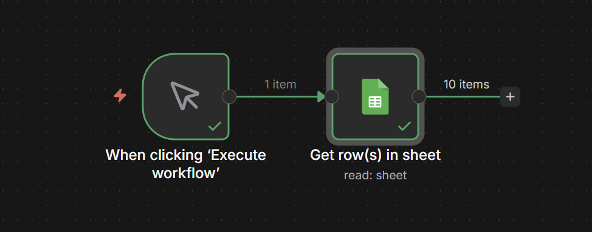

#### **Paso B: Ordenar la Fila (El Loop)**

Ahora tenemos a las 50 personas esperando.

1. Agrega el nodo **Loop Over Items** conectado al Google Sheets. 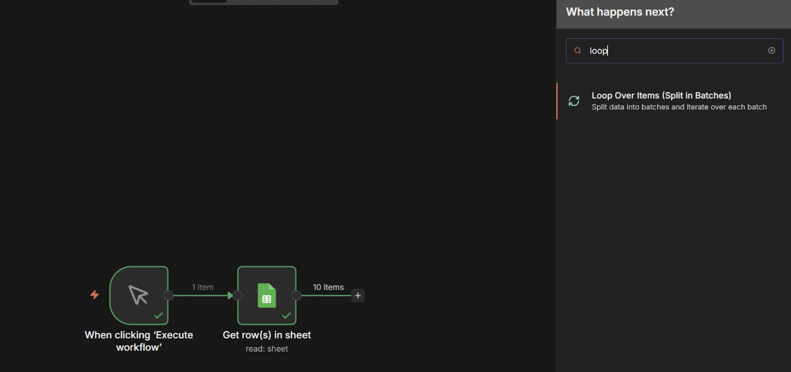
2. **Batch Size:** 1. - *(Clave: "Pasa de a 1 fila").* 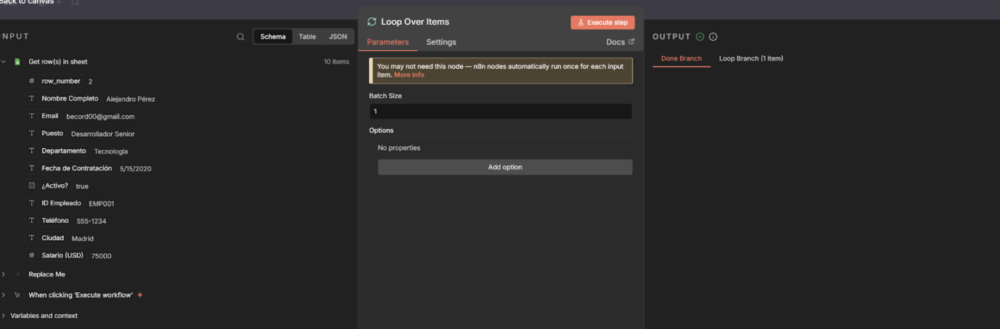
3. Dale a **"Test Step"**. - *Resultado:* El Output mostrará solo **1 ítem** (La Fila 1: "Juan Pérez"). El resto espera su turno. 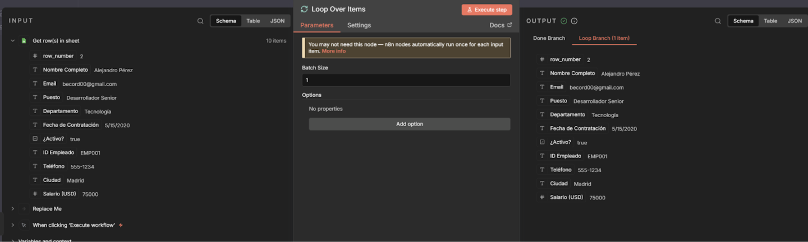

#### **Paso C: La Acción (Dentro del Bucle)**

Aquí defines qué le pasa a CADA persona de la lista. Conecta esto a la salida **"Loop"**.

1. **Nodo 1: Wait (Espera)** - Conecta un nodo **Wait** y ponle **5 segundos**. 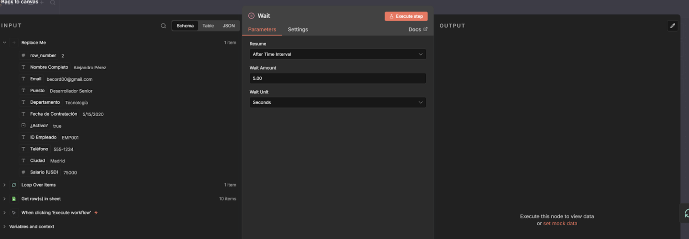
- *(Esto es higiene digital. Haces que parezca que un humano está enviando los correos, no una máquina).*
2. **Nodo 2: Gmail (El Envío)** - Conecta el Gmail después del Wait.
- **To:** Arrastra el campo Email de tu hoja.
- **Body:** "{{ $json.output }}...". Lo que generamos con el agente
- *(Nota: Como estamos dentro del Loop, $json.Nombre cambiará automáticamente en cada vuelta: primero será Juan, luego María, etc.).* 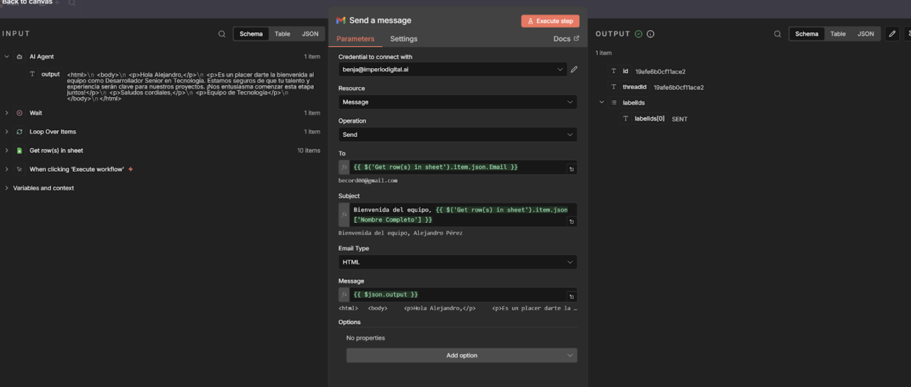

---

### **3. Resultado Final**

Al activar el flujo:

1. n8n lee las 50 filas.
2. Toma a Juan (Fila 1) $\rightarrow$ Espera 10 seg $\rightarrow$ Le manda el correo.
3. Vuelve al principio automáticamente.
4. Toma a María (Fila 2) $\rightarrow$ Espera 10 seg $\rightarrow$ Le manda el correo.
5. ... Y así hasta terminar la lista. 

**3.5 OPCIONAL Agregar un agente **  
  
Paso C: El Cerebro (AI Agent)

Aquí ocurre la magia. Conecta esto a la salida "Loop".

1. Agrega el nodo AI Agent (o Basic LLM Chain). 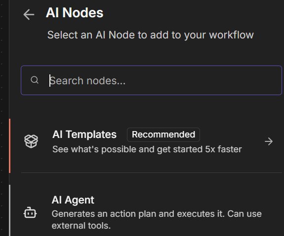
2. **Model: Conéctale un modelo rápido y barato (ej: gpt-4o-mini o gpt-3.5-turbo) usando el nodo OpenAI Chat Model. En Chat Model lo eliges. Nota, si no h as ingresado t u api key, puedes ver como hacerlo aquí:** 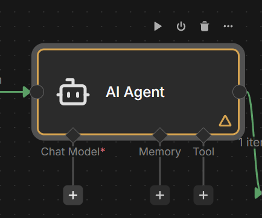 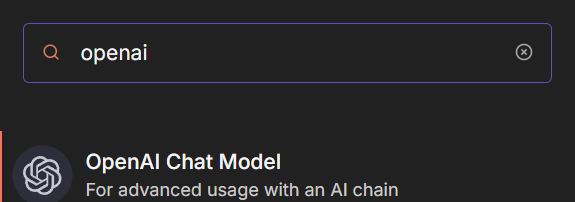 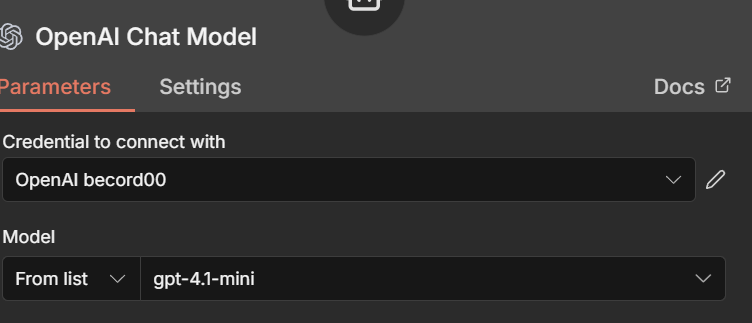
3. Prompt (El Texto): Aquí le das las instrucciones usando los datos del Loop.  
*"Actúa como un experto en ventas B2B. Redacta un correo corto y persuasivo para {{ $json.Nombre }}, que trabaja en una empresa de {{ $json.Rubro }}. El objetivo es agendar una reunión. Tono: Cercano y profesional. Máximo 50 palabras."*

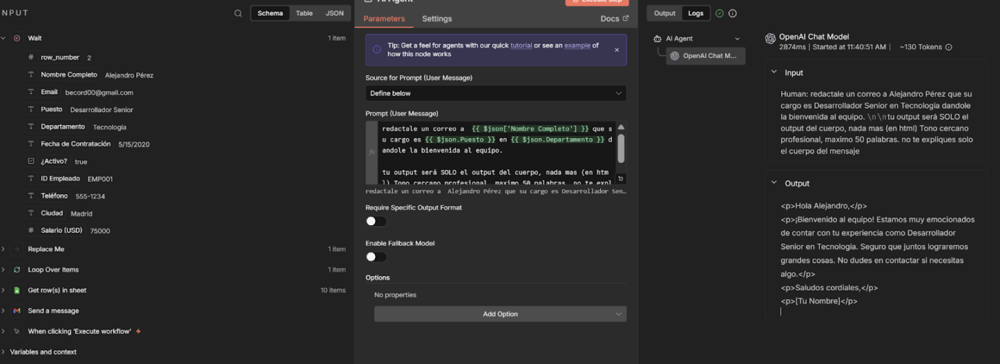

1. Dale a "Test Step". - *Resultado:* Verás que la IA genera un texto único: *"Hola Juan, sé que la gestión de inventario en una panadería es crítica..."*.

### **4. Criterio (Por qué usarlo)**

- **Entregabilidad:** Es la única forma segura de hacer email marketing masivo desde tu propio Gmail sin caer en spam.

**Personalización:** Puedes usar "Ifs" dentro del Loop. Por ejemplo: *"Si la fila dice 'Cliente VIP', mándale el correo A; si no, mándale el correo B"*. Eso es imposible en herramientas de email marketing tradicionales.

## 🎙️ Transcripción

Supongamos que tenemos una lista de clientes acá, uno de estos clientes queremos mandarle un correo electrónico, digamos que queremos reactarle un correo, con inteligencia artificial, según supuesto su departamento y según donde están ubicados. Para esto vamos a usar el loop over items. Lo que hace esto es empezar un ciclo en específico, es decir, acá, un ciclo en específico, hasta que se llega al número que nosotros queramos. Si es que abrimos el modulo justamente acá vamos a ver el patch size y una vez que se completa el patch va a pasar a la carpeta que es dan ya en este caso en específico supongamos que el dan va a ser enviar un correo de que ya está listo y va a hacer esto está listo el mensaje va a ser exactamente el lo primero que vamos a hacer por ejemplo es conseguir una lista de correos en específico, acá lo que vemos es que conseguimos 10 correos en específico, entonces acá está redactando el correo con inteligencia artificial al primero, acá de terminar, ahora se lo está redactando al segundo y va a hacer el loop después al tercero, y aquí probablemente va a tener un error porque ya no tengo más correos reales al que mandarle la información. Pero, pero aquí tenemos que, vamos a ver que se va a ejecutar 3 veces y se va a mandar el correo hasta que completemos los 10. Para fines prácticos voy a ejecutar esto, para que no me llegues spam en específico, pero así funciona. Es un loop, un finito hasta que se cumple el criterio. Supongamos que solamente quiero conseguir dos correos, o algo así, podríamos llegar y ponerle algún filtro de que sea 2 como máximo o podemos llegar acá y por finas prácticos vamos a trabajar con estos dos ya los voy a eliminar ahora y estos también los voy a eliminar este acá ok ahora sí vamos a hacerlo dos veces para que después se manden el otro correo entonces redactamos el correo esperamos de completa y una vez que se completan estos dos items, vamos directamente a pasar al tan, vamos a esperar a que base, aquí tenemos unos 10 segundos de espera, específico, se mandan los correos y después listo y el tan no funcionó porque claro no tenía explicado esto, vamos a arbarlo de cero, cuando creamos un nuevo flujo, vamos a irnos acá, agregar uno, cuando lo vamos a hacer, cuando se ejecute vanoalmente, acá, ahora sí, cuando se ejecute vanoalmente, lo que quiero hacer es extraer desde un Google Sheets, la lista de clientes, ok, get rose in sheets, desde acá vamos a elegir el documento que van a hacer la lista del correo de los clientes y lo vamos a ejecutar una vez, aquí vemos que recibimos la lista con el nombre, con el correo, etcétera, vamos a agregar ahora el módulo que vamos a cubrir que es el loop over items, el batch size es el tamaño de el batch como dice su nombre que queremos que ejecuto, o sea, cuánto se van a devolver en cada uno de los llamados, el batch size en este caso va a ser uno debería estar bien, aquí tenemos settings que son los clásicos settings de todo el resto que es como que siempre tienes que hacer el output, etcétera, en este caso lo vamos a dejar así, y si quisieramos hacer la opción de reset, es decir, que empieza de nuevo, de cada ejecución, también lo podemos hacer. Para este caso no lo vamos a hacer y mira lo interesante, porque este es uno de los pocos módulos o no dos que agregas y que se agrega más de una cosa. Entonces aquí vamos a hacer, qué es lo que quiero que hagas en específico? Bueno, quiero que mandes un correo en específico, para ello vamos a apretar el más que aparece acá y vamos a mandar el correo. Aquí le vamos a mandar el correo, bueno, en el loop over items, vamos a ver que tenemos la información, la información de el correo que tendría siendo este correo electrónico que aparece acá. Después, ¿cuál es el asunto que quiero mandarles? Vongamos que quiero mandarles de asunto oportunidad de senior marketing no tengo idea del puesto que que tenga y aquí la mensaje vi que estás metido en tecnolo en perdón acá departamento ahí sí quería saber si te interesaba tener una conversación ok ahora si va a poner la cuenta de email correspondiente y vamos a ejecutar todo esto una ejecuto dos veces, aquí en especifico, por lo que me debería haber llegado dos correos, así que me va a dar acá, vamos a ver, oportunidad gerente de marketing y oportunidad de desarrollar signo, ya, desde acá voy a eliminar esta parte que sale Replace Me y listo, aquí una muy buena práctica si vas a enviar correos, siempre pongas un nodo de wait de 5 segundos o 3 segundos da igual, pero que sea una pausa antes de enviar más de un correo. Eso es super superclay. Supongamos ahora que ya estamos pero queremos agregarle un nodo de inteligencia artificial. Vamos a agregarle el AI, vamos a poner una gente y vamos a hacerlo con en específico con el Define. Pilar, vamos a hacerle el mismo ejemplo, voy a copiar el esto, voy a pegarle acá, voy a decir, redacta un mensaje personalizado tipo Vique está metido en, etcétera. Queremos que el output sea solo texto en el cuerpo nada más. Contexto de la persona. Esuncamos acá. Esto lo voy a eliminar. Vique está metido en, querías saber, etcétera, que el álcool sea solamente es el texto en nada más el contexto de la persona es Alejandro es un desarrollador senior en el nicho de tecnología y listo entonces acá vamos a hacer eso ya vamos a profundizar un poco en el nuevo de agente de inteligencia artificial para este caso lo voy a armar simplemente vamos a conectar OpenRouter que ya lo teníamos conectado brevemente y vamos a reactarle un mensaje con el gpt4 o uno desde acá voy a eliminar esto y voy a hacer que el mensaje ahora solamente sea el output que me acaba de dar el agente entonces ejecuté nuevamente esto y aquí tenemos el mensaje aquí vamos a ver que se ve así pero si que lo mandamos como nuestra HTML lo vamos a recibir y lo vamos a recibir bastante feo me gase que me voy aquí ahora envía el correo no envía el correo porque no oportunidad de trabajo y aquí en se lo vamos a mandar a el email ahora sí vamos a ejecutar el paso y ahora vamos a ver si es que se envía debería estar ejecutando se los pasan se envió correctamente y si es que lo vemos ahora vamos a ver que está súper feo verdad y que tenemos problemas con el nombre etcétera entonces lo va a pedir acá que la output sea en esto es una muy buena práctica que la output sea en html tu output debe ser en HTML es simple, sólo con p y b, y esto se le va a poner los gatos para hacer el martaón para que sea mejor, más cool, ahora sí, vamos a ver cómo sería esto, en este caso, y vamos a correrlo una vez, vamos a ver qué pasan, en el asunto, ok, vamos a la guardar, vamos a darle a ejecutar y ahora sí vamos a ver está el loop item 1 va a esperar va a generar el correo lo envía va a esperar va a generar el correo nuevamente y lo va a enviar y aquí vamos a ver qué terminó entonces desde acá si es que entra el correo oportunidad de trabajo ola vi que quedó atento y después acá en el otro ola vi que quedó atento corto fome simple efectivo y después aquí ya podríamos seguir con la automatización, por ejemplo podríamos poner un set field, podríamos empezar a hacer esto y aquí la automatización seguiría corriendo, también funciona bastante bien para las secuencias de humanin de loop, pero eso ya es otro tema que vamos a ver un poco más adelante, entonces esta es la automatización, nuevamente esta la voy a eliminar y les voy a dejar esta automatización suya también para que puedan importarla y y vean que hay algún error o algo que hicieron distinto.
