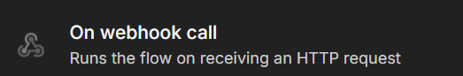
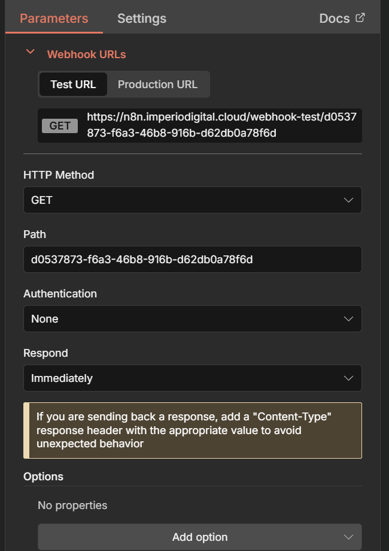
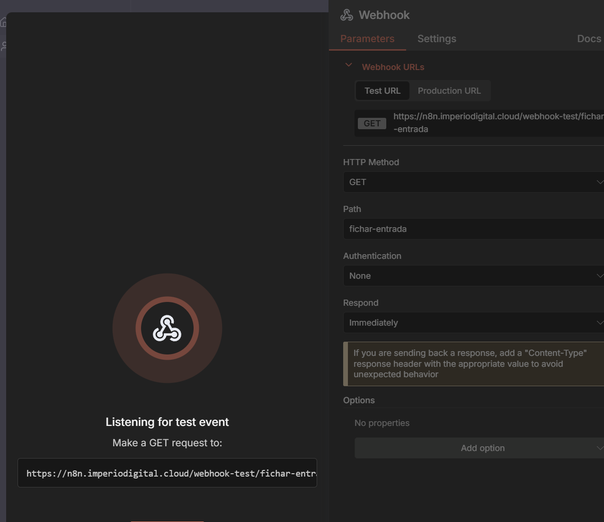
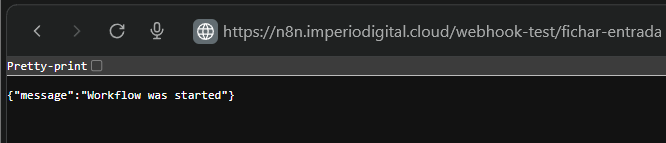
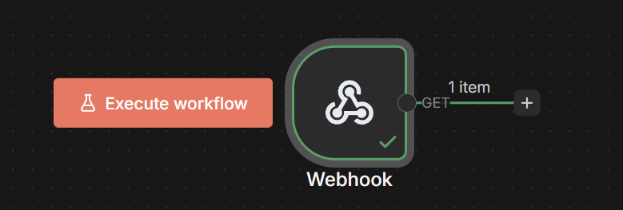
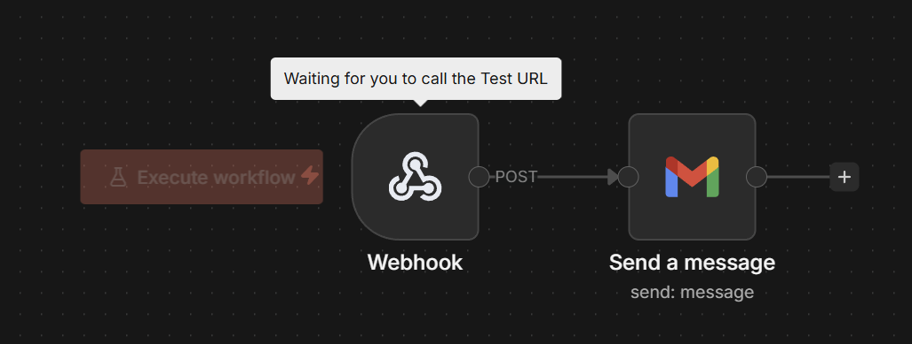
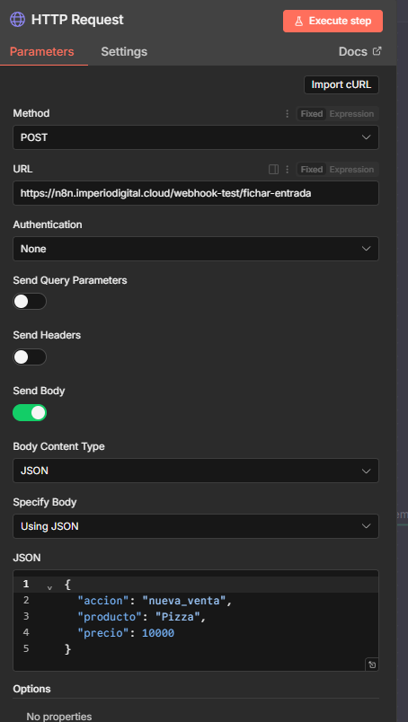
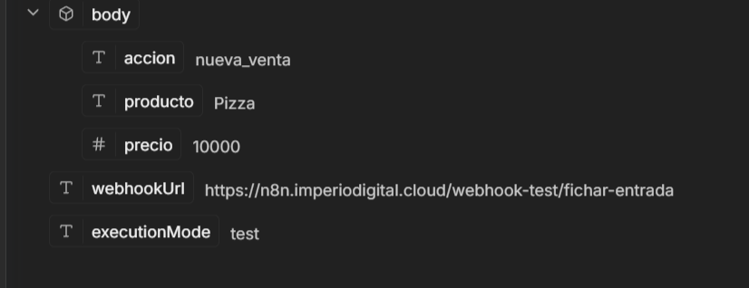

# Nodo 12: Webhook (El Timbre y el Buzón)

> Ruta: n8n Desde 0 › Nodo 12: Webhook (El Timbre y el Buzón)

**🎬 Vídeo (9.4 min):** https://www.loom.com/share/9284535b97564370a1bac6bad1d1d2ba

**📎 Recursos:**
- 12. Webhook - El Timbre

---

El Concepto: "Tu Dirección Digital".

Imagina que tu automatización vive en una casa cerrada. Para que alguien de afuera (tú mismo, un cliente o una app externa) pueda entrar y decirle "¡Trabaja!", necesita tocar el timbre.

El nodo Webhook te entrega una URL única (un link). Cuando alguien visita ese link, n8n se despierta y ejecuta la tarea.

### **1. La Situación (El Escenario Básico)**

- **El Problema:** Quieres una forma ultra rápida de registrar algo sin abrir mil apps. Por ejemplo: *"Cada vez que llegue a la oficina, quiero apretar un solo botón en mi celular y que quede guardada la hora exacta en un Excel"*.
- **La Solución:** Creas un Webhook en n8n. Ese nodo te da un link. Guardas ese link en los favoritos de tu celular como si fuera una App. Listo, tienes tu botón de fichaje.

---

### **2. Paso a Paso: Cómo construirlo**

#### **Paso A: Crear el Timbre (Configuración)**

1. Busca y agrega el nodo **Webhook**. 
2. **Authentication:** None (Para que sea público).
3. **HTTP Method:** **GET**. - *(Clave: GET significa que el link se activa simplemente visitándolo).* 
4. **Path:** Ponle un nombre fácil, ej: fichar-entrada.

#### **Paso B: Probar el Link (La Trampa)**

1. Haz clic en la pestaña **Test URL**.
2. Dale al botón grande **"Listen for Test Event"**. 
3. Copia la dirección (.../webhook-test/fichar-entrada).
4. Abre una pestaña nueva en tu navegador, pega el link y dale Enter. - Verás una pantalla blanca que dice: *"Workflow got started"*. 
5. Vuelve a n8n. ¡Pum! El nodo se puso verde. 

Ahora lo interesante es que si agregamos una automatizacion despues del webhook como enviar un correo

Ahora cada vez que entremos al link [https://n8n.imperiodigital.cloud/webhook-test/fichar-entrada](https://n8n.imperiodigital.cloud/webhook-test/fichar-entrada)

---

### **3. Lo Interesante (Nivel Pro: Mandar Datos)**

Aquí es donde la cabeza te hace clic.

El Webhook no solo sirve para "tocar el timbre" (GET). También sirve para "pasar una carta por debajo de la puerta" con información específica.

- ¿Cómo funciona?  
En lugar de solo visitar el link, puedes enviarle Datos Estructurados (JSON) usando el método POST (HTTP).
- El Caso de Uso Brillante:  
Imagínate que creas una interfaz o app muy simple (con herramientas como Lovable, Bolt o un formulario web). - En esa app pones tres campos: Accion, Accion, Producto y Precio.
- Cuando le das "Enviar", la app manda esos datos a tu Webhook.
- **Resultado:** n8n recibe el timbreazo Y ADEMÁS recibe el paquete: { "accion": "nueva_venta", "producto": "Pizza", "precio": 10000 }. Con eso, el robot puede hacer la boleta automáticamente.

Básicamente, el Webhook convierte a n8n en el **cerebro (Backend)** de cualquier aplicación o interfaz que quieras inventar.

O supongamos que tienes otra automatizacion y quieres mandarle datos a través de un http request, puedes hacerlo si le pones esto

Y en la otra automatizacion del webhook recibiras algo asi

---

### **4. Criterio (Por qué usarlo)**

- **Inmediatez:** Es instantáneo. Toco el timbre $\rightarrow$ Se abre la puerta.
- **Flexibilidad Total:** Puedes usarlo como un botón simple (GET) o como un receptor de datos complejo (POST) para conectar apps hechas a la medida.
- **Simplicidad:** Convierte cualquier navegador web en un control remoto para tus bots.

## 🎙️ Transcripción

A continuación, te voy a mostrar uno de los no más importantes en el 80 de las automatizaciones y son los webcooks. Los webcooks son simplemente y también se le referen se han como timbres o controles remotos, ¿no? Yo tengo, estoy a la distancia, por ejemplo, y tengo una automatización, puedo controlar la o activarla a la distancia con un control remoto. de control remoto va a ser un link o el llamado al webcook. Entonces cuando yo escucho el timbre voy a actuar, voy a ir a buscar lo que sea que haya llegado al entrada o recibir a quien haya llegado. Entonces esta automatización, por ejemplo, bastante sencilla, tiene un webcook acá que si yo le doy ejecutar y entro a un link en específico que es este acá, para ejecutarse la automatización y voy a recibir un correo. ¿Por qué? Porque el control remoto fue entrar acá y ahora mandó el correo y lo acabo de recibir, ok? Vamos a crear los de cero, porque esto es muy interesante, porque también podemos ejecutar o mandar datos desde otras aplicaciones. Y esto es realmente valioso, porque si tenemos a N8 vene funcionando en el backend donde traste alguna aplicación que creamos en lo que creamos en N8, o sea, verdoren, en New, quizás en Gemini o donde sea, en, como se van en V0, podemos llamar acá y podemos ejecutar automatizaciones y devolver información. Entonces, nos vamos a ir a cada donde sale los webcooks, los webcooks acá, lo vamos a elegir y tenemos el test URL que es para probar y el que ya está en producción, ok? Después Puedes ponerles, pongamos que quiero hacer un Gmail, verdad, enviar un correo, usamos Gmail nuevamente porque es súper tangible, es algo muy práctico, es algo muy tangible y es como activaste tu webhook, aquí el mensaje va a ser exactamente el mismo, cuenta uno o que vamos a la guardar y vamos a ejecutar el workflow, ahora cada vez que entremos O sea, este link aquí, en este caso, vamos a tener que llamar al ahí sí, Workflow Start, ya, y se acaba de ejecutar, así es simple, estos son los web hooks, hay ciertos web hooks en específicos que te van a dar, por ejemplo, supongamos que no sé, tengo una automatización en Menichad o algo así y quiero mandar información de Menichad acá, lo que vamos a hacer es llamar el workflow o perdo en el webcook de menichad para extraerle información acá. Algo muy interesante también es que si es que nosotros nos vamos acá, podemos ir aquí al producción URL y tenemos este webcook o acá, este Make a Get Request 2 y podemos empezar a mandar información, supongamos que quiero hacer un request HTTP de este lado, el request este es Get, queremos mandarlo acá y ejecuto esto, vamos a ver que desde acá debería recibir la información y se ejecuto de manera exitosa, esto es realmente valioso, voy a conectar esto, porque podemos también ejecutar cosas desde distintas aplicaciones, no necesariamente de N2N, sino desde cualquier otra aplicación, si hacemos un llamado Get a este web juped acá, podemos enviar información. Incluso podemos enviar, no tengo idea. Jason, vamos a mandar algún raw, o no tengo idea, algún Jason en específico y quiero mandar algún, no tengo idea. Asunto, que va a ser asunto va aquí, y vamos a mandar otro parámetro, que es el cuerpo, cuerpo va aquí y yo pongo el webhook le digo a ejecutar el webhook y después me voy a ejecutar esto vamos a ver deberíamos recibir acá la información de que es lo que mandamos el asunto y esto entonces es que ya estamos acá en gmail y nos vamos acá al asunto podemos trabajar con la información que acabamos de mandar, que son los, donde está esto, me voy a buscarlo en específicos que aquí me está justo tapando la cámara y no me deja correrla, ahí está, ahí sí, tenemos el asunto que es lo que queremos mandar acá y tenemos el cuerpo, que es lo que queremos vamos mandar aca cuerpo entonces ahora simplemente si es que yo conecto estos dos le doy a guardar y le doy a ejecutar el workflow va a estar esperando y si es que yo lo ejecuto desde acá vamos a ejecutarlo y si hemos llamado recibimos esto y se mandó el correo con asunto y se mandó con cuerpo si sigo y cuerpo va, ok, muy interesante, muy útil, después podemos entrar a aplicaciones como vol.new, podemos decirle algo por el estilo de idea, créame una app con un formulario, una interfaz que mande los datos como data estructurada al siguiente webhook, mandarás asunto como primera data estructurada y cuerpo como segunda data estructura al siguiente webbook. Entonces desde acá, conveamos el webbook, le vamos a construir y nos va a empezar a crear esta interfaz que podemos recibir con dentro de la información. Entonces, ahora te vamos a mostrar rápidamente cómo se vería esto que es muy interesante porque nos permite construir este tipo de aplicaciones sin la necesidad de que entendamos que es lo que estamos haciendo, o sea desde acá ya las opciones son realmente infinitas, quiero buscar esto para ponerle pausa y veamos apenas a creer la aplicación. Ok, ahora sí, pasaron 30 segundos, recordábamos, nos quedamos en esto que este prompt que le pusimos, asunto, cuerpo del mensaje, ok, vamos a ejecutar este workflow y vamos a ver aquí, aquí le vamos a poner aquí va el asunto y aquí, hola, cómo estás, vamos a enviar el mensaje, el error al enviar los datos, ¿por qué? ¿por qué necesitamos llamar a, pongamos en acá, enviar los a este webjook, ahora sí, esperemos, vamos a hacer el cambio, el error al enviar los datos, esperemos un momento donde está el más el más el más el más y ahora sí ya me di cuenta el error era que la había puesto como un post cuando tenía que ser un get entonces estaba mandando algo al web hook que no lo estaba recibiendo porque tienes el método get y lo estaba mandando como un post simplemente le puse un get request y ahora sí debería funcionar entonces ahora sí que yo me voy acá al asunto, algo como hola, y aquí cuerpo le voy a enviar mensaje, vemos que recibe el web hook con la información en específico que vendría siendo hola y cuerpo y no se van a dar correo porque bueno los parámetros anteriores los cambiamos, entonces está acá, ya queremos ahora mandar solamente el asunto de asunto acá y queremos mandar acá lo que vendría siendo el cuerpo, verdad? ahora sí si es que le vamos a ejecutar, bueno guardar ejecutar y mandamos el correo acá que va a ser asunto y cuerpo y le vamos a enviar, vamos a ver que si se ejecuta el correo y recibimos un correo electrónico que dice asunto cuerpo enviado por N8N justamente acá. Si quieren también sacarle la parte enviado con N8N, basta con agregar opción, ponerla acá, a ver de Niten y desactivarlo. Ok, y ahora cuando lo manden, ya no va a seguir apareciendo así con el Niten Distribution aquí abajo, sino que va a salir simplemente así. Ok, dato. Y así funcionan los webcooks. Ahora, existen muchas más cosas, en verdad una más que podríamos hacer, pero que no lo vamos a hacer. Pero en el caso de que quisieramos notificar la la vuelta de que hubo una respuesta, podemos usar lo que se conoce como un webcook response y lo que hacemos es ok estamos mandando data desde esta interfaz que creamos a el webcook recibimos la data, ejecutamos la acción y ahora estamos devolviendo la data diciendo se ejecutó la acción exitosamente y así es como se comunican las aplicaciones mediante HTTP, request, siguetes y webcooks. Esa es la lógica detrás de las aplicaciones. Esas que entiendes esto pueden entender muy bien el backend de cómo armar tus propias aplicaciones y cómo hacerla funcionar la verdad bastante bien, entonces los webcooks son una herramienta real, vente, brutal y que van a ser partes esenciales de du 80-20.
