# Nodo 13: AI Agent (El Cerebro con Manos)

> Ruta: n8n Desde 0 › Nodo 13: AI Agent (El Cerebro con Manos)

**🎬 Vídeo (13.1 min):** https://www.loom.com/share/8a0fe4397aa542168bc7d3c5cc71ab21

**📎 Recursos:**
- 14. AI Agent - Buscador de Pedidos

---

**El Concepto:** "Un Empleado, no solo un Chatbot". Mucha gente confunde esto.

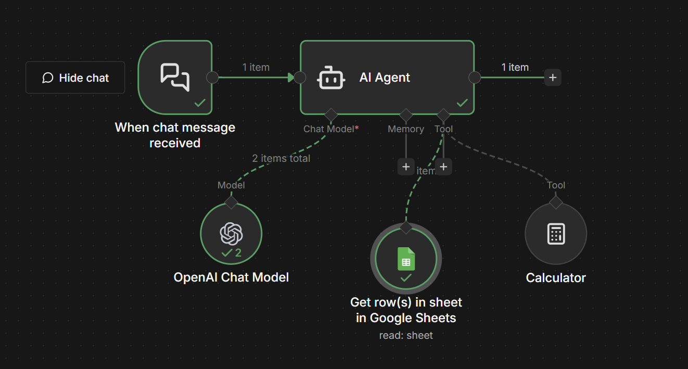

- **ChatGPT normal (LLM):** Es un cerebro en un frasco. Sabe mucho, pero no puede "hacer" nada. Si le preguntas la hora, no sabe. Si le preguntas por tu stock, inventa.
- **AI Agent:** Es ese mismo cerebro, pero **le pusiste manos y herramientas**. Si no sabe la respuesta, puede ir a Google a buscarla, abrir tu Excel para leer el stock o usar una calculadora. **Razona y ejecuta.**

### **1. La Situación (Escenario Real)**

- **El Cliente:** Te escribe un correo preguntando: *"Hola, ¿dónde está mi pedido #555?"*.
- **El Problema:** Si usas una IA normal (GPT-4) para responder, te dirá: *"Soy una IA, no tengo acceso a tus pedidos"*. Inútil.
- **La Misión:** Quieres que el Agente: 1. **Entienda** que le piden el estado de un pedido.
2. **Use una Herramienta** (vaya a tu Google Sheet de pedidos).
3. **Busque** el #555.
4. **Vea** que dice "En Reparto".
5. **Responda:** *"Hola, tu pedido #555 está en camino 🚚"*.

---

### **2. Paso a Paso: Cómo construirlo**

Este nodo es especial porque necesita "amigos" conectados a él para funcionar.

Supongamos que recibimos un mensaje que simualremos con el Chat Trigger

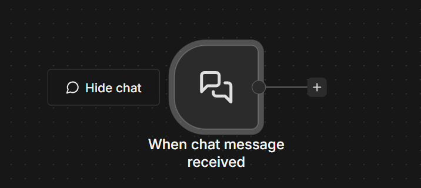

#### **Paso A: El Núcleo (El Agente)**

1. Agrega el nodo **AI Agent**. 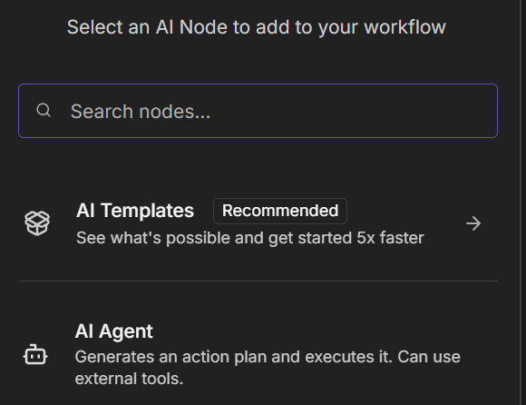
2. **Agent Type:** Tools Agent (o Conversational Agent). - *(Esto le dice: "Vas a tener herramientas disponibles").*
3. **Prompt:** Escribe las instrucciones de tu empleado:  
*"Eres un asistente de soporte al cliente de Imperio Digital. Tu trabajo es responder dudas sobre el estado de los pedidos. Tienes acceso a una base de datos. SIEMPRE busca la información antes de responder. Sé amable y breve."}* 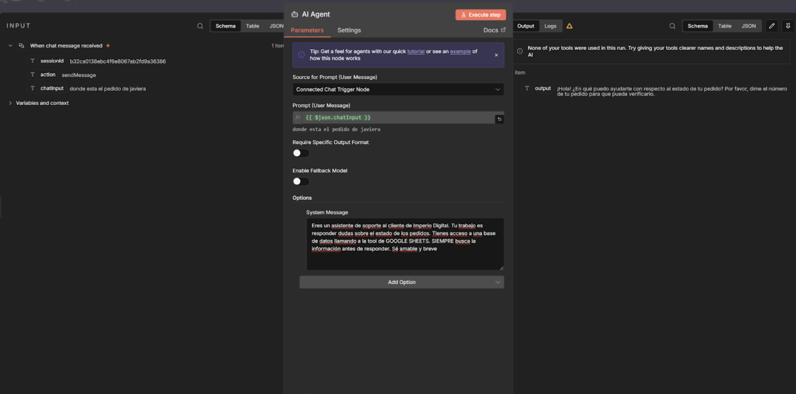

#### **Paso B: El Cerebro (El Modelo)**

El Agente es el cuerpo, necesita un cerebro.

1. Verás un input que dice **Model**. 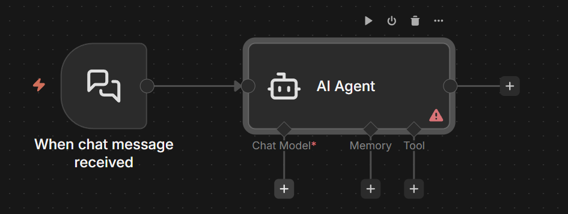
2. Conecta ahí el nodo **OpenAI Chat Model**. 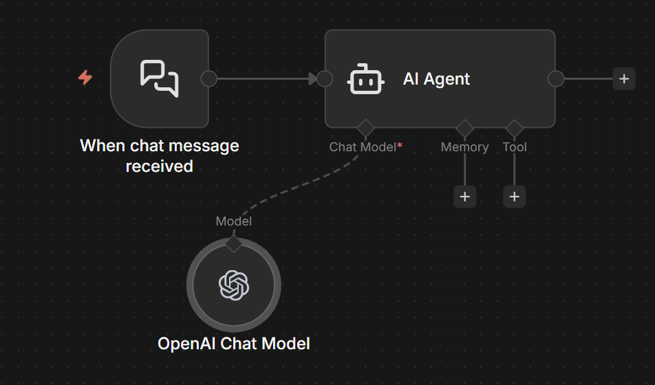
3. Selecciona un modelo capaz (mínimo gpt-4.1). Los modelos viejos son tontos para usar herramientas. 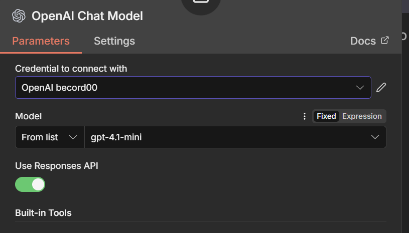
4. Quizás debas hacer la conexion, para eso te vas a “Create new credential” 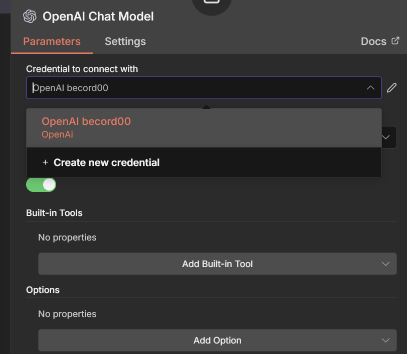
5. Entraras a [https://platform.openai.com/api-keys ](https://platform.openai.com/api-keys)y copiaras la API key recien creada 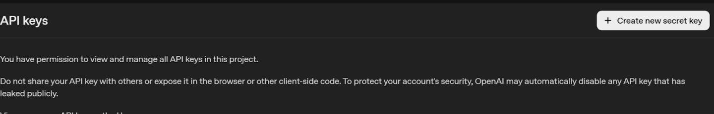

1. La pegarás aqui  
 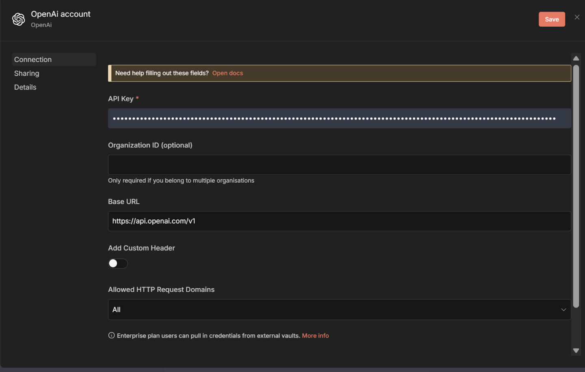 **Paso C: Las Manos (Las Herramientas)**

Aquí está la magia.

1. Verás un input que dice **Tools**.  
 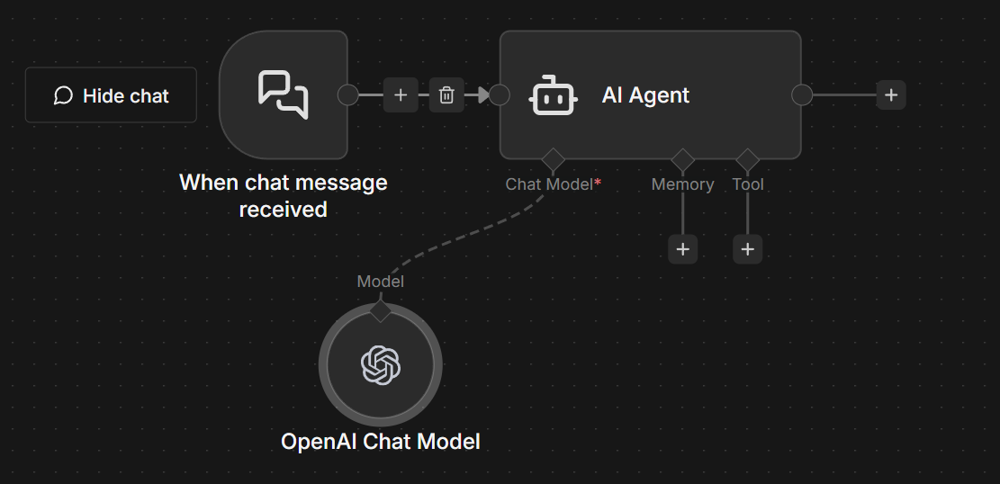
2. Conecta ahí una herramienta. - **Ejemplo Básico:** Conecta el nodo **Calculator Tool**. - *Prueba:* Pregúntale al Agente "Cuánto es 543 * 123". En vez de alucinar, usará la calculadora y te dará el dato exacto. 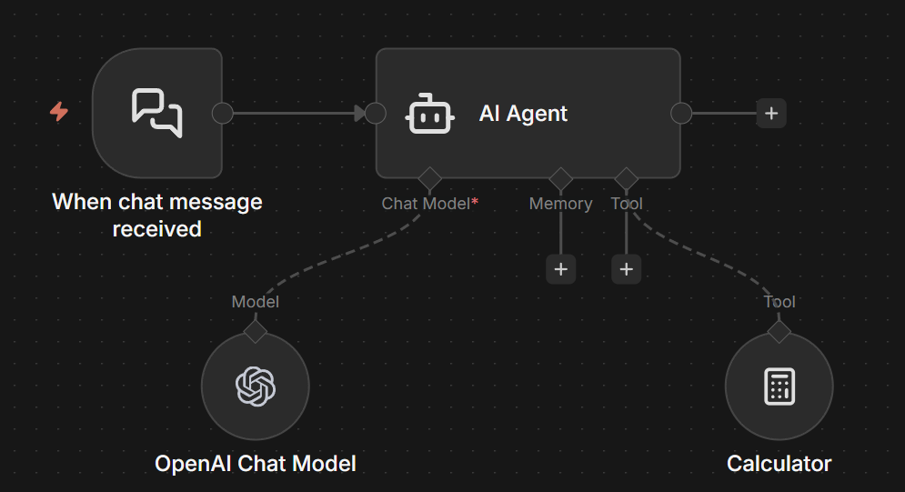
- **Ejemplo Pro:** Conecta el nodo **Google Sheets Tool** (o crea una "Custom Tool"). - *Prueba:* Al preguntarle por el pedido #555, el Agente irá a leer el Excel solo. 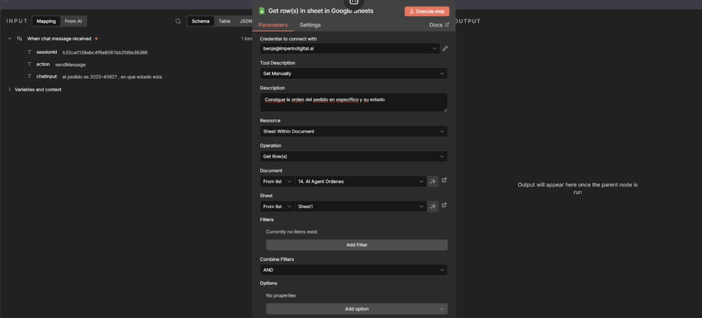

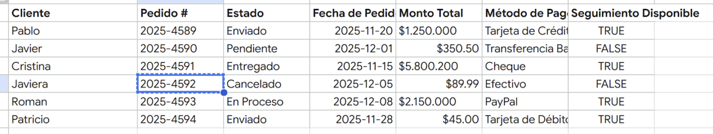

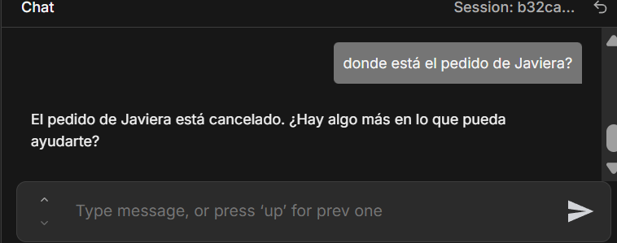

### **3. Resultado Final**

Cuando ejecutas el flujo:

1. El Agente recibe: "¿Donde esta el pedido 2025-4592?".
2. El Agente **piensa** (verás en el log): *"Necesito buscar el pedido *2025-4592?*. Voy a usar la herramienta Google Sheets"*.
3. Ejecuta la búsqueda.
4. Recibe el dato: "En Reparto".
5. Redacta la respuesta final: *"Hola, revisé y tu pedido va en camino"*.

### **4. Criterio (Por qué usarlo)**

- **Cero Alucinaciones:** La IA ya no inventa datos. Si no encuentra la información en tus herramientas, te dirá "No lo encontré" en lugar de mentir.
- **Autonomía:** No tienes que programar cada paso ("Si dice pedido, ve a sheets..."). Tú solo le das las herramientas y el Agente decide cuándo usarlas. Es como contratar a alguien inteligente.

## 🎙️ Transcripción

A continuación, vas a ver uno de los novos más interesantes y de por lejos, mis favoritos dentro de N8N. Este sí que va a cumplir un rol fundamental en el proceso de tu aprendizaje 80 y es el nodo de el famoso AIH. Aquí cabe destacar una gran diferencia. Tenemos en un principio lo que son los LLM y por otro lado tenemos lo que son los agentes. El LLM es como el cerebro de los agentes, mientras que una gente se diferencia porque puede ejecutar acciones, entonces a este cerebro la agregamos brazos y estos brazos son lo que se conocen como las herramientas, ok? Por ejemplo si es que nos vamos al classroom, dentro vamos a encontrar el agente de whatsapp, que si lo descargamos va a haberse como una gente tremendo porque está bastante optimizado para WhatsApp directamente y es este pequeño módulo que se ve aquí abajo a la derecha y este es la gente si es que lo importamos por ejemplo acá lo voy a descargar por fines prácticos te lo voy a mostrar acá en otra automatización me voy a ver acá crear un nuevo workflow agregar importar desde archivo y vamos a importar el agente de whatsapp, vamos a ver que aquí tenemos un agente que hace llamado a dos herramientas en específica, estas herramientas son para actualizar ciertos parámetros de el negocio, ahora sí vamos a la base, voy a buscar acá el AI agent, este en específico es cuando recibe un mensaje quiero que ejecute algo para conectar el cerebro tenemos lo que es el modelo, aquí podemos elegir cuál es el modelo de inteligencia artificial que queremos que sea su yaciente o de la base digamos en este caso al agente de inteligencia artificial. Para este caso le pedimos que ejecúte dos opciones como que busque algo de la calculadora en específico o en un row en específico. Aquí le creo un prompt bastante sencillo que es el asistente de soporte cliente imperial. Tu trabajo de responder duda sobre el estado de los pedidos y tienes que hacer llamado al Google Sheets y aquí le ponemos la herramienta en específico, ok? Entonces si es que nos vamos acá y le damos a guardar y ejecutamos el agente y le decimos cuál es el último pedido que ese genero, vamos a ver qué está en este momento haciendo el llamado a la gente y después me está devolviendo una respuesta, el último pedido que ese genero es el pedido xxx realizado por roman con esta becha de donde esta ecuesta información bueno de aca de el cheat en específico que es la base de clientes acá y este fue el último pedido en este caso que fue el 25 del 12 del 0 8 y lo podemos comprobar aca ok vamos a ver cómo lo crearíamos paso a paso vamos a hacer exactamente el mismo trigger que este va a ser el cuando tengamos una trigger de chat ok esto puede ser whatsapp puede ser lo que sea no podemos agregar más de uno así vamos a trabajar con este una vez que lo creamos acá vamos a agregar el AI y vamos a poner ups vamos a poner el AI y vamos a poner el AI agent aquí tenemos varias opciones dentro el AI agent tenemos el chat trigger y el define below que son las dos opciones para la mayoría de los casos vamos a al Define Below que vendría siendo simplemente ponerle un prompt por decirlo así o podemos usar el chat trigger que es el chat o en específico el trigger que va a rellenar el usuario. Luego una parte muy importante es que tenemos el System Message. Este es el Message o la instrucción que va a ser trascendente, es decir, trascende más allá del mensaje y es la base. Es como en los jeves dispersonalizados cuando le dábamos una instrucción o un rol en específico y aquí va a ser eres un asistente imperial tu trabajo es verificar y hacer llamado a la herramienta de google sheets para verificar el estado de los pedidos nada más la gente te pedirá una orden en específica y tú le devolverás el estado del envío ok entonces aquí vamos a ser ejecuta la herramienta shits ante todo trigger ahora sí, entonces ahora le vamos a dar a correr y nos va a decir que no tenemos ningún nodo conectado, es decir, ningún modelo de inteligencia artificial conectado ¿por qué? porque efectivamente no tengo ninguno pero antes lo que hicimos fue hacer la conexión de open route Entonces, vamos a buscar OpenRouter que nos permite usar distintos modelos de inteligencia artificial. Aquí podemos usar el que quieras, GPT4, GPT4.1, podemos usar los de Gemina y los Flash, para este caso vamos a mantener el GPT4.1. Ahora sí, si es que lo hacemos y lo corremos, probablemente no fallucionar porque no tenemos nada conectado en específico a esto ya. Entonces, si le vamos a ejecutar una vez, vamos a ver que no podemos ejecutar el Sheets porque no está conectado a ninguna información y nos va a lucinar ejecutando herramientas Sheets para verificar el último pedido generado que no es el caso. Entonces, vamos a conectarle el tool y vamos a ser llamado a distintas herramientas. El tool es una pequeña acción que ejecuta el nuevo de inteligencia artificial o el AI agent que le permite, como su nombre dice, como ejecutar una herramienta que nos va a permitir extraer información, nos va a permitir conectar a otro escenario, podemos hacer aquí lo que queramos, podemos ejecutar un workflow, como vemos aquí al lado, podemos ejecutar un código de tool, podemos hacer un request, HTTP, podemos conectarlo a mcp, o podemos en este caso extraer información de que sheets vamos a extraer información bueno vamos a hacerlo del 14 y 15 vamos a get rows de que del 14 y 15 que son las órdenes de que oja bueno de la primera oja entonces ahora si es que lo ejecutamos vamos a ver que nos devuelve toda esta información pero yo no quiero toda esta información quiero la información de algo en específico bueno esto es lo lindo del ea ¿Por qué tú ya no te tienes que preocupar de eso? El IA agent sabe que le preguntaste por la última orden sabe que si le preguntaste por no sé, Patricio te va a devolver la orden de Patricio, ok? Y eso es lo interesante. Entonces ahora si es que yo le digo acá algo por el estilo de en que estado está la orden de Patricio y le doy a enter, va a ejecutar acá, va a ver el Sheets y después me va a devolver el en específico donde está, veamos lo acá, el output la orden de patricio está en estado enviado, y si verificamos aquí, patricio está en estado enviado, ok, perdón, aquí en estado enviado, muy interesante, realmente genial, genial, y si ahora quisieramos hacer un siguiente paso, digamos cómo no se enviarle un correo a Patricio, haríamos acá, pondríamos Gmail, pondríamos esto, y le pondríamos acá, queremos enviarle un correo a, no tengo idea, a Patricio, ya podemos mapear la variable de Patricio, el correo de Patricio en específico, si es que la tú y decimos acá el subject va a ser tu correo o tu pedido fue enviado etcétera y aquí le pone la respuesta no tengo idea conectas la cuenta de mail y así de sencillo entonces es bastante interesante porque acá lo que podemos hacer después es no tengo idea podemos extraer la data de específico de acá de cada hora de las personas y después podemos pedirla acá que nos envíe a la persona en específico que queremos mandar entonces es muy muy interesante para este caso en específico porque podemos empezar a mapear las variables que necesitamos, podemos conectar una herramienta de get mail o de extraer una fila en específico que nos va a extraer la fila de patristo y además el estado nos va a enviar el correo electrónico y aquí nos va a dar el output. Supongamos que queremos mandar este output en específicos, o queremos enviar este output a alguien en específicos. Podemos hacer muchas cosas acá dentro de las opciones, tenemos las tools, en cada tool podemos hacer literalmente lo que nos imaginemos, tenemos la calculator tool, porque sabemos que los LLMS son bastante malos en resolver ecuaciones matemáticas, entonces acá vamos a poner ejecuta la herramienta calculator si te piden un calculo complejo entonces acá vamos a tener las dos todo trigger de clic como de información de clientes y aquí ejecuta la herramienta calculator si te piden un calculo complejo entonces ahora si es que voy acá y le digo como cuánto es esto, esto dividido en esto por 100 menos 955 por 30. Probablemente lo que debería hacer es ejecutar el calculeitor y después me debería dar el mensaje y enviarme la respuesta, si es que entro mi correo, vamos a ver que se ejecutó el uso de la calculadora ya, tu pedido fenviado, bueno, y el resultado de la operación es este, está bien, no tengo idea, no tengo la más mínima idea, yo creo que sí, vamos a buscarlo acá, en Google, Google Google, 204 mil, pack, estamos en la herramienta de calculadora de Google y es menos 204 mil, ok, menos 204 mil, que está perfecto. Así que, en fin, este es el uso del nodo de inteligencia artificial, es realmente útil, yo lo uso para todo, tenemos aquí otra herramienta que es el memory, que es el simple memory, entonces, por ejemplo, supongamos que yo estoy hablando Eliminemos esto, eliminemos la memoria. Yo estoy hablando con la gente inteligencia artificial y le digo mi nombre es Juan y me gusta el lado de pistachio. Lo voy a dar enter, va a ejecutar, ok, voy a desactuar el correo, me desiro a la Juan, estoy aquí, va a ayudar, te no sé qué, no sé qué, no sé qué. Pero después si le preguntas cómo me llamo no se va a acordar realmente mi nombre, porque no tiene acceso a esa información. Ahora si es que yo le creo una memoria simple que se acuerde de cinco interacciones pasadas en específico, se la agrego acá y después la dejo acá y le digo, hola, mi nombre es Juan y odio el lado de pistachos, no sé quién no le puede gustar el avistachos, mi favorito. Vamos a ver que ese guardo aquí la ejecución, en este caso es hola, mi nombre es Juan y odio el avistachos y ahora se le digo, ¿sabes cómo me llamo? Vamos a ver qué para ejecutar y va a ser hola, Juan, porque ahora sí se acuerda en específico de qué me llamo Juan. Cuando ya queremos complejizar un poco más las bases de datos dentro de los agentes. Vamos a conectarlo con herramientas como AirTable, podemos conectarlo a ciertas bases de datos en específico, donde podemos guardar las cosas. Pero, finally, eso ya es otro tema en específico. Esto es lo importante y esto es lo que tienes que saber. Cuando ejecutamos el AI Agents, tenemos tres cosas que son clave. La primera es que modelo vamos a usar para eso usamos OpenRouter para usar el modelo que queramos. la segunda es tiene memoria o no y si tiene memoria cuánta memoria quieres que guarde en n8n y la tercera es que herramientas quieres que ejecute o sea capaz de ejecutar aquí dentro de la gente le haja el sistema s tiene el caso de que uses el define below en específico aquí le vas a poner el prompt en específico ya chat trigger es si quieres el chat y el define below es si que quieres algo más estandarizado, ok, recordemos nuevamente esta plantilla, yo lo que va a hacer es guardarla, voy a descargarla y la voy a subir acá al nuevo de los AIhends escuto.
