# Nodo 14: Merge (El Reencuentro)

> Ruta: n8n Desde 0 › Nodo 14: Merge (El Reencuentro)

**🎬 Vídeo (8.6 min):** https://www.loom.com/share/e12851c060f64a18a97c8148c022686e

**📎 Recursos:**
- 17. Merge - Mail a Vtas o Gerencia

---

El Concepto: "El Embudo".

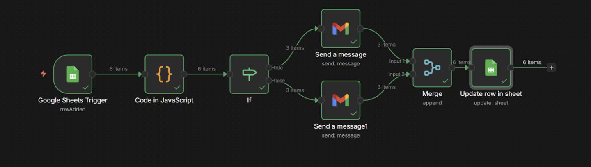

Cuando usas un nodo If, divides tu camino en dos (Camino A y Camino B).

Pero a veces, después de hacer cosas distintas en cada camino, quieres que todos vuelvan a la misma fila para terminar el proceso juntos.

El nodo Merge toma esos caminos separados y los vuelve a unir en una sola línea.

### **1. La Situación (Escenario: Gestión de Pedidos)**

- **El Origen:** Tienes un Google Sheet con pedidos nuevos (on row added)  
  
 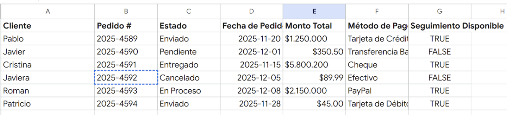 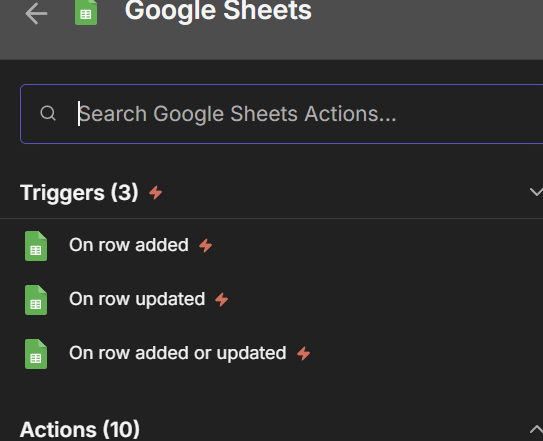 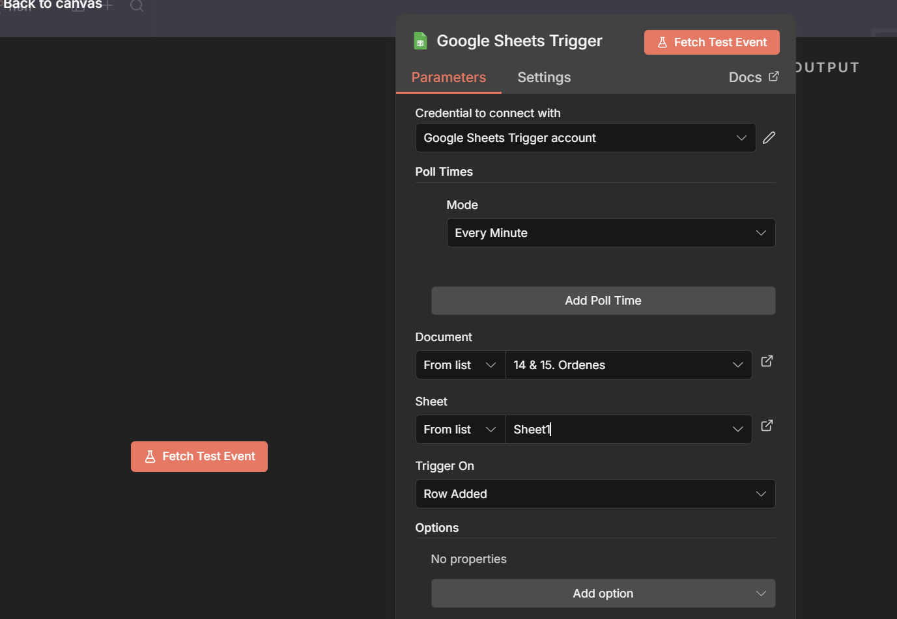
- **La Lógica (El If):** - Si el pedido es **Mayor a $1.000.000** (VIP) $\rightarrow$ Le mandas un correo al Gerente.
- Si el pedido es **Menor a $1.000.000** (Normal) $\rightarrow$ Le mandas un correo a Ventas. 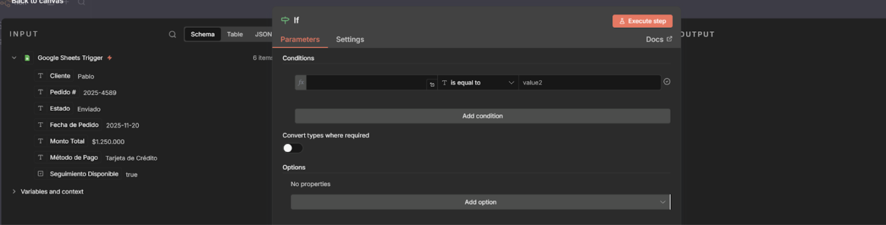

Bonus, como puedes ver hay muchos simbolos de . o $, vamos a eliminarlos con el code: 

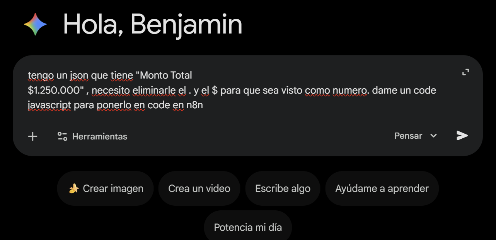

ahi si pasamos de $1.250.000 a 1250000

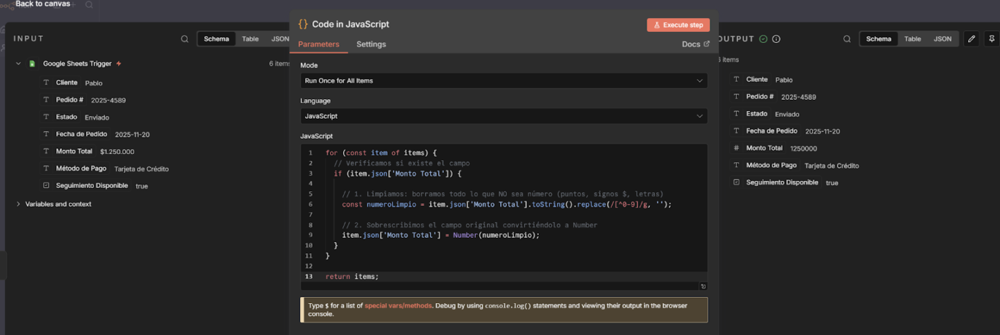

- **El Problema:** Después de mandar esos correos distintos, quieres hacer una acción final para **TODOS**: Marcar el pedido como "Procesado" en el Google Sheet.
- **Sin Merge:** Tendrías que poner un nodo "Actualizar Sheet" en el camino de arriba y *otro igual* en el de abajo (doble trabajo).
- **Con Merge:** Unes los dos caminos y pones **un solo** nodo "Actualizar Sheet" al final.

---

### **2. Paso a Paso: Cómo construirlo**

#### **Paso A: El Divisor (If)**

Imagina que ya tienes tu **Google Sheets** (leyendo pedidos) conectado a un **If** (separando por precio).

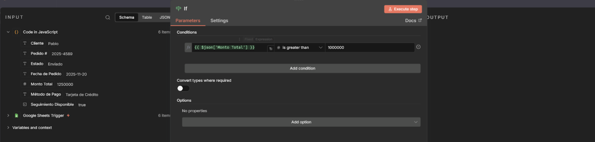

- **Camino True (Arriba):** Conectas un Gmail para el Gerente. 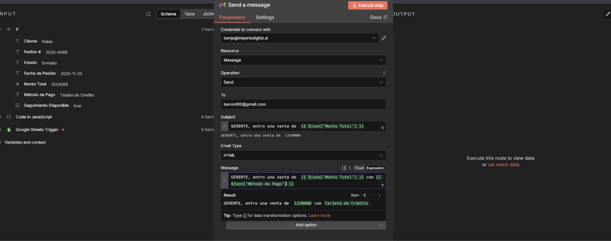
- **Camino False (Abajo):** Conectas un Gmail para Ventas. 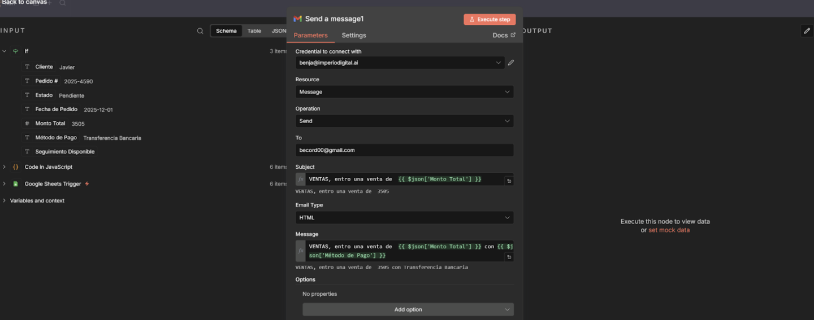

#### **Paso B: La Unión (Merge)**

Aquí es donde simplificamos.

1. Agrega el nodo **Merge** al final del lienzo.
2. **Conexión (Física):** - Agarra el puntito de salida del **Gmail del Gerente** (Arriba) y conéctalo a la **Input 1** del Merge.
- Agarra el puntito de salida del **Gmail de Ventas** (Abajo) y conéctalo a la **Input 2** del Merge.
- *(Se formará un diamante o rombo visualmente).* 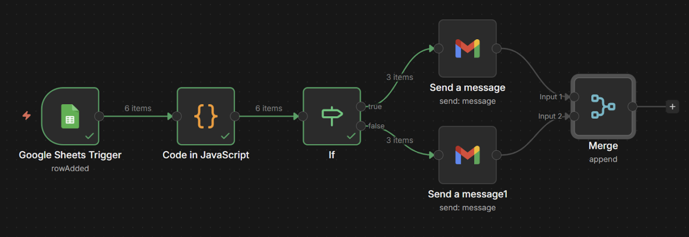
3. **Configuración:** - **Mode:** Selecciona **Append** (Anexar).
- *¿Qué significa?* "No me importa de dónde vengan (de arriba o de abajo), simplemente déjalos pasar y ponlos en una sola fila india". 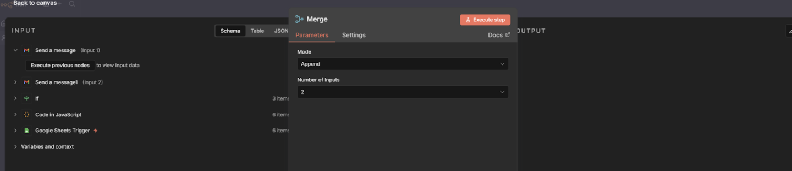

#### **Paso C: La Acción Final (Google Sheets)**

Ahora que todos los pedidos (VIP y Normales) volvieron a estar en una sola línea:

1. Conecta un nodo **Google Sheets** a la salida del Merge.
2. **Action:** Update Row.
3. **Configuración:** En la columna "Estado", escribes "Procesado". 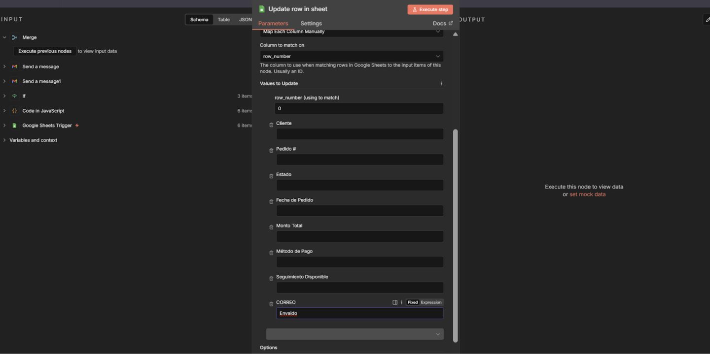

---

### **3. Resultado Final**

- **Caso VIP:** Entra al If $\rightarrow$ Va por Arriba (Email Gerente) $\rightarrow$ Cae al Merge $\rightarrow$ Se marca como Procesado.
- **Caso Normal:** Entra al If $\rightarrow$ Va por Abajo (Email Ventas) $\rightarrow$ Cae al Merge $\rightarrow$ Se marca como Procesado. 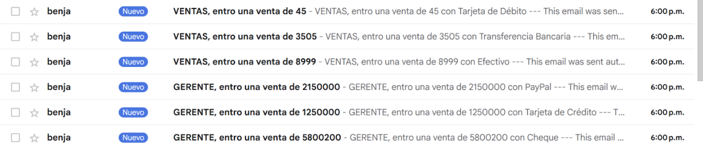

Usaste **un solo nodo** final para actualizar la planilla, en vez de dos. Tu flujo se ve limpio y ordenado.

### **4. Criterio (Por qué usarlo)**

- **Orden:** Evitas tener flujos con "cabos sueltos". Todo empieza junto y termina junto.
- **Mantenimiento:** Si mañana quieres cambiar la palabra "Procesado" por "Enviado", solo editas **un nodo** final, no tienes que andar buscando en todas las ramas del If.

## 🎙️ Transcripción

Cuando usas uno IF a veces separas los caminos, hay veces que lo que queremos hacer es volverlos a juntar. Para eso vamos a usar el nodo Merch, ok? Merch es uno bastante útil que no estuvo por mucho tiempo en otras herramientas de automatización de eh, creación, de flujo de trabajo automatizados como make y es bastante práctico porque nos permite separar la automatización y después volverla a juntar porque si es que no tuviesemos este nodo en específico lo que tendríamos que hacer sería seguir creando las mismas cosas aquí para cada uno de los lados por el resto del tiempo, así, así, etcétera ya tendríamos que replicando cada uno de los pasos después acá en específico, pero como no somos, al final somos bien flojos y queremos hacerlo de la manera más eficientes, digamos, les eficientes y no flojos, vamos a usar el modo o el nodo de merge en específico, ok? Para este caso tenemos un trigger. El trigger lo que hace es nos determina según un monto total de presupuesto nos determina si es que se va a ir por arriba o se va a ir por abajo. Una vez que se envíe, el correo se va a volver a juntar en específico, así que si juntamos este trigger en específico acá, vamos a imaginar que tenemos el trigger y el if en este caso es el monto total, entonces acá le vamos a poner monto 100 mil ok así y el cliente es max y el pedido es uno del estado es enviado y el correo no tengo idea es begord nos va a aparecer algo así ok ahora si es que me voy acá vamos a actuar y como sabemos que el monto en específico es sofre en este caso 100 mil o un millón lo que hicimos acá fue estos 100 millones lo que hicimos fue irse por arriba ya que es un tru en el caso de que no excesivo suesivo por ajo y se vuelve a juntar, probablemente está preguntando qué es este nodo de código acá bueno ya vimos que el nodo de código nos ayuda a ordenar datos, y como veis acá rellené este dato con los puntos, entonces si es que no tuviese este código de nodo en específico, me hubiese tomado probablemente esto como acá, no he setirado un error, porque es un error, porque el número 100.00000000 no es un número, es un texto, entonces acá lo que hacemos en este caso en específico es eliminarle los puntos, viendo la xgbd, créame un no en código que me livenen los puntos, ok, un pequeño tip, que funciona bastante, entonces el no merge, cantidad de inputs que queremos recibir, 2, 3, 4, 5 y vamos a tenerlos acá, siempre o en la mayoría de los casos vamos a estar usando este que es el app, que es cuando juntamos directamente cada uno de los no para después tener un output en específico, ok, bastante interesante, realmente útil en el caso de que no quieras tener automatizaciones gigantes que sigan para el costado, ok, y aquí podemos empezar, bueno ya, supongamos que acá queremos enviarle un correo al grente y supongamos que acá queremos enviarle un correo a ventas, algerente cuando entran las ventas de más de un millón de beso y a simplemente ventas cuando es una venta inferior a un millón de beso. Entonces aquí tendríamos el Google Sheets Trigger, nos vamos a ir acá, nos vamos a ir los Triggers, esto es cuando se agrega un nuevo row en específico, vamos a conectar la cuenta y lo vamos a sacar de las órdenes, órdenes y sheets. Vamos a buscar un evento de prueba y aquí nos lo acaba de estar. Luego vamos a ponerle el nodo de el código. Entonces le voy a decir code, voy a entrar a chargébete y le voy a decir, oye, creame tengo un nodo code en 8n, entra números, entra un texto en específico, que es monto total, verdad, si lo tenemos, monto total, monto total, y entra con puntos como más lo que sea, necesito eliminarlo para que me quede solo un número y me funcione, aquí me va a dar el código, me va a dar probablemente el JavaScript y me va a decir para pasar de algo así, vamos a pasar algo así, entonces veamos que funciona, lo voy a copiar, lo voy a pegar, voy a ejecutar y aquí me dio monto nulo, veamos por qué me dio nulo, vamos a copiar este de acá, vamos a copiarlo y pegarlo, ahora sí, el segundo me sirvió y tenemos aquí el monto, con este monto ahora podemos trabajar, vamos adentro alif, vamos a crearlo, elif recordemos lo separa, cuando el monto en específico es superior a 1 millón de pesos, 1, 2, 3, 1, 2, 3, queremos que se vaya por arriba, así es que se va por arriba, vamos enviarle un correo electrónico send message a quien bueno algerente y le vamos a decir señor gerente hubo tremenda venta y después le vamos a ir acá le vamos a mandar un correo de texto vamos a decir nos vamos a jamás y compadre ya entonces eso es lo que va a pasar si es que sea por arriba si es que sea por abajo vamos a decir vamos a tengo idea registrar los sheets o vamos a mandarlo un correo si vamos luego en el mismo caso vamos a mandar un correo y le vamos a decir al otro a venta si le hubo venta, pero fue menos de un millón de besos, así que a seguir comiendo Jurel. Entonces acá va a decir, por arriba, si es que es verdadero, por arriba, si es que falso. Y aquí es el que necesitamos. Ahora sí, vamos a vernos el Merge, Merge is the era of multiple streams once the era from both is available, es decir, una vez que tenemos data o que se va por acá en algún lado los va a juntar aquí en específico tenemos la opción de juntarlos o tenemos la opción de combinar los para este caso queremos juntar los cuantos inputs queremos juntar 7 no queremos juntar 2 entonces desde acá va a ser ok y ahora actualicemos en sheets que vamos a actualizar el mismo sheets y vamos a cambiar el estado acá, no tengo idea, pedido, método de pago, seguimiento disponible, supongamos que queremos actualizar eso, de seguimiento disponible, entonces vamos en acá, vamos a elegir el sheets, vamos a elegir la hoja, vamos a ir a mapear, que vamos a mapear, bueno, mapeamos con, aquí esta parte es como para poder mapear algo en específico, mapeamos con el pedido número de pedido, sabemos que es el número de pedido uno, ok, entonces para mapear con el uno, donde me quedo en hecho en acá, el using to match vamos a usar este, entonces queremos mapear acá el pedido uno, ¿cuál es lo que queremos hacer o qué es lo que queremos actualizar acá? Que va a ser notificado, entonces ahora sí es que ejecutamos esto en específico, Tio was client was deleted, por qué, ah, perdón, ahora sí, vamos a conectar bien la cuenta que tengo una de las cuentas de mail que las eliminé porque lo usé para el video y ahora sí si es que ejecutamos el workflow, vamos a ver, pasa por la ría y ahora se actualiza y esto ya fue notificado y se actualizó y volvimos a juntar los nodos que es justamente lo que queríamos hacer
