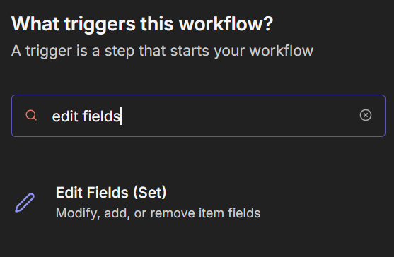
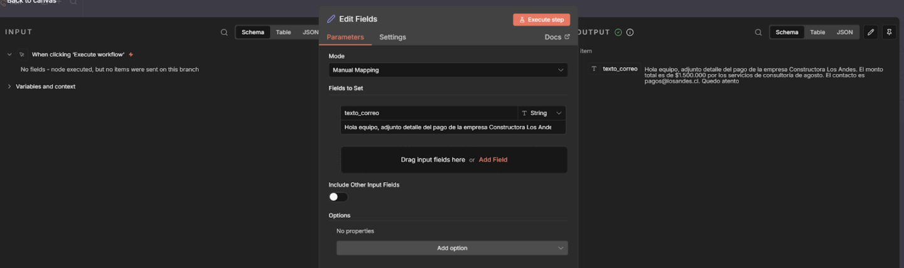
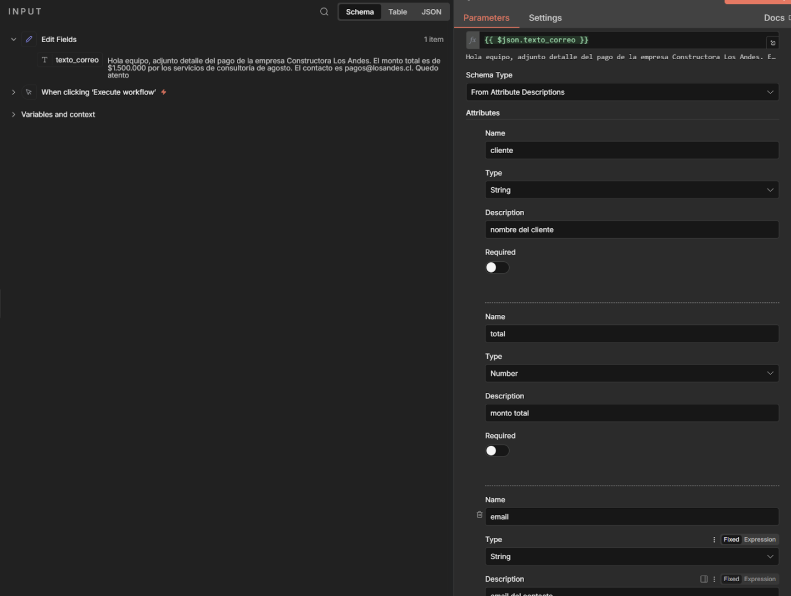
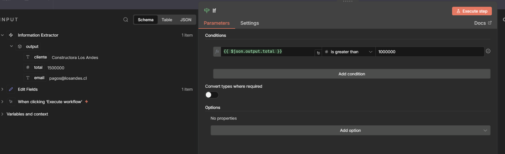
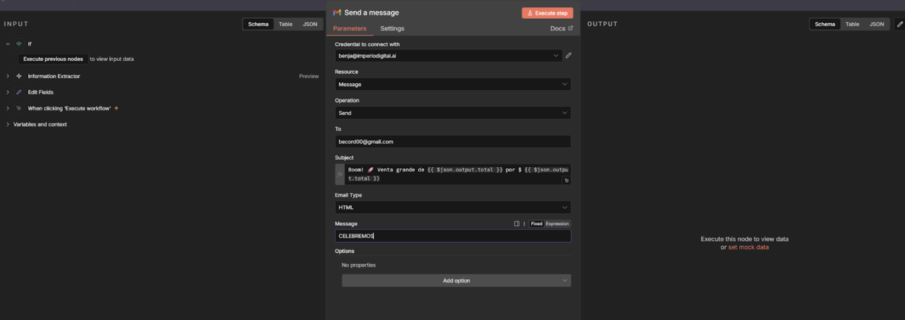
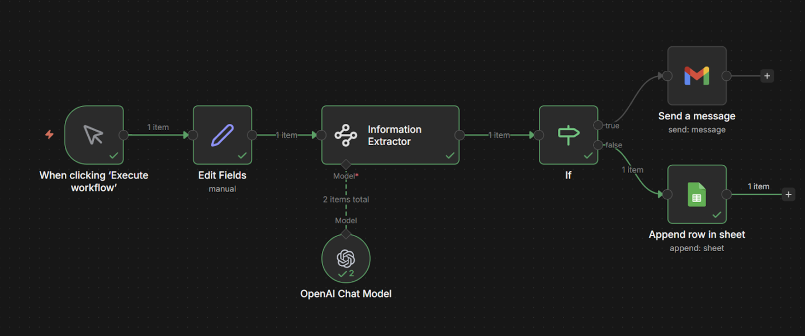

# Nodo 15: Information Extractor

> Ruta: n8n Desde 0 › Nodo 15: Information Extractor

**🎬 Vídeo (7.9 min):** https://www.loom.com/share/e01f060cc74e493f80eb868e492e02d7

**📎 Recursos:**
- 15. Information Extractor - Boleta

---

## **El Puente entre la Inteligencia Artificial y la Lógica**

**Workflow: Extracción Inteligente de Datos**

El Concepto: "El Traductor de Burocracia".

Te llega un correo largo, desordenado y aburrido con una factura pegada en el texto.

Tú no quieres leerlo. Quieres que el robot lo lea, entienda qué dice, saque solo lo importante (Precio, Cliente, Correo) y decida por ti si es una venta grande o chica.

### **1. La Situación (El Input Desordenado)**

Te llega este texto por correo (simularemos que el cliente escribe como quiere):

*"Hola equipo, adjunto detalle del pago de la empresa ****Constructora Los Andes****. El monto total es de ****$1.500.000**** por los servicios de consultoría de agosto. El contacto es *[***pagos@losandes.cl***](mailto:pagos@losandes.cl)*. Quedo atento."*

**La Misión:**

1. **Extraer:** Convertir ese texto en esto: { "cliente": "Constructora Los Andes", "total": 1500000, "email": "[pagos@losandes.cl](mailto:pagos@losandes.cl)" }.
2. **Clasificar:** Si es más de 1 millón $\rightarrow$ Aviso urgente a Gerencia.

---

### **2. Paso a Paso: Cómo construirlo**

#### **Paso A: El Input (Simular la Factura)**

Como no tenemos un correo real entrando ahora mismo, usaremos un nodo para simular el texto.

1. Agrega un nodo **Edit Fields**. 
2. Crea un campo llamado texto_correo. 
3. **Valor:** Pega el texto del ejemplo de arriba (el de la Constructora).

#### Paso B: El Extractor (Information Extractor)

#### En lugar de escribir un prompt largo rogándole a la IA que te dé JSON, usaremos este nodo que te obliga a ser ordenado.

1. Agrega el nodo Information Extractor conectado al Edit Fields.
2. **Text: Haz clic en el engranaje (Expression) y arrastra tu campo de texto sucio: {{ $json.texto_correo }}** 
3. **Schema Type: Selecciona From Attribute Descriptions (Esto es clave, aquí defines qué quieres extraer sin código).**
4. Attributes (Define tus variables): Aquí le dices al nodo qué buscar. Agrega 3 atributos: - Atributo 1 (Cliente): - **Name: cliente**
- **Type: String**
- **Description: nombre de la empresa cliente**
- Atributo 2 (Email): - **Name: email**
- **Type: String**
- **Description: correo electrónico de contacto**
- Atributo 3 (Total) - ¡Ojo aquí!: - **Name: total**
- **Type: Cambia esto a Number (En tu foto sale String, pero ponle Number para que el nodo If siguiente funcione directo sin conversiones).**
- **Description: monto total del servicio (solo el número)**
5. Conecta un nodo de cualquier LLM, cualquiera el mas economico bastaría.
6. Dale a "Test Step".

#### Resultado Mágico: El nodo leerá el párrafo y rellenará tus casilleros automáticamente. Obtendrás esto limpio:

#### JSON

#### {

####   "cliente": "Constructora Los Andes",

####   "email": "[pagos@losandes.cl](mailto:pagos@losandes.cl)",

####   "total": 1500000

#### }

#### *Nota: Al usar este nodo, te ahorras el problema de que la IA te responda con texto extra o bloques de código markdown. Siempre te entrega la estructura exacta que definiste en los Atributos.*  
  
  
**Paso D: El Clasificador (Nodo 7: If)**

Ahora que tenemos el dato total: 1500000 limpio, podemos aplicar reglas de negocio.

1. Agrega el nodo **If** conectado al Agente.
2. **Condition:** - **Value 1:** Arrastra el campo total que generó la IA.
- **Operation:** Number -> > (Mayor que).
- **Value 2:** 1000000. 

#### **Paso E: Los Caminos**

1. **True (Venta Grande):** Conecta un nodo gmail y mandale un correo al gerente. - Mensaje: *Boom! 🚀 Venta grande de {{ $*[*json.output.total*](http://json.output.total)* }} por $ {{ $*[*json.output.total*](http://json.output.total)* }}* 
2. **False (Venta Normal):** Conecta un nodo **Google Sheets**. - Acción: Guardar el registro silenciosamente en la contabilidad. 

---

### **3. Resultado Final**

Acabas de crear un **Procesador de Facturas Automático**.

- No importa si el cliente escribe el correo desordenado, con faltas de ortografía o en otro formato.
- La IA "entiende" y estandariza la información.
- El If toma decisiones financieras basadas en esa comprensión.

### **4. Por qué esto vale oro**

- **Adiós "Data Entry":** Ya no tienes que tener a una persona copiando y pegando datos de correos a Excel.
- **Estructura:** Transformas **Texto Libre** (que es caos y no sirve para nada) en **Base de Datos** (que es orden y sirve para todo).

## 🎙️ Transcripción

Supongamos que tenemos un correo eterno, o tenemos un bloque de texto gigante, o tenemos una factura y queremos extraer ciertas cosas en específico de esa factura para trabajar. Con, bueno, aquí entra un nodo muy útil, muy práctico que es el Information Extractor, es un nodo que no muchos conocen, pero que te vas a salvar la vida en muchos casos. Para este caso simulamos que recibíamos un correo en específico, es, hola equipo, al junto de Daye de Vago, el empresa constructor a los Andes. El monto total es de 500 mil por los servicios de consultoría de agosto. El contacto es pago a roar los Andes que va a atento, OK? Y esto lo vamos a simular con el Edit Films. Vamos a ejecutarlo y lo que va a hacer esto es va a pasarnos un texto en las variables que nosotros queramos para que, para después, si es que queremos meterlas a un Google Sheets, podemos meter acá cuál es el cliente, cuál es el monto y cuál es el correo. Voy a dar el ejecutar para que se vea. entonces el edit fill y podemos meterlo el correo en específico, muy interesante porque aquí tenemos la información. ¿Cómo funciona esto? Bueno, vamos a hacerlo nuevamente, vamos a tomar y reciclar el mismo correo ya y nos vamos a ir acá, voy a robar esto y voy a irme al edit fill o set nodes, así que me escucha referenciarme como set nodes porque antes se llama así, entonces acá va a ser correo, cuerpo, y esto lo podemos usar para extraer facturas para hacer lo de gramos. Vamos a ejecutarlo y vamos a ver que ahí no funciona. Después vamos a pasar al information extractor, que es en el fondo va a extraer cierta información, es muy lindo, porque es el puente entre la inteligencia artificial y la lógica, porque nos permite sacar variables de bloques de text, entonces es realmente hermoso. El cuerpo va a ser este. Después vamos a ir a los atributos y van a hacer las cosas que queremos destacar específicamente aquí lo primero que queremos ver es cuál es el precio o vamos a hacer un montón total y esto va a ser como dice su nombre, cuál es el montón total de la factura, por ejemplo, después vamos a agregar otro que va a hacer nombre cliente y esto va a ser cuál es el nombre del cliente que cual es el nombre cliente da igual y después va a ser correo y aquí va a ser cuál es el correo electrónico ya después vamos a elegir cuál es la clasificación de cada uno string recordamos que texto número es número después tenemos las fechas y si es bulliano es decir verdadero o falso el montón total es número y el resto son textos porque es importante esto porque si después que queremos aplicar lógica, no podemos aplicar lógica de número sobre un texto, por ejemplo. Una vez estando acá vamos a ejecutar, lo vamos a ver si es que funciona y nos dice que tenemos un nodo que nos falta que es el módulo o el modelo que vamos a usar, perdón. Primamente conectamos OpenRouter, recordemos OpenRouter, nos ayuda a conectar cualquier modelo de inteligencia artificial e ir variando, simplemente cargándole los créditos a OpenRouter. a mí me fascina. Para esto podemos usar algún modelo liviano, a mí me gustan cualquier modelo que sea Flash, te llemina y creo que funcionan bastante bien, Flashlight, ok, si es una tarea relativamente simple y ahora si es que ejecutamos, vamos a ver que la output va a ser en específico, acá el output monto total, constructora los andes y pagos los andes. Aquí lo voy a decir cuál es el monstruos del sim comas ni números, o sea, perdón, ni puntos por secas, ya que igual no me lo tengo, pero nunca está de más. Luego vamos a aplicar lógica para aplicar un par de móvulos más, que va a ser si es que el valor o el monstruo total es mayor a greater down, donde está, si es que el mayor es greater than, ahí está, 100.000, va a hacer verdadero y si es que no es falso, si es que es verdadero, vamos a mandar un correo que va a hacer un Gmail, que va a ser un Gmail en específico, las acciones donde está creemos enviar senda message ahí sí, y le vamos a mandar un vcorsero0.com, que es fecito, entró una venta de y vamos a mandar la venta que extraemos, que fue de el monto total ya, aquí el mensaje vamos vamos a poner constructora, nos compró, respondele a y le vamos a poner acá, ok, después el próximo paso, si es que es una compra inferior, vamos a actualizar un nodo en Google chips, que va a ser update o append a row, en este caso, de qué, bueno, de las órdenes o de si va a ser de las ordenes acá y vamos a mapear las columnas. El cliente va a ser, bueno, cuál es el cliente, el nombre es el cliente. El correo o el pedido no va a ser ninguno, da igual, el monto total va a ser monto total y el correo va a ser correo pago los andes. Supongamos que después queremos enviarle un correo que va a decir a la misma persona, entonces acá a correo los andes, que va a decir, gracias por la compra, ok, se registró tu compra de 500 mil en el caso de que vaya por abajo, ahora sí que le damos a guardar y le damos a ejecutar el workflow, vamos a ver que se está extrayendo la información y como 500 mil es sobre 100 mil vamos a enviar un correo en específico, si es que entramos acá al correo, señor gerente hubo tremenda, venta, nos vamos a jaja y que a compadre, pero supongamos que ahora el correo que recibimos es inferior y vamos a irnos a o la equipo junto del pago de la empresa, tak tak tak, vamos acá, bueno, esto lo podemos salir acá en verdad, de 50 mil para este caso y le damos a ejecutar, va a irse por abajo ya que 50 mil es menor a 100 mil, vamos una vez más, siempre va a hacerlo mismo con la cuenta, ahora sí, 50 mil es menor a 100 mil, en este caso le mandamos el correo a veamos, aquí en se lo mandamos, se lo mandamos a tu un tu un pagos en específico arroba los andes.cl funciona funciona supongo que alguien, así que alguien recibió nuestro correo visiendo este pagó 500 milidad a estar probablemente bastante confundido o confundida. Esta es la automatización, este es el módulo, funciona muy bien, es que queremos extraer data de una factura, si queremos extraer data de un texto, si tenemos un PDF, por ejemplo, y la hacemos un OCR, y lo pasamos toda la textura y tenemos mucha información y queremos clasificar la de organizar la new sheets. Este es el tipo de nodos que quieres usar. Aquí voy a usar los nodos más económicos en mi opinión, porque funcionan bastante bien, es una tarea bastante sencilla y bastante simple. Ok, recordemos que este mismo también te lo voy a descargar y te lo voy a dejar publicado aquí en Imperial en el nodo 15 en específico.
