# 🔍 Analiza Ads de Facebook de tu Competencia

> Ruta: Automatizaciones Make › 🔍 Analiza Ads de Facebook de tu Competencia

**🎬 Vídeo (23.6 min):** https://www.youtube.com/watch?v=7dK71uG40Og

**📎 Recursos:**
- A) Correr FB Ads Library
- B) Mirar FB Ads Library

---

# Cómo automatizar el análisis de competencia en Facebook Ads con Make + Apify

En marketing digital, **entender lo que está haciendo tu competencia en Facebook Ads** puede ser la diferencia entre reaccionar tarde o anticiparte con mejores campañas. Por suerte, hoy no necesitas pasar horas revisando manualmente la Facebook Ads Library: puedes automatizar todo el proceso con **Make** y el **Facebook Ads Library Scraper de Apify**.

En este artículo te muestro cómo lo resolvimos con **dos escenarios simples**, que terminan entregándote un informe semanal de tu competencia directo en tu correo o el de tu cliente.

---

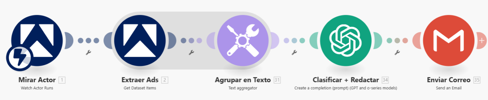

## Paso 0 – Habilitar el actor en Apify

Antes de construir nada en Make, tienes que habilitar el actor en Apify:

1. Entra al actor: [Facebook Ads Library Scraper – Input JSON](https://console.apify.com/actors/XtaWFhbtfxyzqrFmd/input).
2. Haz clic en **“Create Task”**.
3. Esto creará una tarea asociada a tu cuenta y hará que el actor quede disponible en [Make.com](http://Make.com).


1. Esto creará una **tarea asociada a tu cuenta** y hará que el actor esté disponible después en [Make.com](http://Make.com).

---

## Escenario 1 – Correr el Scraper en la frecuencia que quieras

El primer escenario es el que lanza el scraper con la periodicidad que definamos.

- El primer escenario es directo: se encarga de **ejecutar el scraper de Apify** con la frecuencia que definas (diaria, semanal, varias veces al día, etc.).
- Este scraper extrae los anuncios publicados en la **Facebook Ads Library**, con toda la información relevante: página, URL, título, descripción, cuerpo del anuncio, fecha de inicio, etc. Rellena con la cantidad de páginas o URL's que quieras. 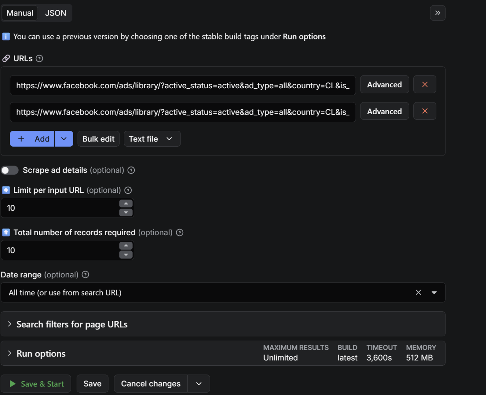 Los URL los puedes encontrar aquí: [https://www.facebook.com/ads/library](https://www.facebook.com/ads/library) 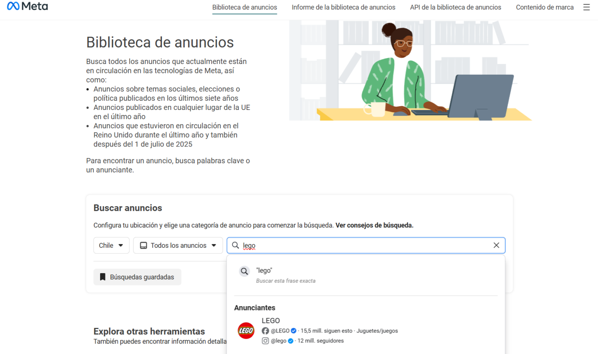 Y puedes buscar por cuenta ("Lego" por ejemplo) o por palabra clave ("inteligencia artificial" por ejemplo).  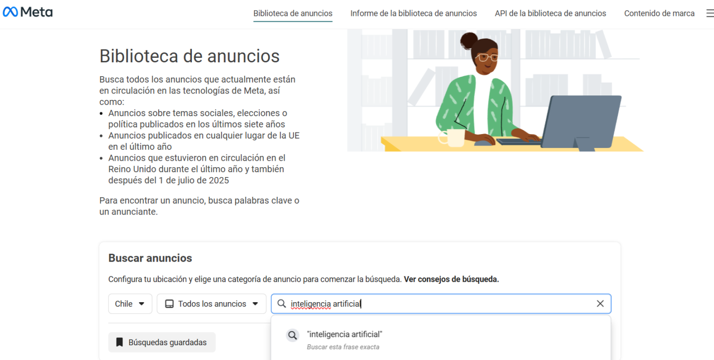 Copias la URL y la pegas  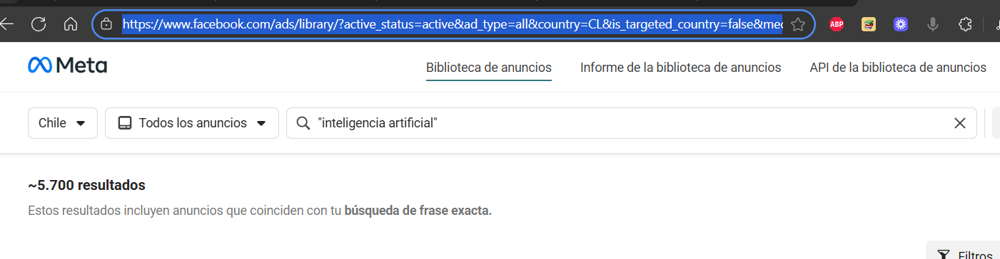 **Reemplaza las variables** que quieres dejar como base en el JSON:
- Haz clic en **JSON** y copia todo el código resultante. 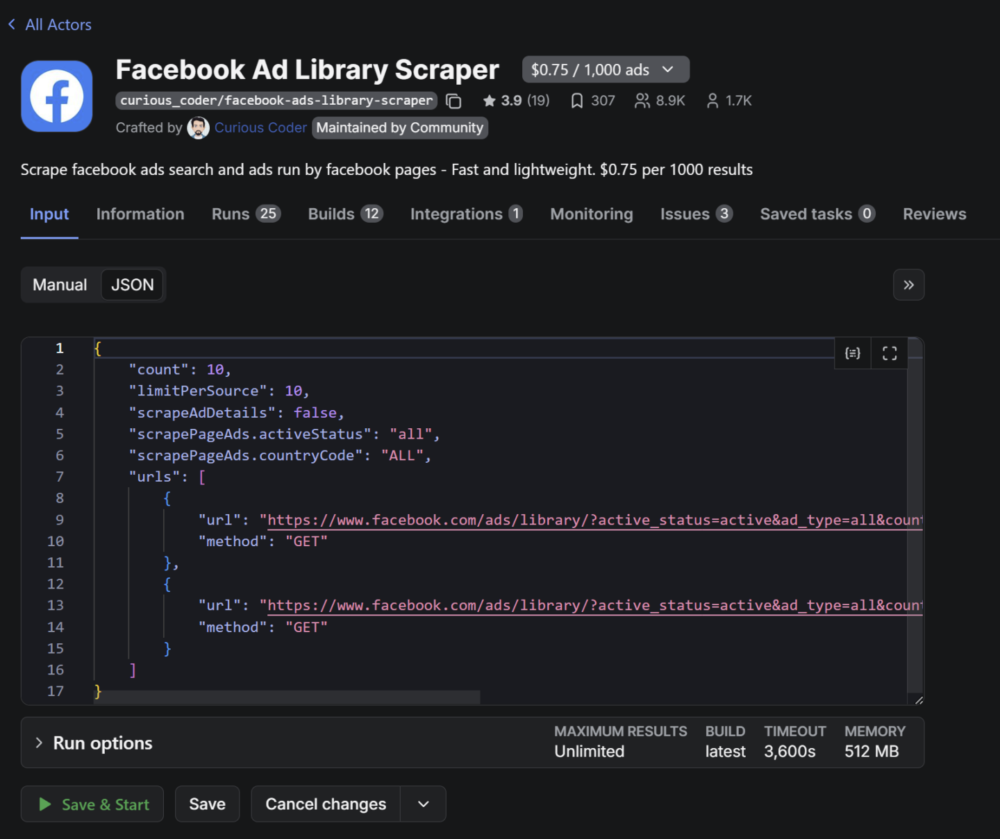 En **Make**, crea un nuevo escenario, y en el módulo **Run Actor**, 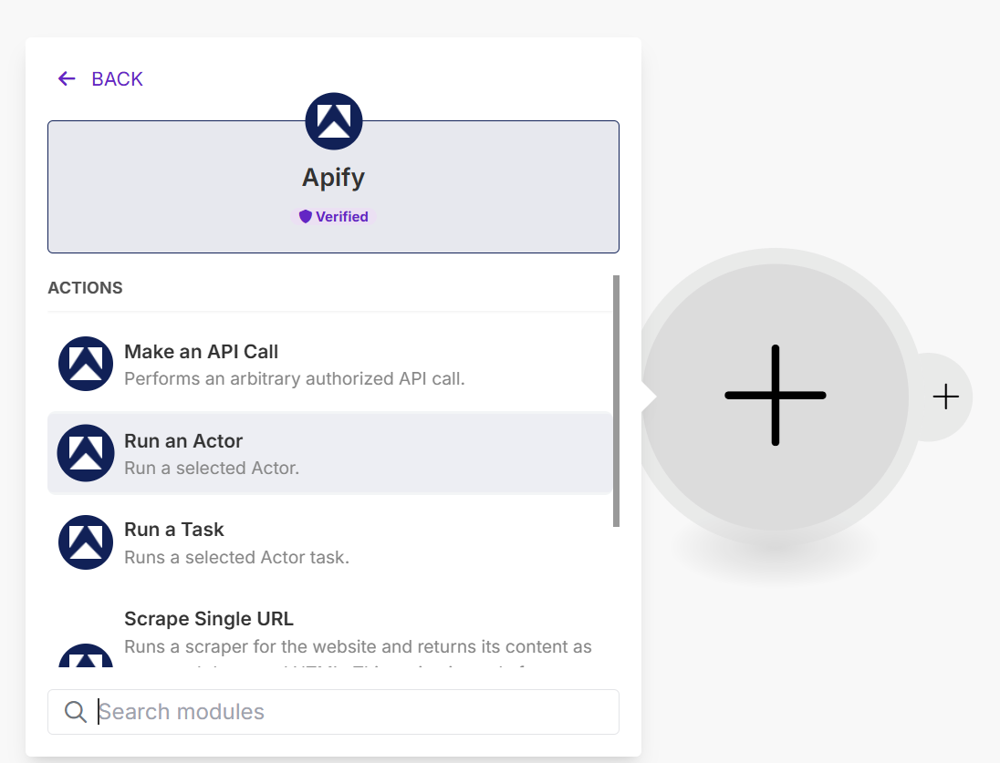 Selecciona el actor y pega ese JSON en **Input**, define la **frecuencia** (diario, semanal, etc.). Listo, ese escenario dispara el scraper con tu configuración y deja los resultados en un dataset para el escenario 2.

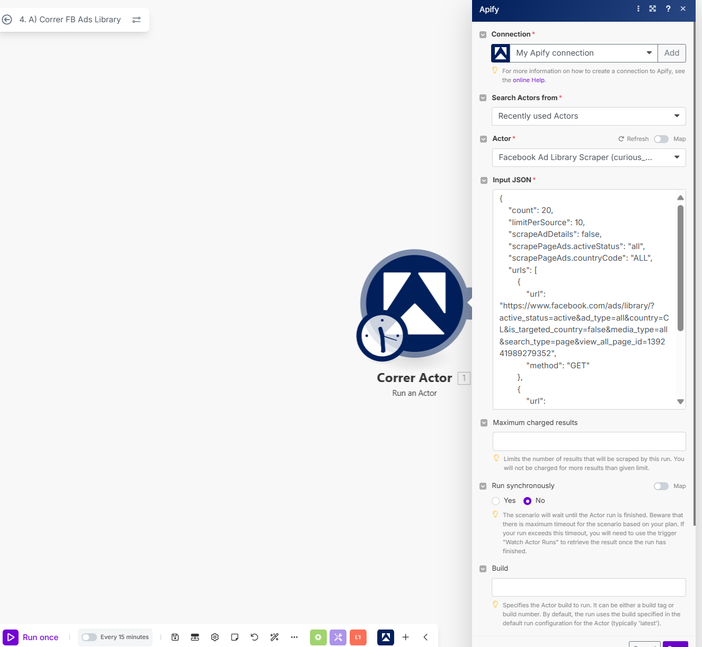

- define la **frecuencia** (diario, semanal, etc.). Listo, ese escenario dispara el scraper con tu configuración y deja los resultados en un dataset para el escenario 2.

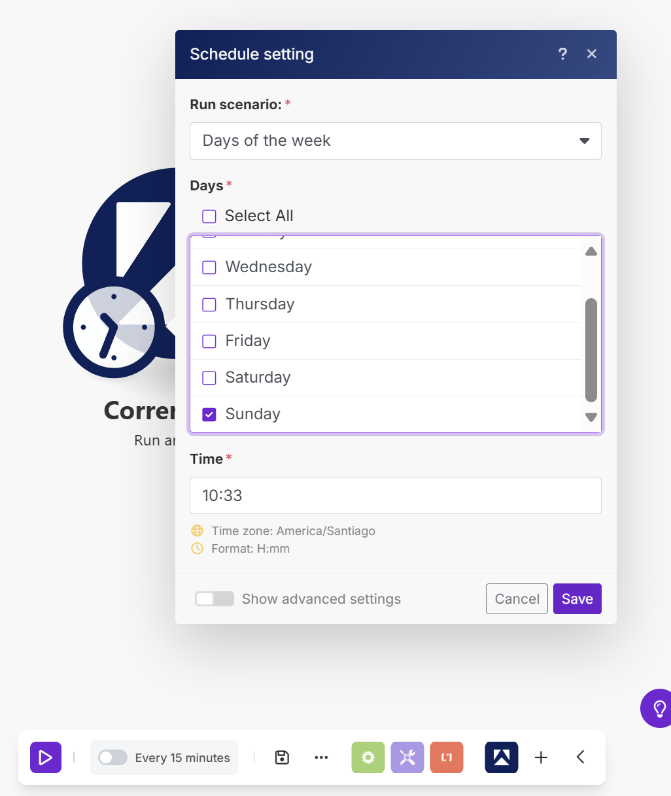

---

## Escenario 2 – Procesar, agrupar y enviar informe

#### El segundo escenario es donde ocurre la magia. Se compone de **cinco módulos**, cada uno con una función clara:

- **Mirar Actor** → Se activa cuando el scraper terminó de correr.

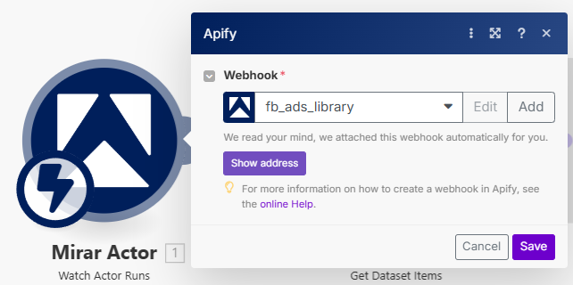

- **Extraer Ads** → Descarga los datos de la corrida (los anuncios capturados).

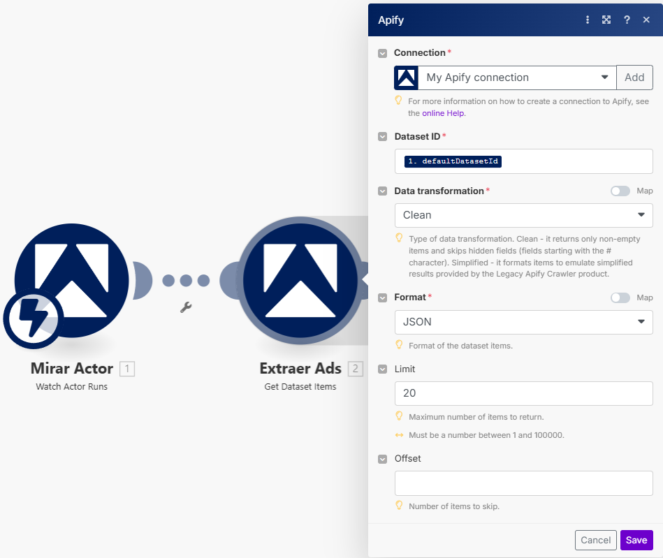

- **Agrupar en Texto** → Convierte los datos en un formato legible: ```
Página: {{2.snapshot.current_page_name}} URL: {{2.url}} Título: {{2.snapshot.title}} Link Description: {{2.snapshot.link_description}} Cuerpo: {{2.snapshot.body.text}} {{2.start_date_formatted}}
``` 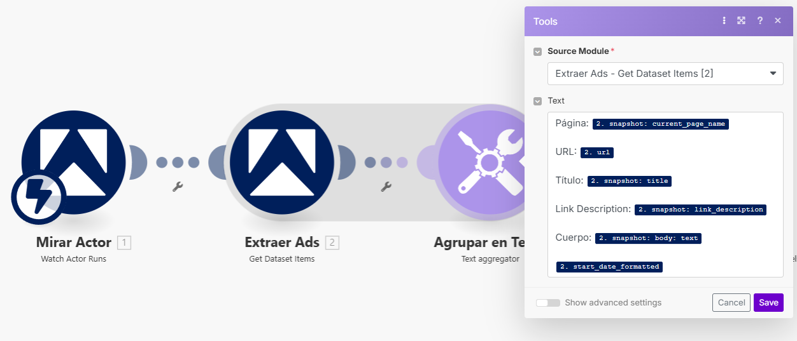
- **Clasificar + Redactar** → Con ayuda de IA, genera un **análisis de competencia en HTML**, evaluando qué están haciendo tus competidores, cuáles son sus enfoques y qué podrías replicar o diferenciar.

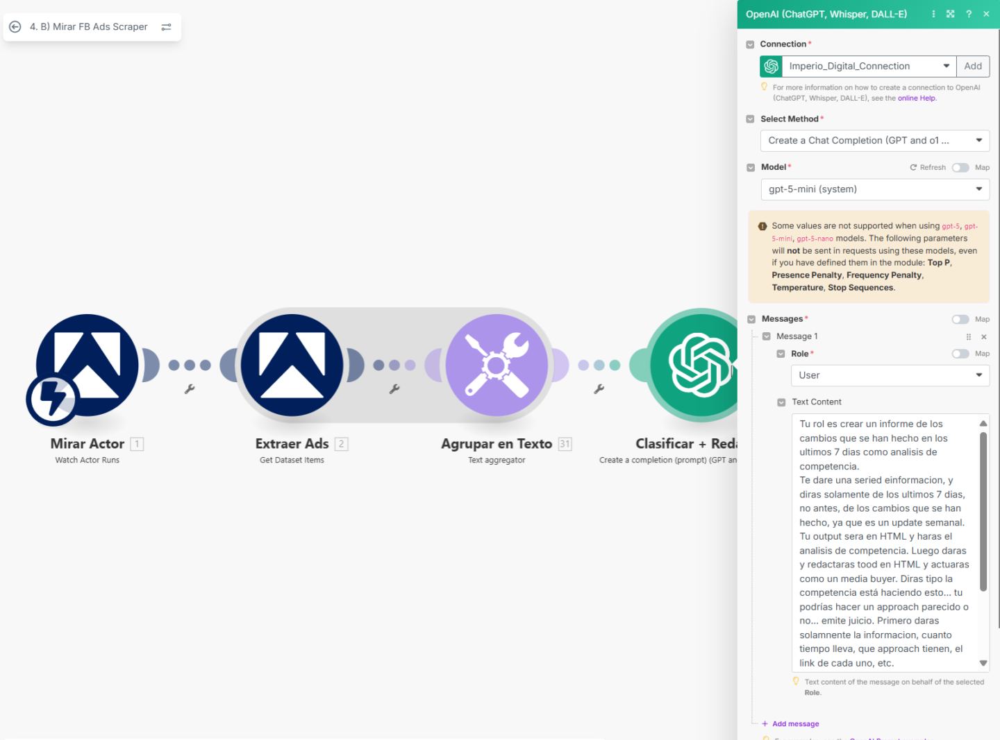

```
Tu rol es crear un informe de los cambios que se han hecho en los ultimos 7 dias como analisis de competencia.
Te dare una seried einformacion, y diras solamente de los ultimos 7 dias, no antes, de los cambios que se han hecho, ya que es un update semanal. Tu output sera en HTML y haras el analisis de competencia. Luego daras y redactaras tood en HTML y actuaras como un media buyer. Diras tipo la competencia está haciendo esto... tu podrías hacer un approach parecido o no... emite juicio. Primero daras solamnente la informacion, cuanto tiempo lleva, que approach tienen, el link de cada uno, etc. 

#Tu output sera HTML.

Contexto del contenido: {{31.text}}

Fin del contexto.
```

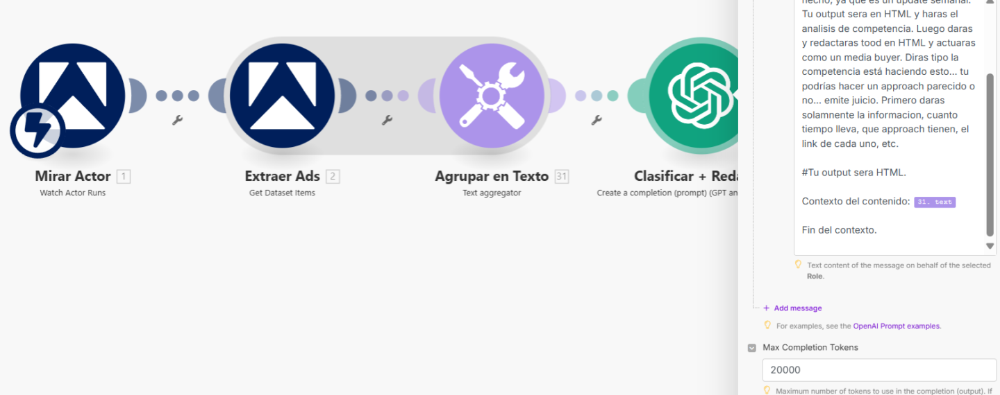

- **Enviar Correo** → Te manda el informe final por email, con asunto “Actualización Semanal Anuncios”.

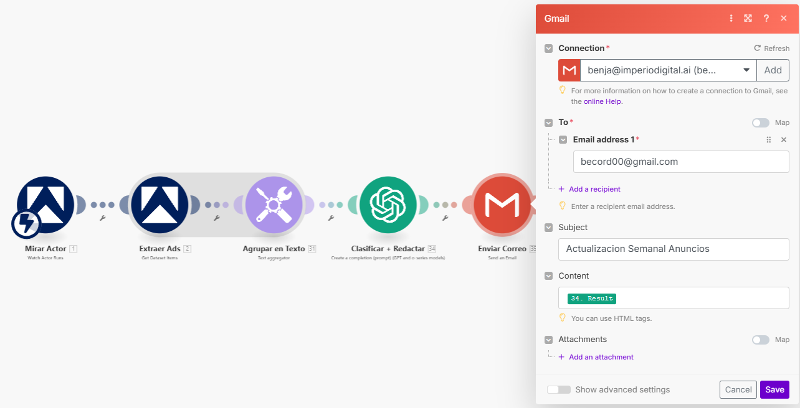

---

## El resultado: cada semana recibes un **resumen curado de lo que está testeando y publicando tu competencia**.

---

## ¿Para qué sirve esto?

- **Investigación de la competencia** → Entiendes su ángulo creativo, ofertas y frecuencia.
- **Monitoreo constante** → Te mantiene al día con cambios semanales en sus campañas.
- **Servicio para clientes** → Puedes empaquetarlo como un **servicio premium**: enviar reportes semanales de la competencia a marcas que quieran estar informadas.
- **Inspiración creativa** → Saber qué funciona (o qué no) en tu industria, para iterar más rápido.

## 🎙️ Transcripción

Este sistema que te voy a mostrar es probablemente uno de los sistemas más simples, pero más beneficiosos que vas a aprender en este último tiempo. Es realmente valioso. Sea porque lo quieres aplicar para tu caso, porque se lo quieres vender a alguien, esto que vas a ver es oro puro y para el final de este video vas a poder implementar este sistema completamente por tu cuenta. Uno de los libros que más me marcó es Roba como un artista de Austin Cleon. Y gran parte de el libro y la premisa del libro era de que no tenemos que reinventar la rueda, simplemente tenemos que copiar de muchos lugares las cosas que ya están funcionando, es decir, subirse al hombro de los gigantes, todos lo hacen y así no gastamos tanto tiempo y no gastamos muchos recursos en investigación. Y este sistema hace exactamente eso. Este sistema lo que hace es toma tus anunciantes favoritos, tu competencia o incluso tu nicho o palabra relevante y extrae todos los anuncios que están corriendo exactamente en los últimos 7 días de el nicho o de los anunciantes en específico. Entonces, puedo tomar a mis cinco principales competidores y puedo ver cuánto o mejor dicho, cuántos creativos tienen, cuáles son los creativos, cuál es el cuerpo de los creativos y qué es lo que están haciendo hoy día. Luego extraer toda esa data para poder trabajar directamente y ver cómo la podríamos aplicar nosotros a nuestro caso. Esto es super interesante, sea porque lo quieres hacer en tu negocio, porque quieres vendérselo a alguien más. Me imagino que en las industrias hiperproductivas o mega competitivas, mejor dicho, es superinesante ver qué es lo que está haciendo el resto, porque nos da información y data, que es muy pero muy muy valiosa. Y este sistema podemos elegirlo que nos mande un informe con la frecuencia que nosotros queramos. También podemos personalizarlo para que vaya anotándolo en una tabla de datos, vaya marcando cuál es el histórico, qué anuncios se han lanzado, cuáles se han quitado, en fin, se puede modificar como queramos, pero nosotros somos firmes creyentes de la ley de Gal. Todo sistema complejo es la evolución de un sistema simple que funciona. Y ahora te voy a mostrar ese sistema simple y cómo lo haría. La automatización se ve algo así. Te voy a mostrar rápidamente cómo es y el funcionamiento que está detrás. No sé si conoces, pero existe la biblioteca de anuncios de Facebook. Es la Facebook Ads Library, donde yo puedo llegar y puedo buscar qué está haciendo cada persona. Por ejemplo, si me busco a mí, voy a entrar acá, ven, corde, y vamos a poder ver todos los anuncios que yo estoy haciendo actualmente, que vendría siendo estos de acá directamente, 7 días gratis. Aquí estoy promocionando la comunidad, en fin, y me salen las fechas de cuándo publiqué cada uno. Así, si es que busco a cualquier persona, puedo buscar al Emilio Axis, por ejemplo, me va a salir lo mismo, cuáles son los anuncios que están corriendo. Puedo buscar a Lego y voy a ver los anuncios que está corriendo Lego actualmente. O incluso puedo buscar a Tony Robbins y puedo ver qué es lo que está haciendo esta persona. Pero no solo eso, porque también puedo buscar por nichos en específico. Entonces, voy a buscar inteligencia artificial, que debe estar lleno lleno lleno de publicidades y de cosas en específico. Y aquí me aparecen 6,000 resultados. Y en fin, creo que ya se entiende la idea, pero ¿qué es si pudiéramos construir un sistema que hace todo esto automático y te va reportando todos los cambios que hay en Licho en específico y de tus creadores favoritos y de tu competencia en específico de manera semanal? Eso es exactamente lo que vamos a hacer ahora. Entonces si quisiera ejecutaría esta automatización que lo acabo de hacer, que le di a correr y nos mandaría un reporte directamente al correo electrónico. Si es que entro acá, vamos a ir al inbox y me llegó el reporte en específico de la competencia que estaba viendo. Okay. Eh, después si es que hago clic acá puedo ver que en este caso estaba viendo haciéndola y estaba viendo los anuncios justamente ahí. Ahora te voy a enseñar cómo armamos todo este sistema. Está realmente simple y muy pero muy útil. Como puedes ver acá vamos a trabajar con dos escenarios. Los vamos a crear directamente en make.com. Make es la plataforma que usamos para crear flujos de trabajos automatizados. Entonces vamos a crear dos escenarios. El primero es el que ejecuta la automatización y manda un crawler o un actor a conseguir cierta información y el segundo se va a activar cuando recibamos esa información. De vuelta te lo explico con un diagrama. Vamos a usar la aplicación que se llama Apify, que es un programa que se ejecuta en la nube y pagamos solamente por el uso. Este lo podemos encontrar acá en el Facebook Ad Library y cada 1000 anuncios que sacamos pagamos solo 75 centavos. Imagínate el valor que puede tener este sistema y el roy que te puede dar realmente en base al costo que estás teniendo. Entonces, si es que entramos acá, vamos a pagar por el uso, vamos a ejecutar el actor en específico, en este primer escenario, como podemos ver acá, escenario uno, se va a empezar a correr el anuncio y después nos va a devolver la información para el segundo escenario en específico. Entonces, los escenarios se verían algo así. Y vamos a ver el caso de uso en específico. Existen muchos actores que podemos usar dentro de Apifi. Si es que entramos a.com y nos vamos a la store, vamos a ver que tenemos scrawers o scrapers específicos de lista de correos de Google Maps, de TikTok, de Instagram, de Amazon, de Google Ads. Tenemos muchos, muchos crepers. De hecho, tenemos más de 6,000 que ha construido la comunidad de Apify. Para este caso vamos a trabajar con uno que es el Facebook Ads Library. Lo podemos buscar acá. Y si no, también te dejé el link justamente acá. Facebook Ads Library. Una vez que estemos acá vamos a tener que poner cuáles son los que queremos trabajar directamente. Si quisiéramos podemos trabajar con uno, si quisiéramos podemos trabajar con dos, si quisiera podríamos trabajar con 10. Exactamente igual. Para este caso vamos a trabajar y vamos a sacar los anuncios de Emilio Axis. Gracias Emilio. Eh, si estáis viendo esto, vamos a descomponer tu funnel. Vamos a ir acá. Vamos a copiar el URL en específico con todos los anuncios y vamos a sacar estos 24 resultados o el número que queramos. Vamos a copiar acá. Si quisiéramos buscar por una categoría en específico, pondría acá marketing, por ejemplo, que deberían aparecer muchos, muchos anuncios también. y copiaría esto y lo pegaría justamente acá. Entonces, podemos buscar o palabra clave o podemos buscar en específico la persona o el anunciante. Quiero sacar en este caso 10, da igual. Y puedo correr esto de manera manual, es decir, correrlo una vez que lo haría acá y gastaría esto y me devolvería un Excel con el anuncio, el URL, quién lo publicó, cuál es el caption o el texto que va acá. Pero es un proceso muy manual. Ya yo quiero algo más automático, quiero que corra semanalmente. Entonces, vamos a crear la automatización para ello, pero en el caso de que quisiéramos hacerlo aquí, vamos a poder ver que tenemos la información con cuáles son los links, cuáles son los creativos en específico, etcétera. Okay, podría llegar y podría ir acá, exportar CSB o Excel, da igual, descargar y abrirlo justamente acá y nos aparecería toda la información con el cuerpo. comenta mensaje y te lo envío al DM. Si tienes una marca personal, si tienes Instagram, si no estás cerrando, perfecto. Entonces, tenemos toda la información, la fecha y todo, pero queremos crear una automatización a partir de esto porque no queremos estar haciendo esto de manera manual. Aquí es donde entran los actores y las automatizaciones que armamos en Make. Okay, vamos a irnos acá y nos vamos a ir al URL. Nuevamente lo vamos a pegar y después vamos a apretar Jason acá. Este código es el esencial con el que vamos a trabajar. Y recuerdas que dije que íbamos a trabajar con dos escenarios en específico? Bueno, eso es lo que vamos a hacer actualmente. Vamos a irnos acá al escenario o a make.com. Vamos a darle a escenarios y a crear un nuevo escenario. Esto lo voy a crear en la categoría principal y vamos a crear el nuevo escenario. Paréntesis, si es que estás en la comunidad de Imperio Digital, te dejé todo esto para que puedas llegar, descargar e importar. Además de una guía en específico con todo el paso a paso de lo que vamos a hacer, puedes entrar acá, literalmente, apretarlo, descargar, abrir un nuevo escenario, importar escenario A, y te aparece así, y abrir un nuevo escenario, importar escenario B, y te va a aparecer así. Después, simplemente, si le das correr te va a funcionar. Simplemente tienes que llegar acá, crear un nuevo webhook, elegir el actor en específico, darle a guardar y correr el escenario. Una vez que correso, ya estaría funcionando tu automatización, pero no te preocupes porque también vamos a ver paso a paso cómo la construimos. ¿Okay? Entonces, nos quedamos en escenarios. Justamente acá vamos a cerrar todo esto y crear un nuevo escenario. Vamos a irnos aquí donde sale y vamos a darle a run anor o correr un actor en específico. Vamos a buscar acá en recently used actors y vamos a buscar nuestro actor. Acá vamos a elegir el Facebook ad library scraper. Si es que no te aparece esto de acá, vamos a tener que ir acá, justamente donde estábamos, y vamos a darle a create task o vamos a ejecutarlo una vez. ¿Por qué? Porque si creamos el task y le damos a continue, se va a crear el task en específico y ahí sí lo vamos a poder buscar acá y nos debería aparecer acá una vez que le damos a refrescar. Okay, estando acá vamos a volver, vamos a irnos al Jason y vamos a copiar y pegar esto acá en el Jason, justamente aquí. Okay, estos son los parámetros que también podríamos modificar si es que queremos sacar más de 10. Vamos a sacar 20, 30, 40. Lo voy a dejar en 10 para que corra y funcione rápido, porque el resultado es el mismo. Y este vendría siendo el correr actor. Esto lo voy a guardar, le voy a cambiar el título, le voy a poner a2 correr Facebook Library y le voy a dar a guardar. Entonces ahora si es que corro esto de acá y entro a los runs o lo que se está ejecutando, justamente aquí podríamos ver que se está ejecutando y está corriendo. Es decir, mandamos al crawer o al bichito que camina o que gatea, mejor dicho, a extraer la data del Facebook Ad Library. Una vez que llegue y la extraiga, necesitamos recuperarla y ahí es donde se desencadena el escenario número dos. Podemos ver que se demoró 26 segundos. sacó 10 resultados y gastó 0,00075, o sea, no alcanzó a gastar ni siquiera un centavo en escraear todo esto. Eh, vamos a crear el segundo escenario y para ello vamos a abrir otro escenario nuevamente. Vamos a irnos arriba a la derecha a crear un nuevo escenario justo acá y nos vamos a ir a Watch Actor Runs o mirar escenarios cuando se ejecuten. Vamos a crear un nuevo webhook. Esto lo vamos a hacer apretando add aquí. y le vamos a poner el nombre que queramos. Para este caso le voy a poner versión dos. Mirar, Facebook Ads Library. Vamos a elegir el actor que elegimos previamente, que es el Facebook Ad Library Scraper. Y le vamos a dar a guardar y guardar este escenario. Entonces, va a ser el escenario B, que va a ser B versión 2, mirar Facebook Ads Library. Así es. Y entonces este va a estar mirando Facebook Ads Library Scraper. Ya, scraper, recordemos, es algo que va a buscar información. Después necesitamos extraer la data. Entonces, ya vimos que se ejecutó y se terminó de ejecutar el escenario. Después, lo que tenemos que hacer es extraer la data. Para ello vamos a irnos a Appify y vamos a poner get data items. El dataset ID es la ejecución en específica que nosotros acabamos de hacer, es decir, el ID en específico de este run en específico, el run. Okay, entonces vamos a apretar acá y vamos a bajar y vamos a buscar default dataset. El límite aquí es el límite de data que vamos a recuperar. Está bien, lo vamos a dejar en 100 y aquí es extraer datos o mejor dicho recuperar datos. El siguiente paso es agrupar todo esto en una variable. ¿Por qué? Porque actualmente, si es que corremos esto, vamos a darnos cuenta de que tenemos 10 bundles distintos y esto va a ser mucho. Un bundle es un grupo en específico de información y tener 10 grupos de información ejecutaría 10 veces la misma automatización. Entonces, queremos agrupar esos 10 grupos en un megagrupo. Y eso es lo que vamos a hacer con una herramienta que se llama el agregator. Vamos a verlo paso a paso. De todas maneras, si quieres conocer un poco más del aggregator, tenemos un curso dentro de Imperio Digital en específico que es make desde cero. Y aquí vamos cubriendo todas estas cosas como el justo está abierto el agregator que está acá y el cómo funciona esto si es que quieres entrar un poquito más a detalle en cómo funciona. Pero aquí podemos ver se recuperó en muchos grupos distintos, en bandles distintos y específicos. Entonces, aquí lo que tenemos que hacer es un text aggregator, es decir, juntar múltiples líneas en un mismo texto. ¿De dónde vamos a sacar la información? De lo que acabamos de recuperar. ¿Y cuál es la información que queremos? Bueno, queremos en específico, queremos el cuerpo, ¿verdad? Queremos el adid. Entonces, vamos a partir con la página, que vendría siendo la página, el nombre de la página, después el Ad ID, por si acaso, que vendría siendo este de acá en el caso de que lo queramos, el URL, el título, el link de la descripción o toda la información de la descripción y el cuerpo, ¿ya? El cuerpo, el título y todo eso lo puedes encontrar dentro de snapshot. Si te vas aquí a body puedes encontrar el texto y el resto de la información. ¿Okay? Una cosa clave es agregarle, a mi parecer el cuándo comenzó la fecha, porque cuando le agregamos eso, que vendría siendo el start date formated, tenemos parámetro y referencia de cuándo se hizo esta automatización o cuándo empezó a correr. A mí me gusta trabajar con cuáles son los siete los últimos 7 días. Si bien la información de las automatiza, o sea, perdón, de los anuncios que llevan más de 7 días es más valioso porque sabemos que es ganador, por así decirlo. Las que llevan más de 30 días. A mí me interesa crear un reporte con lo que está haciendo la gente, no lo que ya hizo. No sé si se entiende un poco. Ahora podríamos reformular esta oferta y decir, "Oye, te voy a mandar los anuncios ganadores que está teniendo la gente. ¿Cómo sé que son ganadores? Porque llevan más de 30 días corriendo." O podría ser el approach que vamos a hacer ahora, la aproximación de, te voy a decir lo que está haciendo la gente actualmente. Entonces, vamos a ponerle el start date, justamente acá. Vamos a darle a guardar. Vamos a agrupar anuncios. justamente acá estamos creando el texto y después vamos a crear un módulo de Open AI o cloud o lo que sea que estás usando que nos va a ayudar a estructurar y redactar el informe. ¿Okay? Esto lo vamos a hacer acá. Com en específico, yo estoy usando Open AI. Nuevamente puedes usar lo que quieras y vamos a elegir el modelo que sea de tu conveniencia. Para este caso, yo voy a usar el GPT5. Si no has hecho esta conexión aquí arribita de Open AI, es s simple. Simplemente le das a agregar, te vas a API Key, entras acá a platform. AI, te vas arriba a las llaves, creas una nueva API key la pegas justamente acá y le das a guardar. Después le vamos a crear el prompt en específico y le vamos a decir, eres un experto, anunciante o media Bayer. Tu misión es generar informes de los cambios que se han hecho en estos últimos 7 días. como análisis de competencia. Te daré una serie de información y dirás solamente de los últimos 7 días, no antes que cambios sean hecho, ya que es el update semanal. Tu output será en HTML y harás un análisis de conferencia. Luego harás y redactarás todo estéticamente muy atractivo y estéticamente muy atractivo. Dirás, tipo, la competencia está haciendo esto. Tú podrías hacer un approach parecido o no. Emite juicio. No seas amarillo. Primero harás solamente información. ¿Cuánto tiempo lleva? ¿Qué tienen? El link de cada uno, etcétera. Incluye URLs. Tu output será el cuerpo. Un correo en HTML estéticamente muy atractivo con uso de colores, lenguaje super cercano y natural. Contexto del contenido. ¿Cuál es lo que le vamos a dar? Bueno, el contenido que acabamos de agrupar. Okay, le vamos a dar acá completions. Se lo voy a subir por si acaso. Se lo voy a dejar en 20,000. Esto no siempre se cumple, pero muchas veces si sacamos muchos anuncios podría colapsar. Le vamos a dar acá a guardar. Esto va a ser redacción. de informe y finalmente lo vamos a mandar por correo. Esto lo vamos a hacer acá. Mandar correo electrónico desde el correo si es que no has hecho la integración con Google, con make.com tenemos un tutorial s super bueno aquí en Imperio Digital, que es este de acá, conexión más Google más make, donde Santi nos enseña paso a paso cómo hacer la conexión s super, bueno, no es complicado, pero si hay que seguir una serie de pasos. Okay, ¿a quién se lo vamos a mandar? Bueno, se lo vamos a mandar a penja@odigital. ¿Cuál es el subject? El subject va a ser esto, está haciendo tu competencia esta semana o reporte semanal, anuncios y el contenido va a ser el resultado que acabamos de crear. Okay, vamos a hacerle guardar. Vamos a guardar y esto es enviar correo. Perfecto. Vamos a ejecutar este escenario de acá y vamos a volver acá. Y esta vez vamos a hacerlo con un poco más. Vamos a hacerlo con 15. Okay, vamos a darle a guardar. Vamos a guardar y vamos a darle a correr. Y vemos que se reactuó el informe, se envió el correo y si es que entramos acá, vamos a revisar que esto es justamente aquí el informe. Okay, va a ser los nuevos anuncios. ¿Qué haría esta semana en específico? Bla bla bla bla bla bla. Cambios detectados en la semana. No se registran nuevos anuncios, pausas ni ediciones visibles. Vamos a verificar si es que está pasando todo esto. Ah, me tomó los anuncios de Haciéndola, no los de Emilio en específico. Entonces, vamos a volver a hacer esto en específico. Vamos a buscar acá el actor que vamos a correr acá. Y lo que cambió fue que estábamos con el ad antiguo. Entonces, vamos a volver aquí. Vamos a irnos al Adibrary. Verifiquemos cuál es el que está corriendo una vez más. Entonces voy a copiar este link, lo voy a reemplazar directamente acá. Recordemos que podemos hacer más de un link si es que quisiéramos. Le vamos a dar a guardar. Y ahora sí, vamos a correr la automatización. Esto está nuevamente corriendo. Vamos a esperar acá. Vamos a verificar que esté corriendo y esté haciendo el run. Y podemos ver que ahora sí se está ejecutando correctamente, ya que esta vez si nos extrajo todo la data de la página que le solicitamos. Y acabamos de ver que se completó la automatización. Y ahora nuevamente, si es que entramos al correo electrónico, nos vamos al inbox. Vamos a ver el reporte semanal de anuncios. Vamos a verificar que en los últimos 7 días no se ha publicado nada. Eh, vamos a extenderle esta cifra entonces porque o podríamos cambiar la anunciante en este caso, pero creo que lo vamos a simplemente cambiar la cifra porque en el fondo si estamos investigando acá, eh queremos investigar en este caso a la misma persona. Eh, así que nos vamos a ir acá a la redacción del informe y le voy a cambiar que sea no de 7 días, sino de 30. Okay. Eh, contexto de los últimos 30 días, guardar. Y vamos a volver a ejecutar el escenario una vez más ejecutar. Y ahora sí, si es que nuevamente entro al inbox, vamos a ver, vamos a hacer el reporte de los 30 días. Y ahora sí que sí, de los últimos 30 días te dejo un vistazo supercaro. Periodo analizado desde el 21 de julio al 20 de agosto del 2025. Anuncios activos analizados. Seis, excluimos los históricos. Eso está interesante. Esto si es que quieres, pero creo que es interesante poder hacerlo. Y con los respectivos links de cada uno. Si es que hacemos clic acá, nos va a mandar al Adibrary en específico y vamos a seguir bajando y revisando acá los anuncios que acaba de publicar. Creo que está superinesante, sin duda esto se puede seguir personalizando. Recordemos es que hay más variables que quisiéramos agrupar acá, como cuál es el call to action que usó, eh, cuál es el URL en específico, cuál es, no sé, absolutamente lo que quieras. Puedes seguir personalizándolo acá y puedes seguir jugando con esto. Sin duda esto es de muchísimo valor y si quieres dejarlo corriendo de manera automática y que semanalmente te mande estos reportes, voy a volver acá. Esto se lo voy a cambiar nuevamente a los 7 días en específico. Guardar. Y vamos a dejarlo automatizado para que se ejecute todos los días domingo. Okay, entonces vamos a irnos acá. Queremos que pase ciertos días de la semana y que solamente los días domingo a las No, en verdad no quiero molestar un domingo, prefiero un lunes ya, un lunes a las 8 a. Ya, la mejor hora posible para poder mandar un mail. Así que sí, ahora sí le daría activate a escenario y lo dejamos corriendo. Listo. Recordemos que si queremos agregar más URLs es tan fácil como llegar acá, irnos al Facebook Ads Library, buscar cuál es el otro que quiero hacer. Vamos a buscar a este ser humano que me han dicho que hace unas campañas de marketing increíbles, que también las vamos a copiar. Eh, vamos a entrar aquí, volveremos a Apify, agregamos el siguiente URL, copiamos este Jason y simplemente reemplazamos acá con las dos URL. Nuevamente si quisiéramos ejecutarlo, lo ejecutamos y esta vez me va a sacar los dos datos en específico. Si es que corremos la automatización, nos va a empezar a dar acá todos los bundles en específico, como estas son las de Emilio, estas son las deorde, únete 7 días gratis a la comunidad, no estás solo, etcétera. Okay. Nuevamente va a hacer la redacción del informe, agrupa los 50 textos publicitarios y nos lo manda al correo. Ahora sí que abrimos el correo. Vamos a ver el radar de la competencia de la ventana analizada. La única página con actividad fue Bencde y aquí está la variante de comunidad de automatizaciones. Verat library más de 800 automatizando. Atención técnica. ¿Qué haría yo? levantar una contraoferta temporal, prueba gratis o 14 días a uno onboarding. Bueno, estos son al final todos los ads que estoy corriendo en específico para Imperio Digital, que son es una campaña de retargeting en verdad de bueno, al final lo que hago es simplemente creo contenido orgánico en YouTube y después en Facebook estoy con una campaña fuerte de retargeting para toda la gente que entra y que llega a la landing page y a la out page de Imperio Digital. Ahora sí, sin más que decir, espero que este sistema te haya gustado, que te sirva. Sin duda es muy interesante si es que quieres espiar a tu competencia nuevamente subirte a los hombros de los gigantes. No tenemos por qué reinvertar la rueda. Podemos ver qué está haciendo la gente, qué les está funcionando, qué no y empezar a aplicarlo nosotros, sea porque lo quieres usar para ti o porque quieres vendérselo a alguien más como una investigación de competencia en específico. Ahora sí, sin más que decir, espero que tengas mucho, mucho éxito. Te deseo una feliz automatización y ya nos vemos.
