# 🧩Sistema IA para Crear Contenido Autom. en RRSS

> Ruta: Automatizaciones Make › 🧩Sistema IA para Crear Contenido Autom. en RRSS

**🎬 Vídeo (23.3 min):** https://youtu.be/K3Jg1J6uGXY

**📎 Recursos:**
- A) Correr Google News Scraper
- B) Correr Google News Scraper

---

## Cómo extraer, formatear y publicar noticias automáticamente con Apify + Make (IG, Facebook y LinkedIn)

La idea es simple: buscamos noticias sobre un tema específico, armamos un post listo para redes y lo publicamos en Instagram, Facebook y LinkedIn con su imagen oficial y fuente. Todo corre solo, a la frecuencia que quieras.

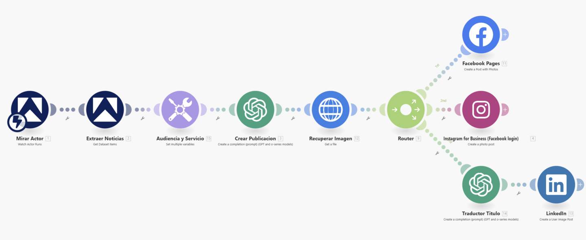

# Paso 0 – Habilitar el actor en Apify

Antes de construir nada en Make, tienes que habilitar el actor en Apify:

1. Entra al actor: [Google News Scraper – Input JSON https://console.apify.com/actors/eWUEW5YpCaCBAa0Zs/input](https://console.apify.com/actors/eWUEW5YpCaCBAa0Zs/input)
2. Haz clic en **“Create Task”**.
3. Esto creará una tarea asociada a tu cuenta y hará que el actor quede disponible en [Make.com](http://Make.com).

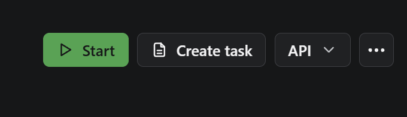

1. Esto creará una **tarea asociada a tu cuenta** y hará que el actor esté disponible después en [Make.com](http://Make.com).

---

## Escenario 1 — Ejecutar el scraper

1. En la configuración del actor verás un campo llamado **searchQuery**. - Ahí escribes el tema o palabra clave que quieras buscar (ejemplo: “inteligencia artificial”, “marketing digital”, “ChatGPT”).
- Si quieres algo más amplio, pon un término genérico o un "tópico".

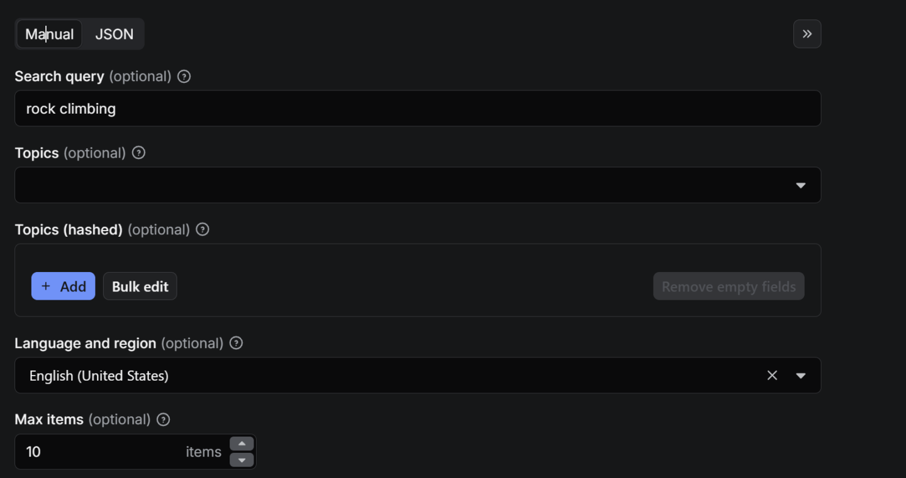

1. Haz clic en **JSON** y copia todo el código que aparece.

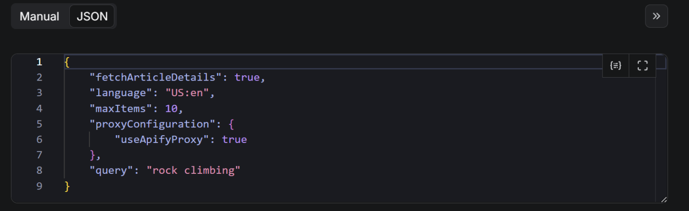

1. En **Make**, crea un escenario con el módulo **Run Actor**. 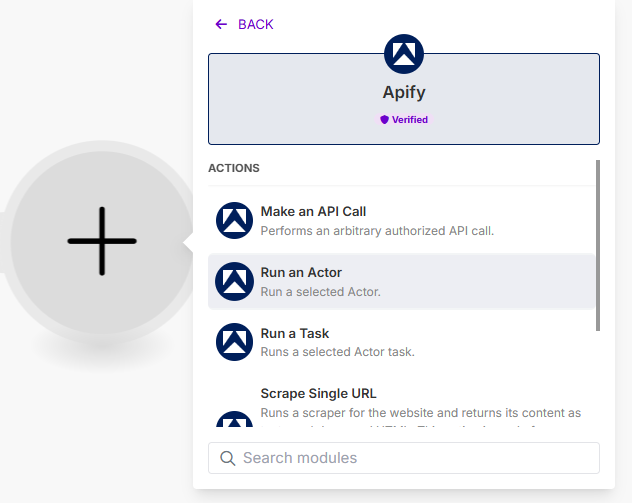 - Pega ese JSON en **Input**. 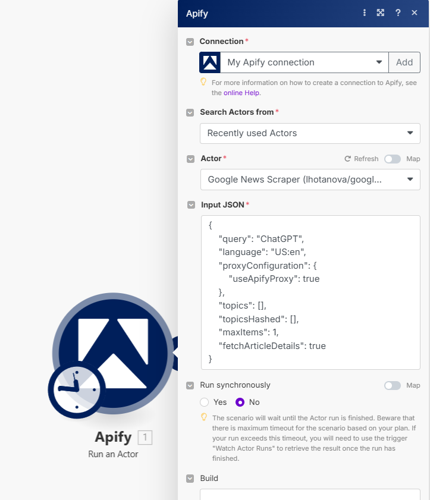 - Define cada cuánto quieres que se ejecute (todos los días, una vez por semana, etc.).

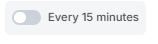

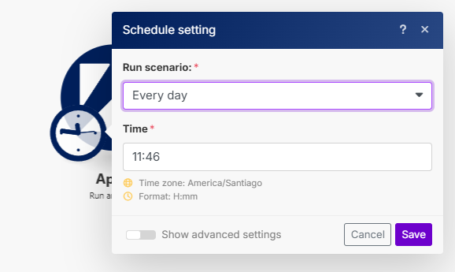

## Escenario 2 — Mirar resultados y publicar

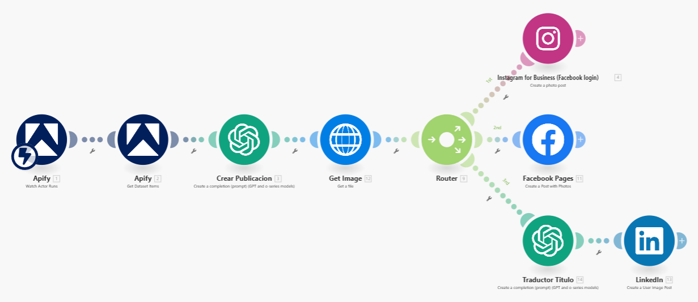

Cuando el scraper termina, este escenario recoge los datos y los convierte en publicaciones:

- **Webhook**: se activa cuando el actor acaba de correr.

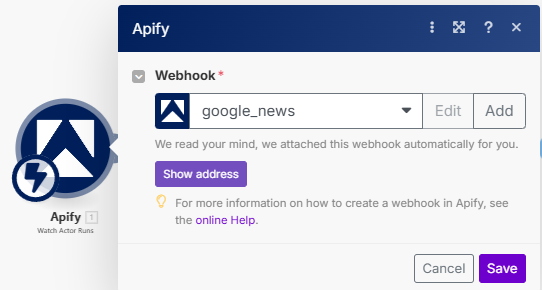

- **Get Dataset Items**: trae las noticias con título, fuente, link y la imagen oficial.

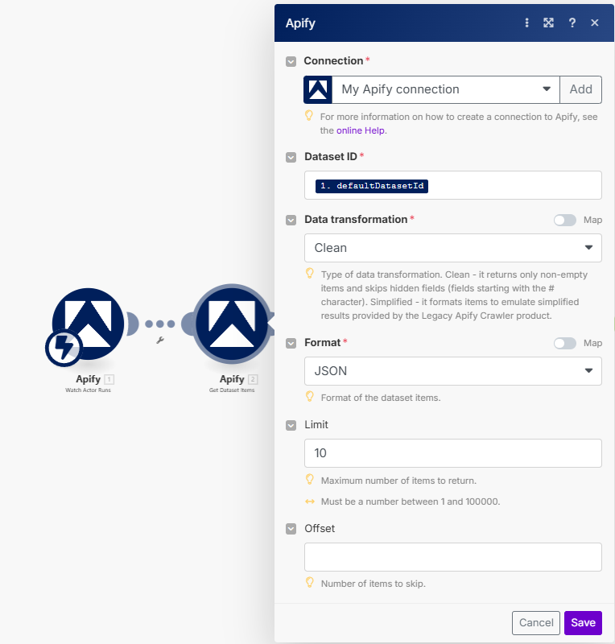

- **Generador de texto (IA)**: arma el texto del post con la noticia y cita la fuente.

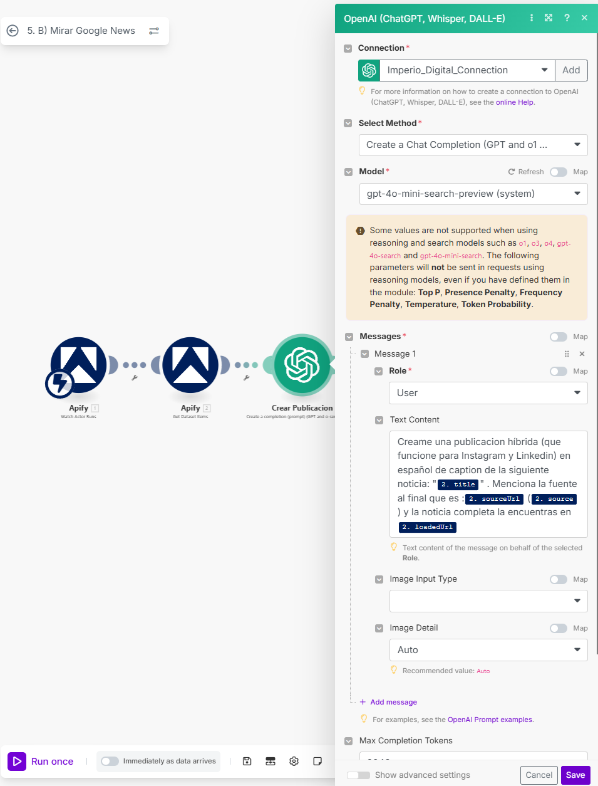

> Creame una publicacion híbrida (que funcione para Instagram y Linkedin) en español de caption de la siguiente noticia: "{{2.title}}" . Menciona la fuente al final que es :{{2.sourceUrl}} ({{2.source}}) y la noticia completa la encuentras en {{2.loadedUrl}}

- **Descargar imagen**: baja la foto oficial de la noticia (get a file)

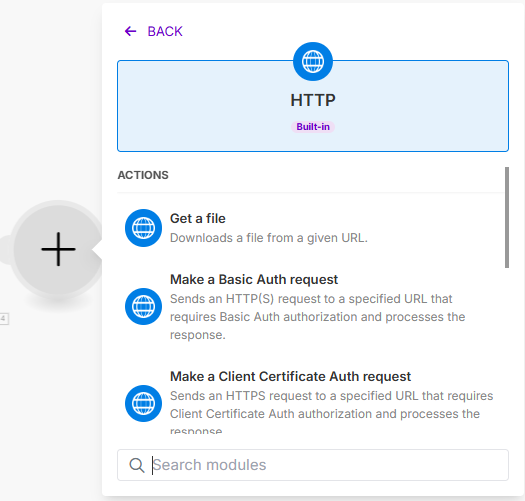

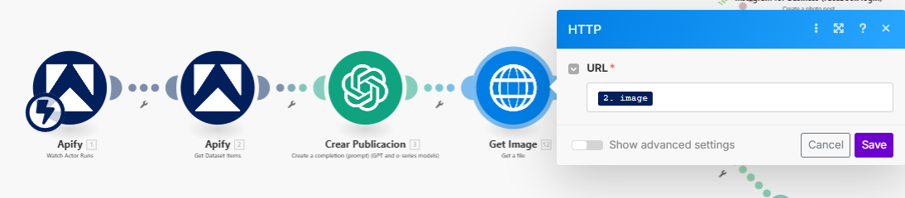

- **Publicar en redes**: el sistema sube el post a Instagram, Facebook y LinkedIn en paralelo.
- **Router** → Divide el flujo en tres caminos: 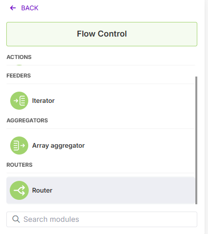 Los caminos: 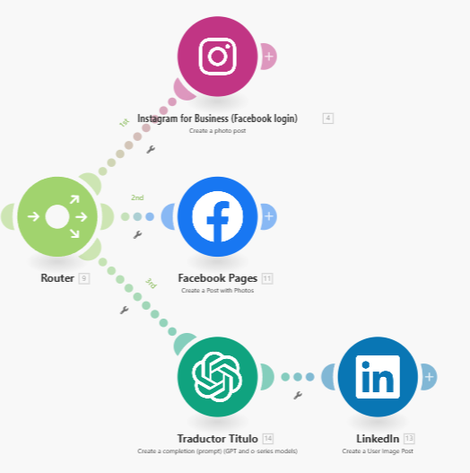 - **Instagram for Business** → Publica la noticia como foto con texto. 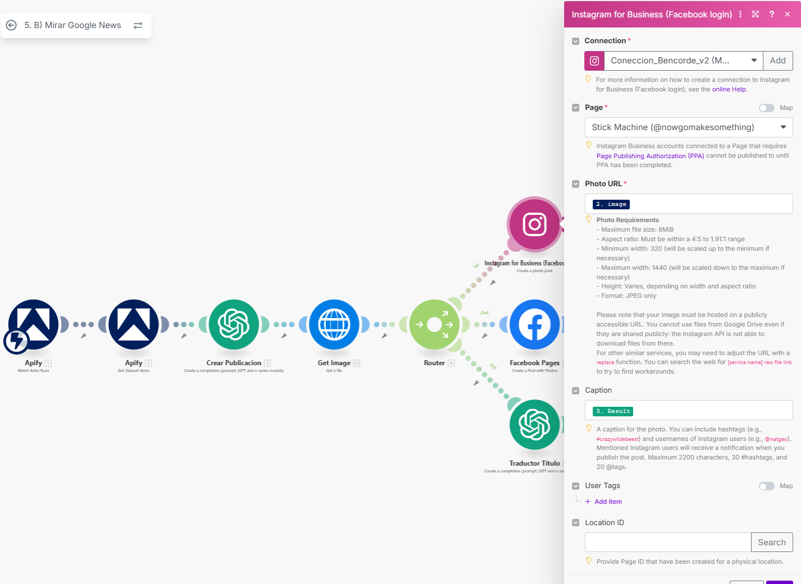 - **Facebook Pages** → Crea un post con la imagen y el texto generado (ahá, aqui si usamos el get a file). 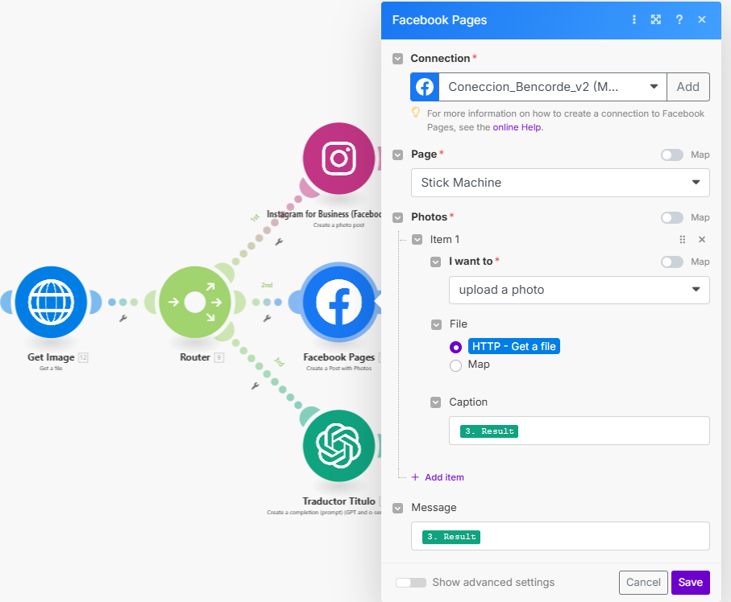
- **LinkedIn** → Antes de publicar, pasa por un módulo **Traductor Título (IA) que es un modulo de ChatGPT Create a completion** para adaptar o traducir el título,

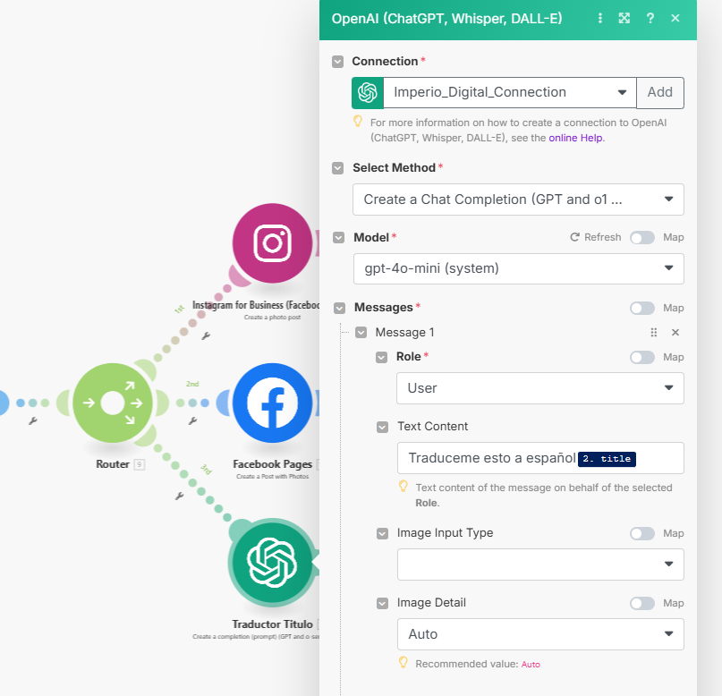

 y luego crea el post en LinkedIn

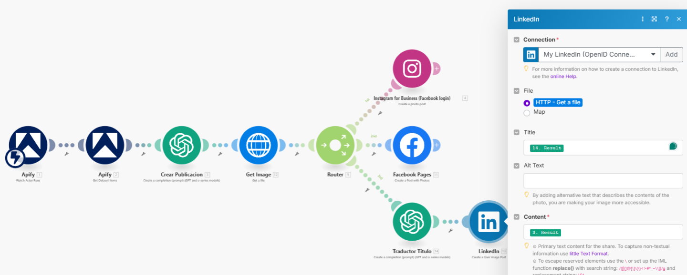

---

## Qué consigues

- Publicaciones listas y automáticas en **3 redes sociales**.
- Siempre con la **imagen oficial de la noticia**.
- Flexibilidad: eliges el tema y la frecuencia.
- Ahorro de tiempo: todo se publica sin que tengas que entrar a cada red manualmente.

---

Más simple imposible: pones tu palabra clave, copias el JSON, lo pegas en Make y ya tienes noticias transformadas en contenido que se publica solito.

## 🎙️ Transcripción

Sabemos que lo último que quieres después de un largo día de trabajo es sentarte a ver qué es lo que vas a publicar en cada red social. Y eso es exactamente lo que soluciona este sistema que estás viendo en pantalla. El sistema es s simple donde cada vez que se publica una nueva noticia con la frecuencia que tú quieras, toma la noticia y la adapta para expresársela a tu audiencia objetivo. Después crea una publicación, descarga la imagen original y se publica en las redes sociales que quieras como Facebook, Instagram o Linked. El sistema es realmente simple de usar y te voy a mostrar paso a paso para que al final de este video ya lo puedas implementar y lo tengas corriendo por tu cuenta. Para este caso le personalicé que quería hablarle a adultos mayores que quieren aprender en un tono en específico y tenemos un servicio de venta de un curso. Entonces, si es que corriese este escenario una vez y corriese este escenario una vez, el sistema verificaría que se escribió una noticia en específico de inteligencia artificial. Después tomaría la audiencia a la que nos queremos dirigir, el tono el que queremos, cuál es el servicio que tenemos y comenzaría con la redacción. Después subiría esto a Facebook, como podemos ver acá, lo subiría a Instagram y finalmente lo subiría a Linkin. Y esto lo podemos verificar si es que se está corriendo, si es que entramos a Linkin y actualizamos nuestro perfil, justamente acá vamos a ver el feed, vamos a irnos al inicio y aquí está la publicación, justamente está de acá con la original. La voy a eliminar porque no quiero publicarla en este momento. Y si hacemos lo mismo acá en Instagram, va a ser exactamente lo mismo. Esta es mi cuenta de prueba y si es que entramos a Facebook va a ser nuevamente exactamente lo mismo. Esto lo podemos dejar corriendo con la frecuencia que nosotros queramos. Por ejemplo, que corra todos los días a las eh, no sé, 3 de la tarde, por así decirlo. Darle a guardar, quedaría prendido y ya estaría listo. Esto es así de simple. Te voy a mostrar paso a paso ahora cómo lo armaríamos, pero si es que quieres importarlo directamente y no quieres el paso a paso de armarlo, puedes entrar en Imperio Digital, aprietas acá, descargas la plantilla, entras acá, descargas la plantilla, creas un nuevo escenario y la importas. Así de simple. Ya va a estar listo para que puedas empezar a usarla por tu cuenta. Simplemente rellena y cambia algunas variables de acá. Si no conoces lo que es Make, Make es la plataforma que usamos para crear los flujos automatizados, es decir, los flujos de trabajo y las automatizaciones las vamos a armar en make. Vamos a armar todo esto nuevamente paso a paso y para ello es necesario que entiendas que vamos a usar estas dos aplicaciones. Primero, make para los flujos de trabajo y segundo, APIF para extraer las noticias en específico con las que queremos trabajar, porque queremos que se vaya publicando esta noticia en tiempo real y que sea adaptado para la audiencia que nosotros queremos dirigirnos a. Hemos visto en videos anteriores que es muy importante profundizar en los dolores, entonces podríamos hacer exactamente lo mismo acá para eventualmente llegar a vender algún servicio. Entonces, vamos a entrar a primero apify.com. Cuando entremos acá nos va a aparecer una interfaz, algo así. Vamos a iniciar sesión. Y si nunca has usado Apify o no conoces lo que es, Apify te permite ejecutar actores o programas en la nube y después recuperar esa data. Así de simple. Aquí creé un pequeño gráfico que explica cómo se usa. Cada vez que ejecutamos un actor en Apify, le pedimos que vaya a buscar cierta información y después que nos la devuelva. El pago que hacemos es por uso, es decir, si queremos sacar una noticia, vamos a pagar por la noticia en específico. Eh, si queremos sacar 10 publicaciones de algo, vamos a pagar por esas 10 publicaciones. Y generalmente pagamos fracciones de centavos, pero para este caso es un poco distinto. Ya te voy a explicar por qué. Entonces, cada vez que lo ejecutamos tenemos una entrada que sería correr este actor, después empezaría a buscar la información y después se devolvería. Entonces, serían estos dos escenarios en específico y después se empieza a ejecutar la automatización. Okay, entonces vamos a entrar a buscar un actor en específico. Vamos a irnos a la Apify Store y vamos a buscar el Google News Extractor. ¿Por qué queremos usar el Google News Extractor o Google News graper? porque este nos va a ir avisando cada vez que hay nuevas noticias en específico. Alternativamente y en ocasiones anteriores usamos un sistema que se llama RSS, que nos permite también extraer toda esta información y trabajarlo de la misma manera. Este es otro método en el que podemos hacer lo mismo y que además podemos tomar la misma imagen y publicar la misma imagen. Entonces, esto es realmente valioso. Cuando entres acá vas a darte cuenta que me está cobrando $20 al mes, pero también puedes aplicar a los 7 días gratis y si sientes que es algo que te interesa después puedes empezar a pagarlo o te vas cambiando cada 7 días, pero creo que eso sería mucho esfuerzo. Entonces, vamos a hacer esto en específico. Este Google Newscraper, por ejemplo, si quisiera buscar algo como rock climbing o escalada y quiero recuperar cinco noticias, podría ejecutarlo y me devolvería las cinco noticias en un formato CSB o en un formato Excel, pero lo que quiero hacer yo es meterlo dentro de las automatizaciones y es por eso que vamos a incluirlo en Make y vamos a ejecutar lo que se conoce como un JSON. Esto nos va a permitir al final extraer esta data y poder trabajar con esta data continuamente sin que nosotros tengamos que estar haciendo esto de manera manual. Entonces, si quisiéramos correrlo de manera manual, podríamos apretar ese botón y aquí nos daría esta información que vendría siendo al final el link en específico, qué es lo que es y cuál es la información que si quisiera podría exportarla y descargarla como un Excel. Una vez que la abra se abriría y sería algo así. dónde tenemos la imagen, el título, en fin. Okay, pero esto no nos sirve para este caso porque lo que queremos hacer es trabajarlo de manera automatizada. Entonces, vamos a volver acá al actor y vamos a darle acá donde sale create task, arriba a la derecha, le vamos a darle a continuar. Y la razón por la que estamos haciendo esto es porque queremos eventualmente poder comunicarnos con Make. ¿Cómo nos comunicamos con Make? Bueno, si nos vamos acá y apretamos el Jason, aquí paréntesis podemos modificar los parámetros que queramos, pero si apretamos el Jason podemos copiar y pegar esto en make y esto va a ejecutar el actor. Tenemos dos escenarios en Make que se van a ejecutar. El primero es el que manda la información y el segundo es el que recibe la información. Entonces vamos a crear un nuevo escenario acá. Nuevamente nos vamos a ir a crear escenario, también lo puedes importar desde Imperio Digital, pero si es que no lo puedes hacer conmigo. Te vas donde sale Apify y te vas a Run anor, es decir, conectar un actor. Si es que no has conectado tu cuenta de Appify, lo puedes hacer apretando agregar acá y creas la conexión directamente con API. Aquí vamos a seleccionar el actor en específico y vamos a copiar y pegar lo que vimos anteriormente, es decir, el código Jason que aparece acá. Okay, vamos a darle a guardar y esto vendría siendo correr actor. Esto vendría siendo la versión dos del primer escenario que creamos y sería el a de correr Google News scraper. Entonces ahora si es que llego y modifico algún parámetro, por ejemplo, quiero que solamente me extraiga una noticia y de qué, bueno, no de rock climbing, sino quiero de, no sé, inteligencia artificial o lo que sea que publique noticias, puedo darle a guardar y correr. Y vamos a ver cómo se empieza a ejecutar esto actualmente en la nube. Aquí está el crawler haciendo lo suyo. Está yendo a buscar noticias con artificial intelligence por orden descendiente de fecha de publicación y la acaba de recuperar. Entonces, si es que entramos acá a los runs, vamos a poder ver que efectivamente recuperó acá esta noticia eh, que vendría siendo Opinion Artificial Intelligence phones de New York Times con la fecha, etcétera. Okay, entonces una vez acá ya tenemos el primer escenario creado, ahora tenemos que hacer el segundo que se va a desencadenar exclusivamente cuando se termine de ejecutar un escenario. Entonces, para ello vamos a volver a ir a make, nos vamos a ir a los escenarios y vamos a crear un nuevo escenario nuevamente. Una vez acá vamos a buscar Apify. Acá vamos a buscar la parte que sale watch actor runs, es decir, que cada vez que corra un actor o que se complete el actor al que le mandamos a buscar información, eh se desencadene esta automatización. Vamos a poner add al lado de add a new hook y vamos a ponerle el nombre que queramos. Para este caso va a ser versión 2 watch Google newscraper. Podemos ponerle cualquier nombre y lo importante es que elijamos el actor que previamente elegimos aquí, ¿okay? Que sería guardar y guardar. Okay. Entonces este al final está ejecutando el actor, que vendría siendo este actor de acá, y cada vez que se ejecuta va a desencadenar esta automatización que está acá. Entonces esta va a estar mirando al final si es que el actor se ejecuta. Entonces si es que el actor se ejecuta, este también le va a cambiar el título. Queremos que recupere la información en específico del actor que se ejecutó porque pueden ejecutarse muchas acciones al mismo tiempo, pero necesitamos recuperar alguna en específica. ¿Cuál es la que queremos recuperar? Bueno, vamos a irnos a get dataset items y queremos recuperar la que desencadenó inicialmente esta automatización. que vendría siendo el default dataset que aparece aquí. Eh, el límite se lo vamos a dejar. En este caso, yo quiero publicar uno, así que se lo voy a dejar en uno. Adicionalmente también podrías sacar más noticias y elegir la más relevante, pero nuevamente ley de Gal, todo sistema complejo, es la evolución de un sistema simple que funciona. Estamos en lo simple y después lo vamos complejizando. Entonces, miramos la ejecución del actor en específico. Perfecto. ¿Qué es lo que sigue? Necesitamos extraer la data en específico, el URL, la imagen, todo. Entonces, aquí estaría mirando la ejecución y después estaría extrayendo la data. ¿Cuál sería el siguiente paso lógico? Queremos crear la publicación. Entonces, vamos a agregar acá, vamos a irnos a Open AI y vamos a elegir create a compion. Esta parte es interesante y si es que nunca has trabajado con este tipo de módulos, bueno, lo que estamos haciendo es estamos integrando la tecnología o el modelo de Chat GPT, específicamente los modelos de Open AI y estamos integrándolos con las variables que acabamos de recuperar. Entonces, vamos a irnos acá y vamos a elegir el modelo que queramos. Para este caso creo que vamos a usar el GPTS5 Mini o el GPT5 nano. Da igual, creo que los dos deberían funcionar bastante bien. El nano si quieres más velocidad, el mini si quieres un poquito menos de velocidad quizás un mejor resultado. Y si es que no te aparece esto de acá, puedes conectar tu cuenta de Open AI apretando agregar acá, entrando a platform. Openai y buscando aquí a la izquierda donde sale API Kys. Creas una nueva llave y después la copias y la pegas directamente acá. Okay. Una vez que estemos acá, necesitamos agregarle un mensaje y necesitamos decirle algo por el estilo de redacta una publicación para x persona, ¿verdad?, que hace x bla bla bla. Okay, aquí podríamos eh directamente empezar a rellenarlo, pero lo que podemos hacer también es prerrellenar con algunas variables. Necesitamos trabajar con las variables de específicamente, cuál es el título, cuál es la noticia, ¿verdad? ¿Cuál es la imagen? Todo eso necesitamos tenerlo. Y si es que no te aparece acá para llegar y prerrellenar, en este caso voy a dejar el nano mensaje usuario y le voy a dar a guardar. Acá si es que no te aparecen las variables para prerellenar es porque tenemos que ejecutar la automatización por lo menos una vez. Entonces, le vamos a dar a correr y necesitamos ejecutar nuevamente este actor aquí. ¿Por qué? porque queremos poder mapear las variables en este nuevo escenario. Si no, no nos van a aparecer porque no saben en el fondo qué tipo de información estamos recibiendo específicamente. Una vez acá vamos a esperar a que se ejecute el actor y después de unos segundos podemos ver que me devolvió efectivamente el título, el link, etcétera. Entonces, ahora sí podemos empezar a trabajar con estas variables. Entonces, ahora que ya tenemos la información, podemos empezar a reemplazar directamente aquí. Vamos a eliminar todo esto y vamos a ejecutar el prompt. Una pequeña corrección, no vamos a usar el modelo GPT5 porque necesitamos acceso a la web, es decir, necesitamos darle la noticia para que pueda scrapear o sacar, seleccionar directamente la data. Entonces, por ejemplo, esta es la noticia de ejemplo y vamos a ir acá y ahora sí podemos empezar a armarle el prom. Necesito redactar una noticia para aquí. Le voy a poner audiencia. Okay, en el tono de, no sé, aquí tono lo que estoy haciendo aquí, estoy haciendo variables, pero simplemente para poder reemplazarlas de la noticia siguiente que vendría siendo el link. Okay. Y ahora sí le voy a dejar título, que vendría siendo el título y el link que vendría siendo el link. Analiza el link y luego dame un output. Ahora sí, eres un experto copywriritter. Tu audiencia es audiencia, tu tono será tono, tú eres empresa. Y el título es, okay, esto lo voy a eliminar directamente. Y solamente mapeamos y pusimos cuál era el link y cuál era el título, ¿verdad? A mí me encanta hacer las plantillas completamente customizables, es decir, editables, para que después cuando las importo sea más fácil de llegar y empezar a editar. Pero aquí tú podrías llenar como mi audiencia es hombres de xxx que tienen el dolor de Yasit, pero para poder subírtela que sea un poquito mejor, yo prefiero trabajar las variables afuera. Entonces voy a correr esto hacia al lado. Esto nuevamente es redactar el copy o redactar al final el gráfico, el caption, perdón. y vamos a agregar un módulo. Clic derecho, agregar módulo. Vamos a buscar variables. Y vamos a setear múltiples variables. ¿Cuáles son las variables que queremos tener? Bueno, partamos con audiencia. Entonces, aquí le voy a poner hombres, adultos, mayores, que quieren aprender tecnología, pero no son técnicos, por lo que el uso de metáforas y simplificación es esencial. Después, nombre de la variable. La otra va a ser tono, va a ser tono cercano, natural y poco técnico, muy simplificador lo voy a poner. Y finalmente lo voy a poner acá empresa servicio porque me gustaría hacerle una bajada a los servicios que tengo en el caso de que se pueda. Y va a ser, vendes talleres presenciales de inteligencia artificial para adultos mayores que no quieren quedarse atrás, pero que no son técnicos, casos de uso práctico. Okay, vamos a darle a guardar y ahora sí podemos volver a poner las variables que acabamos de crear. Entonces, tu audiencia acá es eso. Nuevamente lo puedes rellenar aquí mismo. Tu audiencia es audiencia. Tu tono va a ser el tono que le pusimos y tú eres empresa y servicio. Tu output solo será el texto del caption, solo si es posible harás una bajada para tu servicio. Recuerda que lo principal es la noticia. Harás la bajada al final solo si es posible. Voy a poner. Okay. Entonces, aquí le vamos a dar a guardar y esto van a ser las variables del servicio. Entonces ahora si es que guardamos y volvemos a ejecutar todo una vez más, es decir, le doy a correr, vamos a ver que va a empezar a redactar el copio. Acá Google ha presentado su nueva línea de smartphone, bla bla bla bla bla bla bla. Si deseas aprender a usar estas tecnologías, perfecto. Ya. Entonces, acá vamos a, bueno, esto me encanta, es apretar el botón de auto aline para alinear todo. Cada vez que lo aprieto me da una paz mental ahí cada vez que tengo todo esto así, ta. Entonces, acabamos de redactar el copi en específico para estas personas que están sintiendo el dolor. ¿Cuál es el paso siguiente? Bueno, necesitamos extraer específicamente la imagen que vamos a publicar. Para eso vamos a usar un módulo ser simple que se llama get a file. ¿Okay? Esto es http. ¿Y cuál es el file que queremos conseguir? Bueno, la imagen que acabamos de generar. Entonces, esto va a extraer la imagen. ¿Por qué va a ser esencial esto? porque vamos a necesitar la imagen para publicarla en distintas redes sociales. Por ejemplo, si es que nos vamos acá y agregáramos Facebook, nos va a pedir cuál es la imagen y cuál es el caption o el texto que quieres publicarlo. Pero queremos publicarlo más de una red social en paralelo. ¿Cómo lo haríamos? Bueno, existe un módulo que se llama el router. El router te permite separar al final estos escenarios o estas líneas, perdón, en distintos caminos. ¿Cuántos queremos hacer? Bueno, queremos hacer tres. Quiero publicarlo en Facebook primero, create a post with photos, si no me equivoco era este. En fin, vamos a elegir la página acá. Para este caso voy a elegir Stick Machine. Y aquí es donde vamos a seleccionar la foto. Así que para eso usamos este módulo, porque acá podemos ir y ponemos http get a file. ¿Cuál es el caption que queremos? Este que está acá, es decir, el resultado que acabamos de generar acá. Y esto va a ser todo acá. Y vamos a darle acá a guardar. Potencialmente también lo podemos poner aquí. Entonces esto vaase publicar en Facebook. Después queremos hacer lo mismo en Instagram. Aquí vas a necesitar ser Instagram for business, es decir, que tu cuenta tiene que estar en modo empresa. Y vamos a poner create a photo. Vamos a seleccionar la cuenta con la que queremos trabajar. En este caso quiero hacerlo con esta de prueba. En foto URL vamos a poner la foto que es este link que aparece acá, justamente el URL y en el caption vamos a ponerle este resultado anterior que nos dio. Así de simple. Y le damos a guardar. Vamos a renombrarlo y le vamos a poner publicar en Instagram. Y finalmente vamos a querer hacer la publicación en LinkedIn. Entonces vamos a ir acá nuevamente, vamos a buscar LinkedIn y vamos a poner si quisiéramos crear solo texto sería create a user text, pero también como queremos ponerle publicación de imagen, vamos a poner create a user image post. Okay. ¿Cuál es la imagen que vamos a publicar? Bueno, el get file que hicimos anteriormente. ¿Cuál es el contenido que queremos? Bueno, es el contenido que está acá, como lo queremos público y lo queremos en el main feed. Alternativamente, si quisiéramos agregarle un título aquí, probablemente agregaría quizás un módulo más, justo acá, y después iría a Make AI Tools, a el módulo de Translate Text, ¿ya? Eh, make AI Tools, super útil, que funciona bastante bien. Puede ser translate text o quizás también puede ser request anything. request anything podría ser como tradúceme este texto y que sea esto. O si quieres también hacer el translate textar un módulo, make AI tools y cómamos el translate text que funciona bastante bien también. Text to translate, ¿cuál es? Bueno, el título que queremos y lo queremos en español. Entonces, le vamos a dar a guardar. Y ahora sí, el título que nos generó acá podemos ponerlo acá en translation. Okay, vamos a darle a guardar. Y esto sería publicar en LinkedIn y esto sería traducir texto. Así de simple. Vamos a autoalinearlo. Y ahora debería estar funcionando esta automatización que estás viendo en pantalla. Vamos a verificarlo. Vamos a darle a guardar. Vamos a guardar. Y esto en el fondo, si quisiéramos correrlo una vez por día, le pondríamos everyday a las eh 15 horas, no sé. Vamos a darle a guardar. activaría el escenario y se ejecutaría todos los días a las 3. Pero vamos a darle por fines prácticos una vez esta automatización, le vamos a dar a correr una vez y ahora se debería estar ejecutando justamente aquí podemos ver que efectivamente está corriendo. Eh, lo ejecuté dos veces sin querer, pero en fin. Eh, vamos a empezar a correrlo y aquí deberíamos empezar a recibir la información. Recibimos la información, rellenamos las variables en específico y debería publicar aquí en Facebook si es que hicimos todo bien. Vamos a ver. Publicado en Facebook, perfecto. Publicado en Instagram, perfecto. Traduciendo texto. Y ahora publicado en LinkedIn. Y si es que entro ahora a LinkedIn, vamos a poder ir al perfil y vamos a actualizar y vemos que efectivamente se ha publicado esto ahora. Nuevamente no me interesa publicarlos en este momento o este tipo de noticias, por lo menos en esta cuenta. Así que lo voy a eliminar. Y si verificamos acá también que se esté publicando, siempre se va a publicar esta noticia porque es la última que se ha subido hasta la fecha. Y después si verificamos acá el Facebook también esto debería haberse publicado hace un momento efectivamente. Entonces, bueno, desde aquí ya todo el resto es tu juego, o sea, tu área de juego es realmente impresionante. Podríamos hacer algo como extráeme las últimas cinco noticias y elige la más relevante o las categorías o los nichos o la audiencia de la que queremos empezar a hablar, porque vimos en automatizaciones anteriores de que es muy importante conocer la audiencia. Eso lo vimos con automatizaciones como de Facebook Scraper, de los grupos, ver cuáles son los dolores de las personas y en base a eso podemos empezar a atacar como con un contenido más específico, sobre todo en la nueva etapa de la hiper me personalización que estamos viviendo, donde la gente siente que si no le estás hablando directamente no te van a escuchar. Entonces es muy importante que entendamos esa hiperpersonalización y por lo mismo estamos reactando esto para esta audiencia que es tan específica, ¿verdad? hombres o adultos mayores que quieran aprender tecnología, pero no son técnicos. Y en fin, los puntos de acá ya son muchos, o sea, puedes empezar a personalizar le magnets, puedes empezar a hacer contenido hiper personalizado de correos, puedes jugar con las variables que vas recibiendo, empezar a redactar PDFs personalizados. Aquí ya realmente hay hay un montón, o sea, todo esto es un un laboratorio y justamente eso también hacemos en gran parte del Imperio Digital con todas estas automatizaciones. Son pequeñas ideas y pequeñas cosas que van surgiendo que terminan siendo muy interesantes al final y que son sistemas que son vendibles o aplicables directamente a tus negocios o dolores que la gente podría pagar mucho por. Entonces, si es que te interesa, también puedes entrar a explorar estas que están acá de Imperio Digital. Y si es que quieres esta en específico y no quieres crearla paso a paso, recuerda que te dejé estas automatizaciones justamente acá donde importarla. Es tan simple como hacerle clic, descargar, importar plantilla, seleccionar, guardar y listo. Después simplemente reemplazas las variables y ya está. No tienes que hacer absolutamente nada más. Y lo mismo así para todas las plantillas que están al lado y actualmente puedes entrar a probar completamente gratis tus primeros 7 días. Y si te gusta te quedas y si no puedes cancelar antes del día 7 y no se te va a cobrar absolutamente nada. Ahora sí, sin más que decir, te deseo mucho éxito, una muy feliz automatización y ya nos vemos.
