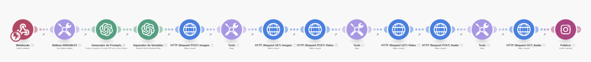

# 📌Conecta Cualquier IA a tus Automatizaciones

> Ruta: Automatizaciones Make › 📌Conecta Cualquier IA a tus Automatizaciones

**🎬 Vídeo (32.4 min):** https://youtu.be/UVxh6GVqVyM

**📎 Recursos:**
- LoRA + Video + Audio.blueprint v3

---

### Replicate + Make (Flux LoRA + Kling + Audio)

### 1. ¿Qué hace exactamente esta automatización?



1. **Recibe tu idea** (una frase dentro de `{ }`) mediante un Webhook.
2. **Genera cuatro prompts** (texto, video, audio y caption) con OpenAI.
3. **Crea la imagen** en Replicate usando tu LoRA.
4. **Anima la imagen** → video de 5 s en otro modelo de Replicate.
5. **Diseña el ambiente sonoro** sobre ese video.
6. **Publica el Reel** en tu cuenta de Instagram con el caption generado.

Todo el flujo corre dentro de Make; tarda ± 3‑4 minutos y queda 100 % hands‑off.

### 2. Visión general del flujo

1. **Custom Webhook (Make)** ― Recibe tu `{prompt}` al instante.
2. **Set Variables (Make)** ― Carga tu `api_replicate` para no hardcodear la key.
3. **Create Chat Completion (OpenAI o3-mini)** ― Devuelve 4 líneas (TEXT, VIDEO, AUDIO, CAPTION) en ≈ 5-10 s.
4. **Transform to Structured Data (OpenAI gpt-4o)** ― Separa cada línea en variables únicas (≈ 1-2 s).
5. **HTTP POST a Replicate (LoRA)** ― Genera la imagen vertical 9:16 (≈ 10-25 s).
6. **Sleep 15 s** ― Da tiempo a Replicate para renderizar.
7. **HTTP GET a Replicate** ― Recupera la URL de la imagen (≈ 1 s).
8. **HTTP POST a Replicate (Kling)** ― Convierte la imagen en video de 5 s (≈ 2-3 min).
9. **Sleep 180 s** ― Espera el render completo del video.
10. **HTTP GET a Replicate** ― Obtiene la URL del video (≈ 1 s).
11. **HTTP POST a Replicate (FX Audio)** ― Añade ambiente sonoro (≈ 15-20 s).
12. **Sleep 20 s** ― Espera el render con audio.
13. **HTTP GET a Replicate** ― Recupera la URL final (video + audio) (≈ 1 s).
14. **Create Reel Post (Instagram Graph API)** ― Publica el Reel con caption (≈ 5-10 s).

> En total: ~3-4 min y cero intervención manual.

*(Los bloques Sleep son necesarios porque Replicate responde primero con una URL “polling”; esperamos y luego consultamos ese endpoint.)*

---

### 3. El prompt maestro (Prompt Engineering)

El módulo **Generador de Prompts** envía este mensaje al modelo *o3‑mini*:

```
Eres Generador de Prompts Triple. El usuario te dará una sola frase entre llaves: "bencordero {{19.activity}}"

Devuélveme cuatro líneas, cada una ≤ 20 palabras, con este formato y sin ningún texto extra:
TEXT: ...
VIDEO: ...
AUDIO: ...
CAPTION: ...

– TEXT, VIDEO y AUDIO en inglés  
– CAPTION en español (humor ligero)  
– “bencordero” SIEMPRE es el sujeto  

Ejemplo de entrada: {bencordero epic climbing in Patagonia}
Ejemplo de salida: 

TEXT: bencordero climbing a huge granite spire at sunrise, cinematic
VIDEO: the climber with slow dolly zoom out showing vast Patagonian valley
AUDIO: windy sound, distant condors, gear jingling
CAPTION: Escalando egos y montañas… ambas igual de resbalosas 😅
```

---

### 4. Configuración de cada servicio

#### Replicate

- **Imagen** → tu propio modelo LoRA (`benjacord/bencorde`), resolución 9:16, `.webp`, 28 steps, `guidance_scale: 3`.
- **Video** → modelo `kwaivgi/kling‑v1.6‑standard` con la imagen como `start_image`, duración 5 s.
- **Audio** → modelo `62871f…` que toma el video final y añade FX.

> Asegúrate de guardar tu API Key en la variable **api_replicate** y no hardcodearla.

#### OpenAI

Usamos dos llamadas:

1. **o3‑mini** (chat) para creatividad rápida.
2. **gpt‑4o** para parsear la respuesta y devolver JSON limpio (TEXT, VIDEO, AUDIO, CAPTION).

#### Instagram Graph API

Necesitas un **Instagram business account** conectado a tu Facebook app. El módulo `CreateAReelPost` pide:

- `video_url` (del paso 13)
- `caption` (del prompt)
- `share_to_feed: true` para que aparezca también en tu feed.

---

### 5. Paso a paso para replicarlo

1. **Duplica** el escenario en tu cuenta de Make.
2. En **SetVariables** sustituye `api_replicate` con tu propia key y las variables necesarias.
3. Conecta tu **cuenta de OpenAI** (modelo o3‑mini y gpt‑4o).
4. Conecta tu **Facebook/Instagram** en el último módulo.
5. Activa el escenario en **instant mode**.
6. Espera ~4 min y revisa tu Instagram. 🎬

---

### 6. Consejos y mejoras

- **Reduce los tiempos de Sleep** si tu modelo corre más rápido; prueba y ajusta.
- **Sonido**: el modelo acepta descripciones creativas (e.g., “rain hitting neon signs, distant chatter”).
- **Batch mode**: activa “secuencial” en Make si quieres lanzar varios prompts en paralelo.
- **Logging**: conecta un módulo *Google Sheets* antes de publicar para guardar cada prompt y URL.

---

## 🎙️ Transcripción

Imaginemos que queremos subir un video hecho con inteligencia artificial a nuestro Instagram. ¿Cómo lo haríamos manualmente? Primero entraríamos a alguna página de generación de imágenes y le pondríamos algo como un prompt de quiero a una persona escalando en este formato. Después llegaríamos y animaríamos el video con alguna herramienta como Clingi, como runway o Pica o cualquier herramienta de animación de video en base a una imagen. Después lo que haríamos probablemente le agregaríamos algún tipo de audio, ¿verdad? para poder acompañar a este video y después lo publicaríamos manualmente dándonos algo así, obviamente habiendo escrito un caption, pero qué si te dijera que podemos hacer todas esas cosas de manera manual y más aún podemos personalizarlo y podemos hacer el llamado literalmente a la herramienta de inteligencia artificial que quisiéramos y todo de manera automática. Bueno, eso es exactamente lo que te voy a mostrar hoy día. Ahora te voy a mostrar un sistema que tú puedes modificar literalmente para hacer absolutamente lo que quieras, que lo vamos a ver con un caso de uso práctico, que va a ser en base a un formulario o un input que rellenamos como vcorde haciendo algo como escalando una roca, vamos a generar cuatro promps distintos. Cada promp uno es para generar una imagen, otro es para un video, otro es para el audio y otro es para el caption que vamos a subir a Instagram. Vamos a hacer el llamado a crear la imagen y después vamos a animar la imagen con un llamado específico a cling. Vamos a usar flux para crear la imagen y cling para animar el video. Después vamos a usar otro modelo de inteligencia artificial para darle el audio o los efectos de sonido y finalmente lo vamos a subir a Instagram con el caption que creamos. Así de simple. El sistema funciona bastante bien, ya lo he probado y te lo quiero compartir para que empieces a usarlo por tu cuenta. De hecho, el sistema lo hicimos tan intuitivo que puedes literalmente crear un nuevo escenario, irte a Imperio Digital, bajar la parte que sale logra más video, descargar, apretar los tres puntitos, importar plantilla y simplemente rellenando tus variables acá, cambiando tu API, el TOC y la versión que vas a llamar, ya vas a poder tener corriendo este escenario y obviamente conectando tu cuenta de HG GPT y tu cuenta de Instagram. ¿Okay? El sistema funciona así, es s sencillo y te voy a mostrar paso a paso cómo armarlo. Entonces, si quisiéramos ejecutar el sistema y entro acá a esta plataforma que armé rapidito en Volt y le digo, "Quiero a Bencorde mirando a la cámara, modo retrato en la ciudad y le doy a enviar actividad." Se van a hacer todos esos pasos que antes hacíamos manualmente. Lo vamos a hacer directamente con esta automatización. Como podemos ver acá recibió la señal. Ahora está generando los cuatro proms y luego los está separando. Vendría siendo el prom de texto, el video, el audio y el caption. Después está haciendo el llamado a replicate, que ya te voy a explicar un poco mejor de qué es replicate, cómo funciona y qué modelos estamos llamando directamente. Pero podemos ver que se hizo el llamado acá. Después está esperando, recuperó la imagen y ahora está animando la imagen haciendo el llamado a Cling, como podemos ver acá. Cling en lo personal creo que genera s super buenas imágenes, quizás como no al nivel de Beo, pero sí es bastante más económico que Veo y Beo todavía no tiene la opción de hacer un imagen a video, ya link sí y eso realmente me encanta. Entonces, aquí el sistema sigue. Vamos a entrar un poquito más a detalle más adelante, pero ya podemos ver que primero nos creó la imagen, que la podemos encontrar justamente aquí, que esta vendría siendo la imagen que está acá, que vendría siendo esto. Mira qué guapo, ya. Y esta es la imagen que acabamos de generar. Luego se mandó a hacer el video. Hubo una pausa entre medio, si es que abrimos el video, lo podemos ver, lo podemos revisar y vendría siendo este de aquí que tiene una pequeña animación hacia el costado, ¿verdad? Y finalmente vamos a mandar a hacer el audio con el prompt que creamos previamente. Mandamos a hacer el audio, esperamos, nos lo devolvió y nos lo combinó todo en un mismo video. Okay. Si es que vemos aquí el output, lo podemos abrir nuevamente y vendría estando acá, que sería este que le agregó ambiente de sonido basado en el prompt que le pusimos o el que nos generó directamente y nos lo subió a Instagram. Por lo que sí, ahora llegamos y actualizamos esto que aparece justo acá, debería estar subido con el caption de viviendo la ciudad con actitud vcde, mira este sistema lo que te vay a mostrar en el fondo, lo importante es que seas capaz de entender qué es lo que estamos haciendo, cómo estamos llamando a los modelos de inteligencia artificial, porque después desde acá podemos personalizarlo absolutamente como queramos. Podemos empezar a prospectar clientes haciéndoles reacciones personalizadas o videos personalizados, mandar videos en masa agarrando un cartelito con el nombre del negocio. Las opciones realmente son ilimitadas. Hay muchos creadores de contenido que están trabajando en sus clones digitales o en versiones digitales de ellos mismos. Hay muchas cosas que se pueden hacer. Entonces, esto es realmente una maravilla. ¿Okay? Entonces, lo que estamos haciendo acá, vamos a usar una aplicación que se llama Replicate, ya. Y ahora vamos a entrar a la parte de los modelos de ella. Replicate es una plataforma que usamos para correr los modelos de inteligencia artificial que son open source. Podríamos correros a nivel local, sí, pero probablemente nos freiría el computador y se tomaría mucho, mucho tiempo en hacer la generaciones. Entonces, lo que hacemos es pagamos por un servicio como Replicate, donde nos cobran por cada generación en específico. Por ejemplo, si quisiera generar una imagen mía, me va a salir alrededor de 2 centavos porque eh ya conozco los costos y no tengo que suscribirme a nada, sino que puedo estar simplemente pagando como as you go. Entonces, en Replicate tenemos muchos, muchos modelos distintos de inteligencia artificial que podemos empezar a jugar con, como este de Luma, que es para reframe los vídeos. Eh, podemos usar imagen cuatro, podemos usar imagen 3, eh podemos entrenar nuestro modelo, que eso es lo que hicimos en el video anterior, entrenar nuestra imagen o hacer un lora, un low rank adaptation con nuestra cara de inteligencia artificial. Podemos atacar el BO3, eh podemos literalmente meter todos estos modelos como el Flux Context, lo que queramos en nuestras automatizaciones y en nuestros flujos de trabajo. Entonces, lo primero que vamos a hacer es vamos a usar un modelo que se llama Flux Dev Lora y eso es lo que tenemos que hacer. Tenemos que hacer el llamado a el flux dev. En el video anterior vimos cómo entrenábamos directamente el modelo y hoy día lo vamos a estar usando. Este modelo es simplemente esto que aparece acá como bencordero man a Superman. Entonces, una vez que le doy acá, puedo modificar ciertos parámetros como eh cuántos pasos de diferencia quiero que tenga, cuál es la calidad, en qué formato lo quiero, etcétera. Y cuando le doy a generar, nos va a devolver directamente una imagen con lo que le pedimos. Esto se toma alrededor de 5 segundos, 10 segundos, dependiendo de la complejidad y los parámetros que vamos teniendo. Y acá podemos ver que me acaba de generar como Superman. Okay, ahora rellenamos todos estos parámetros, pero los rellenamos de una manera manual. ¿Cómo lo podemos hacer para atacar y empezar a usarlos en make? Bueno, eso es lo que vamos a ver ahora. Este escenario que acabamos de importar lo vamos a ver paso a paso. Para este caso, lo que hicimos fue mandarle un webhook o un flujo desde cualquier lugar. Para este caso, usé una herramienta que se llama Bolt. Puedes usar lobable, puedes usar bolt, puedes usar absolutamente lo que quieras. Y le puse el siguiente prompt. Créame una app simple que sea de un input y que mande la información al siguiente webhook, que se rellena en un formulario y se da tipo Vcorde haciendo xxx y lo mande al siguiente webhook. ¿Okay? Entonces, si es que yo entro acá, entro a Volt directamente y le pego este prompt, nos va a generar esta interfaz que estamos viendo acá que salva bastante. ¿Okay? Entonces, lo que haría acá sería ponerle este mismo prompt y le pondría el webhook que acabamos de crear. Okay, entonces acá mándalo a este webhook. Perfecto. Y la app se llama Vencorde haciendo X y le vamos a dar a enter. Ah, pero antes le voy a decir hazlo estilo minimalista y gótico, porque ¿por qué no? El webhook es acá. Ahora estamos usando una interfaz que se llama Bolt. También existen varias opciones como lovable, eh, pero al final todo esto son vi coding platforms, son plataformas de no code que te ayudan a crear interfaces que son útiles, eh, sacar MVPs rápidos, crear aplicaciones, eh interfaces que los clientes no pueden romper y eso es maravilloso. Y ahora lo que estamos haciendo lo estamos usando para crear un estilo aplicación interfaz más simple para que nosotros podamos ir creando nuestro contenido. Hemos trabajado bastante con esta plataforma, lo puedes encontrar en muchos otros víos, entonces no vamos a hondar tanto en cómo funciona esto, pero imaginémoslo como un frontend y un backend developer o programador que hace las tareas por ti en tiempo real y no te cobra salarios excesivos. Entonces, una vez que nos genere esto, vamos a ver que aquí se empieza a generar todo el código eh de la interfaz que estamos programando y tenemos la interfaz que está justamente acá. Okay. Entonces ahora cada vez que lleguemos y le hagamos un envío a algo en específico, nos va a devolver esto acá. ¿Ya? Entonces, lo único que queremos hacer es devolver las variables o queremos trabajar con ciertas variables en específico. Por ejemplo, si le digo acá hola y le pongo enviar al abismo porque me lo mandó al abismo, vamos a ver que lo recibimos aquí en nuestro flujo de trabajo. Eh, entonces al final lo que vamos a hacer es eso. Si es que acabas de importar la automatización, puedes irte acá donde sale los escenarios, apretar los tres puntitos, importar escenario, entrar acá y directamente agregar el escenario. Y después lo que dices es, "Okay, quiero mandarlo a este webhook en específico." Y creas el webhook y le pones webhook video o webhook, lo que sea. Eh, lo voy a poner versión 10 porque tengo ganas de ponerle versión 10. y le dirías que lo mande a este webhook en específico. ¿Okay? Entonces acá después correríamos el escenario que vendría siendo este de acá. Vamos a elegir el webhook. Hicimos webhook 10, darle a guardar y corremos el escenario. Estando acá le vamos a decir manda la información a este web. Así de simple sería importarlo e para que te empiece a funcionar a ti. Entonces ahora sí podemos llegar, podemos empezar a mandarle nuevamente información y vemos que lo acabamos de recibir nuevamente aquí. Okay, este título se lo va a cambiar, lo voy a poner versión dos porque es la segunda vez que lo estamos creando. Okay, ¿qué es lo que sigue después de importar el escenario? No te preocupes, igual vamos a ver todo el escenario en el caso de que no quieras importarlo y quieras aprender a hacerlo uno a uno, es rellenar las distintas variables. Acá ya optimicé esta automatización para que cuando la importamos simplemente tengamos que rellenar las variables de acá, conectar las cuentas y después tengamos todo listo para llegar y empezar a automatizar o dejarlo corriendo absolutamente como queramos. Tenemos que rellenar las variables. La primera es la API de replicate. Esta la podemos encontrar si es que no. Apretamos nuestro perfil y nos vamos a Appy Tokens. Una vez que estemos acá, podemos crear un nuevo token o podemos copiar nuestro token que aparece aquí. Una vez que estemos acá, vamos a copiar y reemplazar el token acá. Después el talk vendría siendo cuál es la palabra clave en el caso de que estemos usando el flux de replicate. En el caso de que estemos usando ese flux en específico que entrenamos con nuestra cara, que vendría siendo este de acá como vencor de man a Superman, en este específico, vamos a reemplazarlo justamente aquí. ¿Okay? Después en el image version, que es esto de acá, vamos a poner cuál es nuestra versión en específico. ¿Cómo encontramos nuestra versión? Perfecto. Una vez que estemos acá, vamos a irnos a la parte que sale version. Entonces, una vez que estemos y elijamos el model, justo este de acá, podemos copiar el modele. Y una vez estando aquí, sí podemos copiar todo esto y pegarlo en específico. Okay, esto lo vamos a generar acá, lo vamos a actualizar, vamos a recargarlo y vamos a continuar. Okay, entonces vamos a poner todas estas cosas de acá. Tenemos tres modelos de inteligencia artificial que estamos llamando en este caso. El primero es el de imagen, que es el flux. El segundo vendría siendo el del video, que es el de Cling, que vendría siendo este que nos anima acá. Y el tercero vendría siendo el mm audio que nos crea el audio en base al prompt que le dijimos, como waterfall, en este caso para hacer las cascadas. ¿Okay? Después lo que hace el sistema es directamente pasa de crear estas variables a generarnos los promps en específico. ¿Por qué? Porque trabajamos con cuatro proms, uno para crear las imágenes, otro para el video, otro para el audio y otro que va a ser nuestro caption. Entonces vamos a usar un modelo de create a completion para directamente generarnos este prompt. Okay, el prompt acá va a ser, eres un generador de promps triple, bueno, debería ser cuádruple, la verdad. Devuélveme cuatro líneas cada una de 20 palabras en este formato. La primera quiero que sea el texto, la segunda quiero que sea el video, la tercera quiero que sea el audio y después el caption. ¿Okay? Este caso nos va a generar un bloque de texto y si es que lo corremos una vez vamos a darnos cuenta de que nos genera el bloque de texto, pero no está separado en distintas variables y nosotros queremos ser capaces de poner cada una de esas variables en distintos lugares, ¿verdad? Queremos poner una para mandarle al post de la imagen, otra para mandarle al del video y así. Entonces, el generador de promps nos va a generar esto que está acá. Después vamos a usar un módulo que realmente me encanta que se llama el transform to structor data. Entonces sí tendríamos que separar después con el transform to structure data. Este lo puedes encontrar en open AI y está acá. Y la gracia es que nos saca directamente distintas variables de un bloque de texto. Es realmente maravilloso, es realmente útil. Alternativamente, creo que Make ahora tiene unos módulos en específico que también te pueden hacer esto, que es como chango, si no me equivoco, extract from text, que directamente cumple la misma función. Yo sigo prefiriendo usar los módulos de Open AI porque es el que siempre eh usado. Okay, entonces, transform to structor data es okay, recibimos un prompt supergre o un output del prompt que es texto, caption, audio, bla, bla, bla. Necesito separarlo en estas cosas. Okay, ¿qué es lo que recibimos? Bueno, el texto que nos generó previamente el prompt, que es lo que quiero que me devuelvas cuatro variables. La primera es texto, la segunda es video, la tercera es audio y el cuarto es caption. Vamos a correrlo una vez para que veas de lo que estoy hablando. Entonces, quiero que Bencorde esté escribiendo código en el PC, valga la redundancia. Entonces, una vez que esté acá, va a correr esto y nos va a empezar a generar el prompt. Esto lo estoy haciendo con el fin de mostrarte un poco cómo funcionaría esta separación de texto, que es realmente útil y necesaria en muchas automatizaciones, sobre todo cuando empezamos a mezclar un poco la inteligencia artificial y la lógica que se da cada vez más. Esto es maravilloso. Y aquí podemos ver el output que nos acaba de generar, que vendría siendo las choices, el mensaje y es Vencor de man codificando en un PC. El video es esto, pero todo esto es un bloque de texto. Entonces, lo que hicimos acá fue separarlo en cuatro: en texto, en video, en audio y en caption. ¿Okay? Una vez que tenemos estas variables y que está listo y que nos lo acaba de generar, bueno, tenemos que esperar a que se termine todo esto, tenemos que hacer el llamado a el modelo de inteligencia artificial que vamos a usar por fin. Ahora vamos a usar un modelo que está previamente entrenado con nuestra cara, que lo entrenamos en el video anterior. Ese video es superinesante si es que te interesa crear contenido de ti mismo. Si es que no, puedes usar literalmente cualquiera de los modelos que te aparecen aquí en Replicate cuando nos vamos a explore Image Models. Alternativamente puedes usar, no sé, Flux de Flora, puedes usar el context imagen 4, que está muy bueno también, y puedes usar lo que quieras. Para este caso, nosotros usamos el modelo de Flux Def Lora, específicamente entrenado con nuestra cara, que es este de aquí. Okay, lo que vamos a hacer acá es, una vez que estemos, vamos a crear un request. Crear un request, lo único que hace es mandar la información del pronto. O sea, si es que antes llegábamos y decíamos, "Okay, quiero que Ben Cordero esté como hombre Superman en retrato, quiero usar esta cantidad de inference steps y quiero que la calidad sea esta y quiero generarlo." Aquí rellenamos distintas variables y nos lo está ejecutando. Pero si nos vamos acá a la parte que sale Jason, vamos a ver que existen una manera de prerellenar esas variables y que podemos meter en nuestras automatizaciones. Y ahí está la magia, porque en esta parte que está acá podemos empezar a cambiar todas estas variables en específico. Y esto es maravilloso. ¿Okay? Una vez que estemos acá vamos a hacer el make request. Este, que no se confunda con los otros módulos, pero va a ser acá http. Vamos a bajar maker request y vamos a empezar a rellenar las variables. Okay, el makeer request primero vamos a hacer un post porque queremos mandar información a que se ejecute. ¿Okay? Entonces queremos mandar información, queremos crear la imagen y después queremos recuperar esa información. Entonces arriba vamos a poner la URL, que es la API de Replicate de uno predictions. Esta la puedes encontrar directamente acá. Por ejemplo, si nos vamos a API acá y bajamos, bajamos, bajamos. No, perdón, no está en AP. Sí, aquí, perdón. http. Llegamos. Tomamos esto. Vamos a encontrar este link que está aquí abajito. Y este link vendría siendo el App predictions, que tenemos que copiar y tenemos que pegar acá. Esto va a aplicar para cualquier modelo, o sea, si es que tú quieres, no sé, ver este modelo, por ejemplo, de Cling, que vendría siendo el de acá, la lógica va a ser la misma. Vamos a tomar acá el API Replicate, vamos a tomar el URL y vamos a reemplazarlo aquí. Okay. Después vamos a hacer el método post y la autorización es al final la llave que nosotros le vamos a dar para que sea como, "Okay, sí tienes acceso efectivamente a usar mi tarjeta de crédito y mi cuenta para entrar a eh generar estas imágenes. Por eso no recomiendo que se la den a nadie." Aquí está vinculado el AP key que creamos previamente. Por fin es práctico. Nuevamente creamos la variable antes y después dejé esta variable no más acá para que no tengas que reemplazarlo y rellenarlo en cada uno de los casos. El body type lo vamos a dejar en row, el Jason lo vamos a dejar así y después en la versión ya que vendría siendo esta de acá, vamos a o toda esta parte de acá, vamos a poner esta versión que es esta de acá que la podemos copiar aquí. Okay, la copiamos y la pegamos en version. Justo acá. Por fines prácticos te la dejé nuevamente acá. Puedes copiarla y pegarla o puedes ponerla de una. Pero este es el llamado que vamos a hacer. ¿De dónde sacamos el resto de esta información? Bueno, la sacamos de volvamos acá, vámonos a Jason de justamente aquí. Estos son los parámetros que nosotros estuvimos jugando con verdad. Este es el prompt que le dimos. Ven Cordero Man, Superman portrait acá, pero lo ejecutamos directamente desde Make y no desde acá. Y eso es lo lindo de Jason y de en general de las automatizaciones, ¿okay? Una vez estando acá, vamos a copiarlo, vamos a pegarlo y vamos a dejarle este version. Así lo que hicimos fue mandar a hacer la ejecución de la imagen. Después lo que necesitamos hacer es esperar un poco a que se devuelva la imagen o que se termine de crear la imagen y después recuperamos la imagen. Es como antes hicimos un post, llamamos a pedir la PISA, ahora lo que tenemos que hacer es recuperar la piza. Entonces vamos a usar un get. El URL vamos a buscarlo acá de lo que creamos previamente y vamos a poner un URL del get, que este es el parámetro que vamos a usar para conseguir la información que mandamos a hacer previamente. Y nuevamente autorization bearer applicate. Esto es netamente para decirle, "Okay, si tienes acceso a entrar a retirar las cosas." Okay, bear es el portador, entonces es como el portador de la llave, por así decirlo. Y el API Kei vendría siendo tu llave de API. Le vamos a dar a guardar. Bueno, content type Jason Pros. Yes. Y ya vamos a recuperar la imagen. Entonces, como podemos ver acá, la imagen se recuperó porque si nos vamos a data, nos vamos a output, podemos ver que esta imagen ya fue creada. Pero en fin. Después lo que vamos a hacer es tenemos que mandar a hacer el video y el video lo mandamos a hacer en base a la imagen. ¿Okay? ¿Cuál es el modelo que vamos a usar? Bueno, para este caso vamos a usar el modelo estándar de Cling. Este lo podemos encontrar si es que nos vamos acá, nos vamos a Cling y nos vamos a estándar. Vamos a irnos acá, vamos a irnos a la parte de http y vamos a buscar específicamente el URL que estábamos buscando, que vendría siendo este de aquí. Lo vamos a copiar y lo vamos a pegar justamente acá y ahí es donde se consigue. Okay. El resto viene siendo lo mismo. Beer, replicate, ¿verdad? Raw, Jason. Y aquí lo que sí cambia es esto que está acá. El input que nosotros le vamos a dar para generar el video es la imagen y los parámetros que necesitamos rellenar. En este caso vendría siendo el prompt, la duración, el cfg scale y la imagen. Esto vendría siendo el CFG scale como, ¿qué tan cierto quieres que sea a la imagen versus el prompt? Es como un intermedio eh donde quieres que se apegue más a la imagen o al prom que tú le diste y el aspect rattivo. Y nuevamente esto está todo puesto en el Jason. Es realmente maravilloso. Entonces, copiamos y pegamos eso y lo pegamos acá. ¿Cuál es el prompt que queremos usar? Ah, perfecto, es el video o el prompt del video que creamos previamente. ¿Cuál es la imagen que queremos usar? Bueno, la que acabamos de recuperar de eh flux, ¿verdad? que vendría siendo este output en específico, este output y el URL. Okay, vamos a guardar acá y vamos a nuevamente esperar a que se genere el video. ¿Por qué? Porque si es que se genera el video o mandamos a hacer video, necesitamos esperar nuevamente a que se termine de cocinar la pizza. Estando acá, ya nos vamos a dar cuenta de que en promedio cada generación de video me toma, no sé, esta se demoró 2 minutos, esta 2 minutos, esta 2 minutos. Entonces vamos a poner un número que sea mayor a 2 minutos antes de llegar a buscar el video. ¿Cuál es el paso que sigue? Okay, vamos a poner el slip de en este caso 3 minutos y vamos a ir a buscar el video con un URL get. ¿Qué es lo que estamos buscando? Ah, mandamos hacer antes el video que era el URL, get en específico, el authorization y el beer, nada más porque estamos solamente recuperando la información. Vamos a recuperar el video y después vamos a agregarle un audio. ¿Cómo le vamos a agregar el audio? Vamos a usar un modelo, el tercer modelo que es de audio, este que está justamente aquí. Si es que lo abro nuevamente, se llama mm audio y nos va a dar nuevamente lo mismo. ¿Cuál es el prom que queremos? cuál es el video que queremos subir y nos va a dar el formato Jason, que vendría siendo este de acá. Okay, esto es para efectos de sonido. Funciona bastante bien, la verdad. Entonces, vamos a mandar a hacer nuevamente lo mismo. ¿Cuál es el URL? Entraremos acá, iremos a http, justo acá, bajaremos y este es el URL. Y después, ¿cuál es el Jason o los parámetros que necesitamos jugar con? van a ser estos que aparecen acá, que vendría siendo el version, el video, etcétera. ¿Okay? ¿Cuál es el prompt que queremos usar? El que creamos previamente, que vendría siendo el que separamos con el text to structure data. Vamos a esperar. Esta parte es s super rápida, por eso le puse ya 30 segundos, pero en general se demora 10 segundos. Y finalmente vamos a recuperar una vez más la información del video que acabamos de crear, ¿okay? ¿Y cómo hacemos eso? Nuevamente el que mandamos antes, vamos a hacerle un URL, vamos a hacerle un get en específico de el video que mandamos a hacer o que mandamos el audio del video que mandamos a hacer. El beber vendría siendo lo mismo, toda piquin, todo funciona igual y finalmente lo publicamos. En este caso, ¿qué es lo que vamos a publicar? Bueno, el output que nos generó todo el video combinado, ya listo. ¿Y qué caption le vamos a poner? El caption que creamos en el primer prompt y que separamos en el tercer módulo en específico. Después podemos elegir si es que queremos ponerle alguna portada, si queremos compartirlo al fit y en fin. Okay, entonces si es que guardamos ahora esto y le damos a correr, vamos a darnos cuenta de que vamos a tener el sistema o debería estar funcionando todo el sistema. Entonces, una vez acá, ¿qué está haciendo en corde? Última vez vamos a hacer está sentado en el río o al costado del río. Vamos a enviar al abismo y vamos a ver todo el proceso de lo que acabamos de crear. Esto está realmente genial. Entonces, el talk vendría siendo vencor de cuál es la versión que estamos llamando, bueno, la versión que entrenamos en específico, cuál es el promp que generó este que está acá. Como podemos ver, esto es todo un output, pero después lo separamos en cuatro partes distintas, en el prom de texto, en el prom del video, en el audio y en el caption. Después lo que hicimos fue hacer el llamado a crear la imagen. Si es que entrábamos nuevamente acá a replicate, podemos ver que se está ejecutando o que se terminó de ejecutar el llamado a crear la imagen, que estamos al costado del río, justamente aquí. Okay, entonces podemos ver que ya se mandó a hacer la imagen, vendría haciendo acá y que ya mandamos a crear el video. Y ahora estamos esperando a que se cree el video. Volvamos acá. La imagen ya fue creada. Vamos a revisar si es que efectivamente se está creando el video. Y aquí está creándose el video. Justamente acá el prom fue slow pan across the serene riverside with satle camera motion. Entonces al final esta es la imagen de input que le mandamos a hacer. Estos son los parámetros que nosotros le dimos. Podemos jugar con el cfg scale si queremos que sea más o menos fiel a la imagen o más o menos fiel al prompt. Podemos jugar con ese parámetro si es que no estamos teniendo buenos resultados. Y ahora estamos esperando. ¿Por qué estamos esperando nuevamente? Porque si vemos acá sigue esto running. E promedio veíamos que se demoraba alrededor de 2 minutos en generar cada una de las imágenes o perdón, cada uno de los videos. Así que vamos a seguir esperando. Y si es que vemos, se acaba de generar la imagen, se demoró 2 minutos con6 segundos, perdón, se acaba de generar el video y vendría siendo este de aquí. superinesante, super buen resultado en mi opinión y el video ya fue generado. Entonces ahora va a seguir esperando ya que esperamos un par de minutos o le dimos 3 minutos y se demoró 2 minutos en generar y acaba de eh recuperarse el video. Okay, se recuperó el video y después se mandó a hacer el paso que sigue que vendría siendo el combinar y crear el video con el audio. Así es que entramos acá, se acaba de mandar, este, se demoró 5 segundos y se combinó y quedó algo así que en mi opinión está bastante bueno. No sé si es que se escucha, así que te lo voy a mostrar en el celular. Y podemos ver que se subió a Instagram. Aquí lo podemos escuchar. Se escucha el audio, está todo perfecto. Y está con el caption hasta el río se toma un break haciendo que no no estoy seguro. A ver, actualizo esto. Y hasta el río se toma un break viendo a Vencorde en su salsa. Obviamente podemos jugar con qué tipo de caption empezamos a subir, cuáles hacemos, cuáles no, pero en fin, esto está s super interesante. Recuerda que esto te lo voy a dejar publicado acá dentro de Imperio Digital para que llegues. Eh, esto lo vas a encontrar justamente aquí, es este que aparece acá, la versión 3, eh, para que llegues, juegues, lo descargues y simplemente lo único que tengas que hacer es rellenar estas variables que están acá. Bueno, si no conoces lo que es Imperio Digital, Imperio Digital es una comunidad de automatizaciones donde nos dedicamos y somos todos fanáticos de las automatizaciones y de la inteligencia artificial, pero exploramos estrategias que realmente funcionan y que nos ayudan a ahorrar tiempo. S super interesante. Somos partners académicos también directamente de Make. De hecho, hace poco vinieron a hacer una charla, estuvo realmente buena, pero puedes entrar a probar por 7 días completamente gratis. Así que si quieres entrar, puedes descargarte esta automatización. Ahí mismo puedes entrar, te la descargas y sientes que no es para ti, te puede salir. Pero si te gusta puedes aprovechar todos los recursos que tenemos que son automatizaciones para llegar y descargar, así como tal cual como esta. De hecho, esta la puedes encontrar acá tenemos un curso de make test de cero, tenemos, bueno, varios recursos, grabaciones, sesiones en vivo. Tenemos muchas cosas al final que hacen de Imperio Digital, un lugar realmente maravilloso. Así que sin más que decir, espero que este video te sirva, puedas ver el uso y la cantidad de usos que tiene, porque hay tantas cosas en replicate que podemos usar, tantos modelos, tantas cosas que realmente es maravilloso como el pensar que tenemos todas estas opciones y que podemos empezar a diseñar sistemas a nuestra medida que cumplan nuestras necesidades, tanto personales como empresariales como espirituales y absolutamente lo que quieras. ¿Okay? Ahora sí, sin más que decir, espero que eh pueda sacarle el máximo provecho. Si le interesa ver cómo entrenamos al modelo y cómo armamos el Lora para empezar a sacar imágenes de nosotros, recomiendo que veas el video que subimos justo antes de este. Recordemos que el objetivo de este video no era que aprendas o que hagas el sistema en sí, sino que entiendas cómo es el proceso de llamar a un modelo de inteligencia artificial en la nube para después poder recuperar la información, porque si es que entendemos esto, vamos a ser imparables porque podemos hacer llamados de absolutamente lo que queramos y esto recién comienza, o sea, si es que combinas esto con bolt, eh, que es la herramienta que usamos para crear esta interfaz rápida eh que viste previamente, esta de acá. Las opciones son ilimitadas, o sea, podemos lanzar MVPs super baratos, económicos, funcionales. Al final, esto está recién recién comenzando. Llegamos poquito más de un año en el viipe coding y no tengo dudas de que esto va a llegar muy pero muy lejos, pero todo se parte por algo. Así que sin más que decir, ahora sí me despido y espero que este video te haya servido. Mucho éxito.
