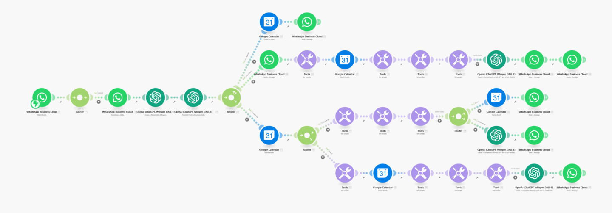

# ❤️ Asistente Whatsapp + Google Calendar

> Ruta: Automatizaciones Make › ❤️ Asistente Whatsapp + Google Calendar

**🎬 Vídeo (45.6 min):** https://www.youtube.com/watch?v=CvL95akto8Y

**📎 Recursos:**
- Whatsapp + Google Calendar v2

---

El otro día vi una publicidad de una app que se conectaba a **WhatsApp** y actuaba como un asistente virtual: podía **agendar eventos, revisar tu calendario y enviarte recordatorios**. Me llamó la atención porque, aunque suena increíble, **crear algo así es más fácil de lo que parece**.

Así que me puse a construirlo. En **dos horas**, ya tenía listo un sistema que hacía lo mismo. En este post te voy a explicar **cómo funciona** y cómo tú también puedes construirlo desde cero.

---

### **Cómo Funciona la Automatización**

Básicamente, cada vez que le mandas un mensaje o un audio al asistente de WhatsApp, este puede hacer tres cosas:

✅ **Agendar un evento** en tu calendario con solo decírselo.  
🔍 **Revisar tu disponibilidad** y decirte qué eventos tienes en el día.  
🗑️ **Eliminar eventos existentes** con una simple instrucción.

Lo interesante es que este sistema **no solo entiende lo que le pides**, sino que **toma acciones reales** por ti. Se conecta con **WhatsApp Cloud API**, transcribe audios, interpreta la intención con inteligencia artificial y actualiza tu calendario en **Google Calendar**.

---

### **¿Por qué es Importante Aprender Esto?**

Cada día usamos WhatsApp para coordinar reuniones, revisar pendientes y recordar eventos. Con una automatización como esta, **te olvidas de hacerlo manualmente** y dejas que un sistema lo haga por ti.

Además, esto no se limita solo a eventos: **puedes adaptarlo para responder clientes, registrar pedidos o incluso generar reportes**. El punto es que **WhatsApp puede ser mucho más que solo una app de mensajería si lo conectas con las herramientas correctas**.

Si quieres aprender a conectar **WhatsApp Cloud API** y empezar a crear tu propio asistente automatizado, en la comunidad de **Imperio Digital** tenemos un **tutorial paso a paso** donde te explicamos cómo hacerlo.

[👉 ](https://www.skool.com/imperio-digital/classroom/7efa4739?md=435d257c707d4860b5c9768830d7c33b)[**Accede al tutorial aquí**](https://www.skool.com/imperio-digital/classroom/7efa4739?md=435d257c707d4860b5c9768830d7c33b)[ 🚀](https://www.skool.com/imperio-digital/classroom/7efa4739?md=435d257c707d4860b5c9768830d7c33b)

Esto no es el futuro, **es lo que puedes hacer hoy mismo**.

PROMPT Mencionado para el Text-To-Structured-Data

> Recuerda que HOY es "{{now}}"
> 
> Eres mi asistente personal encargado de extraer la info clave y devolverla como datos estructurados. Tienes tres funciones:
> 
> 1. **agendar_eventos:** Recibes fecha de inicio, nombre y duración del evento. Devuelve: 
> 
>    - nombre_evento
> 
>    - fecha_inicio
> 
>    - duracion
> 
> 2. **revisar_eventos:** Recibes fecha_inicio y fecha_termino. Devuelve:
> 
>    - fecha_inicio
> 
>    - fecha_termino
> 
> 3. **eliminar_evento:** Recibes fecha_inicio, fecha_termino y dos palabras clave. Devuelve:
> 
>    - fecha_inicio
> 
>    - fecha_termino
> 
>    - palabra_clave
> 
> ##Considera que la fecha actual es: {{now}}, por lo que si te dicen "mañana" o "en una semana", haz tus respectivos cálculos.

## 🎙️ Transcripción

el otro día me apareció una publicidad de una aplicación que servía como tu asistente virtual cuando uno le mandaba mensajes la aplicación lo que hacía era se conectaba a WhatsApp y tú podías agendar eventos revisar tu calendario y te llegaban notificaciones antes de que ocurra cierto evento fue ahí donde me pregunté qué tan difícil realmente será armar un sistema como este e incluso Cómo podemos mejorarlo un poquito bueno eso es lo que estuve haciendo las últimas 2 horas Armando este este sistema de acá y lo que voy a hacer hoy día es te voy a mostrar paso a paso cómo lo construí si no me conoces Mi nombre es Benja soy cofundador de la comunidad de imperio digital un lugar donde todo se trata de automatizaciones Inteligencia artificial y Cómo podemos crear sistemas para ahorrar tiempo lo mejor de todo que funcionan y ahora te voy a mostrar Cómo armamos este sistema de acá pero antes déjame mostrarte Cómo funcionaría un caso práctico cada vez que yo le mando un audio a este número de WhatsApp el asistente va a elegir una de tres opciones sea agendar un evento sea revisar tu calendario y tu disponibilidad o directamente eliminar un evento Esto está sincronizado a nuestro Google calendar y la idea de esto es que pueda hacer más o menos una especie de secretario o secretaria personal por ejemplo si es que yo tomo el celular y decido mandarle un audio Necesito que me agendes una reunión para mañana con el abogado para las 12 del día y que tenga una duración de 45 minutos Voy a mandarle el audio y se va a estar ejecutando el sistema detrás des que vemos mi calendario en este momento me acaba de crear el evento reunión con abogado para la mañana las 12 del día y tiene una duración de 45 minutos pero también le puedo decir cosas como Necesito que me verifiques la disponibilidad del resto del día no sé qué tengo que hacer se me olvidó me puedes ayudar y lo que está haciendo es efectivamente revisando mi disponibilidad me va a llegar el mensaje Déjame revisar significa que lo está revisando Y si esperamos todo esto está en tiempo real me dice que tienes en la tarde matecito con Vu de tres a cuatro después matecito con Max de cco a se y después matecito con Andrés de 7 a 745 y después me tiene una broma El único problema con tanto matecito es que al final del día estará más acelerado que un niño en tienda de golosinas Entonces esto es una aplicación que funciona también podemos pedirle Oye necesito que me elimines el evento de matecito con Andrés lo lamento Andrés y en este momento lo que va hacer es desencadenar la automatización para que me mande el link de el evento que quiero eliminar verdad y aquí si es que agrego Esto me va a dar el link de matecito con Andrés podría pasarlo por un sistema de verificación verdad que también me permitiría eliminar el evento directamente desde el chat de WhatsApp pero en fin ahora sí te voy a mostrar cómo funciona esta aplicación y cómo tú podrías armar un estilo de aplicación parecido a este el sistema se ve terrorífico pero realmente es s s simple también mencionarte que si es que quieres descargarlo directamente lo puedes hacer entrando a la comunidad de school descargando creando un nuevo escenario eh importando el archivo que acabamos de descargar y voala y bueno el sistema Es realmente s super simple y te voy a mostrar paso a paso cómo lo armamos pero déjame darte un overview principal cada vez que nosotros recibimos un mensaje en WhatsApp un audio en WhatsApp lo que vamos a hacer es descargarlo y transcribirlo después vamos vamos a verificar la intención del mensaje con Open Ai y ahí podemos ver si es que tiene la intención de agendar evento que sería justo por aquí Arribita si es que tiene la intención de revisar disponibilidad que ejecutaría esta línea de acá o si es que tiene la intención de eliminar un evento que sería por estas líneas de acá si es que encuentra más de un evento con el mismo nombre se va a ir por la línea de arriba y si es que no encuentra un evento con el mismo nombre no va a decir Oye no encontré el evento pero estos son los eventos que tienes disponibles para esa fecha Y en el caso de que encuentre más de un evento si es que encuentas solo uno efectivamente te va a mandar el link para eliminarlo y si es que encuentra más de uno va a decir Oye encontré este evento y este evento Cuál de los dos es el que quieres que te elimine Okay Entonces ahora vamos a armar paso a paso Esta automatización que está acá y lo primero que necesitamos es un número de WhatsApp el número de WhatsApp nos sirve para dejarlo y trabajar con la WhatsApp Api para poder recibir los audios con ese número en específico no vamos a hacer todo el proceso de la instalación del número de WhatsApp porque eso lo hice en mi video anterior que si es que te interesa y quieres hacerlo puedes ver el video acá pero esta automatización también puede ser desencadenada de una manera más simple desde slack o desde incluso chat gpt Así que cuando le mandamos un audio recibimos el audio y después lo trabajamos directamente Okay pero sí Ahora sí vamos a crear la automatización desde cero vamos a abrir un nuevo escenario en make.com que es la herramienta que usamos para crear estos flujos automatizados y flujos de trabajo y vamos a crear un nuevo escenario lo primero que vamos a hacer es a abrir WhatsApp business Cloud y watch events esto lo que va a hacer es cada vez que recibimos un mensaje vamos a pasarlo directamente por acá vamos a crear un nuevo webhook y le vamos a poner asist virtual calendario versión 3 porque es la tercera vez que lo creo el token que creamos previamente Este token es el que cuando registramos nuestro número de WhatsApp es el token que creamos para poder hacer este tipo de integraciones no estoy deteniéndome tanto en esta parte porque la especifi muy bien en el video anterior recomiendo que lo veas eh Y después vamos a seleccionar solamente nos interesa ver los mensajes Okay Vamos a darle a guardar y se acaba de crear el As asistente virtual luego nos va a dar este webhook justo acá Este es el que vamos a copiar y vamos a pegarlo en developers.facebook.com y nos vamos a ir a mis aplicaciones vamos a irnos a la aplicación que creamos previamente nos vamos a ir a WhatsApp y nos vamos a ir a configuración una vez que estemos acá le vamos a pegar el webhook que acabamos de crear y vamos a verificar con el token que acabamos de poner previamente que sería este de acá Okay si es que lo guardamos y le damos a correr ahora sí deberíamos recibir un mensaje que efectivamente se acaba de recibir verdad que sería este de acá que es el texto Hola que acabamos de mandar acá y desde aquí ya estamos recibiendo la información estamos recibiendo Data y el número está conectado nuevamente Si quieres conectarlo hice un tutorial paso a paso lo único que necesitas es un número que no ha sido usado antes o conectado a una cuenta de WhatsApp que te puedes comprar por $ da igual una vez que estamos recibiendo aquí la Data lo siguiente que tenemos que hacer es Descargar el audio que le vamos a mandar entonces va a ser Download media qué queremos Descargar Ah el audio que nos acaba de mandar que sería bajo audio y media Okay aquí le damos a guardar y cuál es el siguiente paso bueno tenemos que transcribirlo verdad porque ahora tenemos un audio pero no nos sirve si estamos trabajando con un llm que solo trabaja contexto Así que para transcribirlo voy a usar el whisper de Open Ai que sería este que está aquí que transcribe un audio a texto Si no has hecho la conexión con Open Ai puedes hacerlo entrando a el playground de Open Ai y cargándole créditos pero realmente te cobra fracciones de centavos por cada generación Okay vamos a ir al whisper y vamos a ponerle el uno aquí en el prom va a ser Necesito que me transcribas este audio cómo quiero que me dé la respuesta Bueno quiero que me la den Jason está bien Vamos a guardar Y tenemos los tres primeros módulos esenciales que sería este que está acá que es recibir WhatsApp que se va a desencadenar tenemos este que está acá que es Descargar audio Y tenemos este que está acá que es transcribir audio después dijimos que íbamos a trabajar con tres funciones verdad que son las tres funciones más básicas que es agendar un evento revisar la disponibilidad o directamente eliminar un evento Así que necesitamos transcribir este audio y necesitamos analizar la in para ver qué camino va a tomar para eso vamos a usar un módulo que se llama text structure Data este módulo es muy interesante porque es el puente entre la Inteligencia artificial y la lógica Okay una vez que estemos acá vamos a elegir el modelo que queramos para esto voy a usar el cuatro o mini que debería funcionar el texto que queremos pasar a variables es este el texto y Aquí vamos a entrar con el prompt el promt también te lo dejé publicado en la comunidad de imperio digital que es este esto que está acá lo vamos a copiar y lo vamos a pegar acá no lo vamos a pegar con control V porque va a aparecer desordenado sino que lo vamos a pegar con control shift y v corta y esto al final lo que está haciendo es va a definir Cuál es la intención del usuario quiere agendar quiere remover o quiere verificar entonces Recuerda que hoy es fecha esta fecha la podemos poner así Si nos vamos al calendario que aparece acá ponemos Now y eres mi asistente personal encargado de extraer la información clave y devolver como datos estructurados tienes tres funciones la primera agendar eventos que devolverás nombre del evento fecha de inicio y duración y la otra es revisar evento recibe fecha de inicio fecha de término verdad y después eliminar evento que sería fecha de inicio fecha de término palabra clave okay en el fondo y en español es tienes tres opciones y dependiendo de la opción que elijas vas a necesitar recopilar tres variables o dos variables que son las variables de bueno si quiero agendar un evento qué es lo que necesito Cuándo empieza cuándo termina o cuánto dura y cuál es el nombre del evento son las tres variables verdad si es que necesito revisar un evento Bueno qué es lo que necesito de cuándo a cuándo quieres revisar Cuál es la fecha de inicio hasta cuándo y después si quieres eliminar un evento necesitas el nombre del evento o alguna palabra clave del evento y entre qué periodos de fecha entonces este módulo Es realmente útil sobre todo porque es el nexo entre la Inteligencia artificial y la lógica después vamos a agregar Cuál es la Data que nosotros queremos verdad Cuál es la Data estructurado Cuáles son las variables que quiero que me entregues y aquí es donde entra la structur Data definition o la Data estructurada si le ponemos la función por ejemplo Ahí va a ser Okay Cuál de las tres funciones va a hacer eh si es que en el auto y le mandamos necesito revisar el día 15 de febrero o necesito revisar No tengo idea mañana va a pasar lo mismo va a tomar las variables de El 15 de febrero desde la 001 como fecha de inicio y la variable de 15 de febrero desde las 2359 como variable fecha de término Cuáles son las variables que queremos definir Bueno aquí es donde entra este módulo de acá daremos clic acá y vamos a definir el primer parámetro el primer parámetro que queremos es Cuál es la función Okay o cuál es la función lo voy a escribir en español qué va a hac vas a definir Cuál de las tres funciones es la que vas a ejecutar tipo de Data esto es texto y los ejemplos que le vamos a dar esto no siempre es necesario pero para este caso sí se lo voy a dar que va a ser agendar eventos revisar eventos y eliminar eventos Okay agendar eventos revisar eventos y el otro es eliminar evento va a ejecutar según la intención del usuario lo voy a poner después Este es un parámetro requerido Sí después vamos a agregar el segundo parámetro que nosotros queremos que va a ser fecha de inicio para Cuáles necesitamos fecha de inicio Bueno necesitamos fecha de inicio si es que queremos agendar un evento revisar un evento o eliminar un evento entonces Esto va a ser Cuál es la fecha de inicio si es agendar evento revisar evento o eliminar evento voy a poner si te Menciona un día específico esta será mes mes día a día año y el día esto es porque típico que uno le pregunta como agéndame algo mañana y la fecha de inicio va a ser la fecha verdad Pero quiero que lo empiece a ver desde la 001 Okay tipo de Data texto ejemplo va a ser fecha de inicio el 30 de marzo del 2024 verdad o 2025 hora hora minutos minutos este también va a ser un parámetro requerido y vamos a hacer lo mismo con la fecha de término okay Que va a ser fecha término mi misma descripción Cuál es la fecha de término si es agendar evento o revisar evento si te Menciona un día específico esta será lo mismo pero termina las 2359 tipo de Data va a ser texto y vamos a ponerle el mismo ejemplo aquí Okay después vamos a agregar el tercer parámetro que es con los que vamos a trabajar Que va a ser el nombre del evento y la duración Entonces el nombre del evento va a ser este me darás el nombre del evento si la función es agendar evento porque ese es el único que lo necesitamos cierto o le voy a ponerme crearás el nombre del evento tipo de texto valor ejemplo le voy a poner reunión con contador Vamos a ponerle es un parámetro requerido no es un parámetro requerido porque no nos va a servir en el caso de que sea revisar eventos o eliminar eventos después vamos a ponerle la duración que esto nos va a servir para agendar eventos que va a ser Cuánto es la duración del evento en horas minutos si te doy fecha o bueno ahora que lo estaba pensando No necesitamos realmente la duración porque ya tenemos la fecha de término y la fecha de inicio entonces acá le voy a poner fecha de término si te doy la duración agregarás o le sumará la duración a la fecha la duración es hora en específico ahí sí si te doy la duración agregarás o le sumará la duración a la hora en específico verdad y ahí nos eliminamos la variable de duración y simplemente vamos a poder ponerle acá la fecha de término Entonces tenemos la función la fecha de inicio y la fecha de término Cuál sería la última que nos falta bueno la palabra clave Qué es la palabra clave cuando yo le pida eliminar un evento directamente la palabra clave es la palabra que va a buscar en el evento Okay que puede ser una o dos palabras claves relacionado a el evento si es que te pido eliminar supongamos que tengo acá matecito con Max por ejemplo y quiero eliminarlo vamos a ver que eh si nos pide solamente una palabra clave nos va a tomar matecito pero en el día tengo tres eventos que son matecito Entonces al final lo que hacemos Es sacamos dos o una palabra clave directamente para poder referenciarlo bien entonces si quiero eliminar matecito con Max Lamento Max nuevamente va a poner matecito y Max Okay entonces palabra clave lo voy a dejar así y vamos a crearlo esto solamente va a ser necesario cuando hagamos eliminar evento entonces nombre del parámetro palabra clave descripción me darás una o dos palabras claves del nombre del evento para usarlo como query al eliminar un evento en el calendario Okay Esto va hacer nuevamente texto y vamos a ponerle ejemplo reunión contador es un parámetro requerido no lo es y listo vamos a guardarlo entonces lo que estamos haciendo en este módulo es pasar el texto a Data estructurada Data con la que podemos trabajar porque recordemos es el puente entre la Inteligencia artificial y la lógica porque este es el al final lo que estamos buscando y es una muy buena manera de trabajar este tipo de sistema Okay ahora si guardamos esto y vemos acá podemos hacer la prueba de el audio que va a ser necesito crear un evento para mañana y ahora si es que mandamos este audio vamos a ver que recibimos directamente el audio descargó el audio transcribió el audio digo que es necesito crear un evento para mañana y debería haber creado el agendar evento que es función agendar evento Cuál es la fecha y cuál es el término aquí me tiró desde el 001 hasta el 2359 porque no le dije específicamente cuánto era el tiempo Entonces si le vuelvo a mandar y vuelvo a crearle y vuelvo a correr el escenario y le digo créame un evento de reunión con Alejandro para mañana a las 1 de la tarde y que tenga una duración de 45 minutos Ahora sí debería empezar a marcar las 1 de la tarde y 45 minutos justamente acá vamos a verlo y efectivamente agendar eventos reunión con Alejandro desde las 1 hasta las 1:45 Okay ahora ya tenemos la Data perfecto estamos funcionando tenemos todo armado pero ahora Necesitamos revisar Cuál va a ser el camino que va a tomar el flujo según la función que tenemos recordamos que tenemos tres funciones bueno necesita vamos vamos crear lo que se llama un float control un router para mostrarle los tres caminos en específico que puede seguir Okay el primer camino y el más simple es el de agendar un evento Entonces si es que la función es agendar un evento nos vamos a ir al Google calendar que aparece acá y vamos a crear un evento vamos a conectar nuestro calendario vamos a elegir cuál es el calendario Cuál es el nombre del evento Ah reunión con Alejandro Cuándo empieza aquí a las 1 cuando termina de a una 45 es así de simple aquí podemos poner la fecha de término o la duración Okay vamos a guardar y después lo que queremos hacer es notificar de vuelta que tu evento ha sido creado Entonces vamos a ponerle send a message de quién lo estamos mandando Bueno del número que está acá Y a quién se lo estamos mandando Bueno a la persona de la que recibimos el mensaje que es el sender qué es lo que le queremos mandar quiero mandarle un texto qué es lo que dice el texto tu evento nombre del evento vamos a poner entre asteriscos para que salga en negrita ha sido agendado exitosamente para fecha de inicio a fecha de término Okay vamos a guardarlo después vamos a modificarlo si es necesario pero Esto va a crear el evento y Esto va a enviar el mensaje y ahora si es que vuelvo a reenviar el mismo mensaje que es el evento de la reunión con Alejandro ya aquí Simplemente estoy reenviando el mismo mensaje que era la reunión con Alejandro lo acabo de mandar lo recibimos lo descargamos lo interpretamos lo pasamos a variables y se va por crear evento vamos a recibir de vuelta un mensaje que es tu evento ha sido agendado exitosamente para esta fecha a esta fecha Okay que vendría siendo la reunión con Alejandro que aparece justo aquí ahora Necesitamos empezar a crear los distintos flujos Pero qué pasa necesitamos definir Cuál es la función que va a tomar entonces aquí vamos a usar usar lo que se conoce como un filtro un filtro tal cual dice su nombre filtra qué camino vamos a tomar Entonces si es agendar evento quiero que te vayas por arriba Cuál es la condición Ah que la función sea igual sin importar las mayúsculas o minúsculas a agendar eventos después acá pongamos el mismo filtro si es revisar disponibilidad la función tiene que ser igual a revisar eventos y si es eliminar la función tiene que ser igual a eliminar evento Okay Esto va a permitir que solamente siga uno de los caminos dependiendo de la función que nosotros elegimos okay Ahora sí el siguiente paso es revisar la disponibilidad y aquí lo que voy a hacer es mandar un mensaje una vez que lo recibamos y es como Oye quiero que me verifiques si es que esto está disponible mejor lo voy a borrar voy a copiar este módulo y lo voy a pegar acá y simplemente le voy a cambiar el texto le voy a poner acá Déjame revisar porque va a tomar un segundito en pensar y después lo que tenemos que hacer es Buscar un evento en específico verdad Para cuándo para la fecha que nos dijo entonces nos vamos a ir a buscar eventos específicos en el calendario qué es lo que vamos a buscar dónde Perdón en este calendario desde cuándo desde la fecha de inicio hasta la fecha de término Y eso es todo lo que vamos a buscar el límite acá no tiene por qué ser 10 puede ser 30 y aquí estamos buscando eventos del periodo de tiempo hoy día vamos a buscar todos los calendarios y nos va a dar muchos muchos resultados Okay Estos son cinco bundles es decir son cinco grupos porque hay cinco eventos para el día de hoy y yo no quiero que me mande un mensaje por cada evento Quiero agrupar todos los eventos en un mismo mensaje porque ahora si es que yo le pongo Enviar mensaje acá y le digo tienes este evento este evento me va a llegar todo en mensajes separados y yo quiero juntarlo todo en uno y es aquí donde vamos a trabajar con las variables vamos a crear una variable donde vamos a juntar todos los eventos y después se la vamos a mandar como un mensaje esto lo voy a hacer justo antes de este calendario y vamos a irnos a Tools y vamos a ponerle set variable el nombre va a ser eventos y simplemente la vamos a crear nada más esto lo vamos a conectar acá y esto lo vamos a conectar aquí una vez que lo alineemos nos va a quedar algo así después lo que tenemos que hacer es recuperar la variable que ya creamos previamente qué variable vamos a recuperar Ah la variable eventos entonces aquí estamos creando variable y aquí estamos recuperando variable Después qué es lo que tenemos que hacer tenemos que crear una variable individual que irá dentro de la variable eventos cuando hay muchos eventos necesitamos poner evento tras evento tras evento tras evento Entonces vamos a crear una nueva variable que no va a ser eventos sino que va a ser evento y cuál va a ser la variable del evento Ah perfecto va a ser el nombre del evento de la hora a de el inicio a el final Okay entonces acá estamos creando evento individual qué es lo que tenemos que hacer después tenemos que meter esta variable de evento ad dentro de la variable de eventos por qué porque ahí si es que después tomamos la última variable va a ser evento uno evento 2 evento 3 evento 4 evento 5 que va a ser todo pegado en la misma variable okay Porque recordemos que esto se va a ejecutar varias veces entonces aquí nos va a agregar el primer evento después nos va a agregar el segundo después el tercero y todo lo vamos a meter dentro de una misma variable que va a ser la variable eventos Okay entonces lo que vamos a hacer es vamos a crear por última vez una variable que va a ser esta de acá y va a ser la variable eventos okay Y qué es lo que vamos a meter bueno la variable anterior que eran los eventos y la variable nueva que es el evento Entonces si es que tenemos por ejemplo el evento uno se va a agregar a la variable eventos después si queremos agregar el evento dos se va a agregar el uno y el dos después la tercera vez que corra va a estar el uno el dos y el tres después la cuarta vez que corra va a estar el uno el dos el tres y el cuatro y así continuamente okay Ahora sí la vamos a guardar y Esto va a ser Agregar evento a variable eventos y ahora una vez que estamos acá ya podemos mandar el mensaje Okay mandar el mensaje nuevamente desde quién hacia quién bueno hacia la persona que nos mandó el WhatsApp Qué tipo de mensaje le vamos a mandar un texto con la variable eventos final vamos a guardar ahora si corremos este escenario lo que va a pasar es nos va a mandar muchos WhatsApps primero con el primer evento después con el segundo después con el tercero y aquí por eso mismo vamos a emplear otro filtro el filtro va a ser cuando estén todos los eventos como cómo vamos a saber cuándo están todos los eventos bueno recordamos que acá hay cinco outputs distintos 1 2 3 4 5 Bueno cuando el evento en específico en el que está acá sea igual al número total de eventos es decir cuando llegue y pase al quinto evento ahí recién se va a mandar el WhatsApp es decir cuando cco sea igual a 5co porque el primer evento uno va a ser igual a 5 no dos va a ser igual a 5 no pero recién cuando 5 sea igual a 5 si va va a pasar el evento y ahora sí si es que hacemos la prueba guardamos y ejecutamos directamente el escenario va a pasar algo así necesito que me digas Cuáles son los eventos que tengo mañana Okay verifiquemos Mañana tengo estos cuatro eventos que están acá Entonces si está corriendo podemos ver que efectivamente recibí el mensaje es un mensaje s super feo que es Tengo estos cuatro eventos Zumba con Benja reunión con abogado reunión con contador y reunión con Alejandro Qué pasa me lo está dando en un formato que es no mi zona horaria sino la zona de sulu Así que lo que voy a hacer finalmente es Agregar un nuevo módulo acá que va a ser crear un completion y el único promt que va a tener esto es interpretar la zona horaria verdad para hacerle la resta y que si me la dé efectivamente en mi zona Verdad que es de utc pasarlo a hora chilena Entonces si es que reviso mi WhatsApp directamente aquí podemos ver que me dijo que el evento iba a ser de se a s Pero sabemos que en realidad no es de se a s sino que Zumba con venja es de 3 a cu entonces hay una diferencia horaria de 3 horas otra cosa como no me los dio en orden es porque no lo extrajo directamente en orden y esto lo puedo cambiar acá si es que vuelvo al calendario y pedir que me lo ordene por orden cronológico guardar Ahora sí vamos a darle el prom de usuario y es entre ame este mensaje de manera ordenada el la zona horaria está en sulu Time utc y la necesito en hora de chile Estos son 3 horas menos Dame el mensaje nuevamente pero con 3 horas menos en cada uno y solo Dame hora hora minuto Okay y vamos a agregarle el día y después los meses después hora hora y y minuto el mensaje es el siguiente vamos a mandarle las línea de eventos que está acá Okay vamos a guardar y después ya no vamos a mandar el mensaje de eventos sino que le vamos a mandar el resultado que nos de charg PT Okay ahora sí guardamos y volvemos a mandarle el mismo mensaje Dime qué eventos tengo mañana WhatsApp enviado y Bueno aquí me presentó un error veamos lo que es me dice no se puede el particular query bueno Esto es por justamente esto acá el order by se lo vamos a dejar empty no más y le vamos a pedir no más a chat gpt que lo ordene cronológicamente Al momento de redactar el mensaje ordénalo cronol gicamente Okay ahora sí guardar y si es que volvemos a correr esta automatización le voy a reenviar el mismo mensaje Dame los eventos que tengo mañana y se lo envío Ahora sí debería devolverme directamente el mensaje Okay que sería este de acá que lo está generando Y si abrimos el WhatsApp vamos a ver queé me dio los eventos pero no me dio los nombres veamos por qué puede ser eso si revisamos la variable final efectivamente están los nombres pero no me dio el nombre de los eventos esto de haber sido por un error en charge PT voy a arreglarlo en el prompt Dame el evento acompañado del nombre del evento entre asteriscos ordenalo cronológicamente Ahora sí si es que lo mandamos damos Dame los eventos que tengo mañana debería funcionar efectivamente Y darme los eventos que tengo mañana okay Está generando el mensaje y si revisamos el WhatsApp tenemos justamente acá los eventos con la fecha Okay también quiero agregarle rápidamente que me dé la hora de término Okay ahora sí vamos a guardar y vamos a pasar al siguiente paso ya tenemos efectivamente que uno es agendar tenemos el de verificar y vamos a pasar al último que va a ser el de eliminar algún evento en específico si vamos a eliminar un evento en específico tenemos que pensarlo lógicamente Cuáles son las variables que necesito tener para hacer esto bueno necesito tener cuándo partimos cuándo terminamos y cuál es el evento que quiero eliminar Así que lo primero que vamos a hacer es si la intención es eliminar el evento necesitamos Buscar los eventos En qué periodo de tiempo tenemos que buscar los eventos bueno desde la fecha de inicio que me dé a la fecha de término En qué calendario en este calendario Así que este va a ser Buscar eventos después nos podemos presentar con muchas opciones que tenemos cero eventos que tenemos un evento y que tenemos más de un evento Okay si tenemos cero eventos vamos a querer directamente decirle a la persona Oye no encontré un evento con lo que me pediste si tenemos un evento Ahí va a ser exitoso y va a ser perfecto aquí tienes el evento puedes eliminarlo y si tenemos más de dos eventos va a ser Oye tenemos estos dos eventos Cuál de estos dos eventos es el que quieres eliminar Okay entonces vamos a crear los posibles casos para eso vamos a hacer un router nuevamente para separar las vías esto de acá es si es que no hay eventos es decir si no hay eventos que encontramos con el nombre específico es decir que el número total de eventos es igual a cero qué vamos a querer hacer Bueno vamos a querer que nos diga Oye no encontramos eventos Pero estos son los eventos que sí encontré Así que voy a copiar todo esto que está acá y lo voy a pegar nuevamente puedes seleccionarlo copiarlo manteniendo el shift y eligiendo todos Okay Así que si no hay eventos lo que va a hacer es crearnos la variable nuevamente con los eventos que sí están disponibles va a buscar los eventos que están disponibles en el periodo de tiempo en específico y después necesitamos que nos redacte el mensaje Okay voy a copiar y pegar esto Esta la voy a eliminar y nos va a quedar algo así super parecido a la que acabamos de hacer previamente solamente que esta vez va a ser Oye no encontré el evento necesito que me digas específicamente Cuál es de los siguientes y le voy a poner incluye al principio del mensaje no encontré eventos con la palabra clave que es la palabra clave est pero sí encontré los siguientes eventos ingresa los eventos aquí quieres eliminar alguno de estos y esto lo voy a guardar y después vamos a querer enviar el mensaje así que simplemente voy a clonar el mensaje que está acá y vamos a enviarle el resultado que acabamos de mandar y Esto va a ser para el primer caso Okay si es que no encontramos ningún tipo de eventos va a revisar los eventos y nos va a decir Oye no encontramos nada pero esto es lo que sí encontramos quieres modificar alguno de estos después el otro caso va a ser si es que encontró un evento o más aquí le vamos a poner el filtro es si es que sí hay eventos que la condición es que el número total de eventos es greater igual dan es decir igual o mayor que uno y Aquí vamos a emplear la misma lógica Okay qué va a hacer creamos la variable eventos verdad es decir clonamos esta la pongo directamente acá le voy a volver a crear el filtro es si es que si hay eventos es decir que el total number of bundles es igual o mayor que uno vamos a crear la variable y necesitamos guardar la variable de los eventos que ya buscamos es decir esto que está acá vamos a ordenar todo esto nuevamente para que se vea más bonito con el botón de autoline aquí abajo y creamos la variable que es eventos después recuperamos la variable eventos creamos la variable de Ah Qué estamos buscando bueno el título del evento que es desde esta hora a la hora final que es el end que debería estar justo acá y vamos a guardar después tenemos que agregar el evento a la variable que sería el la variable que recuperamos amos y después creamos el evento individual Okay después vamos a hacer un router porque tenemos dos caminos verdad aquí es si es que existen los eventos pero si es que tenemos solamente un evento vamos a mandarle el evento si es que tenemos más de un evento vamos a hacer que el evento sea o mejor dicho que nos mande los eventos que tenemos para poder verificar Cuál de esos es los que quiere eliminar voy a auto alinear nuevamente esto para que se vea bien y aquí tenemos el primer filtro si existe solo un evento es decir que si el número total de eventos es igual a uno nos vamos a ir por abajo por arriba perdón si es que el si el número es mayor a uno es decir si hay más de un evento o el total number of bundles Es mayor que uno se va a ir por abajo Aquí le voy a poner también el filtro de eh que solamente pase cuando se hayan completado todos los eventos es decir si es que los eventos son igual a los eventos porque si no nos va a mandar los eventos de manera individual si el bandle order position es igual al número totales de evento y ahí recién va a pasar si es que solo existe un evento perfecto Mándame el evento Oye quieres eliminar este evento de acá sí perfecto Así que vamos a tener que abrir acá ir al calendario y Buscar un evento en específico de qué calendario Bueno vamos a eliminar el map vamos a elegir el calendario y cuál es el evento en específico que quiero eliminar ar Bueno aquí sí vamos a mapear y vamos a buscar el event ID ya que este va a ser literalmente el que acabamos de sacar acá porque es uno en específico recordemos lo sacamos acá y este es el evento que quiero buscar entonces Esto va a ser extraer evento específico después acá le vamos a mandar un mensaje que va a ser Oye aquí te dejo el link aquí lo puedes eliminar entonces este de acá quién lo recibe bueno el número con el que estamos trabajando este de acá y va a ser un mensaje de texto Ah ya Y esta parte también si es que quisiéramos eliminar directamente un evento mandando un WhatsApp necesitamos hacer una verificación o en Google Okay Eh como no quiero realmente hacer eso porque en el fondo Google intenta de proteger un poco como sus permisos y los permisos que da necesitamos apelar a un permiso especial pero como no lo vamos a hacer en este caso porque prefiero mandarle el link directamente vamos a mandarle el link a la persona para que ellos lo puedan eliminar manual mente Si quisieras realmente desarrollar una aplicación de este estilo Sí entrarías al developer o al Google Cloud y aplicarías por un permiso directamente para poder eliminar Perdón los eventos Okay entonces aquí tienes el link para eliminar tu evento dos puntitos y vamos a buscar el link del evento en específico Okay vamos a guardar y después vamos a tener el segundo caso es que si hay más de un evento si si hay más de un evento quiero mandarle un mensaje de Oye tienes más de un evento Cuál de estos eventos es los que quieres eliminar Entonces le voy a poner acá Exactamente lo mismo vamos a poner el módulo de Open Ai que es de crear un mensaje y lo voy a poner Aquí voy a eliminar este módulo y ahora va a ser redáctame un mensaje que diga no se puede eliminar el evento porque hay más de un evento parecido Cuál de estos eventos es el que te gustaría eliminar Dame solo el mensaje output después entregame el mensaje en la zona horaria son 3 horas menos bla bla bla nombre del evento entre asterisco ordénalo cronológicamente el mensaje del evento es el siguiente que es los eventos agrupados por completo vamos a guardar y vamos a guardar ya ahora sí debería correr la automatización lo último que me falta es mandarle un mensaje este se me estaba olvidando que es devolverle el mensaje a la persona para esto vamos a duplicar este Enviar mensaje que aparece acá y lo vamos a conectar Cuál es el mensaje que le acabamos de mandar bueno el que nos acaba de generar aquí que sería no se puede eliminar el evento porque hay más de un evento y ahora verifiquemos que funcionan los escenarios partamos diciéndole Necesito eliminar el evento de mañana que es Zumba con Benja ahora si es que que vemos acá vamos a ver que efectivamente está corriendo está pasando por acá y me devolvió solamente el primer mensaje entonces algo aquí está mal y ahora sí porque podíamos ver que antes se había sobreescrito cuatro veces entonces la eliminé acá y voy a reordenar lo y ahora sí el sistema debería estar funcionando veámoslo ahora elimíname eh la Zumba con Benja de mañana si está corriendo esto tengo una cuestión acá que se llama Zumba con Benja y y debería pasar por acá y debería mandarme el mensaje a ver y por último me mandó ahora cuatro nuevamente lo que significa que extrajo cuatro eventos y no uso la palabra clave esto de haber sido por algún error acá que efectivamente Me faltó poner la palabra clave justo Aquí voy a poner la palabra clave Zumba con Benja y ahora sí debería funcionar vamos a guardar vamos a correr vamos a ejecutar y elimíname la zumba de mañana ahora si es que vuelvo a correrlo vuelvo a ejecutarlo debería mandarme el link en específico efectivamente me acaba de mandar el mensaje y aquí tienes el link para eliminar tu evento si es que abro el link efectivamente me abre el link de Zumba con Benja o en el celular se vería algo así Entonces ahora sí tenemos el módulo funcionando Y tenemos todos los módulos directamente funcionando vamos a probar muy rápidamente cada uno vamos a irnos por la línea de arriba que sería solamente agendar una un evento agendamos un evento con el dentista para mañana a las 6 de la tarde lo enviamos sigue el camino y efectivamente cita con el dentista y ahora vamos a ver el caso de un evento que no existe Así que necesito que me elimines el evento de mañana de entrenamiento Entonces ahora se debería ir por la línea que está arriba está efectivamente pasando procesando los datos y efectivamente como no hay un evento de entrenamiento aquí recibí el mensaje de no encontré eventos con la palabra clave entrenamiento pero sí los siguientes eventos que son el resto de las cosas del el día luego vamos a ver el siguiente caso que es que sí hay eventos pero solamente existe un evento Así que S se puede eliminar vamos a correr la automatización necesito que me elimines el evento del dentista mañana entonces Ahora corre la automatización y recibimos el mensaje de aquí tienes el link para eliminar tu evento que también lo recibo obviamente acá si es que abrimos el link tenemos cita con el dentista es decir funciona vamos a ver el otro caso que es si es que hay evento pero hay más de un evento con el mismo nombre que podemos verificar acá que ese caso sería la reunión Así que como hay tres reuniones debería decirme cuál de estas tres reuniones quieres eliminar elimíname la reunión de mañana y ahora está pasando por abajo está redactando el mensaje y efectivamente Lo acabamos de revisar tenemos reunión con abogado reunión con Alejandro y reunión con el contador y finalmente veamos el último caso que es el de quiero revisar mi disponibilidad de mañana Qué tengo que hacer mañana audio enviado vamos a ver qué pasa por acá redacta el mensaje recibí el Déjame revisar y me va a dar todos los eventos que tengo mañana así que podemos decir que la automatización está funcionando ahora si quisiéramos dejarla corriendo para siempre vamos a tener que prender esto acá vamos a darle a guardar y listo y esto es solamente el inicio de las muchas cosas que podemos hacer con las automatizaciones Este es un caso práctico para un canal que usamos muy seguido que es WhatsApp pero literalmente podemos importar cualquier automatización y trabajar con cualquier automatización de es necesario podemos hacer un sistema de facturación automática podemos crear reels instantáneos solamente mandando un audio podemos crear contenido y publicarlo en varias redes sociales en paralelo y podemos hacer absolutamente lo que queramos de hecho recordemos que podemos importar esta automatización si es que en entras a Imperio digital te vas al classroom te vas a Las automatizaciones bajas y descargas este blueprint se te va a importar directamente esto y puede ser esta automatización puede ser esta por ejemplo de crear la facturación automática vamos a bajar lo máximo vamos a descargarlo le damos a dar a descargar creamos un nuevo escenario le damos a los tres puntitos importamos elegimos el archivo y listo aquí ya está listo lo único que tendríamos que cambiar para que funcione sería este módulo que está acá y cambiarlo Por recibir un evento en WhatsApp luego elegimos nuestro asistente virtual guardamos y Listo ya tenemos y podemos desencadenar directamente desde WhatsApp Esta automatización que está acá en este caso sí tendríamos que agregarle un módulo extra que es el de analizar la Data como Data estructurada Y esto es solamente el inicio porque tenemos un millón de automatizaciones distintas que podemos importar desde imperio digital incluyendo automatizaciones que los mismos miembros han armado pero puen podemos crear ebooks personalizados podemos usar la de conseguir leads y podemos hacer absolutamente lo que queramos Y eso es lo lindo y te quería comentar que en imperio digital ya somos casi 800 miembros y estamos muy muy muy contentos Porque todos tenemos un mismo objetivo al final es un espacio donde Todos queremos ahorrar tiempo mediante automatizaciones y la Inteligencia artificial con sistemas que funcionan y actualmente tenemos habilitado una prueba gratuita de 7 días si entras pruebas puedes decidir si te gusta o no y no se te va a cobrar absolutamente nada siempre y cuando canceles antes del día 7 Así que literalmente puedes entrar a probar sin riesgo Descargar la plantilla importarla y después decidir si te quedas o no y esta automatización que estás viendo acá actúa de una manera similar a la que estaría actuando un agente es decir es capaz de tomar decisiones y ejecutar funciones porque al final eso es lo que hace un agente un agente tiene esta capacidad de tomar una decisión en base a lo que se le entrega el agente en este caso o agente por así llamarlo que en verdad es un sistema toma la decisión de si es que quieres agendar un evento si es que quieres eliminar un evento o si quieres verificar la disponibilidad y los agentes va a ser un tema que va a estar s super en Boca de todos por lo menos este 2025 el 2026 va a estar en Boca de todos porque estamos viendo a las grandes empresas inclinándose hacia allá Es decir Open Ai lanza los operators Cloud lanza el Cloud computer Use los agentes que podemos construir directamente en relevance es muy potente porque podemos construir nuestra propia fuerza laboral con Inteligencia artificial capaz de tomar decisiones de manera Autónoma Y eso es justamente una de las cosas que cubrimos en imperio digital si es que entras al classroom vas a encontrar este curso que es agentes ia relevance desde cero y aquí cubrimos todos los agentes Cómo funcionan y como Tú los puedes empezar a aprovechar exactamente hoy Así que si no has entrado imperio digital recomiendo que lo pruebes si te gusta y puedes decidir ahí si es que te quedas o no Además tenemos sesiones semanales de clases en vivo Tenemos un montón de otros cursos y plantillas listas para importar Y tenemos una comunidad activa con gente con un interés en común pero me gustaría que entres a la comunidad solamente si es que te quieres tomar en serio el mundo de las automatizaciones y subirte realmente a la ola tecnológica y lo que se viene en esta nueva era de la información Así que sí ahora sin más que decir te deseo mucho éxito Espero que esta automatización que estás viendo acá te sirva y la puedas personalizar a tu medida Y a lo que te funciona a ti recuerda que puedes armar absolutamente cualquier cosa a partir de este punto y si es que quieres aprender a conectar este módulo de WhatsApp que está justamente aquí recomiendo que veas el video que te voy a dejar anclado justo acá ese ahí Ese ya nos vemos ah
