# 🌐Automatiza un Blog de WordPress Make + ChatGPT

> Ruta: Automatizaciones Make › 🌐Automatiza un Blog de WordPress Make + ChatGPT

**🎬 Vídeo (35.6 min):** https://youtu.be/fQmUR-jIzZ0

**📎 Recursos:**
- Make (Sheets + Wordpress + OpenAI)
- Make (RSS + Wordpress + OpenAI)

---

Si sientes que crear contenido para tu blog consume más tiempo del que tienes, este post es para ti. Hoy te voy a mostrar cómo puedes **automatizar completamente tu blog en WordPress**, usando herramientas de automatización e inteligencia artificial que hacen el trabajo pesado por ti. Desde generar contenido hasta publicarlo con imágenes, todo el proceso es **100% automático**.

Vamos al grano: te voy a enseñar dos métodos distintos para lograrlo, y te voy a contar por qué el módulo **Text to Structured Data** es un cambio de juego en este tipo de flujos.

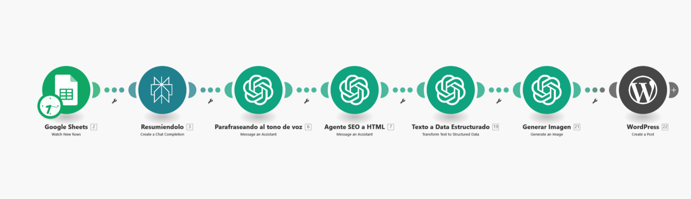

---

## **¿Por qué deberías automatizar tu blog?**

- **Tiempo libre para lo importante**: Te olvidas de las tareas repetitivas, y puedes enfocarte en lo estratégico (tu oferta, tu newsletter o tu negocio).
- **Tráfico constante**: Publicaciones regulares que traen visitas orgánicas a tu sitio.
- **Fácil de escalar**: Una vez que lo configuras, puedes replicarlo para varios nichos.

---

## **Cómo funciona esta automatización**

Vamos a usar [**Make.com**](http://Make.com), una herramienta que conecta más de 10,000 aplicaciones para crear flujos de trabajo automáticos. Este será el corazón del sistema. Además, combinaremos:

- **Google Sheets**: Para almacenar los títulos o URLs que quieras usar como base (**RSS Feeds**: Método alternativo para trabajar con noticias en tiempo real.)
- **Perplexity AI**: Para generar resúmenes desde URLs.
- **OpenAI (ChatGPT y DALL-E)**: Para personalizar el contenido con tu tono de voz y generar imágenes.
- **WordPress**: Donde todo se publica automáticamente.

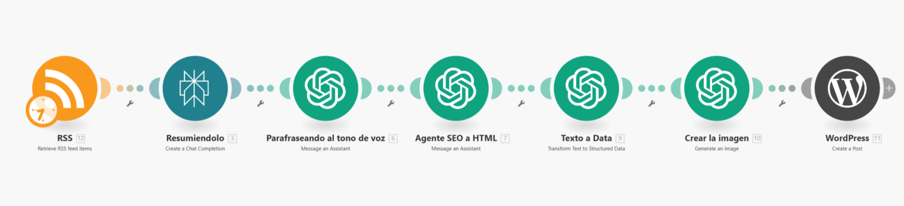

---

#### ***Nota: Recuerda que puedes descargar e importar las automatizaciones al final de esta guía.***

## **Paso a paso para automatizar tu blog**

### **1. Configura **[**Make.com**](http://Make.com)

- Crea un escenario en [Make.com](http://Make.com).
- Usa Google Sheets como disparador. Cada vez que agregues un nuevo link en tu hoja, se activará la automatización.

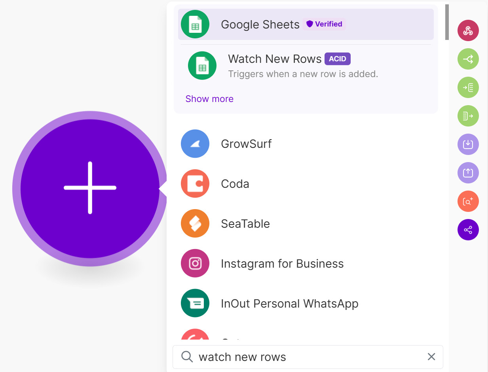

### 2. Configura el módulo de Perplexity para que resuma el contenido del enlace.

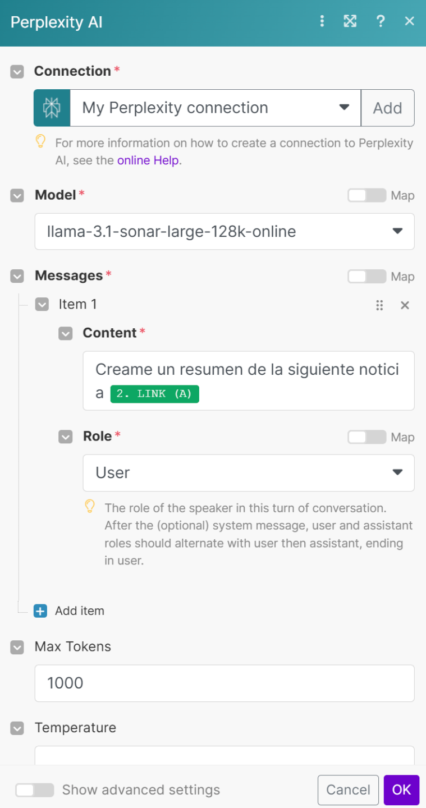

---

### **3. Personaliza el contenido con tu tono de voz**

Esto es clave. Usaremos un agente en OpenAI que adapta el contenido al estilo que tú quieras. Así, no parecerá un texto genérico, sino algo que tú mismo escribirías. Aquí tenemos[ una guía para configurar este agente](https://www.skool.com/imperio-digital/classroom/a65de4cd?md=7132612be2564c469e7a0ced8afbb7e4), pero básicamente se entrena con ejemplos de tu propia escritura. Usaremos el módulo de "Message an assistant"

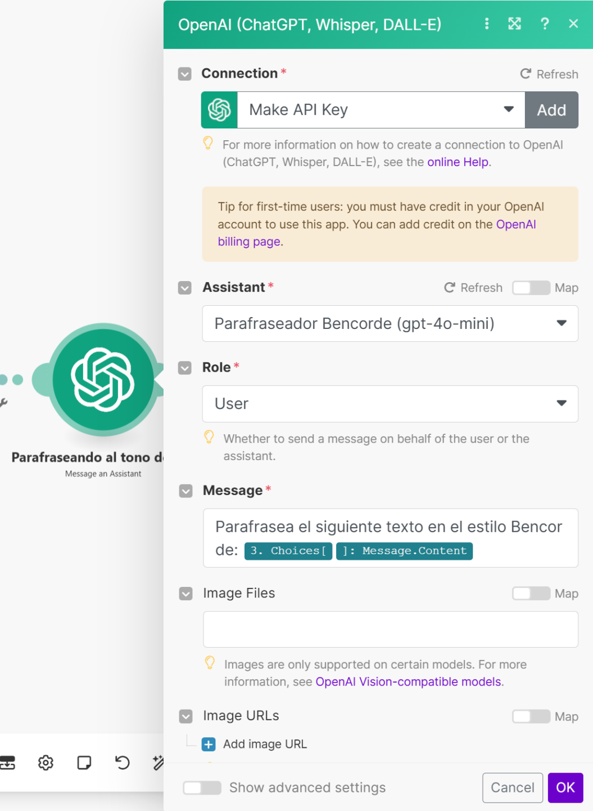

Por ejemplo:

- Prefiero usar "tú" en vez de "usted".
- Hacer las oraciones claras y en voz activa.

El resultado es un contenido que se siente auténtico, pero generado automáticamente.

---

### **4. Optimización SEO y formato HTML (message an assistant)**

Con otro agente en OpenAI, transformamos el texto para que siga las mejores prácticas de SEO y lo convertimos en formato HTML. Las instrucciones de este agente / asistente las puedes encontrar aquí, también te dejo el prompt aquí abajito:

[Agente de SEO para Blogs - Automatizaciones · Imperio Digital](https://www.skool.com/imperio-digital/classroom/a65de4cd?md=5c87216c72ec45cd9e424b218f968e82)

###   
**5. Text to Structured Data: El módulo estrella**

Este paso es donde realmente pasa la magia. Usamos el módulo **Text to Structured Data** para separar el contenido en:

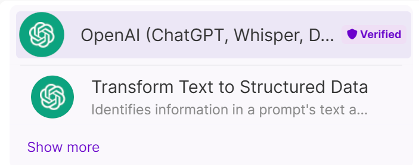

- **Título**: Lo que aparecerá en la cabecera del post.
- **Cuerpo**: El contenido completo, en HTML.

Esto facilita que WordPress pueda recibir cada elemento y publicarlo exactamente donde debe ir.

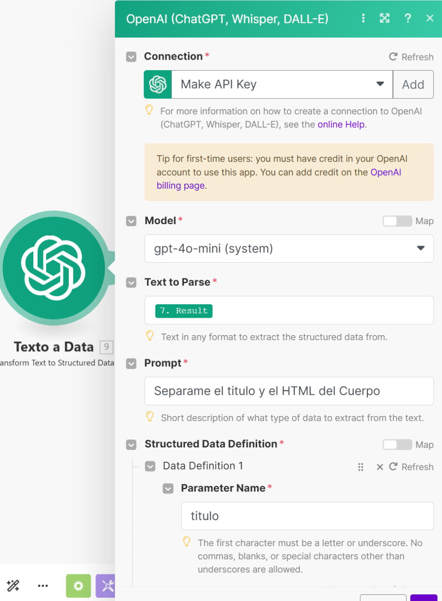

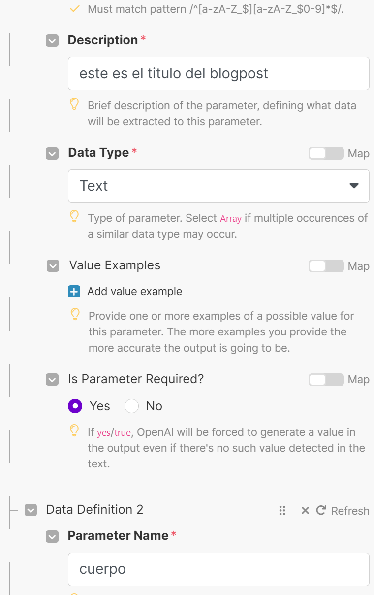

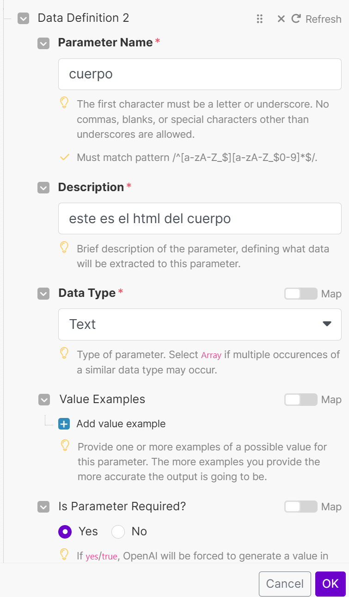

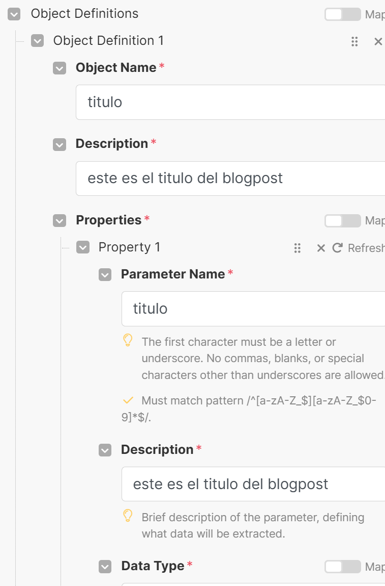

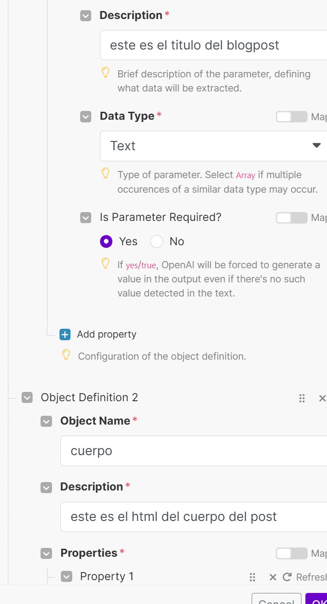

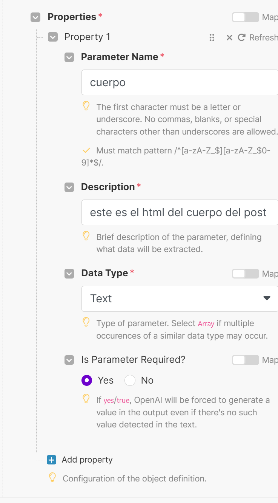

---

### **6. Genera una imagen personalizada**

Para que tu blog luzca profesional, generamos una imagen relevante con **DALL-E 3**. Puedes usar prompts simples como: "Crea una imagen para un artículo sobre el mercado de criptomonedas". Este paso eleva la calidad visual de tus publicaciones, pero también podrías usar otros generadores de imágenes como Flux si quieres resultados más realistas.

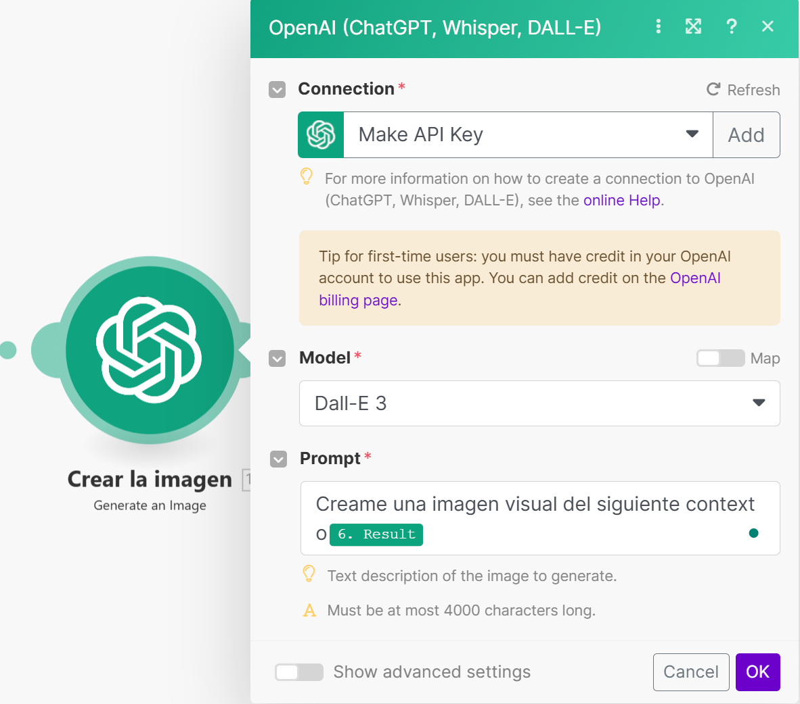

---

### **7. Publica en WordPress automáticamente**

Conecta tu WordPress a [Make.com](http://Make.com) usando el plugin **Make Connector**. Desde ahí, configuras la automatización para que cada post tenga:

- Su título.
- Su cuerpo.
- Su imagen.
- Su estado (puedes publicarlo directamente o dejarlo como borrador).

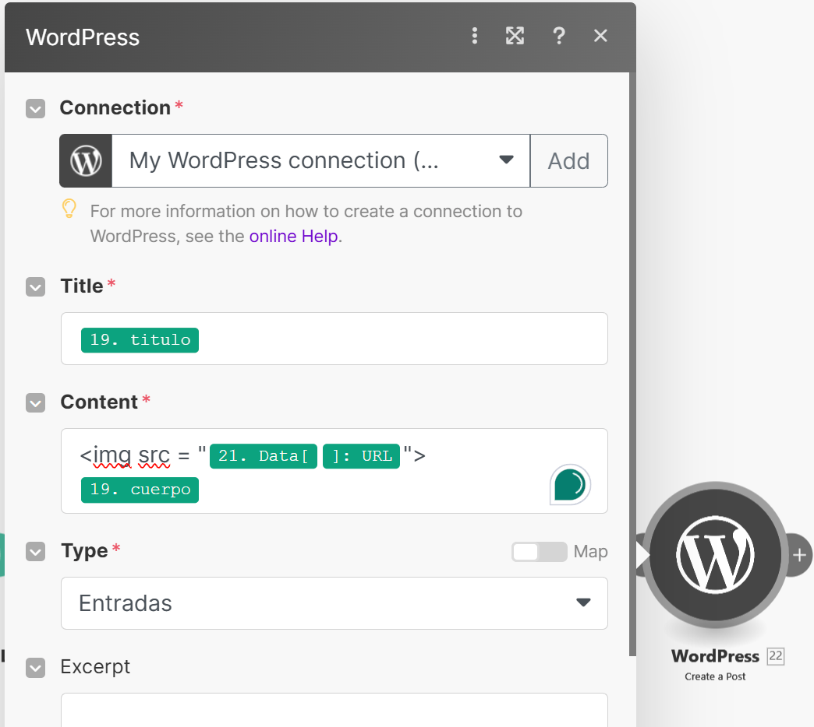

Aquí le pondremos en texto para que no nos salga escrito el URL y se vea la iamgen, el siguiente código HTML que reemplazaremos el [URL] por la variable URL.

> 

---

## **Método alternativo: Trabajar con RSS Feeds**

¿Quieres publicar contenido fresco y relevante en tiempo real? Usa **RSS Feeds**:

1. Crea un feed personalizado en [**rss.app**](http://rss.app).
2. Configúralo como disparador en [Make.com](http://Make.com).
3. Resúmelo y personalízalo con los mismos pasos que vimos antes.

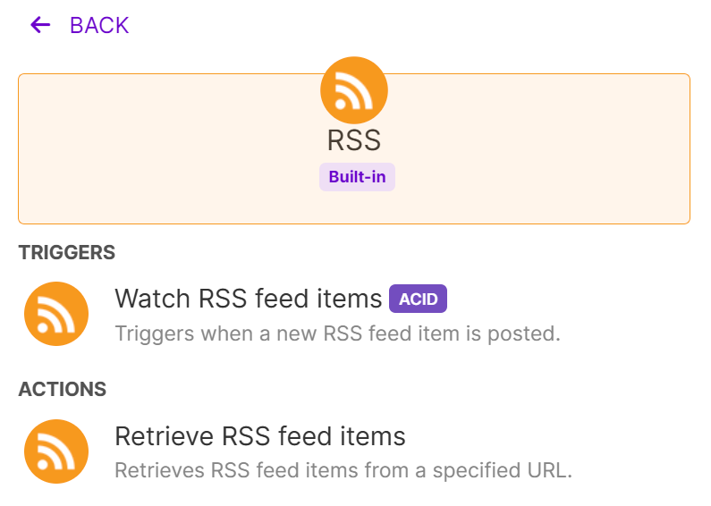

Usaremos "Watch" si queremos que tome los artículos a futuro que se publicarán en un nicho en específico

Usaremos "Retrieve" si queremos tomar artículos que ya han sido previamente publicados.

Esto es ideal si tu blog se enfoca en noticias de nicho, como criptomonedas, inteligencia artificial o tecnología.  
  
Si quieres más información sobre RSS, tenemos [una automatización aquí ](https://www.skool.com/imperio-digital/classroom/a65de4cd?md=5c87216c72ec45cd9e424b218f968e82)que la cubre más a detalle.

---

## **¿Por qué este sistema es tan potente?**

La combinación de **Text to Structured Data**, personalización de tono de voz y optimización SEO te da una ventaja brutal:

- Tu blog no solo será automático, sino que también **se verá y se sentirá profesional**.
- Todo el proceso está diseñado para que incluso alguien sin experiencia pueda configurarlo.

---

## **Recuerda que...**

- Puedes descargar esta automatización completa con un clic aquí abajito.

## 🎙️ Transcripción

estamos en un momento donde gran parte del contenido en internet está siendo generado por Inteligencia artificial queramos o no la curva indica que todo va hacia allá y si es que no estás haciendo lo mismo puedes empezar a quedarte atrás Así que hoy día te voy a mostrar Cómo puedes automatizar al 100% la creación de un blog para que puedas empezar a dedicarle el tiempo a lo que realmente importa y empieces a construir una fuente de tráfico que puedes después dirigir hacia tu oferta principal hacia crecer tu newsletter o simplemente a tener una presencia en internet el sistema que te voy a mostrar ahora es s s simple Incluso si nunca has automatizado nada en tu vida porque hoy día te voy a mostrar el paso a paso y para el final de este video vas a ser capaz de automatizar al 100% una página de blogs por si no me conoces Mi nombre es Benjamín Cordero y soy cofundador de imperio digital un lugar donde nos dedicamos al 100% a automatizar y crear sistemas y flujos de trabajo para poder ahorrar tiempo actualmente somos ya más de 450 miembros y todos tenemos la misma misión Así que si quieres entrar a ver todo el contenido que tenemos publicado aquí adentro acabamos de habilitar una opción para que entres a probar por 7 días completamente gratis si sientes que es para ti después te puedes quedar y si sientes que no es para ti puedes cancelar antes del día 7 y no se te va a cobrar absolutamente nada Ahora sí volvamos a la automatización y déjame contarte un poquito de cómo funciona lo que vamos a usar es una aplicación que se llama make.com el link que está en la descripción y make lo que hace es que nos permite empezar a crear flujos de trabajo y conectar más de 10,000 aplicaciones entre sí esta es la clave si es que queremos empezar a automatizar como podemos ver acá yo tengo una página que es vc.com y aquí es donde Voy subiendo distintos blogs como podemos ver tengo un call to action a suscribirse Ai newsletter y la idea del Blog es derivarlos a través del contenido orgánico a que se suscriban a la lista de mails y lo que voy a hacer hoy día es te voy a mostrar dos métodos distintos para que tú uses el método que más te conviene primero lo que armaremos es en base a a un link Entonces si es que yo creo acá muchos links o muchos títulos de publicaciones que quiero hacer me va a ir tomando uno a uno y va a ir programando y publicando un artículo diario o dos o tres o cinco o 10 para este caso vamos a partir simplemente con el link que está acá y podemos ver que si es que le doy a correr una vez se va a empezar a ejecutar esta automatización que aparece acá No te preocupes porque te voy a mostrar el paso a paso de cómo construirla y también vas a poder acceder a ella para importarla directamente en imperio digital pero para ponerte en contexto un poco de lo que está pasando acá es está tomando esta entrada que aparece acá no se está creando un resumen después está pasando por un agente de tono de voz que está entrenado con como yo hablo para que sea un poquito más familiar y parecido a como yo lo escribiría después está pasando por un agente de seo es decir un agente que te recomienda buenas prácticas de cómo estructurar tus publicaciones para que aparezcan mejor en Google después estamos pasando el texto a Data estamos creando una imagen y después directamente se está publicando en wordpress después Si volvemos aquí al wordpress y vuelvo a actualizar la página vamos a poder ver que se acaba de publicar una nueva entrada y si es que le doy a ver va a estar creada directamente con su imagen y va a estar creado la publicación nota estos agentes los podemos modificar absolutamente como queramos podemos darle una intención de que queremos que cada publicación tenga la intención de redirigir naturalmente hacia unao de nuestros servicios o a vender un producto en específico como afiliado o como es en mi caso hacerle un call to action directamente al newsletter para suscribirlas de correos electrónicos Y ahora te voy a mostrar Cómo crearlo desde cero lo primero que vamos a hacer es Vamos a entrar a make.com nuevamente make es la herramienta que vamos a usar para conectar y crear estos flujos de sistemas de trabajo vamos a darle a ingresar si no te has creado una cuenta tienes el link en la descripción O puedes entrar a make.com y nos vamos a ir a crear un nuevo escenario una vez que estemos acá nos vamos a encontrar con un escenario así y lo que tenemos que hacer es tener un gatillante es decir algo que reciba para que se desencadene la automatización siguiente y después todos los pasos que van a seguir después el primer método que te voy a mostrar es extraer toda la Data directamente de una serie de urls que vamos a ir publicando acá pero después también te voy a mostrar un método alternativo que es para sacar directamente las publicaciones de nuevas noticias que se van publicando en tiempo real y parafraseando olas a tu manera y publicándola tú como blog pero Vámonos a la base vamos a irnos a Google sheets y nos vamos a ir a watch New Rose esta parte se va a desencadenar cada vez que se agregue una nueva fila acá Entonces si es que yo tengo cinco links distintos acá 2 3 4 5 y le ponemos el uno acá y después le damos a prender la automatización Aquí vamos a ver qué va a estar corriendo cada 15 minutos y este intervalo se lo podemos volver a cambiar para que haga por ejemplo una noticia directamente al día por ejemplo entonces volveremos acá y vamos a seleccionar el spreadsheet ID o el ID de El sheets que vamos a estar usando pero también puedes apretar acá y buscarlo manualmente en este caso lo creé y se llama wordpress vamos a elegir el nombre de la hoja que es este nombre que aparece abajo a la izquierda y le voy a poner el límite en uno porque quiero que extraiga de a una fila en una fila después nos vamos a ir a seleccionar todo y le vamos a dar a okay ya conectamos directamente el chips pero ahora tenemos que crear el resumen de la noticia que vamos a hacer te voy a dar un pequeño paréntesis no tiene por qu necesariamente ser una noticia o sea si quisiera podría entrar a chat gbt y podría decirle Dame 30 ideas de contenido de sanación espiritual para madres solteras de 45 años y puedo literalmente copiar todo esto y pegarlo acá si es que no quisiera usar un artículo y quisiera crear un blog po un poquito más Evergreen por ejemplo pero por fines prácticos y mostrarle cómo puede ser aún más útil vamos a quedarnos directamente con los URL volveremos acá y lo que vamos a hacer es tenemos que crear el resumen de esta noticia que está acá verdad Esta noticia es la típica noticia que uso para todas mis automatizaciones y es esta el resumen de la caída de la bolsa mundial para crear el resumen necesitamos poder acceder a la web y para ello vamos a usar un módulo que se llama perplexity create a chat completion aquí quizás vas a tener que cargarle crédito si es que nunca lo has hecho pero no te ocupes porque es realmente económico yo le cargué 5 el año anterior y uso esta automatización muy pero muy seguido vamos a irnos acá donde aparece la ruedita y nos vamos a ir a Api vamos a ver acá que aparece una opción Api kys y vamos a darle a generar una vez que la generemos vamos a copiarla y la vamos a pegar acá en la conexión de perplexity vamos a irnos a agregar y vamos a pegar la Api K acá te recomiendo que no le des esta clave a nadie ya que cualquier persona que tiene tu clave Podría empezar a generar contenido gastando tus créditos Así que ahora sí elegiremos alguno de estos modelos Que aparezca online porque esto significa que puede acceder al internet y nos vamos a abrir la pestaña de mensajes en el rol vamos a elegir usuario y después le vamos a pedir algo como créame un resumen de la siguiente noticia si es que elegimos la otra opción y queremos usar la opción de los post enfocados en la sanación espiritual para madres solteras Vamos a ponerle creamos un resumen de la siguiente noticia y le vamos a poner el link Okay este link va a ser cada una de las celdas que está acá primero esta la segunda vez que se ejecute va a ser esta después la tercera va a ser esta y así continuamente lo mismo elegimos el link pero también si elegiste las ideas de contenido de las madres de sanación soltera por ejemplo no le vamos a poner el link sino que le vamos a poner ideas de contenido por ejemplo en el máximo de tokens da igual le vamos a poner algo cercano a los 1000 Esta es una métrica para limitar la cantidad de créditos que se usa pero general no es tan importante pero sí hay que ponerla y ahora si es que le diéramos a correr una vez lo que está haciendo acá perplexity es crearnos directamente el resumen Pero enja por qué no usamos chat gpt y usamos perplexity porque perplexity por el momento es el único que tiene acceso a sacar la Data de algún URL es decir hay más pero a mí me gusta usar perplexity y en general funciona bastante bien si es que apretamos la Lupita acá abrimos las opciones apretamos el uno y abrimos el contenido vamos a poder ver que efectivamente nos acaba de hacer el resumen directamente ahora ya tenemos el resumen de la noticia pero ahora queremos personalizarlo aún más y lo que voy a mostrarte ahora es probablemente una de las cosas más importantes que vas a ver porque voy a mostrarte un asistente específico que nos ayuda a usar nuestro tono de voz y a transcribir las noticias con nuestro propio tono de voz vamos a irnos a platform openi y vamos a buscar el playground una vez que estemos acá podemos crear un asistente este asistente va a ser entrenado con alguna información en específico con una instrucción y con un contexto en específico si nos vamos acá y abrimos la opción de los asistentes vamos a poder apretar crear un nuevo asistente justo acá y aquí lo que vamos a hacer primero es ponerle un tono de voz Este paso no es completamente necesario pero sí siento que me da mucho mucho mejor resultado aquí dentro de la comunidad tenemos un agente de tonalidad que también te explico Cómo usarlo pero es super super interesante porque lo que hacemos Es literalmente copiar esto que está acá le pegas algún texto que hayas escrito previamente y te va a empezar a sacar todo el vocabulario tanto formal como informal y tu estilo de comunicación y tu tono de voz en un solo promto por ejemplo Prefiero usar tú en vez de usted hago las oraciones claras Y en voz activa y todo esto en base a textos que yo ya he escrito de todas maneras dentro de imperio digital tengo una sección donde te explico Cómo configurar bien este agente de tono de voz pero nuevamente no es estrictamente necesario pero sí siento que mejora mucho mucho el resultado después vamos a literalmente copiar todo esto y lo vamos a pegar acá en el sistema de instrucciones yo ya tengo creado el mío que se llama parafraseador Ben corde cuya instrucción es cualquier texto que entra Necesito que lo reescriban usando la guía de tono de voz y aquí está todas las cosas que la Inteligencia artificial puede interpretar de mi estilo de comunicación Así que bien Esto es un asistente Cómo conectamos el asistente a la automatización que estamos usando vamos a apretar este más y vamos a buscar chat gpt vamos a entrar a Open Ai y le vamos a dar a mandarle un mensaje al asistente rápidamente si es que no quieres hacer esta parte de los asistentes y quieres una respuesta un poco menos específica puedes irte a Open Ai y create a chat completion y aquí le puedes directamente escribir un prompt en lo personal me gusta crear asistentes porque después los creo una vez y ya sé exactamente el rol que tienen que cumplir y me permite entrar en mucho mucho mayor detalle y conseguir mejor el resultado que yo quiero pero si quisieras hacerlo con create a completion es decir un prompt estándar podrías simplemente elegir el modelo agregar el mensaje elegir el rol y escribirle el contenido créame o escríbeme esto en este estilo y en fin Pero prefiero mostrarte Cómo usar los asistentes porque son algo que realmente te van a servir mucho en un futuro vamos a apretar Entonces el message and assistant y Dios que teníamos creado el parafraseador de Ben corde por si no me conocen Ben corde es mi alias entonces parafraseador Ben corde y vamos a seleccionar el rol de usuario después le voy a poner algo por el estilo de parafrasea el siguiente texto en el estilo decorde Y como ya sabe cuál es mi estilo Porque está entrenado en el asistente anterior solamente necesito darle el resumen vamos a abrir choices vamos a abrir mensaje y vamos a abrir el contenido voy a darle a Okay y Listo ya tenemos que estamos sacando el link estamos transformando el link verdad y resumiendo y aquí lo que estamos haciendo es lo estamos parafraseando al tono de voz después lo que vamos a hacer es vamos a mandarle un mensaje a otro asistente que está personalizado y entrenado con las mejores prácticas de seo para que tu blogpost pueda ranquear de una mejor manera Entonces esto que le da la autenticidad a la publicación combinado con las buenas prácticas va a hacer que el resultado sea mucho mucho mucho mejor así que nuevamente abriremos acá y iremos a message an assistant ahora tenemos que escribirle al asistente que nos crea los blog po que los va a sacar en formato html para que se vea aún mejor html es el formato que está detrás de cómo se ve directamente o la estructura Perdón que tiene un texto cuando tiene un display en algún dispositivo Pero no te preocupes porque no vamos a escribir una línea de código ahora Necesitamos crear el asistente que es experto en Seo Y nuevamente Te dejé publicado en imperio digital Cuál es el asistente de seo para blogs si es que bajamos bajamos bajamos vamos a encontrar este recurso acá y este está entrenado con las mejores prácticas que podemos usar para crear un blog y empezar a ranquear directamente así que puedes entrar a Imperio digital puedes usarlo Y recuerda que tienes 7 días gratis para acceder si quieres aprovechar todos estos recursos y después si te sales antes del día 7 no se te va a cobrar absolutamente nada Pero estoy seguro que una vez que entre este te vas a querer quedar adentro Así que volveremos acá y nos iremos a la pestaña de los asistentes copiaremos lo que acabamos de ver y después lo pegaremos la idea de este agente es un agente de blogpost de seo que nos va a generar el contenido directamente en html para que después se publique de manera automática en la estructura que necesitamos es decir creando los headers o los títulos más grandes después los más pequeños separándolo en párrafos y en fin le vamos a dar a guardar porque esto ya está listo y le voy a poner agente seo blog y le voy a poner versión 2s porque es la segunda vez que lo creo una vez que ya esté creado volveremos acá y ahora sí podemos actualizar los asistentes y podemos ver que nos aparece acá agente seo blog b2 Ah bueno quizás no te lo mencioné Pero puede ser que tengas que conectar el apq de Open Ai tal cual lo hicimos con perplexity Y eso lo puedes hacer si es que te vienes acá al cuadradito que sale apis le das a crear nueva llave secreta y después vuelves acá y le pones agregar y pegas la llave secreta Pero en fin ahora sí acabamos de parafrasear en nuestro estilo el resumen verdad lo que tenemos que hacer ahora es mandárselo al agente seo a html le damos a dar a Okay y Necesitamos entregarle el mensaje que creamos previamente de nuestro estilo de escritura para eso le voy a poner este prom que es ahora pásame esto que acabamos de crear y Pásamela a formato html y manten el estilo de comunicación Necesito que incluyas un título y un cuerpo y no incl incluyas estos caracteres en específico acá le voy a poner el resultado que acabamos de generar con chat gpt voy a darle a Okay y listo ahora si es que le doy a correr una vez lo que va a estar pasando es directamente acaba de extraer la Data desde wordpress verdad acaba de sacar el link y me está generando directamente el resumen con perplexity podemos ver que aquí está literalmente resumiendo y ahora está pasándolo a nuestro agente de voz si es que abrimos el contenido vamos vamos a ver el resumen bastante genérico después si es que lo parafraseamos a nuestro estilo de voz podemos abrir el texto y me lo va a escribir directamente en mi estilo me lo entregó el markdown como podemos ver acá pero este es el que realmente nos importa que es el contenido que nos acaba de generar si abrimos el valor vamos a ver que este es el contenido html que nosotros estamos buscando porque este es el que vamos a poder pasarle a wordpress para que lo publique y que se vea visualmente atractivo Así que Listo ya tenemos el título y tenemos el cuerpo verdad Pero qué pasa cuando nosotros queremos publicarlo directamente en wordpress que ya les voy a mostrar Cómo hacer esto no lo hagan todavía y buscamos acá la opción de crear una publicación vamos a ver que se nos presentan las siguientes variables el título y el contenido Qué pasa ahora en este momento tenemos un html Y tenemos un texto super lgo pero no los tenemos separados en Data Entonces no puedo poner el título y el contenido y aquí es donde entra uno de potencialmente los módulos más prá ticos que Open Ai ha lanzado en el último tiempo que es text to structor Data text to structor Data Este es el puente entre la Inteligencia artificial y la lógica una vez que usamos este módulo podemos empezar a crear distintas variables con la interpretación y el razonamiento de Inteligencia artificial es s super práctico super útil porque nos va a permitir separar este texto gigante por ejemplo en Data estructurada Como por ejemplo el título y el cuerpo así que nuevamente vamos a elegir el modelo voy a elegir el más económico gpt 4 mini el texto que vamos a separar en las distintas variables va a ser este que está acá el html entonces en el prom que le vamos a poner es sepárame el título y el html del cuerpo después lo que tenemos que hacer es decirle separamos el título y el html del cuerpo en dos datas distintas el título como texto y el cuerpo en formato html después vamos a ponerle la structure Data information y lo que vamos a hacer acá es nuevamente vamos a definir Cuáles son las variables que queremos rescatar por ejemplo queremos primero el título y le vamos a poner este es el título del blogpost en dat Ty type le vamos a poner texto y le vamos a poner que es un parámetro requerido después vamos a hacer nuevamente lo mismo pero con el cuerpo Aquí le voy a poner cuerpo y le voy a poner este es el cuerpo del blogpost en html dat Ty type le voy a poner texto y le voy a poner que es requerido vamos a hacerlo nuevamente Pero esta vez como objetos vamos a ir a título le vamos a poner este es el título del Blog post en texto verdad y después vamos a agregarle la propiedad que sería nuevamente el título y la descripción que va a ser exactamente la misma dat type le vamos a poner texto y le vamos a poner que esto es requerido y después vamos a agregarle el segundo objeto que vendría siendo el cuerpo y le vamos a poner este es el cuerpo de la noticia en html nuevamente Vamos a ponerle el nombre del parámetro que es cuerpo y la descripción Este es el cuerpo de la noticia en html le vamos a poner texto y vamos a ponerle que es requerido ahora si es que le doy a correr a la automatización lo que va a hacer es primero nos va a crear el resumen después nos lo va a parafrasear con nuestro propio estilo de voz y nos lo va a personalizar absolutamente como queramos después nos va a crear directamente en este módulo el código htm l que es el que nos va a ayudar a estructurarlo visualmente de una manera atractiva Al momento de publicarlo como blogpost y después ese texto o ese código nos va a separar en la variable título verdad que la vamos a poder poner en el campo de título en el blogpost y la variable cuerpo que es el cuerpo formateado de una manera que va a ser visualmente más atractiva porque va a tener grandes títulos y subtítulos ahora si es que aprieto acá y abrimos el cuerpo vamos vamos a poder ver que está efectivamente separado tanto en título como en el cuerpo y Estas son las variables que nosotros vamos a subir a nuestro blog Porque recordemos si es que nos vamos acá y nos vamos a wordpress y nos damos a crear un post ahora vamos a tener directamente las variables para poner en el campo título y para poner en el campo cuerpo y aprovecho hacer la mención a todos los miembros que subieron a nivel 4 en el mes de noviembre dentro de imperio digital tenemos a Juan Cordero que es sorprendentemente no es nada relativo mío tenemos a Alberto era y su programa de productividad eficiencia tenemos a Bernardo Nano el salvi que nos manda saludos desde eh Santiago de Chile tenemos a Rodrigo Muñoz que tiene su emprendimiento de atomo punc tenemos a Denis vino alias de vino 77 a Santiago perfecto que es el fundador de The monkey lab tenemos a gusto Cárdenas Osa que es un contador de Colombia tenemos a Óscar roset tenemos a Sergio Martínez tenemos a rainis tenemos a Antonio Ramírez que es un creador de imagena y de nti Y tenemos a Gabi rojas todos subieron a nivel 4 dentro de imperio digital en el mes de noviembre Así que mis más sinceras felicitaciones a cada uno de ellos Ahora sí sigue video pero todavía nos falta algo para hacerlo visualmente aún más atractivo Y esto es crear una imagen por fines prácticos vamos a crear la imagen directamente con Dali ya que le cargamos créditos a char gpt y queremos aprovecharlos Pero si quisiéramos hacerlo más eficiente probablemente usaría algún generador de imágenes como flux que crea imágenes más realistas pero vamos a irnos acá a Open Ai y nos vamos a ir donde sale generar una imagen vamos a elegir el modelo vamos a elegir Dali 3 y le voy a poner creamos una imagen con elementos visuales del siguiente contexto Aquí le voy a pegar el parafraseado el tono de voz porque es más simple y le vamos a dar a Okay ahora sí lo que podemos hacer es directamente publicarlo en nuestro sitio web de wordpress para eso vamos a irnos a wordpress y vamos a irnos a crear un post aquí probablemente te va a aparecer algo así con dos espacios que tenemos que rellenar el primero es el ap key y el segundo es el Rest Api o nuestra página web para conseguir nuestro ap key lo que vamos a hacer es vamos a irnos a nuestro sitio web de wordpress y vamos a bajar donde sale los plugins vamos a irnos a Añadir un nuevo plugin porque tenemos que conectarlo a make recordemos que estas son las credenciales con las que podemos comunicarnos entre wordpress y make en este caso vamos a irnos acá y vamos a buscar make en la barra del buscador vamos a buscar y seleccionar la opción que sale make connector y le vamos a dar a instalar ahora yo ya lo tengo activo y ya lo instalé Pero tú simplemente apretaría este botón que sale instalar ahora y después cuando se te abra esto le vamos a dar a a activar el botón que está abajo a la derecha después vamos a irnos abajo a la izquierda y vamos a seleccionar la opción que sale make aquí tenemos nuestra clave o nuestra ap key que vamos a seleccionar la vamos a copiar y la vamos a pegar acá después tenemos que ponerle el wordpress Rest appy que no es nada más que tu URL seguido de una palabra por ejemplo si mi página web es Ben corde.com yo voy a copiar directamente Este título y lo voy a pegar en make acá después le voy a apretar Barrita y le voy a poner wp raya Jason raya y después le vamos a dar a guardar y ahora sí te debería aparecer algo así aquí es donde vamos a ponerle el título que acabamos de separar verdad recordamos que acá lo separamos tanto en título como en cuerpo entonces acá le vamos a poner directamente el título y en el contenido le vamos a agregar el cuerpo ahora es importante que le agreguemos la imagen que acabamos de crear y si es que yo llegase y simplemente me fuese a Data y pongo el URL me va a aparecer el URL y no me va a mostrar la imagen entonces lo que tenemos que hacer acá es decirle en código html Oye no quiero que me muestres el link quiero que me muestres la imagen y eso se hace de una manera muy simple vamos a abrir los corchetes vamos a ponerle image source img espacio src espacio es igual a ahora sí le ponemos el URL y cerramos con unas comillas y con este símbolo acá y de esta manera lo que le estamos diciendo es Oye quiero que me lo muestres como una imagen no como un texto Ahora aquí abajo en el tipo vamos a decir qué tipo queremos hacer por ejemplo una publicación e queremos publicarlo como página y como estamos haciendo un blog po lo vamos a seleccionar como entrada después en la fecha lo podemos dejar así tal cual y esta parte es importante porque esta es el estado en el que lo vamos a publicar si lo dejamos en vacío se va a publicar como un borrador y si lo dejamos en publish se va a hacer la publicación de manera automática si tienes categorías podrías seleccionar alguna categoría acá pero en fin no lo vamos a hacer y le vamos a dar a Okay vamos a guardar la automatización y ahora si es que le damos a correr vamos a ver que efectivamente está tomando la noticia nos está creando el resumen con perplexity nos va a parafrasear con nuestro propio estilo después nos va a crear el código html con las mejores prácticas de seo después nos va a transformar esta Data dir directamente a Data que podamos usar porque recordemos que este es el puente entre la Inteligencia artificial y la lógica y después nos va a generar una imagen que va a publicar en nuestro sitio web de wordpress yo voy a volver acá me voy a ir a las entradas vemos que ya tenemos uno publicado que era el que había publicado al principio del video y ahora sí podemos ver que se sigue generando y que en este momento se está publicando directamente en wordpress se acaba de publicar y actual actualizamos la página vamos a ver que aquí tenemos la noticia respectivamente con la imagen y con toda la noticia que nos aparece Y esto es solamente el inicio porque desde aquí las opciones son Realmente infinitas supongamos por ejemplo que esta misma noticia que acabamos de crear quisiera publicarlas en no sé linkedin Twitter Facebook desde aquí en adelante ya las opciones son infinitas simplemente tendría que cambiar esto acá agregarle un nuevo módulo que se llama un router que nos permite crear nuevos caminos a tomar y podría hacer algo como no sé publicarlo en linkedin por ejemplo vamos a apretar más vamos a crear una imagen y aquí simplemente ponemos la imagen que acabamos de crear le damos el título le damos el cuerpo Verdad que es la noticia y le damos a Okay supongamos que también queremos publicarlo en no sé una publicación de Facebook vamos a irnos acá vamos a crear un post vamos a seleccionar la página y vamos a ponerle el mensaje Por ejemplo de no sé el parafraseado por ejemplo que creamos antes o lo mismo si quisiéramos hacerlo en instagram por ejemplo nos iríamos acá crear una imagen Es decir una publicación con imagen pondríamos el URL de la imagen que acabamos de crear y le pondríamos algún caption en específico en fin las oportunidades y las opciones con esto son Realmente infinitas porque en el fondo de eso se trata de que vayamos conociendo los módulos y que poco a poco podamos ir adaptándolo a cada necesidad que vamos teniendo y empezar a construir nuestros propios sistemas que funcionan y justamente de eso se trata imperio digital en imperio digital Estamos buscando ahorrar tiempo mediante automatizaciones sea porque las quieres implementar en tus negocios o vendérselas a alguien más y puedes combinarlas absolutamente como quieras porque tenemos muchas muchas automatizaciones que puedes literalmente descargar e importar de hecho esta misma automatización la puedes descargar e importar directamente Por ejemplo si es que nos vamos acá creamos un nuevo escenario buscas la automatización en automatizaciones que acabamos de crear le das los tres puntitos le das a importar Y seleccionas la automatización toda esta automatización que acabamos de armar ya vas a poder importarla directamente y de eso se trata imperio digital de poder darte los recursos para que tú puedas automatizar tu propio camino pero recuerdas que al principio del video te dije que te iba a mostrar un método alternativo que también funcionaba bastante bien para automatizar específicamente la creación de blogs porque claro actualmente tenemos esto que son los distintos links que nosotros estamos viendo pero qué si quisiera automatizar un canal o un blog post directamente con noticias nuevas que van saliendo Bueno te voy a mostrar un método alternativo que No necesariamente necesitamos esto sino que lo voy a borrar y vamos a usar una aplicación que se llama rss rss lo que nos permite hacer es crear feeds personalizados de noticias que son de nuestro interés por ejemplo Inteligencia artificial criptomonedas economía cualquier Nicho o cualquier etiqueta de cualquier artículo o noticia que vaya saliendo nosotros podemos desencadenar esta automatización en tiempo real Así que lo que vamos a hacer es Buscar el módulo de rss Si queremos ver futuras noticias que van saliendo vamos a usar el watch Si queremos ver noticias anteriores y buscar vamos a usar retrieve para este caso Se los voy a mostrar cómo sería con retrieve aquí nos va a pedir un URL y para poner el URL Vamos a entrar a rss.app y vamos a crear nuestro nuestro propio Fed personalizado nos vamos a ir acá y Vamos a ingresar y una vez que nos creemos una cuenta vamos a ver que tenemos la opción de crear un nuevo feed vamos a irnos acá a agregar nuevo feed y desde aquí podemos elegir de dónde queremos sacar la información si queremos hacerlo de Twitter de Instagram de Google news de páginas etcétera Pero también tenemos una opción que es un poco más simple que es elijamos un Nicho y veamos de dónde lo sacamos para este caso supongamos que quiero hacerlo de criptomonedas entonces voy a buscar # criptomonedas y después le vamos a dar directamente a generar una vez que estemos acá vamos a ver que estas son las últimas noticias que han ido saliendo por ejemplo esta que fue publicada hace una hora esta también hace una hora esta hace dos esta hace dos después esta hace dos y así 3 horas 3 horas y todo relacionado a criptomonedas le voy a dar acá a save feed o guardar feed y este link que nos aparece acá es el que nosotros vamos a querer copiar vamos a volver a make y vamos a ponerle el URL después vamos a ver la cantidad de ems que queremos que nos devuelva directamente y le vamos a poner uno le voy a dar a okay Y aquí podemos ver que ya no estamos Llamando al URL del Google sheets sino que necesitamos Llamar al URL o a la noticia que acabamos de sacar del rss Porque si es que le damos a correr independientemente a este módulo podemos ver que aquí tenemos la descripción tenemos el resumen tenemos el URL y en fin entonces si quisiera resumirlo le diría créame un resumen de la siguiente noticia aquí le pondría el título verdad después le pondría la descripción después le pondría el resumen y de ser necesario le podría poner el URL le vamos a dar okay Y ahora si es que corremos directamente esta automatización va a pasar exactamente lo mismo que vimos y nos va a publicar una noticia pero relacionado a esto para que veas le voy a dar a correr una vez y aquí nos acaba de sacar la siguiente noticia y va a empezar a pasar todo el sistema nuevamente de hecho perplexity en este caso no sería necesario ya que podemos extraer la Data directamente desde rcs y trabajarlo con un módulo de Open Ai o de chat gpt pero eso es lo importante quiero mostrarte las herramientas de las cosas que podemos hacer para que después tú empieces a armar tu propio camino y adaptar estas automatizaciones a las necesidades que tú vas teniendo por ejemplo Esta automatización es s similar a una que armamos hace un tiempo dentro de imperio digital que es esta de acá que en base a una noticia directamente nos genera contenido específico para cuatro plataformas distintas Pero en fin podemos ver acá si es que volvemos al blog po que está en proceso de crearse que debería funcionar Exactamente igual nos resume la noticia después nos parafrasea la noticia con nuestro estilo de comunicación nos crea el código html nos lo estructura en una Data específica y después nos crea la imagen una vez que nos crea la imagen se publica y Si volvemos a AC wordpress y actualizamos nuestro sitio web vamos a ver que tenemos la noticia de el bloqueo de criptomonedas en Camboya si es que vemos acá vemos que nos generó una imagen que está relacionada a esto y nos hizo nuestra publicación porque el bloqueo qué es lo que pasó contexto regulatorio y en fin desde acá podemos adaptarlo y empezar a jugar con él y hacer absolutamente lo que queramos podemos mandarlos como mail podemos automatizar un newsletter podemos automatizar un canal de noticias podemos hacer muchas muchas cosas pero es importante que conozcamos los módulos base Cada cuánto va a correr esta automatización Bueno aquí abajito a la izquierda tenemos los intervalos de tiempo con los que correría la automatización si es que le doy aprender y aprieto esta flechita que está acá va a correr cada 15 minutos pero también se lo puedo cambiar para que corra una vez al día verdad o por ejemplo que pase cada no sé 120 minutos te invento y esto sería Cada cuánto cu tiempo se ejecuta porque esto es lo que se conoce como un disparador y dentro de imperio digital También tenemos un módulo donde cubrimos literalmente make desde cero y tenemos una parte donde cubrimos Cómo funcionan los disparadores o los triggers También te recomiendo que la veas si es que esto es algo que te interesa y quieres aprender a automatizar desde la base y todo el razonamiento lógico y todas las herramientas y módulos que necesitas para nivelar la cancha recomiendo que te veas este curso Recuerda que puedes entrar por 7 días completamente gratis y si sientes que no es para ti y cancelas antes del día 7 no se te va a cobrar absolutamente nada pero es s super interesante porque dentro del imperio digital intentamos de mantenernos a la vanguardia de lo que está pasando y como nosotros podríamos realmente empezar a sacarle provecho a esta nueva era de información que estamos entrando además Tienes todas las automatizaciones que puedes llegar e importar con un par de clics y las sesiones en vivo que son los lunes miércoles y viernes porque en el fondo creo que de eso se trata de que aprendamos la base y después personalicemos todo esto para como nosotros lo estimemos conveniente estamos entrando en una era no coder es decir ya no es necesario saber programar para empezar a crear sistemas que funcionan que podamos implementar o que podamos vender y nuestra meta o nuestra idea es poder enseñarte directamente esos sistemas y que también los vayamos descubriendo juntos tenemos gente dentro de la comunidad incluso que ha vendido automatizaciones por más de 17,000 porque realmente saben cómo hacer ver el valor de una automatización porque recordemos esto que estás viendo acá es la base es el desde porque nosotros creemos en imperio digital que todo sistema complejo es la evolución de un sistema simple que funciona una vez que hacemos ese sistema funcionar podemos empezar a complejizar y empezar a adaptarlo realmente a nuestras necesidades y no solo a nuestras necesidades sino las necesidades de la persona quizás a la que le queramos vender este tipo de soluciones ah así que sin más que decir si quieres entrar en Perú digital Recuerda que tienes 7 días completamente gratis y puedes comenzar a implementar este tipo de soluciones por tu cuenta si no te has suscrito a mi canal de YouTube también recomiendo que te suscribas porque estamos subiendo mucho mucho contenido interesante intentando de mantenernos a la vanguardia de lo que está pasando y si quieres una guía detallada del paso a paso de todo el video que acabamos de hacer También la puedes encontrar dentro de imperio digital el link está en la descripción mucho éxito y feliz automatismo ación
