# 📰 RSS Para Crear Contenido en Tiempo Real

> Ruta: Automatizaciones Make › 📰 RSS Para Crear Contenido en Tiempo Real

**🎬 Vídeo (28.8 min):** https://www.youtube.com/watch?v=lxJR5kFomMg

**📎 Recursos:**
- (RETRIEVE) RSS a Redes Existentes
- (WATCHNEW) RSS a Redes Nuevos Post

---

Esta automatización te permite publicar contenido automáticamente en tus redes sociales como Instagram, Facebook, LinkedIn y X (Twitter). Utilizando feeds [RSS](https://bencorde.com/rss), extrae contenido relevante en tiempo real de páginas, genera descripciones o resúmenes con inteligencia artificial, crea imágenes personalizadas con DALL-E para Instagram y programa publicaciones en cada plataforma. 

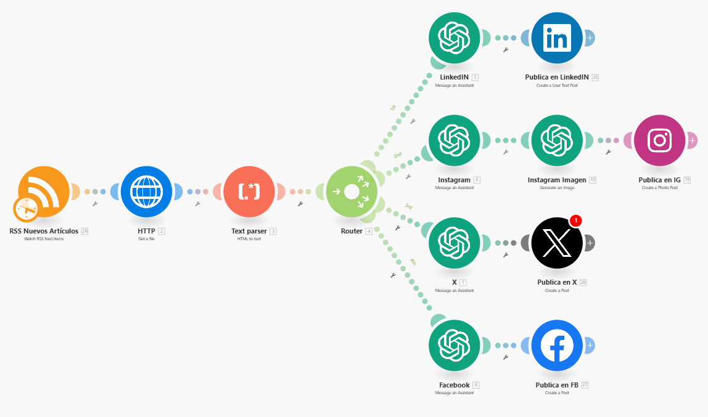

Todo funciona de manera automática, asegurando que tus cuentas estén siempre actualizadas sin intervención manual.

## **Paso 1: Configurar la Fuente RSS**

**¿Qué es **[**RSS**](https://bencorde.com/rss)**?**  
RSS (Really Simple Syndication) es una tecnología que permite a los sitios web enviar actualizaciones automáticas de su contenido. Cuando un sitio publica un artículo nuevo, este se agrega a un "feed" que puedes suscribirte para recibir automáticamente las actualizaciones. En esta guía, usaremos [RSS ](https://bencorde.com/rss)para extraer artículos y publicaciones relevantes para tus redes sociales.

**Configuración inicial**:

1. **Crea una cuenta en **[**RSS.app**](https://bencorde.com/rss): Es gratis y fácil de usar.
2. **Crear un nuevo feed**: - Haz clic en "Crear nuevo feed". 
- Selecciona los temas o palabras clave que te interesen, como "artificial intelligence", "marketing", o cualquier otro nicho relevante para ti (no te preocupes, las traduciremos más adelante) 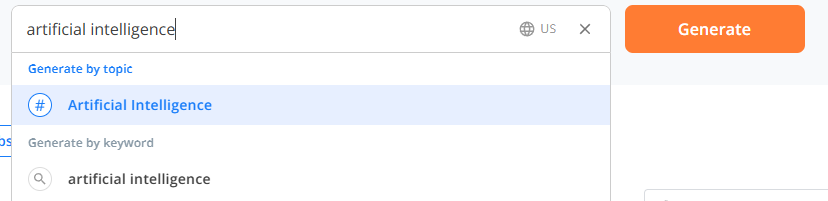
- Trabajaremos con la versión gratuita, pero si tienes la versión premium puedes configurar listas blancas y negras de palabras clave para afinar aún más el contenido, por ejemplo filtrat "inteligencia artificial" con "agricultura" y sólo te aparecerán noticias de IA que involucren agricultura.
- Dale a guardar o "Save Feed"
- Copia el archivo XML  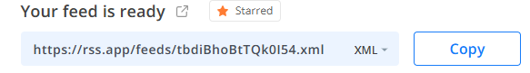

---

## ***Paso (opcional) Importar la Automatización en ***[***Make.com***](http://Make.com)

***(Si no quieres construir la automatización, puedes importarla directamente, siguiendo estos pasos)***

1. ***Importar el JSON del escenario****:* - *Descarga el archivo JSON al final de esta página.*
- *Sube el archivo en *[*Make.com*](http://Make.com)* apretando los 3 puntitos y seleccionando "Import Blueprint" para cargar todos los módulos y conexiones automáticamente.*

## **Paso 2: Construir la Automatización en **[**Make.com**](http://Make.com)

Entraremos a Make y crearemos la automatización (también peudes importarla directamente si prefieres). Cuando construyas la automatización, tienes dos opciones para manejar el feed [RSS](https://bencorde.com/rss):

1. **"Watch new RSS feed items"**: Este módulo observará las nuevas publicaciones que salgan a partir de ahora. Es ideal si quieres que las publicaciones se publiquen automáticamente conforme se vayan generando.
2. **"Retrieve RSS feed items"**: Este módulo recupera las publicaciones ya existentes. Es útil para hacer pruebas y no tener que esperar a que salga una nueva publicación. 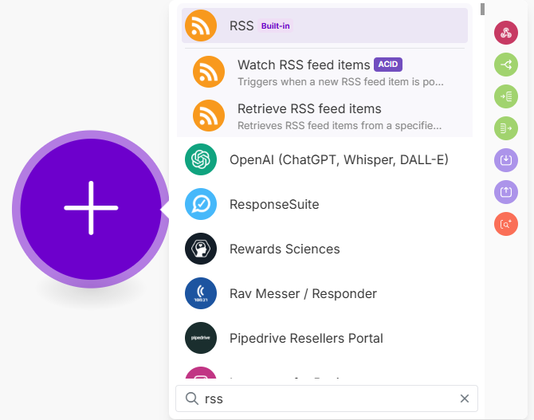

**¿Cuál usar?**

- **Usaremos "Retrieve RSS feed items"** por ahora para comprobar que la automatización funciona, ya que permite extraer contenido de inmediato (es decir contenido que ya fue publicado)
- **Cuando quieras que funcione en automático**, cambia a **"Watch new RSS feed items"**, que publicará las nuevas actualizaciones conforme se generen (es decir contenido que se publicará en el futuro)

1. **Añadir el módulo de recuperación de RSS**: - Usa el módulo "Retrieve RSS feed items" para pruebas e ingresa la URL XML copiada de tu feed RSS. 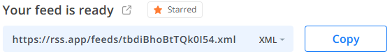
- Especifica cuántos artículos deseas obtener (ej.: 2 para empezar). 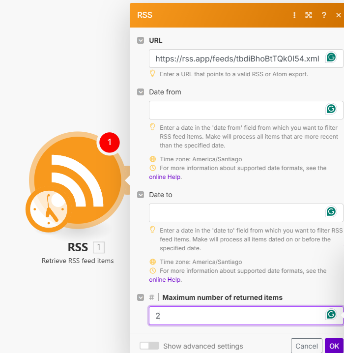
- **Testea** este módulo para verificar que se están extrayendo los artículos correctamente y poder vincular los pasos siguientes. 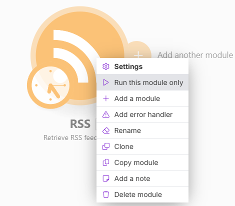

> **Recuerda**: Cambia el módulo a "Watch new RSS feed items" cuando quieras que la automatización siga funcionando en tiempo real.

---

## **Paso 3: Extraer y Formatear el Contenido**

1. **Añade el módulo “HTTP > Get a File”**: 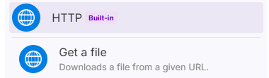 - Descarga el contenido del artículo utilizando la URL obtenida del feed RSS (nota, es el "URL" que aparece arriba 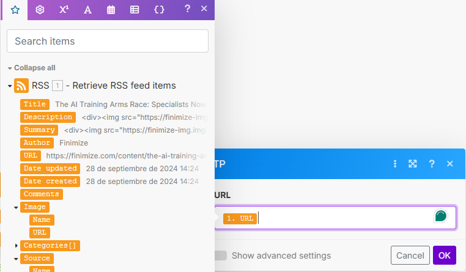 Le daremos a "Run this module" o correr el modulo individualmente para que podamos seguir extrayendo la data en siguientes modulos
2. **Convertir HTML a Texto**: - Usa el módulo “Text Parser > HTML to Text” para convertir el HTML del artículo en texto plano. 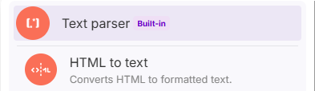 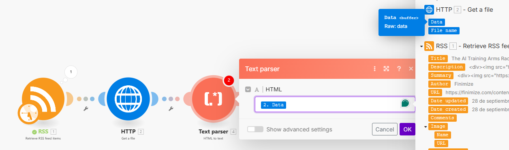
- Verifica que el módulo funcione extrayendo el texto correctamente.

---

## **Paso 4: Añadir un Router para Diversificar la Automatización**

1. **Agregar un Router en **[**Make.com**](http://Make.com): - El router te permite dividir el flujo en diferentes caminos para distintas redes sociales. 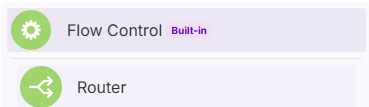
- Crearemos rutas personalizadas para Instagram, Facebook, LinkedIn y X (Twitter), asegurando que cada una reciba el formato correcto de contenido.

---

## **Paso 5: Configurar Asistentes de OpenAI**

1. **Usa los asistentes preconfigurados**:  
Ya tienes asistentes pre-entrenados disponibles para cada red social en la comunidad **Imperio Digital**: - **Facebook**: [Asistente de Facebook](https://www.skool.com/imperio-digital/classroom/a65de4cd?md=fc86ac00adbc4cc7a2d0e3e5ced904fc)
- **Instagram**: [Asistente de Instagram](https://www.skool.com/imperio-digital/classroom/a65de4cd?md=5b071e54617c49008ede9441eaf68275)
- **X**: [Asistente de X](https://www.skool.com/imperio-digital/classroom/a65de4cd?md=a9b77d8ba8e24753991aa2947c7f756c)
- **LinkedIn**: [Asistente de LinkedIn](https://www.skool.com/imperio-digital/classroom/a65de4cd?md=14089265afd84492879a3b8ea3f0bd6a) - Si no has creado los asistentes, puedes ver como crearlos en el [siguiente link](https://www.skool.com/imperio-digital/classroom/a65de4cd?md=b03e9a24881b42f5a8ff85831305db4d)
2. **Vincular los asistentes**: - Usa el módulo “Message an Assistant” en [Make.com](http://Make.com) y vincula cada ruta del router con el asistente correspondiente para esa red social (Instagram, Facebook, LinkedIn o X). 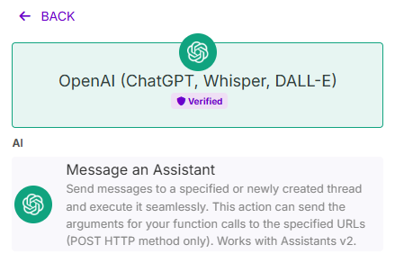

Luego selecciona los respectivos asistentes

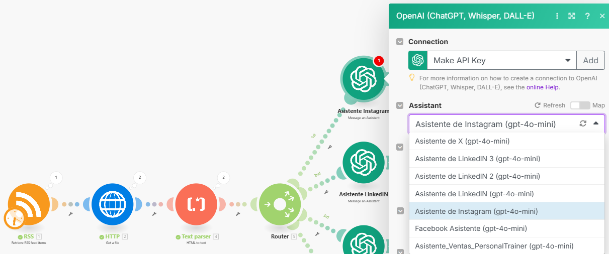

Y el mensaje que le mandaremos a cada asistente es "Text" del Parser

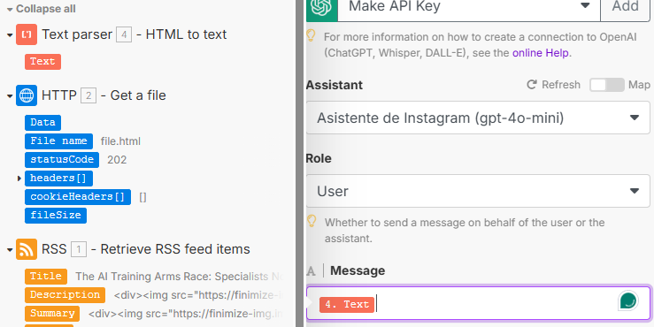

La razon por la que solo le mandaremos eso, es porque el asistente ya está entrenado con toda la informacion e instruccion y contexto de lo que debe hacer. Si quieres mas informacion sobre eso, peudes encontrarla [aquí](https://www.skool.com/imperio-digital/classroom/a65de4cd?md=b03e9a24881b42f5a8ff85831305db4d)

Actualizarás y vincularas cada modulo a cada asistente que creamos previamente, y le pondrás el mensaje a linea del router, es decir, uno independiente por cada red social.

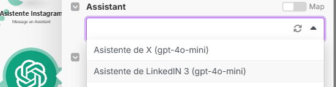

La automatización debería verse algo así.

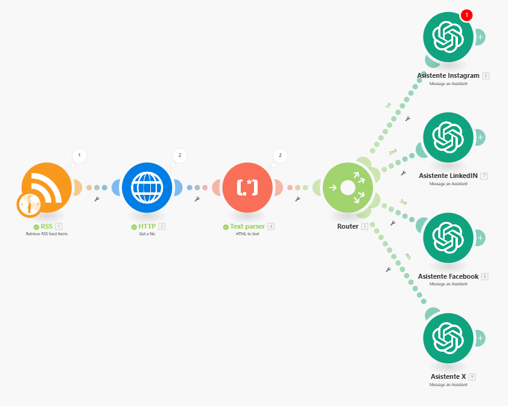

---

## **Paso 6: Generar Imágenes con DALL-E para Instagram (opcional)**

1. **Añadir el módulo "OpenAI > Generate an Image"** para **Instagram**: 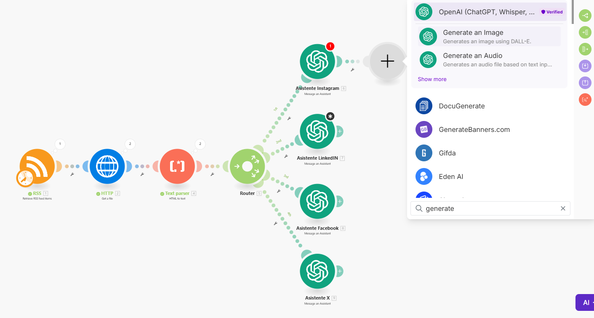 - Usa DALL-E para generar imágenes con dimensiones de 1080x1080 píxeles (tamaño adecuado para Instagram). Puedes encontrar una [guía con estilos específicos aquí.](https://www.skool.com/imperio-digital/classroom/7efa4739?md=4540be929b0543e5a561ef7203cd3fdb)
2. **Configurar el estilo de la imagen**: - Basado en el contenido extraído, genera imágenes en el estilo que prefieras. Por ejemplo, “minimalista”.

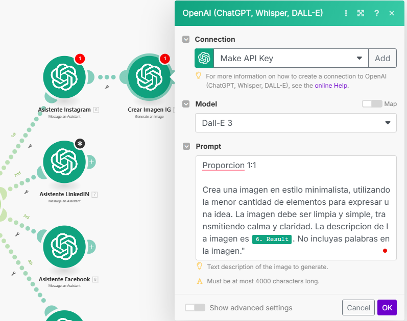

---

## **Paso 7: Publicar en Redes Sociales**

1. **Configura las conexiones a las redes sociales**: - **Instagram**: Usa el módulo "Instagram for Business > Create a Photo Post". 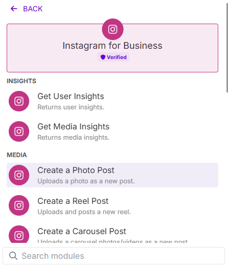 Bajo "Photo URL",  agrega el URL que está bajo "Data", y para el Caption, agrega el "Result" que nos dio previamente. 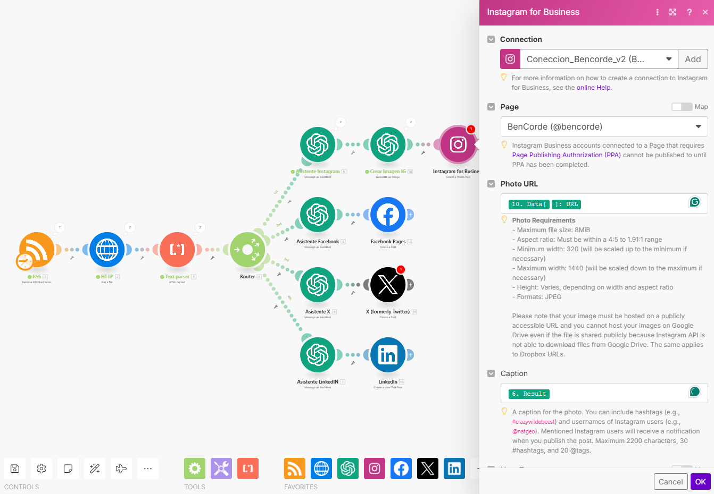 - **Facebook**: Configura el módulo para crear publicaciones. 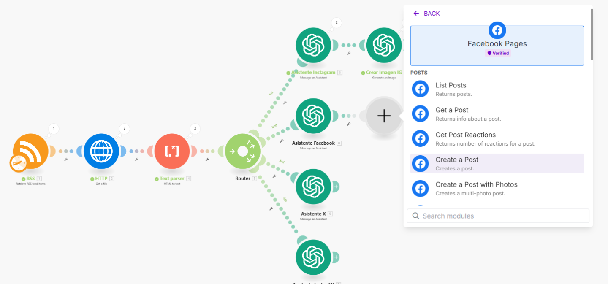 Selecciona el "Result" o resultado en "mensaje" 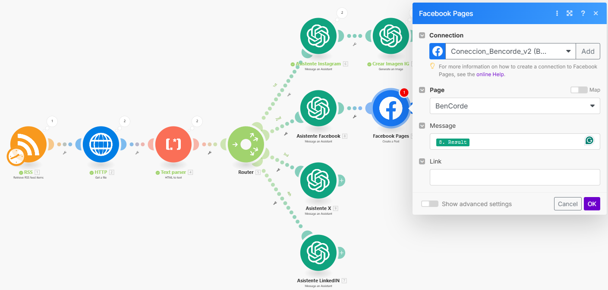 - **X**: Usa "Twitter > Create a Post". 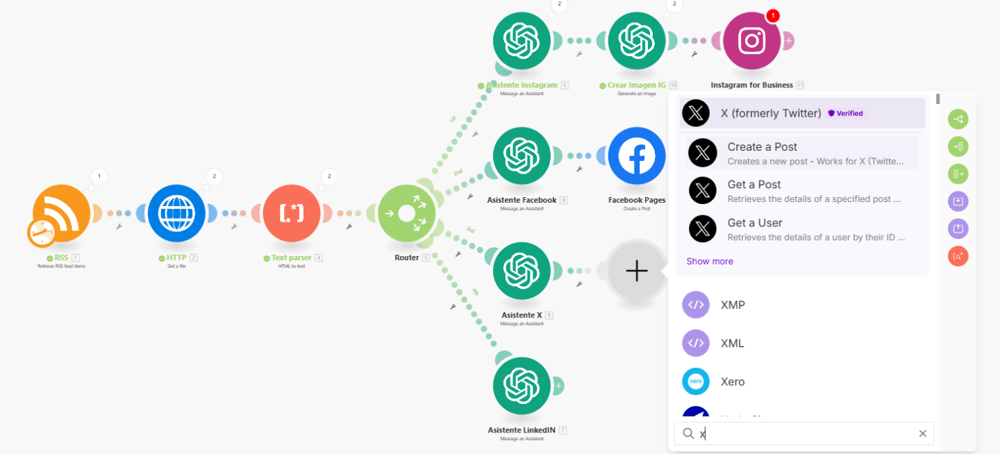 Nota: Necesitas el Client ID y el Client Secret, asi que debes registrarte y solicitar acceso en "X for Developers". - **LinkedIn**: Usa "LinkedIn > Create a User Text Post". 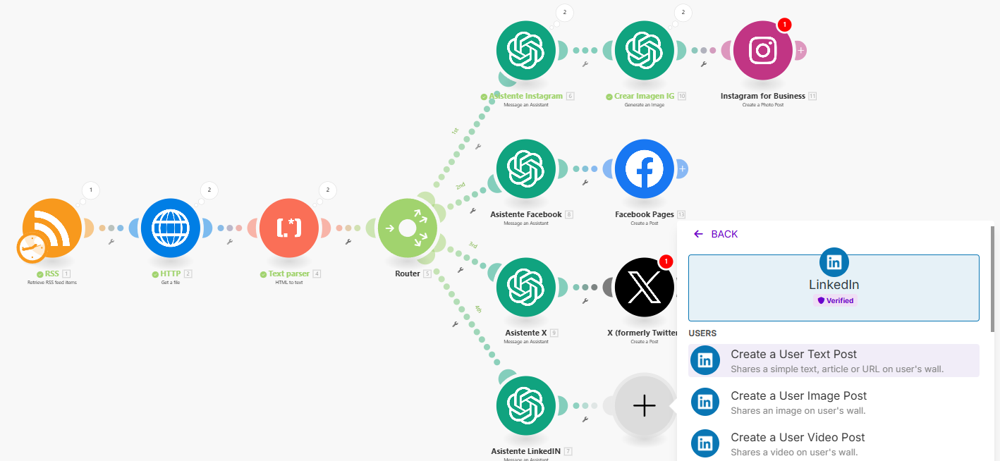 Selecciona el "Result" o resultado en "content". Nota: Deja preseleccionado el "Is Reshare Disabled" en "No", para que la gente pueda compartir tu publicación. 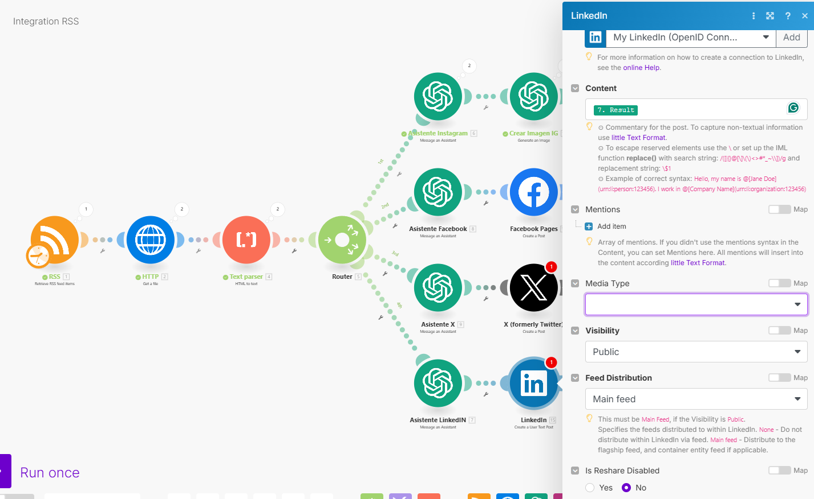
2. **Input de contenido**: - Configura el subtítulo y la imagen (para Instagram) o solo el texto (para las otras redes) generados por los asistentes de OpenAI.

---

## **Paso 8: Prueba la Automatización**

1. **Corre la automatización una vez**: - Haz clic en "Run once" para comprobar que todos los módulos y conexiones funcionan correctamente. 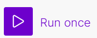
- Verifica que el contenido se publique en las redes sociales que configuraste.

---

## **Paso 9: Activar la Automatización y Configurar la Frecuencia**

1. **Configura la frecuencia**: - Elige la frecuencia con la que quieres que se publiquen las publicaciones (ej.: cada día, cada semana, etc.). 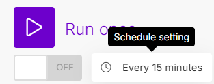
2. **Activar el escenario**: - Una vez verificado que todo funciona, activa la automatización para que se ejecute automáticamente. 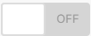

---

**importante: verifica que este funcionando la automatizacion, y luego cambiarás el "Retrieve RSS Feed Items", es decir el primer modulo que creamos, a "Watch New RSS Feed Items", y volverás a seleccionar las variables. Esto lo hacemos porque primero queremos verificar que funciona con publicaciones anteriores, y luego para que empiece a sacarlas en un futuro.**

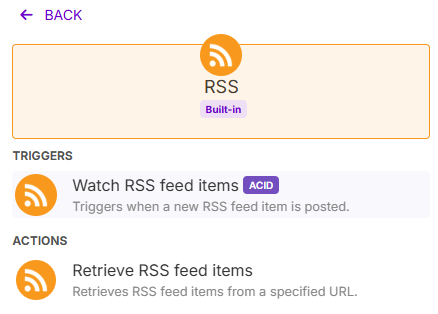

### **Conclusión**

Has creado un sistema automatizado para publicar contenido relevante en múltiples redes sociales, con subtítulos generados por IA y, para Instagram, imágenes personalizadas creadas por DALL-E. Recuerda cambiar el módulo de **"Retrieve RSS feed items"** a **"Watch new RSS feed items"** cuando quieras que el sistema se ejecute automáticamente en tiempo real.

**Descarga el escenario** aquí para empezar.

> **Nota: **Hay dos archivos, el que debemos importar para la automatizacion dependerá de la funcion que quieres que tenga. Si quieres que saque publicaciones antiguas, usa el "Retrieve". Si quieres que saque las publicaciones que se publicarán de hoy en adelante, usa el "WatchNew"

## 🎙️ Transcripción

en este video te voy a mostrar Cómo crear un sistema de redes sociales impulsado con Inteligencia artificial para automatizar la publicación de contenido en distintas redes sociales como en instagram Twitter linkedin e incluso Facebook utilizando una aplicación que se llama make básicamente cada vez que se publique algo relacionado a algún tema sea un artículo o una noticia o un tweet nuestro sistema va a inmediatamente tomar toda esta información la va a procesar la va va a convertir en un texto y nos va a sacar una publicación para cada plataforma y eso no es todo porque no solamente nos va a tomar el texto de lo que está integrado acá sino que también nos va a crear una imagen relacionado a la información de la noticia para que la publique y se acompañe de algo visual Y esta automatización es s s simple de hacer y muy útil y te prometo que si me acompañas hasta el final de este video ya vas a poder automatizar la publicación en tus redes sociales sin la necesidad de tener intervenir manualmente Así que básicamente una vez que dejemos corriendo esta automatización Va a tomarnos una noticia inmediatamente de una aplicación que se llama rss que ya te mostraré Cómo configurarla la procesará y la publicará en las redes sociales que nosotros estimemos conveniente y aquí podemos elegir la frecuencia con la que queremos que se suba Por ejemplo si quiero que suba una noticia cada 15 minutos lo voy a dejar así pero también si quiero que publique una vez al día a las 2 de la tarde lo voy a dejar así le voy a dar enter Entonces esto es realmente valioso y si me acompañas en El Paso a paso te muestro cómo hacerlo para que tú también puedas automatizar tus propias redes sociales incluso puedes automatizar por ejemplo un canal de noticias si quisieras en algún Nicho en específico o artículos que van saliendo y en fin aquí realmente el único límite es tu creatividad lo primero que tenemos que hacer es tenemos que registrarnos y crearnos una cuenta en make y make es gratis de usar hasta las 1000 acciones mensuales y una vez que pasas las 1000 operaciones mensuales ya sí tendrías que cambiarte a un plan pagado pero eso es un problema de escalabilidad y casi todas las personas realmente terminan usando solamente el plan básico o el plan gratuito pero si aún así te interesa tengo un link en la descripción de 30 días del plan pro de make que te permite hacer hasta 10,000 operaciones mensuales simplemente le das clic al link y te registras y te creas la cuenta entonces ahora lo que vamos a hacer es vamos a armar esta automatización con completamente de Cero y para eso iremos al inicio de make una vez que te hayas registrado y creado la cuenta y le vamos a dar a crear un nuevo escenario cada automatización que correremos tendrá su propio escenario Entonces si vemos acá lo primero que tenemos que hacer es conectar el rss Así que vamos a buscar el módulo rss y vamos a buscar este módulo y aquí tenemos dos opciones tenemos el watch rss feed items Y tenemos el retrieve rss feed items si elegimos la opción de Watch rss feed items significa que cada vez que se publique un nuevo artículo una nueva noticia un nuevo post del tema en específico que elegiste va a implementarlo en tu automatización Y si eliges retrieve rss feed items va a tomar de acá para atrás lo que ya se ha publicado así que me gusta pensarlo elegiré el watch cuando quiero publicar a futuro y quiero dejar la automatización corriendo y el retrieve lo usaremos si es que quiero mirar desde acá al pasado es decir lo que ya se publicó por fines prácticos voy a elegir el retrieve y aquí podemos ver que nos pide un URL y este es el URL de la vinculación de rss que tenemos que hacer y sé que suenan como palabras complicadas pero no es realmente complicado rss es la aplicación que vamos a usar para sacar las noticias de un tema en específico Así que nos crearemos una cuenta en rss App el link también está en la descripción de este video y vamos a apretar my feeds vamos a encontrarnos con una interfaz como esta lo que queremos hacer es crear un Fed Qué significa esto queremos crear un inicio con las noticias que nos interesen a nosotros algo así como cuando tú sigues gente en instagram por ejemplo que te empiezan a aparecer sus publicaciones esto es exactamente lo mismo pero estamos creando Un inicio personalizado según nuestros temas y nuestros intereses le vamos a dar a crear nuevo feed o aquí también vamos a crear el nuevo feed y aquí podemos comenzar a elegir de dónde queremos que saque las cosas pero lo que vamos a hacer acá es vamos a elegir un tema en específico Así que supongamos que me interesa la economía lo que voy a hacer acá es buscar economy y me va a aparecer el global economy economy o political economy nota esto es super importante tienes que elegir el tema en inglés Porque después los vamos a ir traduciendo a medida que lo publicamos en nuestras redes sociales Así que vamos a elegir Inteligencia artificial porque nos gusta la Inteligencia artificial y le vamos a dar clic como podemos ver acá nos empiezan a aparecer una serie de noticias si bajamos nos van a aparecer prácticamente infinitas noticias para abajo y si encontramos la frecuencia de la publicación podemos ver esta fue publicada hace 40 minutos esta fue publicada hace una hora 2 horas 2 horas 2 horas 2 horas y así y Estas son las noticias que nosotros vamos a ir publicando en nuestra cuenta y todo esto lo estamos haciendo con la versión gratis de rss pero si tienes la versión pagada de rcs puedes comenzar a filtrar yo Actualmente estoy con la versión gratis pero si tuvieses la pagada puedes poner un blacklist por ejemplo que es todas las palabras o todas las publicaciones que contengan una palabra específica no te aparezcan y supuesto que es el whitelist que es solamente hacer No sé digamos Inteligencia artificial y quieres filtrarlo con acciones te van a aparecer todas las publicaciones que tienen Inteligencia artificial y que además tienen la palabra acciones y de esta manera podemos crear publicas iciones o sintetizar publicaciones que son mucho más de Nicho Pero en fin volveremos atrás y vamos a hacer clic en overview y Estas son las noticias que comenzaremos a filtrar una vez que ya creemos el feed lo que vamos a hacer es le vamos a dar a guardar y aquí le podemos poner el nombre que queramos por ejemplo le voy a poner Ai y le voy a poner Ben corde y le vamos a dar a guardar aquí nos va a aparecer que nuestro feed Ya está listo y nos va a dar un código URL xml Este es el que vamos a copiar y el que vamos a pegar en nuestra automatización donde nos pide el URL acá nos va a dar el maximum number of return items que es el número máximo de publicaciones que quiere que busques O sea si es que le pongo dos por ejemplo nos va a aparecer 1 2 si es que le pongo tres nos va a aparecer también hasta la tercera por fines prácticos le voy a poner dos ahora si es que corremos este módulo le damos clic derecho y correr vamos a ver que efectivamente nos dio dos outputs el primero que nos dio es nvidia y después nos dio otra noticia Que si es que lo vemos acá es el primero el de nvidia y el segundo este de acá pero podemos ver que la descripción que nos dio es bastante extraña ahora lo que vamos a hacer es Agregar un nuevo módulo que se llama el módulo getfile Así que vamos a arrastrar esto que está acá y vamos a buscar http y vamos a poner el get a file que esto básicamente nos va a descargar la información del módulo que ya creamos vamos a seleccionar el get file y acá podemos Buscar el URL de lo que acabamos de crear que en este caso es esta que está acá Esto es lo lindo de las automatizaciones cada módulo podemos conectarlo con los anteriores Y podemos sacar la información del anterior nota si es que no te aparece por alguna razón esto que está acá lo que tienes que hacer antes es correr este módulo individualmente y después sí te va a aparecer el URL le vamos a dar a okay Y ahora lo que hicimos es sacamos el formato Http es decir el código de la página pero no nos sirve tener la información digamos en código que no podemos entender tan visualmente y que tiene muchos símbolos raros Así que lo que vamos a hacer es pasar ese código a texto con una ventana que se llama html a texto es decir html to text y lo vamos a apretar Y acá es donde le vamos a poner la Data del get a file que creamos en el módulo anterior le vamos a dar a okay y ahora si es que corro toda la automatización podemos ver que nos dio primero la noticia después la extrajo del lugar y después nos creó lo que vendría siendo el texto y si es que veo el output podemos ver que ya nos pasó todo ese código al texto que está acá y Listo ya creamos la primera parte que es extraer la información del sitio web Y pasarlo a un texto que podamos entender y que Open Ai o chat gbt pueda usar para entenderlo de una mejor manera ahora es cuando pasaremos a diversificar los caminos según la cantidad de redes sociales en los que quieras publicarlo si quieres publicar solo en instagram puedes hacer la automatización solamente con Instagram pero por fines prácticos te voy a mostrar Cómo crearlo en todos tanto en instagram como en x como en linkedin y como en Facebook y aquí es donde entra un módulo muy importante que se llama el router podemos entrar acá y buscamos el router Y qué es lo que hace el router es nos empieza a abrir distintos caminos Entonces si es que entro acá y Busco el router podemos ver que nos separa la automatización en dos caminos distintos supongamos por ejemplo que tengo uno acá y que tengo otro acá cada vez que empiece acá va a pasar uno va a pasar al siguiente y va a llegar acá y aquí primero se irá acá y después seguirá el otro camino acá Entonces estamos abriendo el espacio a que siga distintos caminos y lo que vamos a hacer acá ahora es crear Cuatro Caminos que van a ser los de escribirle a un asistente de Open Ai Así que nos iremos acá vamos a ir a Open Ai y vamos a escribirle a un asistente Vamos a darle clic acá y supongamos que quiero escribirle a un asistente de Instagram es muy probable que no te aparezca exactamente así sino que te aparezcan dos opciones uno no has integrado el Api o dos no has creado el asistente y te voy a mostrar rápidamente Cómo hacer ambos si es que te sale que tienes que conectar Open Ai lo lo que tienes que hacer acá es ponerle agregar crearle una conexión por ejemplo make benen corde y tienes que poner lo que se llama un Api para conectar un apq paréntesis esto lo explico mucho mejor en la comunidad de imperio digital pero si quieres conectar un ap key buscaremos Api Open Ai playground en Google y vamos a hacer clic al primero que nos aparece nos vamos a ir donde sale dashboard Y a la izquierda buscaremos las Api Keys y aquí es donde le vamos a dar a crear una nueva llave secreta le vamos a poner un nombre de prueba y le vamos a dar a crear llave secreta aquí nos va a dar la llave y nosotros la vamos a copiar volveremos la pegaremos y le vamos a dar a guardar y una vez que ya integres esto sí te va a poder aparecer algo así es importante que tengas saldo en la cuenta de Open Ai ya que cada generación tiene un pequeño costo son fracciones de centavos y yo le cargué 5 hace mucho tiempo y todavía sigo teniéndolas así que recomiendo que tú también lo hagas y vas a tener para generar contenido por mucho mucho tiempo ahora sí tenemos que escribirle un asistente Pero también es posible que no te aparezca directamente la opción de seleccionar un asistente acá por qué porque tenemos que crear el asistente antes y para ponerlos a modo de contexto un asistente es imagínate una persona a la que quieres contratar y que tiene que cumplir un rol en específico eso es lo que es un asistente es un agente es alguien al que tú le das un rol en específico y esa persona lo tienes que cumplir algo así como cuando cuando tú le das instrucciones a char gbt y le dices Necesito que seas un experto en copywriting para que me ayudes a crear una publicación de Instagram para bla bla bla esos asistentes son los que vamos a crear ahora Así que buscaremos playground Open Ai y vamos a entrar al playground donde aparece acá y aquí podemos ver que tenemos la opción de los asistentes y yo ya tengo creados varios asistentes acá pero vamos a crear uno nuevo Vamos a darle a crear un asistente y le voy a poner as asistente de Instagram versión 2 y aquí es donde le vamos a dar el prompt al asistente es decir eres un experto en redes sociales Necesito que me ayudes a redactar esto en formato de publicación asegúrate de captar la atención y todas esas prácticas que usamos para generar contenido en redes sociales como la inclusión de hashtags y etcétera Así que aquí le vamos a poner eres un experto en redes sociales y personaliza el promt absolutamente como quieras pero para hacértelo aún más fácil dentro de la comunidad de imperio digital tenemos un recurso específico de agentes si es que entras a las automatizaciones y bajas puedes encontrar los agentes de Facebook de Instagram de linkedin y etcétera para este caso voy a elegir el agente de Instagram voy a bajar Bajar bajar y voy a copiar y pegar esto como podemos ver esto es una instrucción y un contexto mucho más detallado que me permite dar una mejor respuesta y un mejor formateo a la noticia pero para que te hagas una idea Esto es lo siguiente eres un experto en crear descripciones para Instagram con muchos años de experiencia proporciona la respuesta en formato simple estas son tus instrucciones Integra de manera natural palabras clave Haz que la descripción sea corta intrigante y relevante usa hashtags y etcétera Así que una vez que copie todo esto lo voy a pegar acá y ahora podemos ver que si es que le pegamos una noticia nos debería dar una respuesta la noticia que le va a pegar por ejemplo es esta de Numa de techcrunch Así que voy a copiar esto y lo voy a pegar acá solamente para mostrarles que cuando le mandamos un texto así el asistente ya sabe que lo que tiene que hacer es generar una publicación de Instagram es decir tiene que crear el texto que acompaña una publicación y sería algo así y la idea de poder jugar acá es ir probando probando probando hasta el punto en el que te sientas conforme y cómodo con la generación y la respuesta que te dio luego vamos a elegir el modelo voy a dejar el gpt 4 o mini que es un poquito más económico que el gpt 4o y Listo Ya está creado ahora si es que vuelvo acá y le doy a refrescar debería aparecerme el asistente de Instagram versión 2 ahora cualquier mensaje que le mandemos por ejemplo este nos va a dar una respuesta luego vamos a ir al mensaje y necesitamos integrarle el texto que generamos acá recuerdan que transformamos de html a texto Entonces voy a ir al mensaje y le voy a seleccionar el texto y nada más le voy a dar a Okay y una una muy buena práctica que puedes hacer es renombrar lo y este es el asistente de Instagram ahora si es que le damos a correr a esto podemos ver que nos está extrayendo la noticia nos lo transformó a texto y ahora está corriendo el asistente de la generación de texto de la descripción que acompaña Instagram si es que abrimos acá vamos a ver que nos dio el resultado justo acá y nos lo acompaña con los hashtags al final perfecto vamos a hacer exactamente lo mismo para linkedin esto lo voy a duplicar y esto lo voy a eliminar voy a eliminar todos estos y lo voy a duplicar cuatro veces porque son cuatro las redes sociales que quiero usar y como podemos ver ahora está super desordenado y una muy buena práctica que también puedes hacer es apretar esta parte que sale auto alinear y ahora tenemos cuatro asistentes de Instagram pero tenemos que elegir los asistentes respectivos para cada red social así que nuevamente Volveré acá a Imperio digital voy a buscar el agente de Facebook Voy a bajar y voy a copiar el agente de Facebook los roles que están cumpliendo son super parecidos es sintetiza la noticia y adáptalo a la plataforma que queremos usar nuevamente copiaré ir a los asistentes crear un nuevo asistente y le voy a poner asistente de Facebook dos y le voy a pegar el prompt luego actualizaré esto y elegiré el asistente de Facebook versión do le voy a dar a guardar y lo voy a renombrar haremos Exactamente lo mismo con el asistente de linkedin es decir entraré acá bajaré y copiaré y pegaré el rol que tiene que cumplir el asistente nota no es completamente necesario que uses estos mismos agentes Simplemente que me gustó la opción de poder facilitarte un agente para que puedas copiarlo y pegarlo y no tengas que escribir todo el prompto asistente de linkedin 3 lo crearé refrescar esto y elegiré el asistente de linkedin y le daré Okay y finalmente voy a hacer exactamente lo mismo para el asistente de Twitter o x volveré a Imperio t buscaré el agente de X que este sí es un poco distinto porque tiene que limitarse a los caracteres que te permite usar Twitter copiaré crear asistente pegar el prompt y le pondré asistente de x2 volveré a la automatización refrescar y elegiré el asistente de x2 listo guardar renombrar deos asistente de x y listo si corremos la automatización en este momento podemos ver que se está generando está extrayendo la noticia primero como vimos antes está generando el resultado del asistente de Instagram luego ahora el de Facebook luego el de linkedin Y luego el de X el de Facebook Ya está listo aquí tenemos el de linkedin que lo hace un poquito más en formato en publicación de linkedin y después tenemos el asistente de X que nos limita a la máxima cantidad de caracteres que podemos usar ahora viene una parte super interesante que es que crearemos una imagen que acompañe a nuestra publicación es decir algo gráfico que lo puede acompañar y para eso también Vamos a usar otro otro módulo de Open Ai y por fines práctico solamente lo voy a crear para Instagram pero si quisieras también lo puedes hacer en el resto lo que vamos a hacer acá es arrastrar y crear y Buscar un nuevo módulo y escribiremos Open Ai y vamos a abrir todas las opciones como podemos ver aquí tenemos muchas opciones en las que podemos elegir como crear un audio crear una transcripción analizar imágenes pero lo que estamos buscando es generar una imagen vamos a usar el modelo de tali 3 y Aquí vamos a tener el promt que queremos darle básicamente es lo mismo que cuando hacemos y entramos a char gpt y le decimos créame una imagen de esto aquí es lo que vamos a hacer y vamos a seleccionar el texto del resultado que nos dio para qué Para que nos cree una imagen relacionada si necesitas ayuda o necesitas Inspiración en algún recurso gráfico Cuál es el estilo que quiero usar dentro de la comunidad School de imperio digital también tengo la opción de los recursos y tenemos los estilos gráficos acá el formato que estamos buscando para Instagram es aquí te public los formatos es es una foto cuadrada de 1080 por 1080 Entonces le voy a poner 1080 por 1080 y si necesitas inspiración te publiqué también una guía con todos los recursos gráficos y los distintos estilos que puedes necesitar para crear las imágenes aquí te creé una con cada estilo están s super buenas y puedes buscar el estilo que más te sirve por ejemplo no sé colach alguno que me gustó o cómic veamos cuál puede ser algún estilo interesante impresionismo está super buena as Es que quiero mantener una coherencia digamos entre mis distintas imágenes puedo usar este tipo y estilos de recursos gráficos este me gusta sci-fi una imagen estilo ciencia ficción voy a copiarlo para ver si hay algún otro no ya me gustó el de sci-fi o no prefiero este de surrealismo ya digamos que sí entonces voy a copiar la imagen del surrealismo y se la voy a pegar acá y aquí puedes usar cualquier pronto o sea gener una imagen hiperrealista minimalista puedes usar el estilo gráfico que tú quieras y le voy a poner genera una imagen estilo surrealista donde lo lógico y lo nícole voy a poner el texto que está el resultado luego le voy a poner la imagen debe ser en proporción 1080 por 1080 píxeles y le voy a dar a okay Así que ahora Estamos creando esta imagen surrealista voy a renombrar esto y le voy a poner generar imagen okay Ahora si es que decido correr esta automatización una vez más Vamos a ver que nos va a crear el texto primero que Acompaña a la imagen y luego nos va a crear la imagen si apretamos la Lupita nuevamente podemos ver el output que es la Data que nos creó y me va a generar la imagen si es que aprieto la Lupita que está acá entro al output aprieto Data uno y abro el link que está acá podemos ver que esta es la imagen que nos generó que está s super interesante considerando que la noticia es relacionada a nvidia Entonces nos creó acá un chip o una tarjeta gráfica que está super buena para poder acompañar a la publicación Entonces ya generamos la imagen verdad tenemos esta imagen que es la que vamos a publicar en instagram perfecto Qué es lo último que nos queda efectivamente publicarlo Así que acá voy a agregar el último módulo que es publicarlo en instagram voy a arrastrarlo y voy a buscar el módulo de Instagram voy a buscar más y elegiremos el create a photop post o crear una publicación con imagen vamos a conectar nuestra cuenta de Instagram y vamos a elegir el foto URL y el foto URL es la imagen que acabamos de crear No es cierto Entonces estamos en el módulo de generar imagen vamos a abrir la Data y vamos a elegir el URL que es esta misma imagen pero para cada caso luego bajaremos y acompañaremos esto del caption que creamos previamente que nuestro asistente nos creó que es el resultado de este módulo Así que apretaremos en resultado bajaremos y le vamos a dar a Okay ahora tenemos que hacer exactamente lo mismo para todos los pasos Así que buscaremos el asistente de Facebook vamos a buscar Facebook y vamos a ponerle ver más vamos a crear un post y como para este no le creamos imágenes solamente lo vamos a publicar con texto vamos a elegir la página en lo que queremos publicarlo y elegiremos el mensaje que es el resultado que nos dio el asistente de Facebook y ahora lo mismo con el linkedin vamos a buscar linkedin vamos a ponerle ver más y vamos a elegir el crear un post de texto podríamos elegir nuevamente el de la imagen pero como no la creamos vamos a dejarlo solamente en la publicación de texto Vamos a darle acá conectaremos el linkedin y en el contenido nuevamente vamos a poner el resultado que nos dio este asistente de linkedin Así que en el contenido Vamos a ponerle ese mismo resultado en el media type vamos a dejarlo empty y la visibilidad pública y esta parte es super importante porque el disable tienes que dejarlo en No porque si quieres que publiquen y puedan compartir tus publicaciones tienes que dejarlo en No porque si le pones sí la gente no va a poder compartir tus publicaciones Ah y acá en el contenido le voy a agregar algo que es link de la noticia porque es super buena práctica publicar los links de los artículos en Linkin y voy a bajar y voy a poner el link y le voy a dar a Okay finalmente vamos a hacer lo mismo con x buscaremos x y vamos a ponerle crear una publicación en x y acá también vamos a elegirle el resultado nota conectar la cuenta de X puede ser un poquito más complejo pero si es que estás dentro de imperio digital acá le dejé a un miembro que escribió que tenía un problema conectando esta cuenta y le mandé un video personalizado donde trab bajábamos la resolución y el Cómo conectar directamente la cuenta de x y bueno de eso se trata la comunidad de un espacio donde podemos resolver Y acompañarnos en el proceso de las automatizaciones Así que le vamos a dar a okay Y ahora sí si es que le doy a correr va a publicarse en todas mis redes sociales Así que enseguida vamos a hacer la prueba y vamos a ver cómo funciona Pero antes Te quería comentar dos cosas primero necesitamos ajustar la frecuencia con la que queremos que se haga este tipo de publicaciones si es que vamos aquí abajito izquierda vamos a ver una opción que tiene un tiempo si es que le damos clic podemos elegir Con qué frecuencia queremos que se publique por ejemplo ahora está cada 15 minutos pero si quisiera publicarlo una vez todos los días a las 3 de la tarde voy a entrar le voy a poner okay Y listo esta automatización se va a ejecutar todos los días a las 3 de la tarde y lo puedes personalizar como quieras por ejemplo que sea los lunes los miércoles y los viernes y le damos a Okay o elegir la frecuencia del intervalo de tiempo para este caso lo voy a dejar todos los días a las 3 y segundo y esta parte es s super importante la automatización completa está corriendo con el rss feed items lo que significa que va a sacar las publicaciones anteriores que ya han sido publicadas si es que quiero que comience a funcionar esta automatización para que me saque las publicaciones que se van a hacer en un futuro lo que tengo que hacer es no agregar este módulo de acá sino agregar un módulo que se llama el watch rss feed items recordemos es watch para ver el futuro y el retrieve para sacar lo del pasado Y por último antes de correr esta automatización Y que veamos los resultados si es que no quieres hacer toda esta automatización puedes descargarla e importarla directamente desde la comunidad de imperio digital si es que entras a automatizaciones y entras a la automatización que estamos trabajando puedes bajar Bajar bajar porque aquí hay una guía paso a paso donde te explico literalmente todo lo que te acabo de mostrar por si es que te perdiste algún paso o algo y puedes descargar la automatización le haces clic y le pones Descargar y como podemos ver acá tenemos una automatización que es retrieve que es el pasado y tenemos otra acá que es para el watch que es las publicaciones a futuro y si es que creamos un nuevo escenario en make podemos apretar estos tres puntitos que están acá le damos a importar elegir archivo y si es que le hacemos clic pum podemos ver que ya tenemos la automatización con todo lo que creamos de desde el crear la imagen hasta el contenido con el link de la noticia completa y en fin así que recuerda todos estos recursos se encuentran dentro de la comunidad de imperio digital Pero ahora sí vamos a ejecutar la automatización ahora lo que voy a hacer es darle a correr a la automatización una vez importante si es que lo quieres dejar corriendo tienes que prender este botoncito que está acá pero lo vamos a hacer una vez y vamos a darle a correr una vez ahora como podemos ver acaba de sacar la noticia que es esta esta noticia que está acá la de cerebras acaba de pasar por el asistente de Instagram que nos generó lo que va a publicar en la descripción o en el pie de imagen y ahora está generando la imagen si es que actualizamos acá vamos a ver que no se ha publicado porque todavía no se termina y ahora sí se acaba de publicar Así que si volvemos acá y actualizamos la página sí nos va a aparecer esta imagen que está super buena con un chip gigante y una descripción acompañada y va a pasar exactamente Lo mismo para Facebook para linkedin para Twitter y podemos ver que ya efectivamente se publicó en todas las plataformas ahora le voy a dar a parar y recordemos si es que le diéramos a correr esta automatización se va a ejecutar todos los días a las 2:40 Y nuevamente Recuerda si es que quieres importar directamente la automatización puedes bajar acá descargarla apretar los tres puntitos y darle a importar Y te va a aparecer exactamente esto si no te has registrado m te dejo el link en la descripción y si te interesa ser parte de la comunidad de imperio digital también te dejo el link en la descripción que es un lugar donde aprendemos todos juntos de automatizaciones Y tenemos todas las automatizaciones que hemos estado subiendo y que hemos estado creando van a ser subidas directamente acá además de unos cursos adicionales y muchos muchos recursos que son de altísimo valor además también lo acompañamos de sesiones en vivo de preguntas y respuestas Y muchísimas cosas más así que sin más que decir te deseo mucho éxito y si te gustó este este video asegúrate de suscribirte para que no te pierdas Cuál va a ser la próxima automatización mucho éxito y nos vemos
