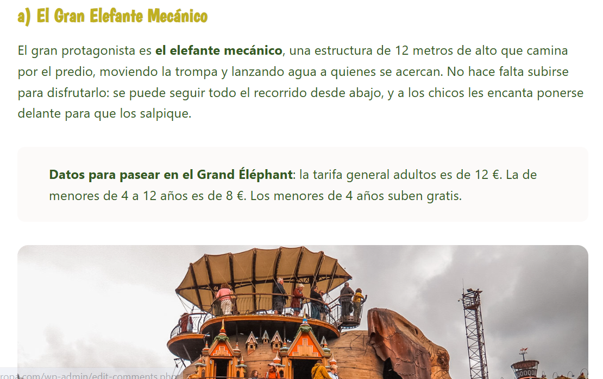

# Extensión Precios y Horarios | Flor

> Ruta: Automatizaciones Make › Extensión Precios y Horarios | Flor

**🎬 Vídeo (4.7 min):** https://www.loom.com/share/7baa0167176e4e0eb3e514d4579c916c?sid=905c5a23-e7bb-40c7-9646-68cad76efd46

**📎 Recursos:**
- Blueprint

---

📌 Blueprint descargable al final del post.

Automatización de [Flor](https://www.skool.com/@flor-vallejo-6359?g=imperio-digital)!

---

🎯 **Objetivo:**  
Extraer automáticamente horarios y precios de páginas web mediante una extensión de Chrome conectada a Make y ChatGPT, para integrarlos en un blog de viajes sin necesidad de copiar manualmente toda la información.

---

🔄 **Flujo de la Automatización**

1️⃣ **Selección de texto en la web**  
🔹 El usuario selecciona horarios o tarifas en cualquier página web.  
🔹 La extensión de Chrome envía el texto a un webhook en Make.

2️⃣ **Procesamiento con ChatGPT**  
🔹 El webhook recibe la selección y la envía a ChatGPT.  
🔹 ChatGPT analiza y filtra los datos (tarifas generales, horarios clave, entradas gratuitas).

3️⃣ **Organización en Google Sheets**  
🔹 Los datos procesados se almacenan en Google Sheets.  
🔹 Esto permite validar y estructurar la información antes de publicarla en el blog.

4️⃣ **Integración con el Blog**  
🔹 El creador selecciona los datos relevantes (ej. precios y horarios principales).  
🔹 Se copian directamente al artículo, ahorrando tiempo en la edición.

---

📈 **Resultados:**  
✅ Información lista en segundos sin recorrer páginas enteras.  
✅ Datos estructurados y fáciles de validar.  
✅ Ahorro de tiempo en la creación de artículos para blogs de viajes.

---

🔧 **Requisitos:**  
✔️ Extensión de Chrome conectada a Make.  
✔️ Make – Gestión de webhook y flujo principal.  
✔️ ChatGPT – Procesamiento y extracción de datos clave.  
✔️ Google Sheets – Base de datos para validación y control.

---

📝 **Conclusión:**  
Esta automatización transforma la forma de crear contenido en blogs de viajes: de pasar horas revisando páginas oficiales a obtener datos claros y listos para publicar en cuestión de segundos. Una solución práctica que une **extensiones de navegador, ChatGPT y Make** en un solo flujo.

## 🎙️ Transcripción

Hola imperiales, buen domingo, qué tal? Bueno, les quería compartir este escenario, eh, que creé gracias a la explicación que dio venjan un video de extensiones, eh, el animo a todos a, a armar una extensión. y someterla con un curso que no se hizo pero bueno nada como yo recién la estado utilizando pues estaba escribiendo un artículo para mi blog pues digo bueno voy a compartirlo con ustedes esto que creo porque me parece que está bueno lo quiero compartir, punto. Bueno, de que se trata la extensión, la extensión está aquí, se llama Fab Presido Siorarios y lo que hace justamente es extraer de páginas webs. Algunos datos que son justamente los precios y los horarios, datos de acceso a determinados lugares, que yo voy a copiar tal cual me lo da a mi la extensión, lo voy a copiar y lo voy a pegar en mi bloo. Yo tengo un montón de bloques de viajes, así que esto, me venía súper útil cuando venía hizo este vídeo de extensiones dije pues tengo que aprovechar entonces si han visto el vídeo de venía verán que también tiene más o menos los mismos pasos Lo que yo hago es activar el webhook cuando se selecciona el texto en la página web, preciano el extensión y eso se envía el webhook, el webhook lo manda H-C-P-T, H-C-P-T. lo analiza, y de ahí me lo baja todos los datos a un Google Sheets, porque yo después esos datos los voy a tener que validar más mucho más adelante, pero eso va a ser el otro escenario. Y luego el webhookresponso lo que hace es que me pasa a mí el dato de lo que narizó chat GPT. Bueno vamos a darlo un poco en acción. Bueno, acá chat GPT le tuve que poner un montón de cosas y hacer un montón de se aplica, se aplica, se aplica porque siempre y va probando y no me iba tirando todos los datos que yo necesitaba, entonces vamos acá en la página de el posteo del prado que es con lo que les voy a dar el ejemplo entonces de 10 secos Si yo selecciono horarios, tarifas, por ejemplo no siempre me funciona muy bien por el tema de que es mucho texto, pero bueno en esta página ya la estuve más o menos haciendo así que me tiene más o menos los datos que yo necesito. Entonces yo activo el webhook, guardo la selección y ya se está enviando a make. La castan todos los datos y ahora me tiene que decir lo que yo tengo que poner en el blog. Ahí está, dice. datos para visitar el Museo Nacional del Prado, la tarifa genera adultos de 15 euros, los menores de 18 entran gratis, tener en cuenta que ser el primero de enero, primero de mayo y 25 de diciembre. Acá, por ejemplo, todos este tema de los horarios, no me interesa mucho. Pero yo, por ejemplo, podría usarlo todo y ponerlo en el blog directamente, porque ya tengo el dato, ya está, o copiar hasta la parte que yo necesito para ponerla en el blog, que hasta acá estaría bien, pero sí, quiero, ponerlo todo y está bien también porque son datos que salen de la página web. Entonces yo después lo ya lo copio, lo pego y esto es lo que se Lo que sería, o sea, a mí me viene fenomenal porque no tengo que estar analizando todo la página, sino que yo selecciono, obviamente que después me he hecho que bueno, entrar a gerenal 15 está bien reducida, pero esto es para mayores de 18 años, titular de carne joven, miembros, familias numerosas. esto a mí no me interesa adentro de lo que es el foco del blog entra a gratuitas sí me interesa para los que son menores, estudiantes no me interesa o sea no son datos que yo pongo en el blog porque el blog no se trata de sus datos de viajes en familia sobre todo entonces sí me interesa a saber estos datos, pero bueno, miembros, familias, numerosos y todo eso, nada de usted a que cuando lleguen a taquilla se den cuenta de que tienen más beneficias, pero yo quiero poner por lo menos una idea general de lo que es, así que bueno eso se trata la extensión y la automatización que hice que a mí de verdad que me viene me viene de 10 y bueno espero que les haya gustado
