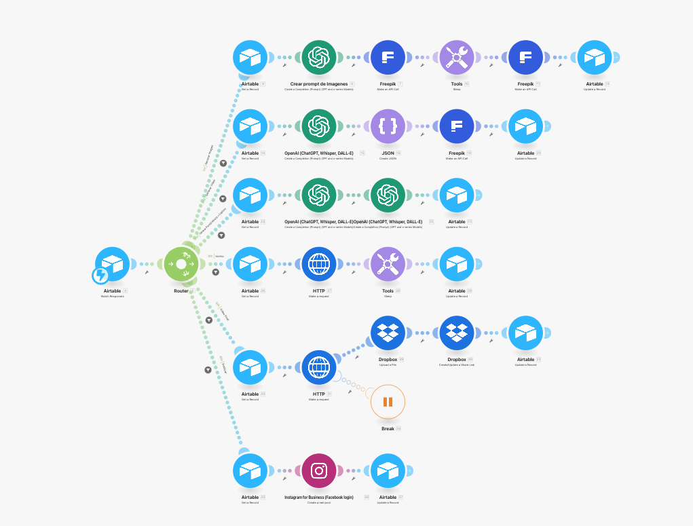

# Reels virales Freepik, Kling, Airtable v2 | Carlos

> Ruta: Automatizaciones Make › Reels virales Freepik, Kling, Airtable v2 | Carlos

**🎬 Vídeo (16.8 min):** https://www.loom.com/share/49b97ee4989845e79f1f2a3b156a3aae?sid=12b6ee5c-7e4c-47ea-a7c1-b9b6c4611966

**📎 Recursos:**
- Blueprint

---

📌 Blueprint descargable al final del post.

Automatización del crack [Carlos Dominguez](https://www.skool.com/@carlos-dominguez-6330?g=imperio-digital)

### 🎯 Objetivo:

Crear Reels virales utilizando IA, con generación de imagen, video, música y captions desde un solo escenario centralizado en **Airtable** y ejecutado por **Make**, sin necesidad de múltiples flujos paralelos. Ideal para creadores que buscan escalar producción sin perder control.

[Adaptación de esta automatización](https://www.skool.com/imperio-digital/creador-de-reels-virales-100-ia-nueva-automatizacion?p=8c4f0b59)

---

### 🔄 Flujo de la Automatización

1️⃣ **Ingreso de idea en Airtable**

🔹 El usuario introduce una idea o prompt directamente en Airtable.  
🔹 El sistema detecta el ingreso y lanza automáticamente el flujo.

2️⃣ **Generación de Imagen con Freepik y ChatGPT**

🔹 ChatGPT transforma la idea en un prompt visual detallado.  
🔹 Se genera una imagen en Freepik con estilo macro realista y elementos cinematográficos.

3️⃣ **Creación del Guión y JSON para Video**

🔹 ChatGPT analiza la imagen y produce un guión optimizado para video corto.  
🔹 Se estructura un JSON con parámetros para Kling (vía Segmind API).

4️⃣ **Generación de Video en Kling Pro**

🔹 Se envía el JSON a Kling y se genera un video animado de 10 segundos.  
🔹 El resultado es almacenado automáticamente en Airtable.

5️⃣ **Música y Captions Automatizados**

🔹 ChatGPT y Musicfy generan un prompt musical coherente con el ritmo visual.  
🔹 Se extrae un caption atractivo y llamativo en menos de 150 caracteres para Instagram.

6️⃣ **Publicación en Instagram y Actualización**

🔹 Make publica el Reel en Instagram y marca el estado como “Publicado” en Airtable.  
🔹 El flujo evita duplicados y permite reintentos si hay errores en etapas previas.

---

### 📈 Resultados:

✅ Reels generados con IA desde una simple idea textual.  
✅ Todo el proceso se ejecuta desde un solo entorno y se autogestiona.  
✅ Mayor trazabilidad, control de errores y velocidad en producción.

---

### 🔧 Requisitos:

✔️ Airtable – Base central de operaciones.  
✔️ Make – Automatización integral en un solo escenario.  
✔️ Freepik – API para generación de imágenes IA.  
✔️ ChatGPT – Para creación de prompts, guiones, captions y música.  
✔️ Kling (Segmind API) – Generación de video desde imagen.  
✔️ Musicfy – Creación de música de fondo en bucle.

---

### 📝 Conclusión:

Esta automatización convierte una simple idea en un Reel completo y publicado, integrando herramientas potentes como Airtable, Freepik, Kling y ChatGPT en un flujo unificado. Perfecto para quienes desean escalar su contenido sin perder calidad ni tiempo. 🚀

## 🎙️ Transcripción

Hola a todos, este es un video para explicarles la forma en la que adapté, ehm, la automatización que nos subió venja a la comunidad de, ehm, ril virales, de personajes de miniatura, ehm, si es también de este video espero que ya hay en hecho ustedes la automatización que tenemos en el classroom, aquí se las enseño básicamente para los que no lo hayan hecho, ehm, o no es la segunda etapa, a primer parte todo empieza desde Google Cheats, no hubo muy rápido porque todo se está en la comunidad y está explicado, busca la fila con cero, te que el prónco con las imágenes, el prónco de imágenes, vaya a ser en free pic género el imagen con imágenes y en tres, después un slip para esperar que el imagen esté lista, descargamos la imagen, generamos un link con el género file, se lo pasamos a nopinai para generar lo que es el prompt del video, después de esto generamos el Jason, ve que a muchos les dio error aquí, asegúrense que tengan todo yo, en este caso lo tengo como numérico, todo lo más es texto y si me funciona el webfrux sin ningún problema, después generamos el video con clink, con el for, con el Jason que tenemos aquí, generamos el prompt de la música, generamos scaption, guardamos todo en una base de datos local, digamos de make, después este web, que es el que se activa cuando nos regresa esta generación de video, tomamos, buscamos solamente hay un filtro para asegurar que esté completado, jala la información que tenemos guardado en la base de datos, hacemos sus recuerdos para generar la música, hacemos sus recuerdos para combinar la música con el video, eso simplemente para poder generar un link público que se lo damos a Instagram y luego actualizamos el spreadsheet. ¿Qué hice yo? Y la manera que me gusta más trabajar, aunque se puede ver un poquito más complejo, digamos, un poquito más largo. Para mí, eso es algo como diría afrar muchísimo más prolijo, porque, aunque tengan más opciones, digamos, en mis ráutas pero más líneas, los posibles rutas, es más limpio en cuanto que yo puedo controlar los errores, si algo falla, no tengo que repetir todo el proceso, simplemente puedo nomas irme a una ruta en específico. Entonces les voy a explicar, este es un Rtable de Webhook para poder hacer esto, van a tener que tener la versión de pago, después tenemos un router y en este router lo que estamos viendo es el tipo de acción, acción, aquí es para generar una imagen, como podemos ver aquí me llega a mi record ID y me llega la acción, en ese caso si es generar imagen, o sea por generar imagen, obtengo el record de aquí obviamente lo que yo obtengo es la información que le tomo que pasara el módulo de chat completion de OpenAI, que en este caso básicamente es lo mismo que que no subió venja, simplemente yo la idea la estoy tomando de RTABLE y ya está simplemente porque me gusta más trabajar a mi RTABLE, la otra es si me como se ve, aquí hago exactamente lo mismo, hago el llamado a Furipic, espero, hago aquí el API call para tomar la imagen y lo que está haciendo es subirla directamente a RTABLE junto con mi prompt, en lugar de guardarlo en algún otro lado, me gusta guardarlo directamente en herdeo y volio para poderlo consultar. Después de esto toca generar el video, lo mismo que el record para jalarle toda la información, en este caso está viajando la imagen, se la paso a OpenAI, es el mismo prompt, exactamente lo mismo, para generar el script del video, en este caso general Jason igualito como lo estamos haciendo, hago el API call para free pick con click con el web hook, pero en este caso la gran diferencia es que mi web hook no es un web hook de make porque no estoy en otro escenario, es literal un web hook de, vamos para acá, air table, aquí una web hook receive me da un web hook y yo solo diga air table y obviamente esto me facilita la vida no tengo que esperar y ver si otra automación se ejecuta o no o tener que estar dentro de una y otra porque yo actualizo en air table simplemente lo que es mi prompt del video y mi video id o mi taz id ahorita no ver para que lo voy a utilizar después de esto genera el prompt y la música lo mismo busco el récord genera el prompt de la música genera los captions actualizo el con su formación, después genero la música, tomo el p*** de la música, lo mando la API de Music Fry, después a un pequeño slip para esperar y subo la archivo de audio que se genera, después hago el video final, lo mismo, derte y volzaco lo que es el video y el audio, se lo paso a la API de Segment para poder combinar o hacer el merch del audio con el video y se lo paso a verte igual. No intenté pasarse lo verte igual directamente, obviamente esto no genera un nuevo real pero mappiándolo, me da error, no lo quería aceptar, no lo que aceptare, intenté poner un set múltiples variables a hacer un binarización de 4 como hacemos con las imágenes generadas con el imagín uno de OpenAI, tampoco me dejó, no soy fan de utilizar esto porque antes tienes que subir a Dropbox y tener estos otros dos bóulos, pero bueno, si alguien sabe cómo poder aquí directamente subirlo a RTAVOL, agradece que el día se me lo pueden decir, ahí lo den los comentarios, pero bueno aquí subo el video final ya con audio y video a RTAVOL y después donde se publicar simplemente tomo el video final junto con los captions lo publico en instagram y actualizo mi artibol de que lo publique ahora cómo se ve esto en el artibol una sola tabla muy fácil este es otro proyecto diferente tengo mi ID que en este caso mi ID es una fórmula la fórmula viene de la idea más la fecha esto me gusta hacerlo para crear como ID únicos y después aquí tengo la fecha no tengo yo, si pueden ver, es un capo de fórmula, no es un campo de fecha, porque porque quiero que se llenó automáticamente con la fecha de hoy, entonces simplemente es una fórmula para ponerla fecha hoy en este fórmato que quiero, mi idea, listo, este simplemente es un trigger para que yo pueda tener aquí 30 ideas, cuando yo quiero publicar, le doy publicar, igual puedo generar aquí una fórmula que pasen de X, Días y todo, pero en ese caso, son un poquito más manual para verificarlo, aquí guarda el problemo de mi imagen, aquí guarda de mi imagen, aquí guardo el prónio del video, aquí guardo el video ID, aquí se volvido y ha generado el prónio de la música, aquí tengo el archivo de audio, aquí tengo mi caption, otros checkbox para cuando fue creado, mi video final de que ya fue publicado en Instagram y cuando se creó todo. Como pueden ver, en lugar de guardar en las base datos de make localmente, tengo yo todo aquí y de esta forma me permite controlar. Vamos a hacer un ejercicio para que vean cómo funciona, déjame ver que tengo mi automación activa, ok, perfecto. Lo primero que tengo que hacer es, bueno aquí les enseño, tengo en general imagen, es un simplemente una vista y cuál es el filtro, que imagen este vacío obviamente no va a generar un imagen, cuando yo tengo un imagen, que la idea no esté vacía y que listo este marcado. Entonces vamos a hacer esto. Voy aquí y lo voy a poner uno nuevo y lo voy a generar un imagen que aquí en ese caso la idea sea, vamos a ver, como que estén cortando el pasto, la mejor no, mejor un el bus. Ok, si se fijan aquí no lo tengo nada, pero si yo le doy listo, aquí para atrás para que lo puedan ver, si yo le doy aquí en listo, entra a esta vista y al momento entrar esta vista debería de irse para acá. Ok, aquí vemos que automáticamente entró aquí, está generando el prompt de la imagen, está ganando el imagen, tiene el slip y creo a ver si no me da el rostro que ya va a llegar un email cuando estoy al 80% de la apigratuita, algo que no me gusta de free pick es que tenemos, tienes que tener una acu, yo tengo la cuenta de premio normal pero a partir tienes que tener la cuenta para la apiguita, pero bueno, si se fijan automáticamente entró al siguiente porque aquí lo que yo tengo es cuando entra a generar video lo manda directamente que hace generar video aquí con la generar imagen cuando entra la vista de generar imagen corremos este script pequeñito que es con mi webbook y la acción como tal de generar imagen después entra generar video hace exactamente lo mismo y hace un test action que una o aquí el test acción y es exactamente lo mismo pero para generar video y la parte interesante que está muy genial es aquí tengo mi webfook para ver que ya recibe el video aquí yo tengo una espera de cinco minutos para asegurarme de que se genere después hago una comparación o no hago nif que si el status es completed, entonces v y busca el record del id, que es el que lo estoy guardando yo directamente aquí, de hecho aquí lo podríamos, generate video, el video id, vey buscalo y si si, aquí tenemos la parte de vey busca eso y actualiza el record con la el lo que el video generado, ok entonces actualizamos el record con ya el video. Aquí podemos ver, vamos a hacerlo manualmente, test trigger, vemos que si recibió, pero que sigue en progreso, entonces quiero lo que va a pasar, va a correr, lleva a correr, esto tenemos como un delay para que asegurarnos que corre como los cinco a los cinco minutos, cuando busque o cuando como complir it, tal cual, entonces ya actualizamos el record. Voy aquí a poner pausa y esperarme a que esté complir it para que vean el resultado. OK, sigue en progreso, pero vamos a continuar ahorita con la explicación. Suponiendo que una vez que ve aquí complir it, que se c***** con esta condición, lo que va a hacer es que va a buscar el record, lo va a actualizar. y qué es lo que va a actualizar, básicamente va a subir el archivo de video. Una vez que tengamos el archivo de video, o al mismo tiempo, una vez que tengamos el audio en vídeo, el vídeo ahí diga, perdón, y el prompt va a generar el audio y los captions. Esto ya lo hizo automáticamente aquí y vemos el pronto música y el caption, lo hizo de fondo mientras está esperando para ganar un poco de tiempo después lo que tenemos que hacer es generar el audio, después generamos la música más el video y después publicamos ahora estamos en el punto en el que estamos esperando que entre a esta vista, que básicamente en esta vista es cuando la imagen no esté vacía el prompt de música este vacía y está ya entro perdón, estamos pedando para generar el audio, aquí es cuando el prompt de música no esté vacío, el vídeo ahí dice no esté vacío y la música esté vacía, entonces en este caso vamos a generar el audio, vamos a ver para acá y aquí vemos que tenemos el audio que seguiría combinar música con video, para eso que necesitamos que música no esté vacío, que vídeo no esté vacío, que vídeo final esté vacío y que creado este como check. Entonces vamos unos para acá y vemos que seguimos esperando que o veinte vídeo final está vacío pero no tenemos video porque esto no se ha completado, vamos a hacer un test trigger y vemos si sigue como el progreso una vez que se completa va a entrar aquí va a guardar el video al momento de que ya tengamos el video entonces ya va a entrar aquí y a momento que entra aquí que se activa se activa la automatización de video final donde corre este script con la acción video final y si nos vamos para acá vamos a video final donde la acción se ha generado video final y ya es donde entra la parte de mezclar el video se va a aparadro porque lo jalamos y subir y al final lo publicamos entonces lo voy a poner pausa a ver si ahora sí regresamos con este generado todo listo, moría podemos ver que el estatus es completed, entonces en este caso ya debería correr esto, vamos a ver si lo tenemos, en order de lo, jalamos manualmente perfecto, ya tenemos el video, entonces al ya tener el video ya podemos combinar la música con el vídeo ya entra aquí, entonces vamos a este escenario y vamos a ver si jala ahorita el combinar la música con el vídeo y me parece que como es gratuito tenemos la limitación de 5 minutos porque por el error ejecuté una prueba de esta ahorita, seguro lo que me está diciendo ahorita vamos a ver correcto, tu minor request, 1 per 5 minutes, pero como tenemos este break, es un break de intenta 3 veces cada 5 minutos, eso que si que va a volver a regresar y va a volver a intentar, lo cual en 5 minutos otra vez tendríamos que tenerlo listo, es la ventaja de tener los breaks, aquí vemos que se esquelló los 5 minutos y ahí se verá de solucionar esa situación, Entonces, vamos a localizarlo donde quedó, donde quedó, aquí está, y vamos para los incómenos que pase y lo deberíamos de tener aquí el video final y una vez que tengamos el video final entraría a publicar que sí que ha sal visto y todo eso es automático, yo no tengo nada, ahorita lo estoy haciendo un poquito menor para que vean el proceso, pero todo esto pasa de manera completamente automática. Lo que me gusta de arte o el equipo es previsualizar el video, por ejemplo. Está muy muy padre la verdad. Igual el audio. Y a esto se va a mezclar y se va a generar la versión. Final y se va para Instagram. Ya no voy a esperar los 5 minutos. Es la parte de publicar y ya la conocen. ya vieron como funcione la parte del web fuc directamente con esta condición lo cual está increíble y bueno los dos en los comentarios si alguien sabe cómo el poder eliminar estos modos de dropbox y subirlo directo los leo a BIOS y si logramos algo juntos y les dejo el blueprint para que hay que y en implementarlo de esta manera, saludos
