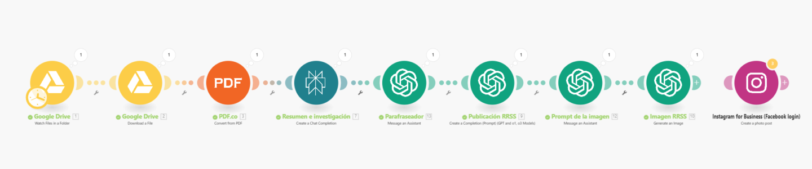

# PDF a Instagram | Ale

> Ruta: Automatizaciones Make › PDF a Instagram | Ale

**📎 Recursos:**
- PDF a Instagram

---

Automatización de [Alejandro Álvarez](https://www.skool.com/@alejandro-alvarez-4462?g=imperio-digital)

📌 **Plantilla descargable al final del post.**

### **Entendamos qué hace**

**🎯 Objetivo:**  
Automatizar la creación de publicaciones en Instagram a partir de un archivo PDF almacenado en Google Drive. La automatización extrae el contenido del documento, lo optimiza con IA y genera un post formateado para redes sociales.

---

### **🔄 Flujo de la Automatización**

#### **1️⃣ Conversión de PDF a Texto**

🔹 Se toma un archivo PDF desde Google Drive.  
🔹 Se extrae el contenido en formato de texto para su procesamiento.

#### **2️⃣ Búsqueda de Información con Perplexity**

🔹 El texto extraído del PDF se analiza con Perplexity AI.  
🔹 Se busca información adicional relevante para mejorar el contenido.

#### **3️⃣ Opcional: Parafraseo y Estilo Natural**

🔹 Se utiliza un asistente en OpenAI que ajusta el texto al estilo del usuario.  
🔹 Permite darle mayor naturalidad y coherencia a la publicación.

#### **4️⃣ Formateo para Publicación en Instagram**

🔹 Se genera un texto estructurado y optimizado para Instagram.  
🔹 Se aplica formato adecuado para mejorar la legibilidad en redes sociales.

#### **5️⃣ Opcional: Generación de Imágenes**

🔹 Se usa un asistente para generar prompts de imágenes basados en el contenido.  
🔹 El módulo de IA crea imágenes personalizadas para acompañar la publicación.  
🔹 Se puede reemplazar con técnicas enseñadas por @Benjamin Cordero.

#### **6️⃣ Publicación Automática en Instagram**

🔹 Se conecta la automatización con la cuenta de Instagram.  
🔹 Se sube el contenido con imagen y descripción optimizada.

---

### **📈 Resultados:**

✅ Transforma PDFs en contenido listo para redes sociales.  
✅ Optimiza la publicación con IA y búsqueda contextual.  
✅ Agiliza la gestión de contenido sin intervención manual.

---

### **🔧 Requisitos:**

✔️ **Google Drive** – Almacenamiento del PDF.  
✔️ **Perplexity AI** – Análisis y búsqueda de información relevante.  
✔️ **OpenAI** – (Opcional) Mejora del estilo del texto.  
✔️ **Make** – Orquestación del flujo de trabajo.  
✔️ **Instagram** – Plataforma de publicación automatizada.

Punto 1: [Cómo Extraer Datos de PDFs (imgs) a Google Sheets](https://www.skool.com/imperio-digital/classroom/a65de4cd?md=16e92821a72540bb8c09fdd6486e24c3)

Punto 2: [🔥Asistente de Tonalidad (Tono de Voz)](https://www.skool.com/imperio-digital/classroom/a65de4cd?md=7132612be2564c469e7a0ced8afbb7e4)

Punto 3: [Asistente de Instagram](https://www.skool.com/imperio-digital/classroom/a65de4cd?md=5b071e54617c49008ede9441eaf68275)

Punto 4: [Estilos Gráficos Imágenes IA](https://www.skool.com/imperio-digital/classroom/7efa4739?md=4540be929b0543e5a561ef7203cd3fdb) o [🔥Crea Imágenes FLUX LoRA + Make + Replicate](https://www.skool.com/imperio-digital/classroom/a65de4cd?md=55b156088f4e48a4b3c1de2c28fa5fc2)

---

### **📝 Conclusión:**

Alejandro muestra cómo aprovechar IA y automatización para transformar documentos PDF en publicaciones atractivas para Instagram. Ideal para quienes buscan compartir contenido de valor de manera eficiente y sin esfuerzo manual. 🚀
