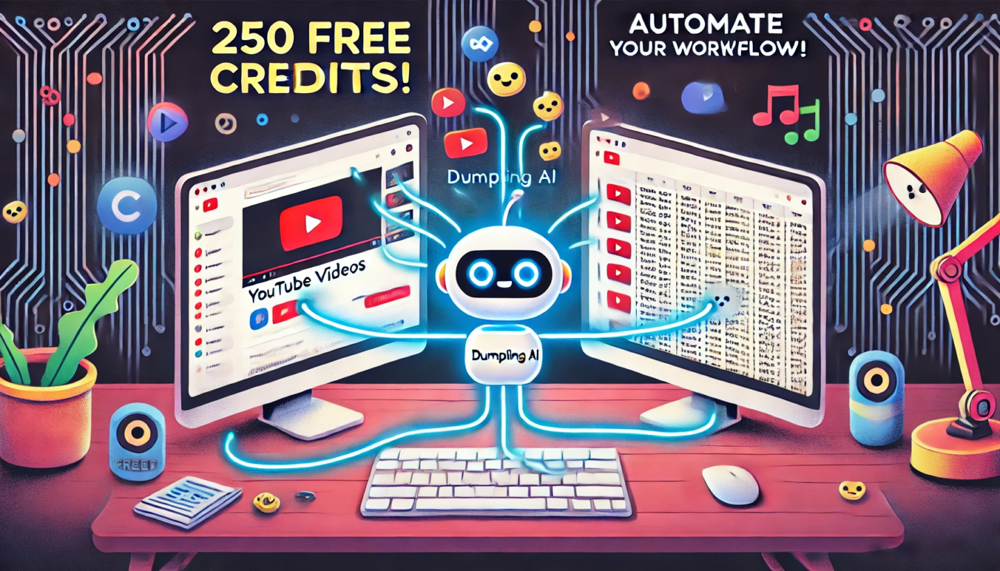

# Transcribe Videos de YouTube | Jordi

> Ruta: Automatizaciones Make › Transcribe Videos de YouTube | Jordi

**📎 Recursos:**
- JSON Youtube Playlist

---

Publicación hecha por [Jordi Torras ](https://www.skool.com/@jordi-torras-4912?g=imperio-digital)

(Texto escrito por Jordi Torras)  
  
¡Imperiales! 🚀 Si alguna vez habéis soñado con convertir el contenido de vuestros vídeos en texto sin esfuerzo, esta es vuestra oportunidad. 🖋️💡

Quiero compartiros una automatización que os permite transcribir todos los vídeos de una playlist de YouTube y guardar los resultados en una hoja de Google Sheets. 🙌 Solo necesitáis una cuenta en [Dumpling AI](https://www.dumplingai.com/?via=carallot), donde, al registraros, ¡os regalan 250 créditos! 🎁 Cada transcripción cuesta un crédito, así que tenéis un excelente punto de partida.

¿Cómo funciona?

1️⃣ Entrada: Automatizad el proceso, eligiendo la frecuencia con la que queréis transcribir vuestros vídeos.

2️⃣ Proceso: La herramienta detecta los vídeos en la playlist y los transcribe usando Dumpling AI.

3️⃣ Salida: Los datos se guardan en una hoja de Google Sheets con los detalles clave: enlace del vídeo, fecha, título y transcripción.

¿Qué necesitáis?

- Un canal en YouTube 🎥
- Una cuenta en Dumpling AI (registraos aquí: [Dumpling AI](https://www.dumplingai.com/?via=carallot))
- Una hoja de Google Sheets con las columnas necesarias

¡Animaos a probarlo y descubrid lo fácil que es automatizar tareas repetitivas! 💪 🛠️

PD: Si en lugar de una playlist, queréis transcribir todos los videos de vuestro canal, solo debéis cambiar el primer módulo de la automatización. 🔥🔥🔥
