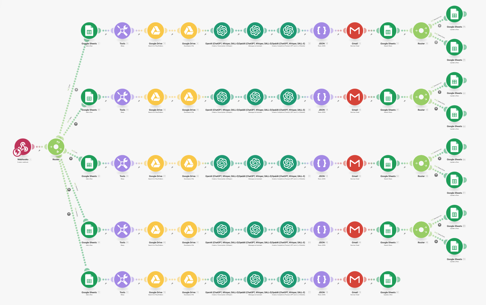
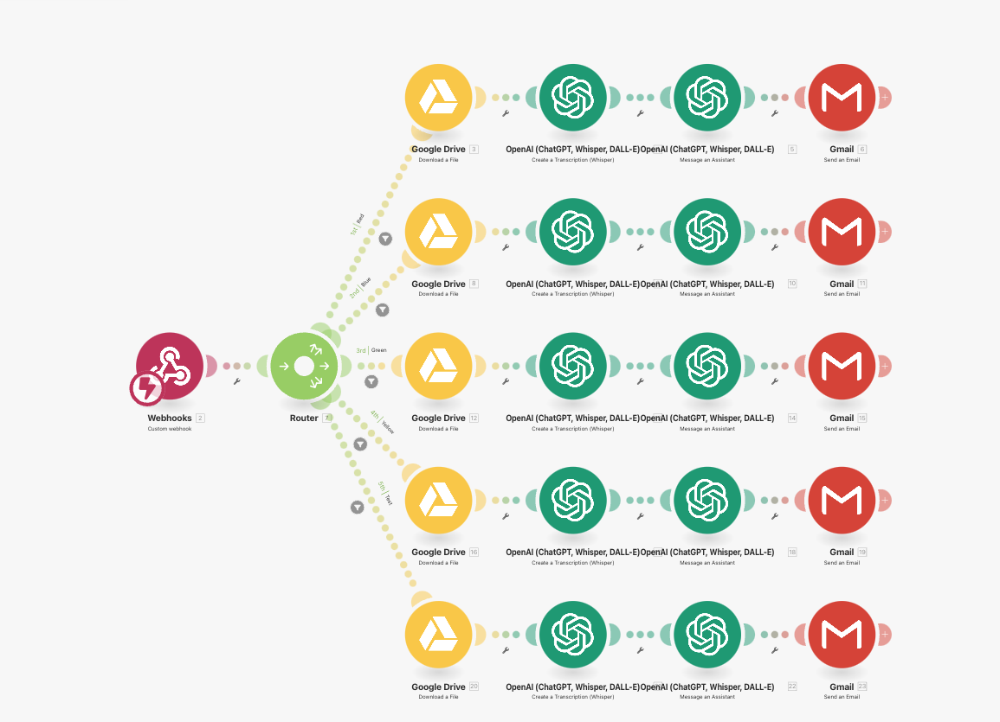

# Transcripción de Llamadas | Carlos Dominguez

> Ruta: Automatizaciones Make › Transcripción de Llamadas | Carlos Dominguez

**🎬 Vídeo (10.3 min):** https://www.loom.com/share/04aca068ef8340789156e756b1330e69?sid=fdfe5795-ef30-465f-adc7-b179aa438428

**📎 Recursos:**
- Plantilla 1
- Plantilla 2

---

[**Carlos Dominguez**](https://www.skool.com/@carlos-dominguez-6330?g=imperio-digital)



[**Carlos Dominguez**](https://www.skool.com/@carlos-dominguez-6330?g=imperio-digital)

"Hoy les comparto una automa tización que me ha funcionado de maravilla para transcribir llamadas automáticamente 🎧➡️📄 sin consumir miles de operaciones en Make ⚙️. El problema era detectar nuevos archivos en Drive sin depender de un trigger por intervalo ⏱️. La solución: un Apps Script que monitorea carpetas específicas y lanza un webhook apenas detecta un nuevo archivo 🚀. Así evito que Make esté revisando constantemente y ahorro un montón 💰.



Una vez que se sube la llamada (.wav), identifico al usuario y la carpeta correspondiente, la paso por Whisper para obtener la transcripción sin modificar nada , y luego uso un asistente tipo Firefly AI para generar un resumen en HTML . Al final, mando el resultado por correo . Esta lógica evolucionó hacia una integración directa con el API del software de llamadas, pero si quieren automatizar sin gastar de más, el combo de webhook + Apps Script 💡 es lo más útil. ¡Espero que les sirva! 🙌Y si pueden, échenme la mano con un like ❤️ para llegar al nivel 6 antes de que se acabe el tiempo ⏳😄

PD: Les dejo los 2 blueprints y el Apps Script

Apps Script en Notion: [https://www.notion.so/upperedgepm/Apps-Script-para-Google-Drive-y-Make-com-1c8a415047ad80859a37f519c3a4065f?pvs=4](https://www.notion.so/upperedgepm/Apps-Script-para-Google-Drive-y-Make-com-1c8a415047ad80859a37f519c3a4065f?pvs=4)  
  


```
const webhookUrl = '<https://hook.us1.make.com/qobesg1fers134u5jpfyfoqil1i1e7u9>'; 
```

➡️ Define la URL del webhook de Make (antes Integromat), que recibirá la información de los archivos nuevos.

> const foldersToMonitor = [
> 
> { id: '1n_KJmdDk-hpAdKDcFpjscVbWW-xDk', name: 'Red' },
> 
> { id: '1_2HymW0yHiqaVNzerPnpr-RxP2sIj', name: 'Green' },
> 
> { id: '1YA1WZgor1OEhgWGNL-vT4LkoJdFnp', name: 'Blue' },
> 
> { id: '1p_HShU1jl8dogXZGTARJmi5LHzAKE7', name: 'Yellow' },
> 
> { id: '1W_YSL9q_U_GJtvDg2yXgApQxRlIwRW', name: 'Test' }
> 
> ];

➡️ Lista de carpetas de Google Drive que se van a monitorear. Cada carpeta tiene un id y un nombre.

> const cache = CacheService.getScriptCache();
> 
> ➡️ Se accede al servicio de caché de Google Apps Script para evitar procesar el mismo archivo varias veces.

> function isRecentlyCreated(file) {
> 
> const now = new Date();
> 
> const threshold = 60 * 1000; // last 60 seconds
> 
> return now - file.getDateCreated() < threshold;
> 
> }

➡️ Función que determina si un archivo es reciente, es decir, si fue creado hace menos de 60 segundos.

> function checkForNewFiles() {
> 
> let newFilesFound = false;

➡️ Función principal. Inicializa una bandera para saber si se encontraron archivos nuevos.  


```
foldersToMonitor.forEach(folderObj => {
```

➡️ Recorre cada carpeta definida en foldersToMonitor.

```
const folder = DriveApp.getFolderById(folderObj.id); const files = folder.getFiles();
```


➡️ Obtiene la carpeta desde Drive y luego los archivos dentro de esa carpeta.

> while (files.hasNext()) {
> 
>   const file = [files.next](http://files.next)();
> 
>   const fileId = file.getId();


 ➡️Recorre cada archivo dentro de la carpeta y obtiene su id.

>   if (!cache.get(fileId) && isRecentlyCreated(file)) {

➡️ Verifica que el archivo no esté en caché (no ha sido procesado) y que sea reciente (menos de 60 segundos de antigüedad).

>    const payload = {
> 
>       folderName: folderObj.name,
> 
>       folderId: folderObj.id,
> 
>       fileId: fileId,
> 
>       name: file.getName(),
> 
>       url: file.getUrl(),
> 
>       mimeType: file.getMimeType(),
> 
>       createdAt: file.getDateCreated()
> 
>     };


 ➡️Se arma un objeto con los datos del archivo, que será enviado al webhook.

> try {
> 
>       const res = UrlFetchApp.fetch(webhookUrl, {
> 
>         method: 'post',
> 
>         contentType: 'application/json',
> 
>         payload: JSON.stringify(payload),
> 
>         muteHttpExceptions: true
> 
>       });

➡️ Se hace la petición POST al webhook con los datos del archivo en formato JSON.  


> Logger.log(`✅ Sent file from ${[folderObj.name](http://folderObj.name)}: ${fileId}`);
> 
>       cache.put(fileId, 'processed', 60 * 60); // cache for 1 hour
> 
>       newFilesFound = true;

➡️ Si el envío fue exitoso, se guarda el ID en caché por una hora y se indica que se encontró al menos un archivo nuevo.

> } catch (err) {
> 
>       Logger.log(`❌ Error for file ${fileId}: ${err}`);
> 
>     }

➡️ Si hay un error al enviar al webhook, se registra en los logs.

> if (!newFilesFound) {
> 
> Logger.log("📭 No new files found in any folder.");
> 
> }
> 
> }

➡️ Si no se encontró ningún archivo nuevo en ninguna carpeta, se registra un mensaje informativo.

> const webhookUrl = '[https://hook.us1.make.com/xxxxxxxxxxxxxxxxxx](https://hook.us1.make.com/xxxxxxxxxxxxxxxxxx)';
> 
> const foldersToMonitor = [
> 
>   { id: '1n_KJmdDk-hpAdKDcFpjscVbWW-xDkH', name: 'Red' },
> 
>   { id: '1_2HymW0yHiqaVNzerPnpr-R2ywXsIj', name: 'Green' },
> 
>   { id: '1YA1WZgor1OEhgWGNL-vT4Lk4tUdFnp', name: 'Blue' },
> 
>   { id: '1p_HShU1jl8dogXZGTARJmqLHzAKE7', name: 'Yellow' },
> 
>   { id: '1W_YSL9q_U_GJtvDg2yXWpQxRlIwRW', name: 'Test' }
> 
> ];
> 
> const cache = CacheService.getScriptCache();
> 
> function isRecentlyCreated(file) {
> 
>   const now = new Date();
> 
>   const threshold = 60 * 1000; // last 60 seconds
> 
>   return now - file.getDateCreated() < threshold;
> 
> }
> 
> function checkForNewFiles() {
> 
>   let newFilesFound = false;
> 
>   foldersToMonitor.forEach(folderObj => {
> 
>     const folder = DriveApp.getFolderById([folderObj.id](http://folderObj.id));
> 
>     const files = folder.getFiles();
> 
>     while (files.hasNext()) {
> 
>       const file = [files.next](http://files.next)();
> 
>       const fileId = file.getId();
> 
>       if (!cache.get(fileId) && isRecentlyCreated(file)) {
> 
>         const payload = {
> 
>           folderName: [folderObj.name](http://folderObj.name),
> 
>           folderId: [folderObj.id](http://folderObj.id),
> 
>           fileId: fileId,
> 
>           name: file.getName(),
> 
>           url: file.getUrl(),
> 
>           mimeType: file.getMimeType(),
> 
>           createdAt: file.getDateCreated()
> 
>         };
> 
>         try {
> 
>           const res = UrlFetchApp.fetch(webhookUrl, {
> 
>             method: 'post',
> 
>             contentType: 'application/json',
> 
>             payload: JSON.stringify(payload),
> 
>             muteHttpExceptions: true
> 
>           });
> 
>           Logger.log(`✅ Sent file from ${[folderObj.name](http://folderObj.name)}: ${fileId}`);
> 
>           cache.put(fileId, 'processed', 60 * 60); // cache for 1 hour
> 
>           newFilesFound = true;
> 
>         } catch (err) {
> 
>           Logger.log(`❌ Error for file ${fileId}: ${err}`);
> 
>         }
> 
>       }
> 
>     }
> 
>   });
> 
>   if (!newFilesFound) {
> 
>     Logger.log("📭 No new files found in any folder.");
> 
>   }
> 
> }

## 🎙️ Transcripción

Buenas comunidad, estoy grabando este video para enseñarles un poquito a una automatización que sube trabajando Eh, al principio, eh, me estaba peleando mucho sobre todo con el módulo de Google Drive Porque les platico un poco que es lo que hace esta automatización Eh, primero lo que yo tenía es mi primer trigger, mi primer módulo, era Google Drive Y estaba buscando cuando un archivo se subiera a una carpeta de drive, iniciar la automatización. Como ya se pueden imaginar, que significa eso, que cada vez que yo tuve un archivo nuevo iba a tener que checar, pero como no es un instant, no es un trigger como tal, tenía que tener un intervalo, cada 5, cada 15, cada 10, y obviamente eso me iba a hacer que perdiera o que gastara muchísimas operaciones, lo cual no es lo Entonces después de unas pruebas se me ocurrió algo que hago por lo general con Google Sheets, que es usar un Apps Script para poder disparar cada vez que haya un archivo nuevo. ¿Qué es lo que hice en este caso? Bueno, antes de eso les platico un poco qué es lo que hace esta automatización. Es agarrar una llamada, esto lo hago por cuestiones de mi trabajo, grabamos todas las llamadas que se hacen. agarra una llamada, el sistema que utilizamos es la guardaformato.wav, agarra lo que es el archivo de audio y lo subimos a un drive. Una vez que se sube, lo que va a hacer esto es que va a identificar de qué drive o de qué usuario viene esa llamada y en base a eso tenemos diferentes filtros y va a buscar en la carpeta que que cada usuario tiene configurada en su teléfono, donde se guardan las llamadas. Una vez que agarra la llamada, esto le agarra el file ID que le está pasando aquí, ahorita les voy a enseñar, y lo que hacemos es, se la damos a chatgpt con un whisper y simplemente le decimos que agarre esa llamada y que que no haga ningún resumen, que no parafrasee, que no cambie nada, que sea tal cual sin modificar. Todo lo tengo en inglés porque mi trabajo todo es en inglés, entonces para cuestiones de tener todo lo tengo que tener en inglés y de todas formas, de por si me gusta manejarlo en inglés, porque siento que entiendo un poco mejor los prompts o es un poco más fácil promptear en inglés. Y esto, el Output, es es básicamente el transcript puro y neto, después se lo pasa a otro módulo, en este caso es un asistente, que yo le llame así, es un digamos clon de Order AI, si alguien lo ha usado, es una herramienta para, tipo Firefly AI, que es como para juntas, que puede agarrar tus, los audios de las juntas y te puede hacer transcripciones, te hace lo que es la parte de, ,identificar las personas que están hablando, palabras clave, siguientes pasos, te lo ponen bullet points y todo eso. Y le estoy pidiendo que me lo den un formato HTML, ahorita se les enseño como lo entrené. Y al final simplemente está agarrando esto y estoy mandando un correo electrónico a estos usuarios. Y simplemente aquí le estoy poniendo que es el resultado de esto. Y eso es prácticamente todo. Ahora les voy a mostrar mi otra pantalla para que vean. Aquí estamos en la otra pantalla. Este es mi asistente, o REIA si lo llamé. Y esas son las instrucciones que le di. Es un asistente inteligente artificial para las juntas. Te van a dar un transcript. Tu trabajo es generar un HTML. Y esas son mis como que las diferentes secciones que le estoy dando, ese es un ejemplo del output que le estoy pidiendo y aquí simplemente en el chat pues lo estuve entrenando de que es lo que me gustaba, le estuve dando como algún feedback de algunas cosas que estuviera cambiando gráficamente y todo esto. A mi lo que me gusta hacer es cuando me da un código, por ejemplo este código, lo copio y para no tener que hacer una prueba, mando un y si me gusta y todo está perfecto entonces le digo que buque, que me gustó, que se aprenda, que se acuerde, que eso es lo que quiero que me dé y entonces ya cuando me regreso aquí al módulo esto es lo que estoy llamando aquí directamente. Ahora, lo que considero más importante es cómo lo hago para estar monitoreando cuando algo se va a subir al Google Drive sin tener que estarlo corriendo cada 5, cada 15, cada 10 minutos. Si se fijan aquí tenemos un webhook y simplemente que hago es que tengo un script de este lado, este es un app script de google y aquí tengo mi constante, mi webhook url, aquí tengo lo que es los folders que voy a estar monitoreando, estos son los id's de cada una de las carpetas y este es simplemente un nombre, porque tengo porque esto yo lo quiero mandar y quiero recibir esto con el webhook y simplemente aquí le estoy diciendo que busque creado en los últimos 60 segundos, esa es la función para checar los nuevos archivos, va a tomar el folder que yo le esté pasando directamente desde acá, va a buscar esto, es un array, entonces va a buscar en cualquiera de estos folders Y ya está. Si hay algo simplemente me lo va a mandar, esto es el POST o el aplicación JSON, simplemente es la forma en la que se está comunicando este script con Make, Make está escuchando y este es el método POST para mandar esta información y aquí tengo un pequeño log simplemente por si hay algún error o algo. De esta forma con este código puedo mandar directamente a Make sin tener que tener un un módulo de Google Drive para estar monitoreando lo cual te consume, otra vez te consume muchísimas operaciones estar viendo si hay alguna actualización o algo así. Ya después de esto me di cuenta que no era la manera más eficiente, por lo menos en nuestro caso, porque las llamadas están siendo grabadas en vivo, en el momento que se graba la llamada se está generando un archivo y obviamente lo que hacía esto es que en cuanto el archivo se detectaba iniciaba estaba el trigger y lo que me estaba pasando es que me estaba generando grabaciones incompletas porque desde que la llamada inicia se empieza a generar el archivo de audio y simplemente se va sobrescribiendo, entonces obviamente me cortaba porque me tomaban nada más los primeros segundos. Después hice un cambio y esto evolucionó a lo que les voy a enseñar, pero creo que si no están haciendo como en vivo y simplemente es un audio o un archivo que quieran mover al drive y no quieren estar checando, creo que Esta información, este webhook con el script es como que lo más útil que pueden rescatar de este vídeo. Pero nada más para enseñarles esto, evolucionó a esto. Aquí en este caso tengo lo que es un webhook, pero aquí mi disperador es directamente el software de teléfono que utilizamos para las llamadas. Resulta que el software tiene un API REST. lo cual puede hacer aquí esta llamada a mi webhook y de aquí simplemente tengo unos filtros dependiendo del usuario. Esa es la extensión de los usuarios que están recibiendo la llamada o haciendo la llamada. Inicio todo el proceso. Lo agrego a una base de datos en Google Sheets. Tengo simplemente un delay para asegurarme por cuestiones del internet de cada usuario que las llamadas me asegure que las llamadas se suban. suban a su drive, en este caso lo que voy a hacer es buscar en su carpeta tal cual de cada usuario, como busco la llamada, con el call id que estoy tomando del webhook que estoy recibiendo, ya que localice la llamada, la descargo, repetimos el proceso, se lo paso a chatgpt para pedirle que haga el transcript, se lo paso a mi asistente para que me genere el html para el correo de gmail y simplemente que lo único que está haciendo aquí es poder sacar o hacer un parse de lo que es el transcript y el sentimiento que sí que sí el sentimiento si fue positivo o negativo neutral a llamada con este parse json simplemente estoy separándolo para mandar el correo y después mapearlo a gmail ,aquí directamente en el, buscando el search row, estoy buscando aquí antes, bueno antes de mapearlo estoy buscando el número de teléfono de la persona que llamó para ver si lo tenemos en nuestra base de datos, si no lo tenemos entonces supongo que no existe, si sí lo tenemos lo encuentro y busco el nombre de la persona que marcó y aquí es donde ya estoy mapeando la transcripción y el sentimiento de la llamada con el, JSON Parse que tengo y básicamente todo esto se repite por cada usuario que puede recibir llamadas, entonces esto es la evolución de esto pero creo que lo importante es que se queden con el webhook y el script para poder tomar lo que son diferentes, buscar diferentes archivos de diferentes carpetas, aquí no hay un límite ,pueden poner varias carpetas y esto lo que va a hacer simplemente es estar buscando. Aquí simplemente lo que ustedes harían sería agarrar su función de buscar los archivos y agregan un trigger, en este caso aquí. Y nos vamos para acá, podemos agregar un trigger y la ventaja de hacerlo con Apps Script es que es muy difícil que superes un trigger. llegues al límite y menos si nada más tienes uno, dos o tres scripts, simplemente aquí tú le puedes poner inclusive que corra si quieres cada minuto y ya, cada minuto va a estar buscando archivos nuevos, va a estar buscando archivos nuevos y detecta, ejecuta el trigger, te llega por make y ya, y te evita estar pagando muchas operaciones desde make. Les comparto este vídeo, espero que le den la mano. en mi publicación de Skull y que me ayuden a llegar al nivel 6. Me falta bastantito pero si cada persona que está en la comunidad le da like yo creo que si llegamos al nivel 6 antes de los dos días que quedan. Gracias, saludos.
