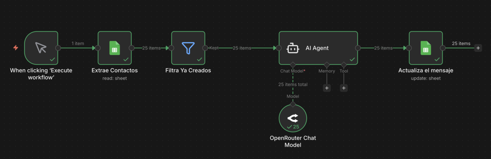

# Cold Email n8n

> Ruta: Automatizaciones n8n › Cold Email n8n

**🎬 Vídeo (26.5 min):** https://www.youtube.com/watch?v=ePy0_ZYwFik&t=490s

**📎 Recursos:**
- Agente Cold Email Writer n8n

---

PROMPT:  
  
Eres un experto "Foodie" y especialista en fotografía gastronómica. Tu trabajo es prospectar restaurantes en Chile de forma híper-personalizada y cercana.

> TU MISIÓN:
> 
> 1. Tienes el nombre del dueño y su web.
> 
> 2. DEBES leer el contenido de esa URL.
> 
> 3. Busca un plato estrella o ingrediente en el texto recuperado.
> 
> 4. Redacta un mensaje muy corto y casual siguiendo estas reglas.
> 
> REGLAS DE REDACCIÓN:
> 
> - Idioma: Español de Chile (natural), tono de amigo (usa "te tinca" en vez de "te interesa").
> 
> - Estructura: Saludo -> Elogio específico del plato (Icebreaker) -> Problema (fotos oscuras) -> Oferta (3 fotos gratis con IA) -> Cierre.
> 
> - Si la herramienta falla o la web no tiene menú: Elogia el restaurante por su nombre o ubicación, pero no digas "no pude leer tu web".
> 
> FORMATO DE SALIDA (OBLIGATORIO):
> 
> Entrégame ÚNICAMENTE el mensaje en HTML simple (
, <b>). Sin markdown.
> 
> EJEMPLO DE OUTPUT:
> 
> 
Hola Claudio, que tal? Pasé por la web y vi que tienen Lomo a lo Pobre... se ve mortal. 🤤

Oye, me fijé que las fotos del menú online están un pelín oscuras y no le hacen justicia al sabor, sobre todo las de Google (que hay mucha gente que llega por ahi). 
 Estoy  comenzando, pero me dedico a mejorar fotos de comida con IA, sin perder la esencia obviamente y sin cobrar la millonada que te cobraría un fotografo. Te tinca si te edito una gratis sin compromiso para que veas el cambio?

Me mandas una para probar?

## 🎙️ Transcripción

Llevo ya bastante tiempo metido en el mundo de la inteligencia artificial, la venta de servicios relacionado a la IA y las automatizaciones. Y si tuviese que empezar desde cero este 2026, esto es exactamente lo que haría. Pero antes de comenzar quiero que todos estemos en la misma página y vengo a decir de que la IA no viene a cambiar nada ni a inventar absolutamente nada nuevo, sino que es una manera que tenemos de amplificar lo ya existente. Y si nos vamos al macro, tenemos que entender de que todos los negocios funcionan igual. Tenemos una etapa de prospección, tenemos una etapa de ventas, tenemos una etapa de cierre y tenemos una etapa de entrega en todo negocio. Salimos a buscar clientes, llegamos a una llamada de ventas o algún proceso de ventas, luego ocurre el cierre, existe el proceso del onboarding y después el proceso de la entrega del servicio y finalmente la postventa. Y en todos estos lugares siempre van a existir distintos dolores o distintos cuellos de botella que vamos a tener que ir solucionando. Lo importante de esto es que no venimos a cambiar el qué. No venimos a reinventar la rueda. No es cambiar el qué, sino cambiar el cuánto. Antes de eso, sí sé que históricamente el 10% de las personas llegan hasta el final de mis videos, es decir, el 90% no los va a terminar. Pero si tú eres parte de ese 10%, literalmente para el final de este video vas a aprender todo. La lógica, el sistema, la oferta, la propuesta y todo absolutamente sin humo, porque todo lo que te voy a mostrar hoy día es lo que he aprendido con los años y es 100% real. Así que toma tu café y vamos directamente al grano. Okay, volviendo a la base, necesitamos entender el idioma de los negocios. Todos los negocios al final siguen esta estructura, la prospección, la venta, el cierre y la entrega. Ahora nos vamos a enfocar específicamente en la prospección. ¿Por qué? Porque cuando nos enfocamos en la prospección tenemos la fase de todo customer journey de las personas o de los clientes que vamos teniendo al nivel más métrico posible. Entonces, supongamos que entramos en una llamada de venta si quiero vender un servicio de inteligencia artificial y logro levantar que mi cliente prospecta alrededor de 100 personas al mes. Ya tenemos información muy valiosa si es que empezamos a crear ciertos supuestos. Lo importante es que entienda que en esta llamada tenemos el control y entendemos más o menos los números que se manejan en su industria. Si asumimos que tiene una tasa de respuesta del 10% de cada outreach, una tasa de agendamiento del 40%, una tasa de cierre del 25 y un lifetime value de $3,000, es decir, que cierra uno de cada 100 prospectos, nos da un lifetime value total por ciclo de $3,000. Estos son supuestos que nosotros empezamos a manejar y que en el momento de empezar a recopilar la información vamos recolectando. ¿Dónde está el problema? que la mayoría de las personas intentan de optimizar los números que están en el medio. Yo intentaba de optimizar los números que estaban en el medio, es decir, intentaba de eh aumentar la tasa de agendamiento, aumentar la tasa de cierre o la tasa de respuesta y al final son cambios marginales. Imaginemos que llegamos a aumentar en un 5% la tasa de agendamiento. Al final es un cambio muy marginal en comparación a lo que podríamos tener si es que estamos en la etapa de más arriba del embudo. Y aquí va uno de los principios clave que me gustaría con los que te quedes, que es que mientras más arriba en el embudo de ventas estamos, mayor es el impacto, porque existe una especie de multiplicador a medida que vamos subiendo en el embudo. Entonces, la mayoría de la gente intenta de optimizar por acá. Mientras nosotros vámonos al bruto y apuntemos al volumen. Intentemos de aumentar al máximo la tasa de respuestas de el volumen. ¿Qué es lo que vamos a hacer y qué es lo primero que haría si es que empezase de cero? Bueno, vendería un sistema de outreach personalizado, es decir, atacaría la etapa más alta del embudo. Y eso es lo que te voy a mostrar en este video. ¿Qué significa hacer esto? Bueno, es un sistema de callal email que hemos visto en videos anteriores, donde nos dedicamos únicamente y exclusivamente a prospectar personas en el nicho o en la industria en la que estamos trabajando. Es decir, empezamos a mandarle correos personalizados a cada uno de esos clientes de una base de datos que vamos a descargar. ¿En qué consiste? Bueno, existe tres pasos o tres fases que son las que vamos a ver. La primera es Apollo. Apolo nos ayuda a extraer la data de ciertos clientes o ciertos correos en la industria que nosotros queramos. Supongamos que, no sé, trabajamos con restaurantes y queremos exclusivamente scrapear o extraer pases de datos de restaurantes en alguna comuna o residencia en específico. Apolo es la plataforma que vamos a usar para esto. Ya vamos a entrar más a detalle, vamos a construir absolutamente todo, pero es para que te hagas una imagen de cómo atacaría o cómo vendería este primero, esta primera automatización o este primer servicio. Lo segundo es que estamos en un lugar de tanto ruido que si es que no estamos hablando extremadamente personalizado, la gente ya no está leyendo los correos, la gente ya no te está escuchando, sino sientes que te están hablando a ti y exclusivamente a ti. Aquí donde entra la fase de personalización, donde usamos la plataforma de N8N para personalizar un correo electrónico para cada uno de estos restaurantes, por ejemplo, o cada uno de estos eh actores en la industria con los que vamos a trabajar. Es decir, es el cerebro donde orquestamos todo esto y logramos personalizar el correo en base a la información que tienen en su página web. Y finalmente pasamos a la tercera etapa, que sería la distribución. Para esto usaríamos Instantly, que es una plataforma que nos permite calentar dominios de correos electrónicos para que cuando mandemos un correo simplemente no le llegue a spam a las personas. Entonces está intercambiándose correos entre sí todo el rato constantemente para que sea visto o flaged o etiquetado como un correo electrónico sano, por así decirlo. ¿Okay? Supongamos que le ofrecemos este sistema eh donde pasamos de los 100 prospectos que íbamos a escribirle a 500, ¿okay? y tenemos un por 5 en la etapa más alta del embudo. Y esto se lo prometemos y asumimos que mantenemos todo el resto constante, es decir, set disparus en el resto de las variables, la tasa de respuesta, la tasa de agendamiento, tasa de cierre, etcétera. Aquí ya tenemos una comparativa superinesante que podemos hacerle en la misma llamada de ventas y le podemos decir, "Oye, entonces actualmente tu tasa de cierre está en este porcentaje." Okay. Okay. Ya. Si es que mantuviéramos este porcentaje, yo puedo aumentar tu prospección de 100 negocios en específicos y la puedo aumentar a 500, esto significaría una oportunidad de $9,000 que estarías ganando o que estarías pudiendo ganar. ¿Ya? Y ahí empezamos a hacer lo que son los anclajes, es decir, empezamos a aumentar o crear un anclaje en un punto o en un nivel más alto en el que la oportunidad es tan lógica y tan evidente que después cuando damos nuestro precio del servicio pasa a ser no una decisión emocional, sino una decisión lógica, como ya vamos a ver. ¿Okay? Entonces, tenemos un proceso probado que hemos hecho este outreach ya con otros clientes y le agregamos la inteligencia artificial que es para la personalización de esos mensajes de cada uno de los prospectos. Y este punto es muy importante porque pasamos a vender la lógica porque 3,000 es mayor a 12,000. Es decir, tenemos una oportunidad de ganancia de $9,000. Porque al final, siendo sincero, todos los dueños de negocio quieren dinero, creen en los números, no creen en ti, es decir, quieren ver un Roy y todas las decisiones la van a tomar en base a el Roy. ¿Cuánto es el retorno en la inversión que van a conseguir ellos si es que hacen esta inversión en ti. Nota, siempre hablar de una inversión, nunca hablar de un costo. si es que ellos hacen esta inversión en este sistema de outreach personalizado de los leps o de los clientes potenciales, cuánto es la posible ganancia que van a tener ellos sobre esa inversión. Esa es lo principal que se van a preguntar después de est factor de riesgo, pero eso ya lo vamos a ver en un par de slides más, pero por ahora es okay. Vamos a tomar la decisión en base a el retorno sobre la inversión que nos va a dejar. ¿Qué hemos visto hasta ahora? que si es que atacamos el top of the funnel es mucho más fácil llevarlo a un nivel métrico. La gente toma decisiones en base a lo métrico porque racionalizamos, es decir, lo pasamos a lógica al entender cuánto valor estamos comparando. ¿Okay? Pasamos a hacerlo y transformarlo en una decisión obvia. Y aplicando exactamente esos pasos, fue como logré vender esta misma automatización que estamos viendo en $5,000. Y no fue porque soy un gurú técnico, de hecho detesto la palabra gurú en sí, pero es un caso real que se lo vendí a este par de coaches que viven en Estados Unidos. Ellos venden servicios presenciales en Tampa, Florida. Y lo que les ofrecí fue un sistema de outreach específico para los negocios en Tampa, Florida, asegurándoles un agendamiento de $5,000 o más. Y si es que no se cumplía, no pagaban absolutamente nada. Entonces, lo que hacíamos era empezar a mandarle correos a negocios locales que estuviesen en Tampa, Florida. Y luego empezábamos a tener una conversación hasta lograr un agendamiento. Si es que uno de esos leads terminaba agendando con ellos, ya se validaba el sistema y para ellos era una ganancia, es decir, era un win win para todos. Tengo mucho más especificado y a detalle cómo vendí esta automatización y cómo la armé en este video que está de acá. Por eso no me voy a detener tanto tiempo en esta, pero aquí comparto todo el crudo de cómo la vendí, de cómo es el proceso de armar esta automatización, etcétera. Y también si es que te interesa, tengo otro video acá donde estoy literalmente armando esta automatización desglosada mucho, mucho más a detalle. Es un crudo de 2 horas y media sin absolutamente ningún corte, con bastantes errores en el camino para que veas el procesamiento lógico que uno tiene a medida que lo va haciendo y está publicado también en YouTube. Este video también es de altísimo valor. Estoy literalmente vendiendo y armando este mismo sistema que te voy a mostrar hoy día para que lo puedas ver por tu cuenta y veas que esto es algo real, ya que no es lejano. De hecho, estecat es s superinesante. Ese video de 2 horas y media es de altísimo altísimo valor y justamente es para poder acercarlo a un plano más real y ver todos los errores y el backstage y no la parte linda y la parte editada y la parte que todo funciona. De esta manera puedes comprobar por tu cuenta que es algo que sí funciona. Entonces, nuevamente no vendí esta automatización en $5,000 por ser un gurú técnico, sino porque es algo que para ellos era una decisión lógica. Si lográbamos vender por lo menos uno, ya recuperábamos la inversión que se hizo. Si es que no vendíamos ninguno, no me pagaban absolutamente nada. Y es por eso que es importante la garantía. Logramos eliminar por completo el riesgo de garantía y pasó a ser un riesgo asumido completamente por mí. Si es que no lográbamos agendar ninguna, no pagaban absolutamente nada. Y en ese momento las tasas o los números que ellos tenían de agendamientos, los números eran bastante buenos. El problema estaba arriba en que estaban teniendo muy pocas agendas. y entendiendo ya todo este sistema que prospecta, luego descarga la información de los negocios en específico, le redacta un correo personalizado y básicamente logramos aumentar el volumen manteniendo la personalización, voy a entregarte todo, absolutamente todo, en una bandeja de plata. Es decir, te voy a mostrar todo el paso a paso de cómo funciona y de cómo se arma, hasta incluso cómo se cerraría. Okay, partamos por lo básico, cómo se construye. Veamos el stack tecnológico. Ya lo vimos. Apolo IO es una plataforma que usamos para extraer data de ciertos negocios que cumplen algunos criterios, pero lo importante de esto al momento de escribirle es sonar humano. ¿Cómo sonamos humano? Mediante la personalización. Vamos a ejecutar este workflow aquí en N8N que nos permite crear un correo personalizado bastante simple, bastante sencillo que suene humano para enviárselo a cada uno de los negocios. Luego, finalmente, le enviamos los correos electrónicos mediante una aplicación que se llama Instant Link, que nos permite mantener los dominios de los correos electrónicos calentitos. Ya. Adicionalmente, ¿qué es lo que vamos a usar para cerrar? Bueno, necesitamos la velocidad en este caso y vamos a usar Genpark para poder hacer los cierres de las o más que los cierres, los contratos y los presupuestos que tenemos que firmar. Y este es un pequeño bonus que te voy a dar al final, pero que te ayuda a ahorrar bastante bastante tiempo. Okay, vamos a diseñar la propuesta a medida con Jasper. Este es el stack tecnológico que vamos a usar. Apolo en 8N Instantly y Jenspark como bonos. Así que ahora sí que sí vamos a montarlo cómo empezaría si es que tuviese que empezar absolutamente desde cero. Ya identifiqué cuál es el sistema que voy a armar, que era este de outreach de leads personalizados. Entraremos a Apolo Io y vamos a empezar a filtrar. Una vez que entendemos ya qué vamos a vender o a quién le vamos a vender más o menos, supongamos que queremos, no sé, hace un tiempo armamos una automatización hace un par de días, que de hecho es esta automatización de acá que vendemos un servicio de mejora de fotos a restaurantes y supongamos que quiero ofrecerles ese servicio a ellos. Para ello vamos a entrar a Polo y vamos a empezar a buscar. ¿Qué vamos a buscar? Bueno, restaurantes. Aquí, ¿dónde los vamos a buscar? en Chile y quiero filtrar por negocios que sean más pequeños, por ejemplo, de 1 a 50. Y esto nos da un total de 3,000 restaurantes distintos. Esto se vería también algo así. Entonces, filtramos en Chile y una vez que los tenemos, vamos a tomar los 3,000 y los vamos a exportar. Le vamos a dar a exportar acá, le vamos a dar a guardar y luego los vamos a importar en un Google Shifts que se vería algo así. ¿Qué son todas las cosas que importamos? Bueno, el nombre de la persona que le vamos a escribir, de cuál es su empresa, cuál es su correo electrónico, dónde está su negocio, etcétera. Y ya hicimos toda la primera fase, que es importar la base de datos desde Apple. Nuevamente esto sería todo el servicio de prospecciones, decir cómo vamos a conseguir estos clientes que les vamos a ofrecer nuestro servicio altamente específico. Entonces vamos a Apolo, exportamos las personas que cumplan el criterio que estamos buscando, es decir, todas las personas que trabajen en un restaurant y le decimos a Apolo, explórtame todas las personas que cumplen estos criterios. nos da 3,200 correos y los importamos aquí en Google Sheets. Luego pasamos al paso dos, que es la orquestración o la redacción de los correos electrónicos. Entonces, vamos a importar en N8N la siguiente plantilla y le vamos a decir algo por el estilo de eres un experto. Aquí lo importante es que le hables en algo natural, ¿okay? Como oye, está en tu página web y me di cuenta que hay unas fotos que podrían mejorar. El servicio que le estoy ofreciendo acá es de mejora de las imágenes de su catálogo con nano bananana. Okay. Oye, te puedo mejorar estas imágenes, no sé si es que te interesa, bla bla bla bla bla bla. ¿Cuáles son las variables que tomamos? Bueno, las que rescatamos previamente de acá, es decir, de la base de datos del cliente. Tenemos toda esta información y si es que le damos a ejecutar a este workflow, lo que está haciendo ahora es está extrayendo toda esta base de datos de los clientes acá está tomando el agente de inteligencia artificial, está redactando correos personalizados para cada uno de ellos. De hecho, si es que entramos al prompt, vamos a decirle, eres un experto, tu misión es redactar un correo en este formato. Hola, ¿qué tal? Pasé por la web, vi que tenías plato. Se ve mortal. Me fijé que las fotos están un poco oscuras, pero me imagino que no las en justicia, sobre todo por Google, que no sé qué, no sé qué. Te comento que estoy armando mi portafolio eh, sin perder la esencia y sin cobrar las locuras que te cobraría un fotógrafo tradicional. te tincas si te edito una foto gratis sin compromiso para que veáis el cambio. Listo. Y una vez que se termina de ejecutar le va a hacer eso para cada una de las personas. Y si vemos acá, aquí tenemos los resultados. Hola, Grace, ¿qué tal? Me pasé por Hola, Javiera, ¿qué tal? Me pasé por Hola, Alejandra, ¿qué tal me pasé? Y eso lo va a hacer para cada una de las personas. Este workflow también paréntesis, te lo dejé publicado aquí en Imperio Digital para que te lo descargues, pero la verdad es que es bastante sencillo. Es ese prom que aparece acá y si algo aprendido es que la sencillez al final es lo que más va funcionando. Okay, un pequeño tip también es que si es que están haciendo esto, tienen dos maneras de hacerlo. Primera es usar el Gemini Flash, que es un modelo bastante barato, bastante rápido, pero si es que quieren ahorrarse aún más cosas, pueden buscar acá free y pueden usar alguno de estos modelos gratis que no son tan buenos como el otro y también arriesgan un poco de personalización porque no tienen acceso a la web. Y aquí, si te fijas, uno de los promps esenciales es entra acá y menciónales algún plato que hayamos scrapeado de su web. Pero hay gente que sí le gusta usar lo que es gratis, pero yo prefiero gastar un par de centavos más para poder hacer la personalización aún mayor y aún mejor. Entonces, acá pasé por la web y vi que tienen una merluza muy rica, pero que no le hace justicia la foto. Mira, oye, si queréis mándame una foto, ya te lo ya algo bastante natural. Volvamos acá y ahora sí que sí, ese era un pequeño bonus. Creamos el correo. Ya tenemos el correo, está funcionando y nos empezó a crear estos correos personalizados. Fernando, ¿cómo estáis? Vi que tu carpacho de res buenísimo, pero caché que las fotos no están tan ya muy importante cercano. Yo le estoy hablando a personas en Chile, voy a usar un lenguaje chileno. No quiero que sea una idea. Por eso siempre le doy una plantilla. Ya. ¿Cuál es el tercer paso? Vamos a entrar a instantly. Ya hicimos los dos primeros. Okay, scrapeamos la lista de correos electrónicos de los restaurantes junto a sus nombres y sus páginas web. El segundo es en base a la página web descargamos toda su información y después le redactamos un correo bastante cortito, pero que tenga una chispa de personalización, como una referencia a uno de sus platos, una referencia a su local, a su ciudad natal. Puedes hacer absolutamente lo que quieras acá. Y finalmente pasamos a la etapa de Instantly. Esta vendría siendo la etapa donde vamos a prospectar para buscar a los clientes. Estando acá, abrimos instantly, le damos a crear nueva campaña, agregar nueva campaña. Eh, importamos aquí la base o la tabla que habíamos creado previamente con el mensaje incluido. Y aquí hay dos variables que nos interesan, que son el correo electrónico y el mensaje personalizado. Entonces, son las dos variables que tenemos que importar, sí o sí. Aquí vemos el email, que es la lista del email, que son todos estos correos que estás viendo acá. Por ejemplo, estos que estás viendo aquí, justo estos. Y lo último son los mensajes que le acabamos de redactar con N8N a cada uno de ellos. Teniendo eso, ya estamos joyas. ¿Por qué? Porque ahora podemos volver acá, podemos importarlas y podemos empezar a crear nuestras campañas. Una vez que leemos a crear campaña, vamos a decirle, "Oye, eh, te tengo una propuesta rápida. Eh, inserta la variable aquí del cuerpo, que se vería algo así. Propuesta rápida para Hacienda Patagonia. Eh, ¿qué tal, Renzo? ¿Cómo estáis? Pasé por la web y vi que tienen la luz abustral. Ya, bueno, y ese correo que vimos previamente. Entonces, acabamos de crearle el correo personalizado a Renzo ofreciéndole editarle una foto completamente gratis diciéndole, "Oye, mira, mándame la foto por acá y te la arreglo." Así ya, bastante sencillo, bastante simple. Lo encontré genial. Y alternativamente, si es que no quieres usar Instantly, también lo puedes hacer dentro de Apolo. Si es que vas a Apolo, acá la parte del calentamiento de los correos o el email warm, porque habilitaron una función nueva que es el warmup pool. También hace lo mismo que instantly, es decir, calienta los correos para que después podamos mandarle los correos. Yo ya soy fiel a Instantly, he creado varios sistemas así de esta manera, así que prefiero mantenerlo con lo que funciona, mejor conocido que Ángel por conocer, o eso es algo que me decía mi familia cuando yo era pequeño. Entonces, ya tenemos los tres pasos, ¿ya? O sea, esto es realmente simple. No voy a decir fácil porque no es fácil, eh, sobre todo si es que no estás tan metido o metida en el mundo, pero es simple, son tres pasos. La primera es, busquemos todos los correos de un avatar o de un target en específico. Después redactémosle un correo personalizado a cada uno de ellos y mandémosle el correo ofreciéndole valor antes para que se sientan en deuda contigo. Ya estando así. Y ya viendo eso, pasamos a la llamada de ventas. En la llamada de ventas, tu única misión es hacerle ver de que es una decisión lógica porque lo haces con un rollo y tienes que hacerle ver a las personas de que esto es una decisión lógica. Aquí en este video también cubrimos como dos caminos distintos que podemos ver. El primero es vender este servicio de restaurantes o de fotografías para los restaurantes y el segundo es vender el servicio de prospección para los clientes más grandes, pero todos van a usar el mismo método y esa es la maravilla de este método, porque este método lo puedes usar para vendérselo a personas o venderle este método para vendérselo a personas o para conseguir personas que necesiten algún servicio. Es realmente una genialidad. Es maravilloso. Es maravilloso, pero al final todo desemboca en que entendamos el idioma y el lenguaje de los negocios. Intentemos de lograr traducir esto a términos reales métricos, para que la decisión no sea una decisión en base a fe, sino que sea una decisión lógica y la gente se sienta literalmente estúpida si es que te dice que no. Y te voy a dar un pequeño bonus también, porque una vez que tengas la propuesta lista y ya hayas tenido esta llamada de ventas o quieras hacer como este sistema cuando te dicen como mándame el presupuesto, no sé qué y no quieres pasar horas haciendo un presupuesto, existe una página que se llama Jenspark. Entras acá a Gemina y le dices, "Ármame este prom, no sé qué, no sé qué el presupuesto, bla bla bla." y entras a JamS Park y le dices, eh, créame un documento profesional y estéticamente atractivo. Y te va a crear algo así, una propuesta de implementación, eh, que se ve bastante interesante, bastante buena estéticamente. Aquí te la voy a mostrar también cómo se vería estando ya acá. Creo que está realmente genial, genial. Y todo esto nuevamente se lo mandamos con un simple prom. Esto paréntesis es una de las cosas o de las áreas que tenemos dentro de Imperio Digital en la sección de cómo vender automatizaciones. Esta misma plantilla que acabas de ver de la redacción de la propuesta y del contrato está en Imperio Digital en la sección de cómo vender automatizaciones. si es que no conoces que es Imperio Digital, es una comunidad de automatizaciones con inteligencia artificial donde hay bastante gente que le interesa vender automatizaciones, que es un tema que llegamos cubriendo por varios meses, ya casi llegando a los 2 años. Es una comunidad donde todo evoluciona y vamos manteniéndolo a la vanguardia de lo que está pasando y ocasionalmente ocurren casos como los de Meli, que logra cerrar clientes con unos retainers altísimos, pero porque logró entender la base y eso es lo importante, entendamos la base porque una vez que lo entendamos y entendamos que vender este tipo de servicios solamente se enfoca en dos cosas, que es cómo hago el valor percibido o que el valor percibido de mi automatización o mi servicio sea mayor al costo de este y al mismo tiempo, ¿cómo logro hacer una reducción en el riesgo que yo estaría asumiendo si es que contrato el servicio? pasa a transformarse completamente en una decisión lógica, porque una parte ya es tener la automatización, la otra es cómo te hago ver a ti que quieres implementar inteligencia artificial en tu negocio y que es realmente algo valioso para ti. Y ahí es donde está el desafío. Y si te gustó esta automatización, recomiendo que veas este video de YouTube acá, que es literalmente todo el proceso de cómo estuve vendiendo esta automatización, creando la automatización, armando el sistema de Outreach y está la verdad es que muy bueno. Así que sí, ahora sin más que decir, te deseo mucho éxito. El video te lo voy a dejar acá.
