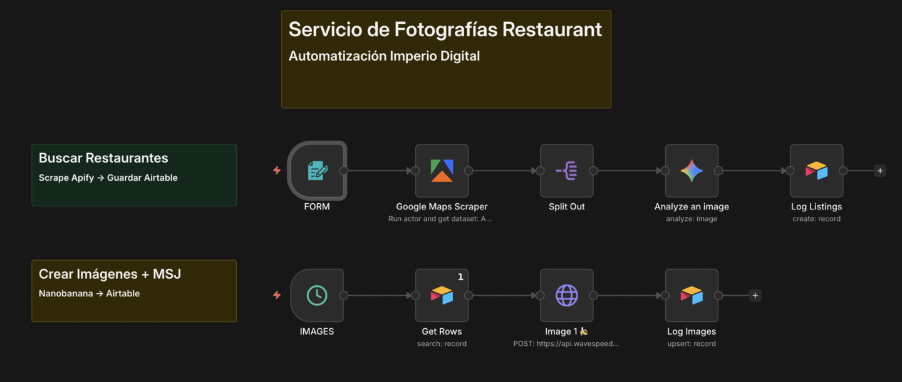
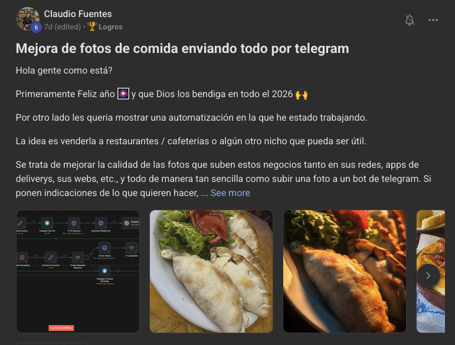

# 📸 Mejora Fotografías Nanobanana Restaurant

> Ruta: Automatizaciones n8n › 📸 Mejora Fotografías Nanobanana Restaurant

**🎬 Vídeo (24.1 min):** https://youtu.be/RqvE8LSNf1w

**📎 Recursos:**
- [Plantilla Airtable](https://airtable.com/invite/l?inviteId=inv3EAF3rGGTGe1Iw&inviteToken=77e19bbabdadaca1d1893f20ac4f557ff5c4f5f2fe9ded040e7cd0800114b168&utm_medium=email&utm_source=product_team&utm_content=transactional-alerts)
- Plantilla Foto Restaurant JSON

---

Tomamos la idea de [Claudio Fuentes](https://www.skool.com/imperio-digital/mejora-de-platos-de-comida-enviando-fotos-por-telegram) y la escalamos: cómo automatizar el "antes y después" para prospectar masivamente restaurantes con valor por adelantado sin perder horas con Nanobanana Pro.

Seamos honestos: nadie se levanta con ganas de recibir otro correo frío vendiendo humo.

El mercado está saturado de ruido y la "puerta fría" tradicional cada vez funciona menos. Si llegas pidiendo, te van a cerrar la puerta. Por eso, hoy la única forma de cortar ese ruido es con **Valor por Adelantado**.

La psicología es simple: **La Ley de la Reciprocidad**. Si yo llego y te regalo algo increíble, útil y personalizado sin pedirte nada a cambio, tú te sientes un poco en "deuda" moral conmigo. O al menos, estás dispuesto a escucharme.

El problema es que hacer esto manual toma horas. Buscar el restaurante, bajar la foto, editarla y redactar el mensaje es un cuello de botella gigante.

### El Upgrade del Sistema

Hace un tiempo, [**Claudio Fuentes**](https://www.skool.com/imperio-digital/mejora-de-platos-de-comida-enviando-fotos-por-telegram) compartió una automatización genial en la comunidad con esta lógica. 

Me pareció brillante, pero como saben que me obsesiona la escalabilidad, decidí hacerle un **upgrade** para convertir esa idea en una línea de producción industrial.

En el video de arriba les muestro cómo construimos sobre esta una "fábrica de fotos" usando n8n + AI que hace lo siguiente:

1. **Caza (**[**Apify**](https://console.apify.com/actors/nwua9Gu5YrADL7ZDj)**):** Scrapea Google Maps buscando restaurantes en la zona y cantidad que tú elijas.
2. **Filtra (Gemini):** Actúa como portero. Revisa foto por foto y descarta lo que no sirve (baños, fachadas, gente, menús borrosos). Solo dejamos pasar la comida.
3. **Produce (**[**Wavespeed**](http://wavespeed.ai/)**):** Aquí está la magia (usando el modelo Nano Banana). Toma una foto amateur oscura y la transforma en una toma de estudio comercial que costaría cientos de dólares.
4. **Entrega (Airtable):** Te deja todo ordenado: el dato del cliente, la foto original y la foto "tuneada".

### Tu Misión

El sistema hace el 90% del trabajo pesado. Tu única misión es entrar, copiar la foto mejorada y mandar un DM buena onda regalándola:

> *"Oye, vi esta foto en su Google Maps y me tomé la libertad de mejorarla con IA. Es de ustedes, úsenla donde quieran."*

Es el servicio perfecto para empezar: sin barreras, con costos ridículamente bajos por token y un entregable que, literalmente, entra por los ojos.

Tienen el paso a paso en el video y las plantillas listas para descargar abajo.

A darle! 🚀

## 🎙️ Transcripción

Mira esto. Entras a Google y te pones a buscar restaurant por restaurant. Vas viendo qué es lo que hay cerca de ti. Buscas restaurantes en Santiago y identificas alguno que tiene una imagen regular. En una foto amateur, ves la imagen, ves que tiene una mala iluminación, un mal ángulo, simplemente no vende y no dan ganas de comer ese churrasco o esa hamburguesa. Le das clic derecho, guardar. ¿Cómo le ruegas a la inteligencia artificial que te arme algo mejor? Empiezas [música] a armar el prom perfecto, lo más detallado posible y te da una maravilla, te da una obra de arte porque tenemos un modelo que se llama nano banana, que es simplemente superior. Boom, tenemos ahí una foto de estudio. Pasamos de esto que estás viendo aquí en pantalla a esta maravillosa fotografía. Luego lo que haces es les mandas un mensaje y le dices, "Oye, me di la libertad de sacar esta foto que vi que tenías en Google y la pasé por inteligencia artificial. Eh, la tune un poco para que se vea más pro. Es completamente de ustedes. Úsenla donde quiera, súbanlo a las redes sociales que quieran. Eh, y si les tinca, les tinca es como la palabra chilena, eh, para decir si les parece, que les haga el resto del menú. Me avisan sin compromisos. Benja, ya. Maravilloso, maravilloso, realmente hermoso. Funcionaría si mandas 10, eh, quizás alguno de ellos podría llegar a tener este servicio y podría llegar a comprártelo porque es simplemente superior. Tenemos el anterior y tenemos el nuevo, que son las cosas que están [música] viendo acá. De hecho, es algo que ya está haciendo gente dentro de la comunidad de Imperio Digital porque funciona. ¿Okay? Pero no todo puede ser tan lindo. Siempre tiene que haber un problema y el problema es que hay un cuello de botella gigante que no es escalable. En descargar la imagen, en buscarlo, en escribirle el mensaje, en redactarle todo. Nos tomó mucho tiempo si es que lo hiciéramos de manera manual. 10 minutos por cada uno de ellos. 20 minutos si es que lo volvemos a hacer y buscamos a otro restaurant y le hacemos lo mismo. Paréntesis, todo estos son casos reales. Todas estas imágenes que vas a ver son casos reales de restaurantes reales aquí en Chile, aquí en Santiago, que decidí hacerles esta mejora. Mira la diferencia antes de la IA de Nano Banana y después. 20 minutos sumamos 30 minutos. Mira la diferencia. Estas son fotos que están publicadas dentro de cada uno de los restaurantes en Google. La de la izquierda es la original, la derecha es cuando ya pasó por IA. 30 minutos, volvemos, mandamos otro. 40 minutos antes y después. 50 minutos. Este lomo saltado que se ve tan rico. Mira cómo se mejora. 60 minutos. Pasamos la hora de este plato que no tengo idea qué es. Y así seguimos sumando y sumando y sumando. Terminamos mandando, no sé, 10 prospectos o 10 mensajes. Quizás uno de ellos termina realmente comprándonos. El problema fue que en hacer los 10 gastamos 100 minutos y estuvimos una hora 40 prospectando, ¿verdad? No es escalable, simplemente no lo es. Pero, ¿qué si pudiéramos clonarnos? que si pudiéramos tener un sistema de inteligencia artificial que haga literalmente todo ese levantamiento pesado por nosotros. Tú lo único que tienes que decir es cuántos restaurantes quieres buscar y a quiénes quieres buscar, en qué área o en qué ciudad o comuna o país, lo que quieras, y el número, gastando únicamente el costo de prospección y de generación de las imágenes. Literalmente es eso. Entras y le dices cuántos quieres extraer, cuántas imágenes quieres extraer y dónde lo estamos buscando. Y eso es el sistema que te voy a presentar hoy día. La parte de arriba que estás viendo acá se dedica exclusivamente a buscar los restaurantes en la zona que tú le indicas. Es decir, te devuelve algo así. restaurant número uno, restaurant número dos, restaurant número tres, el número de contacto y nos extrae la imagen de algún plato. Después pasamos a la segunda automatización que está o la segunda línea de este sistema o de este flujo que es la creación de las imágenes con inteligencia artificial, específicamente con nano bananana. Y si bien antes logramos extraer esta base de datos con las imágenes, el segundo flujo lo que hace es nos crea esta mejora, ¿verdad?, de estas imágenes. Aquí a la izquierda tenemos las imágenes originales, a la derecha tenemos las imágenes enhanced. ¿Con qué? Con un prompt que está ahí que te voy a dar un poco más adelante. Entonces, a la izquierda tenemos las imágenes originales, a la derecha las mejoras. Y el tecnológico que vamos a usar son bastante sencillos, son herramientas que ya hemos usado anteriormente dentro de la comunidad. Apifi scrapear y buscar los restaurantes, específicamente el actor de Google Maps Extractor. Vamos a usar Gemini para usar el criterio de clasificación, si es que la imagen que extraímos es de un plato o no. Y vamos a usar nano bananana para hacer el eh la mejora o el enhancement de este de esta imagen o de este plato que queremos proponer. Y lógicamente vamos a orquestrar todas estos todas estas maravillas y todos estos modelos dentro de N8N. Ya. Apifi escanea nuevamente Google Maps en una zona en específico que nosotros le digamos el número que digamos. Gemini filtra y luego generamos estas hermosas y maravillosas imágenes que te dan ganas de comerte todas estas frituras que estás viendo acá. Ya. Entonces, tenemos el antes y tenemos el después. Después, finalmente, trabajamos todo en nuestra plataforma favorita para almacenar datos de escala mediana a baja, que es air table. Ar table, que nos sirve también mucho, mucho y lo usamos bastante para armar las automatizaciones. Así que ahora sí, vamos a los fierro, vamos a ver cómo funciona este sistema in the Works. Pero antes decirte que si eres parte de Imperio Digital, tengo todas estas automatizaciones publicadas, la plantilla publicada para que llegues y te las descargues. Simplemente te vas acá, le das a descargar la plantilla, importar archivo y le das a abrir y ahí se te va a abrir inmediatamente la plantilla que estás viendo acá. Dos cosas importantes que tienes que saber. Uno, vamos a trabajar en NN. Si nunca has trabajado en N8N es la plataforma que usamos para crear flujos automatizados de trabajo o crear flujos de trabajo, integrar y en nuestro proceso. Y segundo, vamos a usar Air Table, que es esta plataforma que ya vimos previamente que nos ayuda en esta base de datos y crear como esta base de datos madre, por así decirlo. Entonces, aquí podemos ver que tenemos algún ejemplo de, no tengo idea, la imagen inicial que es esta que está acá, imagen número uno. Luego de hacerle y pasarle este prom de acá, terminó dándonos este resultado que estás viendo aquí. Lo mismo para todas estas imágenes que estás viendo acá. Lo he probado bastante bastante y lo he refinado hasta el punto de que quede realmente bueno. Aquí tenemos los cambios, tenemos el antes, tenemos el después y todos estos ejemplos son ejemplos reales que logré hacer ya de refinar, de probar directamente para que logremos armar el pronom perfecto y que funcione. Entonces, ahora sí que sí entramos a N8N y nos vamos a encontrar con algo así. Si es que nunca lo has usado, Apifi, Apify, entras a apify.com y Apify es una maravilla porque nos permite encontrar y trabajar con los actores para scrapear. Escrapear es una palabra fancy que usamos para decir extraer cierta información de ciertos lados. Tenemos todos estos actores que están acá, tenemos el YouTube scraper, Instagram Scraper, tenemos miles de scrapers distintos, pero el que vamos a usar hoy día es el Google Maps Scraper. Y si es que manualmente quisiéramos buscar algo, le pondríamos restaurant en estación central y quiero extraer 50. Si es que le damos a correr al actor que aparece acá, se va a empezar a ejecutar y una vez que se termine de ejecutar nos va a devolver la información de los 50 restaurantes que le pedimos en la ubicación que le pedimos. Entonces, las variables que rellenamos son tres: el número de lugares que queremos extraer, el lugar donde queremos hacerlo y la categoría que queremos. Y todas esas variables ya están integradas dentro de el flujo, dentro del Apify Scraper, que es el nodo de la comunidad de N8N que nos permite hacer todo esto. Así que ahora si es que le doy a ejecutar el workflow y le digo, estamos extrayendo 10 restaurantes, quiero extraer tres imágenes por restaurant y quiero buscarlos en alguna comuna como Huechuraba, que vendría siendo una comuna de Santiago o un distrito en otros países, como también le podrían llamar. Vamos a ver que se mandó el formulario. Está haciendo el llamado ahora a buscar estos restaurantes en Huechuraba. El appraper de acá está yendo, está buscando por acá. Por fin es práctico. Voy a volver a eliminar todo esto para que veas cómo sería hacerlo desde cero. Simplemente voy a ir acá, voy a eliminar, doble clic, eliminar, eliminar todo. Y una vez que los encuentre va a separarlo y luego va a empezar a analizar cada una de las imágenes que logró extraer. Aquí si nos vamos a Apify podemos ver un poco los costos. Aquí tuvimos una extracción de 50 que nos cobró 20 centavos. Aquí tuvimos otra de 50 que nos cobró 50 centavos. Aquí tuvimos otra de 10 que nos cobró 18. Y esto depende de la complejidad que tenga de buscar porque si tiene que buscar en 100 páginas para encontrar cinco resultados, no es lo mismo que buscar en 100 páginas para o en esos mismos cinco resultados encontrarlos en 10 páginas. [música] Ya, por eso a veces cobra un poco más que lo otro. Después, este es un paso completamente opcional, pero estamos analizando cada una de las imágenes con Gemini, porque yo igual valoro mi tiempo y prefiero que me la pasen precalificados de si es que son imágenes de platos de comida o no. De hecho, si es que entramos acá, vamos a darnos cuenta que tenemos el prom, que es estoy armando un servicio de enhancement de fotos de restaurantes, bla bla bla bla bla bla. Tu única misión es clasificar. Si es que esto es comida o un tipo de plato de comida, devuelve crear. Y si es que no es comida o son muchos platos o son muchas otras cosas, devuelve skip. No me des nada más. ¿Por qué? Porque si te das cuenta, va a extraer bastantes fotos, pero dentro de Google también ellos tienen o existen publicadas fotos del restaurant, de la decoración, de muchas cosas y simplemente no nos sirven. nos sirve trabajar con las fotos de la comida. Entonces, aquí le decimos, clasifícame si es que es comida o no. Si es que es comida, devuélveme acá el estatus de crear y si es que no es comida, devuélveme el estatus de skip. Nota esto también usa tokens. Tenemos que conectarnos a la AP de Gemini. Si es que no quieres hacerlo y quieres ahorrar aún más, lo que puedes hacer es saltarte este nodo directamente de acá y conectarlo hacia acá. De esta manera te da todas las imágenes y tú manualmente llegas y después empiezas a clasificar. Depende completamente de ti, depende qué tan apretado estés de tu bolsillo, qué tanto valor es tu tiempo. Yo siempre voy a preferir gastar más para poder ahorrar más tiempo. Ahora podemos ver que acaba de terminar de clasificar las imágenes de si es que son fotos de restaurantes o no y se están empezando a agregar acá. ¿Cómo podemos ver? Nos empezó a generar estas imágenes, es decir, a clasificar estas imágenes. Y le voy a mandar un skimming de manera rápida. Por ejemplo, vamos a ver. Esta es una foto del local, no me interesa, pero esta no la clasificó bien por así que aquí le voy a poner manualmente el crear. Y bien, entonces tenemos bastante potencial, sobre todo con este restaurant de acá es lo que estoy viendo, que estas imágenes, el plato se ve delicioso, pero están realmente malas. Lo mismo con esta mechada pudo. O sea, yo me comería esto feliz, pero [música] nuevamente no se ve para nada apetitoso. Aquí tenemos otra. Este restaurant, mi tierra huechuraba también creo que la podemos mejorar bastante. E incluso las delicias de Carlita con esta imagen también acá. Y ahora sí, ya tenemos a nuestros candidatos que son los de acá. Nota usé un número bajo por fines prácticos del video, pero este número podría haber sido 100 y podría haber sido un criterio de clasificación mucho más amplio, como no tengo idea, eh, Santiago, ¿verdad? Usar una ciudad entera, usar un país entero también podría funcionar. En fin, una vez que le demos esto y que ya esté listo, vamos a pasar ahora sí al segundo paso o al segundo paso de este sistema que es el crear las imágenes. Mira, tenemos este input que es la imagen acá, la primera imagen que queremos trabajar y es el la imagen que quiero mejorar, ¿recuerdas? es el antes, es decir, esta es la imagen anterior. Nosotros queremos llegar al que tenemos acá es vamos a extraer la info una vez que ejecutamos y vamos a extraer única y exclusivamente los que están con create. ¿Por qué no los con skip? Porque simplemente no nos sirven y no queremos gastar créditos de más extrayéndolos. Okay, entonces vamos a extraer todos los que están en estado create y vamos a mandar a hacer las imágenes con nano banana. Ahora sí que sí vamos a estar usando un intermediario con nano bananana que se llama wav speed. Wavespe lo hemos usado en videos anteriores, específicamente en el de ads cinematográficos, que hicimos un concurso de hecho dentro de Imperio que ya la gente está mandando sus concursos donde estamos regalando créditos para el ganador, $100 en créditos para BO3, para Nano Banana, etcétera, pero lo usamos en esta automatización de acá que está bastante bastante entretenida y estuvimos usando Waves Speed. Bfit, vamos a estar haciendo el llamado a nano banan de los modelos que se nos ofrece aquí dentro de esta plataforma. Tenemos literalmente casi todos los modelos que queremos usar, que es lo que me gusta de Wave Speed, que a diferencia de otros como Replicate o a veces Ki, que tienes que esperar a que se termine de ejecutar o de crear la imagen para después poder recuperarla y hacer el get. Aquí en Waves speed se espera de una. Entonces, mandas un llamado y una vez que esté listo, recién termina. Entonces, eso es realmente interesante porque no tienes que agregar un nodo de espera entre los dos. Nos iremos aquí, nos iremos a la API Keys, vamos a crear una nueva API y la vamos a incluir dentro de la plantilla. Estando acá, si te fijas, vamos a hacer el llamado de mandemos a hacer una imagen en formato PNG con este prompt acá, que es el prompt que está mapeado al anterior, que es el prompt que le pusimos acá. Transforma esta foto en una foto profesional, bla, bla, bla, bla, bla, bla, bla, bla, bla, y usa esta imagen de referencia. ¿Qué imagen? Bueno, la imagen previa que teníamos o que nos acaba de dar. Genial. Una vez que termine de ejecutarse las imágenes, vamos a registrar las imágenes y las vamos a volver a guardar. También le dije y agregué los mensajes en un costado para que sea aún más fácil la prospección, que es el mensaje que vimos antes. Oye, vitrineando en su menú de Google, me tomé la libertad de tunearles esta foto para que se vea más pro. Manda la foto. El 100% de ustedes. Cuéntame ya. bla bla bla bla y entonces un mensaje liviano, rápido, algo que sea como ah esta persona eh realmente se tomó el tiempo. Así que bueno, muchas gracias. Estamos en un momento donde tenemos que dar valor antes de vender el servicio para que se sientan en una especie de deuda, sobre todo con la cantidad de ruido que hay hoy en [música] día. Pero creo que también todo eso es un poco tema para otro video que es ya más relacionado a la venta, eh, que me de hecho si es que les interesa que haga un video sobre eso, me encanta, me encanta y podría hacer un video dedicado de eso para vender esta automatización y ponerla en práctica y cómo sería todo el proceso para venderla también. Muy interesante. De hecho, tengo un video así que son de 3 horas vendiendo un servicio de día. Lo pueden encontrar publicado en mi canal de YouTube, pero en fin, ahora sí volvamos acá y le vamos a dar a ejecutar. ¿Qué es lo que estamos ejecutando? Bueno, estamos extrayendo la información previa, es decir, toda esta información de todos los que están en create, que serían estos 10 de acá, y estamos mandando hacer las imágenes con nano banana. ¿Qué imágenes estamos haciendo? Bueno, las que vimos antes. Vamos a ver cómo está el estado de creación de estas imágenes. Aquí podemos ver que está todavía no se completan, sino que están todavía creándose acá. Y una vez que se completen debería registrarlo acá. Ahora sí podemos ver que ya acaba de terminar de ejecutarse. Nuevamente podemos actualizar acá solo para verificar y mostrarte que también se terminó y se ejecutó. Aquí están listas las imágenes. Y si es que volvemos acá, vamos a ver que se acaba de reemplazar todo esto. Veamos el antes y el después. Mira, tenemos esta imagen antes y pasó a esta imagen que estás viendo ahora en pantalla. Nuevamente pasamos de esto a, es decir, de esto a esto. Lo mismo con la otra. Aquí están los huevos con las papas. Y nuevamente pasando algo mucho, mucho mejor, de una calidad superior. Lo mismo acá tenemos una mechada que probablemente está muy rica, pero como tiene luz blanca, no es cálida, no se ve tostado, no se ve, no se ve sobrio, se ve, ¿cómo se llama? Cuando un jugo en polvo tiene o cuando un jugo, mejor dicho, te queda muy aguado porque le echaste muy poco jugo en polvo, desabrido. Esa es la palabra, es desabrido. En cambio, si lamos el después, esto tiene mucho más color, tiene más más vida, no sé, no sé. Y creo que le podría interesar mucho a la gente. Bueno, aquí tenemos todos los resultados. Lo puedes probar por tu cuenta. Esto está realmente genial, genial. Y bueno, una cosa de por qué también es interesante hacerlo así y no del otro modo, porque si es que quisiéramos generar esta imagen en Gemini, no saldría la famosa marca de agua que aparece acá. Entonces, cuando lo hacemos con el sistema, esta marca de agua simplemente no aparece. Bueno, hoy se registra para cada uno de los casos que vimos aquí. Mira, este este zapayo relleno con queso que se ve genial, genial. O sea, este, seamos sinceros, yo también me comería este. Me comería este. Pero si queremos algo de [música] calidad así ya más profesional, esto está a otro nivel. Otro nivel. Bueno, ¿cuál sería el siguiente paso? Iría acá, por ejemplo, donde las delicias de Carlita, ¿o no? ¿Dónde está el otro que me gustó? Este de acá. Ese bichito que estamos viendo acá se ve genial. Genial, ¿verdad? Este también me lo comería. Sí. Con la canchita. Con la canchita. Yo también. Mi familia es de Perú. No soy de Chile, pero mi familia es de Perú. Entonces, soy fanático, fanático del ceviche peruano. Y tenemos dos métodos de prospección. El primero sería simplemente entrar acá, abrir su Instagram, decirle como mensaje, pegarle el mensaje, luego copiar la imagen, pegarles la imagen y luego enviarle el otro. Ahí sí. O la otra opción sería volver acá en el mismo caso y por ejemplo volver a la mechada, copiar, entrar a WhatsApp, pegar el chat, ponerle chatear y mandarle el mismo mensaje. Literalmente mandarlo así. Pasamos de esos 10 minutos a un minuto por cada uno de los casos. Es realmente genial, genial, genial. Y mira, recordemos que este es el desde, o sea, aquí las opciones son realmente gigantes, pero nosotros nos guiamos por la ley de Gal. Todo sistema complejo es la evolución de un sistema simple que funciona. Si quisiese avanzar más en este [música] sistema, probablemente generaría una tercera acá que sea extraer información, enviar un correo, send message a quién. Bueno, veamos si podemos extraer aquí de Apify y les mandaría de una o la otra sería, no sé, tenemos un curso, por ejemplo, de agentes de WhatsApp y podría hasta usar un agente de WhatsApp en esto metido o automatizar los DMs que se le van a mandar a la persona. O sea, las opciones son realmente muchas. Y aquí quiero tomarme un pequeño momento también porque no necesitas ser una agencia ya establecida, ya lista para llegar y empezar a prospectar y empezar a mandar mensajes. No, no. Lo mismo este mensaje que redactamos tiene que ser natural de una persona. Oye, me di la libertad de mejorarte esta foto, la bla. Porque esa es una gran creencia que veo eh en las personas, sobre todo después de hablar con tantas personas que están lanzando sus agencias dentro de Imperio Digital o que están vendiendo o que o que o que se quedan trabadas en la teoría porque sienten que necesitan la mejor página. No, no, no. Todos los sistemas funcionan igual. Necesitamos un sistema de marketing o de outreach en específico para hablarle a alguien. Después tenemos la llamada de ventas o tenemos el proceso de ventas, tenemos [música] el cierre, después tenemos el onboarding o la capacitación, digamos, la entrega del servicio y finalmente el post o la postventa o el postservicio que se le va a entregar. Y todos los negocios funcionan igual, sobre todo si es que son en el área de servicios y todos creen que para poder hacer la prospección necesitas tener una agencia, una página y no es así. Y no es así. es mucho más simple de lo que realmente parece, no fácil, simple, ya que son cosas muy distintas, pero te aseguro que si pruebas este método, te lo puedo firmar, que si pruebas este método y sigues prospectando y juegas al al juego de los números, es imposible que no cierres una venta, ya porque tenemos gente dentro de Imperio que lo ha hecho. Así que si es que te interesa que haga un video de todo el proceso de la venta de esta automatización, házmelo saber aquí en los comentarios de YouTube porque porque podría ser interesante, podría ser interesante como el proceso realéndolo y cómo lo haría si es que fuese así, cómo haría realmente todo este sistema de prospección y toda esta venta hasta cerrarlo cómo ejecutaría y cómo vería el el los acuerdos eh cuándo lo cerramos, ¿Cómo seguiríamos la conversación? Si es que te interesaría ver eso, házmelo saber para poder entender un poco mejor. Eh, y sin más que decir, bueno, las publicaciones o las automatizaciones están publicadas aquí dentro de Imperio Digital. Eh, si es que entras acá en el Classroom, automatizaciones N8N, vas a ver acá que están los servicios de fotografía listos para que te descargues tanto la plantilla de Air Table como la automatización en sí lista para llegar y descargar. Y si te gustó este video y este sistema, también tengo otra automatización bien parecida que usa un sistema bien parecido que es la de los ads cinemáticos que le fue bastante bien. ¿Qué es esta de acá? una automatización realmente genial. Y ahora sí, sin más que decir, espero que este video te haya servido y ya nos vemos.
