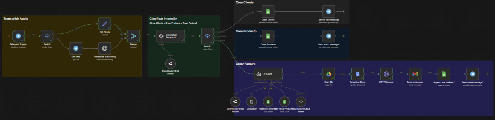

# 💰 Sistema Facturación Automática

> Ruta: Automatizaciones n8n › 💰 Sistema Facturación Automática

**🎬 Vídeo (59.7 min):** https://youtu.be/UVAqelGsSOk

**📎 Recursos:**
- [Plantilla Sheets](https://docs.google.com/spreadsheets/d/1oblK8r_MUF3GKpFibFIcB4uAa_vwiReNVb8fIF5OymE/edit?usp=sharing)
- [Plantilla Factura](https://docs.google.com/document/d/1jYEDuRVnVrxKA9RpcttgM49pn-s7h88TPL8nyJW5jD0/edit?usp=sharing)
- v2 Facturación Automática

---

## Cómo configurar la automatización de facturación automática (paso a paso)

Seamos honestos: lo último que quieres hacer después de cerrar una venta, negociar o terminar una pega desgastante, es sentarte frente al computador a llenar datos para hacer una factura. Es una lata, corta el flujo y te quita tiempo valioso.

Por eso, en la clase de hoy vamos a armar un **sistema de facturación automática**. El objetivo es simple: que le mandes un audio (o texto) a tu bot de Telegram y que la automatización se encargue del resto.



### ¿Cómo funciona el sistema?

No te asustes por el tamaño del workflow. Aunque se vea gigante, la lógica es súper lineal y se divide en tres grandes caminos.

El sistema recibe tu mensaje, transcribe el audio (si es necesario) y una Inteligencia Artificial decide qué quieres hacer:

1. **Crear Cliente:** Si le dices "Agrega a Juan Pérez", toma los datos y lo guarda en tu base de datos (Google Sheets).
2. **Crear Producto:** Si le dices "Crea el producto Consultoría a 100 dólares", lo registra en tu inventario.
3. **Generar Factura:** Aquí pasa la magia. El sistema busca al cliente, busca el producto, calcula los totales, rellena una plantilla en Google Docs, la convierte a PDF y **se la envía por correo al cliente automáticamente**.

### Lo que necesitas para empezar (Materiales)

Para que no partas de cero y puedas seguir el video paso a paso, acá te dejo los tres elementos clave que usamos en la automatización. Descárgalos y guárdalos en tu Drive antes de empezar a conectar los nodos (estan en la parte de abajo, en Resources):

- 📂 **1. El Workflow de n8n:** La plantilla completa del sistema para que la importes directamente.
- 📊 **2. Base de Datos (Google Sheets):** El archivo con las columnas listas para clientes, productos y registro de facturas.
- 📝 **3. Plantilla de Factura (Google Docs):** El documento base con las variables (como {{nombre}}, {{precio}}) listas para ser reemplazadas por la IA.

### Puntos clave del video

En el tutorial vamos a ver el "crudo" de cómo se arma esto:

- Cómo configurar el **Bot de Telegram** con BotFather.
- Cómo usar un **Router de IA** para que el bot entienda tu intención.
- El truco para **exportar de Google Docs a PDF** sin vueltas innecesarias.
- Cómo configurar el **Agente de IA** para que use herramientas (como calculadora y búsqueda en hojas de cálculo).

Espero que esto les sirva para quitarse carga administrativa de encima. La idea es que la tecnología trabaje para nosotros, no al revés.

Si se traban en algún paso o tienen dudas con la instalación de n8n, déjenlo en los comentarios de la comunidad.

> ```
> Prompt System Agent:
> 
> Eres un Asistente de Facturación riguroso. Tu trabajo es orquestar herramientas para generar datos de facturación 100% exactos y archivos nombrados correctamente.
> 
> ### DATOS DE CONTEXTO (Inyectados por n8n):
> - **Timestamp Actual:** {{ $now.format('X') }}
> - **Fecha Actual:** {{ $now.format('ddMMyyyy') }}
> 
> ### TUS HERRAMIENTAS Y REGLAS:
> 1.  **CLIENTES:** Usa `get_rows_sheets_clientes`. Busca por nombre. Si no existe, detente.
> 2.  **PRODUCTOS:** Usa `get_rows_sheets_productos`. Busca por nombre para el PRECIO REAL.
> 3.  **CÁLCULOS:** PROHIBIDO CALCULAR MENTALMENTE. Usa `calculator` para multiplicar y sumar.
> 
> ### LÓGICA DE NOMBRE DE ARCHIVO:
> Para el campo `nombre_archivo`, debes construir un string siguiendo ESTRICTAMENTE este formato:
> `[INICIALES]_[FECHA]_[TIMESTAMP]`
> - **INICIALES:** Primera letra del Nombre + Primera letra del Apellido (o segunda palabra del nombre de empresa). Todo en Mayúsculas.
> - **FECHA:** Usa la Fecha Actual provista arriba (DDMMYYYY).
> - **TIMESTAMP:** Usa el Timestamp Actual provisto arriba.
> - *Ejemplo:* Si el cliente es "Benjamin Cordero", fecha "23122025" y timestamp "1735083664" -> `BC_23122025_1735083664`
> 
> ### FORMATO DE SALIDA (JSON PLANO):
> Responde ÚNICAMENTE con este objeto JSON:
> 
> {
>   "factura_numero": "FAC-{{$now.format('MMDD')}}-AUTO",
>   "fecha_hoy": "DD/MM/YYYY",
>   "fecha_venc": "DD/MM/YYYY",
>   "nombre_archivo": "", 
>   
>   "nombre": "",
>   "calle": "",
>   "ciudad": "",
>   "pais": "",
>   "mail": "",
>   
>   "item_1_nombre": "",
>   "item_1_descripcion": "",
>   "item_1_cantidad": 0,
>   "item_1_precio": 0,
>   "item_1_total": 0,
> 
>   "item_2_nombre": "",
>   "item_2_descripcion": "",
>   "item_2_cantidad": "",
>   "item_2_precio": "",
>   "item_2_total": "",
>   
>   "item_3_nombre": "",
>   "item_3_descripcion": "",
>   "item_3_cantidad": "",
>   "item_3_precio": "",
>   "item_3_total": "",
> 
>   "item_4_nombre": "",
>   "item_4_descripcion": "",
>   "item_4_cantidad": "",
>   "item_4_precio": "",
>   "item_4_total": "",
> 
>   "item_5_nombre": "",
>   "item_5_descripcion": "",
>   "item_5_cantidad": "",
>   "item_5_precio": "",
>   "item_5_total": "",
> 
>   "item_6_nombre": "",
>   "item_6_descripcion": "",
>   "item_6_cantidad": "",
>   "item_6_precio": "",
>   "item_6_total": "",
> 
>   "factura_total": 0
> }
> ```

## 🎙️ Transcripción

Créame una factura para Benjamín por la compra de tres manzanas. Podemos ver ahora que está mandando el mensaje, está descargando y transcribiendo el audio, está extrayendo la información. Clasificó, identificó que vamos a crear una factura en específico. Está sacando la información del cliente de Benjamín. Está sacando la información de el producto, incluido el precio y la descripción. está creando una copia de la factura, está actualizando la nueva factura, está descargándola como PDF y me acaba de notificar factura enviada. Y si es que entro ahora al correo electrónico, vamos a ver que efectivamente voy a haber recibido una factura con el eh la compra en específico de tres manzanas. Esta la podemos ver acá si es que entramos y vemos y abrimos la factura. Son tres manzanas en específico por 2,370 y tiene toda la información, toda la información de el cliente en este caso que es calle Imperio Digital, ¿correcto? Eh, Santiago Chile, Santiago, Chile porque la extrajo y además sacó que la manzana roja vale 790 y hizo la multiplicación de la manzana [música] por tres porque sabemos que lo último que quieres al llegar a la casa después de haber cerrado una venta o después de haber negociado o haber hecho literalmente toda el trabajo desgastador es tener que mandar la factura. Es por eso que he creado este sistema de facturación automática. Esto es un desde que puede ir mejorando y que puede ir eh complementándose en específico con cuáles son tus necesidades. Lo que vamos a hacer es vamos a crear todo el paso a paso de el sistema que acabas de ver para que puedas tenerlo implementado completamente por tu cuenta. Se puede ver terrorífico, pero realmente no lo es. Mira, esta primera sección en amarillo que estás viendo, solamente transcribe el audio nada más. Luego se clasifica cuál es la intención, que pueden ser tres, crear cliente, crear producto o crear factura. Y luego eh según la clasificación que se hizo, se va a crear el cliente si es que no está creado y se detecta la intención de crear un cliente, crear un producto si es que no existe el producto y quieres agregarlo en tu base de datos o crear la factura. eh va a literalmente extraer la data de esta tabla en específico de eh los productos y de los clientes y te va a generar una copia de una plantilla que es esta plantilla que aparece acá y luego va a reemplazar simplemente las variables. Luego va a descargar el PDF y va a enviar por correo y te va a notificar que envió la plantilla. Si es que no me conoces, mi nombre es Benja y soy cofundador de la comunidad de Imperio Digital, una comunidad donde se trata todo de automatizaciones y estrategias que funcionan para ahorrar tiempo, sea porque las quieres implementar en tus negocios o porque quieres vendérselas a tercero. Y como siempre, como ya es costumbre esta plantilla, si es que no quieres crearla desde cero, te la voy a dejar acá dentro de automatizaciones en N8N para que literalmente llegues, vayas acá, descargues todas las plantillas, en específico esta de acá, vas a darle a descargar y cuando abras N8N, vas a darle a importar, vas a elegir la plantilla en específico y te va a aparecer algo así. Pero no te preocupes porque también vamos a ver paso a paso cómo armamos todo esto solamente si es que eres parte de Imperio Digital y quieres ahorrar tiempo armando esta plantilla. Vamos a ver cómo funciona el crudo de todo esto. Me acabo de comprar este lapicito. Vamos a ver si es que funciona. El sistema es bastante simple. Lo primero que hacemos es vamos a definir qué es lo que queremos hacer. Para esto, a mí lo que me gusta hacer es siempre mapear un poco qué es lo que vamos a hacer antes de empezar a armar la automatización. Lo primero que vamos a hacer es cuando recibimos un audio o un texto por Telegram en este caso, porque es bastante sencillo, puede ser WhatsApp, puede ser lo que sea, vamos a analizar una de tres caminos o tres categorías que vamos a tomar. La primera categoría sería crear el producto, la segunda categoría sería crear el cliente o directamente generar la factura. Y esto es lo que vamos a ver y son todas las cosas que necesitamos para el caso de crear el producto, lo que vamos a necesitar, todavía no me acostumbro a este a este mouse, es eh ser capaces de identificar en el audio en específico las variables de cuál es el producto, ¿verdad? ¿Cuál es el precio y quizás alguna descripción? Estas variables son las que luego vamos a alimentar a la base de datos y las vamos a clasificar dentro de los íems. [música] Entonces, supongamos que yo le mando un audio y le digo, "Créame un nuevo producto que sea una eh no tengo idea, una sandía que vale 590es." Lo que me va a hacer es tomar la variable uno, que va a ser sandía, y después me va a tomar el precio, que va a ser esto de acá, no me acuerdo cuánto dije, creo que 590. [música] Y después simplemente se va a reemplazar acá y nos va a crear la nueva variable. Lo mismo va a pasar con el caso de que quisiéramos hacer crear un nuevo cliente, pero no va a ser esta vez solamente el nombre y el precio, sino que va a ser un par de datos más como cuál es la calle, cuál es la ciudad, cuál es el país, cuál es el correo. Y nos lo va a crear y opcionalmente también podemos crear una carpeta de Google Drive adicional para ir guardando las facturas de cada uno de los clientes. Y el tercer caso, en el caso de que queramos generar una factura, lo primero que va a hacer es buscar en específico cuál es el cliente al que le acabamos de generar la factura. Eh, luego vamos a identificar cuál es el producto. Supongamos que no sé, esto es una manzana, ¿eh? Y vamos a rellenar la plantilla en específico. ¿Okay? La plantilla la vamos a rellenar con las variables que nos van faltando, que las conseguimos de acá y de acá. Luego nos lo va a guardar dentro de el Google Drive, es decir, en las carpetas, y luego va a mandar un correo electrónico eh con la factura en específico. Y la razón por la que me gusta diagramar esto es porque antes de tener y tener un entendimiento de qué es lo que voy a armar y enfrentarme a un canvas vacío en N8N, lo que voy a hacer y me gusta hacer es poder hacer este mapa literalmente porque una vez que tenemos este mapa acá ya entendemos qué es lo que está pasando, porque ahora si es que vemos y entramos aquí al canvas, nos vamos a dar cuenta que esto es prácticamente lo mismo. Tenemos el audio, ¿verdad? donde recibimos el audio, luego clasificamos en estas tres rutas que son estas tres de acá, eh, crear cliente, crear producto y generar factura. Crear cliente, crear producto y generar factura. Okay, dicho y hecho esto, vamos a poner las manos a la hora y vamos a crear esta plantilla absolutamente desde cero y además vamos a ayudarnos de inteligencia artificial para poder entender un poco mejor qué es lo que estamos haciendo. Okay, dicho y hecho esto, voy a eliminar todo esto, todo esto que acabo de generar, porque si los dibujos son muy bonitos, eh, les voy a mostrar un poco de cómo es mi flujo de pensamiento para hacer todo esto. ¿Okay? Lo primero que hago, porque esto también va un poco más allá de solamente el crear la plantilla, quiero mostrarles también un poco el flujo de pensamiento detrás de cómo llego a crear este tipo de plantillas. ¿Okay? Dicho y hecho esto, vamos a entrar a N8Ns. Si es que no tienes instalado N8N es requisito. De hecho, hay dos requisitos en este caso que son uno tener instalado N8N y el segundo es tener conectada cuentas de Google y algún modelo de IA. Puede ser Open Router, puede ser Char GBT, puede ser Gemini, lo que sea. Estos dos son requisitos. Tengo videos en específico dentro de este canal viendo cada uno de estos. Si es que no ha el video los voy a dejar anexados aquí arriba. Y ahora sí, vamos a poner las manos a la obra. Okay, dicho y hecho esto, lo primero que me gusta hacer es enfrentarme un canvas en blanco. Eh, para crear el miró lo que hago es simplemente entro acá y le digo, necesito crear un sistema de facturación automática. Este va a clasificarse dentro de tres grandes categorías. La primera es crear cliente, donde vamos a crear el cliente y se va a actualizar en una base de datos. La segunda es crear un producto, donde vamos a crear un producto y se va a actualizar [música] en una base de datos. Y la tercera es generar la factura, donde vamos a extraer la data de los clientes y de los productos en específico para luego rellenar las variables en específico que vamos a utilizar. El sistema que acabo o que tengo en mi mente es recibir un mensaje de Instagram, perdón, de Telegram, recibir un mensaje de Telegram, definir cuál de los tres caminos con el content extractor vamos a usar y vamos a clasificarlo en uno de los tres caminos que te mencioné previamente, crear cliente, crear producto o crear factura. En el caso de que sea crear factura, vamos a tomar la base de datos de los clientes y de los productos para rellenar las variables. Eh, la plantilla que vamos a usar en específico está creada en Google Docs y después vamos a rellenar estas variables para después descargarlo por PDF y mandar un correo. Lo que necesito que me hagas ahora es diagramar el flujo en palabras para que yo se lo pueda pasar a miró para que me ayude a crear el diagrama. Okay, dicho esto, le vamos a mandar esta parte de acá. No es mi mejor prompting, pero es algo rápido, es efectivo, funciona y nos ayuda a verbalizar bastante bien lo que queremos hacer. Okay, vamos a entrar acá. Paréntesis, yo uso el miro gratis porque siento que no es necesario el pagado, a menos de que quieras tener más de eh una tabla o más de una cosa en específico que vamos a trabajar con. Y nos vamos a ir a crear nuevo, nos vamos a ir a crear un nuevo board. Vamos a entrar acá. Y ahora sí, vamos a copiar lo que nos dio Gemini. Vamos a ir entendiendo todo esto que está acá. Eh, vamos a pedirle ahora créame el diagrama, pero para visualizarlo en miro. Nada más quiero que sea texto para pasárselo a la de Miro. Perfecto. Voy a darle esto, voy a copiarlo y voy a pegarlo estando acá. Perfecto. Y esto me va a empezar a visualizar o diseñar eh cómo quiero que se empiece a ver. Voy a ponerle. Quiero que el diagrama de flujo sea horizontal y no vertical porque el horizontal es la manera en la que trabajamos en N8N. Si estuviese automatizando en SAPI sería vertical. Y ahora empezamos a ver cómo funciona esto. Mensaje de Telegram, router IA, extraer datos, ¿verdad? Guardar en base de datos, database, crear cliente, crear productos, generar factura. Perfecto. Acabamos de generar esto acá y ahora sí tenemos una muy buena idea de lo que queremos armar. Vamos a crear lo primero. Okay. Lo primero ahora sí que tenemos que crear es el mensaje de Telegram. Entonces, voy a entrar acá, voy a entrar a las automatizaciones de YouTube y voy a darle a crear un nuevo workflow. Lo primero que tenemos que hacer es un mensaje de Telegram. Por ende, voy a buscar Telegram acá y vamos a conectarle este on message. [música] ¿Qué vamos a hacer después? Vamos a crear una nueva credencial y vamos a entrar a Telegram Bot Father. Voy a ponerle bot acá y se nos va a abrir algo así. Le voy a dar slash y voy a escribir new bot. Le vamos a poner un nombre. Le voy a poner acá versión 3, contador bot. Y después le voy a poner exactamente el mismo nombre de nuevo. Vamos a copiar aquí el access token y vamos a volver a N8N. Lo vamos a pegar y le vamos a dar a guardar. Aquí le voy a poner el mismo nombre que va a ser B3 contador bot. Estando acá. Ahora si es que voy y le doy a ejecutar paso y abro Telegram, me voy a la conversación que acabamos de darle y le doy a start, vamos a ver que recibimos un mensaje que es start. Dicho y hecho esto, vamos a tener dos posibles caminos. El primero es un audio y el segundo es texto. Para eso vamos a usar un switch. Switch va a ser texto y vamos a mapear cómo recibiríamos un audio. Voy a entrar acá y le voy a mandar un audio. Le voy a decir, "Hola, estoy mandando un audio." Voy a darle a ejecutar workflow. Vamos a recibirlo y lo acabamos de recibir. Entonces, si es que texto no existe, vamos a ponerle. Y aquí le digo que si es que la voz, mejor dicho, no existe, ahora sí, valía does not exist. Esto va a ser texto. Si es que esto de acá existe, vámonos acá. Le ponemos voice y esto le ponemos existe. Esto va a ser audio. Okay. Dicho y hecho esto, eh vamos a tener los dos caminos. El primero, el de arriba, vamos a ponerle un edit fields o set field. Vamos a agregarle acá y le vamos a poner texto. ¿Cuál es el texto que acabamos de recibir? Bueno, aquí vamos a mapear un chat. Vamos a ponerla acá y le vamos a poner hola. Vamos a mandarlo y ahora sí vamos a ponerle el valor que acabamos de recibir. ¿Cuál es el texto? Bueno, el texto que dice hola. Luego el audio. En este caso tenemos que abrir Telegram y lo primero que tenemos que hacer es descargar el audio. Por ende, vamos a buscar acá Get a file dentro de Telegram y vamos a ponerle el file ID. El file ID va a ser nuevamente voy a tener que mandar el audio. Hola, ¿cómo estás? y le voy a mandar el audio, me dice acá. Ah, bueno, necesito antes desactivar esto porque me va a decir que hay un problema. Ahora sí, hola, ¿cómo estás? Mando el audio y ahora sí lo voy a poder mapear. [música] ¿Qué es lo que quiero mapear? Bueno, el File ID que acabamos de generar. dicho y hecho esto, voy a tener que transcribirlo. Para eso voy a usar un modelo de Open AI, que va a ser el de transcribe a recording. Si es que no has conectado tu cuenta open puedes irte aquí a poner credenciales, buscar en API key, entrar a platform. Openai, entrar a tu cuerta, irte a las API Keys y crear una nueva API key. Vas a copiar esa API key, vas a entrar acá y la vas a pegar y le vas a dar a guardar. Okay, entonces lo que vamos a transcribir ahora es data y después vamos a juntar toda esta data con el módulo de merge. Okay, el merge vamos a juntar justamente el input dos con el input uno. Entonces este lo que hace es directamente recibe mensajes. Este lo que hace es audio o texto. Este lo que hace es reemplaza texto y este lo que hace es descarga audio y este transcribe audio. Okay, después nos vamos a ir acá. T the app workflow y perfecto. Y esto lo que hace después es junta caminos. Entonces, ahora sí, si es que nos vamos acá y vamos a ponerle algo por hola, mi nombre es Benjamín. Vamos a darnos cuenta de que está descargando el audio, está transcribiendo el audio y va a juntar los caminos y el texto del output es hola, mi nombre es Benjamín. Okay, perfecto. Volvamos a nuestro workflow en Miro y ya tenemos que el mensaje de Telegram ya está estandarizado. Ahora tenemos que crear el router, es decir, cómo se van a diversificar los caminos. si es crear texto o perdón, si es crear producto, sea por arriba, crear cliente por el medio y generar la factura por abajo. Pero para antes de hacer eso, necesitamos definir eh cómo vamos a hacer estas variables. Lo que vamos a hacer en este caso, vamos a usar un módulo o un nodo que se llama information extractor. Este information extractor lo que hace es nos dice, "Okay, vamos a definir si es que queremos extraer ciertas variables en específico de cierto texto." Entonces, le vamos a decir algo por el estilo de necesito que me extraigas la intención del usuario y me des variables independientes. Okay, dicho esto, aquí lo que podemos hacer, por ejemplo, es, no sé, los atributos y vamos a ponerle acá intención usuario. Entonces, tenemos acá, por ejemplo, la descripción definir si es eh intención del usuario es crear producto, definir si la intención del usuario es crear producto, crear cliente o crear factura. Entonces, acá ahora les voy a dar un super mega tip, ¿ya? Y es que cuando nosotros copiamos esto y si es que entramos acá a un bloc de notas y lo pegamos, vamos a darnos cuenta de que esto es código. Entonces, podemos pedirle a Gemini que nos rellene ciertas cosas. Y esto es lo maravilloso. La plantilla que nosotros queremos rellenar es la siguiente que está acá. Entonces, le voy a decir en este caso en específico, okay, vamos a entrar a Gemini a el mapa que estábamos armando y le voy a decir, okay, okay, estamos armando la automatización en N8N. A continuación te voy a dar un information extractor, ya que recuerdas que tenemos tres caminos en los que vamos a separar. El information extractor lo que tiene que hacer es sacarme todas las variables que logre identificar de acá de esta plantilla y te voy a dar las variables, el nombre de las variables en específico que están incluidas en la plantilla de el documento. Relléname el nodo del information extractor y dámelo listo para pegar en N8N. Perfecto. Dicho esto, voy a decir variables y el nodo que tengo es el information extractor, que es este de acá. Y miren esta maravilla, por favor, porque lo voy a pegar. Vamos a ver que se está cargando. Voy a tomar un sorbito de café. Y mira, lo que me acaba de crear. todo este nodo en específico. Lo que vamos a hacer es vamos a entrar acá, vamos a volver a HRG GPT, lo voy a copiar y como podemos ver esto es texto. Pero si copiamos y pegamos el texto acá, vamos a ver que este es el information extractor. Entonces antes teníamos este, que solamente teníamos dos variables o una variable puesta. Y si es que ahora abrimos este, vamos a ver que tenemos varias variables que están listas. Así que esta simplemente la voy a eliminar y voy a conectar este nuevo nodo. Ahí hay ciertas cosas que quizás vamos a tener que mapear. Para este caso. Sí, voy a tener que mapear esta en específico, pero ahora si es que le doy a eh ejecutar el escenario, me va a decir que tenemos un eh problema en el nodo del modelo. ¿Por qué? Porque esto lo que hace y lo que está haciendo el information extractor es tomando un bloque de texto y está separándome en variables que podamos usar en específico, que podamos mapear eh para poder aplicar lógica. Este es el nodo, que es el puente entre la inteligencia artificial y [música] la lógica. Okay, dicho esto, vamos a conectarle un modelo. Aquí podemos usar si es que ya conectamos platformen AI, podemos usar, ¿verdad?, los modelos de Open AI y algún modelo de GPT en específico, por ejemplo, el GPT 4.1. Pero a mí lo que me gusta hacer es siempre, siempre les digo que es muy buena práctica es usar el Open Router. ¿Por qué? Porque Open Router lo que hace es te permite conectar varios modelos y yo últimamente estoy mucho más fanático de Gemini que de Open AI. conecté el modelo de Gemini 3 Flash y ahora si es que ejecutamos este paso va a ser exitoso, pero como no le di las variables en específico, no me va a dar los outputs que estoy buscando, ¿verdad? Así que bueno, ya tenemos acá. Verifiquemos que esto está bien. Intención de usuario, nombre, mail, calle, ciudad, nuevo producto, nombre, nuevo producto, precio, íem un nombre, íem un cantidad, íem dos, nombre, íem tres eh, y así continuamente. Okay, bastante interesante. Ítem 3, nombre, ítem tres, cantidad. Estos son los datos que estoy reemplazando acá de esta factura en específico, pero puedo ver que me faltaron algunos porque esto llegó hasta el ítem 3. Queremos que sea hasta el ítem seis. Quiero que sea hasta el ítem seis y ups y quiero que me la descripción del producto también para cuando cree un nuevo producto. Perfecto. Entonces, le acabamos de mandar esto. ¿Y qué es lo que le estoy cambiando? le estoy pidiendo. Bueno, cuando creamos un nuevo producto, si nos vamos acá a los íems, vamos a ver que tenemos ítem, descripción y precio. Y aquí solamente me dio ítem y precio. Me faltó el descripción. Entonces, ahora con esto ya en específico, quiero la descripción porque quiero también poder tener acá eh la descripción del producto que estoy buscando en este caso en específico. Así que bueno, dicho eso, vamos a ver cómo lo va a cambiar. Y si es que lo copio y lo pego, le borro esto, le borro esto, elimino y le conecto el nuevo nodo. Y esto se lo conecto al modelo. Y ejecutamos esto una vez. Espérate, ahora sí voy a sacarle esto. Y ahora sí ejecutamos esto una vez. Vamos a ver que se ejecutó efectivamente de manera correcta. Okay, ahora sí que sí. La intención del usuario no me la detectó porque es crear cliente, crear producto o crear factura. Y si es que es nuevo producto precio, nuevo producto descripción, nuevo producto, nombre, me lo tomó. Y si es que tenemos que tomar las cosas para crear un nuevo cliente, tenemos la ciudad, la calle, el mail, el nombre. Ciudad, calle, el mail, el nombre. Y solamente me falta el país. Que bueno, esto lo puedo agregar de manera manual. agregar atributos, le voy a poner país, va a ser string y va a ser si la intención es crear cliente el país. Okay, perfecto, perfecto. Ahora sí que sí ya podemos clasificar. Y recordemos que tenemos acá tres posibles caminos. El primero es crear cliente, crear producto o generar la factura, que es crear cliente, crear producto o crear factura, que son las mismas que acabamos de ver aquí en el miró. Vamos a usar nuevamente un nodo que es el switch. El switch nos permite elegir el camino. Esto va a ser acá que va a ser que como no en este caso nos dio ninguna intención porque no hubo ninguna intención en el mensaje, vamos a volver a enviarlo y le vamos a decir, "Créame un cliente que se llame eh Maximiliano Cordero." Vamos a enviarlo, vamos a recibirlo, vamos a transcribir el audio. Bueno, podemos no usar siempre la transcripción de audio, podemos mandar también mensajes, pero es para verificar que todo esto funciona. Y ahora sí recibimos la intención del usuario que es crear cliente. Y aquí es donde nosotros vamos a empezar a usar la lógica. Si la lógica de la intención del usuario, es decir esta de acá, la intención del usuario es igual a crear cliente, se va a ir por la rama de crear cliente. Si es que la intención del usuario es igual a crear producto, vamos a, como dice su nombre, crear producto. Y si es que la intención del usuario en este caso es como vemos acá, crear factura o generar factura, no me acuerdo cómo era, creo que es crear factura, se va a ir por abajo y esto nos crea literalmente esto. Eh, ahora sí, crear factura se va a ir por abajo. Nos crea literalmente esto. Como la intención en este caso del cliente fue generar la factura, cuando corramos esto una vez, vamos a ver que se fue, perdón, como la intención del usuario fue crear cliente, vamos a ver que se fue por arriba. ¿Qué es lo que vamos a hacer cuando esté arriba? Bueno, necesitamos crear un cliente. Vamos a poner un Google Sheets. Vamos a, en este caso, append arrow [música] o crear una nueva row. ¿De qué documento? Bueno, de base de datos clientes. ¿Y dónde lo vamos a agregar? en clientes. Aquí vamos a ponerle el nombre del cliente. Vamos a, en este caso, eh pedirle, no sé, quiero crear un cliente en específico y vamos a pedirle acá eh necesito crear un cliente que se llama Maximiliano Cordero, que vive en la calle Imperio Digital en la ciudad de Santiago, en el país de Chile. Su correo es maxccord@gmail.com. m axcd@gmail.com. Lo deletreo por si acaso porque no sé cómo es el transcribidor, por así decirlo, de eh Telegram para este caso en específico. Pero veamos, aquí nos presentó el problema porque no tiene ninguna variable que mandar. Entonces aquí sí lo vamos a mapear. El nombre es Maximiliano. Perfecto. El correo me lo mandó superb. El país es Chile, la ciudad es Santiago y la calle es Imperio Digital. Perfecto. El estado no lo vamos a actualizar y listo. Esto va a ser actualizar datos clientes. Vamos a ver que ahora está funcionando. Si es que le doy a correr una vez esto, eh se nos agregó Imperio Digital, Santiago y enviado. Buenísimo. Eh después el siguiente paso que quiero hacer es notificar en Telegram que ya se actualizó. Entonces, vamos a ir acá, enviar un mensaje. ¿A dónde vamos a mandarlo? Bueno, a nuestro chat ID. ¿Cuál es nuestro chat ID? Este que está acá. Lo vamos a copiar una vez y le voy a decir, el cliente ha sido creado con éxito. Incluso le podemos poner el cliente Maximiliano Cordero porque sí, el cliente Maximiliano Cordero ha sido enviado con éxito y si es que lo ejecutamos una vez, vamos a recibir el mensaje cliente ha sido eh con éxito. Eh, después le vamos a quitar el n attribution y ahora sí que sí lo recibimos así con un espacio de más, así que lo eliminamos. Buenísimo. Ahora vamos a hacer exactamente lo mismo, pero para producto tip. Puedes apretar shift, puedes copiar, pegar y vas a crear esto para actualizar los datos de el producto. Esto lo voy a correr hacia arriba, esto lo voy a correr hacia al lado y tenemos que modificar para crear producto. En este caso, necesitamos los productos. Voy a irme acá, voy a actualizar esto. Y ahora son los íems. Vuelvo aquí, le voy a dar a refrescar y voy a elegir los ítems en específico. ¿Qué ítems quiero hacer? Bueno, ítem número uno. Ah, en este caso no me los dio, así que le voy a decir acá. Vamos a ejecutar el workflow y le voy a decir, créame un producto que sea una sandía de exportación a 490es. Está genial. Eh, item cero. En este caso me dice item cero is not defined. ¿Por qué? Porque ah, porque no me tomó el texto en específico en este caso, ¿verdad? Ahora sí. Créame un producto que sea Ahora sí debería funcionar. Probemos. Creame un producto que sea en este caso exacto inteligente. Ahora sí. Actualizar datos en sheets. Perfecto. No me lo tomó. ¿Por qué? Porque ahora sí logramos mapear los nuevos productos. La intención era crear nuevo producto. Entonces, el nuevo producto va a ser el ítem, la descripción va a ser la sandía de exportación y el precio va a ser 490. Okay, esto ahora va a ser actualizar datos de productos. Después vamos a mandar un mensaje y va a ser el producto en específico de Sandia ha sido generado con éxito. Okay, entonces ahora sí y esto lo que va a hacer es enviar mensaje y esto también enviar mensaje. Okay, dicho esto, ya tenemos dos de tres creados. Ahora podemos pasar a la tercera que va a ser generar la factura. Para generar la factura, lo que queremos hacer es mandar un audio y que nos traiga extraiga la información en específico de los clientes y de los productos. Para esto tenemos dos métodos. El primer método es poder hacerlo así, ¿no? Todavía no hagan nada, pero sería sheets, eh, extraer o get rows in sheets, en específico de qué es lo que vamos a buscar, de la base de datos de los clientes. E queremos buscar el cliente en específico, que queremos que cumpla exactamente el filtro de, en este caso, el nombre de la persona y nos va a dar el nombre de la persona y después queremos que, mira, te voy a mostrar acá rapidito, es créame una factura para Benjamín de una manzana roja. Entonces, dicho esto, ya va a empezar a generar la factura. Va a pasar por acá y este es el lo que te estaba diciendo, que necesitamos sacarla. factura en específico, primero el cliente, después otro que sea sacar en específico, todavía no hagan nada, es para mostrarles los dos métodos, porque hay gente que prefiere usar este otro método porque es un poco más eficiente en operaciones. Eh, get rows in sheets en específico. Y después hacemos lo mismo, pero para sacarlos de el producto. Entonces, buscamos acá, buscamos en la base de datos de el íem, después aplicamos la lógica de reemplazar cada uno en las variables y hacer la lógica matemática, etcétera. O ese es el primer método que es un poco más lógico y completamente lógico, sin mucha [música] IA. O el segundo método es usando IA. Y en vez de hacer esto que está acá de buscar el cliente, buscar cliente para sacar la información, buscar [música] producto para sacar la información y aplicar códigos de matemática y de lógica, podemos usar el nodo de AI agent. El nodo de AI agent lo que nos va a permitir es poder acceder a todo esto. Así que mira, voy a poner acá el AI agent y vamos a conectarle estos mismos nodos que acabamos de hacer, es decir, estos de acá. podemos conectárselos a eh las herramientas en específico. Entonces es mucho más práctico, pero sí usas tokens es muy poco lo que usas. Yo recomiendo que usemos este método porque funciona bastante bien. Okay, dicho esto, vamos a conectarle acá el nodo de Open Router. Podemos usar también nuevamente los que quieran en específico. Yo, ups, yo acá voy a usar el Gemini Gemini 3 Flash. Creo que va a funcionar. Superb. Y aquí vamos a empezar a jugar con las cosas. Vimos que antes teníamos que buscar el producto y ahora tenemos que hacer lo mismo, pero tenemos que hacerlo en una herramienta. Las herramientas de los AI agents nos permiten ejecutar ciertas acciones en específico para extraer, por ejemplo, información. Y aquí le vamos a conectar cuatro herramientas, eh, tres herramientas, mejor dicho, dos para buscar cliente en específico y una para usar la calculadora porque sa sabemos que los ll son muy malos en esos. Primero vamos a irnos a los sheets, Google Sheets estando acá, Get Rows, que vamos a buscar que row en específico de la base de datos de clientes. ¿De cuál? Bueno, de los clientes. Y esto va a ser buscar clientes. Okay, esto es lo primero. Eh, después vamos a volver a hacer otro. Vamos a conectar el sheets nuevamente y vamos a ponerle acá buscar productos. Get row. Acá vamos a buscar base de datos de clientes y vamos a ponerle los íems. Okay, dicho y hecho esto, vamos a conectarle la tercera tool que es la calculadora. Entonces, ahora sí ya le conectamos las tres herramientas que tenemos que usar para que empiece a buscar los datos. Entonces, si es que ahora yo le digo, eh, búscame algo en específico, no lo va a hacer porque no se lo hemos indicado en el system prompt. Entonces, vamos a abrir a la gente nuevamente y vamos a ponerle define below. Aquí tenemos dos tipos de promps, el del usuario y el del system prompt. tenemos que crear un buen system prompt y system message. ¿Okay? Entonces, lo que voy a hacer ahora es sacarle un pantallazo a esto. Se lo va a pasar a Gemini y le voy a decir, "Así es como vamos con la automatización. Ahora necesito que me ayudes a crear un prompt de sistema en específico donde antes de generar cada una de las facturas tenga que buscar en el las hojas de cálculo de los clientes, el nombre del cliente, ¿verdad? los datos del cliente, etcétera, para poder rellenar. son todos los datos que te di previamente y que busque en el producto también el nombre e la descripción, el precio, que es otra hoja de cálculo. Ante cualquier cálculo que tenga que hacer, va a usar la herramienta de calculadora o calculator. Y eh es muy importante que el output sean todas las variables que necesito. En el caso de que haya una variable, por ejemplo, un ítem que falta o que no está en específico, como el ítem 4, 5, etcétera, eh su output va a ser un espacio o output vacío, pero tiene que dar el output igual. Estamos esperando que me des todas las variables previamente hechas y necesito que me diseñes el system prompt y que haga estos llamados para poder extraer esta información en específico de las tablas. Okay, ahora sí, dicho esto y ya hecho, dame el system prompt y lo que va en el user [música] prompt. Okay, ahora sí le ponemos todas estas cosas en específico para que nos empiece a diseñar el system prompt. Si quisiéramos hacerlo aún más accesible y un poco más eh, no sé, mejor, podríamos incluso copiarle la automatización entera. Recordemos que es texto y también se la subimos, pero creo que con esto debería bastar eh más que suficiente. Y aquí podemos ver que me empezó a dar el system prompt eh y me dio también lo del cliente. Y le voy a decir algo, que es eh necesito que tu output sea en formato JSON para que pueda trabajar y mapear directamente las variables. Y agrégame también una variable que sea el identificador único, es decir, archivo gu bajid, que va a ser las iniciales del nombre, es decir, la inicial del nombre, la inicial del apellido, gu bajo la fecha en números, gu bajo el time stamp, en específico stamp, dame todo nuevamente. Ahora sí vamos a ponerlo, vamos a ir acá y vamos a copiarle el system prom que nos acaba de dar. Voy a eliminar esto que es el error que nos dio antes. Y vamos a abrir el prompt user. Vamos a pegarlo acá en específico. Perdón. Este es el system message, lo vamos a pegar acá. Creo que esto va a ser como expresión, si no me equivoco. No, no tenemos ninguna expresión. Igual verifiquemos que esté funcionando todo bien. Perfecto. Y vamos a ponerle lo mismo en el user prompt. Okay, después dicho esto y hecho esto, vamos a tener que verificar si es que esto que nos está dando está bien o no. Entonces, tenemos Jason 6, íem 1, nombre y si nos aparece en rojo es porque no está mapeando. Entonces podemos ver acá vamos a pasar este y vamos a ver que no nos está dando el output. Okay. Entonces, le voy a decir acá nos estás dando el output. Así cuando tiene que ser así. E voy a ponerle acá manzana roja. Ahora sí voy a copiar esto, voy a pegarlo y al mismo tiempo le voy a mostrar esto. Como puedes ver en la imagen no lo detecta, así que formatéamelo en el formato que sí funciona, que es el de la imagen. Okay, ahora sí vamos a copiarlo, vamos a volver, vamos a seleccionar todo y vamos a pegarlo. Y podemos ver que ahora sí me lo está detectando bien. Okay, dicho y hecho esto, vamos a verificar que todo esto hasta el momento está funcionando. Antes de continuar, eh, voy a darle a ejecutar workflow y voy a decirle de dos manzanas roja. Okay, creamos una factura para Benjamín. está funcionando la gente. Podemos ver acá que está buscando el producto, manzana roja está buscando el cliente y debería darme el output en específico. Veamos qué es lo que falló acá en este caso. Y bueno, lo que falló acá es que existen muchas expresiones que no existen. Entonces, le voy a decir, simplemente, voy a simplificarlo y le voy a decir generar el jon de facturación para en este caso intención. Lo voy a poner en grande para que se vea un poco mejor. Intención usuario es crear factura. El nombre del cliente es Benjamín, producto y cantidad, porque en el fondo estos son todos los datos que voy a necesitar. Me di cuenta que es un poquito más simple hacerlo así, no más. Perfecto. Y ahora si es que ejecutamos esto nuevamente una vez debería funcionar para este caso en específico. Okay, vamos a ver que nos va a dar la respuesta. está buscando acá y no me funcionó, yo creo. Ah, ya sé que puede ser el modelo que elegimos acá, el Flash Preview. No estoy seguro si es que soporta tools. Vamos a probar con el 4.1. Vamos a probar con el 4.1 mini. Debería funcionar bien. Y vamos a hacer la prueba. Vamos a ejecutarlo. Podemos ver que ahora eh sí se ejecutó bien y justamente era eso, era eso que no estaba soportando ciertas tools el Gemite 3 Flash o el uso de ciertas tools como la calculadora. Okay, dicho y hecho esto, podemos ver que nos está dando este formato de output feo. Necesitamos estructurar la respuesta para poder trabajarla y poder mapearla en ciertas variables. ¿Okay? Para ello, lo que vamos a hacer es vamos a abrir el AI agent y va a ser requerir un output en específico o un formato en específico. Vamos a ver que se nos habilita esta parte que está acá que es el output parcer. Esto lo voy a correr un poco para el costado para que se vea. Y le vamos a dar al más, que es lo que queremos, un structured output parcer. Vamos a entrar acá a Google y le voy a decir, agregué un structured output parser. Necesito que me des el Jason example de la respuesta. Enter. Lo que va a hacer esto en específico y lo que hace es eh que nos da la respuesta no de esta manera que estás viendo acá, que si bien nos sirve no sirve eh sino que nos la da de una manera en la que podemos y nos puede servir aún más porque podemos trabajarlas con lógica, es decir, podemos reemplazar y mapear ciertas variables en específico. Entonces usar un structur de output parcer es lo que nos va a dar este output que estamos buscando. Okay, ahora sí. Dicho esto, vamos a ir acá, vamos a pegar, vamos a copiar, vamos a pegar y voy a quiero que la factura no sea así, quiero que sea solamente en número. Okay, ahora sí, si es que vuelvo a ejecutar este en específico, vamos a ver que está usando el modelo, está buscando los productos, está buscando los clientes, está usando la calculadora y ahora debería usar el formato de respuesta en específico que le pedí. Si es que lo abrimos y vemos, vamos a ver que aquí tenemos las variables que ya podemos mapear. Muy interesante. Voy a copiar todo esto y voy a pegarlo acá para el próximo paso. Voy a copiar todo este output. Voy a pegarlo acá, y lo voy a dejar listo. Perfecto. Entonces, ya tenemos las variables que podemos mapear. Ahora, si es que quisiéramos, podemos empezar a reemplazarlas dentro de un Google Sheets, porque si es que vemos acá, tenemos ya extraer datos, lo tenemos listo. Después crear producto, lo tenemos listo, extraer pedido, lo tenemos listo. Buscar los datos y clientes, también calcular totales, también. Entonces, ahora generar el nombre de archivo único. Verifiquemos si es que ya está hecho el output. Debería haber creado esto. Eh, factura número, archivo ID. Perfecto, lo creó. Entonces, eso también está listo. Y después rellenar la plantilla en cool 2. Tenemos esta plantilla en específico que queremos rellenar. Para poder rellenarla simplemente voy a agregar un campo que se llama drive y copiar el archivo, porque no queremos rellenar o modificar la plantilla original, sino que queremos rellenar un archivo en específico. ¿Qué archivo? Bueno, voy a buscar acá la plantilla. Facturación. Es factura plantilla. Ahí sí. ¿Qué nombre le vamos a poner? El archivo que le pusimos previamente. Vamos a ejecutarlo una vez para ver si es que funciona bien. Se ejecuta y listo, nos lo acaba de crear. Esto va a ser crear duplicado. Después tenemos que reemplazar esto y tenemos que ponerle en un doc vamos a tener que actualizar un documento. Esto paréntesis también lo podríamos hacer con IDA, pero si quisiéramos actualizar cada uno de las variables de este documento, se ejecutaría 1 2 3 6 12 18 20 4 30. Aquí tenemos como cinco más 35 como 40 veces y gastaría muchísimas operaciones. Por ende, lo que recomiendo es hacerlo con este nodo de update a document. ¿Cómo lo haríamos? Bueno, pondríamos el ID en específico que acabamos de duplicar y aquí tenemos que poner que queremos encontrar y reemplazar. ¿Qué es lo que queremos? Bueno, vamos por orden. Factura número. ¿Cuál es el número de la factura? Esto es estático y el número de la factura que queremos va a ser 001. Okay, sabéis que esta este número no me gustó, quiero que sea mejor el identificador único. Ahora sí, después si quisiéramos hacer todos estos mapeos, tendríamos que hacerlos de manera manual, eh, y nos demoraríamos mucho y es por eso que vamos a usar también la inteligencia artificial. Nuevamente, si quisiéramos volver, tendríamos que ir acá, findlace. Tendríamos que irnos al segundo. ¿Cuál es la fecha hoy? Copiarla. Reemplazar esto en específico, ya que es esto que está así. Y reemplazar la fecha de hoy por la fecha de hoy. Y esto nos demoraría mucho, mucho tiempo. Por ende, lo que vamos a hacer es vamos a copiar esto, el update a document y vamos a volver acá y le vamos a decir esto lo voy a eliminar. Lo voy a eliminar para que sea contexto entero y va a hacer. A continuación necesito actualizar todas las variables que vamos a rellenar de el documento. Necesito que me des el output para copiar y pegar como nodo en N8N. Vamos a usar el update a document de Google Docs. Voy a copiar, voy a pegar esto, que es lo que acabamos de copiar y pegar acá, es decir, copiar, pegar. Y las variables que necesitamos incluir son las siguientes. Voy a poner control A y voy a volver aquí a Jemini y le voy a decir las variables que tenemos que incluir son las siguientes. Y le voy a dar a enter. Ahora sí, lo que está haciendo, recordemos que estos son JSONs, que estamos copiando y pegando. Lo que estamos haciendo acá es estamos en vez de que nos dé dos y tener que mapear todas las variables que podemos ver acá cuántas eran, son 1 2 3 4 5 6 7 8 como 40. Eh, le estamos pidiendo simplemente a la inteligencia artificial que nos dé el nodo en específico del Jason, ¿ya? eh, o sea, el Jason del nodo, mejor dicho. Entonces, acá ya está configurado para buscar la data y le pongo un par de datas de ejemplo. Y ahora vamos a esperar a que lo termine de generar por completo. Acaba de terminar de generarlo. Voy a copiar esto. Voy a volver acá. Voy a ir y voy a pegar. Vamos a ver que se pegó acá. Y ahora simplemente voy a eliminar esto y voy a pegar este nuevo. No, si es que lo abrimos, podemos verificar. Se va a demorar quizás un poco en cargar las acciones, ya que son bastantes, pero podemos hacer un chequeo rápido de si es que esto está funcionando o no. Ahora sí es que vemos tenemos factura número agent en específico. Okay, perfecto. Lo que voy a hacer acá es el duplicado. Como podemos ver, lo acabamos de crear y esto lo que va a hacer es reemplazar las variables. Okay. Eh, voy a abrir acá ahora esto y tenemos que buscar la que acabamos de generar, es decir, el duplicado. Voy a por fin prácticos, voy a simplemente eliminar las que ya están para poder mostrarlo. Voy a ejecutar este nodo una vez. Vamos a ver que se creó ahora o se debería crear ahora una plantilla nueva. Vamos a ver. Se acaba de ejecutar. Sí, se acaba de crear. Y vamos a actualizarlo para ver si es que se está actualizando todo en tiempo real. Actualmente podemos ver que se duplicó, pero no tenemos nada [música] actualizado. Así que voy a volver acá. Voy a ejecutar este eh Jason que acabamos de crear. Vamos a esperar un poco a que se cargue. Le voy a dar a ejecutar paso y podemos ver que se acaba de ejecutar. Entonces, si es que abro ahora, podemos ver que se reemplazó la manzana roja 1580 y se acaba de generar. Nuevamente lo abrimos, podemos verificar, se generó, se cambió. Perfecto. Y lo que hicimos ahora es nos ahorramos 20 operaciones de una inteligencia artificial. Porque si simplemente hiciéramos el reemplazar las variables aquí adentro del nodo de AI agent, va a consumir 20 [música] acciones y eso nos va a la larga terminar eh costando mucho, se va a demorar más y no queremos hacer eso. Okay, después lo que vamos a hacer es tenemos ya el documento creado, queremos enviarlo por correo, pero no queremos mandar un docs, así que vamos a descargarlo. Para eso vamos a agregar un no http y vamos a ponerle el eh descargar en específico. No me acuerdo exactamente cuál era el URL acá, pero si puedes entrar y puedes decirle, "Ahora quiero descargar el doc. Dame el http request que hacía eso que se me olvidó. Era algo como doc type PDF, no estoy seguro, pero gracias a Dios tenemos la inteligencia artificial para no tener que acordarnos siempre de eh bueno, de esas cosas al final. Entonces acá export tienes que usar el end point export perfecto response esto era, no era. Aquí podemos ver parámeters URL. Perfecto. Esta información que parece intimidante realmente no lo es, así que no se asusten. Simplemente si nos vamos acá y buscamos el URL, esta es la que tenemos que trabajar con. Eh, ya pronto van a aprender a trabajar y leer esto, pero esto no es nada más que un get. Ya es un HTTP request, un get que copiamos esta URL en específico, entramos acá y como podemos ver nos está soplando toda la información. Mira, aquí tenemos el get. Okay, get. ¿Qué tenemos que poner? El URL. Ah, el URL acá. El Jason ID no me lo está tomando porque no está bien mapeado. Entonces, el Jason ID, ahí sí. Vamos a copiarlo de nuevo. Copiar, pegar. Jason ID. Vamos a poner acá el Jason ID. Ahí sí voy a eliminar el otro. Perfecto. Export. Ahora prefine credential type Google Drive o out. Okay. Nuevamente prefine creden type. Veis que no está soplando todo y es el Google o 2 api. Perfecto. Aquí yo voy a poner mi conexión de eh Google Out en específico. Y aquí tenemos el los parámetros M Type application PDF. ¿Ya? Entonces, en este caso, lo que tendríamos que hacer sería poner el query parameters acá, M type, y le ponemos el application PDF. Despés le ponemos el cómo lo queremos guardar. Okay. Y viendo esto bien, creo que se está dando muchas, muchas vueltas y sé que hay otra forma, eso es lo interesante también de conocerlo, sé que hay otra forma llamando a la API de Docs con export, type, PDF, solo llamando al URL. Eso es lo bueno también conocer un poco todo esto. A veces la idea se empieza a dar muchas vueltas en ciertas cosas que tú sabes que se pueden solucionar un poco más rápido. En este caso sí puedo aplicar el criterio de hacerlo, pero alternativamente también lo podemos hacer con este método o le pides que te ayude a descomponer ese método paso a paso, pero no lo voy a hacer porque siento que sería complicarse más de lo que deberíamos. Entonces, ahora sí voy a darle acá. Voy a pegar esta en específico y voy a referenciar tan, tan, tan esta que está acá. El duplicado es el ID que acabamos de crear, es este que va aquí. Y si es que le doy a ejecutar una vez, en este caso, podemos ver que se ejecutó de manera exitosa. Verifiquemos si es que estamos recibiéndolo bien. En este caso voy a enviarme el correo electrónico. Voy a ir acá. Voy a mandarme a, voy a hacer uno de mis correos. Prueba a A, voy a mandarme el data y voy a ejecutar este paso. ¡Ups! Con esta otra cuenta. Ahora sí. Y verifiquemos si es que estamos recibiendo el correo electrónico. Voy a abrir acá los recibidos y recibí un nuevo correo con el PDF. Okay, entonces este método funciona. No sé por qué la I a veces se da tanta vuelta, eh, siendo que este método en lo personal funciona bastante bien. Lo que hicimos acá fue poner doc.google d en específico el documento, el ID del documento y exportat = PDF. Ahora sí, esto lo que va a hacer es exportar a PDF. Perfecto. Dicho y hecho esto, ahora sí lo que podemos hacer es, lo hice rápido, pero lo voy a volver a hacer, es enviar un Gmail, que es lo que vamos a mandar. Vamos a mandar un mensaje. ¿A quién le vamos a mandar el mensaje? Bueno, vamos a volver al Skima, vamos a volver al Aent y vamos a buscar acá la variable de mail. Después le vamos a decir, aquí tienes o aquí con aquí tienes tu factura por y le voy a poner el total de la factura, ¿okay? Que sería factura total. Aquí tienes tu factura por el mensaje es aquí te adjunto tu factura total en formato PDF. Y aquí podríamos ponerle por la compra de él, bla bla bla bla bla. Pero en fin, creo que no va al caso en específico. Append N8N lo voy a desactivar para que no salga que fue enviado por N8N y le voy a agregar un attachment. ¿Qué attachment? Bueno, la data que acabamos de generar, [música] es decir, esta que exportamos a PDF. Dicho y hecho esto, voy a conectar la cuenta y ahora sí debería estar funcionando. El nodo lo voy a cambiar y lo voy a poner a enviar mensaje. Y finalmente vamos a enviar otro mensaje por Telegram para confirmar que se envió. Okay. Ah, bueno. Y también lo quiero registrar en el Sheets. Así que vamos a hacer esas dos cosas. Primero el Sheets, Google Sheets que va a ser en este caso Append, que va a ser una nueva fila con la factura que acabamos de crear, Appen Row, donde bueno, en base de datos clientes, eh tenemos acá las facturas y necesitamos mapear las columnas en específico. Nuevamente son muchas columnas [música] y le voy a poner, necesito ahora mapear todas estas, etcétera. La factura, el nombre de la factura. AI agent, archivo ID, va a ser el nombre de la factura. La fecha de emisión va a ser la fecha de hoy. Ah, me di cuenta, un error. Está dando la fecha mal. 13 del 06 del 2024. Ya, esto es importante. Eh, los modelos de inteligencia artificial generalmente están entrenados hasta cierta fecha y no tienen mucha noción del tiempo, a menos de que se conecten a ciertas herramientas en específicas. Previamente lo que teníamos que hacer era conectar los AI agent en específico a ciertos nodos o a ciertos eh ciertas herramientas que nos permitieran sacar la fecha en tiempo real. Para este caso sí existe una opción de la fecha hoy es esta de acá. Okay, dicho esto, vamos a ejecutarlo. Tenemos el now format en específico. Esto es una variable que está construida dentro de N8N, que la estamos mapeando en específico, eh, y que es una de estas variables universales, por así decirlo. Entonces, ahora sí tenemos la fecha hoy, es esta y la fecha de vencimiento es esta de acá, es decir, en un mes. Ahora sí que sí, si es que actualizamos todas estas cosas que aparecen acá, eh debería esto funcionar bien. Vamos a irnos acá. Vamos a irnos al cliente, ¿eh? Ah, ya dijimos que no íbamos a actualizar toda la base de datos acá porque nos demoraríamos mucho. Así que vamos a hacer lo que hemos hecho siempre. Vamos a ir y le vamos a decir, necesitamos mapear todas estas variables. Ups. Voy a copiar, subir y le voy a decir acá. Necesitamos mapear todas estas variables en específico. Eh, te voy a dar el nodo y quiero que me lo ves listo para copiar y pegar, pero no quiero rellenarlas todas manualmente, así que lo harás por mí. Estas son las variables que necesito, te las dejo a continuación. Perfecto. Estas son las variables, que es lo que acabamos de pegar, y el nodo es este. El nodo es, vamos a volver acá. Appen row in sheets. Copiar. Dame el output para copiar y pegar. Perfecto. Dicho y hecho eso, qué bueno que nos dimos cuenta. Eh, a veces se pasan esos pequeños detalles, pero que te terminan costando en el fondo bastante en el caso de las implementaciones, pero es bueno que nos vayamos dando cuenta, sobre todo cuando estamos trabajando con clientes y cosas así. Necesitamos [música] ser capaces de diagnosticar rápido este tipo de problemas que vamos enfrentando, ¿okay? Y ahí podemos ver que nos dio el Google Sheets mapeado con las variables. Es que lo vamos viendo acá. Debería hacer sentido. Vamos a volver acá. Voy a subir esto y lo voy a pegar. Vamos a mapear nuevamente esto de acá. Este lo voy a eliminar. Y verifiquemos que está bien lo que acabamos de hacer. Voy a abrirlo. Y por ahora se ve bien. Factura ID precio en específico. Okay. Esto es reemplazar. Y finalmente vamos [música] a enviar un mensaje en Telegram. Telegram. Enviar mensaje. Send text message. ¿A quién se lo vamos a mandar? Bueno, la conversación que ya teníamos abierta previamente, que era es esta de acá. Y le vamos a decir factura enviada correctamente. Ahora sí. Y esto va a ser mandar el mensaje. Entonces, esto es reemplazar en sheets y esto es enviar mensaje. Verifiquemos si es que ese último módulo que pusimos funciona. Efectivamente, vamos a ejecutar este último módulo solamente para ver si es que está mapeando bien el duplicado. Ahora debería crear un duplicado de lo que acabamos de hacer. Perfecto. Aquí está el duplicado. Manzana roja. Buenísimo. Se envió, se envió el mensaje, se reemplazó en ships. Eso es lo que quería verificar. Sí, se reemplazó y se envió aquí en el sheets. Abrámoslo, verifiquemos. Efectivamente, se reemplazaron todas estas cosas y se mandó el mensaje. Factura enviada correctamente. This message was sent automatically. Voy a eliminarle esta atribución acá. Aend. Eliminar. enviar mensaje tres. Dicho y hecho esto, deberíamos tener el agente completamente funcionando. La automatización lista la voy a guardar acá. Le voy a poner automatización, facturación automática, valga la redundancia, o le voy a poner simplemente ya facturación automática versión 2. Okay, ahora sí que sí tenemos la automatización completa, es decir, tenemos toda esta parte que se dedica a transcribir la eh el audio en específico. Tenemos toda esta parte que se dedica a solamente clasificar cuál es la intención. Tenemos esto que es si es que queremos crear un nuevo cliente. Esto si queremos crear un nuevo producto y tenemos esto si es que queremos enviar [música] la factura con los datos ya listos. Pro tips. Si es que quieres ordenar todo esto, puedes hacer ti upflow y se va a ver mucho más lindo. En específico, les voy a subir esta misma, pero quiero copiar, copiar, copiar, copiar, copiar todo esto y lo quiero pegar acá, eh, porque siento que se ve más bonito cuando lo hacemos así. Perfecto. Ahora sí, esta es la que les voy a subir de versión final, ¿eh? Y tenemos eso, la transcripción de audio de la clasificación de intención, la creación del cliente, la creación del producto y la creación de la factura. Voy a darle a guardar, voy a descargarlo y esta misma versión es la que les voy a dejar acá. Entonces, voy a eliminar la versión antigua que teníamos. Eliminar. Y voy a agregar esta nueva. Esta nueva es la que acabamos de hacer. Dicho y hecho esto, viene eh el pitch obligatorio que espero que te sirva. Recordemos que si quieres dejar esto publicado, le puedes dar simplemente a publicar aquí arriba y listo, ya está funcionando. Si quieres hacer que sea exclusivo para ti, lo que puedes hacer acá es agregarle un filtro en específico que sea solamente cuando el sender o la persona que le está hablando al bot sea tu ID único, es decir, tu cuenta de Telegram funcione para que así no se meta más gente a hacer esto. Y ahora sí, el pit obligatorio. Si es que te gustó esta automatización y quieres ver muchas otras más, te recomiendo que entres a Imperio Digital. Tenemos muchas automatizaciones listas para llegar a implementar. Además de la comunidad más activa de automatizaciones con inteligencia artificial. Tenemos hace poco lanzamos un curso que es N8N desde cero donde cubrimos directamente los distintos módulos o nodos que te van a servir para el 8020 armando las automatizaciones dentro del Classroom también vas a encontrar distintas automatizaciones en distintas plataformas los agentes de eh WhatsApp listos para llegar y para implementar además de un equipo de soporte dedicado para ayudarte en tus automatizaciones. No solo eso, sino que también tenemos cuatro sesiones semanales para que puedas resolver tus dudas en eh tiempo real en vivo con los expertos del equipo para que no tengas absolutamente ninguna barrera en lo que te gustaría llegar a hacer, por lo menos una barrera técnica entre lo que te gustaría llegar a hacer y dónde estás hoy día, porque dentro de Imperio te vamos a ayudar y te vamos a acompañar en todo el proceso hasta que llegues e implementes tu primera automatización completamente garantizado. Así que sin más que decir, espero que este video te haya servido, que logres automatizar tu facturación y que la modifiques para cual sea tu conveniencia o caso de uso específico. Sin más que decir, te deseo mucho éxito y hasta la próxima.
