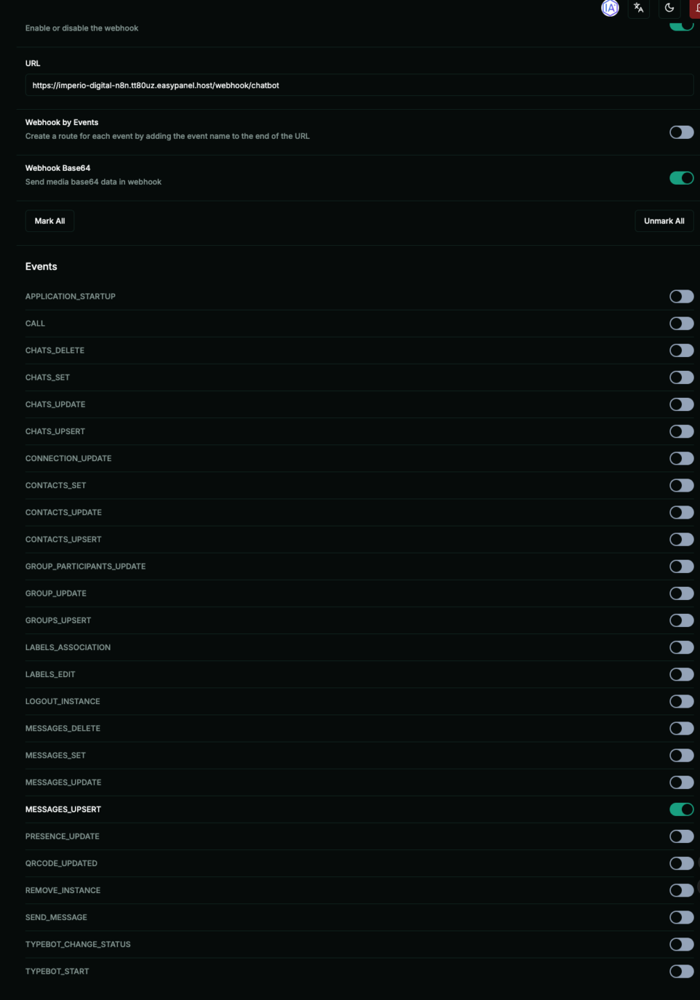
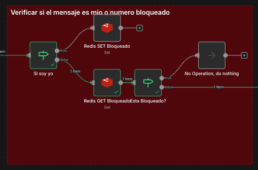
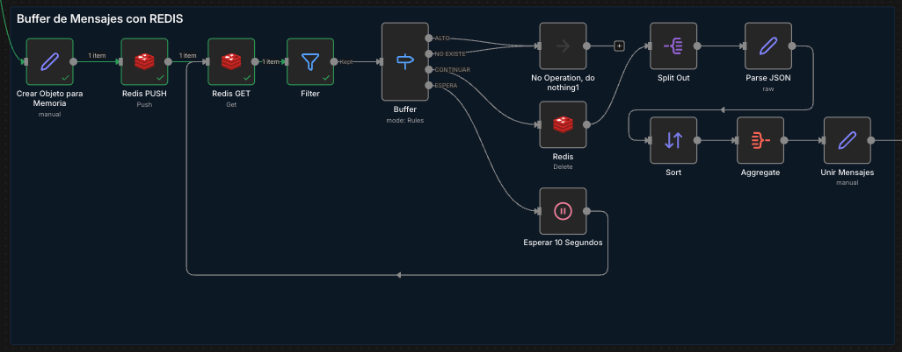
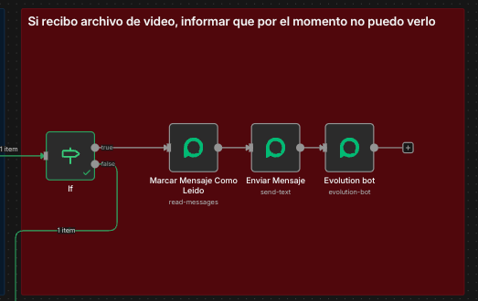
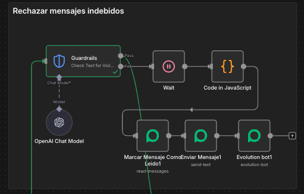
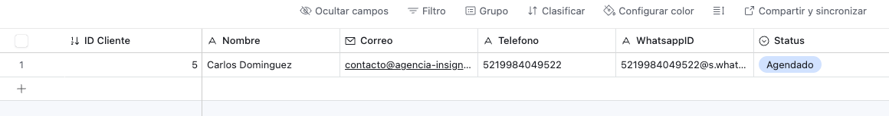
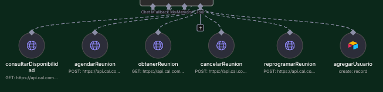
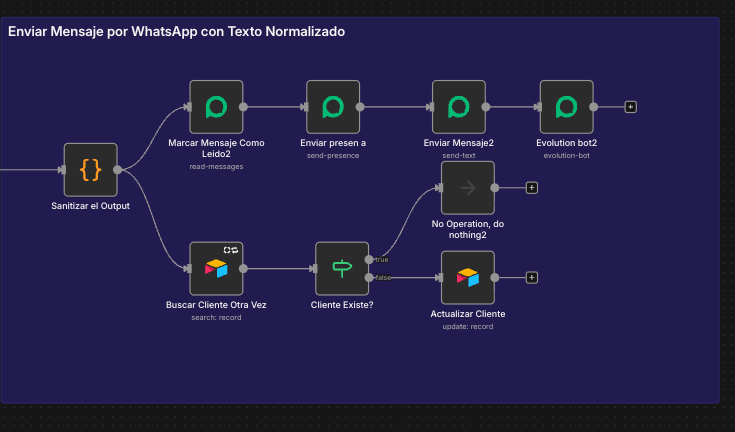
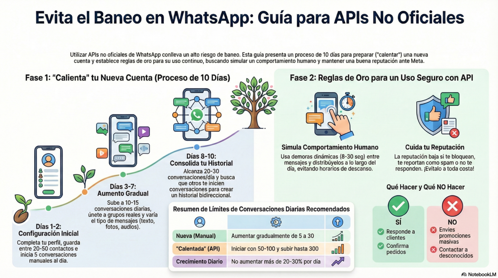

# 🤖 Agente de WhatsApp que Agenda y Recuerda 24/7

> Ruta: Automatizaciones n8n › 🤖 Agente de WhatsApp que Agenda y Recuerda 24/7

**🎬 Vídeo (246.2 min):** https://www.loom.com/share/0759eadf82c94ff9b10a98806fba1299

**📎 Recursos:**
- PLANTILLA Agente WA
- Mejores Practicas WhatsApp

---

Hoy les traigo la automatización más completa que he construido hasta ahora. Más de 4 horas de grabación. Fue la idea más votada en la comunidad. Voy a etiquetar a Lorena porque ella propuso este tema.

  
Se trata de un **agente de WhatsApp totalmente autónomo para agendar citas**, con memoria, buffer de mensajes, CRM, calendario y control anti-baneo.

Stack completo:

- n8n como orquestador
- Evolution API para WhatsApp
- Redis como buffer de mensajes
- PostgreSQL como memoria larga
- Airtable como base de datos de clientes
- [Cal.com](http://Cal.com) para agendar reuniones
- OpenAI + Gemini como cerebros del agente

El flujo es:  
Cliente escribe por WhatsApp → Mensajes se agrupan en Redis → Se validan con guardrails → Se consulta base de datos → El agente responde → Agenda en [Cal.com](http://Cal.com) → Guarda memoria en Postgres → Actualiza CRM en Airtable.  
Todo 100% automático.

---

## 🔧 Cómo funciona

### 1. Conexión de WhatsApp con Evolution API

- Vinculas tu número vía QR (WhatsApp Business).
- Configuras webhooks de producción en n8n.
- Bloqueas llamadas, grupos y activas sincronización de historial.

---

### 2. Entrada de mensajes en n8n

- Webhook recibe todos los mensajes.
- Filtro `fromMe` evita que el bot se responda a sí mismo.
- Se crea clave en Redis para bloquear auto-respuestas humanas.

---

### 3. Buffer de Mensajes con Redis

- Cada mensaje se hace **PUSH** a una lista por número.
- Se espera dinámicamente hasta que el usuario deje de escribir.
- Se consolidan todos los mensajes en uno solo.  
Resultado: el agente recibe *una sola intención limpia*, no 5 mensajes sueltos.

---

### 4. Soporte Multimodal

- Texto directo.
- Audio → transcripción automática con OpenAI/Gemini.
- Imagen → análisis visual con IA.
- Video → rechazo automático con mensaje humano. 

### 5. Guardrails de Seguridad

Antes de que el mensaje llegue al agente:

- Jailbreak detection
- NSFW detection
- Bloqueo de contraseñas, tokens y datos sensibles
- Respuesta automática segura si algo falla

Esto **reduce baneos y riesgos legales** de forma brutal.

### 6. Memoria en PostgreSQL

- Se guarda historial completo por teléfono.
- Window de contexto configurable.
- El agente recuerda conversaciones pasadas.

---

### 7. Base de Datos en Airtable

Campos usados:

- Nombre
- Teléfono
- WhatsApp ID
- Status (activo / inactivo)
- Historial
- Último mensaje

El agente crea o actualiza registros automáticamente.

---

### 8. Agenda Inteligente con [Cal.com](http://Cal.com)

El agente puede:

- Consultar disponibilidad
- Agendar reuniones
- Reprogramar
- Cancelar

Todo vía API.  
Eventos usados: 30 min y 120 min.  
Confirmación automática por WhatsApp.

---

### 9. Control Anti-Baneo

- Delay dinámico entre respuestas.
- Simulación de “escribiendo…”.
- Respuestas humanas ante errores.
- Reglas de uso seguro exactamente como en la infografía que les dejé.

---

## 🧩 Qué incluye el material del post

- ✅ JSON completo de n8n
- ✅ Plantilla de Airtable [Link](https://airtable.com/appRbt0qoF8pdJXib/shr4ENHz9RaeFyaPP)
- ✅ Configuración de Redis y Postgres
- ✅ Estructura completa del Agente
- ✅ Prompts de sistema listos
- ✅ Flujo de [Cal.com](http://Cal.com)
- ✅ Reglas anti-baneo

Todo listo para **copiar, pegar y adaptar**.

---

## 🚀 Por qué este sistema es tan potente

- Atiende clientes 24/7 por WhatsApp
- Agenda automáticamente sin intervención humana
- Tiene memoria real
- Evita baneos
- Se puede vender como servicio
- Se puede convertir en SaaS
- Escala sin contratar personal

Esto no es un bot simple.  
Esto es **un agente comercial completo en producción**.

## 🎙️ Transcripción

Visto, bueno, lo prometí desdeuda, vamos a trabajar en, eh, el escenario de, eh, agente de whatsapp para poder agendar, en el calendario, que cosas vamos a estar utilizando, por el momento de un 8n que es donde vamos a montar todo, vamos a tener, eh, uh, abulchonapi para, para tener whatsapp, si no sabes cómo estará en el 8n, eh, gratis en un bps. ¿Y cómo está la evolución API? Chega de mi perfil, ya tengo dos vídeos sobre eso en la comunidad. Vamos a hacerlo aquí, paso a paso, vamos a usar chatwood para poder ver los chats y tener como nuestro CRM por etiquetar a esos leads. También podrá seguir intervención humana por si quieres intermenir y no quieres que el chatbot responda en los chats que ya, Ahí terministe, vamos a utilizar Redis para Buffer, vamos a utilizar PostgreSQL para memoria, vamos a utilizar AirTable para guardar datos y vamos a utilizar también OpenAI y Gemini, me parece que sería todo, entonces vamos a seguir paso a paso, voy a intentar, la cosa al vídeo lo menos posible para ir solucionando los errores que vayan saliendo que obviamente también les pueden salir a ustedes y vamos a intentar primer utilizar Redis y Postros SQL directamente autojostiadas también instalados en el BPS no sé por qué alguna vez me da errores con las credenciales si funciona perfecto si no funciona les enseñó como hacerlo de manera gratuita, directamente. en la página official de redes y con sopa base también entonces vamos lo promo que tenemos que hacer es dar de alta nuestro teléfono en evolucionapi ok le voy a dar donde dice get qr code vamos para que me aparezca el code y eso no va a no poder ver obviamente pero en mi celular con un whatsapp business voy a dar las visitivos vinculados, vincular dispositivo, voy a abrir la cámara whatsapp y voy a escanear el código. Me hice iniciando sesión, mantena abierto y me hice el nombre del dispositivo, le voy a poner en perio digital, nuevamente ustedes nos también esto peor listo, si yo sirro aquí lo que ya está vinculado el número y todo perfecto de aquí lo que vamos a hacer, dejamos vuestro para acá, vamos a irnos en confibrations, settings y quiero darle reject calls, no quiero que este tome llamadas, le voy a poner Como que lo siento por el momento no puedo tomar llamadas Quiero ignorar grupos evidentemente, es muy molesto los chat, los chatboots que están en grupos Ehhh, Algo es online Esto ustedes pueden definirlos si lo quino no, a mí me gusta aprenderlo marcarle mensajes como leídos y sincronizar el historial esto ustedes como quieren quien sigue cuando lo escane el código puede ser la sincrosión el historial de los chats que ya tienen y marcarle los tatuos como leído y los tatuos no me importa, vamos a hacer el save de aquí nos vamos a ir a eventos, nos vamos y webhook, ok y aquí es importante que aprendan su webhook como obtenemos el webhook, nos vamos a ir a chrn, el mismo rastre para acá, esto es un escenario nuevo, voy a ponerle chat, y para el agua se pueda poco de agua y para que el agua se a subir el JSON cuando terminamos perfecto vamos a ir de uno vamos a ir de un web hook y aquí me siempre gusta renombrarlo y lo voy a poner no sé chatbot ok en este caso algo que es importante tomar en cuenta siempre tienen y usar de producción, si usan el de test no les va a funcionar Sin embargo, ahorita para cuestiones de pruebas, hasta que llegamos a un punto en el que ya sepamos que está funcionando el esperado, vamos a estar usando el tes y Oreo, y después más adelante vamos a cambiar a producción y Oreo. Entonces, estando esto de tes, yo lo de aquí, si fíjame básicamente el único que cambia es guion test, te vas a coger este URL, me voy a ver de vuelta Evolution API y lo voy a dar aquí donde es. de pegar. Listo. Ahora quiero decir Webfoot by Events, create a root for each event by adding an event name to the end of the URL. Esto sirve por sí, tienen ustedes diferentes eventos a los que va a reaccionar, pues le llegue como un identificador de ¿a qué fue lo que reacciona verdad? Y de esa forma ustedes pueden tener un e-phone switch y tener diferentes cosas. En este caso no lo necesitamos. ¿Por qué vas a 64C? Esto quiere decir que van a poder sacar audio, imágenes, videos, todo el tipo de archivos de media que les manden por WhatsApp y de todo esto que necesitamos lo único que usamos nosotros ahorita es MESH Observe ok y prendemos esto también y le vamos a estar abajo Safe. Ok, en teoría con un esto y así por, Como recibir mensajes obviamente no va a ser nada, pero ya podemos recibir lo que son los mensajes que les parece si hacemos una prueba y vemos que pase. Entonces vamos para volución de vuelta de este lado que vemos nuestro webcook. Ok, entonces para hacer la prueba importante es el htpmetod es post ok vamos a saber esto lo voy a de guardar vamos a ejecutar el workflow y desde mi celular voy a mandar un mensaje que diría hola probando para imperio digital y le damos y listo, vamos a estar en verde con la palomita que se ejecutó, le doble clic, me gusta verlo de esta manera, me voy a estir abajo y vemos que quise hola probando para emperor digital, ok, perfecto, ya tenemos el mensaje que llega aquí y podemos avanzar, Vamos a avanzar, que lo que vamos a hacer lo siguiente vamos a usar Chadwood, vamos a conectar Chadwood, Chadwood ya lo tengo instalado en este vídeo no voy a cobrir con Instagram Chadwood, estoy usando el panel hay cientos de videos en youtube de cómo instalar Chadwood directamente lo tengo también ajustado aquí en el isi panel de imperio digital aquí tenemos Chadwood, en ocho N, Russian API aquí tenemos esta DB que es de Postgres y el Redis así que, Si quieres saber cómo hacerlo, hay muchos recursos, vamos a continuar haciendo que ya lo tienen en la ahorita instalado y vamos a hacer las pruebas. Lo primero que tenemos que hacer aquí, nos vamos a hacer ajustes, y aquí vamos a obtener entradas, añadir bandeja entrada, y aquí nos dice que queremos añadir. sitio web, whatsapp Facebook, sms, telegram, email, nai, api, etc. Como pueden ver hay algunas cosas que es como un estabilitado. Esto lo tenemos que habilitar desde nuestro panel de administración como el SuperAdmin y la consola SuperAdmin desde aquí lo podemos actualizar. Perdón, prender o activar esto. En este caso vamos a usar WhatsApp, pero no es un WhatsApp, digamos, tradicional, porque aquí nos dice 9 de WhatsApp, ¿qué quiere decir que la app oficial de meta o tu helio? En este caso nosotros vamos a usar app, ¿por qué? Porque como es una conexión no oficial, vamos a conectarnos a través de la app de Evolution app, obviamente. Si nos vamos de vuelta a Evolution en la piel. aquí podemos ver que nos vamos a integraciones y pueden ver que tienen chatwood, tenemos chatwood entonces tenemos que configurar todo esto que está aquí para poder nos conectar y que lo que nos va a permitir recibir los mensajes en nuestra bandeja, podrá asignárselo a diferentes agentes que nosotros tengamos. poder tener banderas, etiquetas, etc. y también hay una aplicación móvil en la cual pone entrar y ustedes pueden usarlo como CRM y tener varias agentes revisando su bandeja de whatsapp, digamos, entonces vamos a nos devolta a justes Ahí me voy a dejar entrada API y vamos a ver esto y vamos a evolución API por ahora Ok, ¿qué es lo que nos está pidiendo aquí? Estamos nuestro chavo URL aca un ID Token si queremos firmar los mensajes, en este caso vamos a dejar apagado y no lo necesitamos que en si quien Buena organización, luego, etcétera y vamos ahorita a configurarlo. Pues vamos a enseñar, donde van a sacar su chat with URL, se van a chat with y van a copiar esto que tiene aquí hasta el punto com, sin el forward slash, copiamos, nos Rezamos la evolución, nos pegamos, nuestra countdown ID, nos rezamos acá, siguen cianaccounts. y aquí dice un 2, entonces esto es nuestro account AI toquen, como lo sacamos, regresamos por acá, vamos a mover esto nos vamos aquí, en nuestro usuario, ajustes de perfil, nos desplazamos hasta abajo y aquí tenemos su toquen, vamos a copiarlo perfecto, nos damos para abajo, vamos a poner un hombre a limbo Vamos a ponerle imperio digital, organización, imperio digital, aquí es posible importar mensajes, en este caso voy a dejar 7 días, y que más tenemos, y que importrarse contacto también los mensajes es reavir conversaciones, conversaciones pendientes, aquí es diando un designor GID es que quiere decir GID es como el número, que es el número de teléfono, arroba ese punto whatsapp.net, si ustedes le dan aquí en GID es, pues en algún número es concibloquear, o números pada el el chatbot. Aquí es si que esos números no van a entrar, no van a presentar el chatbot porque si tienen clientes que no hay que ir en que se mezcle, alguien que tenía reportado, lo que te sabe, no, te lo pongo aquí. Y es importante que esto quise auto-create, este emprendido y enable este emprendido. Vamos a estar abajo y vamos a darle Safe. y vise a roo chato. es disabled, vamos a ver que se debe de ser raro vamos a actualizar la página, porque están de como un error vamos a volver a pegar otra vez y ya talking Yo me estoy haciendo un poco de aspecto y tu blog me suele que en hace un poco de minuts Ok, creo recordar que me había dado este error otra vez, vámonos aquí si panel Ok, vámonos aquí en variables de entorno, aquí voy a tener que blurir, yo creo un poco, vámonos hasta abajo y proxy proxyotentication cachie, cachie, cachie ok, open a enable chatwood, chatwood, chatwood ok, entonces venga que ese chatwood enable false entonces vamos a cambiarlo true vamos a arruir safe y cada cambie que hagamos va a tener que darle diploy y nos vamos a no ver vivo y estamos reiniciando los servicios de Evolution API, entonces vamos para la accieronicia y que nos va a ser diasta listo, vamos de vuelta a volución, refrescamos ok, prendemos Shadow will you are real? ok, aquí expuse mi token pero no importa, todas formas esto lo voy a acabar eliminando este es mi URL del Shadow would mi account no idica, damos que es 2 mi token dice este no listo firma el mensaje dijimos que le vamos a llamar El periodo digital, organización en periodo digital, lo queremos logo, queremos importar los mensajes, siete días, no queremos el ignoge ideas, autocorreate si, vamos a ver si lo solucionamos, vamos a darle save, perfecto, dice que ya está funcionando, entonces era eso que se tienen que la suis y panel. se van a sus variables en torno y se ve verifican que chatwood este chatwood no es nebol que diga true, ok? muy bien, entonces vamos nos devolta evolution ya quedó todo esto y vamos al siguiente paso, listo entonces vamos nos devolta chatwood, que vamos a hacer ajustes, entradas aquí centrada en pire digital canal appy como podemos ver se creó ya automáticamente porque no estés lo posible, sin pire digitales, de nuestro web-cook no queremos bienvenida, bloquearon nuestra conversión, se activado, colaboradores y tú podemos agregar tus agentes, que hay que haberlas trabajando en este. En este inbox, digamos, podemos poner horarios en cosas de satisfacción, confiar más cosas, aquí confiar tu bot, porque no tengo ningún bot creado. Si queremos que se sincronísica aparezca todo y queremos utilizar, los mandar los mensajes, digamos, a través de chatwood. nderemos a configurar un bot, aquí están los bots de este lado, aquí podemos agregar un nuevo bot y la URL del bot, no lo vamos a hacer ahorita en este caso, entonces nos vamos a conversaciones, canales, salen aquí en período digital y nos vamos de este de lado de mi filtro, abiertas, más darle todos, aplicar filtros y vamos a dejarla ahí, vamos a mandar un mensaje nuevo voy aquí, voy a seguir con el detest, voy a escuchar un evento y vamos a mandar un mensaje por la segunda prela que nos llegó ahora segunda prueba, vamos a echar wood y vamos a refrescar y aquí se carlos o mingues, hola segunda prueba y listo, aquí tenemos hace una asistencia y ya por si, que podemos conectar nuestra clave dobenella y también no Como que refina el mensaje, tenemos varias cosas como crear notas, aquí puedo ver mi contacto, la creo para mi contacto, aquí tengo macros, tengo notas y aquí puedo combinar contacto, no mensaje y dar contacto, acciones de la conversación, equipo asignado, prioridad, añadir etiquetas, no creo ninguna etiqueta. pero se lo vamos a ver y añaden etiquetas es la opción en la que podemos hacer que se active en digamos el modo humano que es cuando le decimos a nuestro agente que deje de contestar a este contacto perfecto ya lo tenemos conectado y vamos a los muy bien, vámonos entonces En H&N, tengo como una lista de cosas que tengo que hacer, esto me martando, como estamos ya chatwood, conectamos ya Evolution API, y vamos ahora, a seguir trabajando. Histo, continuamos entonces con el video, nos quedamos aquí en la parte de Chadwick, vamos a ser un par de pruebas más. Y, de aquí en adelante vamos a camar ya nuestro webbook, si se acuerdan, estamos usando el web de pruebas, vamos a usar el de producción, porque quieren enseñarles con su vez de Chadwick y, desde noche en el directamente. Entonces vamos a dar vuelta a ICPAN, para la evolución. aquí tenemos nuestra instancia, vamos a configuraciones, settings, eventos webhook, aquí está en nuestro webhook, vamos a borrar test, recuerden, como estamos dominando anteriormente, el webhook, hay webhook de prueba y de producción, y básicamente la diferencia solamente es este siguiente. y vamos a agarrar el celular, vamos a mandar un mensaje, le voy a ejecución y lo voy a o la masashi y una mani vamos a enviar y aquí vemos que en ejecución es hasta que la ejecución y si nos vamos a chatwood, aquí yo puedo ver pise hola y aquí yo puedo responder directamente desde chatwood también como hola en que te puedo ayudar y obviamente esto ustedes no lo van a ver, pero me llega a mi celular ese mensaje y si me voy de vuelta en 8N y actualizo podemos ver que aquí no tenemos nada, no sé ejecuta nada en 8N, no tenemos por ningún filtro, no tenemos que hacer nada, si hicieramos directamente el webcook a través de chatwood, como les había comentado teniendo el bot, entonces si tendríamos que poner aquí un filtro en el hn para que no se dispara cuando tenga mensajes entrantes, lo cual no os deorita aproximadamente en un vídeo les como trabajarlo desde aquí y como funcione en la parte múltikay. ok vamos a ver en el chone y ya que tenemos aquí este mensaje de prueba me gusta siempre ya que lo aprendí para poder seguir trabajando haciendo pruebas me voy a llevar a cópito editor ya que ya tengo mensajes y se fijan se pone aquí un mueradito y con este pin que así que la testa opiniada, estos datos no van a cambiar, entonces aquí yo puedo continuar, ok, que es lo siguiente que quiero hacer, en este caso, hay muchas formas de hacerlo, tener en cuenta esto, no la forma en la que se lo estoy haciendo, quizá que sea mejor o la única, pero así es la forma en la que me he gustado trabajar, vamos a agregar un filtro, un if, perdón, y en este if que vamos a evaluar si soy yo, no se va a evaluar si este, un mensaje o si lo que estoy recibiendo soy yo y que vamos a poner en este filtro, vamos a buscar aquí lo que recibimos, Jason como pueden ver ahorita cuando yo mando el mensaje que no pareció nada, pero algunas veces no sé por qué cambia un poquito como lo maneja este evolución y nos puede llegar el mensaje cuando nosotros mandamos un mensaje se puede disparar. Ok, si fíjana que hay un from me es lo que vamos a usar, vamos a tomar esto y vamos a decirle que si el from me es verdadero, no voy a pasar obviamente porque no es de mi parte se vaya por una ruta y si es falso se vaya por otra voy a hacer otra prueba lo voy a guardar voy a despiniar la data voy a la laguardada y ahora desde mi celular esta de lleno de chad voy a llamar un mensaje ahora hacia este, es vario, otra no, foto de nuevo o la otra vez y desde mi otro número es el business voy a mandar con un esaje para responder a otras y vamos a ver si esto lo dispara mandando desdirectamente desde whatsapp pistas vamos a ejecuciones y aquí en las ejecuciones vamos a copito editor, lo vemos que es true en este caso si lo disparo cuando yo lo mandé aquí dice es yo si dime, es yo lo mandé desde Mi Whatsapp Business, yo lo que tengo es en mi celular, tengo mi número de Whatsapp privado personal, y tengo otro número con lo tengo mi Whatsapp Business. Yo como le hice en mi caso, tengo milíneas normal y compro una ECM de un país, yo estoy en México, de muchos proveedores virtuales que existen, compro una ECM, la configuré de menos de un minuto y levanté mi Whatsapp Business. ¿Por qué hacemos esto? Porque no queremos que mi voz reaccione cuando yo mando el mensaje directamente de WhatsApp, ¿verdad? Entonces, tenemos que hacer esto. Ahora, qué es lo que vamos a hacer en este caso? Vamos a ocupar Redis, vamos y para acá le ponemos Redis y aquí en Redis, lo que tenemos que hacer es un C. Si ven aquí, Y, ¡Oh! ¡Suscríbete! Set de Value de Kissing Redis, set y no teníamos aquí, vamos a agarrar una nueva credencial, esta cuerda como les comentaba en un principio vamos a hacer el intento de usar las credenciales de Redis que nos da directamente nuestro ispanil cuando lo instalamos, si no nos deja y a les enseñó cómo crear la cuenta gratuita y cómo usarlo. Vamos a voltais y panel, en ese caso me voy a chatwood ready, ya tengo un redis que me establece el chatwood y tengo el redis de evolución, en este caso yo quiero utilizar el redis de evolución, entonces lo voy a dar aquí, dejenme un poco, nos vamos a ir a credenciales, ok, y aquí vamos a ver que no suinterna el host es este, entonces lo voy a copiar, lo voy aquí nuevo, voy a poner una nueva potencial, voy a poner un redis, voy a ponerle vps para que son redis que está en mi vps, mi host es esto, mi user es default, mi password lo voy a este, en puerto 6379, 6379 y database number 0, no ni estamos ssl, vamos a ver si se conecta en este caso si se conecto, no olviden ningún error y vamos yo a definir mi clave, en este caso no nos podemos poner lo que queramos, pero quiero utilizar mi remogia y vi. que es como mi, básicamente mi número bachame identificador entonces lo va a poner como mi, es algo que soy yo y un bajo voy a buscar en este caso mi demo GID que es este, si mi número arroba ese bachame internet no agregue ese espacio extra, después de esto lo va a poner y un bajo bloqueador para poder identificar y lo voy a ejecutar, no hay falta que poner el valor que es true y si quiero que esto expire, se senta estar perfecto, lo voy a volar a mandar y listo, listo si es falso, lo va a poner un redis otra vez, en esta ocasión va a ser un get. Ok, ya se quedó mi creencia al guardado, ¿cuál es el plóporting bloqueado? El key, voy a copiar el que tengo aquí arriba, voy para acá, voy a asegurar que no tengo ningún espacio, automático y propertiz, no es, y listo entonces que hacemos con esto si detecta que viene de mi si viene para acá en caso contrario va a jalar esta va a tomar lo que tengamos en bloqueado para poder continuar y es lo que va a hacer va a ver si el número que estamos de este vídeo. Es existe, ok, si este número está bloqueado, entonces aquí me gusta ir avanzando y rorenumbrando para que sea más fácil poder entender y después podemos agregarle lo que está el cual, si sticky notes y ya podemos tejer las notas, entonces la vamos a Si no esté caso, es un tiempo en la luceja. El nombre del nodo vuelo evento en ese caso era un set y vamos a poner que es un set de muero bloqueado. Y hay que conocer lo mismo que si le dan en su teclado espacio la va a respesada, pueden abrir la parte de tarredis, si que será un get bloqueado y la vamos a reiner. , después de esto, agregamos un y no hacer un stream pero no hacer un buleno y obviamente aquí no va a rojar nada porque tengo que dispararlo entonces logra ver voy a irme a mandar otro mensaje pero ahora no desde mi cuenta de de business, de Whatsapp Business, si no les de mi cuenta, eh, Fue personal hacia mi whatsapp business Me das más info porfa, no más, quiero que se dispara, es cualquier mensaje No voy a ejecución, recuerden que ya cambié mi webbook, entonces no estoy haciendo Ejucuciones de pruebas, una ejecución es ya con el webbook final Entonces ejecuto yo, lo que toca hacer es venirme acá, copito editor y ya puedo, Continuar, en este caso no se trajó este último, porque por aquí si se fue por abajo, lo de copito editor y listo, que tenemos aquí la etapa. Aquí ya podemos ver que llegó hasta acá y como dice falso existe, siempre va a estar condición. pero en este caso lo que necesitas es una expresión y tengo que traer este de aquí vamos a arrastrar y ahora esto ya es realmente personal a mí como bueno práctica no me gusta utilizar simulador l al Jason que quiere si que estás referenciando el no de mi atenterio porque porque porque de repente aquí me acuerde que tonque agregar algo ya rompí todo esto entonces a mí siempre me gusta reparenciar tal. cual se llame el node en este caso redis get bloqueado. ¿Cómo puedo hacerlo para referenciar si en este caso lo arrastré y como es el node de mediano interior me pone y es un, pues lo puedo hacer manualmente, después de mi símbolo de dólar, símbolo de pesos, voy a abrir paréntesis, aquí ven que me sale y al guía hacer el nodo que esto referencia directamente, aunque haga una expresión que es punto item, se Dejane y me la auto completa. le doy tabulador para rellenarlo punto y listo es el mismo resultado pero si yo quise agregar aquí un nodo anterior o agregar más cosas no voy a afectar y voy a obtener el mismo resultado listo entonces no voy por aquí y en este caso se va a ir por la rama de false si es true lo puedo dejar así o simplemente para que un poco más bonito o sin ¿Qué es lo que vamos a hacer? ¿Qué es lo que sigue en este caso? Tenemos de dos, por ejemplo. Nosotros podemos ver si este cliente ya existe, si yo quiero ver si este cliente ya existe, y este podría buscar su número de teléfono. en una base a tu es de darte igual por ejemplo y eso para que me podría servir porque digamos que son esto es solamente para poder agendar o reagendar personas que tiene un un appointment con con nosotros ¿no? Entonces, esta sería una opción de yo poder ver si estas personas ya existen o no exista entonces en este caso vamos a hacerlo, pero antes de eso tendríamos que conectar, entonces Rtable correcto, tendramos que conectar Rtable para poder hacer todo esto entonces vamos los, directamente a Erteibol y vamos a crear una tabla vamos a ver aquí verte y vol vamos a esquivar bien y tenemos ya aquí una base de emperio digital, voy a ocupar esta misma voy a darle empezar desde cero para agregar una nueva tabla y que les parece si le llamamos, no sé, client Y tengo que crear aquí los datos ¿no? Entonces vamos a ahoritar algo sencillo, vamos a poner aquí nombre del cliente Y vamos a ponerle en ser tal como campo principal, vamos a hacer un cambio En el versión ser tarde aquí en la derecha, este va a ser un campo de estilo nombración automática, como lo ponemos ahí. Bueno, ahí dime, ahí de cliente y lo voy a restaurar para acá para decirle que esto va a ser mi campo principal. No necesito ahorita notas, esto va a ser a su gusto, simplemente es para hacer una prueba ahorita bastante sencillita y otra vez. No hay una forma correcta o incorrecta, simplemente si es como me gusta trabajar y creo que es bueno que veamos como las en otras personas y tomarnos algunas ideas Aquí luego voy a poner un correo, nos recuerden que si ponas el esto o si tiene un obni, lo pueden pedir a obni que les cree todos los campos directamente Obni es la guía de artigo, vamos a ponerle uno que es el teléfono pero no quiero usar el campo de teléfono, quiero usar el campo de texto como tal luego los explico por qué, porque ustedes no os que agregaron más 1 o agregar otros valores aparentes es lo que sea, voy a crear otro campo de texto que sea el whatsapp ID y va a crear otro campo que sea selección única que se llama status y va a ser activo un activo listo, vamos a ver qué más necesitamos Ok, siempre me gusta agregar un query time, pero no es creado por, es fetchacacin, vamos a ver lo fecha en la presión en la presión y listo a ver y en este caso se incluye la hora, aquí yo lijo que quiera que sea día mes año, vamos a ponerlo 2 horas, voy a poner la zona ola de en ese caso y estoy en Cancún y voy a crear el campo, después necesitamos otro campo que me gusta hacerlo esta forma, un texto largo que se llame Historial y es que me pone activar el texto en pequecido, carar campo de historial, después de eso, vamos a ponerle otro campo de fecha ahora y que se llame Último MENCIO. este lo vamos a usar para ver cuando fue el último mensaje, esto sirve para seguimiento, último mensaje y vamos a poder darle igual incluirora, 12 horas, mi en Oraria, América de Cancún, mostrás en Oraria, crear campo y deje, a ver si no estamos a algo más, porque con eso por ahorita se le ha suficiento, vamos a borrar todos estos registros listo, todo lo que vamos aquí, vamos a que era de este lado y cuando lleguemos acá dijimos que vamos a buscar 6x7, vamos a ver table Vamos a darle un search, con este search records, no tenemos una credencial, entonces vamos a conectarlas, en ese caso se ve con O2, que es lo que le recomiendo hacer con O2, vamos a poner una nueva credencial, para que la vea para que la vea Yo ya tengo otras creciales como tal, pero este es una hn de pruebas, por lo que no lo tengo aquí, y vamos a conectar. Si no saben cómo crear si cuenta, aquí se lisa en Open Docs, literal, eso me gustaba en ocho hn y los van guiando. Aquí te hizo que puede ser a través de un personal access tokin, una API. aquí, 1 o 2, y vamos a darle para abajo, si es el personal de la acción esto quien dice que de esta manera, o 2 es de esta manera, ni estamos ir a Builder Hub o Out Integrations, requisteron una integración, etcétera, entonces vamos a hacerlo, a ver si me acuerdo de conocerlo, vamos por acá, va a abrir el control para abrirlo en el Nueva Pestaña, después nos vamos aquí, estamos en el inicio, vamos para acá, centro de creadores, aparece, ya no me acuerdo muy bien, integraciones o out, vamos a sacar una nueva integración vamos a llamarle un perio, un barro de digital, un relé, es la que nos da aquí directamente esta, la pegamos, lo vamos aquí, pues lo hagan, todo eso no nistamos nada, hay de cliente, vamos a copiarlo una vez Vamos a dar table, vamos a darle los alcances, los permisos, el scope y no listamos metadeta entre personas, no listamos nada de esto, no listamos nada de esto, no listamos nada no se secreta de cliente y antes de dar la K, pues asoccionado ámbitos que quiere decir, no le he dicho que le voy a dar acceso, y se echó al mes uno del cansa arriba para una vez se pede de luego otra sesión. con esto no listamos más y lo voy a dar a guardar cambios camis guardados de regreso en hechone, lo voy a dar a conectar mi cuenta ya voy a abrir aquí, voy a pedir que ni decisión lo que confirme, aquí misa que tiene de dar recursos a todo, o no más, uno va a ser específico en este. en este yo no me lo voy a dar a la de imperio y considera acceso conexión satisfactoria, regresamos y ya está en verde, cierro y hasta conectado aquí, no quiero guardar y me debería mostrar la única betémpere digital, vamos a mostrar todas las tablas que tengo en este caso de la tablet clientes y aquí vamos a filtrar. ¿Qué es lo que tenemos buscar? En este caso nos queremos buscar para ver si existe el número de teléfono. ¿Cómo se llaman nuestro campo? Vamos a cerrar esto. En este caso se llama teléfono, lo tenemos que tomar así tal cual. Ya puedo cerrar esto. Entonces en este caso os voy a abrir corchetes, teléfono, si está como isculas, así es como isculas, con minúsculas. con el espacio, tal cual este va a ser igual a tomar mi expresión, me voy a mi web hook y necesito destelado el jid, este que sirve mi móvil jid y pongo el teléfono va a ser igual a esto pero recuerden que esto no es lo que tengo en mi teléfono, mi teléfono yo no más tengo hasta aquí. Recuerdan, entonces qué lo que tengo que hacer, que trabajar con esto y editarlo. Entonces vamos a hacerle un punto, Replace All, eso es lo que me gusta mucho en el join, que tienes todas esas expresiones, y a ver este clip que puedes trabajar, que es lo que quiero reemplazar con mi asimple, es básicamente quitar eso de mi remolle ID. si solo quiero el número entonces quiero reemplajar desde donde pese como la roba que roba s punto whatsapp.net y esto coma y comilla simple como pueden ver entonces ya me está devolviendo tal cual Ok, si yo lo de ejecutar no van a encontrar una, porque no tengo nada, pero si yo hago no más agüesto, aquí va para mi automatación y punto, cosa que no me interesa en este caso verdad, antes no voy a Sénix, siempre me gusta poner Retrayon Fail y en este caso necesito algo es apudera porque si no encontró nada, necesito que tenga uno. y yo no así continué, si sigan exhalen verde, que es el que está continuando con el proceso, ok? después de esto tengo que yo definir unas variables, os voy a usar un edit, fields esas variables les voy a ocupar más adelante para evolucionar, pues vamos a, generar las variables que necesito me hizo saber el nombre de mi instancia este es porque me lo va a pedir evolución a p, no devolución a p o solo quien hacer a través de la HTTP request nos va a pedir como se llama la instancia para que podamos saber desde dónde va a mandar el mensaje Nos vamos a webhook y de este lado tenemos instants impredigital. el biter a los más arrastramos límico y listamos y también nos va a pedirnos el número de teléfono en este caso yo lo voy a poner teléfono y vamos a buscarlo tal cual como lo tenemos aquí que sería esto pero volvemos a lo mismo esto es con el whatsapp entonces aplicamos lo mismo un to, replace all, comillas simples, arroba, s punto, whatsapp, un to net, si harle comillas simple, comillas simples, nos quedamos con un número de teléfono, nombre, listo, en este caso el nombre de la persona al cual es la forma que yo estoy registrado. en tu whatsapp, sería igual al push-neam y también estamos un status que este status es básicamente un objeto con toda la información, se puede decir así, de mi erte o el de mi basato es que quiere decir que yo cuando estoy buscando aquí yo le puedo pasar a definir esta variable mi estatus que si es un cliente si no es un cliente y si el cliente está activo o no está activo ok vamos a trabajarlo en este caso si nos vamos para acá sabemos que no es un cliente porque no tenemos nada el status es activo inactivo entonces que quiere decir que solamente tenemos tres posibilidades que exista y que está activo que exista y que esté inactivo o que no exista correcto solamente son esas tres posibles escenarios entonces vamos a construirlo expresión me vas a meter un poquito más Un pejo y que tenemos que hacer, vamos a construir el objeto que ni estamos en un object.quiz Ok, voy a tomar mi search records que es directamente de RTV, punto de vista, recuerden, punto de vista. les va guiando y no he hecho ni la unidad no apiando cerramos esta paréntesis y le ponemos que punto lente es un triple igual a 0 es lo que quiere decir si está vacío si no existe como en este caso no encontró nada entonces si es el caso, este signo de racismo es como si fuera un if entonces yo puedo decir que es este Zoom, cliente no existe, por ejemplo, 2 puntos, si pasa esto cliente no existe cual es mi siguiente criterio a evaluar digamos otra vez searchrecords.it.json y como se llama el campo, digamos, estátus, entonces me voy para acá, Abro, corchete, status, ok, punto el stream, ahorita va a estar un poquito complicado por lo van a ver, igual igual igual como ya simple, y no me acuerdo, contemos activo, inactivo, vamos a ver, sí, activo, entonces esto es un cliente activo Y bueno, vamos a lo mismo, vamos a decir a como un if, else, más o menos, cliente inactivo, y se armamos, ok, en este caso no es decir no que el cliente no existe porque no está registrado. Ahora, cuando lo vuelamos a correr y ya registremos el cliente, vamos a ver que nos debe mostrar con la clínica. activo en activo dependiendo como lo margemos ahorita entonces dejen ver si necesito algo más en mis fields en mis variables necesito también el tipo de mensaje con el tipo mensaje me gustan usar espacios prefiero yo en bajo y mi tipo de mensaje es el web me vamos para acá y donde dice message type, message type, message type, básicamente quiero resistir textual, audio, imagen, etcétera Estaba un poco de data. Pucho los textos. Message type. Es un tipo de conversación. Vamos a poner también un, místamos la hora de llegada porque porque místamos a ver acturas llegó, lo vamos a ver más adelante para el bufer, el redis, la hora de llegada, es Aitan Jason Bodie, ¿Ni Bodhi, debo tener un, daytime? ¿Qué está? ¿Ni hora de llegada? también estamos un aire de mensaje, entonces va a ser un aire y un bajo mensaje y el aire de mensaje es Jason Bodhi Data Key ahí, perfecto, tengo mi notación a otra pantalla pero estoy volviendo y vamos a ver, Lo que más necesitamos para las variables, que podemos definir todo por ahorita, vamos a arreglar Ok, frente no existe, estáis en perdigital, se hace un amor de teléfono, tipo mensaje, hora llegada y el aire de mensaje. Ok, vamos a ver de nuevo, porque nos ha hablado de las buenas prácticas, es como está bloqueado. Vamos a poner, desbustar, cliente, definir variables y después de esto listamos un switch ¿Por qué listamos un switch? Porque tenemos que ver que tipo, El mensaje es el que estamos recibiendo, en este caso lo voy a hacer un poco más sencillo, tenemos mensaje de texto, mensaje de voz, mensaje de imagen, es muy sencillo, como lo hice el nombre, si mando un mensaje de texto, va a decir texto, si mando un imagen de imagen, en si mandan a audio, solo me voy a focar estos 3 Pero quiero que sepan caimás, ¿cuál sería el cuarto reacción? Si alguien te pone un corazóncito, una manita arriba, un mensaje, eso llega a una forma diferente. También si alguien te responde según un mensaje, en WhatsApp tú le puedes dar responderte, responde con un mensaje, Llega a una manera diferente, este texto, te puedo responde, perdone. estoy imagina odio pero si tienes que capturar que te responde una mensaje por qué porque la gente que tú le mandas un mensaje que dice este dos mensajes perdón tengo la opcionada tengo la opcion de cual quieres y en lugar de que te responda B te responde sobre el B este dice este quiero a si no lo configuras bien a tu chatbot solamente le va a llegar este quiero pero no vas a ver a cuál se refiere entonces tienes que tomar ese valor de respuesta, entonces es otra variable que tienen que considerar la cual no vamos a cubrir ahorita, entonces para mi switch, simplemente tenemos que ver, vamos a tener tres opciones, texto, audio y maja, en este caso, yo de definir variables donde hice tipo de mensaje lo voy a arrastrar, no quiero usar Jason, que es el nuevo de mi atenterior, entonces voy a abrir paréntesis, definiable es punto y en punto Jason, y si es igual la conversación, que es como va a hacer este caso, conversación, aquí lo va a poner, que es un texto. Si, por hotel PAPA que se no ha rápido, esto es, Igual audio message, yo ya sé que así llega pero ahorita lo vamos a ver si no superan cómo llegar a lo que quieren confiar tendrán que mandarse un mensaje de audio y ver cómo llega aquí directamente, en este caso yo lo voy a llamar audio y no quiero usar un fullback porque lo que les digo, puede haber otras opciones, entonces voy a volver a pegar aquí tipo de mensaje y lo voy a poner cual es el otro audio message y image, y aquí voy a poner ima, list, adjeto Estamos y vamos a mandar por aquí, que es un texto. Ahora les voy a dar algo por si no sabían, todos estos son valores, como pueden ver aquí separados, instancia, sirio de omigation, aquí está, no, instancia, teléfono, aquí están mis claves. Algo que también pueden hacer por si después quieren construir un objeto para poderlo manejar más fácil, es que él lo puede poner por ejemplo Evolución.instance Evolución.terefo, evolución.nombre, evolución.stat Evolución.tipo mensaje, evolución.garallegada Evolución.id y en bajo mensaje Ok, si yo le ejecuto, entonces todo, Todo está dentro de Evolution, con sus variables, entonces el esquema se vería así, Evolution y dentro está todo esto, entonces voy a volver a ejecutar, esto se actualiza de forma automática no se actualiza, no se actualiza, pero es muy fácil simplemente JSON punto, evolución.it, Les voy de Jason punto, pego en esto, quiero tener acopiado y list, volve a ejecutar y hacemos un mensaje de texto, ok voy a darle guarda, después de esto que tendremos que hacer, tendremos que ver si es un mensaje de texto, pues entonces simplemente tomamos el un mensaje texto, si lo pasamos tal cual, si es un mensaje de audio hay que transcribir el audio, si es un mensaje una imagen hay que analizar esa imagen, ok vamos a ver, entonces en este caso si es un mensaje texto voy a poner aquí un set field y le voy a poner mensaje final Ok, voy a pasarle tal cual el valor de que tenemos acá que recibimos. Webbook, donde dice Message, Conversation, me das más info. que lo vamos a pasar y le voy a llamar todo lo que he pensado list de infecuto list de nada más sin favor ok ahora ¿qué pasa si es un audio? lo voy a dar aquí donde dice guardar voy a despinar la data guardo el nuevo, vamos a su cuisiones y voy a mandar un audio vamos a ver ahora si la vez me puedes dar más información por favor este llaman del audio, voy a ver que está corriendo Correr, me voy para acá, si les dije, no sale aquí nada, porque no tengo una rama para ese output, copito editor, vamos a el webhook, y podemos ver aquí qué dice, otra vez no pasa lo mismo, no se fue esta versión, a veces falla cuando las click, listo, nos vamos de vuelta al webhook. y podemos ver que aquí se mime type, ya tenemos un mime type, ya tenemos un audio message or really, cosa que no teníamos antes, y que más tenemos, ok, mese type audio message, Así nos vemos ya, se vino por aquí, por resparado, buscón, en contra. otro definio de las variables y es un tipo audio ¿ok? ¿qué lo que vamos a hacer es si es un tipo audio vamos a tomar lo que es este audio que llega como como base 64 entonces voy a agregar aquí y voy a poner un clasio en edit fields y voy le voy a llamar y no sé recuperar aquí lo voy a llamar la evolución punto a odio vases 64 y voy a buscarle aquí un web el jugo, y tenemos un bodidata. y aquí me llega una URL que tenéis en este caso datar msh dejen de ver lo mejor ya lo cambió puede ser que ya lo cambia el volución. Un min de aquí, mis H, mis H, mis H, direct path, creo que ya no llega como base 64, no si aquí está, base 64. Arrastro entonces todo este item, punto y ahí es en punto bode, punto data, punto MSH-604, ejecuto, no en la roja de, de este lado y después de esto vamos a dar la quimiscovita para que me me organize y vamos a darle aquí sería base 64 a file a binario y vamos a hace el que hice, mova a 64 string 2 file. y en este caso sería evolución punto audio va a ser 64 porque es la ruta como se llama quiero que seame data que es lo más común y el meme type vamos a buscar aquí el meme type es un audio gui voy a poner OGG, tenemos de 2, lo puedes escribir así audio tal cual, o no es así que no futuro cambia, no lo sé, arrastro, pero no me sirve todo esto, no voy a uniso el audio OGG, vamos a darle así punto, replay sol, que lo aprendimos antes Después de esto sería que quiero reemplazar, donde, básicamente, es donde pese el punto coma. Es espacio con mía simples y, ,sería aquí, ,códex... ,guion opus. y me ha dado todo lo demás listo me queda con el audio si ve de view creo que usted no lo pone a escuchar, pero aquí estoy escuchando mi audio que lo mandé y aquí tengo mi binario perfecto entonces ya esto saben si ya tenemos este archivo si lo podemos pasar a a a a a a a a a a a Hola Gemini, hay que ustedes más desguste, que sería Transcribe a Recording y listo, no tengo potenciales conectadas porque la versión de prueba y hay muchos recursos de cómo conectar aquí en este caso las creenciales pero vamos a hacer, no lo van a poder ver porque es mi mi otro navegador, me voy a ir a OpenAI, me voy a mi perfil, bueno, tu es mi voy al perfil, y perfil apiquís, genera una nueva, lo voy a llamar un periodo, no quiero hacer ningún proyecto, voy a dar llave, copio, pego, organización id voy a través de general, lo que me he hecho de dig, copio, pego, y no tengo que tocar nada más, lo del 6 verde, listo y ya podemos utilizarlo, muy bien y es un trancicador no recordi, se vaya a amar data, aquí ustedes lo pueden poner el idioma pero que tal si es ahora alguien en inglés, ustedes lo ponen español, etcétera, la temperatura ahora ya se me lo dejo así, si quieren ustedes pueden poner un poco la temperatura, la temperatura es que están rendendo va a ser, si va a ser muy estricto, va a ser un poco más abierto, en este caso me voy a borrar y vamos a ejecutar. Ok, muchas gracias, me voy a dar más información por favor, esto si tu te acabo de escuchar cuando está grabando. Entonces ya que tengo esto, ya es como que mi mensaje final digamos, correcto. Entonces yo este mensaje de audio. Puedo conectar esto para acá, esto va a ser text, ok, ok, y de aquí un edit Fíjense más y, vamos a ponerle audio a texto y va a ser mi text y simplemente para homologarse aquí le pusimos mensaje final evolución punto mensaje entonces vamos a ir a ver la evolución punto mensaje para que nos va a ayudar, para que cuando yo me mando para acá todos están como evolución punto mensaje y lo pueda detectar vamos por acá y si me voy aquí obviamente como usted te manda el web group me va a dar el error en este caso si necesitaríamos que sea el nodo inmediato anterior para que no haya ningún problema Entonces voy a borrar todo esto y le voy a poner Jason. Un punto de evolución, un punto, ¿Por qué? ¿Por qué es como nos llega nuestro mensaje en nuestro web, que muy para aquí sería json.bodi mcc content en este caso como es audio no llegase message.content es esto y lo ejecuto de nuevo y me vengo por acá sería a json.de.content y esto de acá aquí sería perdón Bodhi punto content ok está haciendo unas pruebas y me están en error así que ya me acuerdo por qué no puedo usar el Jason punto content porque tengo todo esto antes de hacer pierdo el contexto, entonces vamos a hacer la forma correcta, que la forma correcta sería la siguiente, vamos a evitarnos de audio a texto, aquí vamos a ponerle, como veníamos, evolution.ensaje no me importa lo demás, mi mensaje final va a ser simplemente aquí Evolution.Mensafe, ese sería texto y aquí vamos a dar un Merch y este Merch va a ser un combinar por posiciones con tres inputs. este, listo, aquí se ve a mi input 1, mi audio se ve a mi input 2 y ahora también imagen sería mi input 3 voy a guardar y ejecuto esto y vamos a ver Vamos a unirlo cambiado de cinto sin nomas para poder hacer la prueba ahorita el ejecuto está pidiendo que llegue ¿Dónde está? ¿Dónde está? ¿Dónde está? ¿Dónde está? No es la forma más clín pero lo voy a dejar así y ahorita veo como mejorable les digo. Listo, ya vi que tenía mal. Tenía aquí audio texto, tenía una s de más y se me estaba rompiendo todo. Un tipo, pues ya ejecuto, se va a llamar Evolution.Mensaje. Mi texto va a ser Evolution.Mensaje y mi imagen va a ser Evolution.Mensaje. Así ya puedo usar un JSON. un punto de evolución, un punto de mensaje, importe los tres donde venga, siempre voy a obtener un output. Ok, entonces vamos a guardar y ahora voy a enviar una imagen. Voy a agarrar mi celular, voy a abrir mi conversación y voy a mandarle una imagen. Vamos a buscar algo Aquí tengo la imagen de un faro de un carro Eje cuciones, vamos a estar arriba, aquí se es paro mas edad mas a copito editor y aquí vemos que se fue entonces por acá ejecutamos no se fue por ninguno de estos image message no fue lo tengo mal vamos a ver un webhook body Perdón, definir variables, vamos a ver en difundu variables primero un tipo de mensaje, asociar a child message vamos a ver como llego entonces El chucho sería data, no pene. tu interactio video message, video message, interactio associations, video mp4 ok, aquí tenemos un detalle, estoy en iphone y no sé si lo han visto, iphone toma unas imágenes que se le llama como tipo que en realidad es una foto pero cuando las mandas de las mandas como un video por eso me están rolar y se llegan de aquí como si fueron un mp4 lo cual me sirve para para procesar o para hacer algo vamos a aprovechar y desde aquí vamos a poner un filtro, no un filtro para un uniz, y lo voy a decir que sí, mi, vamos a copiar esto, si mi tipo de mensaje es igual a esto y Este objeto existe, que quiere decir que es un video, ok, me salió con el falso, no es estando a verlo y tengo que decir que no puedes un shrink vamos a ver no es de chica un titulo, no es de asociación no es de chica un titulo un to video message.mymetype es igual tu video y lo que sea Vamos a ponerlo en el mejor un contents ¿Qué no está en el horror? Tipo, mis ajes y es asociar el chau message Tendramos el paso de aquí Tiene un espacio, mucho ganado Vamos a regresar entonces aquí y vamos a hacerles si el objeto existe, entonces si el objeto entonces yo voy a mandar un mensaje directamente diciendo lo siento, no puedo ver archivos de video, no puedes mandar mejor un audio o un mensaje de texto, entonces para hacer esto, voy a efear a Evolution API, volvamos a lo mismo, podemos usar el nodo de Evolution API o podemos hacer un htp, si ustedes pueden ver si le de aquí en Evolution API, no tengo nada, entonces vamos a aprovechar, vamos a ¿Qué pasa? Y vamos a instalar el nuevo de Evolution API directamente. Como hacemos eso, vamos a enseñar como hacerlo. voy a abrir una nueva pestaña de aquí, en el 8V, en el 8V. settings no es de la comunidad y estará uno de la comunidad y copiamos esto de hecho en 8N, guion nodes, guion evolution, guion happy Nos vemos que sí, nos vemos instalar. Ahora, los desarrolladores por si no saben ustedes son brasileños, todos los nodos tan deportudes, también en lo particular se me hace fácil entender el portudés es muy sencillo, pero si no quieren lidiar con eso simplemente pueden ver la documentación directamente, el github y utilizar un htp, y seguirá todo. Nos vamos para acá, actualizamos, primero, si es true, vamos a hacer cuestiones, vamos a comprensible el editor para que nos vayamos por esta ruta y si usamos buscamos Evolution API, no sale, si fíjame en este icono que si que es no de la comunidad, que lo aprendemos que tenemos que hacer, el primero que me gusta hacer es marcar el mensaje como leído, esto este tipo de cosas nos ayudan a evitarvenidos, entonces vamos a buscar el de marcar mensaje como leído, esta En chat, marcar mensaje como leído, aquí está, como si se ve dice marcar, mensaje neus como lidas, marcar mensaje como leído, leer mensaje, nos va a pedir nombre de la instancia que si se pierden se acuerren, la tenemos gracias a esto, nos va a pedir el número de contacto. se acuerdan ya lo tenemos aquí en el teléfono y nos va a pedir el ID del mensaje que también ya lo obtuvimos de acá obviamente nos va a pedir que conectemos las creenciales no las tenemos la vamos a creenciar, problemas a lo mismo no saben cómo, open docs y bueno aquí no es error PageNetFound, no pasa nada, vamos a darle aquí a la API directamente y vamos a buscar como conectar las credenciales y mientras ahora seguimos por lo acumulado Ok, todo que ya me acordemos vamos a probarla Nisto mi URL, entonces voy a Evolusion, voy a copiar mi URL, bueno no es esta, vamos a tomarla en nuestro disipane, mejor, vamos a Evolusion y sería esta, vamos para acá pegamos, así hasta el host y le quitamos así de a una daper una api si no me equivoco esta las sacamos de volución dashboard y copiamos creo que si es este no estoy seguro y para acá pego con el to y bola era esa perfecto ya estamos conectados vamos a marcar este mensaje y listo antes de ejecutar esto que más queremos hacer una vez de marcar el mensaje como leído vamos a enviar el mensaje, sería Evolution API y en este caso sería mensaje enviar texto, podemos enviar el texto, imáceo, video, audio, documento, contacto, listas, bots, status, etcétera, entonces nos enviar texto y lo mismo que estábamos conectados, nombre la instancia, ya la tenemos, teléfono, ya lo tenemos, y el mensaje que le queremos mandar en ese caso Podría ser como que no sé, una disculpa, por el momento no puedo ver videos, favor de mandar un mensaje de texto o un audio, gracias y listo entonces ya que estamos esto acá le voy a dar a este play y va a pasar esto a pasar esto y me dice que ya lo mando, le guard safe y deje me a abrir mi whatsapp para enseñárselos bueno si no doy en chat google lo haríamos de poder ver ahí está, una disculpa aquí está la imagen que le mandé si se fijan es un video en realidad no es una imagen aquí si mía como el maje pero es un video cuando lo ves en whatsapp, es cuestión del iPhone que te lo mando en como el live tendría que ver como as activar la visión escupa por un momento no puedo olvidar, os voy a voy a mandar un mensaje de audio gracias y me lo más como le digo, está perfecto y listo, entonces vamos a hacer la imagen la parte de que nos llega un imagen ahora sí y creo que por ahorita y pausa ría el vídeo. para continuar, entonces vamos a mis celular, no lo pueden ver, voy a buscar ahora si lo que es una imagen que no sea Realize y para poderla mandarse. que tuve ese pantalla que tenga listo, le mando un imagen, le voy a ejecución, aquí la tengo arriba más para que cargue rápido editor y listo, si podemos ver ya se fue por el pat de imagen que tenemos que hacer en este caso ya que lo tenemos por el pat de imagen, tenemos que analizar la imagen, podemos utilizar Gemini o Penelay como ustedes quieran, vamos en este El caso de darle aquí, imagen, vamos a usar un nodo de Evolution API, que se va a llamar obtener imagen en base de 64, si se acuerdan cuando le estábamos confundiendo, les dije que para eso en webcook teníamos que tener webcook base de 64 prendido, de lo contrario de una vamos a poder hacer esto, esto va a ser un recurso de tipo chat y obtener, aquí está, obtener media, media, un archivo de media, en base 64, el nombre de la instancia, ya lo tenemos y el ID del mensaje, aquí está todo lo que necesitamos y le vamos a ejecutar y listo, aquí nos da el base 64, como hacemos en la parte del audio es muy fácil en este caso, vamos a hacer aquí para quise ordene, y esto lo voy a entrar más para acá y esto lo voy a llevar como para acá, y de aquí si no sigamos para acá esto ya lo pueden limpiar, estoy a acuerdanse que tenemos que más manejarlo, vamos a ponerle, marcar, mensaje, como leído, aquí está, enviar texto, vamos a ponerle bien via, Medzaje, obtener el mojón en base 64, después ésta vamos a aplicar ésta, conectamos con en Berti, en Emilia audio, convertir a dinero y marcha, con la diferencia que en este caso no sería un punto audio en base sesenta y cuatro. Sería data. la output quiero que se hame data y mi mi type aquí ya si lo voy a poner manualmente porque es lo que yo quiero hacer un image jpg y lo deje cuitar, y listo es el imagen que muracán en ese momento que estaba tracheando, perfecto, ya teniendo esto que seguiría, ahora se podemos utilizar el módulo de OpenAI, en el Lights Image y vamos a utilizar aquí que les gusta 4.1 mini para, van a analizarle imagen, no creo que necesitan unos 4.1 milis rostruta que analizarle imagen solo tiene 4 milis y quiero lo que quiero, quiero analizar la imagen de la rertografía y leces la imagen que compartió el usuario via y lo que te apretes no es una orelé un binario de tipo data si vamos a dar y aquí mis elemejen mucho más interlocuos por el caribe etcétera, entonces es perfecto, yo con esto vamos a tener un set field este setfil se va a llamar imágenes y a mí me gusta siempre hacerlos y recuerden que a todos les estamos poniendo evolution.manzaje y a mí en los particulares es preferencia a mí a mí me gusta hacerles el usuario envío una imagen con la siguiente descripción me gusta decirle a la gente que ese mensaje como tal fue una imagen que ya fue interpretada simplemente para que tenga un poco más de contexto y entienda y ejecutamos Lo uso al invierno imagen con la siguiente descripción, la imagen muestra un mapa, etc. Ya puedo unir aquí y se ejecuto esto. Ya tengo mi mensaje final para continuar y lo uso al invierno imagen con la siguiente descripción. Perfecto, vamos a guardar. ¿Qué seguiría después de esto? Antes de irnos a la parte de, Redis y todo eso, vamos a implementar uno de los nuevos nodos que se llama CarRail, vamos a crear aquí un CarRail, vamos a primero a checar si hay violaciones en el texto, que serían en esto, en este caso nos haamos en su imagen, pero si es un texto directo, están inyectando código maliciosa lo que sea, podrían decirlo y ¿Por qué no lo chico? Antes de que atrás podré hacer, pero como tengo que también sacar el audio y le imagino en todo lo pongo aquí de este lado Entonces aquí en donde se quiero ahorita y voy a seguir grabando el vídeo, ustedes lo van a ver como todo un vídeo completo Y esto, vamos a caer donde nos, vamos a continuar donde nos quedamos. Vimos que lo último que hicimos fue, eh, poner lo, uh, garrir aquí. Y ahorita me ha quedado al cuenta que me ha faltado algo que es muy importante, vamos a hacer esto, vamos a regresarnos a nuestro branch de cuando mandan un video, vamos a decir que marca el mensaje como leído, enviar aquí y después vamos a buscar otro lado de volucio nape y vamos a buscar una que diga volucio en bot un loop action chat actions por fin el evento es volucio en bot y ese es como para apagar el bot y Todo sea más seguro, al final les voy a dejar algo como las un infografía aquí mismo como las mejoras prácticas para evitar vaneos y ya tenemos todo lo que necesitamos. No todo esto no está corrido, pero yo sé cuál es mi nombre de instancia, lo que este es mi variable, aquí necesitó alterar el estatus de la sesión de labor. un bot, me va a pedir el IV de la evolución bot, que básicamente es el IV del mensaje, el número destinatario pues ya sabemos si es el teléfono, y el estatus sería a cerrada, y list, vamos a darle a guardar, y nos regresamos para acá, donde nos vamos quedamos los Garriels, vamos a ver, esto conectamos el mensaje está acá y vamos a ponerle que vamos a hacer chique violaciones, que es lo que queremos checar Jailbury que quiere decir que no le piden a mi agente, dame tu sistema pronto o dame código o dame alguna información, NSF, NSF, FW, not say for work, que no hay contenido de el visitoro de seriasma. y que el usuario no comparta llaves y comparte llaves, niste que éramos bloquearlas, llaves contra señas, accesos y así y listo. En caso de que sea fail y en caso de que pase ya veremos que hacemos. Entonces vamos a hacer una prueba, vamos a mandarnos un mensaje y de aquí lo retomamos. Recuerda aquí, y ya se quedó prendido en el volucionap y tenemos el webbook de producción, no es de prueba y vamos a mandar un mensaje y vamos a apreciar una vez a probar el carril de ver qué pasa hola te dejo mi contraseña del correo Asas y lo detecto el garril. Así que, No sé tan con, Uno, dos, tres, Arrroda, Se lo mandamos, Vamos a ejecuciónes, Y vemos aquí medio de horror. Vamos a ver de gukin editor, nos traemos y vemos aquí el volución mensaje, mensaje Vamos a ver qué pasemos por acá, el volución mensaje muy, vamos a ver qué pasemos con mi mensaje entonces me llevo aquí, hablate de que lo tengo en el correo, vamos a ver en qué punto se perdió ese mensaje, texto, como aquí está, aquí lo perdimos, y es en punto todo, y en punto content El rucho es un tipo de mensaje, el rucho es un maillano, el rucho es un maillano y en saco. Vamos a remapiarlo, como ya no hicimos nada en ese retexto, vamos a remapiarlo No tenemos aquí, continuamos por acá Llevamos del que nos dice Que se fue por fail, que dice que no pasó porque, Tieno con mi contraste y me ha dicho, el gelbrek tru, coface por 9 files, cheques, NSFLLU, 27 files, 1, 2, 3, 4, Vamos a jugar con la temperatura 5, 5 y si me dejarlo va a ser, ok, me voy a pasar, en ese caso me estaba detectando Como el J-Rake y NSF, no sé aluminar NSF lo un poco tan tito y no sé la ley de J-Rake por si fides la centricidad o si le hubo un concepto. Así que en 20 cif, una igual de I-SF2, la policía de la Se fides un bar, fides la igual de Gárez de César. Pase por si fides la centricidad Y después esto vamos a copiar estos tres nodos nos traamos por acá aquí vamos a poner un code y ya ve escrito y que lo acabamos de hacer aquí estoy pensando mandar un mensaje diciendo que un mensaje diciendo lo sabe que por favor voy a mandar un mensaje que no podemos procesar esa información y podemos, tener cuatro mensajes y que leatoriamente construya un mensaje este y que el sistema detecte entre esos cuatro mensajes vamos a decir de la IA que nos ayude para hacer este iaba escrito vamos aquí y lo voy a elegir, voy a seguirlo con el 45 sonente, por si me asesito con un podido, podido irlo. Ya voy a escribir para el HVN, donde les curoja entre cuatro mensajes, es Como veis este don de un pronto super chafada, palabras muy comunes, una disculpa, no no puede procesar tú. y a que pudiste haber un propio información, un sitio social o poliguo análisis, por favor y tendrán de nuevo. Mientras genera esto, vamos a poner antes de esto un no-the-weight, que no lo voy a ver, porque está desfracado esto, pero vamos a esperar tanto esto. No disculpa, no procede un mensaje, que puede estar comprender un fenómeno convencido, y puedo ver si es por un nuevo, por sentido, Los posatorios en este momento es posible que haya sentido información sensile, disparo para las malices, pero no es posible que haya que mensajar el tralc, y agreditamos que puede dar cuenta de edad, que los mensajes se podían aseguro, la montaña que promete que no hubo asignado. Y, Entonces, vamos a copiar, seleccionamos, llegamos, corremos, Y si la metó en el formato que no podemos, se te ha hecho un mensaje, te vamos a volar a ejecutar, me estoy cercado a otro frente Me voy a ejecutar por parte de con información, vamos a volar a ejecutar Me está dando siempre el mismo, y es un mensaje matformatforma de un mensaje linked Quiero creer porque el nodo anterior siempre ha sido lo mismo, vamos a cambiar, que tengamos una nueva situación, ya tendrá que también aquí. Me disculpa no por ser tu mensaje listo, ok. Entonces quiero que quiera hacer, voy a tener aquí un wait para que los mensajes no se disparen lo luego y tengan un poquito de delay. Ok, no sé si sabian eso, pero aparte del guay tradicional de que espera tanto segundo después de mi intervalo, podemos tener un especifico tiempo, un web full call, pero también el wait amount pues es una expresión. Entonces vamos a ver una expresión que este estilo le cruzamos para generar el mensaje que no se casas. trigo al un mat.flore y vamos a hacer un mat.random y aquí vamos a decir que sea No sé, siete segundos, de siete a tres segundos, creo que es, Está bien para esperar, el es 7 menos 3 más 1, resultado de esto más 3 y cerramos y cerramos esto lo podemos ajustar aquí, este para acá, vamos a macar mensaje como leído, mandamos el mensaje, vamos a que esté en la piala, y es un ruso en la piala, que es lo que les decía. de el problema de utilizar los gensos. Entonces este sería definir variables.item.item.it Algunos paréntesis de los primeros variables, punto de edición, y aquí también, de los primeros variables, punto de edición, punto de edición, y así que no se le está completando. Ok, aquí el mensaje, yo tengo que marcar obviamente, que era una expresión, borramos esto y va a ser este código, aquí, si se fijan también lo pueden poner un delay, un preview link, pueden responder un mensaje por ejemplo si van a ser aquí la prueba para que sepan exactamente que mensaje nos repurimos si yo lo he de responder mensaje, voy a pedir el ID del mensaje, entonces si me voy a definir variables. y el mensaje y el mensaje un poco de la implementación y el evolution bot hay un golpeado mas darle save y lo voy a dar hasta acá para que se ejecute todo esto Entonces, al hacer todo esto, se evita en muchísimo los vaneos, son las mejores prácticas. Ok, entonces déjeme traigo mi whatsapp para esto para que puedan ver cómo llevar mensaje. Y esto, aquí está mi whatsapp y si pueden ver diso mi disculpa no puedo presentar tu mensaje que puedes saber compartir información, conferencia, álbum, con malicido, por frente de nuevo, y fue una respuesta sobre eso. este mensaje, lo cual está perfecto y creo que es una intelectiva bastante humana, podríamos refinar un poquito más el texto pero bueno, creo que la idea se entiende de que ya ustedes pueden jugar con esta información, vamos a continuar entonces, esto quedamos que se está rama, recuerden que igual como mejor es practicado, después vamos. ponen un sticky note y poner que hace cada rama, que hace cada cosa, pero bueno vamos a continuar ahora sí viene lo bueno que es hace el buffer de mensajes, tenemos la salida para acá y aquí lo que queremos hacer en redis, en este caso va a ser un push. ¿Por qué push? Porque queremos mandar un mensaje a nuestra memoria corta, en este caso vamos a hacer la lista y vamos a hacer un, vamos a buscar mandar el número de teléfono, ese va a ser nuestro, digamos, el nombre es tu trate IV, el nombre es tu el teléfono porque sabe que no va a cambiar el número de teléfono de este usuario y entonces vamos a definir variables y ya tenemos el número de teléfono esto lo vamos a ocupar como en la lista y la vamos a poner aquí un bajo buffer si lo hayan maratot mis buffers de mensajes listo y la banda aquí que decir que lo que le voy a pasar sería el mensaje, lo que voy a guardar toda la conversación tenemos de dos, o pasarles sobre el mensaje o pasarle el objeto Evolution, que el objeto Evolution tiene la instancia del teléfono, el nombre, el status, el tipo de mensaje, el hora el aire de mensaje pero no tiene el mensaje como tal. Entonces podríamos al objeto de volución agregarle el mensaje y pasarle todo el objeto completo para que en el buffer no solamente guarde el mensaje sino guarde absolutamente todo. Entonces vamos a hacer la prueba y a ver ahorita que que la hacemos ok porque si voy a hacer los objetos pero vamos a hacer un nuevo objeto antes de esto y porque solo en este punto vamos a estar el objeto como tal no entonces Vamos a darle edit fill Entonces quedamos que es un edit fill y vamos a generar un nuevo objeto En este caso tenéis estamos nuevo para acá Vamos a ocupar algunos campos que teníamos de definir Vamos a reciclar el número de teléfono, en este caso vamos a poner, me gusta me hacerlo en inglés, pero lo mismo es el punto en el conversación ahí vi y también estamos el mensaje como tal, que es el mensaje punto y vamos a llamarle content y este vendría de esta te arriba que es el mensaje final que en lugar de mensaje final sería más bien el mensaje porque me garre y no lo vamos a modificar el mensaje que son feo ok, necesitamos también el cuando llego message.txt este sí lo podemos tomar de aquí y necesitamos también el aire del mensaje si hay a msg.a Y ni estamos también, bueno ni estamos pero no está mal, o bueno práctica message.type ¿Qué tipo de mensaje es? Y la más para agregar esto, message.client, vamos a pasar. el estatus del cliente más el nombre listo entonces vamos a no estamos mandar otro mensaje Voy a mandarlo a otro mensaje para que pase por arriba Entiendo No voy a mandar con tres años Gracias Ahora estoy haciendo todo un solo mensaje, pero el parazo vamos a traje en el bufo de redis para arreglar eso no me iba el mensaje, no voy a recupciones, para poderlo entrar en vivo aquí están y nos vamos al editor con pin, ya se vino por acá, ya se afiquen todo esto y se fijan más para acá esta vez ya tenemos el objeto construido entonces de aquí ya vamos a conectar el redis y en este caso vamos a mandar las que enseñar por qué pasa como si me mando mi objeto voy a mandar todo esto Sienta como una preta. Entonces, lo que podemos hacer, ¿Sería intentar descomponer un poquito ese objeto? Vamos a ponerle primero de dónde viene, con buenas prácticas Vamos a cambiar antes de esto, le dito y no se ponerle preas, perfecto. para la memoria paréntesis cargato para memoria.it.gation y esto es un alfoto pero si entes de esto yo le doy un y ahí son puntores, string de fey. Abro paréntesis y abro paréntesis y ven como generé una rey, más de ingener un Jason con todas las claves, esto es lo que necesitamos, y vamos a aprender tale que quiere decir que lo vamos a mandar a cola a siempre ver hasta abajo, hasta el como si hasta abajo en una posición bien como una lista y le he, Después de ejecutar, después de que hicimos un push que lo que vamos a hacer, ahora vamos a ser un get, que quisi que vamos a regresar. Eso que mandamos, lo vamos a solicitar a solis, no regresar, vamos a solicitar a nuevo. me es hech porque me hech es la propiedad de este objeto que está aquí la llave que es lo que queremos regresar podemos simplemente copiar lo que queremos sacar Viste, tipo de llave automáticos. los más opciones y vamos a dar a ejecutar ya que estamos aquí vamos a aprovechar para renombrar redis push redis get después ya viene lo bueno aquí que se viene, se viene la lógica para Poder procesar todos los mensajes en un buffer, nosotros podemos decir que es un buffer, que si ahorita cada vez que mando un mensaje, se ejecuta el escenario, que no me contesta obviamente porque no hay nada conectado, pero cada vez que mando un mensaje se ejecuta el escenario. de acuerdo y va a llegar un punto en el que va a pasar y le va a llegar a mi agente ya que ya que tengamos la gente le va a llegar el mensaje lo que hacemos con el buffer es poder decir ok yo mando un mensaje, mando dos mensajes, mando tres mensajes y si los mando en un lapzo de 10 segundos no le van a llegar a la gente cada uno de los mensajes le va a llegar el mensaje consolidado que es decir que si digo hola he doy enviado ¿Cómo estás? Doy enviar. Me das sin más información. Doy enviar ahorita como está a la gente la llega primero de la hola, después de va a llegar al cómo estás, después de va a llegar a las medias más información. Con el sistema de buffer de mensajes a la gente tal cual lo va a llegar hola, como estás, me das más información por favor. Entonces, es un, es un, en la gente, aparte que recibe todo eso, va a responder un solo mensaje como de hola. Bien, gracias, claro que sí, mira, aquí está la información que necesitas, entonces vuelvo a través de una conversación muchísimo más humana, entonces ¿qué quiere ser esto? Una mejor experiencia para el usuario y reducimos, porque no es evitar, no puede ser evitar, pero reducimos dos risos de vaneo, listo, obtenemos nuestro guide y qué sería lo siguiente, de aquí hay varias formas de hacerlo. En lo particular me gusta agregar un filtro porque en mí en lo particular una de ellos me llegó a pasar que funcionaba todo mi escenario pero me daba error una ejecución. El escenario funcionaba desde la gente respondía y todo pero me daba error una ejecución. Entonces ¿Por qué se fue? Era, Como se ejecutaron una vez de más, ahoritaron a ver por qué, como por qué tenemos un loop con un weight y me daba error porque vino un mensaje vacío. Entonces, a un momento que lo pongo ahorita aquí, al mejor no hace mucho sentido, vea que va en el flujo del buffer completo, van a ver por qué. todo de aquí lo que queremos hacer que tal cual el mensaje exista es una rey, queremos que exista si no existe, si no existe, perdón, no pasa después de esto vamos a hacer ya un switch y aquí si viene la parte un poquito más técnica que vamos a hacer en ese switch vamos a tener cuatro reglas se pueden hacer también con 3 pero me gusta hacer con 4 con el perdón tres reglas y un como se llama un formac, entonces regla número 1 va a ser que no es tro ID no es igual al ID y quiere decir que detecte que es un mensaje diferente, cada ID, cada message ID es un mensaje diferente, entonces uno queremos ver que no sea el mismo ID para empezar Entonces, vamos aquí a convertirla a expresión y vamos a traernos todo esto No, perdón, esto Y vamos a mapearlo Pero al redis No va a ser igual a redis get.it.json, que me están en el horror, porque esto no es un string, esto es un array, entonces en nosotros le estamos a sacar el string, pero el que ni estamos aca el string de el ID. Entonces, vamos a ponerle punto de este es el punto last, porque si es una rey hay múltiples y recuerda que tenemos cola, que quiere decir cuando mandas, así es el push a redis, lo mandas a la cola hasta abajo, entonces vamos a hacer un punto last y punto no punto, punto last, ok, y nos vamos a dar Y ahora vamos a hacer ahora de aquí me necesitamos parciar este Jason, que quiere decir que con si funcanos descomponer el Jason para poder tener cada uno de los de las quizos de los campos clave de este Jason punto, aquí tengo que extrae yo Conversation ID, vamos a ver cómo va a construir, message.comversation ID, ese es el teléfono, punto idea porque el mes es cheno porque el mes es ya es todo mi objeto entonces la magnesio trae y la idea que es este que está aquí es lo que tengo que traer entonces esto ya es un string es igual perdón es no Es igual a mi message ID de definir variables, o sea de este ID, y el output lo vamos a ponerle como O sea, 8. Ok. Si no es igual, alto, no va a ir por la guía, no quise que va a parar, si no así se va a llamar este output, alto, ok? El siguiente sería para ver si existe, entonces voy a tomar exactamente lo mismo de aquí, la misma expresión y voy a, Es decir, que la rey perdone el string, dos no existen, yo voy a renovar el output, yo va a poner no existen mi siguiente expresión ya va a ser para calcular el tiempo y aquí vamos a definir cuánto tiempo vamos a esperar los equipos extraer este pero ya no vamos a nistar el id si no es el time Ok, esto vamos a traer este timestamp, y esto, vamos a poner el date of time, is before, y se fijan aquí me está dando un error porque este timestamp está llegando en este formato, no lo está detectando con su forma todo. vecha, entonces vamos a corregirlo, como podemos ver que no lo estáectando como fecha no vamos a estar atrás donde generamos por primera vez la variable y vamos que el output es por la llegada, que es T de Strik, eso es un texto, ok? Aquí lo tenemos aquí, esto lo está detectando como texto Ok, entonces ya que tenemos nuestro, que escogimos timestamp aquí vamos a sugernos que ya no son string, si no son de gran time, es antes de y antes de cuando antes de ahorita, como ahorita en la llena es ahora Pero no nada más es nada ahorita, sino ahorita menos el tiempo que nosotros caramos darle a buffer, en mi caso me gusta en 10 segundos, coque de 10 segundos es suficiente, que quiere decir si alguien manda uno, dos, tres, cuatro mensajes y no pasan 10 segundos en tu mensaje y otro, el agente no lo va a recibir, se va a contemplar si se va a empezar a agropar, digamos, Tienen que pagar 10 segundos, ok, y nos quedamos acá, entonces ya mismo gusta que son 10 segundos, lo va a poner en 10, pero en 10 que, entonces tengo que especificarle que me refiero a con comillas simple, secos, o sea 10 segundos, entonces va para comparar este timestamp, es AN. es antes de hoy, menos 10 segundos y vamos a renovar este output y vamos a llamarle continuo no tiene que ser maíscoles en algo sexo en una discusión que es una fácil leerlo entenderlo pero no tiene que ser y si no se cumple ninguno de estos tres vamos a agregar un fallback output que es como que si ninguno de estos tres se cumple es como un break digamos y vamos a poner un extra output y al extra output vamos a denombrarlo también y queremos que se me den espera ok, nos ejecutamos y ¿qué va a pasar? si es un alto vamos a ponerle un doting que tal cual lo podríamos dejar así solito pero a mí me gusta poner un do noting entonces si es un alto si es un existe no va a ser nada ok si es un espera que vamos a hacer vamos a meter el weight aquí en tarea el buffer vamos a meter un weight el voy de cuánto va a ser de 10 segundos que es lo que hay, vamos puesto en nuestra expresión, todos nos ponernos a esperar 10 y aquí vamos a hacerle un loop y hasta donde regresa regresa al get ¿qué lo que va a pasar? llegue el mensaje de paso del carriol, si creen el objeto hacemos un push a la memoria corta de Redis. Hacemos un gait para tomarlo. Pasamos por el filtro para suernos y que el mensaje no venga vacío. Hacemos el chequeón, el switch, el ID es el mismo, existe, es antes de 10 segundos, o si no se cumple nada de eso, se vea un esperar, nos regresa. Vamos y volvemos a pasar así y esto se repite hasta que se cumpla esta condición que será continuado. ¿Qué pasaría después de continuar? Como esto va a ser una memoria corta, no queremos almacenar la información en redis, entonces vamos a ver un redis delete. vamos a eliminar la ¿Cuál va a ser la aquí? la misma que tenemos en push, la misma que tenemos en get que va a ser esta de aquí el número de teléfono y en bajo gustos ok de aquí ya más bien, tal no se lo pasaríamos a nuestra gente, pero vamos a ver qué pasa, entonces ya está aquí en mi computadora y voy a mandarme unos mensajes, vamos a ver voy a ponerle hola por un hola entiendo y me voy a mandar una odio entiendo gracias así ya probamos el búbero de mensajes y probamos mensajes de texto y mensajes de audio vamos unas ejecuciones ok aquí se ejecutaron tres veces porque se ejecutó tres veces por ¿Por qué? Fue en tres mensajes. Estamos de acuerdo. El primer mensaje fue, Hola, aquí está, porque sí ya lo tiene la cual y no lo había borrado. El segundo mensaje fue, Entiendo, y el tercer mensaje fue un audio message que dice lo interpretó como entiendo. Vamos a ver esta ejecución, vamos por aquí atrás, fue audio, audio al texto y lo entiendes como entiendo gracias, ok, mensaje final, entiendo gracias, pase el barril, entiendo gracias, etcétera, muy bien, ahora aquí hay algo que no está funcionando bien, porque después de esta ejecución, ya tendré, que a ver salida por continuar entonces vemos que en los tres casos se nos fue por alto es algo que la primera vez que la reme igual me costo trabajo que en pasar a por la lógica así que vamos a revisar vamos a copito de editor y vamos a ver, ¿qué pasa? Ah, dice, dice, dice, dice, dice, dice, dice, se cumplió altos. El error mide 100% aquí va el note igual tu, no se apreguando la guarda. Vamos a volar a probar, mando yo tus mismos mensajes, esa es voy a mandar un imagen, entonces voy a irme a mis fotos, voy a buscar una imagen que pueda mandarle. manda imagen probando muchas gracias manda de tres imagen texto con las ejecuciones aquí tenemos Vamos una de 4.5 segundos, esta es el que vamos a hacer esta, Quiero, continuo. continuo y está aquí continuo, entonces nuestro sistema de buffer sigue sin funcionar, vamos a revisar. Ok, entonces ya no se fue para acá, pero ahora todos pasaron. cuando no duran de pasar, vamos a revisar, aquí tenemos, fue 10, 26, 44, 41, 39, vamos con esta de 39 para ver por qué, por qué paso, vamos al editor y aquí vemos, entonces tenemos que esto, pero menor a esto Si nos vamos de aquí encima, nos dice que fue de alo y 512, 0, 4, 12, 26 0, 4, 12, 26 0, 4, 3, 12, 26 no esté en mi horario y 10 he hecho, ok este salvo puede pasar mucho, que tenemos que tener cuidado ¿qué es lo que está pasando? Vamos a hacer, por alguna razón, ya muetón que me tiene a investigar, pero vamos a solucionarlo. Daytime tiene un formato de fecha, está en un time zone, en la sonora y diferente, entonces nunca se va a cumplir esa función. Sin embargo, analizando Message time stamp si está en el mismo sonorario que yo digamos, entonces vamos a tomar esto. Está en un formato raro, por eso son 10 segundos, pero vamos a convertir. Entonces, ¿qué hacemos? ¿Dónde definimos las variables? Lo único que vamos a hacer es tomar la hora de llegada, Está el cual con el, Luego timestamp y la vamos a poner tu datetime s y esto nos va a devolver este string con todo esto y si pueden ver ya es a la zona 10.53 que fue hace 2 minutos, ya es misión horaria. Entonces con esto, a un momento que usamos el mensaje final, lo estamos mandando acá, cuando construimos el objeto para la memoria. estamos tomando la misma hora de llegada que está aquí y cuando nos vamos al switch podemos ver que ya me está tomando los dos en mi hora local y ya puedo hacer la comparación entonces vamos a renombrar este switch y vamos a ponerle Vamos a dar la grabada y vamos a mandar mensajes para probar, voy a ponerle hola un mensaje Ok, entiendo, gracias. Otro mensaje la voy a ejecución lo que están corriendo los cuatro mensajes cada uno con dos tres segundos de diferencia que fue lo que me está escribiendo un mensaje entre otro y listo, todo vamos a saber a la primera ejecución en las 20 No pasó, se fue a nespera, lo cual es lo correcto, del 21 y todo se leó bien, no tendré de caber pasado y se tendría caberido a la espera. lo cual es correcto, al 23 tampoco tuvo que haber pasado y si tuvo que haber ido a la espera lo cual es correcto y el último ya se que tuvo que haber pasado y se tuvo que har ido a continuar lo cual es correcto, continuo y y hizo el delete. Entonces vamos a editor, vamos a continuar desde aquí, que sigue ya que tenemos esto, lo que queremos hacer después es tomar nuestros mensajes y agruparnos. Entonces vamos a poner aquí clear out mi message y a hip-hop y a la 4 altos por estas en un explírate de un item salen 4 altos ok, ya que tenemos esto vamos a ser un edit fields vamos a parcer Pársiar, elitación y testa. Ok, pues putamos. Obviamente no va a ser absolutamente nada, porque no seas nada. Entonces lo que vamos a poner aquí va a ser, Json.pas, abrimos y cerramos y tenemos este objecto, ¿ok? Vamos a volver a mandar tres mensajes para que lleguemos a este punto como ya estamos en el punto que estamos acá en el redis ya para probar, aquí se vuelven un poquito más difícil porque siempre los mensajes van a estar nublos a regresar, entonces aquí se vuelven un poquito más tedioso la prueba, pero les prometo que ya casi acabamos esta parte en red. Hola, estoy probando. De nuevo, esto, las ejecuciones Vamos en dos tres y la última de las que más interesa va a estar bien ejecutarse Hopito editor, un pin y no voy a guardar Recuto esto, 4 items, recuto esto 4 items ya parciados así que me he sacocado en los campos que yo puedo mapear ok y ahí vamos a hacerle un sort y vamos a sol protea por el timestamp porque por timestamp porque queremos ordenar los ors que en el orden que el usuario manda los mensajes para pasas los de la gente y obviamente tenga ese contexto entonces vamos a ejecutar y listo entonces mis hola estoy probando de nuevo es el mismo por el que yo la mandé, este no es nuestro sort y después que vamos a hacer, ahora si vamos a hacer un agregate para combinar todos los mensajes digamos y que es el input que queremos solo nos importa el contenido, o sea el mensaje como tal. correcta, vamos a ponerlo en mensaje ya por último, antes de que llegué a la gente vamos a unir los mensajes de una manera más limpia Unís, mensajes que voy a llamar content que me te va a llegar y va a hacer este mensaje, espero, no la más es si, si no va a ser un punto de joy y los quiero mandar con un salto de línea digamos, no? Entonces se lleva una libertad y eje puto y dice content expects and array claro Ok, hoy voy a esto prender nuevo, así que le daría el mensaje Y en la más para por último, de aquí, ya se lo mandaremos a la gente Y nada más para poder terminar esta sección del video, en que la gente no hagan entienda nada Que pone la gente para que, Venga como legionario, ya agent, no será este, sería, está en bilog, o sea, esta No, no, es lo que le va a llegar a la gente y le toncaso system message, etcétera y ahorita no me importan más y no más para que vea vamos a poner un chatmodel, open AI y para los agentes me voy a utilizar el 4p. un todo uno, no mini, 4 o 4 o 1 Ok, aquí podemos darle el tool si queremos un web search, file search, en este caso no nos sirve Options, la verdad no toca nada de esto pero yo os recomiendo que se meten y vigilar un poco más Que pueden hacer, pueden jugar un poco con el response format, también con la temperatura, con varias cosas, ¿no? pero va a dejar así y tú los ahorita no vamos a conectarlas, presivamos en esta obviamente vamos a crear una memoria ahorita le voy a hacer una memoria simple de Windows nada más para que responda pero vamos a más adelante, vamos a definir pues se van a confiar cosas y nada más para que me responda a mi agente voy a hacer esto más para que podamos hacer la prueba y parar aquí por ver vamos a ver un nuevo nuevo devolución que faltó hace rato y igual recuerden como buenas prácticas Y este, No lo va a ser. Tata, tata, tata, chata, chin. No pensáis que me voy a pasar. Yo también me damos en un plato de su contacto. Lo puedo dar esta tuya en su áfim. Vente, lo voy a ir por un traxe. , el mismo cual se lija. me parece que es este, , vamos a ir con todo, , a rolos, pero no es tan perturbez, , que cha, si, perfecto. ¿Qué la vamos a hacer con esto? , el mérito, vamos a marcar como lío, recuerden que esto no va a quedar así, simplemente estoy yo para ya poder mandar un mensaje y que ve en la prueba, después de esto vamos a conectar acá, vamos a ajutar de la gente para tener un output Ok, vamos a marcar como le he ido Después, va a pedir de nuevo el nombre de instancias, sabemos que estuvo teníamos y las variables de acá que lo que tenemos es marcar como estuéramos escribiendo y el delay puede ser un delay fijo o para hacer un poquito más natural podemos poner una expresión como tal para que el tiempo que chaga como escribiendo y se envíe Vaya variando y todo tipo de cosas, son las que nos ayudan a disminuir los venezos. Vamos a ver el matrón, por supuesto va a tener que organizar a mi computadora, porque si Y para que sea un poquito más creíble Matrimim So Jason Punto Output Ok, no puedo dar asoño a todo lo que tengo que dar Vamos a hacerla bien. Era el EA agent. punto y tem. punto Jason. Ponto Output Ponto Lent 0 Pentre Penin Entonces, como a uno, cuando suba, todo les voy a especificar por que, es aquí es lo que hace cada expresión y así, ¿no? Para que lo entiende el esco de claro. Y es para hacer la la teoridad, para que el delay no siempre se igual. Están en las últimas Tengo muchos pisteños ayer Piste Pudamos Vámonos, delays, neurotipo, nombre Tengo cuidado con esos espacios, vamos a poner esto antes de jalar el delay, Vamos el mensaje, vemos que todo este mapeado. A mensaje, no, con el ingestion mensaje Ok, no sé si voy a ejecutar esto Y el mensaje no sería esto, sería lo que, de mi agente obviamente, que no lo tengo aquí, pero lo pongo a pie, no las va a probar. jason.avitread y la instancia en mi evolución es acceder a estar todavía en la piada vamos a ver sí perfecto Vale guardar y voy a hacer una prueba, voy a mandar un mensaje de Mr. Lara y voy a ver como sabe que me aparece aquí, ya me tengo que responder a la gente, lo que me responde a evento no tendrá que tener más sentido, pero de la de responder. Hola, entiendo gracias, que es, ,tremando... ,dais... Vamos a esperar, vamos a ver la ejecución, veamos que está ejecutando todo, las más 2 segundos, 3 segundos, 3 segundos, 3 segundos, la está pasando todo estoy de ejecutando vamos a ver qué pasa porque no podemos probar la life no me aparecen el whatsapp web, pero si me aparecen, me coputar el global y te estoy escribiendo, estoy escribiendo, estoy escribiendo Entonces, eso está correcto porque es una forma que estás usando como las funciones lo WhatsApp con sus tueres escribiendo a la persona y no sé lo que no vaya a dar ahorita mi agente como auto porque no le dimos nada instrucciones, no le dimos nada solamente para probar que si llegue efectivamente él el mensaje ok si escriben ya ese tardor tengo que ajustar el delay está demasiado demasiado alto se busca por ahí un número pero ahorita hacemos las pruebas no lo voy a parar para ver en realidad cuanto tiempo tardor lo bueno es que tenemos el tiempo corriendo arriba de ejecución va un minuto 30 segundos y en viviendo como escribiendo ok malo mi ayer ven como cuatro minutos por eso lo pausé aquí ni un por yo soy un masto, solamente el bar 3 mil y segundos, me estaba dando 18 mil o una cosa así, entonces iba a tardar de no ser, entonces vamos a darle a ejecutar, no sé si se logra ejecutar porque ya está en la memoria, no tienes, lo escribiendo, en la perfecto, adelante Mande la informe. Quiera si te ayude a ponerlo. Necesites, me faltó aquí esta parte de desactivarla porque ya no quiero que responda un mensaje en específico si no me manda el mes en general, así que vamos a eliminar esto vamos a darle guardar y hasta aquí vamos a viajar esta parte y ahorita continuo con lo de más Listo, continuamos donde nos quedamos, antes de, osea, algún otro cambio que es conectar esto, esto si lo vamos a usar, pero más adelante, entonces, vamos a moverlo para acá. Perfecto. Ok, vamos a deshacermos esta memoria y vamos a conectar, pues, vamos aquí, post-reschat memoria, seleccionamos y no tenemos credenciales, vamos a caer una nueva, nos vamos a ir a nuestro en Evolution API DB, Credentials Estamos que el user espósgras, el database de mis imperio digital, copiamos, database en periodo digital, el host, el internal host es este, el user que dijimos que es despues de hacer el paso de aguante en la copa. Todo esto no listamos a tocar nada y le vamos a hacerse, listo, cerramos y ya ¿cuáles la ventaja hacerlas esta forma? que no tienes que crearte una cuenta superbeys, que citan dos proyectos gratis, pero si no lo ocupas una semana sepados y tienes que activarlo. no tienes limitaciones ni nada. Ahora la forma en la que lo estamos haciendo es un poco más difícil digamos poder ver o administrar esa tabla. Entonces lo mejor esta no es la mejor por forma, pero la que vamos a usar ahorita si y quisieran hacerlo de la mejor forma ahorita les enseñamos como lo haríamos, no lo vamos a hacer por les enseñar la opción en definido variables vamos a jalar nada más de aquí el teléfono que se va a hacer nuestro aquí y context window creo que con 15 mensajes es más suficiente y en hvnu chat Ah, se llamarle, Guad chat Messages que así se llama nuestra tabla listo ¿sabes de guardar? ok si nos vamos a ir si panel nos vamos acá y instalamos un nuevo servicio nos vamos en templates y aquí buscamos pgadmin ok este pgadmin es una interfaz la gráfica para poder administrar pos de ssql, directamente que es la con la que opera a su pavés y tiene su terapia gráfica, es una feña donde ni sesión, puedes ver todas tus tablas, sus variedos, etcétera. Entonces, eso será como que la manera más efectiva hacerlo para cuestiones prácticas de esto y como vamos a estar guardando en air table, lo vamos a manejar así de esta forma directa. conectando la memoria de postos ok y aquí hacemos esto que es lo que lo que sigo que tenemos que hacer tenemos que darle más información a la gente correcto entonces porque no le de un sistema prong, no se informe así como que es muy sencilla. Entonces vamos a mejorar esta parte entonces vamos a ir al forum user message y le vamos a decir el mensaje del usuario es este No sé, no sé me paré a la lista, pero no me estoy mochando. Y el nombre del usuario, es esto, vamos a limpiar y esto lo tenemos, no tenemos en variables, por lo tenemos en nuestro weblook. un punto y es un punto más abro. Para nuestra divinando web hook una punta dentro de de la casa, de la casa puchana. Esto es un, un tovodi.data.pushney y esto me va a traer el carlos de mingues pero yo no quiera decirle o la carlos de mingues, entonces vamos a ponerle punto trim y vamos a hablar de esto, punto 3, más fácil, era punto 3. 1 por el punto de desplaz 1 por el punto desplaz si no se le acero en, si no se le acero en mis suscríbete. me voy a dejarme ir a ver mi otro código y rebre. listo así quedamos hay temprano y ese punto voy a punto push de split me faltaba el espacio en medio cero porque es el primer item si yo lo pusiera aquí el uno me saldré el apellido y de que siempre que cero que si solamente es un nombre de un empresa o solo tiene un nombre pues solamente se va a quedar con esa verdad y ya está y eso es el nombre nombre de usuario y ya tenemos un mensaje y no tenemos que darle nada más y vamos a pasarle el system message. Ok, a mí se me gusta habilitar un form of back mod. por si falla que es un fallback model ya vemos que nuestro modelo ya nuestra chat principal es 4.1 y si falla tenemos un fallback model no voy a meterle o ponen ya ahí porque puedo volver a fallar entonces voy a hacerle Gemini y no pedir mis creensiales, si no voy por acá y necesito una API de Gimini, recuerden que siempre de noche les va a decir como obtenerla y en este caso estamos conectando mmmm, listo lo que podemos hacer es hacer caos Y, Out Google Palmage, mira, esto es lo que queremos. Y, Es en Google AI Studio Piqui, esto creamos clica acá. Minte de acepto, si me piústelo a exhibir. el 1 piqui, hace como un peor de digita, un peor, una de más, un fold para clave, Opeamos, regresamos, pegamos. perfecto, 2.5 flash está perfecto y listo estaba para acá, una moda para acá, y afinalo va a ser un poquito más bonito. Después vamos a meterle el system prompt, el system message, vamos en formato markdown, no lo voy a escribir todo obviamente y esto ya va a depender de cada uno de ustedes en que necesiten el propuesto de esta gente mirament es agendar usando cal.com.cortons y llegar esa parte, pero va a depender mucho que quieren hacer ustedes. En la comunidad ya hay varias plantillas, inclusive, la que saca de subir de whatsapp y esta lista para plug-and-play, así que no voy a meterme mucho en esto, pero le pueden pedir directamente a chgptq que les genera un sistema sx para una gente en margdown y es más que suficiente, entonces voy a pegar uno que ya tengo, lo tan tito para practicar simples y regreso. listo ya aquí tengo aquí mi system message que ahora vamos a tener que ajustar un un poco y perfecto que es lo que tenemos el rol sus funciones regla de fecha y hora tipos de vento informas en el usuario herramientas o las tools que va a llamar los seguimientos puede agregar un nos salió nuevo, consultar esponelidad, registro en la reunión, cáncer. de la reunión, reprogramar reunión y ya para esto vamos a usar cal.com entonces antes de continuar os vamos a grabar y vamos a sacar cal.com ¿Qué tienes que hacer en cal.com? primero conectarte, carar tu cuenta si no las, He dado desgratis, obviamente hay diversión de paga pero con la versión gratis y nada más que suficiente, como funciona Karl.com se conecta con tu correo, tu cuenta de email en este caso y te permite acceder a endpoints mucho más fácil y que si trabajare directamente con como Google Space. Y a que estás aquí tienes que ir a nuevo y vas a crear un evento. El nombre que tú quieras, la URL es como si tú quisieras que tengo una URL para compartir, que es, no sé, por ejemplo, Discover Call o, Ah, no sé, el servicio de 30 minutos, lo que tú quieras, la descripción que va a ver la gente, y cuánto va a durar, es todo, y las vas a crear, ya las niacradas, una de 15 minutos. y una de 30 minutos esto tiene que ir de la mano con como tengas configurado directamente en tu agente entonces vamos a ver aquí tenemos en nuestro prompt que le estamos diciendo a la gente que puede agendar en la reunión, juntar es muy leal, para obtener reunión, casi a reunión. el programa de reunión ok y le decimos que tipo de eventos tenemos dos tipos de eventos reunión de 30 minutos pone a pate que corte en preguntas y reunión de 121 tuos 2 horas con una charla completa en nuestros planes de capacitación, entonces vamos a cal y vamos a ajustar esto, vamos a poner aquí reunión de 30 30 minutos, 30 minutos, febración, 30 minutos en Google Meet y la otra dijimos que son 120 minutos, entonces vamos para acá y aquí es un tipo de evento con esta URL Vamos a cambiar primero este Unión de dos horas 120 minutos Duración 120 minutos Y este Vamos a editarlo renegande 20 10 minutos, 30 minutos, 20 minutos, y le vamos a guardar. Ya tengo hasta dos reuniones, vamos a devolverte más un chatbot y te dejo todo esto en el clasrum aquí abajo para que puedas copiar y pegarlo si te sirve, que tenemos que hacer, hay que empezar a conectar. las tuts ¿verdad? vamos a empezar primero con la tool de agregar usuario, que eso sería en her table, her table, está conectado, la descripción la podemos bajar automática, me gusta poner la manual y que es lo que va a ser, vamos a, a decirle que la gente tal cual va a ser que usa esta herramienta para agredar un nuevo su radio, a la base de la tuya la Los atos requeridos son nombre y correo el electrónico listo, vamos a nuestra tabla vamos a alguien nos vamos a aquí iniciamos en correo esto dijimos que es clientes de nuevo es nombre correo teléfono más vamos a llenar al final, nos regresamos y hacemos esto vamos a darle un create y va a ser de imperial digital en la tabla clientes. todo esto no lo listamos así que lo vamos a borrar a no confundir a la gente y no mandará el blanco el nombre lo va a tomar a la gente Vamos a agregar una descripción, con el nombre del usuario. y el correo lo mismo, más hay una descripción y me al de el usuario de de de de de de de de pero por sure más. listo agarrarle como vas a ver que tiene que llamar a esa tool aquí disembran ¿Dónde está? Es obtener reunión, revisando el rango de busca de 15 días. Desde 15 personas policiales, conflizaron en un contraepino, sin decanciamiento. Hoy está en un momento de coche aproximadamente. No se le alimentaron pleno reunión para buscar y yo va a ir y, Confirmo con el usuario, etcétera. Oye, la herramienta. Por lo que os dais muy bien. Otra reunión. No, aquí está. Cuando no se encuentra nombre o córrer del usuario, entonces solicita y agrega la base de datos que quiere decir que si el córrer aquí está indefinido no lo existe. Esto es una manera de hacerlo. Ahora tal lo que podemos y se des, como lo hicimos acá, si se acuerdan, donde buscamos el meu table. el usuario en principio y aquí tenemos este el status de la cuerda obviki es buscar cliente hay en Chile el cliente no existe y si el no es nada si cliente no existe entonces mi evolución está tu cliente no existe Entonces, ¿qué podemos hacer? Si nos vamos hasta acá, gracias a que no es de mi agente, ya le puedo decir aquí. Estaba agregando un usuario y yo lo puedo, así así arregó esto y le digo desde esto viene de definir variables.itm.itm.it Vamos a abrir lo que hay en el variables, no me lo vamos a traer porque tengo que ir más piensas, vamos a ver lo que pasan hasta donde me fui para atrás para correr, donde y podemos estar acá vamos a ejecutar esta acá y y y y y para que estas post responsionando, entonces aquí tenemos esto, ya vamos a seguir aquí y por qué no me va a pear manualmente, porque no tiene ejecutada nada, Hay tem punto y es en punto volución, punto, estatus, sí, el estatus que ahorita es cliente no existe entonces le digo esto vale igual igual a cliente no existe, no se hace mover, no existe igual la escrita como de en estas no variables 50 no existen, 50 no existen, 50 no existen, 50 no existen, entonces esto va a ir a ya entro ok caso contrario nada entonces creo que me va a estar dando a rolar el maillano a ver el mensario, claro el maillano el maillano está bien, pero es muy streng, no hace falta ponerlo aquí, y este sigue restatado y si me da la resta te fini mi variables y mi misintentas me se volvieron a pleno trillista entonces lo voy a hacer, me va a decir que me los pudo ver estoy dando las raras y no, vamos a agarrar No, no, no, no, no, no, no. Ok, ¿qué me está pasando? Tenía un intera aquí y está rompiendo todo. Esto es que va a pasar. Si el cliente no existe, estamos aquí proyectando metiendo este prompt, que agrega un usuario. Entonces, ya no tendrá que decir cuando no se encuentra un hombre, simplemente le da. en el que decís, agrego un nuevo usuario solisitando su correo y agregarlo a la basada si tal vez es la rameta de agregarlo usuario. ¿Por qué? Porque si no lo encontré entonces es algo exclusivo, no existen, entonces se va a hacer llamar esta túlcula tínica llamada. que lo tiene que agregar, si sí encontró el usuario, así el estatus no se cliente no existe, entonces ni siquiera va a salir este prompt, esa es la gente nunca va a recibir este prompt y nunca haya maledad este herramienta, entonces es una forma de asor. Ok, siguiente vamos a llamar a otra tool, en este caso va a ser un HGTTP Request Tool y otra cosa que me faltó es que siempre en ese para los afectos, me gusta Display Noggin Flow, no, más de 2 parámetros Arropctions, Typecast, además tenemos que asegurar que Typecast que te que es si está intentando mapear un valor o un formato del valor que no es correcto pues a Typecast vamos a ver como es va ahorita si normal y les digo si me ha hecho el p, vamos a primero en, Posultar exponería, es como que la que más se usa. Pense a poner la descripción, es verlo permítate obtener los espacios disponibles para mas con la mayor cita, la plata por mi calcón de con. Dentro de un rango dentro de un rango de fechas es específico, es específico, es un porque son las recomendaciones de la API. vamos a consultarlo, vamos para acá, dejamos el nuevo y en este caso vamos a ajustes, que es, clave es happy vamos aquí, vamos a listar eso pero vamos a darle cal el punto con api dot listo es la v2, se os acuerdan que en el prompt tenemos v2 y que lo que quiero buscar ahorita la disponibilidad, entonces esto sabemos que es pero es permiso. 10, 10, 10, 20, 20, 20, 20 y brontar las posibilidades de lo que se puede hacer. Bukings. No he visto todo el buking. No soy buking. Y es calendar, calendar, get visit times, conferencing, destination, report, banach. Es lots. Y ahora veo el time slots, esta, es lo que ni estamos. Recuerden que tiendeados, va a ver, ¿Cómo se compone aquí lo que le está pidiendo tal cual? LAPI Y es aquí al CURL Copiar, nos vamos de vuelta Import Pegamos, importamos Ok, nos dice que es método gay, es la URL la Authenticación aquí serenón, vamos a inviar unos query parámetros que tenemos que mandar y aquí no está pidiendo que mandemos en el jeder nuestro autorización better talking pero esta no es la f forma correcta de hacerla, esto explico, si es mejor, token, y sabemos que es autotenticación a través de header, entonces vamos a copiar autotenticación, vamos a copiar, ver, y nos vamos para que arriba autentication, vamos a poner dinarico de shell type. En tipo, vamos a ponerle gdr out, o que sabemos que es gdr lo que no está pidiendo, en calenciales conectamos en una nueva, vamos a ponerle gdr out cal punto como, nunca expongan sus apiquís en su request, ok, el name sabemos que es autorización y el value sabemos que es el verer espacio y la api vamos a añadir una nueva imperio vamos, pegamos, guardamos, listo, empezamos mandando el nuestros autoticación en el hd sin exponerlo de esta manera, ok? después en query y parámetros, vamos a ponerle el stack y vamos a ponerle que el valor va a ser definido por la ia porque le va a definir cuando está buscando, depende de la fecha por si estamos en la fecha, es hoy, el zonorar, etcétera que vas a poner la descripción, vas a poner tu fecha, de inicio de búsqueda en formato y eso, y esto por qué lo sé, porque si me voy a la API y nos va a decir en un leto, he vieron a start y te dice que no tiene que buscar de esta forma. Times on, Start to this. A este formato que está así que no está viendo la pital walk no se hizo una lápigüe que tenemos que buscar ese formato como tal es este hizo 816-01 10 years a año, así de año completo, mes mes 10 días Bien malo con los acentos, listo y tu fin o tu fecha final va a ser igual definido por la hía con la descripción que tenemos arriba tal cual solamente que va a ser término en lugar de inicio perfecto que más tenemos que mandar en nuestros poderes para esto ya no Ok, sería user name y es a fancy and seek me, que se esto de aquí, vamos por acá, pegamos y más fácil. La, El event type de sloca Esa es una serie de laía La maneje Poner Basta Los cas de acuerdo a lo que se recite en su área de acuerdo a lo que necesite los únicas Son, vamos a ver para la Acá 30 minutos, 120 minutos Háquenlo y de frente para hasta la aquí, no la en ferros. nos mandamos bode y listo vamos a hacer el save y vamos a conectar esto para poder interactuar y ver primero que pasa vamos a aprender mi chatbot prendido y vamos a despronunciar algo en el postratito ok, ya que tengo aquí un mirro de mi celular y es el chat con la ofencia y en este caso el chatbot, vamos a decirle Nos primero, hola. Vamos a ver qué me responda Venga, ya ven que sale escribiendo En este caso fue muy directo, estamos diciendo que es una gente para agendar, obviamente mucho que mejorar en el prón, no quiero que me diga por la cargos, para ayudarte a agendar tu reunión y estudiar, ahora se insería como que hola, ¿en qué puedo ayudarte? todo eso va en el system plan que ahorita no voy a meter, lo único que yo he visto vez que, Puedo, Esta llamada a la tour, dice ok, ¿Qué tipo reunión prefieres? Reñón corta de 30 minutos o reunión de 2 horas. También va a depender si tú quieres que te ofrezca a esto o quieres tener antes un agente calificador para que sepa qué tipo reunión le vas a solicitar, no es como que tengas una gente que le digas, va? Si ese tipo de cliente le ofrece esta reunión, si no siempre tú calificador, va a identificar qué tipo reuniones la mejor para ese, es el litueste cliente y lo mismo vas a jugar con tu system pront para que solo darle esa opción a tu agente Dile si me estés y lo más pronto posible y sería solo 30 minutos Como veis, no me responde luego luego, a mí creo que lo tiempo que se atarrando 20 segundos para se me astrea bien. Si es perfecto Carlos, para gente reunión en corta de 30 minutos lo más pronto posible, si no, es tu correo electrónico. Ok, vamos a ver un correo electrónico. Real para que no se nos llega, como está el celular, no sé como poner el arrobar. Ahora no va a poder agendar, sólo va a poder buscar disponibilidad. ¿Por qué es lo único que hicimos? Entonces, pues se queda error por intentar llamar una tool que no existe, pero lo necesitamos ver. Uno que agregue el usuario en la base de datos y que consulte. Ok, nos dio a disponibilidad. Dice que hoy, 4 de diciembre, 5,6,6 y media y mañana desde las 9 de la mañana hasta las 6 y media. ya es cada 30 minutos, entonces si yo me voy a mi calendario y comparamos el calendario y bueno es que hoy no tengo nada de justo la 7 tengo un evento y mañana 5 tampoco tengo nada en mi calendario, no sé si está correcto. Fíjete a gustar o se va a ir con los horarios, un profesor en un horario mañana y le decí, dale. Hoy a las 6 p.m, hoy tú Me puedes decirle, quiero que utilices. mató de 12 horas y digas a mpm a utilizar formato 24 horas como tu lo quieras manejar. Vamos que no va a poder agendarlo pero también queremos ver qué pasa con los clientes. Si esto es fecha de creación automático y vemos que ya está registrado aquí algo que me faltó ahorita que lo pienso es que también tenemos que registrar su teléfono, su whatsapp ID y el status y esto ya no, pero sí tenemos No lo voy a responder porque sabemos que no va a, no va a poder porque no estás a tu conectada, así que vamos a expresar nuestro chat vamos a las ejecuciones vamos a la última ejecución ¡Cópito éditos! aquí pondo las tours que se llamaron y de aquí vamos a continuar que me faltó que le quedo dar aquí también para de una vez pasarla teléfono del usuario Un chocito de ventaipo, es del teléfono del usuario. Bueno, tengo ya aquí en mi definir variables, exista, whatsapp ID del usuario, Tchamos que se estilaca. entonces, en mi tuel de artibol, también le voy a decir que manda el teléfono y el WhatsApp y los podríamos pear, pero al ya lo dejo. Conozco. Telefono de cual escribe el suelo. es el aire del usuario vamos a ver cómo se lo pasa tal cual es la gente voy a tapar y dirlo suave Este es el whatsapp id del usuario, listo, ahora no es safe y para finalizar este parte, vamos a conectar una nueva tool, ahorita tengo que renombrar mis tools y pero antes de hacer eso es muy importante si ustedes no queme a gente Que va a llamar, así que bajo todo. Y eso es no me agente, que va a llamar a tuel que se llama. A agregar usuario. Entonces, la otra práctica es que esta tuel, se llama a agregar usuario. Y si yo le estoy diciendo que para buscar la disponibilidad va a llamar la TUL que se llama consultar disponibilidad entonces a mi TUL tengo que llamar consultar disponibilidad y si a la TUL de agendar en el calendario yo lo estoy diciendo de llama Agenda Reunión, entonces por lo siguiente, tengo que llamar la sincorta, ok, entonces vamos a agendar la reunión y por aquí dejaremos hasta ahorita, y esta grabando Estas son secciones, para finalos ustedes lo van a ver, claro, con lo solo. Que me hace por, en nuestra descripción, aquí es uno rinelcal.com donde se ve contacto con esta información, fecha de esa para reuniones formato ISO 8601, ISO 920c, nombre el asistente correo electrónico, el aso y la gente tiene todo, el endpoint que vamos a estar llamando es este y en este caso sería un post, por qué, por qué vamos a mandar. información correcto es algo clave get tú no puedes mandar información y post si más información así que cuando me refiero mandar información es mandar un voy, básicamente, ok, que manda estamos a tu dedicación si dijimos que va a ser de tipo jeder. y ya la tenemos guardada perfecto vamos a mandar headers porque nos lo pide y vamos a mandar call ap version y vamos a tomar una mala que tenemos en el otro para suvernos que la misma Estas son las llores directamente la de comentación de la API. Perfecto. Después en el body va a ser un estilo JSON, va a ser un JSON y aquí que es uno de una expresión obviamente Y aquí se viene algo un poquito más complicada, pero vamos a armar, abrimos nuestros corchetes para nuestro JSON, que va a decirle que nuestro start va a ser igual a y otra entre pochentes porque esto es la clave y esto en nuestro, no lo conozco a muchos laía, no lo tiene que decir hay algo que ustedes dan aquí y vean From AI y aquí no me lo hay en él volvando, no sé porque cuando lo abres, así no te lo autocompleta, pero aquí si me lo va a tomar van a ver pero me llaves, ya vieron como hicimos lo permite y aquí que va a ser mi fecha de inicia, como se que se me fecha a inicia, voy a buscar boquins y yo busco, y busco boquins Esto es un guest, bookings, post, preguera booking Me está pidiendo que en el, ,en el body Yo le mando en mi start, atendi, event type, sleep, usually team, gays, location chen, muchas cosas, no, pero no, a lo mejor no todos recuayer, quiero recuayer, mi otra sesión que la estoy mandando, esto es recuayer, mi hedders, que es recuayer, el cala piversion ok, y tengo otras opciones, start, atendí estos dos recuayers, y lo demás ya no recuayer, tengo volvemos a opción 2 por instan flag indiquen de bookings en instan booking y la opción 3 que es como un booking feel response, ok, vamos aquí, entonces vamos para acá y vamos a continuar Armando. Entonces, dijimos que nuestra fecha inicio es lo que tenemos que mandar. Vamos a decirle que es una fecha y ahora, a veces ya son como que la parte de las instrucciones de la frente. Lo primero es el field y la segunda es una instrucción. Fecha y ahora de inicio de la cita en formato ISO 8601 en Time Zone. el TC, para que no lo pide, le pongo el C, por ejemplo, 2025, estamos en el 12, el 04, 25, 4 el tiempo y se ve ya en 10, 0, 0, 0, 0, 7 y ya está. Después de esto, Vamos a decir que nuestro siguiente key sería attendee y esto es un arries que volvemos a abrir y lo tenemos que mandar un name y aquí lo vamos a decir lo mismo ,from a llay. Y el que sería nombre, como y la descripción sería nombre de la persona que recera o agenda esto como, y mi siguiente quí sería I, me falta cerrar, aquí, aquí, vamos, vamos, vamos, vamos ¿No? ¿No me hay ahí? ¿Qué sé, Ría? El email disalusion, por real el trónico OE que reserva o asenda. Coma porque es otro diferente y necesitamos mandarle el timezone y sabemos que nuestro timezone lo podemos, no listo, no listamos el EDI Seria así. Cerramos esto. Ok. Cerramos esto. Coma y se se ve este. Y se event. Type Slug Y la aquí sería igual, frontera y tipo de evento como definelo como 30.000 Si el usuario delice una reunión corta o 120.000 si lo define como una reunión extendida punto. No, no. No, no. No mandes nada más que el press look como parametro, muchas veces hay que ser un poco reiterativos con la ahí, después de estuve en una coma y sabemos que no se, Proye username, es igual a, y si lo tenemos copiadas, que vamos a pegarlo Se sierra el listo para, perfecto Yo voy a guardar, voy a recordar la conexión con mi celular y en teorías yo le digo que agende, ya me debe de poder agendar, es correcto si correcto quiero agendar y vamos a ver qué pasa. Aquí a veces no me genero un conflicto porque yo le di mi correo de contacto de relaciones si no, si no, si no, si no, si no, si no. a agendar algo en el correo de contacto a raíz de 5 entonces se va a saber cuantas si voy a mis ejecuciones mira que aquí Vamos a ver, paso aquí, esto seguro fue el primero y se regresó correcto y el segundo álbum me dio a rar. Y me dio a rar que el paje en la reunión. el que es un baile, un tax, un billet, un nombre, un nombre de la persona que genda, el rogón y el rogón. vamos a usar de buchin elitor abrimos esta tuel vamos para que, tengo, hasta las, así que vamos a volar a sustentar el afete Ok, voy a dejar ahora, por siempre me interesa, por siempre me dijeron en la camión. A resorger, de por siempre me dijeron en cada post, aquí, de 2 piquets, de 2 piquets. Vodi, que sí que no contra el post, a través de YouTube, no tengo nada más fácil, vamos a hablar de comentación. Tienes ver los boquins. Tienes que ser aplicado en los boquins. jajajajajajajaja el el cual有點 continuos les me sirve a pasar en el puerto de la operación de la evaluated de la sabia más exterrónica puse 4, 8, 13 Me da una diferente que es que vamos a re ejecutar a ver si era eso No, va, pues chica el parámetro Atendi, property Esto es bueno, antes de hacer un properly, antes de no existen. Antes, antes hacer un properly, antes de que la aparte sea, antes de hacer Ya no yumis borrón, nos podemos cambiarnos nuestro API versión. Pero simplemente me estoy diciendo que la forma en la que os mandó esto es incorrecto. Me estoy diciendo que, Atendi, properties, ¿no? O sea, algo está malen. Atendi, ¿ok? Physical, times on properties, ¿no? Atendi, times on, está mal. Property, times on should not exist. Times on, una vez más pero es bueno que en los errores lo que lo vamos a ver hoy en vivo, parece importante que que pueden aprender un poquito de cómo funcioné y qué lo que está fallendo. aquí como estoy ejecutando sobre esto y tiene el contexto lo hemos renovado de aplicar la generación del usuario y yo disparo para que continuas hasta acá y me responda que lo más como leído está escribiendo, también la mensaje y se listo que al gusto era una si agendada exitosamente y me manda aquí en la según y lo se hace a tu correo. Ok, vamos a yo mismo ok funciona entonces chiquen bien siempre sus keys en sus keys eso los puedes romper todo y eso es una prueba que está haciendo lo volavamos a ver que es como responder en mandando mensajes de audio que te puedes decir si me escribí un audio y lo responden a odio, pero voy a ver. si lo integro a nuestro. Entonces creo que va bastante bien, así va un sistema momento, no falta navegar la tures de obtener reunión, cancelar reunión, rejender reunión y limpiar la salida de la gente. Nos vemos en el próximo vídeo, que insisto si lo van a ver como uno solo, pero digo por si no ven con diferente playa igual así, lo voy grabando en secciones si se, si no se, si no se. Vista, entonces vamos a recapitular, nos quedamos en la parte de que ya podemos consultar hisponelidad, vamos a agendar reuniones, agregar usuarios, tenemos nuestro modelo 4.1 que es El factor volva con Gemina y me muere en PODRES y que, que sigo, ok? ya que tenemos eso vamos a agregar las tuos que nos sacan falta la siguiente tubo que podemos agregar sería la de obtener reunión o sea, el indicio hoy me recuerda escolar de mi reunión, no quiera saber si fue su reunión que tiene agendado, etc. entonces vamos duplicar esta vamos a hacer el duplicate, vamos a conectarla y vamos a renombrarla a como le dijimos a la gente programa de reunión, cancelar reunión, registrar reunión y consultar esa normalidad obtener reunión y está con espacios pueden abrir esto, el atajo y listo es la imagen de la sencilla para no terminemos ok, pote la reunión y vamos a edirle en este caso es un vet Vamos a editar la descripción y decimos que obtiene las ruñones pre-meta agendadas dentro de un rango de tiempo específico y la respuesta es en contra de un JSON con información de la cita donde se incluye el UI Dina es algo para cancelar, reprogramar sitis, jason, y id, y id, chiro, reunir 30 minutos de descripción, hos, etc. Esto para que nos sirve porque una vez que lo obtengamos cuando queramos reagendar o cancelar, tenemos que mandarle ese body, digamos para el request. En la clave y y id, el ejemplo es identificado. lo único para la cita que hayas recordado para operaciones futuras de cancelación o reprogramación visto, obviamente el endpoint no es ese, entonces tenemos que cambiar el endpoint a pico de los buquins, si espero no, porque tenemos el cambiar es el body no vamos a mandar el body, en este caso no listamos body recorda que si hacemos un get no existe el body, no mandamos nada por body, tenemos nuestro vamos a mandar una más cuerpo en los query params que tenemos after start y el valor vamos a dejar que lo decine la ahí ya, vamos a dar la estación para que busque y Y, antes, antes. Igual, desvenido por la IA y agregamos su descripción. Perfecto. Que, a más, en otra pantalla tengo todas las notas por eso. No le pongo a ver ustedes. y las y las cosas, y las cosas, y las cosas, y ok luego vamos a meterle una vez el reprogramar y cancelar que somos como es falta vamos a cancelar lo renombramos como teníamos, conectamos, editamos, ponemos la descripción que sería Cancé a la reunión pasada de la, Pasando el UID de la misma, respuestas en con Reyes en con los fronteracitos de simple UID, etcétera, muy parecido a la anterior. En este caso vamos a pasarle, sería método post, perdón. ahora pasa, pasa no lo veis y de la, lo mismo, esto es nueva, luego el api, el endpoint perdón, sería hddp apicolvidos bookins 4W Lush, vamos a poner una expresión Y que lo que tenemos que pasar, el UID, que no nos pide, y el UID sería de la cita ok en el proceso de obtener reunión lo de UID y vamos a ponerle un asunto con y en punto después que necesitamos Dios que se esposte estamos mandando el lápiz, estamos mandando los hedders, en este caso no van cuerdparams, pero si va un body, el body lo queremos en jason y este se va a llamar cancelation brision y vamos a dejar que la hía lo define y siempre vamos a pedir que sea la agarración de la conservación que lo suele tallar y esto vamos a duplicar esta lo vamos a hacer el air ragenda, por programas programa roñón, estamos atul Y sería igual. Otra programa, una reunión pasando el lluvier de la misma. Y sería el lluvier y ya lo tenemos. Estamos pasando, pero en lugar de cáncel. Sería el endpoint there, risk it, lo mismo le pasamos el appy version, le pasamos la autorización a través de headers y en este caso en el body vamos a definir el start que lo defina la ia y se debería para la moda de descripción fecha y un inicio de la 7x4801 que es como lo hemos estado haciendo y debemos que pasarla aquí es que dublin reason, básicamente es la razón por lo cual está, la razón no lo digo por lo que os voy a decir es reprogrammar la cita, perfecto, y si está conectado y después de esto ya acabamos con todas las tools, que seguiría, vamos los, Limpiar un poquito de la manera en la que vamos a enviar los datos que lo piensaba Vamos a desconectar aquí y el siguiente nodo que agregaríamos sería grabar el otra vez aquí en ese caso era para cenizar el texto y vamos a pasar varios parados es el output de mi agente listo y aquí podemos poner que creemos que saniticio que limpia de información personal, llaves, URLs, o un custom reex. En este caso, me reando, queremos nada de esto, así que vamos a hacer un cambio. vamos a eliminar este dar real y mejor ponemos un, que lo que va a hacer este código va a limpiar o normalizar digamos el texto igual le pueden pedir hgpt que les genero un código para limpiar el texto lo básicamente lo que tenemos aquí, es que vamos a quitar todos los altos de línea, signos de interracción, dos coma, diagonal, realidad, es raro que escribamos unos otros, así, ¿no? Si no quieren eliminar como signos de interracción, porque quieren ver que sean como que en realidad quiero que sea una pregunta, pues podemos eliminar este, porque este otro casi nadie y escribo esto para para preguntar saber eso. pero todo esto si lo puedes dejar, eso es como para borrar un y coach carácter etcétera, entonces con esto hacemos un poco de limpieza y vamos a poner como y le salen el algoritmo. El algoritmo es perfecto. después de esto que seguiría esta y no vamos a mandar mensaje después a nitizar vamos a vamos a trabajar ahorita mandando un mensaje después a nitizar y aquí tenemos que agregar el usuario correcto, entonces a mismo tiempo que vamos Vamos para acá, no sabemos si el usuario se agregó, existe o no, porque, Nos vamos a parar este punto de agregar lo usuario, entonces vamos a agregar un folder table, vamos a hacer un search records y nos podemos usar más, es más fácil si clonamos y que tenemos esta caja. duplico vamos a hacer trabajo y lo va a poner buscar cliente otra vez algo muy sencillo el muerto de los frenos sin clientes la hablaba en quiero tomar te regal todo esto y si va a ser un sí va a ser un sí, vamos a hacerlo como si tiene casas Este igual Create or of the record clientes, que vamos a machar el teléfono, no de la idea, que vamos a separar a machar vamos a utilizar el teléfono que tenemos en definir variables que es este. entonces lo que vamos a buscar, el ahí no nos listamos, no listamos actualizar, no listamos actualizar, no proban, no es actualizar si no estamos, no ve, ok, mi nombre será mi nombre, ok, correo, Tenemos Si ya lo agendó, entonces ya tenemos el correo, si no lo agendado, entonces no tenemos el correo. Vamos a crear es porque no tenemos correo, estamos de acuerdo, en ningún momento nos paso el, El correo, porque si pide el correo, es porque lo va a agendar como tal, pero puede ser que sí le pide el correo, pero al final no lo acabo agendando, entonces sí me estamos en el correo Les voy a pensar cómo podemos obtener el correo, si tenemos que estar pensando en pecado cómo hacer un cambio en la lógica, porque aquí está pensando que voy a buscar el cliente existe, pero le atro. ¿Qué sólo interesa guardar aquí en la base de datos a la gente que a gente? Para este caso en específico, si fuera en otro caso donde tuviera guardar a todos mis dits, pues si me interesa de guardar todo en que no hay una agenda, pero en este caso si me interesa, solo tienes agua a los que se agendaron, entonces para eso ya tengo que tener un, un correo entonces si le voy a dar buscar cliente otra vez y le voy a poner un filtro vamos a filtrarlo a poner otra vez como lo teníamos creo que era el app de record bueno crear o actualizar el cliente aquí sería tradicional el cliente voy a mapear por el teléfono el final variado es el teléfono y uno nombre es si otomaria correo, ahorita no whatsapp id si lo otomaria Ok. Justo lo que nos da. el estatus, no lo necesito ahorita, ultima mensaje, sería un nado y el historiario al cariamos aquí si el cliente Ah, no, no. Si no necesito eso. Porque quiero mantener y actualizar el, Esto, entonces vamos a hacer esto. Y, ,que si es un if. Vamos a ponernos, vas a partir de lo que tenemos está acá, por lo que por esto lo estoy y dejando en vivo en tazes sería buscar el triente, ahí tiene un chiseo Mezcan, esto es lo que estoy haciendo. Aquí se le ha sido un caro. cliente otra vez hay que abrir te da punto vamos a mandar un mensaje para atraerme el vivo y poderlo trabajar no sabes nomado vamos a dar un pola, quiero que me llevo un mensaje voy a ejecutiones vamos a esperar los 10 segundos Ok Medio un error, pues no tenemos todo mapeado, si que ahorita vemos, obviamente me está dando el error en la syntax del LIVE era esperar el boque de editor Fede a buscar clíntese otra vez buscar clínte otra vez buscar clíntese otra vez punto 8 en punto 10 punto 10 que aquí cerca no existe, entonces esto es un boliano distro, exista, exista, exista, vamos a mandar cuatro para probar por favor les pusiones corriendo, es el único detalle de córrerlo en, en vivo a toda la escenario, muchas veces por el bufre de raídis, donde si lo voy a escorrer, no tienes que regresar a través, entonces vamos al editor y espero y nos da MT que qués el circuito El cliente se existe, el cliente se existe, tenemos que actualizar, si no se pone aquí, actualizar el cliente. Ok, vamos a buscarlo Por el ID y el ID por CCX este pues lo tenemos de acá, ¿verdad? Ok, nombre de teléfono, esto no, esto no, aquí no me exageré si en que lo cariamos aquí en historial queremos guardar el mensaje o los mensajes que mando el cliente más el mensaje que mando o que respondió el bot, entonces vamos a construirlo, abrimos corchetes, vamos a un ente abrimos paréntesis, abrimos el JSON, bajamos, abrimos paréntesis otra vez, bajamos y como no hay mensaje, no lo está trayendo eso, entonces lo que tenemos que hacer, sería, Existía de tener un mensaje de aquí en agregar el usuario va a servir una columna en historial y aquí en historial vamos a agregar eh, ¿suponerle? ¿un vas? y ahí es un punto de content que lo que mando más salto de línea sería así este salio El santo de línea y después el santo de línea más agente no serán a más él así lo que dijo el usuario y ya entonces para fines las prácticas, imagino las que se ejecutó, y aquí va, Vamos a poner un ghee, un salio y un poco de pola. Aquí abajo, la podemos ir aquí. entonces aquí es el no sexto, si regresamos para acá y buscamos un nuevo vamos a mandar otro mensaje Le mando otro mensaje No vas a necesitar las cuestiones Vamos a darles de bobinéitos y pien Vamos a darles de buscar cliente El historial hace diferente, porque tenemos un mensaje, porque no me trajo el mensaje como No está bien. porque no los cofos vamos a ejecutar el nuevo y eso voy a regresar Y es un poco de ir regresar con esto, pero es parte de dejarlo perfecto y no estar usando el guapo y de prueba, sobre todo por el buffer de raíz lo que más problemas nos genera, porque no. pasando el mensaje como uno por eso no pasa vamos a ver un editor y llegamos hasta acá vamos a abrir esto, ya tenemos el mensaje tenemos el mensaje, entonces queremos vamos a tomar el historial que tenemos y este historial, vamos a ponerle todo este cuadro y de aquí vamos a decirle vamos a borrar las notas Y la más a decir entonces es que más user 0,1 y 10°C Es pasión, más, lo que llegó del usuario, es este, un rimo en software site en punto de edición en punto de contacto, punto 3, más salto de línea espacios más el álbum de la gente un trupturismo y aquí me falto el pariente A ver, entonces, vamos a tener una sola, una otra sola y que la hace una, A línea que pinte que se va a donde brinque de un mensaje a otro para mantenerse contexto y listo a ver si fue esta vez en que le damos a regresar esto es por si el cliente no, si el cliente existe, si el cliente no existe, entonces vamos a crear un record Create a record y a ver si no ya habíamos dicho que si el cliente no existe pues no lo quiero tener en mi base datos, no version de un arte, esto me dolimpiamos y ya está, a esto de me mandas por audio y no lo voy a ir. te agrade ahorita y lo que voy a hacer es voy a limpiar esto un poco voy a poner aquí valores como para Sticky Notes para poner que hace cada parte y a les subo el Jason final
