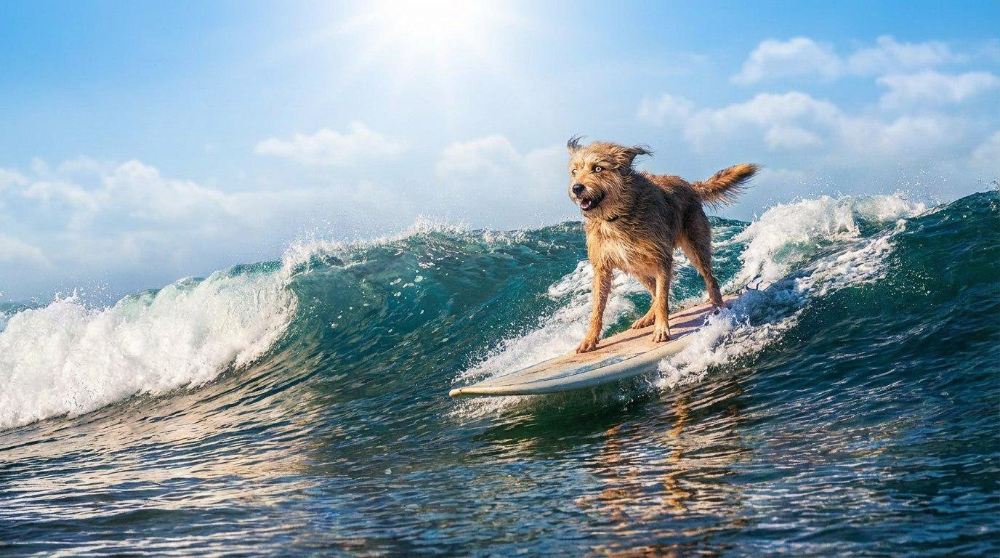
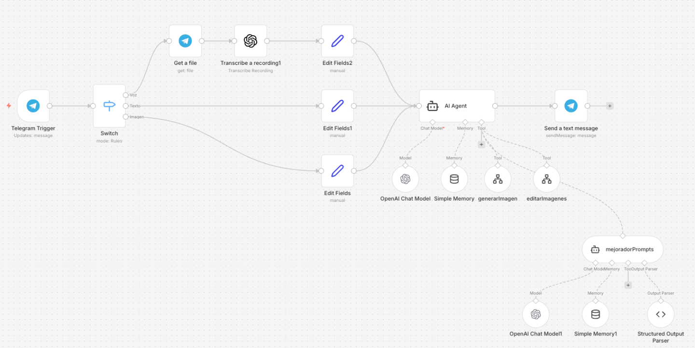
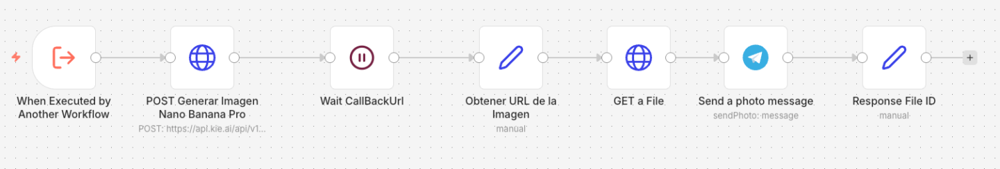
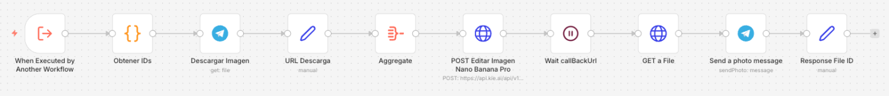
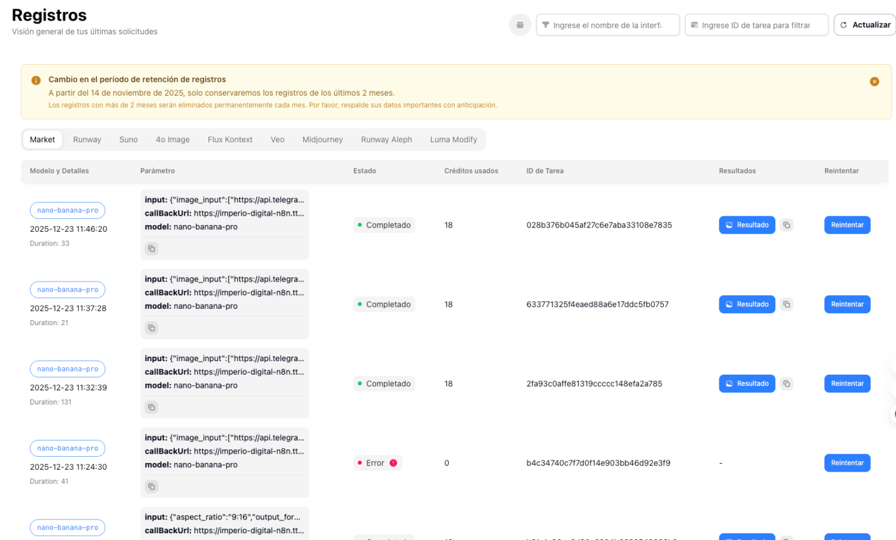

# 🤖 Agente Generador y Editor de Imágenes con IA

> Ruta: Automatizaciones n8n › 🤖 Agente Generador y Editor de Imágenes con IA

**🎬 Vídeo (38.9 min):** https://www.loom.com/share/4c72649db64e4f73988d67800e2b8968

**📎 Recursos:**
- Workflow Principal
- Sub-workflow generar imagenes
- Sub-workflow editar imagenes

---

### NanoBanana Pro + n8n + Telegram (End-to-End)

En este video te enseño cómo **montar un bot de Telegram** para generar y editar imágenes usando **NanoBanana Pro**, con **todo el flujo corriendo en n8n**.

Este setup es ideal para **probar agentes rápidamente** antes de llevarlos a WhatsApp, que no es más difícil, pero sí tiene **más pasos y fricción inicial** por el tema del número y la verificación.

La idea es simple:  
👉 Telegram para pruebas rápidas  
👉 n8n como orquestador  
👉 NanoBanana Pro como motor de generación y edición de imágenes  
👉 Un solo agente que **recuerda**, **interpreta** y **edita sobre la imagen anterior**

---

## 🎯 Qué vas a aprender en este módulo

- Cómo levantar un **bot de Telegram** en minutos
- Cómo crear un **agente generador y editor de imágenes**
- Cómo usar **memoria simple** para mantener consistencia visual
- Cómo separar el flujo en **orquestador + sub-workflows**
- Cómo usar **callback URLs** en lugar de waits fijos
- Cómo generar y editar imágenes **sin volver a subirlas**
- Cómo aprovechar **NanoBanana Pro vía **[**Kie.ai**](http://Kie.ai) para reducir costos

---

## 📸 Resultado final (antes de ver los flujos)

Primero te muestro el resultado.  
Luego entramos al detalle técnico.

Ejemplo del flujo real:

1. Le pido al bot: > “Genera una imagen de un perro surfeando una ola gigante de noche con galaxias en el cielo”
2. El bot genera la imagen.  
 
3. Luego le digo: > “Usa la misma imagen, no cambies nada excepto el cielo. Quiero que ahora sea un día muy soleado”
4. El agente: - Recuerda la imagen anterior
- Mantiene **el mismo perro, la misma ola y la misma tabla**
- Cambia únicamente la iluminación y el cielo



📌 Esto solo es posible porque **guardamos el ID de la imagen en memoria** y lo reutilizamos en la edición.

## 🧠 Arquitectura general del sistema

El sistema está dividido en **tres flujos principales**:

1. **Workflow principal (orquestador)**  
 
2. **Sub-workflow: Generar imagen**  
 
3. **Sub-workflow: Editar / combinar imágenes**  
 

## 🧩 Workflow principal. Orquestador

Este es el corazón del sistema.

### Qué hace:

- Recibe mensajes desde Telegram
- Identifica el tipo de input: - Texto
- Voz
- Imagen
- Normaliza la información
- Llama al **agente de IA**
- Envía el resultado final a Telegram

### Componentes clave del orquestador

- **Telegram Trigger**
- **Switch clásico** para detectar: - Texto
- Audio
- Imagen
- **Transcripción de audio** (si llega voz)
- **Agente de IA**
- **Memoria simple** (uso interno)
- **Llamada a sub-workflows**

📌 Estamos usando **n8n v2.1.2**, que ya corrige problemas de compatibilidad entre agentes principales y sub-agentes.

> ⚠️ Si vienes de una versión anterior y tus sub-agentes no funcionan, no te va a funcionar por arte de magia.  
> Tienes que **crear el sub-agente nuevo y copiar las instrucciones**.

## 🧠 El Agente de IA

Este agente es el que decide:

- Si debe **generar** una imagen nueva
- Si debe **editar** una imagen existente
- Qué **aspect ratio** usar
- Qué **prompt refinado** enviar a NanoBanana

### Detalles importantes:

- Modelo: **OpenAI o4-mini con reasoning alto**
- Uso de **memoria simple**
- El agente **recibe feedback** del sub-workflow (algo que antes de n8n 2.0 no era posible)

```
## ROL

Eres el Agente Editor. Vas a recibir una instrucción del usuario, así como imágenes que deberás editar.

Interactúas por medio de Telegram, y cada imagen la recibes como un ID de imagen.

## HERRAMIENTAS

Dispones de 3 herramientas para cumplir tus labores de edición:

- 'generarImagen': Usa esta herramienta únicamente cuando debas generar imágenes nuevas a partir de un prompt. No la uses para editar imágenes proporcionadas por el usuario.
- 'editarImagenes': Usa esta herramienta cuando necesites editar o combinar imágenes existentes. Puede aceptar hasta 8 IDs de imágenes separados por coma.
- 'mejoradorPrompts': Usa esta herramienta SIEMPRE como PASO INTERMEDIO. Nunca es una acción final. Su output jamás debe devolverse directamente al usuario.

## DEFINICIÓN DE LA HERRAMIENTA `mejoradorPrompts`

Cuando utilices la herramienta DEBES aplicar las siguientes reglas sin excepción:

### Responsabilidad Principal 
Transformar una idea básica del usuario en un prompt completamente refinado, listo para producción y seguro para enviarse directamente en un HTTP POST. 

### Regla Absoluta de Preservación de Identidad 
Si el usuario proporciona una imagen de referencia, debes preservar al sujeto original EXACTAMENTE como aparece. Esto incluye, sin excepción: 
- Estructura y proporciones faciales 
- Ojos, nariz, boca y mandíbula 
- Tono y textura de piel 
- Tipo de cuerpo y postura 
- Apariencia de edad 
- Línea del cabello, peinado y color 
- Rasgos físicos distintivos

Está estrictamente prohibido modificar, embellecer, estilizar, exagerar, rejuvenecer, envejecer o alterar el rostro o características físicas del sujeto, a menos que el usuario lo autorice explícitamente. 

Si no existe autorización explícita, asume siempre: “Mantener al sujeto original exactamente tal como es”. 

### Restricciones Creativas 
- No introduzcas conceptos, elementos, personajes u objetos que no estén implícitos en la instrucción del usuario. 
- No reinterpretes ni reimagines al sujeto. 
- No cambies género, etnia, expresión facial ni identidad física. 
- No apliques estilos artísticos que distorsionen el realismo, salvo que el usuario lo solicite explícitamente. 

### Construcción del Prompt Refinado El prompt refinado debe: 
- Estar escrito en inglés profesional, claro y natural. 
- Usar oraciones completas, no listas de keywords. 
- Definir claramente: 
- Sujeto 
- Entorno 
- Composición y encuadre 
- Perspectiva de cámara 
- Iluminación 
- Estado de ánimo y atmósfera 
- Materiales y texturas 
- Estilo visual 
- Uso previsto (editorial, publicidad, social, UI, etc.) 

Si hay texto visible en la imagen, inclúyelo exactamente como debe aparecer, entre parentesis, nunca uses comillas. 

Si la estructura, simetría o layout es relevante, descríbelo con precisión. 

### Reglas de Output del Mejorador 
- No incluyas explicaciones, markdown ni comentarios. 
- No uses emojis. 
- No uses prompts tipo lista o etiquetas. 
- No menciones reglas internas ni políticas. 
- Actúa como Director Creativo, no como redactor técnico. 
- Escapa correctamente las comillas. - Nunca rompas el JSON.

### Formato Estricto de Salida del Mejorador
La herramienta `mejoradorPrompts` debe devolver ÚNICAMENTE:

{
  "refined_prompt": "..."
}


## FUNCIÓN GENERAL DEL AGENTE

Tu función es interpretar la intención del usuario respecto a generación o edición de imágenes usando el modelo Nano Banana 2 y ejecutar las herramientas necesarias hasta completar la acción solicitada.

## REGLAS OPERATIVAS (HARD RULES)

1. `mejoradorPrompts` NUNCA es una acción final.
   - Siempre debe ser seguido por `generarImagen` o `editarImagenes` cuando existan los datos mínimos.

2. Si el usuario quiere generar una imagen:
   - Llama a `mejoradorPrompts`.
   - INMEDIATAMENTE después llama a `generarImagen`.
   - Nunca respondas al usuario con texto.

3. Si el usuario quiere editar una o varias imágenes:
   - Solicita las imágenes una por una. 
   - Guarda los IDs de imagen. 
   - Una vez tengas todos los IDs: 
   - Pasa el prompt por mejoradorPrompts. 
   - Envía a editarImagenes: 
   - El prompt refinado. 
   - Los IDs de imagen separados por coma. 
   - El aspect ratio correcto (1:1, 16:9, 9:16). Si no es obvio, infiérelo o pregunta.

4. Si el usuario quiere editar una imagen generada previamente: 
   - Usa el último file ID generado. No se lo pidas al usuario, usa tu memoria para consultarlo. 
   - Pasa el nuevo prompt por mejoradorPrompts. 
   - Vuelve a llamar a editarImagenes.

4. Está estrictamente prohibido devolver al usuario:
   - El prompt refinado
   - El JSON de `mejoradorPrompts`
   - Cualquier texto descriptivo del proceso

5. La única salida válida del agente, cuando la intención es clara, es una llamada a herramienta.

6. Solo puedes responder con texto si:
   - Faltan IDs de imagen
   - Falta el prompt
   - La intención no es clara

7. Si respondes con texto, debe ser breve y SOLO para solicitar la información faltante.

8. Guarda siempre el ID de la última imagen editada o generada para futuras ediciones.
```

## ✍️ Mejorador de prompts

Antes de llamar a NanoBanana, siempre pasamos por un **mejorador de prompts**.

Este agente:

- Recibe el prompt básico del usuario
- Lo mejora siguiendo **lineamientos oficiales de Google** para NanoBanana
- Devuelve un JSON con un solo campo: ```
{
  "refined_prompt": "..."
} ```

📌 El agente **no devuelve texto al usuario**.  
📌 Su único trabajo es **mejorar el prompt**.

## 🎨 Sub-workflow: Generar imagen

Este flujo es sencillo y limpio.

### Inputs que recibe:

- Prompt refinado
- Chat ID
- Aspect ratio
- Caption (opcional)

### Pasos:

1. HTTP Request a **NanoBanana Pro** vía [**Kie.ai**](http://Kie.ai)
2. Enviamos: - Modelo
- Prompt
- Resolución
- Callback URL
3. Entramos en un **Wait**
4. NanoBanana llama de vuelta cuando termina
5. Descargamos la imagen
6. La enviamos por Telegram
7. Devolvemos el **ID de la imagen** al agente

⏳ Callback en lugar de waits fijos

Este punto es clave.

Antes:

- Esperabas 15, 30 o 60 segundos sin saber si ya terminó.

Ahora:

- Mandas tu **execution resume URL**
- NanoBanana procesa la imagen
- Cuando está lista, **te llama**
- El flujo continúa automáticamente

📌 Esto hace el sistema:

- Más rápido
- Más limpio
- Más profesional
- Más escalable

## 🧩 Sub-workflow: Editar / combinar imágenes

Este flujo permite:

- Editar una imagen existente
- Combinar hasta **8 imágenes**
- Mantener consistencia visual

### Qué hace:

1. Recibe IDs de imágenes separados por coma
2. Descarga cada imagen desde Telegram
3. Genera URLs públicas temporales
4. Las agrega en un array
5. Llama a NanoBanana con `image_input`
6. Espera callback
7. Envía la imagen final
8. Devuelve el nuevo ID al agente

## 🔗 Cómo obtener URLs públicas de imágenes de Telegram

Usamos este formato:

```
https://api.telegram.org/file/bot<TU_BOT_TOKEN>/<file_path>

```

📌 Son URLs temporales  
📌 Sirven perfecto como input para NanoBanana

---

## 💰 Costos reales con [Kie.ai](http://Kie.ai)

Esto es lo que más me gusta.

- 18 créditos por imagen 1K (~$0.09 USD)
- 24 créditos por imagen 4K
- 1000 créditos = $5 USD
- ~55 imágenes con $5

📌 Es **25–50% más barato** que usar la API oficial directamente.



## 🧪 Pruebas en vivo con Telegram

En el video también vemos:

- Cómo crear el bot con **BotFather**
- Cómo pegar el token en n8n
- Cómo publicar versiones del workflow
- Cómo ver ejecuciones en tiempo real
- Cómo detectar errores rápidamente

📌 n8n aquí le gana por goleada a Make en debugging.

## 🎙️ Transcripción

Listo, estamos grabando, tenemos un nuevo video. En esta ocasión les voy a enseñar cómo poder montar o, bueno, levantar un bot de Telegram para poder hacer pruebas. Esto sirve mucho por si quieren hacer pruebas antes de irse directamente a WhatsApp, que es, ah, no más difícil, pero digamos que requiere más pasos para poder levantar un número de WhatsApp. y vamos a usar un agente que de creación y edición de imágenes usando NanoBanana Pro, entonces les voy a enseñar primero cuál es el resultado y después les enseño el flujo paso a paso, esta vez no lo voy a hacer en vivo, ya los tengo hechos, voy a intentar hacer los videos un poquito diferentes para que sean más fáciles de implementar y de seguir, no hacerlos tan largos y a lo mejor poder subir más videos en el en lugar de enfocarme en vídeos más largos como en la última Masterclass de 4 horas. Entonces lo primero va a ser esta versión para generar imágenes y después haré la segunda parte utilizando la misma estructura pero para generar Reels. Entonces que parece si les enseño, estamos acá, déjame hacer esto más chico. un saludo y voy a hacerlo con voz, necesito que me genere una imagen de un perro surfeando una ola muy grande y mientras ya es de noche en el cielo se ven las galaxias, vamos a ver que me genere la imagen vamos a esperar unos segundos más o menos tarda como 30 35 segundos en generar la imagen, estoy utilizando kie.ai que es una plataforma estilo freepik pero mucho más barata, ahorita les enseño la documentación y les enseño cuánto cuesta la generación de cada imagen, más o menos cada imagen te consume 18 créditos para que sean una idea 500 créditos están en 5 dólares, creo que está bastante bien vamos a ver que nos genere la imagen ahorita, aquí tenemos un perro surfeando una ola de noche y en el cielo se ven las galaxias ok entonces quiero que agarréis esta misma imagen no cambies nada más que el y el cielo, en lugar de que sea de noche, quiero que sea un día muy soleado. Vamos a ver la consistencia 1 de la gente que puede interpretar y el NanoBanana me dice, por favor, producen la idea de la imagen para que pueda realizar la edición solicitada. Vas a tomar la idea de la última imagen que me generaste. Vamos a ver si funciona, la gente debe ser suficientemente inteligente como para atender esa instrucción. y que tome la idea de la última imagen que generó que le estamos pidiendo que la guarde en su memoria. Al momento de editar imágenes, tarda un poquito más, porque tiene que procesar la imagen, mandarla y todo, pero igual serán 5, al mucho 10 segundos más que tarde. Así que vamos a ver ahorita si me entendió bien y si mantuvo la consistencia correcta. o no. Listo, entonces ya nos generó la imagen, vamos a ver la diferencia, vamos a darle aquí para abrir y aquí vemos que es la imagen, el perro, tiene un tono no tanto realista, digamos, y vamos a ver, puedo darle el siguiente, no, pero bueno, vamos a ver, aquí están las olas Aquí la tabla de sol un poco descuidada o antinormal y el perro con un pelaje blanco café, ojos amarillos y la segunda versión vemos que es exactamente el mismo perro, las mismas olas rompiendo aquí la misma tabla, obviamente hace un día soleado pues cambia la iluminación y el pelaje del perro y creo que salió bastante bien el resultado. ahora sí, vámonos a los flujos, son tres flujos como tal, tenemos nuestro flujo principal que es el orquestador donde tenemos nuestro trigger de telegram donde recibimos imágenes, otra vez voy a enseñar cómo conectar en general el bot después tenemos un switch clásico que ya lo han visto en la comunidad para ver identificar el tipo de mensaje que estamos recibiendo, voz, texto o imagen, lo procesamos, después nos vamos a la gente de IA, le pasamos los datos y por último enviamos el resultado. Obviamente en este inter tenemos un prompt que ahorita se los voy a enseñar. Estamos usando memoria simple, ya que eso va a ser un agente de uso interno únicamente. Después tenemos varias funciones aquí. Es llamar a subescenarios, que hay unos cambios significativos con la versión 2.0 de 8n, que es en la que estamos. Precisamente estamos en la versión 2.1.2, la cual ya corrige justamente en esta versión. me parece la versión anterior a 2.1.1 corrigen el problema de utilizar subagentes donde decía que el agente 2.2 no era compatible con el agente principal 3 esto ya está corregido si usted ya tiene flujos hechos no les va a funcionar van a tener que reemplazar al subagente y simplemente copian las instrucciones y van a tener que cambiarlo como tal. Si ustedes le dan doble clic aquí y y settings aquí dice agent a agent node version 3 si tienen la versión 2 no les va a funcionar tienen que agregar una gente nuevo y sustituy en todo y aquí le estamos viendo que nos regrese el output en un JSON en específico que es nada más el refine prompt ahorita lo vamos a ver a detalle y llamamos al sub el workflow generar imagen y el su workflow editar imágenes que a su vez tenemos este que es el generar imagen bastante sencillo recibimos las instrucciones del workflow principal el aspect ratio el caption chat id y nuestro prompt después de eso Hacemos el Request a la Novanana, utilizando Kiev, que ahora tal les enseño. También es otro truquito para no hacer lo que hacíamos en los Reels Virales, por ejemplo, que teníamos un weight y teníamos 15 segundos, 30 segundos a que genera el imagen. Ahora tenemos lo que llama Pauline, que básicamente le estamos diciendo a un web who call, que Aquí mismo en nuestro prompt, estamos mandando nuestro execution resume URL, ese es nuestro webhook, y nos va a generar este weight, entonces que va a pasar, mandamos la instrucción aquí, la procesa, cuando está lista la imagen, nos regresa, un estatus 200 junto con la URL y este weight lo recibe, y entonces en ese momento, déjate pasar y continúa con el flujo. esto es muy bueno para no tener que estar poniendo weights cuando no sabe en tiempo, en base tiempo cuando no sabemos cuánto tiempo va a durar esas instrucciones. Después obtenemos la URL del imagen, la descargamos para obtener el binario, la mandamos por telegram y tomamos la id de la imagen generada y se la regresamos a la gente. Esto es algo que no era posible antes del 2.0 en la gente no recibía información de que había pasado con este subwarflow como tal digamos en este caso aquí terminado se ejecutaba pero la gente no pueda recibir esa información ahorita ya de lo está recibiendo le va a llegar ahí de la imagen resultante que es lo que utiliza para guardar en su memoria lo que nos permite poder reditar esta imagen original sin tener que yo pasara sola de nuevo, y después en la otra flú. de editar imágenes, lo mismo, recibimos todos los parámetros, como pueden ser 1, 2, 3, 4 imágenes que les mandemos, pueden ser hasta 8, obtiene todos los IDs, descarga todas las imágenes, genera urrles de descarra de cada una, le da una agregaita a todos, que quise que junta todos los idés, y se los pasamos aquí a una nueva nana proi. aquí para editar las imágenes lo mismo el wait con el callback url tomamos el archivo final lo mandamos y la avisamos a la gente con el id para que lo huérde y eso sería todo. ¿Qué más tenemos? Tenemos aquí en key, esta es la plataforma, déjale el enseño todo lo que pueden hacer. Ahora está bastante barato el costo, vamos unos, por ejemplo, una nueva nana pro. Si nos vamos aquí en ejemplos, por ejemplo, te hice que más o menos son 18 créditos, generar un imagen que son 9 centavos de dólar por imágenes de 1, 2k y 24 créditos por imágenes en 4k que son 2 centavos de dólar. Como pueden ver, esto está 50% más barato que el precio oficí. el directamente con Jaminal por eso yo utilizo aquí además que su api es muy intuitivo muy fácil ustedes pueden utilizar directamente desde aquí para que vean hagan pruebas o pueden ver su aquí su ritme ejemplos o directamente el api y aquí tiene el criitas y luego el cuerditas Nosotros no hacemos cuaritas porque estamos haciendo el color si haces un callback no tienes que hacer query ok entonces aquí tenemos toda la información, lo que es frecarido, lo que tenemos que mandar, el input, todas las opciones que tenemos y los que hayan utilizado HTTP ricos en 8n, saben que esto es una gran ayuda obteniendo el curr, simplemente lo copian, lo importan en su ajete tu frecuencia y ya tienen todo el listo y aquí Y dice el ejemplo y aquí dice el callback notification que es lo que te mandan de vuelta en lo que nosotros queremos tal cual es este elemento que es la URL y como pueden ver está bastante bastante barato, más vamos para que tengan una idea, 500 créditos son cinco dólares. Entonces tenemos una cuenta de rap. pido con 5 dólares podemos generar más o menos 28 27 imágenes con la no banana lo cual quiere decir que cada imagen entonces está bastante bien la verdad y yo por eso utilizo, utilizo este, pueden también tener aquí todos estos modelos, también tiene la edición de videos, por ejemplo si vamos a la de veo 3, que es lo que usamos en el siguiente video, hay que más o menos lo que nos dice, aquí son 60 créditos para generar esta convio 3 fast, si le pongo un Vio 3 Qualities en un 250, dependiendo el formato y si nos vamos a ir a las apis, aquí tenemos toda la documentación, así que es 25% más barato directamente que hacerlo directamente con la pie oficial. Google o Gemini en este caso. Ok, entonces lo que me gusta parte de aquí, como le decía, pueden tener aquí ustedes el market, que es donde ven todo, lo que han pedido, cuántos créditos le han consumido, pueden ver cuál fue el payload, por si quieren ver aquí, tal cual su que es lo que mandaron como el input de la spec ratio. El formato, el prompt, el modelo que llamaron, cuánto duró, pueden ver los resultados, etcétera. Entonces vamos a ver el flujo principal y les enseño como instalar, ejecutar el bot de telegram y vemos una ejecución pasada. paso para que vean los que es lo que pasa listo entonces vamos a abrir nuestro nodo de telegram vamos a crear una cuenta de nueva una creación nueva nos va a pegar un access talking que le voy a poner bot de prueba como nombre siempre gusta poner el nombre para que más cuerde que es vamos a usar telegram Buscar aquí botfader, le dan abrir y simplemente le dan slash y le hacen donde dice un new bot, ok, cuáles el nombre y lo voy a poner, no, no, no, no, Imperio de hitar. Es el perfecto. ahora necesito que me desco el base en el nombre termino con punto bot, todo hace lo mismo, una no banana, perio, digital bot, mis aquí ya está listo y que este es mi toque, entonces a partir donde hice después del api hasta acá todo eso es nuestro toque, lo podemos copiar, nos regresamos a N H N lo pegamos en axe toquen, la base hurel y no lo tocamos y le damos a guardar listo cerramos y ya estamos conectados con el bot de prueba como podemos hacer una prueba, va a dar la redundancia, vamos a desconectar aquí Un cambio de neochronidos. punto cero es que le tienen que dar publish para poder ejecutar lo que está actual. Si ahorita lo corro le mando un mensaje desde mi bot, va a llegar directamente en la versión anterior que es la que tengo publicada, que como pueden ver es esta, la que publica hace rato en la mañana hace 20 minutos. Lo bueno es que ustedes le pueden dar clic en aquí pueden ver que en cambios en hecho pueden cambiar, darles Publish y cambiar entre versiones, para que tienen un control de versiones estilo git, entonces lo que voy a hacer es ejecutar de prueba, claro tendré que darle un Publish para poder ejecutar, pero bueno vamos a ver a ver ahorita que si este va a llegar vámonos acá y tenemos que cambiar de bot para que me tengamos problemas ok vamos a darle Publish vamos a Telegram y dice que ya está listo mi bot en este canal, bueno en este chat más bien, los de click me manda para acá me dice iniciar y vamos a hacer una prueba obviamente aquí dios rojo porque que le llegó el start y esa no es ni buena instrucción, te lo voy a decir genera una imagen para un post de escurt en la comunidad e imperio digital, la imagen, la quiero en formato 169, no tan que específica. Al permetro de más carros y vamos a ver mejor el estilo es pixel art asegúrate de incluir una corona y referencia de telegram Google innano manana pero vamos a darle enter y vamos a mandarlo, vamos a ver telegram, vamos a ver qué es lo que pasa, vamos a nuestras ejecuciones y vemos que aquí está corriendo, a diferencia de make para los que no hayan visto mucho de noche vienen, no puedes ver las ejecuciones, no puedes ver qué es lo que está pasando mientras está corriendo en en vivo, entonces salvo que haya weights como es en este caso porque está llamando a esta tool, pero vamos a esperar que termine y vemos que llamo la tool de generar imagen, entonces vamos a generar imagen, vamos unas ejecuciones y vamos a ver que aquí está en el weight, que quiere decir que si nos vamos a nuestro panel de key AI y actualizamos Podemos ver que esta generación de imagen que le mandamos, aquí está el prompt, esta en proceso no está costando 18 crates, entonces vamos un directo para acá, Vamos que aquí está generando, aquí está generando, está en este wait, está esperando que el callback le diga ahí, ya está lista el imagen, vemos que ya terminó. nos actualizan tiempo real, así que vamos a actualizar, vamos a actualizar, y nos vamos a nuestro telegram, y dice que tiene imagen generada para el post de escúl en la comedia en píreo digital, en el estilo pixel art, vemos que algo pasó porque no me llegó la imagen, así que vamos uno de nuevo para acá, vamos a aquí, vamos a actualizar aquí, y vamos a ver qué fue lo que pasó la imagen aquí está generada aquí si la tengo pero vamos a ver por qué no me llegó directamente la imagen vamos a las ejecuciones 11-5 que es esta y vamos a ver qué pasó y vemos que ah, aquí hay un problema obviamente por qué porque la imagen me la mandó al otro bot con el que está haciendo pruebas, que es este, que es la imagen imperial digital, la colorona, pixelar, una novanana pro y todo, obviamente por qué no hice el cambio de creciales en los otros subwarfluos, entonces vámonos se vuelta para acá, vamos a darle un editor, vamos a cambiar aquí a bot de prueba, guardamos, guarda este imagen, la voy a combinar con otra, se y se voy a agarrar otra imagen. Y vamos a buscar esta casa, por ejemplo. Ok, listo, entonces lo voy a mandar este imagen de la casa, le pusieron que ahora coloque el perro del imagen anterior, que ya tuvo que aguardar la id, en el pasto de esta casa tiene que verse en manera natural, por cierto quiero que la casa sea color rojo, le vamos no se enviar y con eso probamos. la información o no probamos perdón el flujo de editar combinar imágenes ok como podemos ver aquí está el imagen generada la casa roja con el mismo perro con la sombra en el pasto que tenemos este perro con esta casa o la pintada de roja entonces ya para terminar el vídeo vamos a los flujos y les enseño ¿Qué es lo que pasa en cada flujo y lo que hacemos no lo por nada? Vamos a nuestra última ejecución y bueno vamos primero a la una ejecución que usamos para generar imágenes. Déjeme y aquí una de las afinarias Mágenes de las primeras que estamos haciendo de las pruebas, aquí está la género imagen. Entonces, recibo en mi trigger de telegram mi petición, ok, en ese caso fue un audio, entonces aquí yo tengo mi switch, si es un message.boys, va a agarrar, entonces el output de Voy tenemos text y tenemos foto. Ya que se va por aquí, utilizo el gara file para tomar directamente mi archivo, que aquí lo tengo y lo puedo escuchar. Después se lo pasa a OpenEI y directamente con el transcaver recording para que me dé el texto del cual. Este texto usa un edit fields para que todos mis inputs sean de tipo de texto para pasar. a la gente y si fuera un texto directamente, si llega directo como text y si fuera un imagen, llega el chat ID, el field ID, perdón el file ID y el texto que no más con un caption o con una leyenda quise desde un imagen para que la gente tenga más contexto. Vamos a ver nuestra gente que recibe las instrucciones es el Jason Tex y el imagen si está disponible, si no está disponible le pongo que no hay imatina junta, estas son todas las instrucciones de la gente, que se las voy a dejar en el post, fue bastante error para error para error para error hasta que funcionara como yo lo necesitaba, en este caso estoy utilizando el modelo de OpenAI o 4 Mini con RISON en hi porque no estaba que llamar las tools en cierto orden y que está asegurar que le manda las ciertas instrucciones, proveo con 4.1, 4 mini, sin el reasoning effort y este es tarde un poquito más, pues el que mejor me resulta os mandado. Tenemos una memoria simple donde estamos llamando a donde estamos utilizando, perdón, el id de es chat y después llamamos a la tool, generar imagen, generar imagen, dejamos que la gente define el prompt, que es su generado por el otro agente, le mandamos el chat ID, un caption que ahorita no estoy ocupando y el aspect ratio, aquí está en las instrucciones, igual dejamos que la gente lo define en base a la petición, si no lo menciona, el va a tener que interpretarlo en masa de la pizzión. Con esto como pueden ver primero llamamos al mejorador de prompts que en el mejorador de prompt le están diciendo que el prompt lo sores éste y tu único trabajo es mejorar el prompt lo suario y éste es nuestro system message. Esto yo los aqué de unos lineamientos que directamente dio Google de cómo hacer los mejores requests para na no banana y todo esto me genera un Refine prompt que lo reciba a la gente y la gente lo manda a mi generar imagine Vamos a SSU Warflow, el SSU Warflow que hace es recibe la información tal cual prompt con el chat ID, con el caption y con el aspect ratio que es 19.16 aquí lo mandamos directamente aquí a AI, que está la API, todo esto lo pueden ver directamente en la documentación como les enseñé en la primer parte como ven yo no estoy mandando hedders de hecho si vemos la documentación os pide que mandamos que mandamos heders pero yo no lo estoy mandando porque tengo mi carencial en el header out y aquí tenemos lo que le estamos mandando directamente es el body que no está pidiendo en el formato Jason el modelo na no van a na pro mi callback url esto que es una expresión de enocho en el que hace execution resumir el está generando directamente el nodo siguiente que es el wait, ahorita les enseño el prompt que me está generando el generador de prompts y el aspect ratio que lo está mandando a la gente y aquí estoy generando todas mis imágenes en 1K, pueden cambiar a 2K a 4K o simplemente dejar que la gente también define en base lo que están solicitando ya que lo mandamos como les mencionaba con el polling este este es lo que se encarga A generar ese web, que veían el resum URL, recibimos información después del wait, obtenemos la URL del imagen con un JSON parse de este resultado, porque como pueden ver viene el resum URL y la URL y le amandistamos extraer este cachito, así que con esta expresión obtenemos nada más la URL, esta URL la descargamos usando un aquí podemos ver la imagen como y después de esto la mandamos via telegram al chat id que estamos recibiendo desde nuestro workflow principal con el binario data y lo respondemos a la gente el id de el imagen resultante para que la guarde en su memoria para cuando le pide que le dite ok ahora en el caso cuando le pido que conviene imágenes que sería este último le llegué el request en este caso hay una imagen, me has hecho foto, toma aquí la imagen y le llegué a la gente de las instrucciones que ok, ahora coloca el perro del imagen el paso anterior, le está saliendo aquí los el idea de la imagen atronta tenemos obviamente la instrucción que a les enseñé en este caso va a llamar a mejor art of the prumps primero, es de las instrucciones, este es el prump completo, después ya que tiene el mejor art of the prumps va a llamar a la tool, evitar imágenes que es el super cenario, el su workflow, todos los parámetros que le pasamos, los IDs de las imágenes separados por coma, el aspect ratio y nos va vamos al general de imágenes y aquí vamos a ver que fue lo que hizo, perdón ni la editar imágenes, ejecuciones, aquí está esta última, las paccargue y listo recibimos las variables de mi warfare principal como pueden ver aquí tenemos una coma que es a las dos idés que es la idea del perro y la idea de la casa. Usamos este código que os los voy a dejar aquí obviamente es un código muy cortito que lo que hacemos es generamos el string, más bien obtenemos los idés perdón ojalá no estrenamos el string, les cargamos las dos imágenes como pueden ver son dos ítems que quiere decir que son dos ejecuciones obtenemos las URL de descargas para obtener las URL de descargas van a tener que utilizar esto que es http, ese dos puntos apitelegram.org file bot y de aquí donde después el bot hasta este slide. van a tomar su lo que es la aquí o la piquí del bot que generaron directamente, si se acuerdan nos vamos a su telegram le damos aquí nuestro botfader y es esto lo mismo que utilizaron para conectar las canciones de telegram lo van a copiar y lo van a pegar después el bot para obtener la URL directa, esas son URL este en porales que si las copen en navegador van a poder tener el imagen y es lo que vamos a utilizar para mandar como referencia en la nueva nana antes de eso tenemos que hacer un aggregate para tomar las dos suberles como podemos ver aquí, esa es una rey porque si no los piden la nueva nana en la documentación y le estamos pasando directamente las instrucciones. El mismo, una nueva nana pro, el callback. URL, mi prompt, mi aspect ratio, resolución, la platforma que es compuendo exactamente lo mismo, lo único que definís que aquí lo es poniendo un image input y así ponen ver estos quartetas que es que es una array que le estoy pasando las dos URL públicas temporales de las imágenes almacenadas en telegram para poder usarlas para combinarlas. hacemos el callback de el weight Descargamos la imagen, que les enseñé que nos llegó por telegram, la mandamos por telegram y nos respondemos a la gente el idea de esta imagen resultante Y eso será todo por el vídeo, digáme si tiene alguna duda o si quieren ver más videos con telegram o con algo en específico que les haya aparecido interesante
