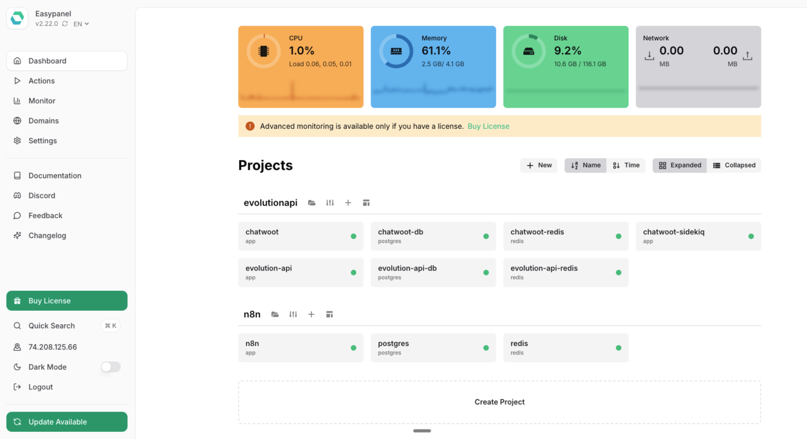
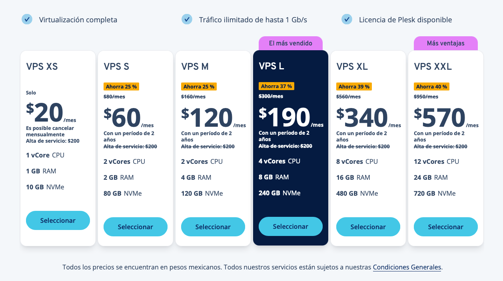
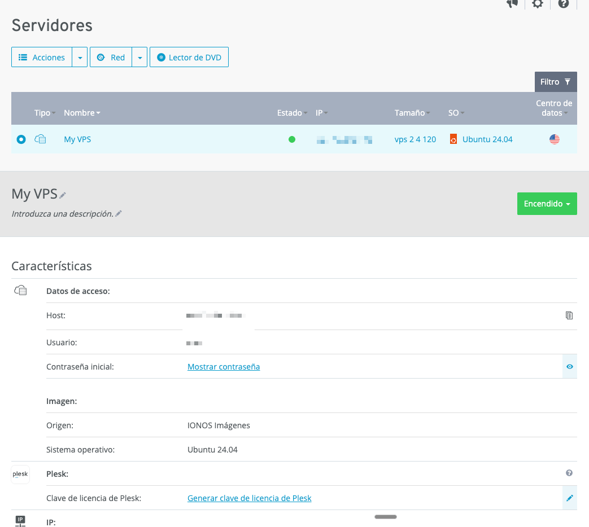
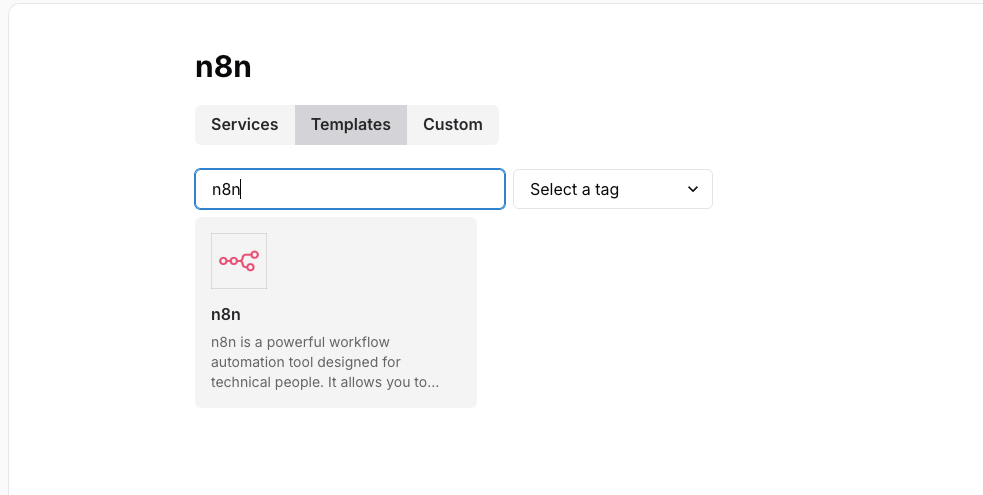
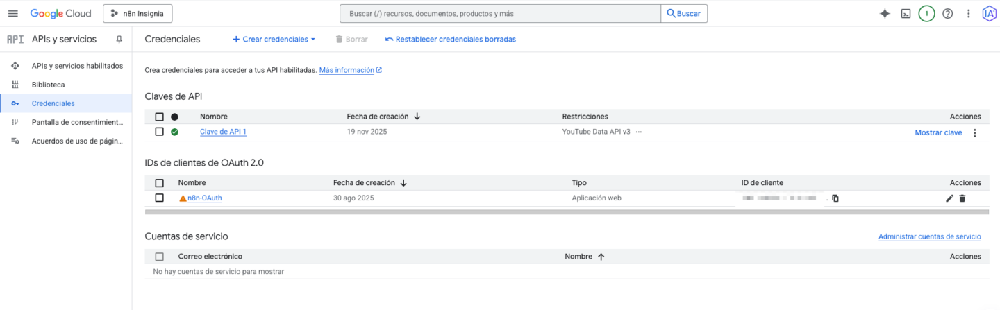

# 🎥 Instalación y configuración de N8N en VPS

> Ruta: Automatizaciones n8n › 🎥 Instalación y configuración de N8N en VPS

**🎬 Vídeo (77.8 min):** https://www.loom.com/share/af37bfb888ad45dd8856f41c2c868e0f

---

Hoy les traigo una instalación de n8n self-hosted que quedó realmente brutal.

Con este setup puedes tener tu propio n8n en un VPS barato, listo para correr automatizaciones en serio, sin depender de la nube oficial.  
Pagas centavos al mes, escalas cuando quieras y puedes montar flujos para tu negocio o incluso para clientes.

Toda la instalación se hizo en vivo. Desde elegir el proveedor hasta dejar n8n corriendo con dominio propio, EasyPanel y credenciales de Google conectadas.

📌 ¿Qué vas a tener al final?

Con este flujo terminas con:

- Un VPS Linux optimizado para n8n
- EasyPanel instalado para gestionar todo por interfaz gráfica
- n8n corriendo con la última versión estable
- Dominio propio tipo `n8n.tudominio.com` y `easypanel.tudominio.com`
- Certificados SSL activos
- Volumen de disco configurado para guardar binarios
- Conexión completa con Google (Gmail, Drive, Sheets, Calendar, etc.)

🔧 Paso 1. Elegir el VPS correcto sin quemar dinero

En el video revisamos varias opciones típicas para Latinoamérica.

- Hostinger
- HostGator
- Google Cloud
- Ionos

Conclusión directa.

- Para producción muy grande y súper escalable. Google Cloud. Pero es más técnico y complejo.
- Para algo realista, barato y suficiente para agencia o negocio. Ionos VPS Linux gana en relación precio vs recursos.
- Un XS o M sirve para empezar a jugar. Con 4 cores y 8 GB de RAM ya tienes algo serio para producción.

🖥️ Paso 2. Crear el VPS en Ionos y preparar acceso

Flujo básico que se siguió.

1. Elegir VPS Linux, no Windows. - Linux consume menos recursos y está pensado para servidores.
2. Seleccionar plan (ejemplo. 4 cores y 8 GB de RAM) con pago mensual o anual.
3. Escoger ubicación del servidor en Estados Unidos. Latencia perfecta para México y Latam.
4. Sistema operativo. Ubuntu 22.04 LTS.
5. Finalizar compra, esperar a que el VPS arranque y copiar. - IP del servidor
- Usuario root
- Contraseña inicial

🔐 Paso 3. Conectarte por SSH y montar EasyPanel

Para administrar todo sin sufrir con consola en crudo, usamos EasyPanel.

1. Conectarte por SSH - En Windows. PuTTY
- En Mac o Linux. SSH directo por terminal
2. Usuario. `root`
3. Pegar la contraseña del VPS desde el panel de Ionos
4. Ejecutar el script oficial de instalación de EasyPanel que te da su web - Lo pegas en la consola y lo dejas trabajar
5. Cuando termina, entras a EasyPanel vía navegador usando. - `http://IP_DEL_SERVIDOR:3000`

Ahí creas tu usuario y contraseña para EasyPanel.

⚙️ Paso 4. Instalar n8n con plantilla en EasyPanel

Dentro de EasyPanel.

1. Ir a `Servicios` o `Projects` y crear un nuevo proyecto llamado `n8n`.
2. Abrir la sección de plantillas.
3. Buscar `n8n` y usar la imagen oficial.
4. Ver la versión estable en GitHub Releases y ponerla en el campo de versión. - Ejemplo. `1.108.2` si esa es la última estable.
5. Crear el servicio y luego darle `Implementar` para hacer el deploy.

EasyPanel levanta el contenedor y te da una URL temporal tipo.

- `http://algo.random.easypanel.app`

Con eso ya puedes entrar al setup inicial de n8n y crear tu usuario admin.

🌐 Paso 5. Conectar dominio propio y DNS

No tiene sentido quedarse con la URL fea. En el video se conectó un dominio tipo `agenciax.com` usando HostGator como registrador, pero la lógica aplica para cualquier proveedor.

Queríamos dos subdominios.

- `n8n.agenciax.com` para el editor de n8n
- `easypanel.agenciax.com` para el panel de EasyPanel

Pasos.

1. En EasyPanel. - Ir a `Dominios`
- Agregar `n8n.agenciax.com` apuntando al puerto de n8n
- Agregar `easypanel.agenciax.com` apuntando al puerto 3000
2. En el panel DNS del dominio (HostGator en el video). - Crear registro A para `n8n` apuntando a la IP del servidor
- Crear registro A para `easypanel` apuntando a la misma IP
- TTL bajo (600s) para que se propague rápido

Después de unos minutos, ya podíamos entrar a.

- `https://n8n.agenciax.com`
- `https://easypanel.agenciax.com`

🔒 Paso 6. SSL y variables de entorno clave

En EasyPanel se gestionan los certificados automáticamente, pero puede tardar un poco en emitirse el SSL. Una vez activo, desaparecen los avisos de sitio inseguro.

En el proyecto n8n configuramos variables importantes.

1. Activar nodos de la comunidad. - `N8N_PACKAGE_MANAGER_ALLOW_BUILTIN` = `true`
- `N8N_RUNNERS_ENABLED` = `true`
2. Crear un volumen de almacenamiento para binarios. - Nombre. `binary_data`
- Path. `/home/node/binary`  
Esto permite guardar imágenes, PDFs, etc. en disco y reutilizarlos entre escenarios.

📩 Paso 7. Conectar n8n con Google (Gmail, Drive, Sheets, etc.)

Aquí es donde la instalación deja de ser “demo” y pasa a “herramienta real de trabajo”.

Se configuró todo por Google Cloud Console.

1. Crear proyecto en Google Cloud. - Nombre. algo tipo `n8n-agenciax`
2. Activar APIs necesarias. - Gmail API
- Google Drive API
- Google Sheets API
- Google Calendar API
- Cualquier otra que vayas a usar (Search, etc.)
3. Configurar pantalla de consentimiento OAuth interna (si solo la usas tú o tu organización).
4. Crear credenciales OAuth tipo “aplicación web”. - Agregar URIs de redirección. - `https://n8n.tudominio.com/rest/oauth2-credential/callback`
- Versión sin `callback` por si la quieres reutilizar después
5. Copiar `client_id` y `client_secret` en n8n dentro de las credenciales de Google.

En el video se conectaron.

- Gmail. para recibir correos y disparar flujos
- Google Drive. para crear carpetas y subir archivos
- Sheets y Calendar se dejan listos para configurarlos igual

🧪 Paso 8. Test rápido dentro de n8n

Para probar que todo estaba bien.

- Se creó un trigger de Gmail para “message received”
- Se conectó con la cuenta de la agencia
- Se probó con `Fetch test event` y se trajo un correo real de bienvenida de Google
- Se añadió un nodo de Google Drive para crear una carpeta de prueba y confirmar que la credencial funciona

Con eso ya quedó demostrado que la instalación está bien conectada, que el dominio funciona y que Google responde.

🚀 ¿Por qué este setup es tan potente?

Porque te da.

- Control total sobre tu infraestructura
- Costos ridículos comparado con SaaS tradicionales
- Escalabilidad real. puedes subir de plan en el VPS en minutos
- Posibilidad de alojar automatizaciones para clientes y cobrarles mensual
- Libertad para montar extra. Telegram, WhatsApp, APIs propias, scrapers y lo que se te ocurra

Este es literalmente el “backend de automatización” que muchas agencias y negocios necesitan pero no tienen.

## 🎙️ Transcripción

Listo, buen día a todos. Listo, ok, otro video más, vamos a compartir en la comunidad, eh, cada vez hay más personas sin quietas por utilizar en 8N, así que decidimos grabar un video aquí, yo ya había prometido hacer mucho tiempo y no lo había hecho, ahorita tomando de pretext, un buen pretexto de la gente está aquí con Cristian, para los que ya nos conocen somos bastantes activos en la comunidad y ya por fin nos decidimos en montar nuestra agencia de y hay automatizaciones entonces necesitamos instalar en hn para nosotros porque lo que usamos es para nuestra empresa y pues decidimos grabar un vídeo donde explicamos paso a paso cómo instalar lo cómo configurarlo vamos a llegar hasta cómo conectar las creenciales, configurar los dominios y todo y antes de eso vamos a ver cuáles son las diferentes opciones que tenemos, nos vamos a enfocar más que nada en servicios o productos que están disponibles para Latinoamérica, que sea algo bueno, relación, calidad, precio, vamos a comparar cuatro opciones en la comunidad existe una de Railway, no vamos a tocar eso, vamos a comparar cuatro opciones, cuáles las diferencias y por qué estamos escojiendo nosotros, vamos a hacer instalación de cero, vamos a utilizar Isipanel para administrar y les vamos a ir enseñando un poco. Entonces, Cristian, si quieres vamos a empezar, mostrando la página de N8VN, que es lo que tenemos que mencionar que lo vamos a hacer en la computadora de Cristian, porque vamos a la instalación desde cero, yo estoy utilizando Mac, entonces creemos que es mejor hacerlo en una computadora con Windows que creemos igual que lo que va a tener la mayoría que quiera seguir este vídeo. Esto es la página de un 8N como ya muchos han investigado, saben, puedes tener tu versión cloud así como los que ya manejamos en en Mac y vemos que cuesta 20 dólares la versión Starter, 50 la Pro en la Starter si le puede dar un poco para abajo, Cristian, vemos que tenemos cinco ejecuciones concurrentes que quiere decir, que cinco ejecuciones al mismo tiempo, es como que la mayor limitante y en la versión pro tiene 20 al mismo tiempo. Sin embargo, si nos lo vamos arriba, donde dice self-hosted. Ok, ahí vemos que para Business, 1667, lo bajo, luego la derecha dice Enterprise y mucha gente diría oye, pero me dijeron que era gratis como 1667, bueno, ves la versión tal cual como Celstead, pero sigue siendo directamente en ocho N, en ocho N es de colo iba a de la comunidad. Es gente que, como escoyo que ha abierto es decir, tomarlo, poner las instrucciones en carga de actualizarlo para que uno pueda trabajar con eso directamente instalándolo. Dale donde dice View Dogs y nos va a mandar a toda la información de N8N, donde te explica tal cual como justiar, como puedes hacerlo instalando Docker, se puede instalar en tu computadora, tal cual tú puedes levantar un servidio en tu computador, instalarlo sin embargo, y lo tenemos en local, tenemos varias limitaciones de varias cosas que no van a funcionar por dentro de las más comunes y que más utiliza el agento para lo que más quiere en 8n, es que WhatsApp y Telegram, por ejemplo, no funcione el local. Entonces, por eso no lo hacemos, vamos a instalarlo, vamos a utilizarlo desde un VPS, que es un virtual private server, un servidor privado virtual, en este caso os cogeramos uno que tenga Linux con Ubuntu y para eso estuvimos haciendo una pequeña investigación buscando las opciones más populares otra vez en Latinoamérica y tenemos cuatro opciones. La número uno es Hostinger que algunos de la comunidad ya tiene su N8N aquí en Hostinger y la otra opción es yo nos, que yo nos personalmente es la que nosotros utilizamos para la empresa, luego tenemos HostGator, que también es bastante popular en Latinoamérica y luego tenemos una muchísimo más robusta, pero por lo mismo complicada hacerlo nativamente con Google Cloud, si ya tienes un Google workspace lo puedes hacer, todas las cuentas te dan 300 dólares de crédito, lo cual tal cansa para muchísimo para poder empezar sin tener que pagar ni un solo peso ni un solo dólar, depende de dónde sea, pero las complicaciones de instalación son muchísimas, sin embargo si ustedes van a utilizar N8N para levantar la producción a nivel masivo a nivel grande, Google Cloud es una muy buena alternativa porque evidentemente está respaldo por Google, un empresa enorme, y puedes ir creciendo y agregándole diferentes servicios, lo cual es muy bueno para la que esa robustez, pero si requiere un conocimiento técnico mucho mayor que las otras. Ahora, dentro de de mismo Hostinger y HostGator, vamos a tener dos opciones de Hosting del BPS, entonces si quieres vamos creciendo nices servicios y vamos a buscar el que dice Cloud Hosting. Ok, ahí donde dice Cloud Hosting, vamos a dar el para abajo, ese es el hosting que tú puedes comparar, digamos, tienes, estás comparando el acceso a esa computadora, esto es lo que no es lo que nosotros necesitamos, vamos a verlo a través de servicios. Esto es más para indicaciones en pesos mexicanos que sería equivalente más o menos unos $ $ $ $ $ $ $ $ $. ¿Más o menos? Vamos de nuevos servicios. Y si se figas del lado derecho y se bpc y abajo y se bpc, hosting bpc, Neochrony. Qué quiere decir? Hostinger ya te está dando un bpc con Neochrony pre instalado. Para las personas no técnicas, esto es muy bueno porque no tienes que conferir básicamente nada, compras, pagas, haces un diplo y ya tienes acceso directamente a en 8N y a lo empieza a usar. Si nos vemos, esos son los paquetes que tienen, KBM1248, cual la diferencia, vemos que es un núcleo, 2 núcleos, 4 núcleos, 8 núcleos, imagino que por eso son los nombres, 4 llegas de RAM, 8 llegas de RAM, 16 gigas de RAM 32 gigas de RAM, 50 de sólido, 100, 200, 400, ancho de banda, 4, 8, 16, 32. Ahora, para hacer pruebas, para empezar, ¿qué quiere decir que si quieres estar en 8N, quieres empezar a jugar con él, quieres instalar, hacer pruebas con tu correo, gulchits, inclusive un chatbot en WhatsApp o en Telegram de prueba, con el paquita más base con todos, este va a ser suficiente para empezar, ya cuando lanza producción y vas creciéndolo y nuestra recomendación sería mínimo 4 núcleos y 6 de RAM que seran 192 pesos al mes, pero este es como por una promoción si pagas como que todo el año y se renova por 500 pesos al mes que va a ser como bueno 455 que es como 25 dólares más o menos, ahora esa es la versión que ya viene con N8N instalado, pero por lo mismo tiene ciertas limitaciones. Si eres una persona no técnica, está bien, te lo recomendamos, porque también te viene como con 100 escenarios para instalados que puedes utilizar. Dale para atrás, por favor, Cristian. Dale donde dicen nada más BPS sin N8N y vamos a darle para abajo para elegir donde dice el IG, bueno, ahí están los planes. como podemos ver son me parece que son prácticamente el mismo precio tenemos dos lligas está bien si lo pudieras sabrir en otra pestaña como para poder comparar vamos a ver 192 192 4 p6 200 teras 16 regalasate ok es exactamente lo mismo pero la diferencia es que uno ya viene con en 8N y el otro no. Y a mí no personal me gusta instalaros de cero porque puedes utilizar disciplanel, puedes utilizar disciplanel, puedes utilizar varias cosas y te permite tener mayor control del que está haciendo controlar tus variables en torno, controlar la memoria si quieres utilizar directamente tu poder cofiar mejor un redis o levantar algún otro servicio más adelante que en su momento van a grabar un video como levantar Revolution API es mejor si solamente que es el 8n es una pasada notecnica la versión con el 8n para instalado está bastante bien también ahora vámonos a hosgator para comparar vámonos igual a donde dice a hosting y donde dice del lado derecho dice servidor bps con cipanel y bps en 8n igual vamos a abrir los dos para comparar, vamos a ver si que es prima la versión con el N8N, vamos a ver los planes y esto es el precio que te da directamente josgator, aquí tenemos un poquito más de opciones y si le damos para abajo, vamos a ver, vamos a intentar buscar equivalentes, por ejemplo, cuatro cores con 6 GB de RAM, cuesta 202 pesos de mexicanos que vienen siendo más o menos como unos 9 dólares y Joss Gairor vamos a ver su versión equivalente de 4 cor, la de 4 cor tiene 16 GB, entonces como vemos en Hottinger está más económico a un mejor precio, esa no es. Está a un mejor precio y está más barato y te da mayor capacidad. ahora vamos a ver la versión de hostgator pero con n8n empli instalado si que haya sido rara de hostinger o minimisela ok ok esta es la versión el que estamos viendo es con n8n este sin n8n el que tú lo tengas a instalar aquí vemos que tenemos el de cuatro núcleos con seis llegas de RAM y el siguiente es de cinco núcleos con ocho y si se defiga en aquí no es que que ya teniendo de ninguno con 16 llegas de RAM. Entonces, HostGator es mucho más caro para esto. Pero también exista la versión. Si ya tienes tu host, si ya tienes tu dominio, si te gusta, lo puedes utilizar, la verdad tienen muy buen soporte. Pero si es más caro. Y vamos por último a Google Cloud si quieres antes para que les enseñemos. En Google Cloud, ahí dale para abajo. y vamos a ver donde dice la opción de crear un VM. Ok, primero entonces cará un proyecto, dale para atrás. Ok. Y también de lado derecho, dale para poco para abajo, dice que crea un cluster de Kubernetes. Esa es la tecnología, es una tecnología de Google y ese es lo que tendríamos que hacer para poder levantar un VPS. Es un proceso mucho más técnico pero que lo repetimos, es mucho más robusto y fácil de escalar. Si tienes una agencia muy grande o si tienes un cliente muy grande y le quieres levantar un NHVN y va a tener una atención a clientes 24-7, de múltiples agentes, esa podrá ser una muy buena opción que te va a permitir escalar. Y si a esto lo parejas con el CDN de CloudFell, básicamente tienes un servicio corriendo 24-7 que no se te va a caer. No lo vamos a utilizar, obviamente, por cuestiones de complejidad de precio. Vámonos a Yonos, que es la plataforma que decidimos utilizar. Ok, entonces vamos los niches servidores, vamos a los donde dice servidores virtuales, VPS con Linux. ¿Por qué, por ejemplo, Carlos, ahí, para la pregunta que pudiera ser para lo demás? ¿Por qué con VPS con Linux y no VPS con Windows? Por sí, sí, o vamos a ser la comparativa de ambos. ¿Por qué? Porque la gente que conozca de servidores sabe que no te comienos servidor Windows, a menos que duses algún software o algún programa exescrusivo de Windows, Linux consume muchísimos menos recursos, que si es un poquito más técnico porque tienes que confiar de consola, el BPC de Windows muchas veces también tienes que iniciar y confiar algunas cosas de consola, pero tiene mucho mayor consumo de recursos, tienes que levantar más cuestiones como de de de creensiales, administrar de redes y Linux está más pensado para para para esa parte de servidores y sobre todo para servidores virtuales se estila muchísimo más Linux porque es mucho más amigable con los recursos. Y a todos los miembros de la comunidad que estén viendo este video que estén interesados en utilicellanos, les recomende simplemente que se vean por VPS Linux. Igual que nosotros lo haremos. 100% de hecho si todo lo que ves de hostinger, hostinger, todo lo que viven y si ya te da la opción, ahí te dan Linux de cajón. Ah, ¿qué es el default? Ah, bueno, bueno, la referencia. OK, entonces, vamos a servir los Linux. Vamos a grundice de ver planes. Y vemos que estos recuerden, esos empezos mexicanos, como pueden ver, el XS que es suficiente para empezar. Es si es nada más un núcleo, si nada más es un giga de RAM. Pero para hacer pruebas es suficiente. Yo con este empecé y tenía montado una gente telegram y me corría. Nunca tengo ningún problema. y pagaba 20% al mes que al tibet cambio actual es menos de un dólar, es una gilense pagar un dólar al mes por tener una gente de telegram levantado en el hecho y es todo lo que pagaba, entonces es muy bueno para empezar para hacer pruebas y después tenemos el, por ejemplo, 16 llegas de RAM y 8 núcleos en 340 pesos, esto me parece que si pagamos anual, de verdad le dicen a ver si hay alguna opción como para cambiar a mensual, para abajo, no verdad, ok, creo que me parece que esto es anual, pero este precio de escuento es cuando pagas por delantado, si pagas 24 meses que quiere seguir dos a dos años por delantado, te van a dar ese escuento, también va a importar donde estén ustedes ubicados y donde van, esa también la María de sus clientes porque ahora tiene que escoger la ubicación del sentido, como tal Jonas, y es algo que nos que notamos en muchas partes, que tendremos preso muy exiles cuando te descris por dos años, por tres, por uno, y pues de verdad, ¿******* ahí depende del alcance, el scope de lo que ustedes consideren o también? ¿Qué es lo que pudo necesario? Como está le está diciendo, como tal, Jonas, no tiene servidores en Latinoamérica, pero tiene servidores en Estados Unidos, los clavos de México estamos demasiado cerca y no importa que hay servidores en México, funcionan sin ningún problema. Hostinger si tiene servidores en Latinoamérica, pero aun así yo nos tiene mejor redundancia y servicio del 99.99 por ciento y hostinger del 99.9, que dirán eso la mete 0.09 por ciento, pero me parece que y yo no sé, es mucho más complete tiene mejor servicio. Entonces vamos a escoger nosotros, yo nos tenemos la versión de cuatro cores con ochigas de RAM que es la que vamos a escoger ahorita, no necesitamos más y en cualquier momento puedes cambiar tu plan directamente desde la consola una vez que la tengas. Dale entonces en el BPSL, vamos a ver cuanto el precio. Perdón, Carlos, antes de continuar, en caso de que alguien del miembro de la comunidad, de tu experiencia, que tú tienes mucha experiencia viendo como los proyectos, lo que se meten, o sea, si yo, o algún miembro que me dices, no sé que elegir entre esta y esta y esta y esta, a lo mejor diría esto, así, enfóques esto, esto, esto, así, grandes rasgos, en qué momento recomendarías algo más bajo que esto, por ejemplo? Tú puedes empezar con el de 20 pesos, el segundo dólar, para las pruebas, y conforme vayas adquiriendo clientes o vayas viendo que se te queda corto, aumentas, tearda un par de minutos y estás en el cambio de servidor y continúas como sin nada, no tienes que reinstalar, no tienes que reconfigurar, simplemente te van aumentando el CPU, te van aumentando la RAM, el disco y es todo, también algo que tener en cuenta que el ancho de banda que te dan y más bien el tráfico que puedes tener en Jonos es ilimitado, a diferencia de lo que es Hostinger, HostGearer, si te dan a un cierto ancha de banda, un tráfico, en Jonos es ilimitado, que quiere decir que se va a tener muchos ricos y va a ver mucho tráfico, es ilimitado y te dice tráfico ilimitado de hasta un Gigabyte por segundo, no quiere decir que cuando llegues un Gigabyte te lo van a quedar, quiere decir que tu ancho de banda va a ser de un Gigabyte por segundo y es va a ser ilimitado, es una gran diferencia de con otros. Ahora dale donde dice seleccionar. Queremos ver cómo quedaría el precio si lo hacemos a mes por mes. Dale, mes por mes. Quedaría en 500 pesos si lo hacemos mes por mes y es un único pago de 200 pesos. de presos. Si quieres Cristián dale para atrás vamos a seleccionar el M y así sirve que les enseñamos a todos como poder hacer el cambio a él en su momento cuando lo necesitemos, como ahorita lo vamos a iniciar para hacer pruebas, instalaras y unas configuraciones, no necesitamos más en realidad, podemos hacerlo con el con el M y aprovechamos y hacemos el aumento al hielo cuando lo necesitemos y grabamos esta pequeña parte y que toma dos minutos. Y la idea es que hagan las pruebas con un paro de mensual tal o tal, y ya que sepan que planta tal, que paguen el anual, el anual de dos años, porque porque es mucho el ahorro, la verdad, si conviene muchísimo, o sea, que sea que sepan que plan o que eso, pam, se canven, pagamos este ahorita, para tener nada para todo no le des ni estamos coger la ubicación del servidor en Estados Unidos y nuestro sistema operativo no están dando alma ocho no queremos alma ocho vamos a coger un punto el veintidós punto cero cuatro también dale va a ir si no queremos les tampoco ahorita vamos a utilizarmos otra otra cosa vamos a darle para abajo en opciones de copia seguridad, tecnología Acronis, si conocen Acronis, es una empresa muy grande de respaldo y de seguridad. No queremos nada, la verdad, nosotros vamos a configurar, después descompartimos un escenario que es encargue de hacer una copia seguridad de todo lo de N8N y a través de EasyPanel podemos configurar copias de seguridad de todo el servidor que lo que nos interesa. Si tú tienes copia seguridad de tu EasyPanel, de tus variables en torno y una copia seguridad de tu JSON. Básicamente, pues, y está aquí al lado de un instalado. La única diferencia es que tendrás que reconectar credenciales, si no tienes como una copia de seguridad total de tu servidor, que quiere si tiene como una imagen de tu servidor, que también lo podrías hacer a través de consola. Entonces, en este caso, vamos a lo sin ninguna copia de seguridad. No la necesitamos ahorita. Si tienes un cliente de tu gran disal de ventanas para un cliente, podrías venderle al cliente de servicio. y nosotros como es para nosotros personalmente en lo usar. Duración de un mes y esto sé que quiere decir que se va a renovar automáticamente todos los meses van a separar a 360. Una vez que vemos que funciona bien, que estemos más constantes con algunos clientes, podemos hacer el cambio a lo mejor de la LL y a lo mejor pagamos un año y nos ahorramos muchísimo más. por tinición, aquí es, mira, si quieres darle de, de un año para que veas por qué. ¿Dámonos dice detalles de contrato? ¿Qué dice contrato? Ah, dice duración, mínima, el contrato 12 mes, ciclo, factoración, mes por adelantado. ¿Qué quiere decir? esto se renovó automáticamente pero tienes que c****** un año con con ellos. Si quieres podemos hacerlo para ahorrarnos esa diferencia y hacemos esto por el contrato de un año así yo le hice cuando compré el otro, lo compré mes por mes pero comprometiéndome un año y si baja considerablemente el precio. ¿Qué convendrá más? Un año? Un año y después podemos ser el cambio a LL y renovamos. ¿Costos de configuración? ¿Unto todo agregamos dominios? ¿Esto qué sería? Vean la gran diferencia. Costos de configuración cero. Cambia te a un año, a un mes perdón. El coste de configuración son dos cintos pesos. Así que si se comprometen a hacer un año, no les cobran el costo de configuración. Solo va a ser el primer pago inicial de 140. Si no, si se figa en el primer importe inicial, se haga de 360 y cargo subsequente de 160. Si hacemos por 12 meses, el coste de configuración de los regalandigantes. Ok. Ok, vamos a darle. Ya lo pagamos con ese entonces, a ver si yo, ¿Vas a pagar con PayPal? Yo creo que sí, ¿no? Ok. Está bien como tú quieras. Igual juga lo factura también. A ver si está líquia, bien. Tiene mucho que ver la uso. T-t-t-t-t-t-t-t-t-t-t-t-t-t-t-t-t-t, Ok, a ver, con tu dirección, por la contraseña. Me voy a poner acá la pasada de otra pateta de te he dicho, que te lo digo. Y se han cuenta lo, en sí lo de la configuración, eso dice el costo de configuración. Carlos, el costo de configuración, ese que dice que esa configuración de que, como el serudo, como que es lo que te configura valla, o que lo que viene configurado por así decirlo. No, viene configurado nada, base que un de cosas con fraciones del avantal servido y darte el acceso, es todo, no es como que es confusurar el servidor pues, que en realidad ellos no tienen que hacerme a dar ya lo tiene todo tomatado, pero simplemente es un cobro que te da una opción de elegir que si eres como contacto Es decir, como no estás compartiendo pantalla, no me jodiendo los datos, pero, Te da esta opción particular y independiente de la organización empresarial. ¿Cómo sería para cada persona y que o como en nuestro caso también? Pues cada persona debe saber que es lo que es, si es un particular, si es un independiente, o si es una organización empresarial. En ese caso lo estamos contratando como partículas. Ahí está, y hasta el destino. Si me cuenta aquí nos da como un recar de lo que son los destos. Porque dice como dice que a veces te dan ciertos descuentos personalizados que ayuden y ha tocado recibir. Entonces como sugerencia, ahí de Nuelis. y el otro configuración, otra aceptación. Ok, aquí nos salen, está haciendo configurada. Mantos pasa eso. Vamos a descargar un software que vamos a necesitar. No sé si a lo tengas a la puti, PUTT y grega es para poder utilizar, conectarnos directamente lo que es el servidor, poder entrar al servidor de Linux, lo podemos ir con consola también, pero putis mucho más fácil de hacerlo, vamos a conectarnos con Protocloxama ssh, y entonces vamos a descargar putis, ahí tienes arriba tu download y descarga la versión que para tu computadora, en este caso es windows, imagino que es 64 bits, ya nadie usa 32 bits ahorita. Está, así que hace configuro, vamos a ver qué pasa ahí con la pieza, y a lo mejor esto no lo van a ver, no sí porque es pantalla como tal, esto igual es algo que la recomendas los que ven. ¿Qué cosa? En lo del putis lo que es parte de para que para toda que lo va a utilizar se haya utilizado yo no tiene que ser obligatorio putis, pero es el código abierto y es de los más sencillos para poder configurar, para poder configurar. El ritmino que vamos a darle en pieza, ahorita va a haber una par de que a lo mejor vamos a tener que evoluir a la en edición porque nos va a mostrar nuestra IP y nuestra contraseña de el servidor. Ok, entonces ya tu cloud panel de Ionos, ahorita nos va a aparecer ahí como pueden hacer juntos, dentro de todas estas unidas, esa es nuestra IP, 74.208, dale clic en la IP para copiarla. El servidor está apagado si quieres solucionizar el servidor. El servidor está iniciando. Baja ahí un poco con cuidado, porque se va a ver la IP, se va a ver la contraseña, perdón. Dale, abre en una nueva pestaña y pone a dirección del servidor. más para que vean. Es tu dirección del servidor? No, es la dirección del servidor, obviamente no te va a mandar ningún lado, porque quizás para ese servidor tienes que hacerlo con puertos, entonces no vas pero para que vean, al final, es con esa dirección, vas a entrar, administrar su servidor, este eventualmente. Entonces vámonos de nuevo a puti, abre puti, ok, abre puti, listo. Donde dice joshne, vamos a pegar el servidor en la dirección Y dejamos el puerto 22 por defecto, dejamos SSH que es el método que nos queremos conectar. Vamos a darle Open. Sí, todo se queda así tal vez. Open y ahí no estás diciendo como de alerta, ¿no? el Husky es notcage for the server, no tienes garantías de lo que está haciendo, piensa o entes una cuestión de seguridad porque estás conectando al servidor de manera remota con SH y puedes borrar, puede hacer muchas cosas, pues vamos a darle donde dice acepte. Listo, ahora te dice cómo quieres lo guiarte, los que ya conozcan de Linux, saben que el usuario siempre va a ser el Linux, el admin básicamente va a ser un root, si se llegan abajo dice usuario, root, entonces vas a escribir root como tal, vas a ponerle enter, muy bien, ahora te pide la contraseña, vas a tener que mover un poco la pantalla de y yo nos fuera de lo que estás compartiendo, le vas a organizar un copiar, pegar, para meterse algo como que les pasa igual a mí, está, ok, es que y quizá porque al mejor alguno ustedes les llega a pasar que no copiar, pegad, la tal vez es por mi, Windows en particular, mi Windows tiene unas confeoraciones activadas, entonces podrías ser por ahí la razón, volvemos, trae otra vez el, yo nos por acá, ok, ahora abren No, no, no, no, a pestaña y vete ahí si panel punto io, lo que vamos a utilizar para administrar y si panel, y si panel, no, y si panel, no, y si de fácil, y si panel, panel lleva una n nada más, y si panel punto yo, Exactamente, ese es un dockerizer para manejar dockers y puede ser de pago o puede ser gratuito. El gratuito es más que suficiente, te permite manejar hasta tres servicios, no tienes algunas funciones de vacco que algunas cosas, pero volvimos a lo mismo, uno tiene que pueden empezar gratis y lo va aumentando conforme lo vaya necesitando. Veamos la diferencia, si el gratuito tiene hasta tres proyectos, son tres servicios, además de datos de hobby, cambia el mensual para ver cuál es el precio real mensual, hablando básicamente de 15 dólares, tienes proyectos ilimitados, que quiere decir que si quieres puedes tener 100 clientes con un chatbot de whatsapp, porque va a ser que levantar 100 veces con Zama, tu volución api lo lo lo puedes tener y en este caso el gratis es a tres proyectos y ya ahorita no ni estamos nosotros más así que nos vamos con la versión gratuita para comenzar el más que de patras que copia lo que te dice ahí arriba en de tu cul copia todo Vete a tu puti, click derecho, pegar. A ver, le pose click derecho y automáticamente lo pego. OK. Vamos a darle un enter. Lo que estamos haciendo es que vamos a instalar el administrador para, para irse panel, vamos a esperar a qué termine. Ok, entonces este es como el intermediario entre tú y la de esa tola. ¿Te diría cómo lo equivalente al cómodo de Windows? Ahorita, recuerden, mientras no les llega que se listo, no les he inclinado, si puede existar un poquito, tiene que escargar, tiene que compilar, extraer paquetes, etcétera. y esta velocidad es totalmente dependiente de allá, de lo que contratamos, de la velocidad que teníamos de lo que me refiero como la velocidad del, así que del abierto ¿no? listo ya quedó, vamos ahora a una nueva pestaña, copia la dirección que está ahí o copia Meta directamente al cloud panel de Yonos y copy la IP, exactamente lo mismo. Dale 2.3 mil. Para los que salen un poco, 2.2, después de un IP, que es el servidor que vas a acceder. Entonces, dale antes. Ok, ese es el puerto que vamos a ocupar para entrar. Estás bien? No, esta Acá en el potreo está todo. ¿Qué werrolás se puede poner config? Dale. En el confiúrguer, la el semestre también confiúrguer hasta que el expere lo sebum se puede poner a tu configura. a este a mí sí me dejó dale de nuevo quitándole el 3000 ok ok eso es normal que te salía a esto dale avanzado dale acceder todas maneras acceder no seguro lo que sea ahí ni estamos creando una cuenta de panel, utiliza si quieres las mismas credenciales que tenemos para nuestro Google Workspace, falta el correo el.com. Para ir por el Google YouTube, no importa. Escúlo. OK. Y listo, vamos a darles Zata. esto esta es el pane de administración de como dice el nombre de isi panel ahí vamos a ver el cpu podemos ver la memoria el disco y obviamente si cuando cambiemos a un vpcl xl vamos a ver como aumenta aquí nuestra capacidad de cpu de memoria de disco y y todos entonces podemos aquí configurar más adelante vamos a configurar los dominios para que no tengamos que acceder poniendo el IP pues no podemos acceder poniendo tal cual un dominio y ya entonces que sigue necesitamos ahora sí bueno ahora sí vamos a instalar en el choven. Ok, vamos que vamos a hacer, vamos a los directamente donde dice servicios, si haras y que eso ya dejo, si no lo vas a comprar, sale donde dice crear proyecto y vamos Vamos a llamarle en 8N, en la más. Y la Leonis es servicio. Y aquí podemos ver todo lo que tenemos. Tenemos un MongoDB que es una base de datos. Tenemos Postgres. Tenemos María de Vexopras de datos. Tenemos Redis. Tenemos Maya SQL o Mike SQL. Y si le vamos en aplicación. ahí nos respondimos a instalar una aplicación que queramos, dale cerrar, dale aonde dice plantillas y en plantillas podemos ver todos los servicios que vienen pre configurados para instalar, es muchísimo, aquí puedes levantar muchísimas cosas en el servidor, también podemos instalar en ese momento no puede ver que es una base de datos, que es como un clon de air table, igual más adelante lo hacemos, pero ahorita lo que nos interesa a nosotros es instalar en 8n y para hacer eso nosotros lo vamos a hacer de buscar en 8n puede decirte así hasta que lo encuentras o simplemente de buscar en 8n Vamos a darle, déjale, ok, si no, déjale, escoger, y déjale, si quieres, déjale en 8N, vamos a ver cuál es la versión de un 8N más reciente, como vemos eso, vamos a ver en una prestaña y vamos a darle GitHub, espacio en 8N, espacio, rilices, y vamos a enter, vamos a abrirlo y este es el nodo de la comunidad de github de n8n y ahí vamos a ver las versiones si se fijan no los recomendamos que utilicen puirlis porque son versiones que son digamos vetas no son estables siempre vayanse por las que digan leíres en verde que es como que la versión estable en este caso podemos ver que se n8n arroba 101.108.2 entonces regresamos a isipanel y borramos 103.2 y ponemos 108.2 y vamos a darle crear de esta forma, nos aseguramos y cuando instalamos inochones, tenemos nuestra versión más actualizada, le vamos a crear y vamos a darle ir a proyectos. Ok, ahí tenemos la consola, dice que estás esperando y está levantando el servicio. vamos a esperar a que termine de mi exácil del servidor y todo y esto que acaba de comentar Carlos es algo que van a estar monitorando de vez en cuando también que les hagas el mismo del noche no va a salir o estar serviniendo para acá y aquí mismo también sobre aquí mismo se vuelve a ser el update así es cuando ustedes entren a no en el training abajo de la izquierda vamos a hacernos que lo iniciamos te va a decir estas dos versiones una versión tres versiones 20 versiones atrás y aún no puede actualizarlo de esta de esta manera. ¿Cómo lo actualizaremos en su momento? Vamos a donde se fuente y ahí se fijan ahí roborren, lo ponen nuevo, le dan guardar, le dan implementar y listo. ¿Qué le decía punto 1 o por 207? ¿Está todavía implementando? OK, se se fijan, dice, el editor es una ahora está accesible, pero ahora no terminamos, vamos a darle en implementar. Implementar. OK, dice que la aplicación implementada puede dar algún tiempo, vamos a esperar a que se reinicie. ¿Qué es ese paso que lo es por un plot? ¿Qué ya está accesible, pero si no le piquemos implementar? Implementar, básicamente, significa que es hacer un deploy. OK, son deploy. OK, vamos a copiar la dirección que tenemos ahí abajo. y abre el no en la peseña tono pegador. Listo, entonces ya que le dimos implementar, tenemos dos opciones. Si se fijan de dise, De hecho, es una obsesible fía, tenemos ahí una URL que podemos copiar, o nos ponos aquí de la izquierda donde dice dominios. De la izquierda donde dice dominios. Y ahí tenemos nuestro, nuestro dominio de disipane. Le puedes dar ahí en la URL. Dale click. y a te lo copio, nos vamos a la pestaña pegamos y listo, ahora la primera vez entramos, tenemos que crear nuestra cuenta por si no redirección a setup, vamos a usar el mismo email de la agencia, pero es no impuesto poner el tuyo, no pasa absolutamente nada, igual fue a tus datos, password, vamos a ocupar el mismo de hace rato para la se más fácil de acordar y acceder a todo, sí, así también como la corta de esta parte. ¿Por qué va a que salió? No viste que se mostró la contraseña. ¿Por qué se mostró? Bueno, a ver, tres. Bueno, ya una vez que iniciamos, no porque ya le este setup ya no se puede continuar. Una vez que iniciamos nos va a pedir que pongas esta parte de tu de la empresa no afecta para nada sin plantes para cuestión de ellos de poder saber quién está instalándolo así que ya no lo acorda lo que necesitas. Hay que en sí consulten sí. ¿Usted va a poner como lo que va en este? Business owners, like the engineering, no importa en realidad. The waps, like that. ¿Qué estátar? No sé, me ha frío licenciado. ¿Qué estátar? ¿Y ahora es que me ha traído el pecho para el frío? No sé, ¿qué sé? Vamos a los correos de agencia. ¿Listo? no lo muestres porque vas a salir, simplemente abre el correo, abrelo, se le van a ver dónde dice yo license key y esto lo va a ser tener que editar, dale donde dice la copia y dale el video Cristian y yo lo he dicho blurriando los quieres. Ah, y dale en ese active license key. Vamos a en ocho n. Y dale para atrás en settings. Y si se diga en abajo de la izquierda donde dice what's new que sale ahí como una notificación ahí les va a salir si están en una versión atrasada, entonces ya tenemos en hvne jalando y funcionando y puede ser que tengamos que editar variables en torno o hace algunas cosas, pero eso lo veremos más adelante. Ahora vamos a terminar de configurarlo, vamos a configurarlo que son los dominios, entonces vamos a devuelta ahí si pan el si que es pon todo en la misma ya si el resto y pon todo en el mismo navegador para que no tenga que estar brincando de una cosa otra ok vamos a y si pan el porfa y vamos a ir donde dice dominios muy bien y vas a tener que abrir Jos Gator para que te pueda dejar en entrar metajos gator y hay en en inicia o gol y sus identificaciones y sus cosas y chose ok de que vamos a ver aquí ya no vamos a ocupar nada de esto cerrado esto cerrado cerrado, cerrado, cerrado, cerrado, cerrado, cerrado, cerrado, cerrado. Y esto lo mandamos para la otra cara. Está. ¿Disipán el? ¿Disipán? Vamos a donde dice dominios. Y vamos a donde dice agregar dominios. Ok, y ahí la vas a poner donde dice host, vas a poner N8N, punto, ok, y le vas a dar Agencia y un insignia.com Ruta se queda así y en puerto va a ser 5,6,7,8 5,6,7,8 listo, y lo va a hacer crear Ok, y da ahí, ya que dimos eso en hqn.pro.com, vamos de la izquierda donde dice dominios en el menú principal, no en el menú de ese servidor. Ok, dominios, y ahí confirmamos que de los dominios se estén, ok y ahí nos vamos a ir a Hostgator de vuelta y dale donde dice Agen Sin Signa, no le despreca ahí porque tada mandada de las páginas y no en donde dice administrar salen y se que cambiaron, cambiaron dominio, a ver, a dar el patras, dos niños de la izquierda, configuraron dominio, ok, dominio de sí, configuraron dominio. Vale, para abajo. carga, servidor uno, servidor dos, mostrar configuración manual de la DNS, que me toca forma. Ajá. nuestra configuración manual, vale que sí, ok, lo podemos revelar entonces y si eso no pasa absolutamente nada y vas a dar lo donde dice añadir registro, y registro tipo y dámme No, yo. Es como tengo que confiar aquí. O sea, imagínense toda la experiencia que tiene Carlos, para este tipo de cosas, ¿está haber hecho esto? Porque me incluyo que realmente, esto no lo hemos puesto en practica nunca. Y aquí son de él saber estos pasos, eso es donde está el ahorro del dinero por así, si. O sea, cuando te venden, todo ya decioso, porque realmente todos estos pasos intermedos son los que te están haciendo que ahorres dinero, que ahorres costos, que ahorres en suscrito, ¿no? Entonces, muy buena conocimiento, muy buena onda que tenemos acá los que nos explique todo esto, porque querés o no, pues es algo que pues está ahorrando, literalmente nos ahorra, siempre hay que tener estos pasos, nos ahorra dinero, ¿no? Bueno, así es. Entonces, ¿qué es lo que tenemos que hacer en este momento? Tenemos que configurar los DNS de nuestro dominio para dirigir o apuntar a que, en lugar de que tengamos que entrar a, no sé, es lo que decía N8N y John, aunque no se quiere hablar, a .com para entrar en 8n lo vamos a hacer entrando a n 8n punto agencia y un insignia punto com que va a ser muchísimo más fácil de poder trabajarlo de esa manera. Entonces lo que tenemos que hacer es agregar dos registros porque 2 porque es uno para n 8n y también queremos hacer uno para y si, y si panel, ok, entonces el primer tipo registro va a ser a, el nombre va a ser y si panel, así tal cual, no, y si panel, así, sí. Recuerda que esos son URLs, no existen mayesculas en minúsculas, en IPV4 vamos a poner la IP del servidor. La IPL sirvidor que se tenta ahí. La tienes enícipando. Ahí está rima, en tu URL. Ahí lo vas a poner la pura IPL sirvidor. TTL, baja lo va a 600 segundos. seiscientos segundos y va a darle donde dice vas a darle donde dice añadir, bueno esto lo puse solo el punto con punto lo dejo, déjase lo, llegado un diseñadir tu con punto que curioso, que ha visto algo así listo, ahora vamos a agregar otra segunda donde el nombre va a ser N8n, igual de tipo A, y la misma IP de 600 segundos. Listo, ahora nos vamos a ir de vuelta a Ispanel, refrescas a página, y que lo que vamos a hacer vamos a copiar esa URL la de la de en ocho y la de en ocho y se paren la de en ocho y debajo el destinitario no la de en ocho y de agencia insignia copiola y abre el orden en la pegador Si te peligroso a las detalles, dale a que se necesiten lo seguro, avanzado, dale. Ok, y ya estamos entrando directamente a nuestro NHN sin con, digamos, nuestro dominio, nuestro URL amigable. Personalizada ya. Exacto. Ahora lo que tenemos que hacer, tenemos que activar o darle el certificado de HTTPS, pero eso lo vamos a ver ahorita. Ahora va a centrar ahí si pan el punto com, agencia insignia y para que lo pruebes. Ahora vamos con el, no lo que, abro en la nueva pestaña y si pa en el punto de agencia y en el signo.com Y si pa en el punto de agencia y en el signo.com El punto también, agencia y en el signo y en el signo. No, así. Si pa en el punto de agencia y en el signo y en Está cargando lo propio con el signo. y se me dijo que por yo no he concierto bien. Y si pan el punto agencia que en si tenía punto como si está así en el en vos guieros. Y si pan el punto agencia en sí. O que ahora mejor está no se propaga. Bueno, por favor. Vamos los de regreso no importa. Sí, José Guiero, a ver si está un poquito también, también. Vamos los de regreso a Isipane el, vámonos del lado donde dice ajustes, ajustes, exacto y vámonos a donde dice justón en general, justón domain, domín personalizado, domín personalizado, vas a poner certificados, y dice que no es que no es certificados por momento y si necesitamos instalar a lo que son los certificados, no más que no me acuerdo cómo cerrar los certificados, dame un segundo en lo que check-up como instara. A ver si ya lo elici para el ya se endotió. Se sienten el punto. Ahí está, está, cuenta ya que he quedado. Ok, es lo que queremos instalar los certificados para que no nos salga eso de la alerta y cuando os vayamos a certificates, ahí estén. pero a lo me acuerdo cómo lo hice, entonces de mí me parece, me parece, me parece, me parece. Ok, y si van en la gente insignia, el mejor se tardó, entonces refresca, las páginas de abres a abre, Esta ya se le bien. Abre nuevo, abre cierre, y abre como si centras desde cero. Ok, si quedas, las piníamos. Herrná me descero. Sí, siendo que no seguro esa. Ok, puedo decir que se tardó un poco. Ok, puede ser que tarde está. Pero ya por lo menos ya parecen certificados tal mejor. Ok, sí, puede ser que tarde un poco darle y ya es por lo que vaciamos. si por lo menos ya está esa parte ok inización en guarda los quieres inización en ok ahora dale de nuevo en dominios dominios ok y ya te salen ahí los los dos muy bien dale de la izquierda panel panel en ocho n abajo que es el proyecto ok y luego de la izquierda si te fijas dice donde dice entorno ok ahí tenemos nuestras variables de entorno donde dice variables de entorno vamos a darle después del juego se van a Comunitiva con WM y un bajo package Maiscula en lura pero y un bajo allow y un bajo tool puras de doble pletra un busista y un bajo usage con una sola S, tim, siempre fiel, igual todo junto, igual truva minúscula, esto para que es para que tenemos que música vamos a hablar en torno para que habilitemos la opción de instalar los nodos de la comunidad, ok y si se fija no está dando una advertencia que ahorita la vamos a corregir, dale otro enter, todo el mayúsculas en 8n, y on bajo runners, con doble n, no doble r, y on bajo en naval, con hd al final, igual a tru, Igual, trumilesculas, la le guardar y acar esa cocinadente guardar y ese error enabled que torno actualizado. Ok, vamos a darle donde dice implementar. Aquí aquí y lo vamos a ejercar el reino y vamos a darle implementar. Ok, vamos a almacenamiento de la izquierda. A lo almacenamiento. Y ahí podemos nosotros agregar una almacenamiento por si quisieramos almacenar directamente cosas en el servidor que vayamos a ocupar en N8N. Por si tienes que almacen algo, algún binario que querías utilizar en cualquier entorno, en cualquier escenario, lo podemos hacer. Vamos a agregar uno para que vean cómo se haría, darle a agregar montaje volumen. A agregar montaje de volumen. Exacto, el nombre le vamos a poner binary y un bajo data, acuérdate que es minúscula, todo, siempre, y vamos a poner diagonal o forward slash, home, forward slash note, y listo vamos a darle crear. Esa para que nos va a permitir ahorita les enseñamos dar a implementar. Recuerde siempre estar le picando implementando entonces siempre es como el actualizar el diploma de la izquierda para ver la parte arriba el menú debajo. abajo, desplega hacia arriba, darle resumen, Ok, vamos a ver ahorita cómo se reinicia y vamos para que nos diga que está listo. Ok, ahí está implementando. ¿O está reiniciendo? O no hay que volver a picar el deploy, ¿no? Si ya le diste, no hay que volver a picar. Ponte ahí donde dice registros y mueve a través y se ve algo. no te muese nada, actualiza la página así se buguía. Salee pero si está guardado, ¿no? En implementaciones, ¿no te sale como los pasados acciones? No sé. En deploymente sale, sí. Sí. De deploy services, no sé. OK, a lo mejor se buguía un poco, vete a N8 y actualiza pasar. A ver si podemos, a ver si en cuanto, cierto tiempo, ya se, se use bien esa parte como que ya se haya actualizado esto o recuerdas tu si o algún paso intermedio más allá de las certificaciones de ICPAR el eh habría que checarlo esa. No me acuerdo la verdad. Le debemos poner los comentarios ahí en en en en el largo del de este del día de hoy fin de semana si se actualizó solito o si había algún paso intermedio que habría que que poner ahí para la la certificación. Porque esto se lo hiciste panel se encarga de procesar la certificación SSL, puede decir que se tarde un poquito, pero según yo no tuve que hacer nada. Porque aquí claramente al automáticamente ahora faltaría lo mejor la otra parte. Ajá. Siempre se tardan, pues tardar de veinticuatro se estuve dos horas en la propagación. Ok, dale crear un escenario, y quieren señales la parte de lo de grabar dale a first step y by in search notes vas a ponerle disk para que vean, ok, dale y dale si quieres no sé, great file to disk, esto lo que nos permite es grabar archivos binarios al disco, que disco el disco del servidor, nada más tienen que tener que tener contemplar c****** del espacio que tienen un servidor, cual si cual crees que sea el pat que vamos a utilizar. El que pusimos el binario de binario y después por GuestLash Binary, por GuestLash Binary y después de Binary, así sin otro por GuestLash, pondrías digamos que esta va a ser un Imash.PNG, por ejemplo, con que en bajo o en imagen? No, así tal cual. Imash.PNG. Exacto, digamos que tuvieramos una imagen anterior que sabemos que en el ano hecho en los los binarios son data, esto nos grabaría en nuestro disco del servidor y la imagen que se llama iMash.pnj y luego con el read file from this podríamos jalarlo en cualquier otro escenario y si quieren ver c***** muere les queda, todos están en el en el panel en el dashboard, es la RAM, es disco exacto, ahora ya para terminar este vídeo vamos a a conectar credenciales de Google para que vea cómo se hace. OK, esto, lo que estamos. Exacto, todo eso quítalo, quítalo, y tu primer nodo, si quieres poner Gmail, Gmail, hoja, on-match-free-se, más para probar, darle que se le credencia o escribir que le credencia. OK, así vamos a dejarlo. vamos a una una pestaña Google Cloud, van a poner eso país en el que ustedes ten 300 en crédito Comence gratis, no nos van a cobrar ahorita nada, no nos van a cobrar para nada ¿Qué te gustaría comenzar ahí? Y dale, si, no importa eso. Ahora, configurarás en mi first project. Esme el post en inglés. Establa la tinta criata por cinco meses. Ok. Ya creaste un proyecto. Mi first project, ah-ha. Ok. Vale, ahí, mi first project, hay que renombrar. no sé por qué te puso my first project. Ya está creado, ¿no? Sí, dale del lado derecho en las tres líneas, del lado izquierdo, perdón. ¿Abra? Y dale donde dice, Tu tu tu tu tu tu tu, ¿Actoración que ha habido en Yaink? No quiero cambiar el nombre al proyecto, que no diga my first project. ¿Bueno, ayudale a mi primer proyecto? ¿Dale? ¿Dale arriba de la derecha donde dicen mi primer proyecto? ¿許cas que te sigues? Pôle en nocho, en nocho, en insignial, lo que sea. listo. Ok, listo ahora está listo. Ahora que ya que estamos ahí, los seleccionamos en ocho y en insignia, es importante que estemos en el proyecto y no en la organización, luego de la ley de la izquierdo, al cancelar, de la izquierda otra vez en las tres líneas y vamos donde dice apis y servicios, apis y servicios, apis y servicios habilitados, listo, vamos a hablarlo en disabilitar apis y servicios, y ahí tenemos que buscar todos los apis y servicios y queremos habilitar, en ese caso ahorita vamos a hacer Gmail pero ya que estamos ahí vamos vamos a habilitar todo, vamos a habilitar Gmail API, los buscas y les seleccionas y las habilitas. Listo, dale para atrás, no tienes que esperar que cargue, no hay que esperar bien, vamos a habilitar los, dale para atrás, no para atrás, ahí tienes tu flecho para atrás abajo, Deja lo otra vez habilitar a pices servicios, y darle otra Gmail, y vamos a habilitar a postmaster tools. Postmaster. Deja habilitar, darle otras para atrás, darle para ir a buscar, y ahora vamos a buscar, por ejemplo, Google Drive. Ape, Google Drive Ape, la primera, avelitamos, avelitamos, avelitamos, Google Cheats, todo esto es un momento tu rigiste. Sí, a ver, abrimos, avelitamos, avelitamos, avelitamos, todo lo que vamos a comparar de Google, Google Doc, si van a ocupar map, el app, el app de mapas, lo habilitan, calender también, habilitalo, todo lo que vayan a ocupar, aquí lo tienen que habilitas. Y si algo se les olvida, inclusive pueden crear un Engine Search que nosotros hicimos, lo volencemos a un video de cómo escrapiar LinkedIn, utilizando el Google Search, el Engine Search de Google. Sí, básicamente es todo, sí que es ahorita Google Search con suya que estás ahí, no sé si lo ocupamos ahorita para habilitar. no está de más, ya que habilitamos todo eso dale un revés patras, patras, dale un dice credenciales y vas a darle donde dice, perdón de la izquierda pantalla de consentimiento, Ok, vamos a darle a comenzar y nombre de la aplicación del AI, N8N, Guillaume Insignia, lo que sea. Ok, corre el electrónico, vas a seleccionar el de nosotros, siguiente. Y en ese caso es interno porque un encamete ni estamos conectar cosas de nosotros, es usted estudiar y conectar los varios externos que dice a disponible para que usas de prueba con una cuenta de Google, por ejemplo, están con el concliente, tendrán que seleccionar externas también. Vamos a darle siguiente información de contacto por nuestro mismo correo, lo pasa nada, siguiente, acepto continuar, crear, entonces es muy sencillo. Esto ya está en la comunidad de todas formas, vamos a darle crear cliente de oout, tipo aplicación web, la primera. En nombre de aplicación, en el hecho de no out, por ejemplo, y debas darle unizeuris de redireccionamiento autorizados, a agregar URI y vamos a la NHD, vas a seleccionar esa, pegas, agregar URI, pega la misma y borra todo el colva y va a dejar bastante el coste. Con el Forbust Dash, listo. Y dale para abajo o crea. ¿Por qué ponemos esta y el coste como para seguir usando después otra cuestión o? Exacto. Para adelantarnos. Luego vas a dar el ondisa ID de cliente y lo vas a copiar. ahí del cliente arriba. El secreto del cliente. Vete a N8N. Esa lo vamos a de bloria también. Y donde dice ahí de cliente lo vas a pegar. Y dale el otro para, No, no, no, no. Recuerda, te falta tu secreto, secreto de cliente. Deja, yo ahora si dale sign in with Google, contacto, permietir, successful, cierre, cierre, arriba ni se gime la count de la izquierda, renombralo, insignia, insignia o algo. Listo, da le save, da le guardar, sigurra. Close, ese es un error que a veces pasa, no pasa nada, every minute at full time, message receive, simple file, da le fetch test event, para que veamos un correo que nos llegó, para ver qué está funcionando y ahí podemos ver un correo que nos llegó directo de hecho de bienvenida de Google y ya están conectadas las creenciales de Gmail, abre una nueva si es razón, habrá un nuevo nodo, habrá un nodo a eso, vamos a agregar un Google Drive, por ejemplo y vamos a darle donde dice no se crita folder para hacer una prueba y selección acerencial va a tener que creer, aunque es exactamente lo mismo tienes que conectar cada cuenta, entonces ya simplemente se vuelve a poner tu client ID y vuelve a poner tu client ID, que es coincide exactamente lo mismo, porque ya autorizamos en su moto y me ahorita tenemos que utilizar drive y en su momento van a hacer lo mismo autorizar calendar, autorizar cheats, tenemos que autorizar todo. La ventaja pues es que es un, suceso de una única vez es bueno saberlo. Por ejemplo, yo no había tenido la oportunidad de atravesar por este proceso porque ya había utilizado la herramienta de noche en el contado ajustado pre-emente por Carlos, entonces esto es buenísimo saberlo por, ¿Cómo funcionan sobre todo donde surge? En caso de que siguen a esconder, de la cuenta que siguen a conectar por una razón y sabemos comprociar y sería todo y ya también conectamos lo que es Google Drive y podemos checar que aquí nos aparecen los folders, obviamente solo tenemos una y así vamos a ir si les seguiran haciendo con todo lo mismo que hicieron entonces sería con todos, eso ya vamos a hacer mejor otros fuera de video, pero básicamente es la idea y qué pasa con los con lo que está fuera de Google, no, sería una mejor una duda general, no pues si quiero conectar a que te refieres, a lo mejor te hicieres que pete cosas así o a otros agentes, pero si ya hay muchas herramientas que lo pueden buscar en Sí, ya hay muchas sin su momento, cuando lo haremos, fíjalo, enseñaros. Ok, creo que vamos a terminar el vídeo hasta aquí. Segunda parte del vídeo va a seguir como instalar, podemos enseñar cómo instalar Telegram para prueba chatbots y luego cómo instalar, montar el servicio directamente autohostial igual de Volusion API, que es para WhatsApp. Es gratuito, funciona con protocolovelis, tipo como WAPI, pero al ser de la comunidad no tienes que pagar nada. y vamos a enseñar cómo montarlo para utilizar una gente de guajate. Bueno, me salió el protocolo. Probablemente, como dice Carlos, ven a tardar hace unos 70 y tantas horas, 24. Y a les avisaremos en los comentarios si se actualizó solo, o si hay algún paso intermedio que les podemos sujetar. Listo, corta la grabación.
