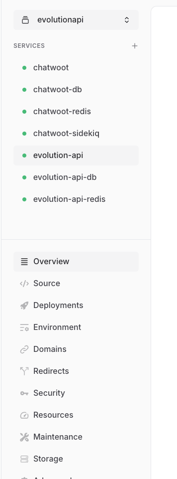
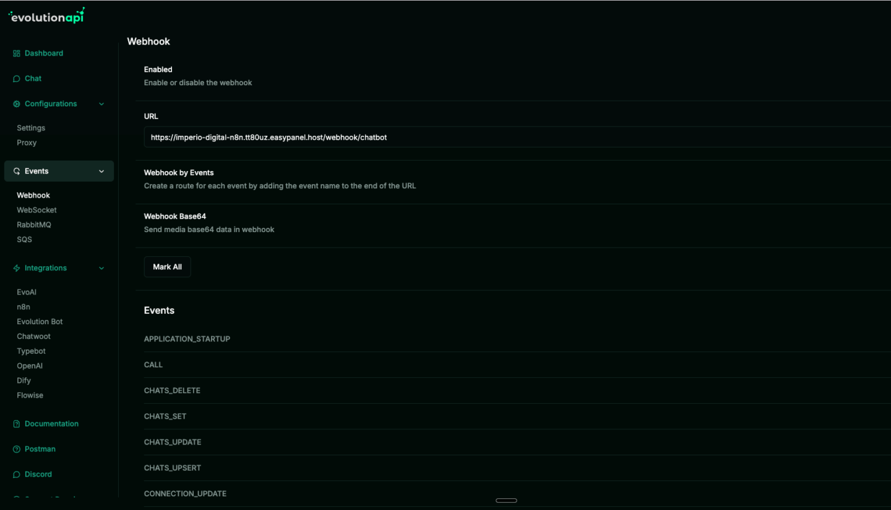
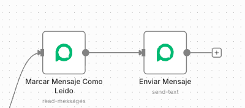

# 🚀 Instalación completa de EvolutionAPI en VPS

> Ruta: Automatizaciones n8n › 🚀 Instalación completa de EvolutionAPI en VPS

**🎬 Vídeo (50.9 min):** https://www.loom.com/share/65017562294c4506af96f8bee37bf121

---

### 🤔 Qué es EvolutionAPI y por qué usarlo

EvolutionAPI es una API open source que expone WhatsApp usando el protocolo Baileys y lo lleva a endpoints HTTP y webhooks.  
Sirve para:

- Bots de soporte y atención al cliente
- Automatizaciones con n8n y Make
- Agentes de IA con memoria de conversación usando Redis

No es proveedor oficial de Meta. Si lo usas para spam o blasts masivos te van a banear el número.

### 🧱 Prerrequisitos antes de tocar nada

- VPS con Ubuntu 22.04 o posterior, que sea version LTS, Docker y EasyPanel funcionando
- n8n instalado en ese mismo servidor
- Un número con WhatsApp o WhatsApp Business para vincular vía QR
- Criterio mínimo para no usar esto como cañón de spam

### 🎯 Lo que hacemos exactamente en el video

1. Levantamos Redis en EasyPanel

- Explico qué es Redis y cómo n8n lo usa como “memoria” para el agente
- Caso real. juntar varios mensajes del usuario en un buffer para mandar todo el contexto a la IA - “Hola”
- “Cómo estás”
- “Me das informes”
- En vez de responder cada uno por separado, guardamos en Redis y enviamos. “Hola, cómo estás, me das informes”

1. Creamos PostgreSQL en EasyPanel

- Postgres como base de datos de apoyo para EvolutionAPI
- Comentamos otras opciones. Mongo, MySQL, etc. pero usamos Postgres por velocidad y porque está en el mismo VPS

1. Instalamos EvolutionAPI desde Templates en EasyPanel

- Projects → New Project → evolution-api
- Templates → EvolutionAPI → Create → Deploy
- Sin comandos raros de Docker. el template ya viene armado

1. Entramos al Evolution Manager y sacamos la API Key

- Abrimos el servicio desde EasyPanel con el botón “Open”
- Entramos al Manager y mostramos dónde está la API Key en las variables de entorno
- Usamos esa API Key para loguearnos en el Evolution Manager

1. Creamos la instancia Baileys y escaneamos el QR

- Manager → Instances → New → canal Baileys
- Le ponemos nombre. por ejemplo “soporte” o el nombre del cliente
- Get QR, escaneamos desde WhatsApp → Dispositivos vinculados
- Se sincronizan contactos, chats y mensajes. el número queda “conectado”
- Ajustamos settings para no hacer el ridículo

Recomendado en el video.

- Ignorar grupos. no quieres tu bot spameando grupos personales
- Rechazar llamadas
- Opcional. - No marcar mensajes como leídos
- No mantener el número “siempre en línea”
- Conectamos EvolutionAPI a n8n por webhook

- En Evolution activamos `messages.upsert` como evento principal
- En n8n creamos un Webhook (POST) con un path corto. por ejemplo `/evolution`
- Explico la diferencia entre URL de prueba y URL de producción en n8n. - Test. `/webhook-test/evolution`
- Prod. `/webhook/evolution`
- Pegamos la URL de prueba en el Manager y disparamos un mensaje de WhatsApp para verificar que n8n recibe el payload correctamente
- Instalamos el nodo de comunidad `n8n-nodes-evolution-api`

- n8n → Settings → Community Nodes → Install
- Buscamos `n8n-nodes-evolution-api`
- Lo instalamos y revisamos que aparezca en el buscador de nodos

1. Creamos credenciales de EvolutionAPI en n8n

- Server URL. la del Manager pero sin el `/manager` al final
- API Key. la misma que copiamos de las variables de entorno en EasyPanel
- Probamos la conexión desde n8n hasta EvolutionAPI

1. Enviamos el primer mensaje de prueba por WhatsApp

- Nodo EvolutionAPI → `Send Text`
- `instanceName` = el nombre de tu instancia
- `number` = número de destino con formato correcto
- `text` = mensaje de prueba
- Ejecutamos el flujo y mostramos cómo llega el mensaje “Hola, mi bot recibió tu mensaje”

### 🧠 Buenas prácticas para no matar tu número

- No lo uses para envíos masivos ni campañas de marketing
- Úsalo para inbound. soporte y clientes que te escriben primero
- Calienta el número con uso humano los primeros días
- Agrega delays aleatorios de 1 a 5 segundos antes de cada respuesta
- Usa Redis para agrupar mensajes en una ventana de tiempo y pasar contexto a la IA

## 🎙️ Transcripción

Muy bien, estoy aquí con Christian, como usted los prometimos, este es el video que vamos a utilizar para enseñarles como está la Revolución API desde cero, que ese evolución API es una opción de código abierto para poder utilizar WhatsApp y WhatsApp Business a través del protocol Ovelys, y esto es una alternativa a WAPI, algo que hemos visto mucho en la comunidad. ¿Qué vistean? Hola a todos, un saludo, no más para recordarles que esta sería como la segunda parte de la interracción que hicimos de NocheVen, que Carlos nos platicó. Si no han visto el primer video, hicimos una instalación por MediciPanel, vimos cuáles fueron las diferentes fuentes y recomendaciones de Carlos sobre cuestiones de precios y adquisiciones y pues si no han visto el primer video les sugerimos y si ya tienen instalados de NocheVen, pues es mejor por entre a empezar desde aquí correcto no es de janeor que tenga todo listo muy bien perfecto y vamos a darle ok entonces que tenemos estamos aquí desde isipanel estando aquí en isipanel vamos a utilizar este mismo servicio digamos que hoy que les enseñamos como configurarlo, instalarlo para N80N para poder instalar que evolucionate, que es lo primero que vamos a hacer estando aquí, quiero agregar un nuevo servicio y en este caso voy a dar la clica aquí donde dice Redis, que es Redis para los que se preguntan, se los puso, se los pongo aquí para que le ven en pantalla, ese estico en lo rojo lo van a ver mucho en N80N, me voy a ir a N80N, voy a un workflow de nuevo para que ustedes vean si ponemos aquí redis les va a salir aquí y redis es un sistema que te permite guardar cosas en memoria es como una tipo base de datos pues en el tucache lo puedes utilizar para tu agente mensajería en este caso para que lo vamos utilizar para guardar la memoria de la gente cuando esté comunicando a alguien con via Whatsapp, esto lo vimos en una sesión con Franco, básicamente es lo que vamos a utilizar para poder guardar esa memoria de esa caché y poder hacer el buffer, almacenar los 3, 4, 5 mensajes que manden el usuario en una ventana de tiempo que nosotros definamos para que a la gente le pasemos el mensaje completo y tenga todo el contexto, que quiere decir que si alguien manda hola y el siguiente mensaje como estás, siguiente mensaje me das informes, no queremos que la gente responda el hola y como estás más informes, queremos que esperemos, lo guardamos en memoria para sus amo Redis, estilo Buffer y le vamos a mandar la gente hola como estás más informes y la gente ya va a responder eso, para eso vamos a utilizar Redis, entonces vamos a Isipanel, le damos en Redis, el nombre vamos a poner el mismo Redis, contra Seña, ahorita la vamos a dejar vacía para que se dejené un arrandom, no nos importa en este momento y esto también lo dejamos vacío, le damos crear, okey, dice que no puede ser maiúsculas, entonces así nada más Redis, le damos crear y si se fijan aquí ya tenemos esto está inicializando y como podemos ver aquí ya tenemos en hn y también tenemos redis y así nos va a aparecer ahorita en su momento cuando vemos de alta evolución ok interesante entonces esto básicamente es para proveer contexto Carlos como bueno vamos a estar como para memoria y para cachernos, no solo sirve para esos cosas, en ese caso nosotros vamos a, es como si podemos utilizar postgres o podemos utilizar en ese caso utilizaremos este redis para para eso, sin embargo también necesitamos levantar postgres para poder usarlo como base de datos y almacenar algunas cosas, quien quiere utilizar otras opciones, MongoDB, quien quiere utilizar MySQL, lo que inquietan, que tu utiliza, inclusive, RTI vuelo a hacer, en este caso PostgreSQL, al tenerlo aquí, el acceso va a ser mucho más rápido, entonces vamos a levantar también un PostgreSQL para poder hacer la prueba. Entonces vamos a acá, de vuelta en servicios, de vuelta en PostgreSQL, vamos a llamarle postgres igual para que sea fácil de identificar como sabemos no puede haber mayúsculas en usuario vamos a ponerle también postgres que es lo que tiene por defecto, postgres muy bien y contraseña lo voy a dejar en blanco para que me genere una o le pongo una contraseña, vamos a dejar en blanco, lo pueden cambiar después, igual para cuestiones de seguridad que estamos grabando 100% de la pantalla, vamos a dejarlo así, vamos para que se inicia. Veo que a los que hay muchas servicios ahí, tú en tu experiencia cuál estás utilizado y también se pueden agregar como algunos que no están por default ahí en la parte de servicios. Se pueden agregar lo que no esté por default este sí si lo puedes hacer si nos vamos aquí en servicios aquí tenemos como templates pero si no puedes darle un dice app y agregar aquí el servicio y a tu destalas via docker consola u otras opciones perdón que nos va a permitir el el sistema Ok, entonces, te acuerdas que la última vez que estábamos viendo en 8N para que entiendan un poquito o tomarlo como contexto para los que estábamos visto el video, que los recomendamos que vayan a verlo. La vez pasada que les lo estábamos instalando crisis en que le está explicando le pedica agregar estas dos variables del torno, lo cual eso nos va a permitir instalar nodos de la comunidad que evolucionó a piso no de la comunidad que vamos a tener que instalar para los que ya habieron nuestros videos que pus decimos migrando de make a n8n ahí explicamos también cómo utilizar cómo instalar no de la comunidad pero en ese caso parece punto y ya teníamos estas configuraciones en nuestro otro n8n y ya tenía instalado el nodo, por así que el paquete de nodos de la comunidad, por eso eso no lo vimos pero en este caso ya lo vamos a poder ver este, desde cero, ok, antes de continuar algo que siempre me gusta hacer es me voy a mi ON 8N para que vean, me voy aquí donde dice whats new y van a ver que aquí dice 1 version behind, que quiere decir que hay una nueva versión de N8N, vamos a actualizar, antes de eso les quiero enseñar algo, aquí me voy a Home, y aquí es algo importante, si se fijan proyectos, si se acuerdan o ven la que estamos viendo en el video anterior de Isipanel, en proyectos puedes tener tres servicios después, pero proyectos pues tener tres. Todo esto que yo agregué, pues crees y redes ahorita, son parte de mi proyecto de N88. Ok, ahorita vamos en su momento, vamos a crear un nuevo proyecto para Evolution. Ver antes de eso me voy a ir a N8N, me voy a ir a Sober's y vemos que estamos en la versión 108.2. Entonces vámonos a Github, N80 releases, le voy a actualizar para jugarme, estamos bien de lo más actualizado y como vimos el vídeo pasado no vamos a tomar priorices vamos a nuevos estables y el aire es estable sería la 109.1 entonces voy a aprovechar para actualizarlo borro 108.2 y pongo 109.1, le voy a dar save y recuerden que le tomca en deploy Vamos a esperar un poco, vamos a Overview, para poder ver aquí que se está reiniciando y todo lo que esté listo, y vamos a esperar a que esté listo el servidor. mientras de todas formas podemos avanzar a trabajar con otras cosas, ahorita regresamos ya una vez queáis ahí ha hecho el deploy, básicamente si reinicia esta parte del servicio de N8N o que si reinicia el servidor, si no lo podríamos seguir navegando en Isipano y porque Isipano está en nuestro servidor de Yonos, que eso lo vimos en el video 1, los recomendamos que lo vayan a ver, como veamos dice que ya se está y que ya está accesible. Entonces, si me voy para acá y refresco, si no importa guardar esto, van a ver que ya no nos dijiste que estamos en una versión detrás, que es el que ya está actualizado a la última versión. Vamos ahí si panel de vuelta al dashboard y vamos a agregar un proyecto, este proyecto lo vamos a nombrar como evolución API, evolución API, como le Y volvemos a lo mismo, MagiBat, no podemos utilizar mayesculas, cariamos el proyecto. Muy bien, una vez que tenemos creado el proyecto, que va a seguir, vamos a irnos ahorita a la página de Evolution API, que les voy a enseñar, que lo que vamos a ver, pero y la ventaja de lo que me gusta trabajar con EasyPanel es esta. Si fijan, vamos a servicio, nos vamos a ir aquí donde dice Templates y vamos a buscar Evolution. Como pueden ver, ya existe un template en EasyPanel de Evolution API, lo cual obviamente nos hace todo el trabajo mucho más sencillo porque no tenemos que hacer un instalación manual cuando ya viene templateado como todo igual podemos actualizar el software así como instalamos de esta forma agregamos en 8n, aquí también vamos a agregar de volución, a pie, le damos aquí y no vamos a cambiar el nombre, vamos a dejar ahorita esta versión, por lo general esto se actualiza automáticamente a la última versión momento de instalar, pero en su momento de la vamos a configurar vamos a create dice que se creó sexfully vamos a proyecto está inicializando y mientras si nos vamos aquí en evolución api esto es la página evolución api como tal tenemos la ve uno tenemos la ve dos y aquí pueden ver instalar con docker con docker perdón api documentation y todo pero queremos irnos al nodo de la comunidad para ver en github, esa es la página oficial, eso está en portugués, no sé si evoluciona pies de brasileiro el Portugal, pero sí que toda la página o los desarrolladores donde está en portugas todo y dejenme ver si en github ok, realises la okna version de 29 de julio es la 2.3.1 y me crecen, si igual recuerden le pueden hacer el mafórmano como el hicimos con el no choene, buscamos en google a evolution happy github realises y nos van a mandar directamente para ella también, claro que ustedes quieren buscar algo, eso es como una forma, como la estructura adecuada, ¿no? Y recuerden, esto ya sería nuestro segundo proyecto, entonces nos quedaría todavía uno, dentro de la versión como que estamos abarcando, igual a lo mejor si, como es ya Carlos, esto es la ventaja que tenemos, es que tenemos todo en los templis, a lo que estamos aprendiendo, es muy fácil le manejar, muy amigable, ¿no? Ahora, una duda que yo tengo Carlos en particular es, si, hasta que, o sea, como oyes es, Evolution API hasta que tanto te permite, o por qué Evolution API ya la hemos mencionado en el video pasado, pero lo mejor para aquellos que, que no les quedo todo muy, muy claro que no, o que ni siquiera saben qué Evolution API, cómo lo podemos definir, como, a lo mejor alguien está usando ya otra opción, ¿no? Evolution API, Y algo que bueno que lo menciona es Cristiano que tenemos que tener en cuenta es que no es un parner oficial, evidentemente, estas algo que los desarrolladores, ahora sí que va a dar la redundancia, desarrollaron ante lo complicado que es la API de Whatsapp de meta, todos los que ya lo han intentado comprenderán, es muy complicado desde el punto de levantar número nuevo, configurarlo para eso existen alternativas como WAPI, que es de las más usadas en la comunidad más usadas para MAKE. Y WAPI tiene una integración también con N8N, pero para mí con la gran diferencia que últimamente WAPI estuvo teniendo problemas con los registros y dos que WAPI, si no me equivoco pagas por número, pagas 50 dólares al mes, algo así y Evolution API es 100% gratuita, para misas será la gran diferencia, los dos ocupan el mismo protocolo para conectarse que es protocolo Baylis, que básicamente quiere decir que te conto celulares, caneas, un código QR, como si lo hicieras para WhatsApp web y de esa forma generas el enlace a través del protocolo Baylis, lo cual te permite tener lo que se llama la coexistencia que quiere decir que te puede seguir utilizando, tú mis celular con tu nombre de WhatsApp, mandar mensajes a la par que levantas automatizaciones. Al no ser un párnero oficial tienes riesgo de vaneo, aunque o con párnero oficial también tiene riesgo de vaneo, si usas mal la cuenta o tu número, pero aquí el riesgo es un poquito mayor. Esto se trata ahorita de enseñarles cómo instalarlo y montar la primera automatización, no se trata de hablar de más a detalle de meta u otras cuestiones, pero como recomendación sería, intenten calentar o armiar su número de whatsapp, que quiere decir, que si es un número nuevo que apenas ustedes sacan de comprar para esto para pruebas, no empiecen con ese número y no empiecen a mandar directamente mensajes a todo el mundo espamiar, porque se los van a quedar arrobaniando y a todo lo que hagan intenten que no parezca un robot que quiere decir que siguen les mando mensaje no lo contestan automáticamente siempre al instantáneo pongan un buffer pongan un delay cuando manden un mensaje igual intenten emular un comportamiento humano que es decir pongan en su tiempo de respuesta jugantes de su último nodo pongan un weight random de 1 a 5 segundos que que es irrando pongan una opción como un mat punto flor o algo así que te genero un número aleatorio para que cada vez que respondas en el chat no da ya como un pattern de quizás respondiendo justamente al segundo o segundo si no hagan un poco más random que permita generar ese factor humano para que eviten esa parte y no lo utilicen para marketing no lo utilicen para mensajes masivos para esos sí lo recomiendo que se quede directamente con la pide meta, usen lo para responder mensajes de los clientes cuando los contacten directamente a ustedes y si siguen todo eso el rando y calentar digamos un número, como se le llama coloquialmente, no deberán tener ningún problema. Excelente, sobre todo para aquí es que ya tuvieron como esas afortunados, ¿no? y tengan la forma de devolverlo a llevar a cabo, ok, Thank you Carlos, Dios. Muy bien, continuemos, vamos a darla aquí donde dice Open, nos va a abrir este panel, evidentemente no estamos dando nada, pero qué, porque le dimos Open, porque queremos sacar de aquí esta URL, copiamos, abriuemos en una pestaña y pegamos, listo, estamos en el Evolution humana hier, nos da aquí un aburrele del servidor que básicamente está aburrele en la misma que tenemos aquí y necesitamos una API global. ¿Qué tenemos que hacer con esto del API global de donde la vamos a sacar, de donde la vamos a poner, o qué lo que vamos a hacer? Ahorita casi todos los servicios, la manera de los servicios que utilizamos en este, en este nicho, se conectan a través de API, porque era una API. Al momento que nosotros levantamos, hoy hicimos de instalación de nuestro servicio de Evolution API en ICPANEL, se nos generó una API. Esto lo genera automáticamente, es la ventaja de tenerlo en la integración con NiciPanel y por eso me gusta usarlo con EasyPanel. Entonces, si se fijan, aquí estamos en nuestro Evolution API directamente. Se nos crearon estos tres servicios automáticamente. Nos trabaja a tu, en nuestro Redis, directamente de Evolution API y el servicio, digamos, general de Evolution API. Entonces, tanto en el servicio de Evolution API, vamos a darle para abajo para en Bayernment o en torno. Y aquí vamos a tener nuestra API. Esa es algo que voy a editar en post-producción, digamos, cuando vaya a trabajar con el video, así que muy probablemente ustedes vean todo esto bluriado, porque voy a mostrar ahorita nuestra API y evidentemente pues es algo que les recomiendo que nunca hagan, o si tienen que mostrar su API por algo después cambia en la, en este caso no es tan fácil cambiarla, entonces lo que voy a acabar haciendo yo es que ahorita la voy a voy a blurir a ustedes ustedes están viendo esto muy probablemente vean esta parte bluriada porque bueno no les quieren enseñar nuestra api excelente hasta aquí abajo esto es lo van a haber bluriado voy a subarme que estoy seleccionando todo y voy a copiar la api ahora ahora más para para contextos los demás al mejor en bluriado pero ellos tendrían las mismas 167 líneas por si decirlo? No lo sé, no va a depender del momento que lo que lo instalaron, puede ser que agreguen variables en torno o algo, pero no más para los contextos ustedes, tendrán que tener todas las líneas, pero si no de todas formas lo van a ver básicamente dice Authentication, Excelente, y ya que la puse aquí le voy a dar loguin. En nuestro caso, en la línea 160, ¿estás? Ya estamos loguiados en la interfaz de Evolution API, que se llama Evolution Manager y como pueden ver, no hay absolutamente nada porque pues está en blanco apenas lo acabamos de iniciar, va a depender mucho de el hosting que ustedes teno ocupando, algunas veces les va a pedir que o van a tener que cambiar su session phone version que está en lo que es las variables en torno, a veces pasa que algunas personas no les gener el QR no siempre es así ahora te vamos a hacer la prueba y si lo tenemos y cambiar lo lo cambiaremos entonces a mí yo la primera vez que lo hice en su momento no me dio ningún problema no me dio ningún error ahorita vamos a ver si nos da algún error o qué es lo que pasa esperemos que no entonces bueno ya que estamos aquí vamos a darle un dice instants y aquí podemos poner el nombre que queramos, como pueden ver los dice que el chánel dice Vailies que es el protocolo, honestamente siempre utilizado Vailies, no he utilizado whatsapp cloud app ni evolution, entonces no sabría cuál es la diferencia. Vamos a nonisamos poner un número de teléfono ahorita ni nada, esto es nuestro token que también voy a blurir esta información y aquí donde dice nombre voy a aprovechar para ponerle en nombre de un cliente, porque eso lo estamos montando también para un cliente de nuestra agencia y lo voy a dar, guardar, aquí si puedo utilizar mayús clas en ningún programa, ya que se guardo, aquí tengo yo la instancia y como pueden ver aquí tenemos no lo voy a dar ver, para aquí tenemos un token y aquí dice contactos y chats que en este momento entonces vamos a esperar tanto y ya que esté listo vamos a darle aquí y ser contactos cero chat cero mensajes de este lado en configuración tenemos también los eventos que quiere decir los eventos quiero poder decir a qué quiero que reaccione el web group de Evolution API. Una llamada cuando se inicia la aplicación, cuando se elimine un chat, cuando se configura un chat, cuando se actualice un chat, cuando hay una actualización dentro del chat, cuando agrega un contacto, todos estos son, digamos, mis scopes que le puedo dar a esta sesión de Evolution API, que yo voy a configurar directamente en el webhook. Ahora, a la mayoría de las veces, como yo les decía, a muchas personas que esto lo he visto en muchas páginas por muchos lados, les falla al momento de generar el QR, le dan get QR code y falla. Entonces, va a depender mucho del BPS en el que esté, en la forma de que lo instalaron, si no configuraron bien sus variables en torno, si hay alguna variable en torno o si hay un problema de proxy con su vps, entonces ya va a depender mucho del que estén, si están teniendo problemas, manden los mensaje y veamos directamente, nos dicen con qué vps están, vps que es, si lo tienen en su vps es subierto arpave server, si lo tienen en yo nos, si siguieron nuestra, nuestro primer video, si lo tienen hosgeros, si lo tienen hostingas, si tienen Google Cloud, si lo tienen en básicamente todas esas plataformas o por ovedores de servicio, entonces lo voy a dar get your code, esto muy probablemente también lo voy a blurir, porque si cualquiera que escane el código pues va a poder conectarse, entonces voy aquí a agarrar mi celular, obviamente esto no lo van a poder ver, voy a abrir mi whatsapp y voy a darle conectar. Esto que lo voy a hacer, desde su celular, básicamente, se abre en su whatsapp, ajustes en la parte que dice dispositivos vinculados, vincular dispositivos como los comentarios como si estuvieran abriendo whatsapp web le dan bien vincular dispositivo escanean con su cámara de su dispositivo móvil el código QR tarda unos segunditos y listo, dice que ya está conectado para aquellos que se pregunto por ejemplo Carlos que no sabemos un poquito de esta parte de ellos escanean con su celular que problema dice escanean con su número de whatsapp actual o si les sugieres poner otro número nuevo o que por ejemplo este tipo de dudas que les podría surgir. El depur hecho escanear no te va a generar nada, como pueden ver ya se sincronizó, son 1033 contactos que tengo mi WhatsApp, 372 chats, 588 mensajes, ahora el escanear no te afecta nada, de hecho se fijan aquí me parece mi foto que tengo de mi perfil en WhatsApp, ahora el escanear no te afecta nada. Si usas tu tu número que de toda tu vida y lo usas mal, no siguiendo las políticas de meta o abusando de los mensajes del chatbot, pues evidentemente como les mencionaba con el riesgo de que se ha bañado tu número de teléfono. Así que todo eso tienen que seguir con precaución, no es oficial, corre el riesgo de baneo, yo he van bañado en en mi caso, pero no he abusado, no he hecho campañas de marketing solo ha sido para responder mensajes de el chat, obviamente, como ni que no es caro, exacto, no porque ganieron que sí que ya está activo y que algún chatbot o alguna gente va a empezar a responder mensajes, no porque no han configurado nada, lo único que hicieron es establecer la conexión o establecer la comunicación entre a través del protocolo BELYS, entre Evolution API y su dispositivo. Básicamente como si ven, iniciado un WhatsApp web directamente, pero se conectaron aquí. Obviamente esto lo vamos a desmontar, lo vamos a tener que cambiar, porque no va a ser el número de nuestro cliente y si se fijan, ya no me sale la opción aquí de escanear el whatsapp web o en escania el QR perdón, quiero poder desconectar el genono nuevo y conectamos un nuevo, un nuevo, un nuevo perdón, sin ningún problema. Ok, entonces vamos a N8N, ok, y si vieron ya el video número uno de la, Interacción de la, no de la integración, instalación del video número uno de donde hicimos la migración de a los colrecoris ahí les enseñamos cómo instalar un nuevo de la comunidad pero si no lo han visto es muy sencillo nos vamos a ir aquí en n hn a settings estando en settings nos vamos a ir a community notes y la vamos a dar instalar la community note recuerden que lo activamos ya desde nuestras variables en torno activamos ya la parte de no es de la comunidad. Ok. Ok. Que es lo que seguirí entonces. Vamos a darle brausa aquí para que nos mande a E. NPM. Aquí podemos ver todos los nodos de la comunidad que hay y o sorpresa cuáles el nodo hasta arriba y el nodo más usado con más de 3 millones comparado con lo de nada más, regresamos aquí a Noche N, le damos pegar, obviamente que les dice, es como un guard en una advertencia de Noche N, recuerda que está haciendo un nodo de la comunidad, no somos responsables, hay un riesgo, confirma que conoces esta fuente y confías en ellos, vamos a ver que sí y le vamos a dar a instalar. En nuestro caso, en el video de cuando hicimos la miración, nosotros utilizamos el cloud convert que era que era de la comunidad ya teníamos integrado de lo que eran las variables de entorno por eso no no tuvimos ningún problema igual aquí ya están activadas ya se puede hacer y lo mismo por lo general los nuevos de comunidad se entiende que como son fuentes externas alivari cuando tú instalas una pequeña celular lo que sea se te hace warning pero por lo general funcionan muy bien es correcto muy bien ya se instaló les voy a enseñar ahorita como hubiera gustado haberles enseñado que no aparecía pero bueno ahorita les voy a enseñar cómo aparecen listo entonces vámonos aquí en search notes y si yo busco voluye un app ya me aparece aquí y si este pequeño cubo que sale aquí les indica que es un nodo de la comunidad y antes pues no estaba pero como les digo no se ha murido buscar para que vean que no estaba pero bueno ya me sale volucio napi y aquí yo puedo ver todo obviamente como todo lo casi todos los los nodos o servicios más bien que tenemos que podemos conectar tienes tus triggers y tienes tus acciones como pueden ver eso está muy completo y se fijan está en portugués, porque es lidión oficial de integración, pues intentar transcribir a través de Google, se los permite, o creo que todos los que hablamos en español es muy fácil entender básicamente lo que dice aquí, ya que es muy muy parecido. Entonces, ya lo tenemos es instalado, cuál va a ser nuestro primer nodo o cuál va a ser nuestro trigger, en este caso va a ser un webhook. Ahora, nosotros necesitamos configurar en Evolution Manager, aquí donde dice la parte de settings, ¿qué queremos? Por ejemplo, lo queremos rechazar llamadas, es decir que el webhook no se triguere por una llamada, lo mejor tú no quieres que se triguere por llamadas, que en este caso no lo recomiendo, porque es una configuración completamente diferente, que ignore grupos, que también yo se lo recomiendo, porque no quieres que tu chatbot esté, sobre todo si es un WhatsApp personal, lo quieres que tu chatbot esté mandando mensaje en los grupos, y tienen más opciones de que, por ejemplo, que te mantenga en WhatsApp como siempre disponible, si está el chatbot funcionando, si está así, siempre vas a parecer como disponible, aunque no estés disponible, eso había ya va a depender de cada uno, si quieres tener tu chatbot con respuesta inmediata y que los gente todo mundo sepa que está disponible, por el tipo de servicio que vendes lo puedes dejar a mí no personal no me gusta y también puedes configurar si quieres que le marque los mensajes como leídos que a mí no personal tampoco me gusta entonces le voy a dar donde hice grabar nada más con esas dos configuraciones ok vamos a evento vamos a web hooks y se se fijan aquí nos pide que pongamos a una URL ok ahora vamos de vuelta a n 8n y no vamos a utilizar este porque se fijan dice a un web call no queremos utilizar este directamente que al final es exactamente lo mismo pero aquí me está creando esta instancia básica entonces yo que voy a hacer, me voy a la vieja confiable y voy a crear un webhook directamente desde aquí para que no me generen la otra parte de la instancia. Al final el resultado es exactamente el mismo pero me gusta hacerle esta manera mucho más limpia para que también no haya confusiones y no crean que a fuerzas tienen que utilizar esto, se le dan aquí en Evolution API, un webhook se se fijan, voy a dar uno nuevo y le voy a dar Arnador Trigger con Web Focoll y si se fijan es exactamente lo mismo. Aquí tienes tu método, tu pat, o tenticación, respuesta, y aquí tienes tu método o tenticación, respuesta es exactamente lo mismo. El único que difference es que aquí me está poniendo un pat y aquí no me está poniendo el pat, preta de forma lo que tienes que poner, listo. Entonces voy a borrar este, voy a borrar esto, vamos a darle, esto es un método post, ok, el pad, a mí siempre me gusta cambiar, en ese caso lo voy a poner el evolution, algo más corto y no necesito ahorita hacer nada más, lo único que necesitamos es poder copiar este web, tengan en cuenta los que ya han trabajado con el NHVN, que a diferencia de make, NHVN, cuando tú estás trabajando con webbooks, siempre vas a tener tu webbook de prueba y tu webbook de producción. No es que ustedes tengan que cambiar aquí, no es como que si le declicas aquí activo uno o activo otro, no, ¿qué es lo que va a pasar? Vamos a renombrar esto como Evolution API Test, y me gusta, vamos a ver una etiqueta que como test. ¿Qué va a pasar? Si yo tengo mi escenario inactivo apagado, no puedo utilizar el webfoot de producción. Y si yo tengo mi escenario aprendido, no puedo utilizar el webfoot de prueba. Entonces, mi recomendación siempre es copy en el webfoot de prueba, hagan las pruebas que quiere decir que ustedes le den manualmente escuchar un evento. Y cuando ya Atenza a tus fechos y ya lo vayan a lanzar a producción, como se le llama, como lo vimos el viernes pasado con Franco, ya lo prenden y en la plataforma doten configurado, no tengan la salsa webcook, hacen el cambio, cuál es el cambio, tal cual solamente es que tal guion test y eso es todo, se se fijan mi URL de mi post, de mi HTTP o de mi webcook, de test es webcook, guion test, evolution y de producción, es exactamente lo mismo pero es webcook sin el guión test. Entonces simplemente van y camine eso, ahorita obviamente con va a ser pruebas voy a hacer la copiar el testéo, simplemente como la gregue después se me renombra webhook 1, la más de que me borra el 1 para que sea más limpio, oops, creo que se me borró todo, así que método post, se fijan aunque cambia el método la URL es la misma no cambia así que lo pueden cambiar después voy a volar copiar y me voy a ir a mi evolution van a ir y aquí donde dice URL le voy a dar pegar ok ahora algo importante que van a tener que habilitar después web Facebook bases 64. ¿Qué quiere decir? Si ustedes no habilitan esto, iba a depender de los que es consideren o cómo quieren que funcione su chatbot, la forma en la que lo configuren. WhatsApp, como, por ejemplo, los que ya han trabajado directamente con un htp request para acceder a la API del new gpti machi en uno, saben que él es de vuelve. ¿Qué oye? OpenAI, perdón les devuelve la imagen en base 64, os he de la tiend de convertir un binario. Es hecho, yo tengo un par de videos que es subir, donde hablo acerca de esto. Viene por defecto apagado que quiere decir que ustedes no activan, no van a poder recibir directamente con el chatbot. Ojalá entiles, vayamos a la imagen via Whatsapp. Pero no van a poder recibir y procesar un input, un output que sea la imagen si no activan webbook base64. Esto es nada más para que lo tengan en cuenta. Por ahora no lo voy a activar porque no quiero complicarlo más, queremos que este vídeo se trate tal cual de como instalar evolución API, configurar un chatbot, muy probablemente hagamos otro video de cómo hacer toda la configuración del chatbot o no, ya lo veremos porque evidentemente como les comentamos al ya tener nuestra agencia pues obviamente el que quiere colaborar podemos ayudarles en la creación su chatbox y todo pero todas formas siempre estaremos compartiendo compartiendo todos nuestros conocimientos. Vamos a dejarlo ahorita pagado ya tenemos nuestra ur de prueba y para poderlo probar qué es lo que necesitamos hacer activar esta opción que hice message opcert y lo activamos para que ya podamos configurar nuestro chatbot y hacer una prueba, y vamos a darles la idea, ok, mes es obserte y todas estas opciones, ahora sigue, hay alguna forma de algunas son intuitivas y otras por ejemplo si no saben qué significa cómo podrían ver documentación o algo al respecto a esto, sabemos que está la parte que se importue, claramente tenemos que es corcorro, aquí lo puedo os ha ido comentar, ahí te va a explicar, ahí tal cual ahí, y si lo la ventaja es que aquí se portugues, pero así aquí en inglés, y te la muestra, y si no, la vieja confiable, le das aquí, traducir al español, y te lo ponen español, y ya está, ahí nos vendría el de todos los listas, sí, porque ahora mejor como dice Carlos, a lo mejor uno es quien tratan de imágenes, otros conversaciones, otros incluso tienen la parte de dejar, Hay muchos chatbots que tienen como la parte que son como de dejar ya predefinida las opciones, no también he visto muchos ejemplos de esos, así que depende qué es lo que mejor se ajuste a su necesidad. Pero final, ¿cuál es el objetivo? Es más que nada, la parte de la instalación y ya ustedes estarán a jugar con las opciones que él se le da. y como recordatorio ustedes van a poner el número de él cliente claramente no porque a veces uno se confunde y pone el suyo y se lo se va al rollo después cambiarlo entonces le hiciste que sea o puede ser algún número en particular que se les asoció y si se han cuenta no otros tuvimos ningún problema bueno el mejor está va a estar blurrida esa parte pero no tuvimos ningún problema en general QR que probablemente se llegan los pasos del vida 1 y estos lleguen al mismo resultado de no tener problemas con el QR así es que te aparezcamos una prueba y obviamente aquí me faltó algo, no me faltó habilitar el webhook y se reinició esta parte de aquí porque no lo haré habilitado, lo hago otra vez me has hecho absurd, lo voy a dar save, déjame a salirme el dashboard y volver a entrar a eventos para suavearme que se que si se quedó prendido eso, ok, y ok, entonces vamos a hacer una prueba, voy a dar aquí a mi webhook, está en post, le voy a dar licen fortese vent y cristian me puedes mandar un mensaje por whatsapp que diga probando evolución api para que veamos que llegue el mensaje, un sonito evo lucian api ok y se fijan aquí está mi output, me está llegando un mensaje de cristian a guilar, ese es el número de teléfono que también lo voy a blurir y perdón ese número de teléfono este es un identificador y este es el número de teléfono para ver que se arroba ese punto WhatsApp punto net la instancia es caribe play porque este es nuestro cliente que así lo configuramos y de del lado para aquí abajo, podemos ver el message, conversación, dice probando Evolution API. Entonces, señoras y señores, ha sido conectado, está conectado y recibe mensajes, obviamente de aquí después de aquí, todavía sigue todo un mundo enorme de configuración, ahorita vamos a seguir una más bastante rápido para que puedan como sería la parte de responder mensajes, pero de gemesinares algo rápido, nada más, como un adelanto, para que tengan más mención de cómo tendrá que quedar, obviamente no lo he conectado, pero aquí tengo una gente de prueba y más o sí, con los redies y con los diferentes agentes, y algo así es lo que queremos llegar, tiene que ser bastante robusto para asegurarte que tengas todas las posibilidades, tengas todo configurado, que tengas tu redis, que estés guardando toda la información, que tengas el buffer correcto, que tengas random, varias cosas, pero bueno, ahorita no lo van a focar en esto, así no lo voy a utilizar, vamos a mandar ahorita una prueba de vuelta. ¿Cómo viste, Cristian, el proceso? Oye, está bueno, la verdad, la interacción está muy sencilla, la ventaja está, como dice Carlos, el hecho de que tengamos, y si pane que esté la herramienta de este de volujo, a piqueza, hay algo por la comunidad que esté prácticamente hecho a la medida, es lo que hace que, podamos darnos cuenta de que no es tan complicada como parece, no es lo bonito. Y teniendo ya nuestro web, teniendo ya esa verificación, esa conexión, de que efectivamente estoy recibiendo un correo, estoy recibiendo la alerta, o estoy trigariendo mi workflow, ya a partir de aquí es, ahora sí que todas las posibilidades, todo lo que se les ocurre, todo lo que se ajuste a sus necesidades, como bien ahorita el super, el workflow que mostrarlos, afriar de cuentas pues ya eso y es la cuestión lógica pero la conexión ya la tenemos, no que es lo mejor lo más complicado para decirlo, de gestionar en ocasiones. Así es, y para cuestiones de siguientes ahorita como se puede responder un un mensaje, voy a conferirlo de una manera muy directa, por favor tengan en cuenta que eso es algo que no tiene que hacer de un producción, porque simplemente van a acabar quemando ese número, lo más que les van en, y en realidad es un no es la forma correcta a los chados que quiere decir voy a hacer algo directo de me mandas mensaje de respondo y evidentemente eso no queremos y no queremos que ningún chados aunque no se aprovechaba porque se aporten no sé un chado para una página web o un chavo de telegram lo que sea no es el comportamiento esperado simplemente lo voy a hacer ahorita para que ustedes vean cómo se mandan los mensajes de vuelta voy a conectar voy a dar la agregar nodo voy a buscar evolución API, lo voy a seleccionar, voy a ver la opción de enviar texto, por favor recuerden no es la forma correcta hacerlo, es nada más ahorita para poder hacer una prueba rápida y también para enseñarles cómo se conectan las crenciales, obviamente no tengo ninguna crencial porque estamos recién instalando leyes en todo, así que le voy a dar aquí carajar nueva creensial me va a pedir un server URL que es server URL pues básicamente es vamos para acá, déjame cerrar el comentación, estamos aquí Dashboard y esta URL que tenemos aquí arriba que se acuerdan que la URL que copiamos al entrar aquí es en nuestro URL, es parecido como cuando hacíamos en el video 1 que tenemos que agregar el URI del callback en Google Cloud cuando hicimos la configuración de las creenciales de google es básicamente lo mismo tienes que agarrar tu relé desde lo que es host sin el manayer hacia atrás y copia listo entonces voy a un hn y pego aquí mi creensial y me faltó nada más el forward slash y me voy a tener que me va a pedir mi apiki. Esa donde la toma me parece que si le hago de esta manera no la voy a no la voy a líquiar, déjame confirmar, le doy de aquí, donde sale todo esto, le doy copiar y ese es mi apiki y perfecto. Ya que tenemos esto vamos a asegurarnos de que está funcionando. Evolution API, aquí ustedes pueden cambiar el nombre y no lo poner cb de cp perdón de caribe play y lo voy a dar safe y dice que no se pudo conectar, déjenme ver que está mal, a ver, la mejor no lleva el forward slash, listo correcto, no lleva el forward slash entonces no se lo pongan, yo lo puse porque en Google Cloud si bien el quiere entonces en este caso borrenselo y ya me pude conectar listo. Ok, muy bien. Entonces ya tenemos la parte de mandar mensajes, enviar texto, me va a pedir un nombre de una instancia, siempre tenemos que crear las instancias y como les comento no es la forma correcta de hacerlo pero ahorita estamos para que vean como llega el mensaje para que veamos que en verdad funciona, pero recuerden no estoy haciendo pruebas porque van a causar cierto ruido, cierta sospecha, ¿no? Exacto. Y déjame ver nada más si lo puedo hacer, no quiero mostrar información de más, aquí está, y eso mensaje de cristian que dice probando evolution happy. Entonces vamos a hacer otra prueba en nombre de instancia, no es vuelvo a lo mismo, no es la forma correcta hacerlo, pero yo lo voy a hacer así para cuestiones meramente de pruebas, después a lo mejor enseñaremos a otro vídeo, nombre de instancia voy a copiar el nombre que tengo aquí de mi instancia y lo voy a pegar en número destinatario quiero que sea este número que se que estoy de que estoy recibiendo que igual esto lo voy a blurar y el mensaje va a ser nada más como que hola mi bot recibió tu mensaje evidentemente ningún chavos vas a confiarla así por lo menos vas a procesarlo por ella hay que dar algo lo que sea y repito 100 por ciento es para cuestiones de pruebas. Entonces, me voy a dar para atrás, voy a salir y le voy a grabar, le voy a dar ejecutar Warflow y Cristian me manda a hacer como WhatsApp. Como dice Carlos en la que sigo, como dice Carlos, afinalmente es eso, solamente es que los cuestiones didácticas para que vean cómo funciona, ustedes saben las pruebas y si más adelante nosotros tenemos la oportunidad de hacermos un vídeo de cómo realmente hacer las pruebas de manera genuina sin tanto riesgo por así decirlo, ¿no? Ok, obviamente le llegó el mensaje de prueba, ¿por qué? ¿Por qué? ¿Por ¿Caducó? ¿No lo mandaste? ¿Verdad, Cristiano? ¿A ver otro es? ¿Pero lo mandaste el mensaje o no? Sí. ¿O qué? ¿Y qué mandaste? el mensaje de prueba, me voy a mandar. Ok, y, pero me da un exigit. Un exigit. Es que cada vez nos haje de prueba, ponlo otra vez. Y dice, hola, mi voto recibió tu mensaje y evidentemente como ven yo no escribi nada, esto se envía automáticamente, esto no mandó nada porque había caducado las. Había caducado el el el el el el el el el. Cuando estamos probando y y vamos a hacer una prueba más, ejecutar, mando otra mensajita y unas para que vean, me voy a regresar acá, para que va final, hola el mibo reciuto mensaje, y evidentemente no es correcto, no somos nada, simplemente para que ustedes vean listo, hola el mibo reciuto mensaje y ya, obviamente aquí donde dice mensaje, ustedes pondrán el output de cualquier ella e agent que le metan en el intermedio. Entonces, muy bien, te parece que hasta aquí dejemos el video, esto solamente se trata de cómo levantar el volución API como configurarlo, muy probablemente en otro vídeo, veremos como mejores prácticas y cómo armar tu primer flujo para un agente de WhatsApp. Excelente, más que claro, vieron que es demasiado rápido, vieron que esta tiene más de tres millones de usos en los nodos de la comunidad, tanto uno prácticamente es algo que funcionan muchísimo de las otras funcionar de igual forma. Como comentó calos recordales una un tema vez que no hagan pruebas de forma alatoria de forma atascada, siempre hay que tener un poquito más de conciencia en este tipo de cuestiones y si llena tener algún tipo de error, falla a lo que sea, diga en los comentarios, trataremos de resolverlo más pronto posible y de nuevo, más adelante les traeramos cómo nosotros estamos haciendo ya pruebas de forma organizada por así es de forma más más, parece que mejor ella, la correcta diría a Carlos. Así es, bueno, gracias Cristian, vamos a dejar el video aquí, también para que nos haga muy largo, que se ha solido enfocado en la estación y configuración y nos vemos a la próxima. Gracias, saludos comunidad.
