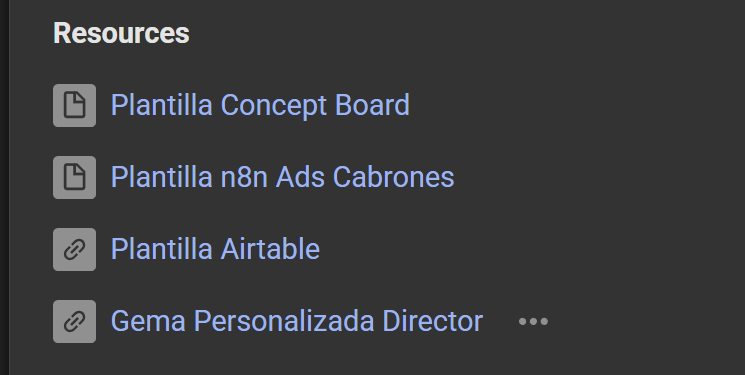

# 👑 [GUIA] Configura tus Anuncios Cinemáticos

> Ruta: Automatizaciones n8n › 👑 [GUIA] Configura tus Anuncios Cinemáticos

**🎬 Vídeo (18.0 min):** https://www.loom.com/share/2ca9f684ac1c40d49bc9a893355bda7a

**📎 Recursos:**
- Plantilla Concept Board
- Plantilla n8n Ads Cabrones
- [Plantilla Airtable](https://airtable.com/invite/l?inviteId=invBaulIxzkCuW8E3&inviteToken=67eed0831f09e9e696400d074cdc39730f72d8fdced82389823c9466e59e8633&utm_medium=email&utm_source=product_team&utm_content=transactional-alerts)
- [Gema Personalizada Director](https://gemini.google.com/gem/18dwvNrz2zkkZFbce5zeD19VQLaXqb6TY?usp=sharing)

---

Aquí les dejo el paso a paso técnico para dejar funcionando la automatización de los "Anuncios Cabrones". Sigan este orden para no perderse con las credenciales.

### 1. Descarga los Archivos Base

Lo primero es tener los materiales a mano. Al final de esta guía, van a encontrar cuatro archivos clave

- El **Concept Board** (imagen de referencia)
- La **Plantilla de n8n** (el archivo .json)
- La **Plantilla de Airtable** (la base de datos)
- *Opcional:* Acceso a la gema personalizada si la requieren.

### **2. Configuración de Airtable**

- Abran el link de la plantilla de Airtable y hagan una copia en su propia cuenta para poder editarla
- Vayan a **Developer Hub** en Airtable para crear un nuevo Token
- **Ojo aquí:** Al crear el token, asegúrense de agregarle **todos los scopes** (permisos) disponibles (lectura, escritura, esquemas, etc.) para que la automatización no falle después
- Agreguen la base que acaban de copiar a los permisos del token y guárdenlo en un lugar seguro

### **3. Importación y Ajustes en n8n**

- En n8n, creen un nuevo workflow e importen el archivo "Ads Cabrones" que descargaron
- **Importante:** La plantilla viene con nodos configurados con un nombre específico (ej: "Ads Cabrones IA"). Es muy probable que tengan que actualizar las credenciales en cada nodo de Airtable dentro del flujo, seleccionando su propia cuenta conectada

### 4. Conexión de las APIs (El motor de la IA)

Necesitamos conectar tres servicios clave. Para Wavespeed y las APIs genéricas, usaremos el tipo de autenticación "Generic Bearer Auth"

- **Airtable:** Usen el token que crearon en el paso 2
- **OpenRouter (Modelos de Texto):** Creen su cuenta, saquen la API Key y conéctenla en los nodos correspondientes
- **Wavespeed / API Key (Imágenes y Video):** Vayan a su perfil en Wavespeed, generen una API Key, cópienla y créenla en n8n como una credencial "Generic Bearer Token"
- **ElevenLabs (Voz):** Busquen la voz que les guste (filtren por español para mejores resultados), copien el "Voice ID" y péguenlo en el nodo de voz antes de generar.

### 5. Ejecución del Flujo (Cómo operar la máquina)

La automatización funciona por etapas para que tengan control creativo:

1. **Dirección Creativa:** Llenen los datos en Airtable (producto, referencias) y ejecuten para generar los prompts y escenas
2. **Revisión:** Si les gustan las escenas propuestas en Airtable, denle el visto bueno.
3. **Generación de Medios:** Ejecuten nuevamente para crear imágenes, luego videos, música y voz.
4. **Lógica de "Done":** El sistema revisa los checkbox de "Image Done" o "Video Done". Si una escena ya está lista (tiene el check), la automatización se la salta para no gastar créditos extra. Si quieren regenerar algo, simplemente desmarquen esa casilla.

---

Dudas?

Dejen sus preguntas en los comentarios de este mismo hilo para ir resolviéndolas en orden y que todos aprendamos.

## 🎙️ Transcripción

A continuación te voy a mostrar cómo vamos a hacer la instalación completa de, eh, la plantilla de anuncios caerones o también conocido como anuncios cinematográficos, ok? Si es que bajamos acá todavía no está puesto el loco, pero te voy a mostrar y vamos a tener cuatro archivos. Vamos a abrir y escargar el primero que va a hacer el concept board que es esta imagen de acá, que es la que vamos a usar para crear nuestro concept board. Vamos a descargar la plantilla de N8N, luego vamos a abrir la plantilla de AirTable y si queremos acceso a la gema personalizada, simplemente vamos a entrar acá. Vamos a partir por la plantilla de AirTable, cuando la abra se te va a abrir algo así, pero probablemente se te va a abrir en ícognito. Lo que puedes hacer es crear una copia de esta misma plantilla y te va a aparecer algo así, ok? Una vez que tengamos acá y tengamos la plantilla, vamos a tener que hacer las conexiones en N8N. Para hacer las conexiones en N8N simplemente iremos acá a N8N, vamos a ir a crear Workflow, paréntesis que no tienes N8N instalado, tenemos el paso a paso aquí dentro del clasrum en N8N desde 0. Y esto son, literalmente, este módulo de acá, que es la instalación de N8N. Una vez que ya este saca, vamos a irnos aquí arriba a la derecha, vamos a importar desde algún archivo y vamos a abrir la plantilla que es adscabrones, estando acá se nos va a abrir los adscabrones de imperio, aquí simplemente voy a cerrar esto y vamos a ver que tenemos las secciones, tenemos los prompts, imágenes, videos, música y voz, esta la zona de los inputs y esta la zona de los inputs, estando acá vamos a tener que hacer las respectivas conexiones a cada uno de las creenciales, ya son tres conexiones que tenemos que hacer, son las creenciales de AirTable, las creenciales de WaveSpeed y las creenciales de AP key, vamos a ver cómo hacemos cada una de ellas, estando acá, bueno y también los modelos de inteligencia artificial que estemos usando que para este caso son de OpenRouter, estando acá lo primero que vamos a hacer, probablemente nos va a aparecer AirTable así, vamos a apretar AirTable y vamos a darle a crear una nueva conexión, te va a salir algo acá y nos van a pedir un access tokens, lo que necesitamos acá es abrir el table, lo voy a abrir en una nueva destaña por términos de simpleza, y aquí vamos a buscar alguna parte que salga integraciones. Third party integrations, estoy de acá, no, no es acá, no, no es third, es en Builder Hub, ahí sí, vamos a entrar a Builder Hub y nos van a aparecer nuestros tokens acá, vamos a a la crear un nuevo token, esto es importante que le agreguemos todos los scopes posibles a air table para hacer las conexiones, ¿por qué? Porque a veces necesitamos un scope, por ejemplo, de escribir, ¿verdad? Queremos un scope de algo. Yo, ahora sí, que probablemente hay algunos que no tienes que usar para esta automatización específico como el del web jugh, ¿verdad? Pero si yo hago la integración una vez me gusta hacer la completa. Luego vamos a agregar las bases, para este caso vamos a agregar la base en específico o simplemente agregar todas, ok, estando acá le vamos a poner un nombre y este va a ser make, perdón, en el 8n, la vieja costumbre, en el 8n integración, va a ser, una vez que estemos acá nos va a crear token y cuando peguemos el token, una vez creado, lo vamos a hacer, vamos a poner crear token, vamos a copiarlo, vamos a entrar acá, y vamos a crear acá una nueva conexión, donde creamos la nueva conexión, simplemente abretamos acá, create new credential, access token y le vamos a dar a entre, ok, le vamos a dar a guardar y vamos a ver que ya va a estar listo y va a estar creada. O en la plantilla te va a aparecer ads cabrones y a, pero así no se llama la plantilla, la plantilla se llama ads cabrones y a plantilla, porque es esta diferenciación, porque todo lo que salga azcabrones y ya va a tener que cambiarlo a azcabrones y a plantilla ok el resto de las cosas no los vamos a tener que cambiar si es que se te sale esta parte vas a tener que ponerlo arriba hasta el nombre project ok y pasamos al siguiente vamos a hacer lo mismo en cada uno de los nodos de air table vamos a abrir el siguiente ya sabemos conectarlo con la cuenta azcabrones vamos a tener que hacerlo, azcabrones y aplantilla y aquí el sin no cambió, luego vamos a hacerlo mismo acá, azcabrones y azcabrones y aplantilla y el resto no cambió, luego nuevamente aquí azcabrones y azcabrones y aplantilla, ok, table proyecto, genial, vamos a hacer acá lo mismo pero esta vez con sin alcadronesía plantilla sin aquí log imalles azcabronesía vamos a cambiarlo por plantilla get sims vamos a hacer lo mismo azcabronesía lo cambiamos por plantilla tabla y lo pasamos a sin hacemos esto nuevamente azcabronesía buscamos acá azcabronesía plantilla y pasamos luego con el proyecto azcabronesía buscamos azcabronesía plantilla vamos a elegir aquí el proyecto y pasamos, después acá lo audio, arscadronesía y ponemos arscadronesía plantilla y proyecto, no estoy cambiando la grencial porque en el fondo la grencial es exactamente la misma para los dos casos, pero probablemente tú si vas a tener que hacerlo de vincular tu grencial antes, nuevamente volveremos acá, arscadronesía, buscamos acá, arscadronesía, plantilla y esto es proyecto y finalmente lo volvemos a hacer arscadronesía y buscamos acá arscadrones y a plan. Ok, una vez que hagamos esto con todo lo que es AirTable, ya tenemos la primera parte lista, que es las conexiones de AirTable. La segunda parte importante va a ser conectar los modelos de inteligencia artificial. Probablemente te van a salir así, si no has conectado tu cuenta, de OpenRouter, puedes ver los tutoriales, simplemente buscas OpenRouter AI, le aja GetAppE, CreateAppE, crea nueva cuenta, ponerAppE, y listo. Los siguientes pasos son conectar las dos apis en especifico que vamos a usar que son las de wave speed y las de apiki. Aquí se centramos, vamos a ver que tenemos todo puesto, el único que probablemente no hace tener es esto. El tipo de autenticación generic, generic, bearer y aquí vas a poner bearer out, vas a poner, crear una nueva creensión. Aquí estamos buscando esta api en específico que si es que entramos acá y entramos al link de Wavespear AI nos va a aparecer una cuenta si vamos a irnos a nuestro perfil vamos a buscar a piquiz vamos a crear una a piquiz la vamos a copiar y aquí vamos a agregar una nueva a piquiz vamos a crear una nueva creencia vamos a poner el beber toque le vamos a poner el nombre que queramos y la pegamos acá en el resto no tenemos que tocar absolutamente nada. Vamos a hacer lo mismo para todos los que sale Wavespeak, es decir, para este Generic Bearer Wavespeak y aquí los que están abajo que son los Dylan Labs. Generic Bearer Wavespeak y finalmente Generic Bearer Wavespeak, ok? Luego vamos a hacer exactamente lo mismo para los APK, en este caso APK AI, y a no es la vg que va a conectarse a ve otra es punto uno por ejemplo nuevamente mismo proceso generic bearer bearer key ai como agregamos el key ai create new credential vamos a buscar vamos a entrar a key a punto y ai nos vamos a crear una cuenta vamos a entrar vamos a ir explore API api api keys create new api por el nombre copiar volvemos al workflow guardar repetiremos el proceso para a piqui nuevamente que hay generic beaver beaver que hay y después ponemos a hacer lo mismo para uno generic beaver beaver que hay y aquí get songs generic beaver beaver que hay ok vamos a cambiar y vamos a poner todo eso y esos son todos los pasos que tenemos que hacer literalmente hacemos éstos y ya tenemos todo listo entonces una vez que estemos acá un detalle importante es el siguiente supongamos que me gustó no sé supongamos que estoy creando este de acá es uno de los intentos pasados que duela solamente me va a detectar si es que esto está en modo crear si es que está en skip cuando dan no lo va a detectar ya entonces supongamos que esto es perfume coco chanel por así es decirlo para cambiarle el nombre y supongamos que tenemos la pieza creativa ya he hecho, en fin, esto lo voy a eliminar para mostrarte el paso, digamos, de cómo sería nariza porque estoy editando las plantillas pero te los voy a dejar como ejemplos porque siempre son muy buenas referencias y el resto de las escenas veamos si es que, bueno en verdad no es irrelevante si es que las elimino o no, pero lo vamos a crear las para no tener la confusión, Ok, y ahora podemos ver que ya debería estar todo funcionando. Tenemos la creación o la dirección creativa, mejor dicho, y si es que entramos acá y le damos a ejecutar el workflow, podemos ver que está sacando la información del perfume coco chanel. Como sabemos que la está sacando, porque con el getproject acá tenemos el proyecto name perfume coco chanel. Ahora está analizando las imágenes, está que imágenes están analizando, bueno, este story porque creé acá que es el setting, el carácter, el producto, tenemos aquí el money shot que es como la imagen así, la escena clave que queremos replicar y nos empieza a crear el resto de los prompts. Entonces al final lo clave que tienes que cambiar tú y lo único que modificas es desde acá hasta acá, nada más. He hecho incluso voy a cómo le podría poner un color acá porque si le el bongo color me va a decir, cambiarle esto a status, bueno, en fin, solamente este, este, este, este, y este, todo el resto va a ser relativamente automático, ahora igual puedes entrar a modificar en el caso de que no te gustó algo, pero como vemos acá ya se debería haber actualizado y se empezó a reclar el resto, tenemos aquí la música, el prom de Lyon, el prom de Boys ID, se crearon las escenas que son estas cuatro escenas que si no nos gustan podríamos modificarla, y digamos que si nos gustaron yo lo voy a decir lo que es si si si si y vamos a volver acá a donde sale los general las imágenes vamos a ejecutar las imágenes y nuevamente está tomando las imágenes que imágenes está tomando bueno la imagen principal que la tenemos como referencia y tanto la del mony shot como la del concept board y está tomando las escenas en específico como por ejemplo las escenas o las cuatro escenas de él aquí podemos ver scene one the golden sanctuary ya como visualizar así también se queremos ver más de unos cintrity ora el nombre que le pone dicho esto está viendo oscar está haciendo el llamado nuevamente revisa que los llamados estén bien no hay error que eso es bueno a veces te puede tocar en ciertas cosas cuando una no van a nacer que le están haciendo un un problema de sensibilidad de un tópico sensible, o cree que not say for work, etcétera, te voy a presentar problemas, no conozco bien los términos de cómo funciona, a eso me presento problemas con la F150, a eso me presento problemas con celebridades, así que bueno, tenerlo en cuenta, siempre voy a ver qué es lo que te presenta problemas y es que entra aquí, aquí, ahí, te baja los logs y te vas a veo para las imágenes, Success, success, success, a estas le fueron bien, pero si es que nos vamos acá, volvemos a WaveSpeed y nos vamos a El Dashboard, no mentira el Dashboard, acá por ejemplo podemos ver que si me presento ciertos errores con algunas imágenes en específico, pero cuando infrigía derecho doctor, de todas maneras el prompt lo puse de una manera en la que ojalá no pasé eso, pero uno nunca sabe. Ok, ya tenemos las imágenes, las tenemos creadas, las tenemos listas, son las que acabamos de ver acá, una vez que nos gustó vamos a decir si me gustó me gustó me gustó y me gustó luego vamos a pasar a crear los vídeos los vídeos nuevamente ejecutar así de simple está mandando a hacer el vídeo y después va a extraer los vídeos una vez que esté listo API nuevamente volvemos acá si es que entramos y actualizamos esta página y volvemos a donde sale p3 vamos a ver que están en ejecución y esto no debería decir si es que está hecho correctamente o no una vez que se se completen, van a empezar a aparecer acá, si es que le damos a clic, vamos a ver que tenemos justamente la transición y la animación de uno a otro. Aquí tenemos la primera, aquí tenemos luego la segunda, que es la misma transición de un lado a otro, luego tenemos la tercera, que también hay partes tan buenas, partes que quizás no tanto, y luego pasamos a crear la música, que si le vamos a ejecutar Workflow acá, se está haciendo el llamado a la música, están mandando a la API y después casi cinco segundos va a revisar si es que se creó o no. Una es que esté listo, entramos acá, nuevamente vemos que esté funcionando. Perfecto, y aquí tenemos el otro tema. Ya me gustó un poco más el primero, pero en fin nos el punto y después finalmente vamos a crear la voz, estando acá vamos a darle a ejecutar y podemos ver que la voz generalmente se crea bastante rabio la música se demoró un par de minutos creo que es lo que más se demora se demora incluso un poco más que los vídeos sorprendentemente y después finalmente tenemos el audio. ¿Dónde está listo el momento? ¿Es ahora? ¿Coco más de muacer? Y vamos a ver que tenemos la la la voz de la chica, quizás está preguntando ¿dónde sacamos esto? Bueno, lo sacamos directamente de Ilevelab.io, aquí nos vamos a encontrar con los distintos tipos de voces que existen en los text to speech, una vez estando acá, supongamos que nos gustó Mark o alguien, entra aquí al lado text to speech, buscas la voz que te guste, recomendación, hay algunas voces que no funcionan bien en español, entonces yo buco Spanish y después recién empezó a jugar y aquí abierto los tres puntitos, copy, voice ID, vuelve acá y le pegas el voice ID, estos antes de generarlo y después ya tenemos absolutamente todo, tenemos la música, que es esta acá tenemos todo está listo el momento, es ahora tenemos las escenas de cada una de las escenas de lo que estábamos viendo, de lo que estábamos haciendo, tenemos ésta, tenemos las otras, en fin, aquí está, estoy viendo que me faltó una, no sé por qué me habrá faltado una, en fin, de ver si o algo acá que pasó, lo interesante de esto es que puedes volver a ejecutarlo y no pasa nada, de hecho por ejemplo, no sé si pongamos que me faltó ésta acá, lo que voy a hacer es desticar esto, voy a volver aquí y me voy a ir a los videos, en los videos tú voy a poner cuántos son los que quieres poner porque porque tenemos el filtro que es ImageTan es igual a uno, es decir que la ima está creada acá esto, ya uno significa que está hecho, cero significa que no, y VideoDan es exactamente que el video no está listo, entonces en este caso, si es que yo lo ejecuto, supongamos que no se quiero ejecutar esta, necesito tener la image y necesito tener el video listo. Entonces, si es que le voy a ejecutar de nuevo, se voy a ejecutar esta no, porque ya está creado, pero la de abajo, en este caso sí, esa es la idea también de cómo se armó la automatización. Entonces, por ejemplo, fallé en la automatización o en la escena 4, que por alguna razón no se creó. Me fui al GetSyns, o sea, perdón, ejecuté de nueva automatización, pero más asegure que no estuviese tiquiado el video dante acá porque no creo el uno y sí el cuatro porque la escena cuatro está esto de tiquiado entonces esa es la idea también de tiquiar las cosas manualmente porque si es que tique o algo acá después sabemos que este paso ya está listo después que este paso ya está listo después que el otro ya está listo para que cada vez que le hemos de ejecutar no se vuelva a generar todo dicho esto creo que explique todos los pasos y bueno ahí creó el video final, muy interesante así que recuerda después puedes juntar todo esto y van a pasar ciertas escenas que son como esta mira y ahí yo lo que haría sería hacer un corte por ejemplo acá y la pondría quizás detalle entonces que haría épico, épico, en lo personal recomiendo que usen Capcat que no conocen nada de edición, es que conocen un poco, usen su programa de preferencia, yo uso Premiere porque es el que aprendí desde pequeño, así que nada, dicho y hecho esto, espero que te sirvan cualquier duda dejen la aquí abajo, voy a dejarlo opiniado, un comentario, una publicación, probablemente la publicación cuando no se esté vídeo en la comunidad, el idea va a ser eso, cualquier duda van a poder abrir este hilo y van a poder leer los comentarios en este mismo hilo, así vamos a tener algo ordenado donde vamos y resolviendo cualquier tema relacionado a esta automatización en específico.
