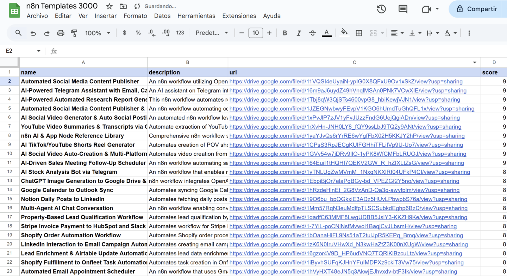

# 📁 +2000 Templates n8n

> Ruta: De Make a n8n › 📁 +2000 Templates n8n

**🎬 Vídeo (3.0 min):** https://www.loom.com/share/cbb3647f6dc84bdab872c519d7ce0847

---

En este módulo te cuento cómo acceder a un pack con más de 2 000 plantillas de automatización para n8n, descargarlas en formato JSON e importarlas directo a tu workspace. Te enseño a revisar la descripción de cada workflow, filtrar opciones y, con ayuda de ChatGPT, elegir las que mejor potencien tu caso específico.  
  
Si alguno de los enlaces llega a expirar, avísame por DM y lo repongo.  
  
[https://docs.google.com/spreadsheets/d/1rLkJ-4fujMXMok5RjuYjFJPhZ0esZ825s6ad2V4dIQ0/edit?usp=sharing](https://docs.google.com/spreadsheets/d/1rLkJ-4fujMXMok5RjuYjFJPhZ0esZ825s6ad2V4dIQ0/edit?usp=sharing)

## 🎙️ Transcripción

Ah, continuación, te voy a mostrar algo que te voy a servir bastante que lo encontré realmente general. Hace un tiempo se filtró una lista con más de 2000 automatizaciones de N8N que puedes empezar a usar. Yo en lo personal he probado algunas y está realmente buena. Cabe destacar que estas no son mis automatizaciones, simplemente son las que sean. Estaba filtrando y dando vueltas acá. Pero mira, te las voy a mostrar y es realmente una brutalidad. O sea, podemos pescar cualquiera de estas dos mil automatizaciones que aparece en acá y podemos empezar a usarla. Si es que abrimos aquí, vamos a ver que tenemos la descripción con todo lo que está haciendo y tenemos el URL alaito. Si es que abrimos el URL, espero que estos URL no expiren, en el caso de que pase, hagan me lo saber, pero lo descargamos como Jason y lo importamos directamente en N8N. Mi recomendación es a veces cuesta leer un poquito este tipo de automatizaciones, sobre todo cuando estamos inundados con más de 2 mil datos. Entonces, subo ante que tomamos todas estas columnas, podemos entrar a chargeterra y le decimos cómo, oye, cuál de estas automatizaciones me puede servir, verdad? Para mi comunidad de Imperio Digital y mi YouTube, por ejemplo, vamos a ir acá a YouTube. y vamos a empezar a hablar interactual directamente con chargiabete en este caso para que nos ayude a Evalor y tomar la mejor decisión. En lo personal, me funcionan bastante bien, sobre todo para ver cuál puedo hacer y cuál me puede servir. Pero tenemos muchas cosas aquí realmente interesantes, no sé de dónde habrá salido realmente, todo esto template, todas estas plantillas, pero están realmente muy, pero muy, muy interesante vi varios acá, geniales como el AI Tiktok, Yudu Short, Real Generator. Algunos son básicos y son de pocas automatizaciones, otros son un poco, o sea, de pocos nodos, y otros son un poquito más extensos, pero recomiendo que empieces a verlos directamente acá. También podemos importarle, directamente todo esto a chargbt nuevamente no encontré genial por ejemplo este acá puede ser social media content o reportes de análisis o cualquier problema que estoy enfrentando le puedo decir hoy estoy enfrentando un problema en o sea clasificación de leads por ejemplo hay algo que me puede servir a cada clasificación de leads y le subimos todos los toda la columna a por ejemplo si es que los tuquen son lo permiten y le decimos ok esta puede ser podemos vamos a empezar a hacerlo por acá, así que espero que te sirva y espero que estos links no expiren, en el caso de que expiren, hagámoslo saber mandenme un DM y más seguro de poder formarierlos bien nuevamente.
